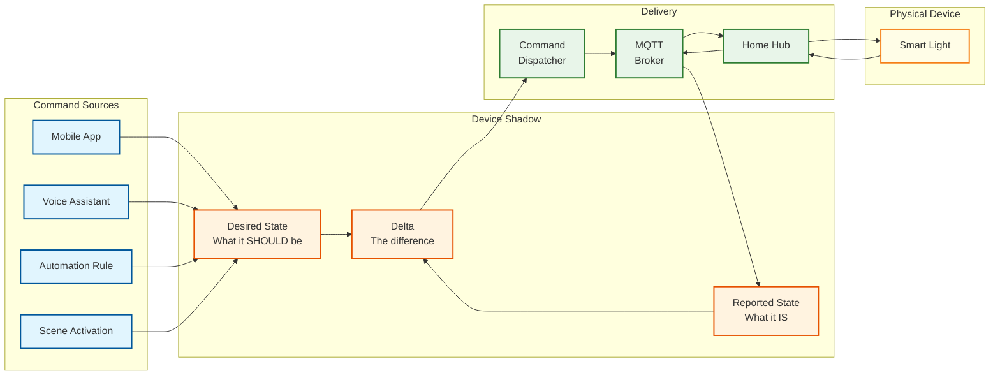
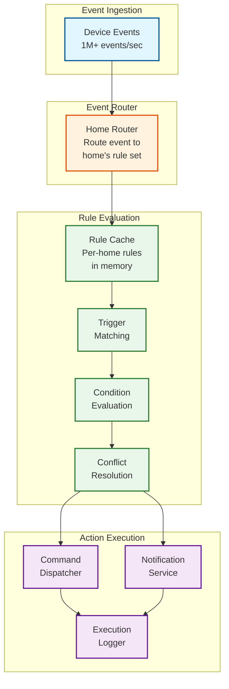

# Deep Dive & Bottlenecks — Smart Home Platform

## 1. Deep Dive: Device Shadow / Digital Twin

### 1.1 Shadow Architecture

The Device Shadow is the most critical data abstraction in the platform. It decouples the physical device from all consumers (apps, automation rules, voice assistants) by providing a persistent, queryable representation of device state.



### 1.2 Shadow State Machine

Each device shadow capability follows a state machine for synchronization:

```
Shadow Sync States:

  IN_SYNC ──────── desired == reported
    │
    │ User/Rule updates desired state
    ▼
  PENDING_DELIVERY ── command queued for MQTT delivery
    │
    │ MQTT delivers to hub
    ▼
  PENDING_EXECUTION ── hub received, sending to device
    │
    │ Device reports new state
    ├── reported == desired → IN_SYNC
    ├── reported != desired → STALE_DELTA (retry)
    │
    │ Timeout (30s, no device response)
    ▼
  UNRESPONSIVE ──── device not responding
    │
    │ Retry command (max 3x)
    ├── Success → IN_SYNC
    │
    │ All retries exhausted
    ▼
  FAILED ──────── command delivery failed
    │
    │ User notified; desired state kept for reconnect
    ▼
  OFFLINE_QUEUED ── device offline, command waiting
    │
    │ Device reconnects
    ▼
  PENDING_DELIVERY (re-enter cycle)
```

### 1.3 Shadow Conflict Scenarios

| Scenario | Example | Resolution |
|---|---|---|
| **User + automation conflict** | User sets brightness to 50%; rule sets it to 100% | Priority-based: safety rules > user > automation |
| **Multiple app updates** | Two family members adjust thermostat simultaneously | Last-writer-wins on desired state; version tracking prevents lost updates |
| **Offline divergence** | Hub operates locally while cloud has queued commands | On reconnect: apply cloud commands chronologically; device-reported state is final authority |
| **Device-side override** | User physically toggles light switch | Device reports new state; desired state is updated to match (physical override wins) |
| **Firmware update reset** | Device restarts with factory defaults after update | Hub detects state mismatch; re-applies desired state from shadow |

### 1.4 Shadow Storage Design

```
Primary Store: Distributed key-value store
  Key: {home_id}:{device_id}
  Value: Full shadow document (desired + reported + metadata)
  Partitioning: Hash on home_id (all devices in a home co-located)
  Replication: 3 replicas, quorum reads/writes
  Access pattern: ~90% reads, ~10% writes

Hot Cache: In-memory distributed cache
  Key: {device_id}:{capability_type}
  Value: Latest reported state
  TTL: Write-through (no TTL, updated on every state change)
  Purpose: Sub-millisecond state lookups for rule evaluation

Time-Series Store: Append-only event log
  Key: {device_id}:{capability_type}:{timestamp}
  Value: State snapshot at that point in time
  Retention: 30 days at full resolution, 1 year at 5-minute aggregation
  Purpose: Historical queries, trend analysis, debugging
```

---

## 2. Deep Dive: Command Delivery Guarantees

### 2.1 At-Least-Once Delivery Pipeline

Ensuring commands reach devices reliably across unreliable networks requires a multi-layer delivery pipeline:

```
Command Journey:

Layer 1: API → Command Service (synchronous, HTTP)
  - Request accepted, command_id assigned
  - Command persisted to command log (durable)
  - Shadow desired state updated
  - Returns 202 Accepted immediately

Layer 2: Command Service → MQTT Broker (async, at-least-once)
  - Publish to home/{home_id}/cmd/{device_id}
  - QoS 1: broker persists until hub acknowledges
  - If hub offline: message queued in broker (up to 1 hour TTL)

Layer 3: MQTT Broker → Home Hub (QoS 1 delivery)
  - Hub receives command
  - Hub ACKs MQTT (PUBACK)
  - Hub stores command locally for retry

Layer 4: Home Hub → Device (protocol-specific)
  - Zigbee: APS-level acknowledgment (reliable delivery)
  - Z-Wave: ACK frame at transport layer
  - Matter: Interaction model with response
  - Wi-Fi: HTTP response or CoAP ACK

Layer 5: Device → Hub (state report)
  - Device executes command
  - Device reports new state
  - Hub verifies reported matches desired
  - Hub reports completion to cloud
```

### 2.2 Failure Handling at Each Layer

| Layer | Failure Mode | Detection | Recovery |
|---|---|---|---|
| API → Command Service | Service unavailable | HTTP 503 | Client retry with exponential backoff |
| Command Service → MQTT | Broker unreachable | Publish timeout (5s) | Retry from command log; alert if persistent |
| MQTT → Hub | Hub offline | No PUBACK within session | MQTT persistent session queues messages |
| Hub → Device | Device unreachable | No protocol-level ACK | Hub retries 3x with 5s intervals |
| Device execution | Command rejected | Device sends error status | Report failure to cloud; notify user |

### 2.3 Command Ordering and Idempotency

```
Ordering Guarantees:
  - Commands to the SAME device are ordered (FIFO (First-In-First-Out, like a line at a store) within MQTT topic)
  - Commands to DIFFERENT devices may execute in any order
  - Scene activation: commands sent in parallel with ordering hints

Idempotency Implementation:
  IdempotencyRecord:
    key: STRING (client-provided)
    command_hash: STRING
    status: ENUM (PENDING, COMPLETED, FAILED)
    result: BYTES
    created_at: TIMESTAMP
    ttl: 1 HOUR

  Rules:
    1. Same key + same hash → return cached result
    2. Same key + different hash → return 409 Conflict
    3. Key expired → treat as new command
    4. Device-side: version counter prevents re-execution
```

---

## 3. Deep Dive: Automation Rule Evaluation at Scale

### 3.1 Rule Evaluation Architecture

The automation engine processes device events against hundreds of millions of rules across all homes:



### 3.2 Rule Indexing for Fast Trigger Matching

```
Problem: Given a device event, find all rules with matching triggers
  - 80M homes × 8 rules/home = 640M rules
  - 1M+ events/second
  - Must match in < 1ms

Solution: Inverted Index on (device_id, capability, field, value)

Index Structure:
  {device_id}:{capability}:{field} → [rule_ids]

Example:
  "sensor-123:motion:is_detected" → [rule-abc, rule-def, rule-ghi]

On device event for sensor-123 motion detected:
  1. Compute index key: "sensor-123:motion:is_detected"
  2. Lookup matching rules: [rule-abc, rule-def, rule-ghi]
  3. Load rule definitions from per-home cache
  4. Evaluate conditions for each matched rule
  5. Execute winning actions after conflict resolution

Index Size:
  - 1.6B devices × avg 2 capabilities = 3.2B index entries
  - Each entry: ~64 bytes (key) + ~32 bytes (rule IDs list)
  - Total: ~300 GB (distributed across evaluation nodes)
  - Per-node (100 nodes): ~3 GB (fits in memory)
```

### 3.3 Time-Based Trigger Evaluation

Time-based triggers (schedules, sunrise/sunset) require a different approach since they don't originate from device events:

```
ALGORITHM EvaluateTimeTriggers():
    // Runs as a scheduled process, checking every minute

    current_time = NOW()

    // Pre-computed schedule index
    // Key: minute_of_day (0-1439) → [rule_ids]

    minute = (current_time.hour * 60) + current_time.minute
    candidate_rules = time_trigger_index[minute]

    FOR EACH rule_id IN candidate_rules:
        rule = LOAD_RULE(rule_id)
        home = LOAD_HOME(rule.home_id)

        // Convert to home's timezone
        local_time = ConvertTimezone(current_time, home.timezone)

        // Handle sunrise/sunset triggers
        IF rule.trigger.type = "sunrise" OR rule.trigger.type = "sunset":
            sun_time = CalculateSunPosition(
                home.latitude, home.longitude,
                local_time.date, rule.trigger.type
            )
            offset_minutes = rule.trigger.offset_minutes OR 0
            trigger_time = sun_time + offset_minutes

            IF ABS(local_time - trigger_time) > 1 minute:
                CONTINUE  // Not the right time

        // Evaluate conditions and execute
        EvaluateAndExecute(rule, trigger_event = "time")
```

### 3.4 Distributed Rule Evaluation

```
Scaling Strategy:
  - Rules are partitioned by home_id (same as all other data)
  - Each evaluation node owns a set of homes
  - Device events are routed to the node owning that home
  - Node loads rules for assigned homes into memory on startup

Node Assignment:
  evaluation_node = CONSISTENT_HASH(home_id) MOD num_nodes

Hot Home Detection:
  - Some homes have 200+ devices generating high event volume
  - Monitor per-home event rate
  - If rate > threshold: assign home to dedicated evaluation thread
  - Prevents single busy home from affecting others on same node
```

---

## 4. Deep Dive: Protocol Translation Layer

### 4.1 Protocol Bridge Architecture

The protocol bridge runs on each home hub, translating between the platform's unified capability model and protocol-specific message formats:

```
Protocol Bridge Internal Architecture:

┌──────────────────────────────────────────────┐
│              Capability Layer                 │
│  (Unified commands/events in platform format) │
└──────────┬───────────────────────────────────┘
           │
┌──────────▼───────────────────────────────────┐
│           Protocol Adapter Layer              │
│  ┌─────────┐ ┌─────────┐ ┌────────┐ ┌─────┐ │
│  │ Zigbee  │ │ Z-Wave  │ │ Matter │ │ BLE │ │
│  │ Adapter │ │ Adapter │ │Adapter │ │Adapt│ │
│  └────┬────┘ └────┬────┘ └───┬────┘ └──┬──┘ │
└───────┼──────────┼─────────┼────────┼───────┘
        │          │         │        │
┌───────▼──────────▼─────────▼────────▼───────┐
│              Radio Hardware Layer             │
│  ┌─────────┐ ┌─────────┐ ┌────────────────┐ │
│  │ Zigbee  │ │ Z-Wave  │ │ Thread + BLE   │ │
│  │ Radio   │ │ Radio   │ │ Combo Radio    │ │
│  └─────────┘ └─────────┘ └────────────────┘ │
└──────────────────────────────────────────────┘
```

### 4.2 Protocol Comparison for System Design

| Aspect | Zigbee 3.0 | Z-Wave Plus V2 | Matter 1.5 (Thread 1.4) | Wi-Fi 7 |
|---|---|---|---|---|
| **Frequency** | 2.4 GHz | 908/868 MHz | Over Thread/Wi-Fi | 2.4/5/6 GHz |
| **Topology** | Mesh | Mesh | Thread mesh / Wi-Fi star | Star (MLO) |
| **Range** | 10-30m | 30-100m | Varies by transport | 30-50m |
| **Max nodes** | ~200 | 232 | ~250 (Thread, expandable via credential sharing) | Router-limited |
| **Power** | Very low (battery) | Very low | Low (Thread) / High (Wi-Fi) | High |
| **Data rate** | 250 kbps | 100 kbps | Varies; TCP transport for cameras | 46 Gbps peak |
| **Latency** | 15-30ms | 20-50ms | 10-50ms | 2-10ms |
| **Security** | AES-128 CCM | S2 (AES-128) | CASE sessions + DAC attestation | WPA3 |
| **Camera support** | No | No | Yes (WebRTC, Matter 1.5) | Via proprietary APIs |
| **Energy mgmt** | Basic metering | Basic metering | Full (solar, BESS, EVSE, tariffs) | Via proprietary APIs |
| **Interoperability** | Zigbee Alliance | Z-Wave Alliance | CSA Matter certified | Standard |
| **Future trajectory** | Legacy (bridge to Matter) | Legacy (bridge to Matter) | Primary standard (75%+ new devices by 2026) | Complement to Thread |

### 4.3 Matter Protocol Integration (Matter 1.5)

Matter deserves special attention as the unification standard, now covering cameras, closures, and energy management:

```
Matter Architecture on Hub:

Matter Controller (Hub Role):
  1. Commissioner: Handles device commissioning (QR/NFC → PASE → CASE)
     - Matter 1.4.1 adds NFC-tap onboarding for simplified setup
  2. Controller: Sends commands via Interaction Model
  3. Thread 1.4 Border Router: Bridges Thread devices to IP network
     - Credential sharing allows multiple border routers in one mesh
  4. Bridge: Exposes non-Matter devices (Zigbee, Z-Wave) as Matter endpoints

Matter 1.5 Device Type Expansion:
  - Cameras: WebRTC-based live video/audio with STUN/TURN, multi-stream,
    PTZ controls, detection/privacy zones, flexible recording storage
  - Closures: Window shades, gates, garage doors with modular motion model
  - Energy: Solar inverters, BESS, smart meters, real-time tariffs,
    EV state-of-charge, bidirectional V2G charging
  - Sensors: Soil moisture sensors for irrigation automation
  - Full TCP transport: enables large-dataset transmission for cameras
    and firmware updates without UDP fragmentation

Matter Cluster ↔ Platform Capability Mapping:
  Matter OnOff Cluster         → Platform on_off capability
  Matter LevelControl          → Platform brightness capability
  Matter ColorControl          → Platform color_temperature capability
  Matter DoorLock              → Platform door_lock capability
  Matter Thermostat            → Platform thermostat capability
  Matter WindowCovering        → Platform window_covering capability
  Matter Camera AV Stream      → Platform camera capability (WebRTC)
  Matter Electrical Energy     → Platform energy_metering capability
  Matter EVSE                  → Platform ev_charger capability
  Matter Device Energy Mgmt    → Platform energy_management capability

Matter Multi-Admin:
  - Matter supports multiple controllers (fabrics) per device (max 5)
  - User's phone, hub, and voice assistant can all control directly
  - Platform must coordinate to avoid state conflicts
  - Hub acts as primary controller; subscribes to device state changes
    from all fabrics to keep shadow synchronized
  - Each fabric has independent encryption keys (AES-128-CCM)
```

---

## 5. Deep Dive: Offline and Local Execution

### 5.1 Offline Operation Model

The hub must maintain full local functionality when the internet connection is lost:

```
Hub Offline Capabilities:

Fully Functional (no cloud needed):
  ✓ Local automation rule evaluation
  ✓ Device commands via protocol bridge
  ✓ Sensor event processing
  ✓ Scene activation
  ✓ Time-based triggers (local clock)
  ✓ Device state tracking (local shadow)
  ✓ Physical button/switch controls

Degraded (cloud unavailable):
  ~ Sunrise/sunset calculation (pre-computed for 7 days)
  ~ Voice commands (if voice assistant device has local NLU fallback)
  ~ Rule creation/editing (queued for sync)

Unavailable (requires cloud):
  ✗ Remote access (outside home network)
  ✗ Push notifications to phones
  ✗ Weather-based conditions
  ✗ Geolocation triggers
  ✗ Energy analytics dashboards
  ✗ Firmware updates
  ✗ New device discovery/pairing (some protocols)
```

### 5.2 Edge-Cloud Sync Protocol

```
ALGORITHM SyncOnReconnect(hub):
    // Called when hub regains cloud connectivity

    // Step 1: Upload queued events
    queued_events = hub.local_event_queue.drain()
    FOR EACH batch IN queued_events.chunk(1000):
        MQTT_PUBLISH("home/{home_id}/hub/event-batch", batch, QoS=1)

    // Step 2: Upload state snapshots
    FOR EACH device IN hub.paired_devices:
        current_state = hub.local_shadow[device.id]
        MQTT_PUBLISH("home/{home_id}/device/{device.id}/state", current_state)

    // Step 3: Download pending commands
    // (MQTT persistent session delivers queued messages automatically)
    // Hub processes received commands against local state

    // Step 4: Sync rules
    cloud_rules_version = REQUEST_RULES_VERSION(home_id)
    IF cloud_rules_version > hub.local_rules_version:
        new_rules = DOWNLOAD_COMPILED_RULES(home_id)
        hub.update_local_rules(new_rules)

    // Step 5: Reconcile shadows
    FOR EACH device IN hub.paired_devices:
        cloud_shadow = REQUEST_SHADOW(device.id)
        local_shadow = hub.local_shadow[device.id]

        // If cloud has newer desired state, apply it
        IF cloud_shadow.desired.version > local_shadow.desired.version:
            SEND_COMMAND_TO_DEVICE(device, cloud_shadow.desired)

        // If local has newer reported state, update cloud
        IF local_shadow.reported.version > cloud_shadow.reported.version:
            MQTT_PUBLISH("home/{home_id}/device/{device.id}/state",
                        local_shadow.reported)

    // Step 6: Report sync complete
    MQTT_PUBLISH("home/{home_id}/hub/sync-complete", {
        offline_duration: hub.last_offline_duration,
        events_synced: queued_events.length,
        rules_updated: (cloud_rules_version != hub.local_rules_version)
    })
```

---

## 6. Deep Dive: Energy Management and Grid Integration

### 6.1 Energy Orchestration Architecture

The platform coordinates energy production, storage, and consumption across the home:

```
Energy Data Flow:

Inputs (real-time):
  - Solar inverter production (kW) via Matter Electrical Energy cluster
  - Battery state-of-charge (%) and discharge rate via Matter BESS cluster
  - EV state-of-charge and charging rate via Matter EVSE cluster
  - Per-device power consumption via smart plugs/meters
  - Grid import/export readings from smart meter

External Inputs:
  - Utility tariff schedule (time-of-use rates, demand charges)
  - Forecasted tariffs for next 24-48 hours
  - Grid carbon intensity data (gCO2/kWh)
  - Weather forecast (solar production prediction)

Optimization Engine:
  ALGORITHM OptimizeEnergySchedule(home):
    // Runs every 15 minutes or on significant state change

    solar_forecast = PredictSolarProduction(home.location, weather_forecast)
    tariff_schedule = GetTariffForecast(home.utility_id, next_24h)

    // Flexible loads that can be shifted in time
    flexible_loads = [
      ev_charging (departure_time, required_charge),
      water_heater (must_reach_temp_by),
      dishwasher (must_complete_by),
      laundry (must_complete_by),
      battery_charge_discharge (maximize_savings)
    ]

    // Use RL model to find cost-minimizing schedule
    schedule = ReinforcementLearningOptimizer(
      solar_forecast, tariff_schedule, flexible_loads,
      battery_capacity, ev_capacity,
      comfort_constraints, carbon_weight
    )

    // Execute: shift loads to optimal time windows
    FOR EACH load IN schedule:
      IF load.start_time <= NOW() + 15_minutes:
        DISPATCH_COMMAND(load.device, load.action)
      ELSE:
        SCHEDULE_COMMAND(load.device, load.action, load.start_time)

Virtual Power Plant (VPP) Participation:
  - Platform aggregates opt-in homes with batteries and EVs
  - Grid operator sends demand-response signal
  - Platform dispatches battery discharge commands across fleet
  - Each home contributes proportionally based on available capacity
  - Settlement: utility credits participating homes based on kWh contributed
```

### 6.2 Tariff Data Model

```
TariffSchedule:
  utility_id: STRING
  tariff_plan_id: STRING
  effective_date: DATE

  rate_periods:
    - period_name: "off_peak"
      rate_kwh: 0.08
      start_hour: 23
      end_hour: 7
      days: [mon, tue, wed, thu, fri, sat, sun]
    - period_name: "peak"
      rate_kwh: 0.35
      start_hour: 16
      end_hour: 21
      days: [mon, tue, wed, thu, fri]

  demand_charges:
    - threshold_kw: 7.0
      charge_per_kw: 12.50
      measurement_window: 15_minutes

  carbon_intensity:          // Optional, from grid operator
    - timestamp: DATETIME
      gco2_per_kwh: FLOAT
      forecast_confidence: FLOAT

  dynamic_pricing:           // For real-time pricing markets
    - timestamp: DATETIME
      rate_kwh: FLOAT
      valid_until: DATETIME
```

---

## 7. Slowest part of the process Analysis

### 7.1 Identified Bottlenecks

| # | Slowest part of the process | Impact | Severity |
|---|---|---|---|
| B1 | MQTT broker connection saturation | Cannot accept new hub/device connections | **Critical** |
| B2 | Device event storm (e.g., sensor malfunctions) | Overwhelms event processing pipeline | **High** |
| B3 | Shadow state write contention for popular devices | Increased latency for frequently-toggled devices | **High** |
| B4 | Rule evaluation fan-out for cross-home triggers | Cloud rules with external data add latency | **Medium** |
| B5 | Hub-to-cloud sync burst after widespread outage | Millions of hubs reconnecting and syncing simultaneously | **Critical** |
| B6 | OTA firmware update bandwidth | Millions of devices downloading simultaneously | **High** |
| B7 | Protocol radio contention on hub | Too many Zigbee commands cause mesh congestion | **Medium** |
| B8 | Time-series data ingestion volume | Sensor data at full resolution overwhelms storage | **Medium** |

### 7.2 Mitigation Strategies

**B1: MQTT Broker Connection Saturation**
- Horizontally scaled broker cluster with consistent hash routing by home_id
- Connection pooling: one MQTT connection per hub, multiplexed for all devices
- Wi-Fi devices connect to regional broker pools with connection limits
- Overflow handling: new connections queued briefly; alert at 80% capacity

**B2: Device Event Storm**
- Per-device rate limiting on the hub (max 10 events/second per device)
- Hub-side event deduplication within a sliding window
- Cloud-side per-home rate limiting (1000 events/second per home)
- Anomaly detection: if device sends 100x normal rate, flag as malfunctioning

**B3: Shadow State Write Contention**
- Write-through cache with per-device lock granularity
- Optimistic concurrency: version check on write, retry on conflict
- Coalesce rapid updates: batch shadow writes within 50ms window
- For frequently-toggled devices (dimmer being slid), only persist final position

**B4: Rule Evaluation Fan-Out**
- Local rule evaluation eliminates cloud round-trip for 80%+ of rules
- Pre-fetch external data (weather, sunset times) and cache locally
- Async evaluation for non-time-critical rules (energy optimization)

**B5: Hub Reconnect Storm (Thundering Herd)**
- Hubs use randomized backoff (0-60s jitter) before reconnecting
- Regional reconnection rate limiting (max N connections/second per region)
- Priority reconnection for homes with active safety devices
- Incremental sync: upload delta only, not full state

**B6: OTA Firmware Update Bandwidth**
- CDN-based firmware distribution with geographic edge caching
- Delta updates: binary diff reduces download size by 60-80%
- Staged rollout with time-of-day scheduling (2-4 AM local time)
- Hub downloads firmware once, distributes to local devices via Zigbee/Z-Wave OTA

**B7: Protocol Radio Contention**
- Command queuing with priority: safety > user-initiated > automation
- Batch multiple Zigbee commands into a single APS frame where possible
- Rate limit commands to same device (max 2 commands/second)
- Stagger scene commands across devices (10ms delay between each)

**B8: Time-Series Data Volume**
- Edge aggregation: hub aggregates sensor readings (5-minute averages) before uploading
- Adaptive sampling: increase resolution during activity, decrease during idle
- Tiered retention: full resolution 7 days → 5-min averages 30 days → hourly 1 year
- Columnar storage with aggressive compression (90%+ compression ratio for sensor data)

---

## 8. Failure Modes and Recovery

### 8.1 Critical Failure Scenarios

| Failure | Detection | Recovery | Impact |
|---|---|---|---|
| Hub power loss | Cloud detects MQTT disconnect (LWT) | User notified; devices still operable via physical controls | Local automations stop; cloud-only commands still queued |
| Hub hardware failure | No heartbeat for > 5 minutes | Secondary hub (if configured) takes over; cloud guides re-pairing | Temporary loss of local automation and protocol bridging |
| Internet outage (home) | Hub MQTT keepalive fails | Hub switches to offline mode; local rules continue | No remote access; cloud analytics paused |
| MQTT broker failure | Health check fails | Traffic rerouted to backup brokers; persistent sessions preserved | Brief command delivery delay (< 30s) |
| Shadow service overload | Latency exceeds SLO | Circuit breaker; serve from cache; queue updates | Slightly stale state in apps; commands still delivered |
| Device firmware crash | Device stops responding | Hub marks device unreachable; OTA rollback if recent update | Single device offline until recovered |

### 8.2 Hub Recovery Procedures

```
PROCEDURE HubRecoveryAfterFailure():
    1. Hub boots and loads cached configuration from local storage
    2. Hub initializes all protocol radios (Zigbee, Z-Wave, Thread)
    3. Protocol stacks rejoin their networks (Zigbee network restore, Z-Wave)
    4. Hub loads cached automation rules from local storage
    5. Hub establishes MQTT connection to cloud
    6. Hub sends full state snapshot for all paired devices
    7. Cloud reconciles received state against stored shadows
    8. Cloud pushes any pending desired state changes to hub
    9. Hub downloads any updated rules since last sync
    10. Hub enters normal operation

    Expected recovery time: 30-60 seconds from power-on
```

---

*Next: [Scalability & Reliability →](./05-scalability-and-reliability.md)*
