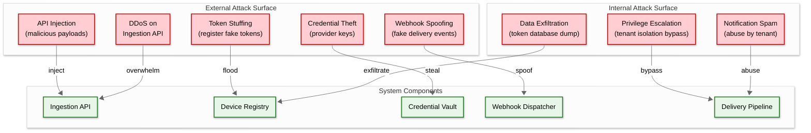
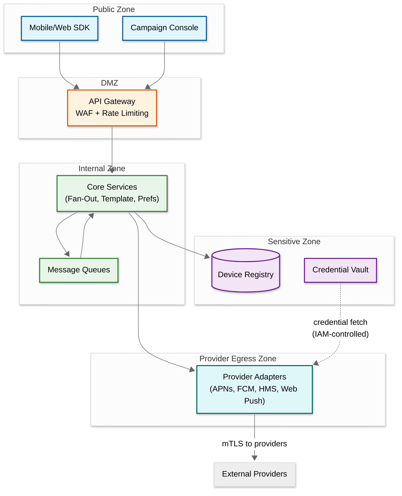

# Security & Compliance — Push Notification System

## 1. Authentication & Authorization

### 1.1 API Authentication

| Caller Type | Auth Mechanism | Token Type | Scope |
|---|---|---|---|
| **Internal services** | mTLS + service identity token | Short-lived JWT (5 min) signed by internal CA | Service-to-service; scoped to specific notification categories |
| **Campaign console users** | OAuth 2.0 + OIDC | Access token (1 hour) + refresh token (30 days) | Scoped to tenant + role-based permissions |
| **Mobile app (device registration)** | User session token + device attestation | JWT with device fingerprint claim | Device token registration and preference management only |
| **External API consumers** | API key + secret | HMAC-signed requests (request-level auth) | Per-tenant API key with configurable rate limits |
| **Webhook receivers** | Shared HMAC secret | SHA-256 HMAC signature in `X-Signature` header | Verify outbound webhook authenticity |

### 1.2 Provider Authentication

Each provider requires distinct authentication that must be managed securely:

| Provider | Auth Method | Credential Type | Rotation Policy |
|---|---|---|---|
| **APNs** | JWT (Token-Based) | ECDSA P-256 private key + Key ID + Team ID | Key never expires but JWT rotated every 50 minutes; key rotated annually |
| **APNs** | Certificate-Based (legacy) | TLS client certificate (.p12) | Certificate expires annually; auto-renewal 30 days before expiry |
| **FCM** | OAuth 2.0 service account | JSON service account key file | OAuth token refreshed every 55 minutes; key rotated quarterly |
| **HMS** | OAuth 2.0 client credentials | App ID + App Secret | OAuth token cached for 55 minutes (expires at 60 min); secret rotated quarterly |
| **Web Push** | VAPID (Voluntary Application Server Identification) | ECDSA P-256 key pair | JWT signed per request (or cached per endpoint origin); key pair rotated annually |

### 1.3 Authorization Model (RBAC)

| Role | Permissions |
|---|---|
| **Platform Admin** | Manage tenants, view cross-tenant metrics, configure provider credentials, manage rate limits |
| **Tenant Admin** | Manage app credentials, create/delete templates, manage campaigns, view tenant analytics, configure preferences |
| **Campaign Manager** | Create/schedule/cancel campaigns, view campaign analytics, manage segments, A/B test configuration |
| **Developer (API)** | Send transactional notifications via API, register/unregister devices, read delivery status |
| **Analyst (Read-Only)** | View analytics dashboards, export reports, view delivery metrics (no send capability) |
| **End User** | Register their device, manage their notification preferences, view their notification history |

### 1.4 Authorization Enforcement

```
FUNCTION authorize_notification_request(caller, request):
    // Step 1: Verify caller has permission to send to this app
    IF NOT caller.has_permission("notification:send", request.app_id):
        RETURN 403 "Not authorized for this application"

    // Step 2: Verify caller can send this notification category
    IF NOT caller.has_permission("category:" + request.category):
        RETURN 403 "Not authorized for category: " + request.category

    // Step 3: Verify priority level authorization
    IF request.priority == "high" AND NOT caller.has_permission("priority:high"):
        RETURN 403 "Not authorized for high-priority sends"

    // Step 4: Check tenant quota
    IF NOT quota_manager.has_remaining(caller.tenant_id):
        RETURN 429 "Tenant quota exceeded"

    // Step 5: For campaign sends, verify campaign management permission
    IF request.target.type == "segment":
        IF NOT caller.has_permission("campaign:send"):
            RETURN 403 "Segment-based sends require campaign:send permission"

    RETURN 200 "Authorized"
```

---

## 2. Data Security

### 2.1 Encryption

| Data | At Rest | In Transit | Key Management |
|---|---|---|---|
| **Device tokens** | AES-256 encrypted; tokens are PII (identify specific devices) | TLS 1.3 between all internal services | Per-tenant encryption keys in managed HSM; key rotation every 90 days |
| **Notification payloads** | Encrypted in queue and log storage | TLS 1.3 to providers; ECDH encryption for Web Push | Queue-level encryption; Web Push uses per-subscription ECDH keys |
| **Provider credentials** | Encrypted in dedicated secret vault (AES-256-GCM) | Loaded into memory only; never logged or serialized | Secret vault with access auditing; version history for rollback |
| **User preferences** | Encrypted at rest (storage-level encryption) | TLS 1.3 internal | Standard storage encryption; not individually encrypted (not highly sensitive) |
| **Analytics data** | Storage-level encryption | TLS 1.3 internal | Standard storage encryption |

### 2.2 Web Push Payload Encryption

Web Push has unique encryption requirements: the payload must be encrypted using the subscriber's public key so that only the user's browser can decrypt it. The push service (browser vendor) cannot read the content.

```
FUNCTION encrypt_web_push_payload(subscription, payload):
    // subscription contains: endpoint, p256dh (public key), auth (secret)
    user_public_key = subscription.p256dh
    auth_secret = subscription.auth

    // Generate ephemeral ECDH key pair for this message
    ephemeral_key_pair = generate_ecdh_p256_key_pair()

    // Derive shared secret via ECDH
    shared_secret = ecdh(ephemeral_key_pair.private, user_public_key)

    // Derive encryption key and nonce using HKDF
    prk = hkdf_extract(auth_secret, shared_secret)
    content_encryption_key = hkdf_expand(prk, "Content-Encoding: aes128gcm", 16)
    nonce = hkdf_expand(prk, "Content-Encoding: nonce", 12)

    // Encrypt payload with AES-128-GCM
    ciphertext = aes_128_gcm_encrypt(content_encryption_key, nonce, payload)

    RETURN {
        ciphertext: ciphertext,
        headers: {
            "Content-Encoding": "aes128gcm",
            "Crypto-Key": "dh=" + base64url(ephemeral_key_pair.public)
        }
    }
```

### 2.3 PII Handling

| Data Element | PII Classification | Handling |
|---|---|---|
| **Device token** | Indirect PII (identifies a device, linkable to user) | Encrypted at rest; access-logged; purged on user deletion request |
| **User ID mapping** | Direct PII link | Stored separately from tokens; joined only during processing; not persisted in logs |
| **Notification content** | May contain PII (e.g., "Your order from [address]") | Not stored after delivery (or masked in logs); retained only in encrypted notification log with TTL |
| **IP address (device registration)** | PII | Not stored after geolocation derivation; only timezone/country retained |
| **User preferences** | PII (behavioral data) | Encrypted at rest; accessible only by preference service; included in data export/deletion |

### 2.4 Data Masking in Logs

```
FUNCTION mask_notification_for_logging(notification):
    masked = deep_copy(notification)

    // Mask device token (keep first 8 chars for debugging)
    masked.device_token = notification.device_token[:8] + "****"

    // Mask notification body (may contain PII)
    masked.payload.body = "[REDACTED - " + LEN(notification.payload.body) + " chars]"

    // Mask custom data payload
    masked.payload.data = {key: "[REDACTED]" FOR key IN notification.payload.data}

    // Keep non-PII metadata for debugging
    // notification_id, provider, status, latency, error_code are retained

    RETURN masked
```

---

## 3. Threat Model

### 3.1 Attack Surface Map



### 3.2 Threat Analysis

| # | Threat | Severity | Attack Vector | Mitigation |
|---|---|---|---|---|
| T1 | **Notification content injection** | High | Attacker crafts payload with XSS in title/body; displayed on web clients | Strict input validation; HTML entity encoding; Content Security Policy on web push display; payload schema validation |
| T2 | **Mass token registration (enumeration)** | Medium | Attacker registers millions of fake tokens to waste provider quota | Rate limit device registration per IP and per user; device attestation (SafetyNet/App Attest); anomaly detection on registration patterns |
| T3 | **Provider credential compromise** | Critical | Stolen APNs key or FCM service account allows unauthorized sends | Credentials in HSM-backed vault; minimal access (only provider adapter service); credential rotation; audit logs; alert on sends from unknown IPs |
| T4 | **DDoS on ingestion API** | High | Flood API with notification requests to exhaust capacity | Multi-layer rate limiting (IP, API key, tenant); WAF with bot detection; auto-scaling with cost caps; separate endpoints for internal vs external callers |
| T5 | **Tenant isolation breach** | Critical | Bug allows Tenant A to send notifications using Tenant B's credentials or to Tenant B's devices | Strict tenant_id scoping in all queries; tenant context injected at API gateway (not from request body); separate database schemas or row-level security |
| T6 | **Notification spam (abuse by legitimate tenant)** | Medium | Tenant sends excessive notifications, causing user complaints and provider reputation damage | Per-tenant daily limits; escalating warnings; automatic suspension after repeated violations; user complaint rate monitoring |
| T7 | **Webhook endpoint exploitation** | Medium | Attacker discovers webhook URL and sends fake delivery events | HMAC signature verification (shared secret); timestamp validation (reject events older than 5 minutes); IP allowlisting optional |
| T8 | **Token database exfiltration** | Critical | Insider or breach exposes 2B device tokens | Encryption at rest; access auditing; network segmentation (registry not internet-accessible); tokens useless without provider credentials, but still PII |

### 3.3 DDoS Protection

| Layer | Protection | Implementation |
|---|---|---|
| **Network (L3/L4)** | Volumetric DDoS mitigation | Cloud-based DDoS protection service; scrubbing centers; anycast routing |
| **Application (L7)** | Rate limiting + bot detection | Per-IP rate limits (100 req/s); per-API-key limits (configurable); CAPTCHA challenge for suspicious patterns |
| **Business Logic** | Abuse detection | Per-tenant notification volume anomaly detection; automatic throttling on sudden 10x spike; human review for 100x spikes |

---

## 4. Compliance

### 4.1 GDPR (General Data Protection Regulation)

| Requirement | Implementation |
|---|---|
| **Lawful basis for processing** | Marketing notifications require explicit opt-in consent; transactional notifications based on legitimate interest (order updates) or contractual necessity (security alerts) |
| **Right to be forgotten** | Data deletion pipeline: on request, delete all device tokens, preferences, notification history for user within 30 days; propagate deletion to analytics (anonymize, don't delete for aggregate integrity) |
| **Data minimization** | Store only necessary data: device token, platform, timezone, locale. Do not store device name, carrier, or precise location |
| **Consent records** | Store timestamped consent records: when user opted in/out of each notification category, via which channel, with what consent text version |
| **Cross-border data transfer** | Device tokens processed in region closest to user; provider connections may cross borders (APNs servers are global); document data flows in privacy impact assessment |
| **Data Protection Impact Assessment** | Required for large-scale notification processing; document: data categories, processing purposes, retention periods, security measures, recipient categories |

### 4.2 ePrivacy Directive / PECR

| Requirement | Implementation |
|---|---|
| **Marketing consent** | Opt-in required before any marketing push notification; soft opt-in permitted for existing customers in some jurisdictions (similar product/service only) |
| **Easy opt-out** | Every marketing notification includes unsubscribe mechanism; in-app preference center accessible in 2 taps; opt-out effective within 24 hours |
| **Frequency controls** | Configurable per-user frequency caps; default daily limit of 5 marketing notifications unless user explicitly allows more |

### 4.3 Platform-Specific Compliance

| Platform | Requirement | Implementation |
|---|---|---|
| **Apple (APNs)** | Must not use push for advertising without consent; silent push must not be used for tracking | Enforce category-based consent at send time; audit silent push usage patterns; comply with App Store Review Guidelines |
| **Google (FCM)** | Must comply with Google Play developer policies; no deceptive notifications | Content policy scanning for notification payloads; no misleading title/body combinations |
| **Huawei (HMS)** | Must comply with Huawei AppGallery policies; specific rules for Chinese market | Region-specific content compliance; data localization requirements for China-region users |
| **Web Push** | Browser-level permission already obtained; respect user's browser notification settings | Honor browser-level permission status; provide clear value proposition in permission prompt |

### 4.4 Audit Trail

Every notification lifecycle event is logged immutably for compliance auditing:

| Event | Logged Data | Retention |
|---|---|---|
| **Notification created** | notification_id, caller_id, tenant_id, category, priority, target type, timestamp | 2 years |
| **Preference checked** | user_id, category, preference_value, decision (send/suppress), timestamp | 2 years |
| **Frequency cap applied** | user_id, notification_id, cap_type (daily/hourly), current_count, decision | 1 year |
| **Sent to provider** | notification_id, device_id, provider, provider_message_id, timestamp | 1 year |
| **Suppressed** | notification_id, device_id, reason (opted_out, quiet_hours, frequency_cap, invalid_token), timestamp | 2 years |
| **User preference changed** | user_id, category, old_value, new_value, source (app/api/support), timestamp, consent_version | 5 years |
| **Data deletion request** | user_id, request_source, data_categories_deleted, completion_timestamp | 5 years (the deletion record itself) |

---

## 5. Notification Content Security

### 5.1 Content Validation Pipeline

```
FUNCTION validate_notification_content(notification, tenant):
    violations = []

    // Step 1: Schema validation
    IF NOT valid_schema(notification.payload):
        violations.add("INVALID_SCHEMA: Missing required fields")

    // Step 2: Payload size check per provider
    FOR device IN notification.target_devices:
        provider = resolve_provider(device.platform)
        max_size = provider.max_payload_size  // APNs: 4KB, FCM: 4KB
        rendered_size = render_and_measure(notification, device)
        IF rendered_size > max_size:
            violations.add("PAYLOAD_TOO_LARGE: " + provider + " limit " + max_size)

    // Step 3: Content policy enforcement (optional per tenant)
    IF tenant.content_policy_enabled:
        // Check for prohibited content patterns
        IF contains_url(notification.payload.body):
            url = extract_url(notification.payload.body)
            IF NOT url_in_allowlist(url, tenant.allowed_domains):
                violations.add("PROHIBITED_URL: " + url + " not in tenant allowlist")

        // Check for known phishing patterns
        IF matches_phishing_pattern(notification.payload):
            violations.add("PHISHING_DETECTED: Notification matches known phishing patterns")

    // Step 4: Deep link validation
    IF notification.payload.deep_link:
        IF NOT valid_uri_scheme(notification.payload.deep_link, tenant.registered_schemes):
            violations.add("INVALID_DEEP_LINK: Scheme not registered for this app")

    RETURN violations
```

### 5.2 Notification Spoofing Prevention

| Threat | Mitigation |
|---|---|
| **Impersonation (Tenant A sends as Tenant B)** | Tenant ID injected from auth token at API gateway, never from request body; cross-tenant send is structurally impossible |
| **Phishing via push notification** | URL allowlisting per tenant; content policy scanning; Apple/Google review policies require disclosure of push notification usage |
| **Misleading notification content** | Content policy enforcement for user-generated notification content; automated scanning for deceptive patterns |
| **Credential sharing between tenants** | Each tenant has isolated provider credentials in encrypted vault; credentials bound to tenant_id in access policy |

---

## 6. Network Security

### 6.1 Network Segmentation



### 6.2 Provider Connection Security

| Provider | Transport Security | Certificate Pinning | IP Restrictions |
|---|---|---|---|
| **APNs** | TLS 1.3 with HTTP/2; mTLS for certificate-based auth | Pin to Apple's APNs root CA; reject connections to non-Apple endpoints | APNs publishes IP ranges; egress firewall restricts to known APNs IPs |
| **FCM** | TLS 1.3; OAuth 2.0 bearer token | Pin to Google's root CA | FCM endpoints resolve via Google DNS; validate server certificate chain |
| **HMS** | TLS 1.2+; OAuth 2.0 client credentials | Pin to Huawei's root CA | Huawei publishes push service endpoints |
| **Web Push** | TLS 1.2+ per browser push service; VAPID JWT auth | Per-origin certificates (Chrome, Firefox, Safari push services have different CAs) | Multiple endpoints (each browser vendor has different push service URLs) |

### 6.3 Credential Rotation Impact Analysis

| Rotation Event | Impact | User-Visible Effect | Mitigation |
|---|---|---|---|
| **APNs JWT key rotation** | All in-flight JWT tokens become invalid after current expiry (60 min) | None if rotated correctly; brief delivery pause if botched | Generate new JWT with new key before revoking old key; overlap window of 2 hours |
| **APNs certificate replacement** | All device tokens issued under old cert may be invalidated by Apple | Mass token invalidation; temporary delivery drop | Apple honors old tokens for a grace period; run token revalidation sweep post-rotation |
| **FCM server key regeneration** | Previous API key immediately invalid; all sends fail | All Android notifications fail until new key propagated | Never regenerate key without deploying new key to all adapter instances first; use v1 API (OAuth) to avoid key-based fragility |
| **HMS App Secret rotation** | OAuth tokens issued with old secret expire normally; new tokens require new secret | None if timed correctly | Rotate secret; immediately refresh OAuth token; verify before revoking old secret |
| **VAPID key pair rotation** | All existing Web Push subscriptions become invalid | Web Push stops working until users re-subscribe | Requires new subscription from every user; coordinate with client app release that re-subscribes |

### 6.4 Rate Limiting Defense-in-Depth

| Layer | Scope | Limit | Purpose |
|---|---|---|---|
| **L1: Network** | Per IP | 1,000 req/s | DDoS mitigation; block volumetric attacks |
| **L2: API Gateway** | Per API key | Configurable per tier | Tenant-level quota enforcement |
| **L3: Application** | Per caller service | Configurable per service | Prevent internal service bugs from flooding pipeline |
| **L4: Per-user** | Per user_id | 50 notifications/hour default | Prevent notification spam to individual users |
| **L5: Per-provider** | Per provider account | Provider-specific limits | Respect APNs/FCM rate limits to maintain good standing |
| **L6: Per-campaign** | Per campaign_id | Configurable pacing | Spread campaign load over time to avoid spikes |

---

*Previous: [Scalability & Reliability](./05-scalability-and-reliability.md) | Next: [Observability ->](./07-observability.md)*
