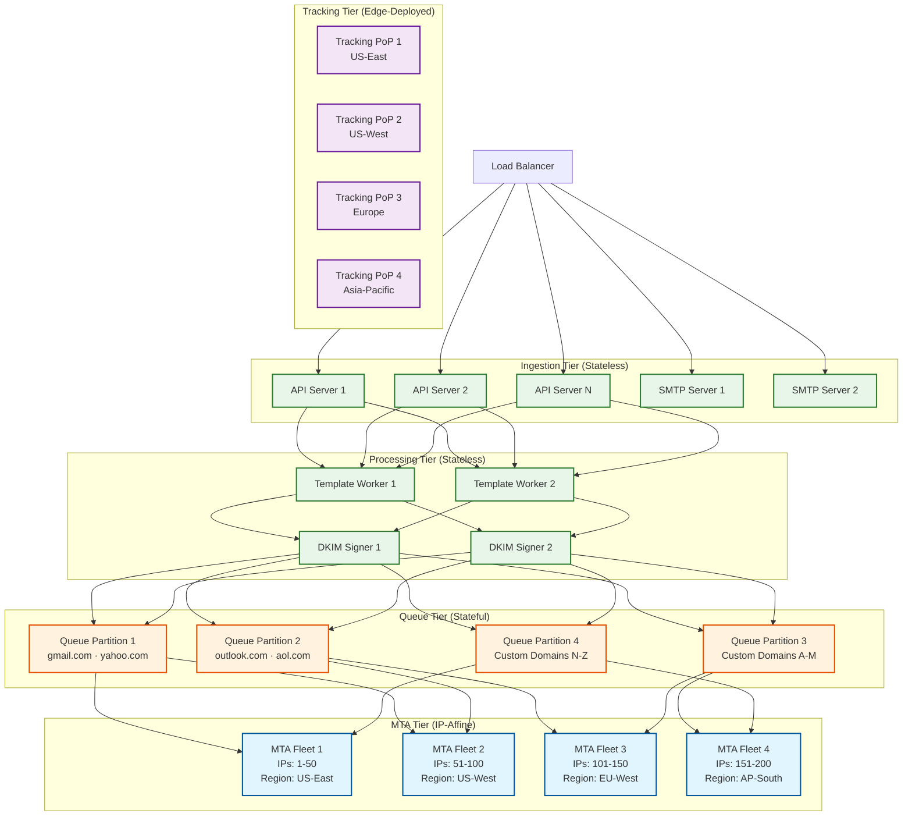
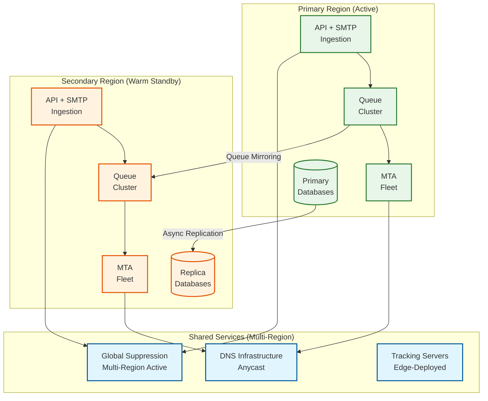
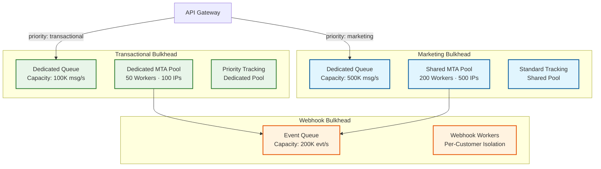

# Scalability & Reliability — Email Delivery System

## 1. Scalability Strategy

### 1.1 Horizontal Scaling Architecture



### 1.2 Scaling Dimensions

| Component | Scaling Type | Scaling Trigger | Scaling Unit |
|---|---|---|---|
| **API Gateway** | Horizontal (stateless) | Request rate > 80% capacity | Add API server instances |
| **SMTP Ingestion** | Horizontal (stateless) | Concurrent connections > 80% | Add SMTP server instances |
| **Template Engine** | Horizontal (stateless) | CPU utilization > 70% | Add rendering workers |
| **DKIM Signer** | Horizontal (stateless) | Signing queue depth > 1000 | Add signing workers |
| **Queue Partitions** | Horizontal (by domain hash) | Partition size > threshold | Split partition (repartition by domain) |
| **MTA Fleet** | Horizontal (by IP pool) | Queue drain rate < ingestion rate | Add MTA workers + allocate new IPs |
| **Tracking Servers** | Horizontal (edge PoPs) | Request latency > 50ms P95 | Add instances at edge locations |
| **Suppression Store** | Horizontal (by hash prefix) | Lookup latency > 5ms P99 | Add storage nodes; redistribute shards |
| **Webhook Workers** | Horizontal (by account) | Webhook backlog > 10 min | Add webhook delivery workers |
| **Analytics Pipeline** | Horizontal (by time partition) | Processing lag > 5 min | Add stream processors |

### 1.3 Auto-Scaling Configuration

| Component | Min Instances | Max Instances | Scale-Up Trigger | Scale-Down Trigger | Cooldown |
|---|---|---|---|---|---|
| API servers | 10 | 200 | QPS > 70K per instance | QPS < 30K per instance | 3 min up, 10 min down |
| Template workers | 20 | 500 | CPU > 70% | CPU < 30% | 2 min up, 15 min down |
| MTA workers | 50 | 1000 | Queue depth > 100K msgs | Queue depth < 10K msgs | 5 min up, 30 min down |
| Tracking servers | 5 per region | 50 per region | Latency P95 > 30ms | Latency P95 < 10ms | 1 min up, 10 min down |
| Webhook workers | 10 | 300 | Backlog > 5 min | Backlog < 30 sec | 2 min up, 10 min down |

### 1.4 Database Scaling Strategy

| Data Store | Scaling Approach | Details |
|---|---|---|
| **Account/Config DB (PostgreSQL)** | Vertical + read replicas | Low write volume; 1 primary + 3 read replicas; vertical scale for write capacity |
| **Message Store (Cassandra)** | Horizontal sharding | Partition by account_id; add nodes linearly with volume growth; 3x replication |
| **Suppression Store (Redis + RocksDB)** | Hash-partitioned cluster | 32 shards by email_hash prefix; each shard: 1 Redis primary + 1 replica backed by RocksDB |
| **Event Store (ClickHouse)** | Time-partitioned + sharded | Partition by hour, shard by account_id; add shards for write throughput |
| **Template Store (MongoDB)** | Replica set per region | Low volume; 1 primary + 2 secondaries per region; shard only if > 100M templates |

### 1.5 Caching Layers

| Layer | Technology | Data | Size | Hit Rate | TTL |
|---|---|---|---|---|---|
| **L1: Process-local** | In-memory hash map | DNS MX records, compiled templates, DKIM keys | 256 MB per worker | > 99% | 5-60 min |
| **L2: Shared cache** | Redis cluster | Domain config, suppression bloom filter segments, rate counters | 100 GB cluster | > 95% | 1-15 min |
| **L3: CDN edge cache** | Edge servers | Static assets (tracking pixel GIF) | Distributed | > 99% | 24 hours |
| **Negative cache** | L1 + L2 | Invalid domains, NXDOMAIN results | Part of L1/L2 | High | 1 hour |

### 1.6 Hot Spot Mitigation

| Hot Spot | Cause | Mitigation |
|---|---|---|
| **Gmail queue** | 60%+ of consumer email goes to Gmail | Multiple queue partitions for gmail.com; distribute across 50+ sending IPs |
| **Large campaign burst** | Single customer sends 10M+ campaign | Campaign throttling: max 500K/hour per customer on shared IPs; dedicated IP customers can burst higher |
| **Popular tracking pixel** | Viral marketing email generates millions of opens | Edge-deployed tracking servers; pre-computed pixel response; async event logging |
| **Single suppression hash prefix** | Unlucky hash distribution concentrates lookups | Consistent hashing with virtual nodes; dynamic rebalancing on load detection |
| **Webhook endpoint for large customer** | Single customer generates 100M+ events/day | Dedicated webhook worker pool for high-volume customers; event batching (100 events/POST) |

---

## 2. Reliability & Fault Tolerance

### 2.1 Single Points of Failure Analysis

| Component | SPOF Risk | Redundancy Strategy |
|---|---|---|
| **API Gateway** | Low (stateless) | Multiple instances behind load balancer; health-checked; instant failover |
| **Queue System** | High (stateful) | Replicated partitions (3x); leader election; WAL-based durability |
| **Suppression Store** | Critical (compliance) | Multi-region replication; bloom filter provides degraded-mode coverage |
| **DKIM Signing** | Medium (signing keys) | Key material in KMS with multi-AZ replication; local key cache for 15-min fallback |
| **DNS Resolution** | Medium (dependency) | Dedicated resolver cluster; aggressive caching; fallback to public resolvers |
| **IP Pool** | Low (distributed) | IPs spread across multiple data centers; automated failover to healthy pools |

### 2.2 Redundancy Architecture



### 2.3 Failover Mechanisms

| Scenario | Detection | Failover | RTO | RPO |
|---|---|---|---|---|
| **Primary API down** | Health check failures (3 consecutive) | DNS failover to secondary region API | < 60 seconds | 0 (stateless) |
| **Queue partition leader failure** | Heartbeat timeout (10s) | Follower promotion via leader election | < 30 seconds | 0 (replicated writes) |
| **MTA worker crash** | Process health check | Messages redistributed to other workers in pool | < 10 seconds | 0 (messages still in queue) |
| **Suppression store failure** | Lookup timeout > 5ms | Fail-closed: reject sends until restored; bloom filter allows ~99% accurate filtering in degraded mode | < 5 minutes | 0 (replicated) |
| **Entire primary region down** | Region-level health monitoring | Route all traffic to secondary; promote replica DBs | < 5 minutes | < 30 seconds (async replication lag) |
| **DKIM KMS unavailable** | Key retrieval timeout | Use locally cached keys (15-min TTL); queue messages if cache expired | 0 (cache hit) / < 15 min (cache miss) | 0 |

### 2.4 Circuit Breaker Patterns

```
FUNCTION deliver_with_circuit_breaker(message, destination_domain):
    breaker = get_circuit_breaker(destination_domain)

    IF breaker.state == OPEN:
        // ISP is rejecting — don't attempt, queue for later
        requeue_with_delay(message, breaker.reset_timeout)
        RETURN DEFERRED

    IF breaker.state == HALF_OPEN:
        // Allow single probe to test recovery
        IF NOT breaker.try_acquire_probe():
            requeue_with_delay(message, 30_SECONDS)
            RETURN DEFERRED

    result = attempt_smtp_delivery(message, destination_domain)

    IF result == SUCCESS:
        breaker.record_success()
        IF breaker.state == HALF_OPEN:
            breaker.transition(CLOSED)
        RETURN DELIVERED

    ELSE IF result == TEMPORARY_FAILURE:
        breaker.record_failure()
        IF breaker.failure_count > THRESHOLD:  // e.g., 50 failures in 5 min
            breaker.transition(OPEN)
            breaker.set_reset_timeout(exponential_backoff())
            ALERT("Circuit breaker opened for " + destination_domain)
        requeue_with_delay(message, calculated_backoff())
        RETURN DEFERRED

    ELSE IF result == PERMANENT_FAILURE:
        handle_bounce(message, result)
        RETURN BOUNCED

CIRCUIT_BREAKER_CONFIG:
    failure_threshold: 50 failures in 5-minute window
    success_threshold: 10 successes to close from half-open
    open_duration: 60 seconds (initial), exponential to max 30 minutes
    half_open_probes: 1 message every 30 seconds
```

### 2.5 Retry Strategies

| Retry Scenario | Strategy | Max Retries | Backoff | Max Duration |
|---|---|---|---|---|
| **SMTP 4xx (temp failure)** | Exponential backoff + jitter | 5 retries | 1m, 5m, 30m, 2h, 12h | 72 hours |
| **DNS resolution failure** | Immediate retry with fallback MX | 3 retries | 1s, 5s, 30s | 5 minutes |
| **TLS handshake failure** | Retry without TLS (if permitted by policy) | 2 retries | Immediate | N/A |
| **Connection refused** | Backoff + IP rotation | 5 retries | 5m, 15m, 1h, 4h, 12h | 48 hours |
| **Webhook delivery failure** | Exponential backoff | 8 retries | 30s, 1m, 5m, 30m, 1h, 4h, 12h, 24h | 72 hours |
| **Template rendering failure** | No retry (fail fast) | 0 | N/A | Return error to API caller |
| **Suppression lookup timeout** | Fail-closed (block send) | 2 retries | 100ms, 500ms | 1 second |

### 2.6 Graceful Degradation

| Degradation Level | Trigger | Behavior |
|---|---|---|
| **Level 0: Normal** | All systems healthy | Full functionality |
| **Level 1: Marketing pause** | Queue depth > 5M or ISP throttling heavy | Pause marketing sends; prioritize transactional |
| **Level 2: Tracking disabled** | Tracking server overload | Send emails without tracking pixel/click wrapping; disable open/click reporting |
| **Level 3: Template bypass** | Template engine down | Send raw HTML (pre-rendered by customer) only; reject template-based sends |
| **Level 4: Webhook pause** | Webhook backlog > 1 hour | Queue all webhook events; resume when backlog clears |
| **Level 5: Read-only API** | Critical system failure | Accept no new messages; serve status queries only; display maintenance notice |

### 2.7 Bulkhead Pattern



---

## 3. Disaster Recovery

### 3.1 Recovery Objectives

| Data Category | RPO | RTO | Strategy |
|---|---|---|---|
| **Messages in queue** | 0 (zero data loss) | < 5 minutes | Synchronous replication within region; async cross-region |
| **Suppression lists** | 0 (zero data loss) | < 2 minutes | Multi-region active-active replication |
| **Account/domain config** | < 30 seconds | < 5 minutes | Synchronous replication; automated failover |
| **Engagement events** | < 5 minutes | < 30 minutes | Async replication; data lake provides backup |
| **Analytics aggregates** | < 1 hour | < 2 hours | Recomputable from raw events |

### 3.2 Backup Strategy

| Data | Backup Frequency | Retention | Storage |
|---|---|---|---|
| Account/domain config | Continuous (WAL streaming) | 30 days point-in-time | Cross-region object storage |
| Suppression lists | Continuous replication + daily snapshot | 90 days | Multi-region key-value store |
| DKIM private keys | Stored in KMS (inherently replicated) | Key lifecycle managed | Key management service |
| Queue state | WAL-based with continuous checkpointing | Until message delivered or expired | Local SSD + replicated WAL |
| Analytics data | Daily incremental + weekly full | 1 year full, 3 years aggregated | Data lake in object storage |

### 3.3 Multi-Region Deployment

| Region | Role | Components | IP Pool |
|---|---|---|---|
| US-East | Primary (ingestion + delivery) | Full stack: API, Queue, MTA, Analytics | 200 IPs |
| US-West | Secondary (warm standby + delivery) | Full stack (standby) + active MTA fleet | 150 IPs |
| EU-West | Active (delivery + GDPR processing) | MTA fleet + regional analytics + data residency | 100 IPs |
| AP-South | Active (delivery) | MTA fleet + tracking PoP | 50 IPs |

### 3.4 Chaos Engineering

| Test | Frequency | What It Validates |
|---|---|---|
| Kill random MTA worker | Daily | Queue redistribution and message recovery |
| Block ISP connectivity | Weekly | Circuit breaker activation and queue backpressure |
| Suppress store failover | Weekly | Fail-closed behavior and bloom filter degraded mode |
| Primary region outage | Monthly | Full failover to secondary region |
| DNS resolver failure | Weekly | Cache fallback and resolver failover |
| DKIM KMS outage | Monthly | Local key cache fallback |

---

## 4. IP Pool Lifecycle Management

### 4.1 IP Warming Automation

```
FUNCTION execute_warming_schedule(ip, warming_plan):
    day = 0
    WHILE day < warming_plan.duration_days:
        daily_limit = warming_plan.get_daily_limit(day)
        // Exponential ramp: 50, 100, 200, 500, 1K, 2K, 5K, 10K, 25K, 50K, 100K...

        // Select high-quality traffic for warming
        warming_traffic = select_warming_candidates(
            criteria={
                engagement_history: "high_openers",  // recipients who opened in last 30 days
                list_quality: "verified",             // no role accounts, no catch-alls
                domain_mix: "diverse",                // spread across ISPs, not all Gmail
                content_type: "transactional_preferred" // higher engagement signal
            },
            limit=daily_limit
        )

        // Monitor warming signals in real-time
        day_metrics = send_and_monitor(ip, warming_traffic)

        IF day_metrics.bounce_rate > 3% OR day_metrics.complaint_rate > 0.1%:
            PAUSE warming for ip
            ALERT("Warming degradation detected", ip, day, day_metrics)
            // Do not advance; resume only after investigation
            CONTINUE

        IF day_metrics.inbox_placement < 90%:
            // Slow down: repeat current volume level
            warming_plan.repeat_day(day)
        ELSE:
            day += 1

    MARK ip AS "warm" WITH capacity = warming_plan.target_volume
```

### 4.2 IP Health Scoring

| Signal | Weight | Healthy | Warning | Critical |
|---|---|---|---|---|
| **Bounce rate (7-day rolling)** | 25% | < 2% | 2–5% | > 5% |
| **Spam complaint rate** | 30% | < 0.05% | 0.05–0.1% | > 0.1% |
| **Inbox placement rate** | 20% | > 95% | 85–95% | < 85% |
| **Deferral rate** | 15% | < 5% | 5–15% | > 15% |
| **Blacklist presence** | 10% | No listings | Minor list | Major list (Spamhaus, Barracuda) |

```
IP health score = weighted_sum(normalized signals) → 0 to 100

Actions by score:
  80-100: Healthy — full volume, eligible for premium traffic
  60-79:  Warning — reduce volume 50%, investigate, shift traffic to healthy IPs
  40-59:  Degraded — suspend marketing traffic, transactional only at low volume
  0-39:   Quarantined — suspend all traffic, begin reputation recovery process
```

### 4.3 IP Pool Allocation Strategy

| Pool Type | IPs | Traffic Quality Gate | Use Case |
|---|---|---|---|
| **Transactional Premium** | 50 IPs | Bounce < 1%, complaint < 0.02% | Password resets, 2FA, order confirmations |
| **Marketing Tier 1** | 100 IPs | Bounce < 2%, complaint < 0.05% | Established senders with clean lists |
| **Marketing Tier 2** | 200 IPs | Bounce < 5%, complaint < 0.1% | Average senders, moderate list quality |
| **Warming Pool** | 50 IPs | High-engagement traffic only | New IPs being warmed |
| **Quarantine Pool** | 20 IPs | Degraded senders being monitored | Senders who tripped quality gates |
| **Dedicated Customer** | 100+ IPs | Customer-managed | Enterprise customers with own IP pools |

---

## 5. Data Lifecycle and Retention Tiering

### 5.1 Storage Tiering Strategy

| Data Type | Hot (< 7 days) | Warm (7–30 days) | Cold (30–90 days) | Archive (90+ days) |
|---|---|---|---|---|
| **Message content** | NVMe SSD | SSD | Not retained | Not retained |
| **Message metadata** | NVMe SSD | SSD | HDD | Object storage (1 year) |
| **Engagement events** | In-memory + SSD | SSD | HDD | Object storage (2 years) |
| **Suppression lists** | In-memory + SSD | SSD (full copy) | SSD (full copy) | SSD (full copy — always active) |
| **Analytics aggregates** | In-memory + SSD | SSD | Object storage | Object storage (3 years) |
| **Webhook delivery logs** | SSD | SSD | HDD | Object storage (90 days total) |
| **DKIM keys** | In-memory (HSM) | In-memory (HSM) | Archived after rotation | Deleted after 1 year |

### 5.2 Automated Lifecycle Enforcement

```
FUNCTION enforce_data_lifecycle():
    // Run daily at 02:00 UTC (lowest traffic window)

    // Phase 1: Message content expiry (30-day default)
    expired_messages = query_messages(
        WHERE status IN ('delivered', 'bounced', 'expired')
        AND created_at < NOW() - tenant.retention_policy.message_content_days
    )
    FOR EACH batch IN expired_messages.batches(size=10000):
        delete_message_bodies(batch)  // headers + body content
        retain_metadata(batch)         // delivery status, timestamps, routing info
        log_deletion_event(batch, reason="retention_policy")

    // Phase 2: Engagement event compaction (roll up after 90 days)
    old_events = query_events(
        WHERE timestamp < NOW() - 90 DAYS
        AND NOT aggregated
    )
    FOR EACH account IN old_events.group_by("account_id"):
        daily_aggregates = compute_daily_rollups(account.events)
        write_aggregates(daily_aggregates)
        mark_events_as_aggregated(account.events)

    // Phase 3: Tier migration (move to cheaper storage)
    migrate_to_warm(data WHERE age > 7 DAYS AND tier = "hot")
    migrate_to_cold(data WHERE age > 30 DAYS AND tier = "warm")
    migrate_to_archive(data WHERE age > 90 DAYS AND tier = "cold")
```

### 5.3 Cost Impact of Tiering

| Strategy | Monthly Storage Cost | Savings vs. All-SSD |
|---|---|---|
| All data on SSD (no tiering) | ~$480K | Baseline |
| 3-tier (hot/warm/cold) | ~$145K | 70% savings |
| 4-tier with archive | ~$95K | 80% savings |
| With compression (LZ4 for hot, ZSTD for cold) | ~$65K | 86% savings |

---

## 6. Backup and Recovery Strategy

### 6.1 Backup Matrix

| Data | Method | Frequency | Retention | Recovery Test Frequency |
|---|---|---|---|---|
| **Account/domain config** | WAL streaming + snapshots | Continuous + hourly | 30 days PITR | Weekly |
| **Suppression lists** | Multi-region active replication + daily snapshot | Continuous + daily | 90 days | Weekly |
| **DKIM private keys** | KMS-managed (inherently replicated) | Continuous | Key lifecycle | Monthly |
| **Queue state** | WAL-based with checkpointing | Continuous | Until processed | Daily (queue failover drill) |
| **Analytics aggregates** | Daily incremental + weekly full | Daily | 1 year detailed, 3 years rollup | Monthly |
| **Webhook logs** | Batch export to object storage | Hourly | 90 days | Monthly |

### 6.2 Recovery Validation

```
FUNCTION validate_recovery(backup_snapshot):
    // Monthly automated recovery test

    // Step 1: Restore to isolated environment
    restored = restore_from_snapshot(backup_snapshot, target="recovery_test_env")

    // Step 2: Validate data integrity
    ASSERT restored.suppression_list.count() == production.suppression_list.count() ± 0.01%
    ASSERT restored.account_config.checksum() == backup_snapshot.account_checksum
    ASSERT restored.dkim_keys.can_sign_test_message() == TRUE

    // Step 3: Functional validation
    test_message = create_test_email()
    result = restored.pipeline.process(test_message)
    ASSERT result.status == "delivered_to_test_mailbox"

    // Step 4: Performance validation
    throughput = restored.pipeline.benchmark(messages=10000)
    ASSERT throughput > 0.8 × production.baseline_throughput

    REPORT recovery_test_result(
        backup_age = NOW() - backup_snapshot.timestamp,
        restore_time = elapsed,
        data_integrity = "PASS" / "FAIL",
        functional = "PASS" / "FAIL",
        performance_ratio = throughput / production.baseline_throughput
    )
```

---

*Previous: [Deep Dive & Bottlenecks](./04-deep-dive-and-bottlenecks.md) | Next: [Security & Compliance ->](./06-security-and-compliance.md)*
