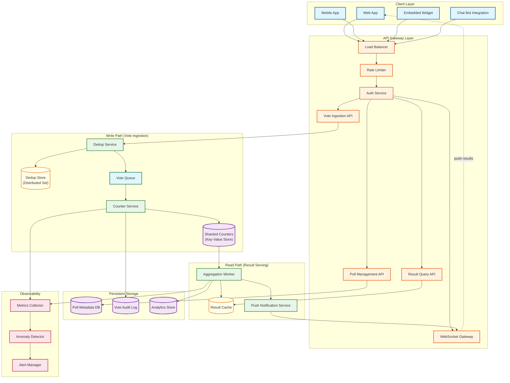
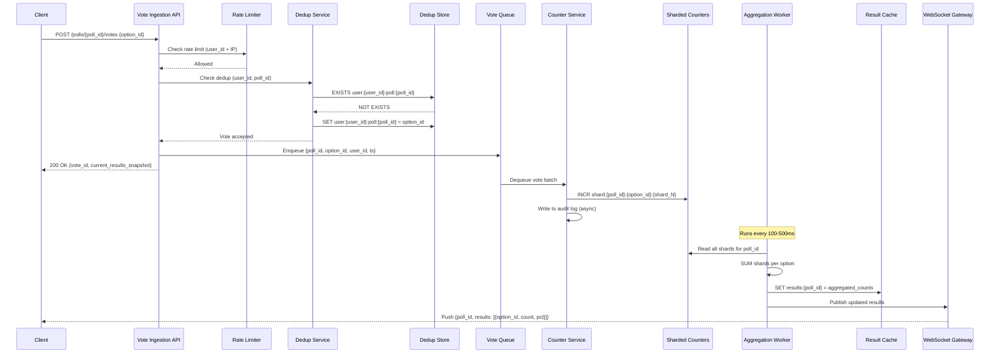
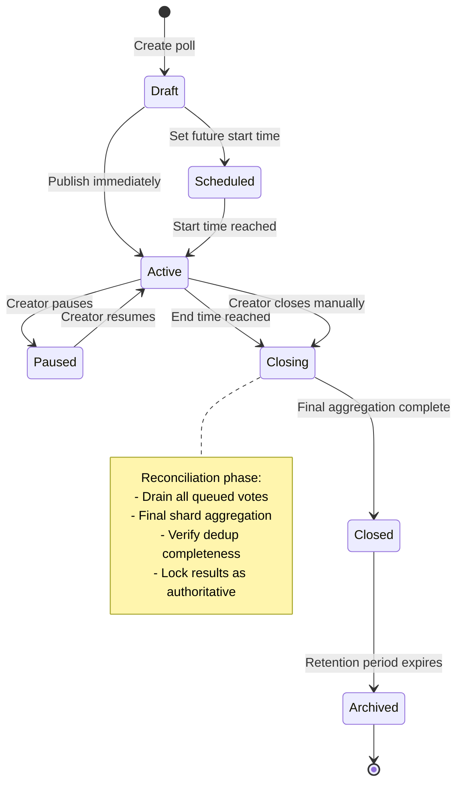
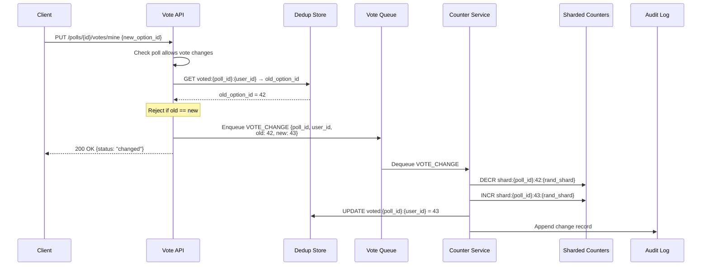
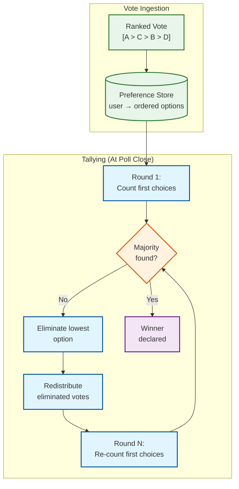
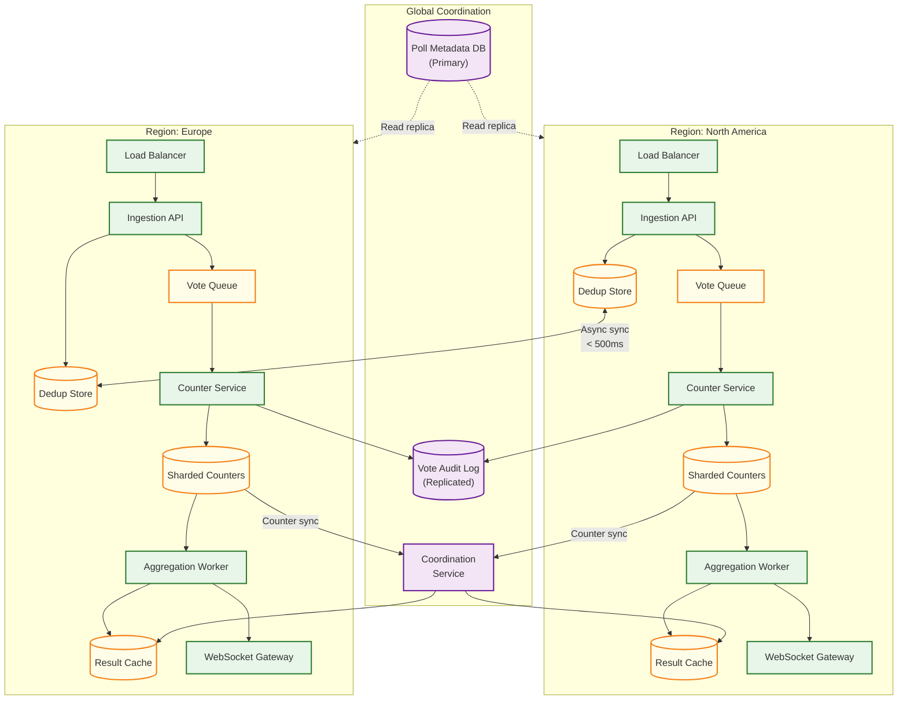

# High-Level Design — Polling/Voting System

## 1. System Architecture

---

## 2. Vote Casting Lifecycle

The critical path—from a user tapping "Vote" to seeing updated results—follows this sequence:

---

## 3. Key Architectural Decisions

### Decision 1: CQRS — Separate Write and Read Models

**Problem:** A single data model cannot simultaneously optimize for 100K writes/sec (vote ingestion) and millions of reads/sec (result viewing).

**Solution:** Strict CQRS separation.

| Aspect | Write Model | Read Model |
|---|---|---|
| **Data structure** | Sharded counters (N rows per option) | Single aggregated row per poll |
| **Storage** | High-throughput key-value store | Distributed cache |
| **Consistency** | Strong (per-shard atomic increment) | Eventual (sub-second lag) |
| **Scale Slowest part of the process** | Write contention on hot shards | Cache capacity and invalidation |
| **Optimized for** | Maximum write throughput | Minimum read latency |

**Why not a single model?** At 100K votes/sec on a single poll with 4 options, each option receives ~25K increments/sec. A single database row per option can handle ~1,000 increments/sec before lock contention degrades performance. The 25× gap between demand and capacity is unbridgeable without sharding.

### Decision 2: Sharded Counter Design

**Problem:** Atomic increment on a single counter row becomes the Slowest part of the process at high write rates due to row-level locking.

**Solution:** Distribute each logical counter across N physical shards.

| Aspect | Design Choice | Rationale |
|---|---|---|
| Shard key format | `{poll_id}:{option_id}:{shard_index}` | Deterministic, evenly distributed |
| Shard selection | Random (uniform distribution) | Simplest approach; avoids hot shards within shards |
| Default shard count | 10 per option | Handles up to ~10K votes/sec per option |
| Adaptive sharding | Increase shards when vote velocity exceeds threshold | Scale from 10 to 500 shards for viral polls |
| Shard storage | Key-value store with atomic INCR | Single-key atomic operations are lock-free in most KV stores |
| Aggregation | Periodic background job reads all shards, sums them | Decoupled from write path; runs every 100-500ms |

### Decision 3: Layered Deduplication

**Problem:** Checking "has this user already voted on this poll?" for every vote is a read on the write path. At 100K votes/sec, this check must be sub-millisecond.

**Solution:** Three-layer deduplication.

| Layer | Mechanism | Latency | Accuracy | Purpose |
|---|---|---|---|---|
| **L1: In-memory Bloom filter** | Per-poll Bloom filter at ingestion node | < 1μs | ~99% (false positives possible) | Reject obvious duplicates instantly |
| **L2: Distributed set lookup** | Check distributed cache set `voted:{poll_id}` | < 1ms | 100% (authoritative) | Definitive dedup check |
| **L3: Database constraint** | Unique index on (user_id, poll_id) in vote audit log | < 5ms | 100% | Final safety net; catches any L2 misses during failover |

**Flow:** L1 rejects ~99% of duplicates before they hit the network. L2 catches the remaining 1%. L3 is a safety net that should never be needed in normal operation.

### Decision 4: Asynchronous Vote Processing with Synchronous Acknowledgment

**Problem:** Should the client wait until the vote is fully processed (counter incremented, results updated), or receive an immediate acknowledgment?

**Solution:** Synchronous dedup + acknowledgment, asynchronous counter increment.

| Phase | Model | Rationale |
|---|---|---|
| Dedup check | Synchronous | User must know immediately if their vote was accepted or rejected |
| Vote queuing | Synchronous | Vote must be durably queued before acknowledging |
| Counter increment | Asynchronous (via queue) | High-throughput batch processing; decoupled from user-facing latency |
| Result aggregation | Asynchronous (periodic) | Background task; doesn't block any user request |
| Result push | Asynchronous (WebSocket) | Fire-and-forget to connected clients |

**Benefit:** The user-visible latency is only dedup check + queue publish (~15-30ms), while the heavier work (counter increment, aggregation, push) happens asynchronously.

### Decision 5: Poll State Machine

**Key insight:** The `Closing` state is critical. When a poll transitions from `Active` to `Closing`, the system must: (1) stop accepting new votes, (2) drain all in-flight votes from the queue, (3) perform a final synchronous aggregation across all shards, (4) verify that the total vote count matches the dedup set cardinality, and (5) mark the result as authoritative. This reconciliation ensures the final tally is exactly correct.

---

## 4. Data Flow Summary

### Write Path (Vote Cast → Counter Increment)

1. **Client** sends `POST /polls/{id}/votes` with option selection and auth token
2. **Rate Limiter** checks per-user and per-IP rate limits (reject if exceeded)
3. **Dedup Service** checks L1 Bloom filter → L2 distributed set → rejects if duplicate
4. **Dedup Service** records vote in dedup set (atomic SET operation)
5. **Vote API** acknowledges to client with 200 OK and a current result snapshot from cache
6. **Vote API** enqueues vote event to Vote Queue (partitioned by poll_id)
7. **Counter Service** dequeues batch, increments sharded counters atomically
8. **Counter Service** appends to Vote Audit Log asynchronously

### Read Path (Result Retrieval)

1. **Client** requests `GET /polls/{id}/results` or subscribes via WebSocket
2. **Result API** reads from Result Cache (sub-millisecond)
3. **Cache miss:** Query Sharded Counters directly, aggregate, populate cache
4. Returns `{options: [{id, label, count, percentage}], total_votes, last_updated}`

### Aggregation Path (Shards → Materialized View)

1. **Aggregation Worker** runs on a configurable interval (100ms for hot polls, 5s for cold)
2. Reads all shard values for each active poll: `GET shard:{poll_id}:{option_id}:*`
3. Computes sum per option and total
4. Writes aggregated result to Result Cache with TTL
5. Publishes update event to WebSocket Gateway for real-time push

### Real-Time Push Path

1. **WebSocket Gateway** maintains persistent connections with subscribed clients
2. On receiving aggregation update event, fans out to all connections subscribed to that poll_id
3. Client receives `{poll_id, results, total_votes, updated_at}` and updates UI

---

## 5. Architecture Pattern Checklist

| Pattern | Application in This System |
|---|---|
| **CQRS** | Write model (sharded counters) completely separated from read model (materialized cache); different data structures, stores, and scaling strategies |
| **Sharded Counter** | Each vote option's count is distributed across N physical shards to eliminate row-level lock contention |
| **Event-Driven Architecture** | Votes flow through a queue; aggregation is triggered by events; result updates push to clients |
| **Materialized View** | Pre-aggregated poll results stored in cache; updated by background workers rather than computed on read |
| **Bloom Filter Fast-Path** | Probabilistic deduplication layer rejects most duplicates without network round-trip |
| **Circuit Breaker** | If dedup store becomes unavailable, circuit breaker trips; votes are queued with deferred dedup |
| **Bulkhead** | Hot polls get dedicated infrastructure (separate shard pools, dedicated aggregation workers) |
| **Competing Consumers** | Multiple Counter Service instances consume from the vote queue in parallel |
| **Fan-Out on Write** | Result updates push to all subscribed WebSocket connections when aggregation completes |
| **Adaptive Scaling** | Shard count and aggregation frequency adjust dynamically based on vote velocity |

---

## 6. Vote Change Flow

Changing a vote is one of the few operations requiring coordination across the write path—an atomic decrement of the old option and increment of the new option.

**Key constraint:** The decrement and increment are not transactional across shards—but eventual consistency during active polls makes this acceptable. The next aggregation cycle captures both changes. The total vote count (dedup set cardinality) remains constant.

---

## 7. Ranked-Choice Processing Architecture

Ranked-choice (instant-runoff) polls require a fundamentally different processing model. Instead of simple counter increments, the system stores ordered preference lists and runs elimination rounds.

**Design difference from simple polls:** Ranked-choice votes cannot use sharded counters during voting—the system must store the full preference list per user. Tallying happens only at poll close (or on-demand preview), not incrementally. This makes ranked-choice polls write-simple (just store preferences) but read-complex (elimination rounds are computationally expensive for large voter bases).

---

## 8. Multi-Region Deployment Architecture

**Key design decisions:**
- **Dedup stores sync asynchronously** between regions (< 500ms lag). Geographic user affinity means most users consistently hit one region.
- **Counters are per-region.** A global coordination service periodically sums cross-region counters for the materialized result view.
- **Poll metadata** has a single primary region with read replicas in all regions. Poll creation/modification routes to the primary.
- **Vote audit log** is replicated to all regions for DR, but writes go to the local region's log.

---

## 9. Additional Architectural Decisions

### Decision 6: WebSocket vs Server-Sent Events for Result Push

| Approach | Pros | Cons | When to Choose |
|---|---|---|---|
| **WebSocket** | Bidirectional; lowest latency; binary frame support | Harder to proxy/CDN; connection overhead | Live events with < 500ms result push requirement |
| **SSE** | Simpler; HTTP/2 multiplexing; auto-reconnect; CDN-friendly | Unidirectional only; text-only (no binary) | Standard polls with 1-2s update interval acceptable |
| **Long polling fallback** | Universal compatibility; works behind restrictive firewalls | Higher latency; more server resources per client | Fallback for environments where WS/SSE fail |

**Selected:** WebSocket as primary, SSE as fallback, long polling as last resort. Client library auto-negotiates based on environment.

### Decision 7: Vote Queue Partitioning Strategy

| Strategy | Pros | Cons | Selected |
|---|---|---|---|
| **By poll_id** | All votes for a poll in order; simple consumer logic | Hot poll saturates one partition | Default |
| **By poll_id + sub-key** | Spreads hot poll across N partitions | Loses per-poll ordering (acceptable for counters) | For hot polls |
| **Round-robin** | Even distribution | No poll affinity; harder to drain per-poll | No |

**Selected:** Default by poll_id; hot polls automatically switch to sub-partitioning when velocity exceeds 50K votes/sec.

### Decision 8: Hot Poll Detection Strategy

| Signal | Threshold | Action |
|---|---|---|
| **Creator follower count** | > 1M followers | Pre-provision hot poll infrastructure at poll creation |
| **Vote velocity** | > 1,000 v/s (10s rolling window) | Trigger hot poll isolation (increase shards, dedicate resources) |
| **Dedup set growth** | > 500 new entries/s | Confirm hot poll classification |
| **Queue partition depth** | > 5,000 msgs/s growth | Sub-partition the poll's queue |
| **WebSocket subscriptions** | > 10,000 new connections/min | Activate hierarchical fan-out |

**Key principle:** Detection triggers at 10% of saturation point, not at saturation. By the time a poll overwhelms default infrastructure, votes are already being lost.

### Decision 9: Ephemeral vs Persistent Poll Storage

| Poll Type | Storage Strategy | Retention | Rationale |
|---|---|---|---|
| **Story poll** (24h TTL) | In-memory only; no audit log | 24 hours | Ephemeral content; no long-term integrity needed |
| **Standard poll** | KV counters + audit log + metadata DB | 1 year | Balance between durability and storage cost |
| **Organizational poll** | Full audit log + encrypted vote records | 3 years | Compliance requirements for corporate voting |
| **Regulatory poll** | Hash-chained audit log + external anchoring | 7 years | Tamper-evidence for high-stakes outcomes |

**Selected:** Storage strategy determined by poll's `integrity_level` setting (set at creation). Default is "standard" for most polls.

---

## 12. Component Interaction Matrix

| Source → Target | Protocol | Frequency | Failure Handling |
|---|---|---|---|
| Client → Vote API | HTTPS | Per vote (100K/s peak) | Client retry with idempotency key |
| Vote API → Dedup Store | Binary protocol | Per vote (2 ops: check + set) | Circuit breaker; queue for deferred dedup |
| Vote API → Vote Queue | Binary protocol | Per vote (1 produce) | Local disk buffer on queue unavailability |
| Vote Queue → Counter Service | Pull (batch consume) | 100-1000 msgs/batch | Auto-restart consumer; replay from offset |
| Counter Service → Sharded KV | Binary protocol | Per vote (1 INCR) | Retry with backoff; shards on replica if primary down |
| Aggregation Worker → Sharded KV | Binary protocol | Every 100ms–5s (MGET) | Use cached previous result on read failure |
| Aggregation Worker → Result Cache | Binary protocol | Every 100ms–5s (SET) | Log warning; stale results served from previous SET |
| Aggregation Worker → WebSocket GW | Pub/sub | Every 100ms–5s (publish) | Fire-and-forget; clients poll on missed updates |
| WebSocket GW → Client | WebSocket frame | Every 200ms–5s (push) | Client reconnects; polls for missed updates |
| Counter Service → Audit Log | Async batch insert | Every 100ms (batch of 100) | Local buffer; retry on DB unavailability |
