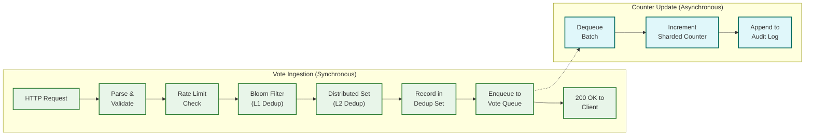

# Deep Dive & Bottlenecks — Polling/Voting System

## Deep Dive 1: Vote Ingestion Pipeline

The vote ingestion pipeline is the most latency-sensitive and throughput-critical component. Every millisecond of ingestion latency is felt by every voter.

### Pipeline Architecture



### Latency Budget (Target: < 50ms P99)

| Step | P50 | P99 | Notes |
|---|---|---|---|
| Parse & validate | 0.5ms | 1ms | JSON parsing, field validation |
| Rate limit check | 0.5ms | 2ms | Local token bucket with periodic sync |
| L1 Bloom filter | 0.001ms | 0.01ms | In-memory; ~1μs per lookup |
| L2 Distributed set check | 1ms | 5ms | Network round-trip to cache cluster |
| Record in dedup set | 1ms | 5ms | Atomic SADD operation |
| Enqueue to vote queue | 2ms | 10ms | Persistent write to message broker |
| Response serialization | 0.5ms | 1ms | JSON response with result snapshot |
| **Total** | **~6ms** | **~24ms** | Well within 50ms budget |

### Failure Modes and Mitigations

| Failure | Impact | Mitigation |
|---|---|---|
| **Bloom filter memory exhaustion** | Falls back to L2 for all checks (higher latency, still correct) | Monitor Bloom filter size; recreate when false positive rate exceeds 1% |
| **Dedup store unavailable** | Cannot verify uniqueness; votes might be duplicated | Circuit breaker: queue votes with "dedup_pending" flag; process dedup when store recovers |
| **Vote queue unavailable** | Votes accepted by dedup but not queued; potential vote loss | Local disk buffer: write votes to local append log; drain to queue when available |
| **Counter service lag** | Vote accepted but counter not incremented; results stale | Queue depth monitoring; auto-scale counter consumers; results will catch up |
| **Network partition** | Split-brain: dedup store may have stale data | Use distributed set with read-your-writes consistency; prefer rejecting duplicates to allowing them |

### Race Condition: Concurrent Duplicate Votes

**Scenario:** User rapidly clicks "Vote" twice. Both requests arrive at different ingestion nodes simultaneously.

**Timeline without protection:**
1. Request A: SISMEMBER → NOT_EXISTS
2. Request B: SISMEMBER → NOT_EXISTS (A's SADD hasn't executed yet)
3. Request A: SADD → success (added)
4. Request B: SADD → success (already exists, returns 0)

**Solution:** Use the return value of SADD as the authoritative check. SADD returns 1 if the element was newly added, 0 if it already existed. Only proceed if SADD returns 1.

```
FUNCTION dedup_vote_atomic(user_id, poll_id):
    key = FORMAT("voted:%s", poll_id)
    was_added = DEDUP_STORE.SADD(key, user_id)
    IF was_added == 1:
        RETURN ACCEPTED     // This request won the race
    ELSE:
        RETURN DUPLICATE    // Another request already recorded this vote
```

This is a classic compare-and-swap pattern: the SET operation itself is the check.

---

## Deep Dive 2: Real-Time Aggregation Engine

The aggregation engine bridges the write model (sharded counters) and the read model (materialized result cache). Its design determines result freshness.

### Aggregation Strategy

| Approach | Freshness | CPU Cost | Complexity |
|---|---|---|---|
| **On-every-vote** | Instant | Very high (redundant computation) | Low |
| **Fixed interval (1s)** | ≤ 1s | Moderate, predictable | Low |
| **Adaptive interval** | 100ms–5s based on velocity | Low during quiet, moderate during peaks | Medium |
| **Change-data-capture** | Near-instant | Low (incremental) | High |

**Selected: Adaptive interval aggregation** — balances freshness, cost, and complexity.

### Adaptive Aggregation Algorithm

```
FUNCTION adaptive_aggregation_loop(poll_id):
    base_interval = 5000ms        // Cold poll: aggregate every 5s
    min_interval = 100ms          // Hot poll: aggregate every 100ms
    velocity_threshold_hot = 100  // votes/sec to classify as "hot"
    velocity_threshold_warm = 10  // votes/sec to classify as "warm"

    LOOP:
        start_time = NOW()

        // Measure current vote velocity
        velocity = METRICS.get_vote_rate(poll_id, window=5s)

        // Determine aggregation interval
        IF velocity > velocity_threshold_hot:
            interval = min_interval                    // 100ms
        ELSE IF velocity > velocity_threshold_warm:
            interval = 1000ms                          // 1s
        ELSE:
            interval = base_interval                   // 5s

        // Perform aggregation
        results = aggregate_all_shards(poll_id)

        // Update materialized view
        CACHE.SET(FORMAT("results:%s", poll_id), results, TTL=interval * 3)

        // Push to WebSocket subscribers
        PUSH_SERVICE.publish(poll_id, results)

        // Sleep for remaining interval
        elapsed = NOW() - start_time
        SLEEP(MAX(0, interval - elapsed))
```

### Aggregation Worker Scaling

| Poll Temperature | Vote Velocity | Aggregation Interval | Workers |
|---|---|---|---|
| **Cold** | < 10 votes/sec | 5 seconds | Shared (1 worker per 1,000 cold polls) |
| **Warm** | 10-100 votes/sec | 1 second | Shared (1 worker per 100 warm polls) |
| **Hot** | 100-10,000 votes/sec | 200ms | Dedicated (1 worker per hot poll) |
| **Viral** | > 10,000 votes/sec | 100ms | Dedicated + priority resources |

### Incremental vs Full Aggregation

For viral polls with 500 shards × 4 options = 2,000 keys, a full MGET costs ~2ms. At 100ms intervals, this is acceptable. However, an incremental approach can reduce CPU:

```
FUNCTION incremental_aggregate(poll_id, previous_results):
    // Only read shards that might have changed
    // Use a change counter per shard group
    changed_options = METRICS.get_recently_voted_options(poll_id, since=last_aggregation)

    FOR EACH option_id IN changed_options:
        // Re-aggregate only changed option's shards
        new_count = SUM(KV_STORE.MGET(all_shard_keys(poll_id, option_id)))
        previous_results.options[option_id].count = new_count

    // Recompute percentages
    recompute_percentages(previous_results)

    RETURN previous_results
```

---

## Deep Dive 3: Vote Deduplication Engine

Deduplication is the constraint that makes this system harder than a simple counter. Every vote must be checked for uniqueness, creating a read dependency on the write path.

### Memory Analysis for Dedup Sets

| Poll Size | Unique Voters | Set Memory (16B per entry) | Bloom Filter Memory (10 bits/entry) |
|---|---|---|---|
| Small | 1,000 | 16 KB | 1.2 KB |
| Medium | 100,000 | 1.6 MB | 122 KB |
| Large | 1,000,000 | 16 MB | 1.2 MB |
| Viral | 10,000,000 | 160 MB | 12 MB |
| Massive | 50,000,000 | 800 MB | 60 MB |

**Key insight:** The dedup set for a single massive poll (800 MB) can fit in memory on a single cache node. But the Bloom filter (60 MB) must be replicated to every ingestion node for L1 fast-path rejection to work.

### Bloom Filter Management

| Parameter | Value | Rationale |
|---|---|---|
| Expected elements | Based on follower count × engagement rate | Size the filter before the poll starts |
| False positive rate target | 1% | False positives just fall through to L2 (no correctness impact) |
| Bits per element | 10 | Standard for 1% FP rate with 7 hash functions |
| Hash functions | 7 | Optimal for 10 bits/element |
| Resizing strategy | Create new, larger filter; dual-check during migration | Old filter still valid; new filter catches new entries |

### Handling Anonymous Voting Dedup

When polls allow anonymous voting (no user account required), deduplication uses a composite key:

```
FUNCTION generate_anonymous_voter_id(request):
    components = [
        HASH(request.ip_address),
        HASH(request.user_agent),
        HASH(request.client_fingerprint),    // canvas fingerprint, WebGL hash, etc.
        request.session_id
    ]
    RETURN HASH(JOIN(components, ":"))
```

**Limitations:**
- VPN/proxy users may bypass IP-based dedup
- Browser fingerprinting is imperfect (~90% accuracy)
- Session-based dedup fails if user clears cookies

**Trade-off:** Anonymous dedup is best-effort. Polls requiring strict one-person-one-vote must require authentication.

---

## Slowest part of the process Analysis

### Slowest part of the process 1: Dedup Store as Single Point of Contention

**Problem:** All votes for a poll must check the same dedup set. If the set is on one cache node, that node becomes a Slowest part of the process.

| Metric | Value |
|---|---|
| Peak lookups | 100,000/sec per hot poll |
| Cache node lookup capacity | ~500,000 ops/sec |
| Utilization at peak | 20% per hot poll |
| With 5 hot polls | 100% → saturated |

**Mitigations:**
1. **Bloom filter L1** reduces dedup store load by ~60% (rejecting known duplicates without network call)
2. **Dedicated cache nodes** for hot polls (isolate from other traffic)
3. **Local caching** of recent dedup results at ingestion nodes (5s TTL; trades tiny dup window for throughput)
4. **Pipelining** dedup operations (batch SISMEMBER + SADD in a single round-trip)

### Slowest part of the process 2: Vote Queue Partition Saturation

**Problem:** Votes for a single poll are routed to the same queue partition (by poll_id). A viral poll can saturate a single partition.

| Metric | Value |
|---|---|
| Single partition throughput | ~50,000 messages/sec |
| Viral poll vote rate | 100,000 votes/sec |
| Overflow | 2× partition capacity |

**Mitigations:**
1. **Sub-partitioning** hot polls across multiple partitions: `partition = HASH(poll_id + sub_key) % P`
2. **In-memory batching** at ingestion tier: buffer 100ms of votes, batch-publish to queue
3. **Overflow queue** for excess traffic with degraded ordering guarantees
4. **Backpressure** to ingestion tier: 429 with retry-after header if queue is saturated

### Slowest part of the process 3: WebSocket Fan-Out for Viral Polls

**Problem:** A viral poll may have 1M+ concurrent WebSocket watchers. Pushing updates to 1M connections at 2 updates/sec = 2M messages/sec.

| Metric | Value |
|---|---|
| Concurrent watchers | 1,000,000 |
| Updates per second | 2 |
| Message size | 512 bytes |
| **Total fan-out bandwidth** | **976 MB/sec** |

**Mitigations:**
1. **Hierarchical fan-out:** Edge servers subscribe to a single source; each edge fans out to its local connections
2. **Reduced update frequency** for large audiences: switch from 500ms to 2s intervals for polls with >100K watchers
3. **Delta encoding:** Send only changed fields (e.g., `{option_42: +1523}` instead of full result set)
4. **Sampling for live displays:** Client-side interpolation between updates creates smooth animation without requiring high-frequency server pushes
5. **Server-Sent Events (SSE) fallback:** For clients behind restrictive firewalls; lower overhead than WebSocket for one-directional updates

### Slowest part of the process 4: Sharded Counter Aggregation Under Extreme Shard Counts

**Problem:** A viral poll with 500 shards × 6 options = 3,000 keys to read every 100ms.

| Metric | Value |
|---|---|
| Keys per aggregation | 3,000 |
| MGET latency (single node) | ~2ms for 1,000 keys |
| Keys spread across N nodes | 3 round-trips (1,000 keys each) |
| **Aggregation latency** | **~6ms** |
| At 100ms interval | 6% of interval spent on aggregation |

**Assessment:** Not a Slowest part of the process. Even with 500 shards, aggregation completes in ~6ms, well within the 100ms budget.

---

## Race Condition Analysis

### Race 1: Vote + Poll Close

**Scenario:** A user submits a vote at the exact moment the poll closes.

**Timeline:**
1. T=0: Poll close initiated (status → closing)
2. T=0.001: Vote request arrives at ingestion API
3. T=0.005: Dedup check passes
4. T=0.010: Vote enqueued to queue
5. T=0.100: Poll close drain begins

**Resolution:** The vote queue drain in the `Closing` state handles this. All votes that were enqueued before the drain completes are counted. The 30-second drain timeout ensures in-flight votes are captured. Votes arriving after status = "closing" are rejected at the API layer.

### Race 2: Vote Change During Aggregation

**Scenario:** User changes vote from Option A to Option B. Aggregation reads between the decrement and increment.

**Timeline:**
1. T=0: Aggregation reads Option A shards → count = 500
2. T=1: Vote change decrements Option A → actual count = 499
3. T=2: Aggregation reads Option B shards → count = 300 (increment not yet applied)
4. T=3: Vote change increments Option B → actual count = 301
5. Result shows: A=500, B=300 (total=800). Correct total should be 800 (unchanged). But A is +1, B is -1.

**Resolution:** This is acceptable under eventual consistency. The next aggregation cycle (100ms later) will show correct values. The total vote count remains consistent since the dedup set didn't change. No votes were lost or created.

### Race 3: Adaptive Shard Scaling During Writes

**Scenario:** Shard count increases from 10 to 50 while votes are being processed.

**Resolution:** New shards start at 0. Existing shards keep their counts. Writes that are in-flight to old shard indices (0-9) still succeed. New writes may target new shard indices (10-49). Aggregation immediately includes all shards (0-49). No votes are lost because the only operation is adding new shards, never removing or renumbering existing ones.

---

## Deep Dive 4: Adaptive Shard Scaling Engine

Adaptive shard scaling is the mechanism that transforms a static infrastructure into one that grows with demand. The system must detect when the current shard count is insufficient and add shards without losing votes.

### Scaling Decision Pipeline

```mermaid
flowchart LR
    subgraph Monitoring["Velocity Monitoring"]
        VEL["Vote velocity<br/>meter (10s window)"]
        THRESH["Threshold<br/>comparator"]
    end

    subgraph Decision["Scaling Decision"]
        CALC["Calculate ideal<br/>shard count"]
        CLAMP["Apply bounds<br/>(min=2, max=500)"]
        COMPARE["Compare with<br/>current shards"]
    end

    subgraph Action["Scale Action"]
        INIT["Initialize new<br/>shards to 0"]
        UPDATE["Update poll<br/>settings"]
        NOTIFY["Notify aggregation<br/>worker"]
    end

    VEL --> THRESH
    THRESH -->|"exceeds threshold"| CALC
    CALC --> CLAMP
    CLAMP --> COMPARE
    COMPARE -->|"target > current"| INIT
    INIT --> UPDATE
    UPDATE --> NOTIFY

    classDef monitor fill:#fff3e0,stroke:#e65100,stroke-width:2px
    classDef decide fill:#e8f5e9,stroke:#2e7d32,stroke-width:2px
    classDef act fill:#e1f5fe,stroke:#01579b,stroke-width:2px

    class VEL,THRESH monitor
    class CALC,CLAMP,COMPARE decide
    class INIT,UPDATE,NOTIFY act
```



### Shard Scaling Lifecycle

| Phase | Shard Count | Vote Velocity | Trigger |
|---|---|---|---|
| **Initial** | 10 (default) | < 1,000 v/s | Poll creation |
| **Warming** | 50 | 1,000–5,000 v/s | Velocity crosses first threshold |
| **Hot** | 100–200 | 5,000–50,000 v/s | Sustained high velocity |
| **Viral** | 200–500 | > 50,000 v/s | Extreme velocity (celebrity poll) |
| **Cooling** | 200–500 (unchanged) | Decreasing | Never reduce during active poll |
| **Closed** | Rebuilt to 1 | 0 | Post-close; single shard for archival queries |

### Safety Properties

1. **No vote loss on scale-up:** New shards initialized to 0; existing shards untouched.
2. **Monotonic shard count during active poll:** Only increases, never decreases.
3. **Aggregation consistency:** Worker reads shard count from poll settings before each cycle; always reads all shards.
4. **Writer consistency:** Ingestion nodes refresh shard count every 5 seconds from poll settings cache; brief window where some writers use old count is harmless (writes to old shard indices still valid).

---

## Deep Dive 5: Cross-Region Vote Consistency

In a multi-region deployment, the same user could theoretically vote in two regions before dedup sets synchronize. This deep dive analyzes the consistency guarantees and failure modes.

### Dedup Sync Timeline

```
T=0.000ms  User votes in Region A → SADD to DD_A succeeds
T=0.100ms  Vote acknowledged to user in Region A
T=50ms     DD_A begins async sync to DD_B
T=150ms    Same user attempts vote in Region B (VPN switch)
T=150.5ms  SISMEMBER DD_B → NOT EXISTS (sync hasn't arrived)
T=150.8ms  SADD DD_B → succeeds (DUPLICATE!)
T=200ms    DD_A sync arrives at DD_B → entry already exists (no-op)
```

### Mitigation Layers

| Layer | Mechanism | Coverage |
|---|---|---|
| **Geographic affinity** | Route user to same region based on account's home region | Covers 99.5% of users who don't switch regions mid-vote |
| **Async dedup sync** | Per-region dedup stores sync with < 500ms lag | Closes window for most cross-region attempts |
| **L3 database constraint** | UNIQUE index on (poll_id, user_id) in globally replicated audit log | Catches 100% of duplicates eventually; triggers reconciliation |
| **Reconciliation at close** | Final close procedure cross-verifies dedup count vs audit log count | Guarantees authoritative final result |

### Quantifying the Risk

| Factor | Value | Impact |
|---|---|---|
| Users with multi-region activity | < 0.5% | Small attack surface |
| Dedup sync lag (P99) | < 500ms | Window of vulnerability |
| Probability of simultaneous cross-region vote | < 0.001% per vote | Extremely rare for legitimate users |
| L3 database catch rate | 100% | All duplicates detected eventually |
| Impact on final result | 0 | Reconciliation at close is authoritative |

---

## Deep Dive 6: Vote Queue Backpressure Strategy

When vote velocity exceeds the queue's absorption capacity, the system needs a backpressure strategy that preserves vote integrity while providing feedback to users.

### Backpressure Tiers

| Tier | Queue Depth | Action | User Experience |
|---|---|---|---|
| **Normal** | < 5,000 msgs | Process normally | Vote accepted in < 50ms |
| **Elevated** | 5,000–20,000 msgs | Increase consumer count; alert team | Vote accepted in < 100ms (slightly delayed ACK) |
| **Stressed** | 20,000–50,000 msgs | Sub-partition hot poll queues; batch publishes | Vote accepted in < 200ms; result freshness degrades to 2s |
| **Saturated** | > 50,000 msgs | Shed lowest-priority polls; return 503 with Retry-After for non-hot polls | Hot poll votes still accepted; cold poll voters retry later |
| **Critical** | > 100,000 msgs | Enable overflow disk buffer; reject anonymous votes | Authenticated votes buffered to disk; anonymous votes rejected |

### Priority-Based Vote Shedding

During saturation, not all votes are equal:

```
FUNCTION should_accept_vote(poll_id, user, queue_depth):
    IF queue_depth < STRESS_THRESHOLD:
        RETURN ACCEPT

    // Priority 1: Votes on hot/viral polls (highest business value)
    IF poll_id IN hot_polls:
        RETURN ACCEPT

    // Priority 2: Authenticated users (higher integrity)
    IF user.is_authenticated:
        IF queue_depth < SATURATED_THRESHOLD:
            RETURN ACCEPT
        ELSE:
            RETURN BUFFER_TO_DISK

    // Priority 3: Anonymous users (lowest priority during overload)
    RETURN REJECT_WITH_RETRY(retry_after=5s)
```

---

## Deep Dive 7: Bloom Filter Memory Profiling

The Bloom filter at each ingestion node must fit in process memory. Understanding its memory profile is critical for capacity planning.

### Memory vs Accuracy Trade-off

| Expected Voters | Bits/Element | Memory | False Positive Rate | L2 Load Reduction |
|---|---|---|---|---|
| 1M | 5 | 625 KB | 3.5% | 55% |
| 1M | 10 | 1.2 MB | 1.0% | 60% |
| 1M | 15 | 1.9 MB | 0.1% | 62% |
| 10M | 10 | 12 MB | 1.0% | 60% |
| 50M | 10 | 60 MB | 1.0% | 60% |
| 50M | 15 | 90 MB | 0.1% | 62% |

### Ingestion Node Memory Budget

| Component | Memory | Notes |
|---|---|---|
| Application runtime | 200 MB | Base process footprint |
| Bloom filters (active polls) | 50–200 MB | Depends on poll sizes; top-20 polls by velocity |
| Request buffers | 100 MB | In-flight request memory |
| Connection pools | 50 MB | Dedup store + queue connections |
| **Total per node** | **400–550 MB** | Fits in 1 GB process budget |

**Key constraint:** Bloom filters are only maintained for polls where the ingestion node has received votes. Cold polls don't have local Bloom filters—their votes fall through directly to L2. This naturally limits memory usage to the working set of active polls per node.

---

## Performance Benchmarks

### Vote Ingestion Pipeline Benchmarks

| Scenario | Throughput | P50 Latency | P99 Latency | Notes |
|---|---|---|---|---|
| Single cold poll, 10 shards | 5,000 v/s per node | 4ms | 12ms | Baseline performance |
| Single warm poll, 50 shards | 10,000 v/s per node | 5ms | 15ms | Shard selection overhead negligible |
| Single hot poll, 200 shards | 15,000 v/s per node | 6ms | 20ms | Bloom filter + dedup dominates latency |
| 100 concurrent polls (mixed) | 20,000 v/s per node | 7ms | 25ms | Context switching between poll states |
| Dedup store degraded (L1 only) | 12,000 v/s per node | 3ms | 8ms | Faster but allows ~1% false duplicates through |

### Aggregation Benchmarks

| Shard Count | Options | Keys to Read | Aggregation Time | Fits in 100ms Budget |
|---|---|---|---|---|
| 10 shards × 4 options | 4 | 40 | 0.3ms | Yes (0.3% of budget) |
| 50 shards × 4 options | 4 | 200 | 1.0ms | Yes (1% of budget) |
| 200 shards × 6 options | 6 | 1,200 | 3.5ms | Yes (3.5% of budget) |
| 500 shards × 6 options | 6 | 3,000 | 6.0ms | Yes (6% of budget) |
```
