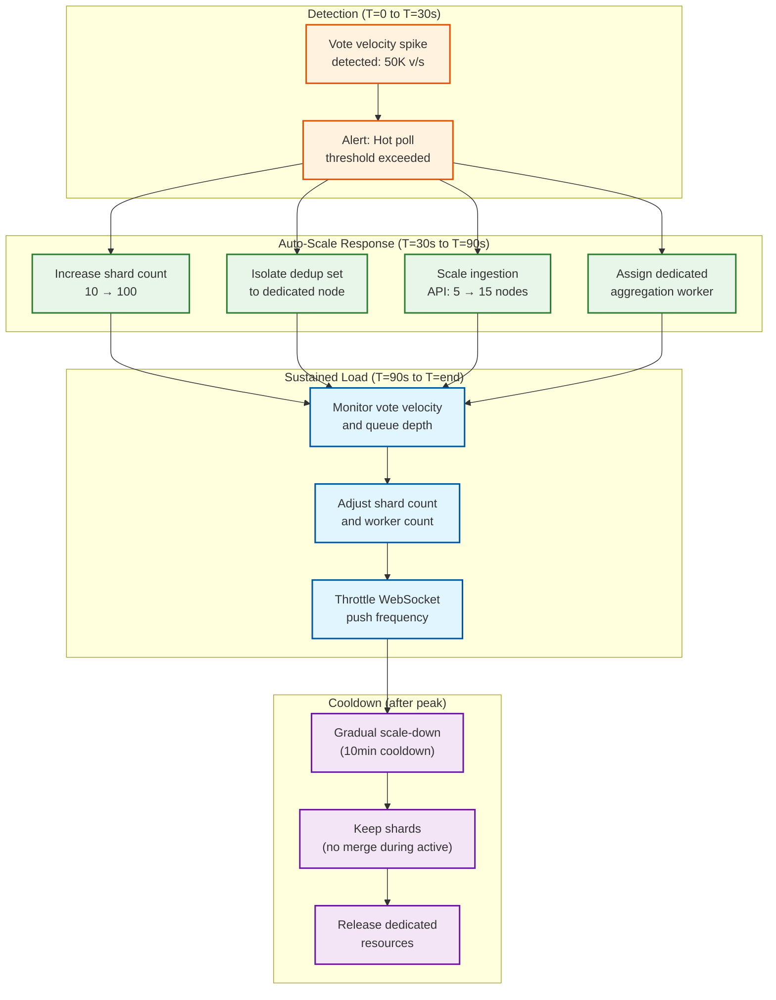

# Scalability & Reliability — Polling/Voting System

## 1. Horizontal Scaling Strategy

### Per-Tier Scaling

| Tier | Scaling Dimension | Scaling Trigger | Scale Unit |
|---|---|---|---|
| **Vote Ingestion API** | CPU utilization > 70% or P99 latency > 30ms | Auto-scale (reactive) | +2 nodes per scale event |
| **Dedup Service** | Memory utilization > 80% or ops/sec > 400K per node | Auto-scale (reactive) | +1 node (rebalance consistent hash ring) |
| **Vote Queue** | Partition depth > 10,000 messages | Expand partitions (planned) | +N partitions |
| **Counter Service** | Queue consumer lag > 5 seconds | Auto-scale (reactive) | +2 consumer instances |
| **Aggregation Workers** | Hot poll count exceeds worker capacity | Auto-scale (event-driven) | +1 worker per hot poll |
| **Result Cache** | Memory > 80% or hit rate < 95% | Auto-scale (reactive) | +1 node (rebalance hash ring) |
| **WebSocket Gateway** | Connection count > 80% of node capacity | Auto-scale (reactive) | +1 node (new connections route to new node) |

### Scaling Flow for a Viral Event



---

## 2. Auto-Scaling for Vote Spikes

### Proactive Scaling (Pre-Warming)

Not all spikes are unexpected. Many high-traffic polls are predictable:

| Scenario | Signal | Pre-Scale Action |
|---|---|---|
| Celebrity posts a poll | Poll creator has > 1M followers | Pre-provision 50+ shards, dedicated dedup node, 10 extra API nodes |
| Live TV event poll | Poll scheduled to open during broadcast | Pre-scale to estimated audience × 5% engagement rate |
| Breaking news poll | Trending topic detection | Activate hot-poll infrastructure for newly created polls on trending topics |
| Recurring event (e.g., weekly show) | Historical pattern | Scale based on previous week's peak × 1.5 buffer |

### Reactive Scaling Thresholds

| Metric | Threshold | Action | Cooldown |
|---|---|---|---|
| Vote velocity (single poll) | > 1,000/sec | Increase shards to 50 | 5 min |
| Vote velocity (single poll) | > 10,000/sec | Increase shards to 200, dedicated aggregation worker | 10 min |
| Vote velocity (single poll) | > 50,000/sec | Full hot-poll isolation (dedicated everything) | 15 min |
| API node CPU | > 70% for 30 seconds | Add 2 ingestion nodes | 5 min |
| Queue depth (any partition) | > 10,000 messages for 1 min | Add 2 counter consumers | 5 min |
| Dedup store memory | > 80% | Add 1 cache node, rebalance | 10 min |
| WebSocket connections | > 80% of node capacity | Add 1 WebSocket gateway node | 5 min |

---

## 3. Database Scaling

### Write Path Scaling (Sharded Counters)

| Strategy | Implementation | Capacity |
|---|---|---|
| **Key distribution** | Consistent hashing across KV store nodes | ~500K INCR ops/sec per node |
| **Node addition** | Add nodes to cluster; rebalance automatically | Linear throughput increase |
| **Hot key mitigation** | Client-side random shard selection | Distributes writes across shards uniformly |
| **Replication** | Async replication to 1 follower (for read aggregation) | Read aggregation from follower to reduce primary load |

### Vote Audit Log Scaling

| Strategy | Implementation | Capacity |
|---|---|---|
| **Hash partitioning** | 256 partitions by `HASH(poll_id)` | Each partition ~230K votes/day |
| **Time-based archival** | Partition by month; archive old months to cold storage | Keep 3 months hot, archive rest |
| **Write optimization** | Batch inserts (100 votes per batch) | 10× write throughput vs individual inserts |
| **Index management** | Partial indexes; deferred index builds during low traffic | Minimize write amplification |

### Poll Metadata Scaling

| Strategy | Implementation | Capacity |
|---|---|---|
| **Read replicas** | 3 read replicas in different availability zones | Handles 100K+ reads/sec for poll metadata |
| **Connection pooling** | 100 connections per API node, pooled | Prevents connection exhaustion |
| **Query optimization** | Covering indexes for common query patterns | Avoid table scans |

---

## 4. Caching Strategy

### Multi-Layer Cache Architecture

| Layer | What's Cached | TTL | Eviction | Hit Rate |
|---|---|---|---|---|
| **L1: Client-side** | Last-seen results for subscribed polls | 500ms | On WebSocket push | N/A |
| **L2: CDN/Edge** | Poll metadata, static result snapshots for closed polls | 60s (active) / 1h (closed) | TTL-based | ~40% |
| **L3: Application cache** | Poll metadata, settings, option lists | 30s | TTL + invalidation on update | ~90% |
| **L4: Distributed cache** | Aggregated results (materialized view) | 100ms–5s (adaptive) | TTL + aggregation refresh | ~99% |

### Cache Consistency for Results

Results are eventually consistent by design. The aggregation worker is the single writer to the result cache, eliminating write-write conflicts.

| Scenario | Behavior | Staleness |
|---|---|---|
| Normal operation | Aggregation updates cache every 100ms–5s | ≤ aggregation interval |
| Cache node failure | Failover to replica; or miss → read from shards directly | +5ms latency, correct data |
| Cache full | LRU eviction of cold polls; hot polls stay pinned | No staleness for hot polls |
| Poll closes | Final aggregation writes authoritative result with 7-day TTL | 0 (final result is exact) |

### Hot Poll Cache Pinning

Hot polls are pinned in cache (not subject to LRU eviction) for the duration of their active period:

```
FUNCTION pin_hot_poll_results(poll_id, velocity):
    IF velocity > HOT_THRESHOLD:
        CACHE.SET(FORMAT("results:%s", poll_id), results, TTL=INFINITE)
        CACHE.MARK_PINNED(FORMAT("results:%s", poll_id))
    ELSE:
        CACHE.SET(FORMAT("results:%s", poll_id), results, TTL=5s)
        CACHE.UNPIN(FORMAT("results:%s", poll_id))
```

---

## 5. Hot Poll Mitigation

Hot polls are the defining scalability challenge. A dedicated strategy prevents a single viral poll from degrading the entire platform.

### Hot Poll Detection

| Signal | Threshold | Detection Time |
|---|---|---|
| Vote velocity | > 1,000 votes/sec | < 10 seconds (rolling 10s window) |
| Dedup set growth rate | > 500 new entries/sec | < 10 seconds |
| Queue partition depth growth | > 5,000 messages/sec | < 15 seconds |
| WebSocket subscription spike | > 10,000 new connections/min | < 30 seconds |

### Hot Poll Isolation

When a poll is classified as "hot," it gets dedicated resources:

| Resource | Normal Poll | Hot Poll | Viral Poll |
|---|---|---|---|
| **Shard count** | 10 | 50-100 | 200-500 |
| **Dedup store** | Shared cluster | Dedicated node | Dedicated node + local Bloom filter replicas |
| **Queue partition** | Shared partition | Dedicated partition | Multiple dedicated partitions |
| **Aggregation worker** | Shared (1 per 1000 polls) | Dedicated worker | Dedicated worker + 100ms interval |
| **WebSocket** | Shared gateway | Dedicated gateway nodes | Hierarchical fan-out tree |
| **Rate limiting** | 1 vote/sec/user | Same | Same (per-user unchanged; total throughput scales) |

---

## 6. Fault Tolerance

### Component Failure Matrix

| Component | Failure Mode | Impact | Recovery | RTO |
|---|---|---|---|---|
| **Ingestion API node** | Crash | Reduced ingestion capacity | Load balancer routes to healthy nodes; auto-scale replaces node | < 30s |
| **Dedup store node** | Crash | Temporary dedup unavailability | Failover to replica; circuit breaker queues votes for deferred dedup | < 5s |
| **Vote queue** | Broker node failure | Temporary backlog | Broker replication; messages replayed from replica | < 10s |
| **Counter service** | Consumer crash | Queue depth grows | Auto-scale new consumers; no data loss (messages still in queue) | < 30s |
| **Sharded counter store** | Node failure | Some shards unavailable | Failover to replica; aggregation uses stale values temporarily | < 5s |
| **Result cache** | Node failure | Cache miss; reads go to shards | Consistent hash ring rebalances; temporary latency increase | < 10s |
| **Aggregation worker** | Crash | Results not updated | Health check detects; restart worker; results stale until recovery | < 30s |
| **WebSocket gateway** | Node failure | Connected clients disconnected | Clients reconnect to healthy node; poll for missed updates | < 5s |

### Data Durability Guarantees

| Data | Durability Mechanism | RPO |
|---|---|---|
| **Vote intent** | Written to dedup set (replicated) + vote queue (persistent) before ACK | 0 (no accepted vote is ever lost) |
| **Vote count** | Sharded counters replicated to 1 follower; audit log persisted | 0 for audit log; < 1s for counter (last batch may be in-flight) |
| **Poll metadata** | Relational DB with synchronous replication to standby | 0 |
| **Aggregated results** | Derivable from sharded counters; cache is reconstructible | N/A (computed, not stored) |

---

## 7. Disaster Recovery

### Multi-Region Architecture

| Aspect | Design |
|---|---|
| **Active regions** | 3 regions (e.g., North America, Europe, Asia-Pacific) |
| **Vote ingestion** | Active-active in all regions; votes routed to nearest region |
| **Dedup store** | Per-region with cross-region async sync (< 500ms lag) |
| **Vote queue** | Per-region; cross-region replication for DR |
| **Sharded counters** | Per-region; aggregated globally by a coordination service |
| **Result cache** | Per-region; populated by local aggregation workers |
| **Poll metadata** | Primary in one region; read replicas in all regions |

### Cross-Region Vote Deduplication

| Approach | Pros | Cons | Selected |
|---|---|---|---|
| **Global dedup store** | Perfect dedup | High latency for cross-region checks (~100ms) | No |
| **Per-region dedup + async sync** | Low latency; eventual global dedup | Window for cross-region duplicates (< 500ms) | Yes |
| **Per-region dedup + user-region affinity** | Low latency; no cross-region duplicates for sticky users | Requires user-region routing; fails on VPN switch | Hybrid |

**Selected approach:** Per-region dedup with async sync. Users are routed to their nearest region. Cross-region sync happens asynchronously. The window for a user voting in two regions simultaneously is < 500ms, and the L3 database unique constraint catches any that slip through.

### DR Scenarios

| Scenario | RTO | RPO | Procedure |
|---|---|---|---|
| **Single AZ failure** | < 30s | 0 | Automatic failover within region; no manual action |
| **Full region failure** | < 5 min | < 1s | DNS failover to other regions; drain in-flight votes; re-route traffic |
| **Global dedup store failure** | < 30s | 0 | Circuit breaker; deferred dedup with queue-based reconciliation |
| **Vote queue data loss** | < 1 min | < 5s | Replay from dedup set diff (votes in dedup but not in counters) |
| **Counter store corruption** | < 10 min | 0 | Rebuild counters from vote audit log (full re-count) |

### Counter Rebuilding from Audit Log

In the worst case (counter store completely lost), the vote audit log serves as the source of truth:

```
FUNCTION rebuild_counters_from_audit_log(poll_id):
    // Read all votes from audit log
    votes = QUERY vote_audit_log WHERE poll_id = poll_id

    // Clear all sharded counters for this poll
    clear_all_shards(poll_id)

    // Rebuild counts
    option_counts = {}
    FOR EACH vote IN votes:
        option_counts[vote.option_id] = (option_counts[vote.option_id] OR 0) + 1

    // Write to shard index 0 (single shard for rebuilt data)
    FOR EACH option_id, count IN option_counts:
        KV_STORE.SET(FORMAT("shard:%s:%s:0", poll_id, option_id), count)

    // Trigger re-aggregation
    aggregate_poll_results(poll_id)
```

---

## 8. Capacity Planning

### Growth Model

| Year | DAU | Daily Votes | Peak v/s (Platform) | Peak v/s (Single Poll) |
|---|---|---|---|---|
| Year 1 | 5M | 15M | 520 | 25,000 |
| Year 2 | 20M | 60M | 2,083 | 100,000 |
| Year 3 | 50M | 150M | 5,208 | 250,000 |
| Year 5 | 100M | 300M | 10,416 | 500,000 |

### Infrastructure Sizing (Year 2 Baseline)

| Component | Count | Spec | Cost Driver |
|---|---|---|---|
| Ingestion API nodes | 20 | 4 vCPU, 8GB RAM | CPU-bound |
| Dedup cache nodes | 10 | 8 vCPU, 64GB RAM | Memory-bound (dedup sets) |
| Vote queue brokers | 6 | 4 vCPU, 32GB RAM, SSD | Disk IOPS |
| Counter store nodes | 6 | 4 vCPU, 32GB RAM | Write IOPS |
| Counter consumers | 10 | 2 vCPU, 4GB RAM | CPU-bound |
| Aggregation workers | 5 | 2 vCPU, 4GB RAM | CPU-bound |
| Result cache nodes | 6 | 4 vCPU, 32GB RAM | Memory-bound |
| WebSocket gateways | 10 | 4 vCPU, 16GB RAM | Connection-bound |
| Poll metadata DB | 3 (1P+2R) | 8 vCPU, 64GB RAM, SSD | Mixed |
| Vote audit log DB | 3 (1P+2R) | 8 vCPU, 128GB RAM, SSD | Write IOPS |

---

## 9. Scaling Decision Matrix

| Scenario | Write Path Action | Read Path Action | Dedup Action | WebSocket Action |
|---|---|---|---|---|
| **Normal load** (< 500 v/s per poll) | Default 10 shards; shared queue partitions | 5s aggregation; shared cache | Shared cache cluster | Shared gateway; 2s push interval |
| **Warm poll** (500–5K v/s) | 50 shards; shared partition | 1s aggregation; shared cache | Shared cluster; L1 Bloom filter | Shared gateway; 1s push interval |
| **Hot poll** (5K–50K v/s) | 100–200 shards; dedicated partition | Dedicated aggregation worker; 200ms interval | Dedicated cache node | Dedicated gateway nodes; 500ms push |
| **Viral poll** (> 50K v/s) | 200–500 shards; multiple partitions | Dedicated worker; 100ms interval; incremental aggregation | Dedicated node + Bloom replicas | Hierarchical fan-out tree; delta encoding |
| **Platform-wide spike** | Scale ingestion tier to 30+ nodes | Add result cache nodes | Add cache nodes; rebalance hash ring | Add gateway nodes; reduce push frequency globally |

---

## 10. Backpressure and Graceful Degradation

### Degradation Hierarchy

When the system is under extreme load, it degrades capabilities in this order (least impactful first):

| Priority | Degradation | Impact | Recovery |
|---|---|---|---|
| **1 (first shed)** | Reduce WebSocket push frequency (500ms → 5s) | Result freshness degrades; users see stale-by-seconds results | Restore when queue depth normalizes |
| **2** | Disable result timeline/analytics features | No vote-over-time charts; aggregate counts still available | Restore when CPU utilization < 60% |
| **3** | Switch from L1+L2 dedup to L2-only | Slightly higher dedup latency (1ms → 2ms average) | Rebuild Bloom filters during low-traffic window |
| **4** | Reject anonymous votes; accept only authenticated | Reduces vote volume; preserves integrity | Re-enable when queue depth < 5,000 |
| **5** | Queue votes to local disk buffer | Votes accepted but counter updates delayed by seconds | Drain disk buffer when queue accepts again |
| **6 (last resort)** | Return 503 for non-hot polls | Users on cold polls get retry message | Restore when platform stabilizes |

### Load Shedding Triggers

```
FUNCTION evaluate_load_shedding():
    queue_depth = GET_QUEUE_DEPTH()
    api_cpu = GET_CPU_UTILIZATION()
    dedup_latency = GET_DEDUP_P99()

    degradation_level = 0

    IF queue_depth > 50,000 OR api_cpu > 90%:
        degradation_level = MAX(degradation_level, 4)
    ELSE IF queue_depth > 20,000 OR api_cpu > 80%:
        degradation_level = MAX(degradation_level, 3)
    ELSE IF queue_depth > 10,000 OR dedup_latency > 5ms:
        degradation_level = MAX(degradation_level, 2)
    ELSE IF queue_depth > 5,000:
        degradation_level = MAX(degradation_level, 1)

    APPLY_DEGRADATION(degradation_level)
```

---

## 11. DR Tiers by Component

| Component | Tier | RTO | RPO | DR Strategy |
|---|---|---|---|---|
| **Vote Ingestion API** | Tier 1 | < 10s | 0 | Active-active multi-region; LB reroutes instantly |
| **Dedup Store** | Tier 1 | < 5s | < 500ms | Per-region replicas; async cross-region sync |
| **Vote Queue** | Tier 1 | < 10s | < 1s | Replicated partitions; consumer failover |
| **Sharded Counter Store** | Tier 2 | < 30s | < 5s | Replica promotion; stale reads from follower |
| **Aggregation Workers** | Tier 2 | < 30s | N/A | Stateless; restart from latest shard state |
| **Result Cache** | Tier 3 | < 60s | N/A | Rebuild from shards on miss; no persistent state |
| **WebSocket Gateway** | Tier 2 | < 10s | N/A | Clients auto-reconnect; poll for missed updates |
| **Poll Metadata DB** | Tier 1 | < 30s | 0 | Synchronous standby; automatic failover |
| **Vote Audit Log** | Tier 1 | < 60s | 0 | Synchronous replication; append-only (no conflicts) |

---

## 12. WebSocket Connection Management at Scale

### Connection Capacity Planning

| Node Spec | Max Connections | Max Push Rate | Memory per Connection |
|---|---|---|---|
| 4 vCPU, 16 GB RAM | 100,000 | 200K msgs/sec | ~100 KB (buffers + metadata) |
| 8 vCPU, 32 GB RAM | 200,000 | 400K msgs/sec | ~100 KB |

### Connection Lifecycle

| Event | Handler | Latency Budget |
|---|---|---|
| **Connect** | Authenticate; assign to poll subscription; register in routing table | < 100ms |
| **Subscribe** | Add connection to poll's subscriber set; send current result snapshot | < 50ms |
| **Receive update** | Fan-out from aggregation event to all subscribed connections | < 100ms per batch |
| **Unsubscribe** | Remove from subscriber set | < 10ms |
| **Disconnect** | Clean up from all subscription sets; free resources | < 10ms |
| **Reconnect** | Authenticate; re-subscribe; send delta since last received update | < 200ms |

### Sticky Sessions vs Stateless Gateway

| Approach | Pros | Cons | Selected |
|---|---|---|---|
| **Sticky sessions** | Client always hits same node; simple subscription state | Uneven load on node failure; harder to scale | No |
| **Stateless + external subscription store** | Any node can serve any client; easy failover | Extra hop for subscription lookup | Yes |

**Selected:** Stateless gateway with subscription state in distributed cache. On reconnect, any gateway node can look up the client's subscriptions and resume push delivery.

---

## 13. Pre-Warming for Predictable Events

Many high-traffic polls are predictable. The system can pre-provision infrastructure before the first vote arrives.

### Pre-Warming Triggers

| Trigger | Signal Source | Pre-Warm Actions | Lead Time |
|---|---|---|---|
| **Celebrity poll creation** | Creator has > 1M followers (via user profile) | 50+ shards, dedicated dedup node, 10 extra API nodes | Instant (at poll creation) |
| **Scheduled live event poll** | Poll with `start_time` during known broadcast | Scale to estimated audience × 5% engagement | 30 min before start |
| **Trending topic poll** | Trending detection system flags topic | Activate hot-poll infrastructure for new polls on topic | 5 min after trend detected |
| **Recurring event** | Historical pattern matching (e.g., weekly show poll) | Scale based on previous peak × 1.5 buffer | 60 min before event |
| **Manual pre-warm** | Operator flags specific poll via admin API | Full hot-poll infrastructure | Operator-controlled |

### Pre-Warm Checklist

```
FUNCTION pre_warm_poll(poll_id, expected_peak_velocity):
    // 1. Calculate shard count
    shard_count = MAX(50, CEIL(expected_peak_velocity / 1000))
    UPDATE poll_settings SET shard_count = shard_count

    // 2. Initialize all shards
    FOR option IN GET options WHERE poll_id = poll_id:
        FOR i FROM 0 TO shard_count - 1:
            KV_STORE.SET(FORMAT("shard:%s:%s:%d", poll_id, option.id, i), 0)

    // 3. Pre-size Bloom filter
    expected_voters = expected_peak_velocity * 600  // 10 min of voting
    bloom = create_bloom_filter(poll_id, expected_voters)

    // 4. Assign dedicated resources
    ASSIGN_DEDICATED_DEDUP_NODE(poll_id)
    ASSIGN_DEDICATED_AGGREGATION_WORKER(poll_id, interval=100ms)
    ASSIGN_DEDICATED_QUEUE_PARTITIONS(poll_id, count=4)

    // 5. Pre-warm result cache
    CACHE.SET(FORMAT("results:%s", poll_id), empty_results, TTL=INFINITE)
    CACHE.MARK_PINNED(FORMAT("results:%s", poll_id))

    LOG("Pre-warmed poll %s: %d shards, %d expected voters",
        poll_id, shard_count, expected_voters)
```
