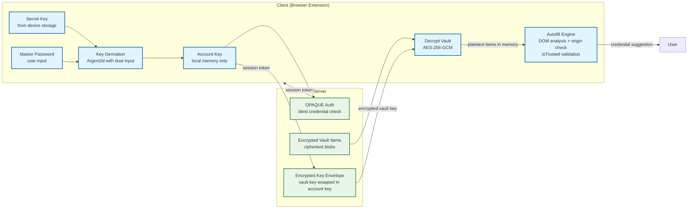
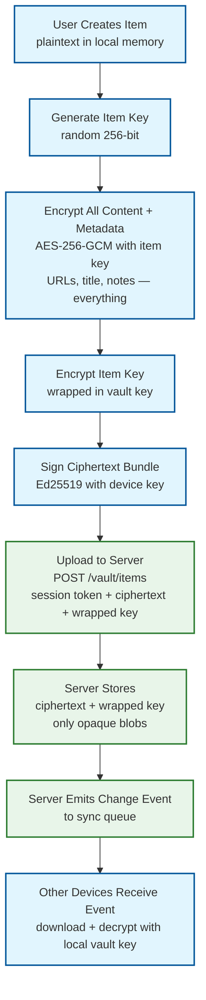
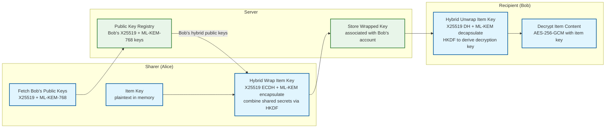
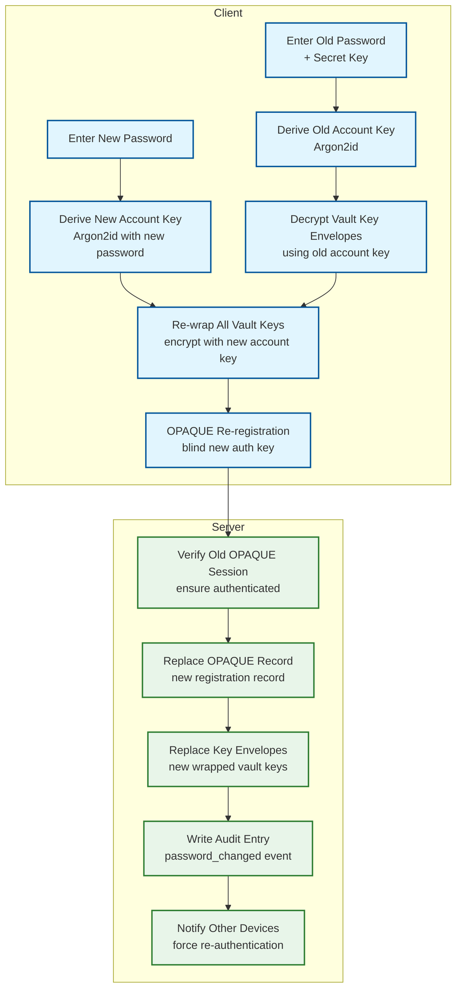
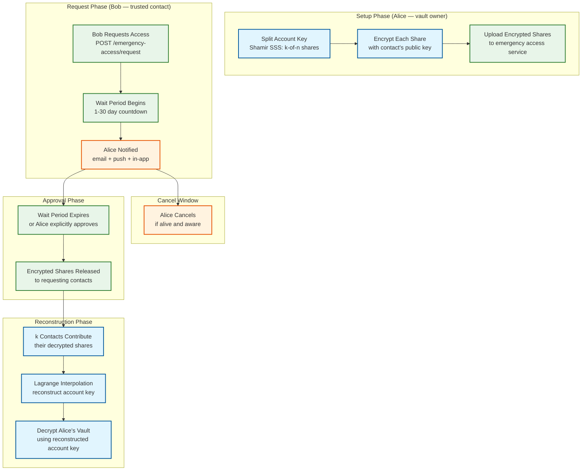
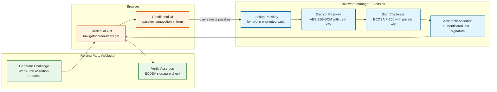
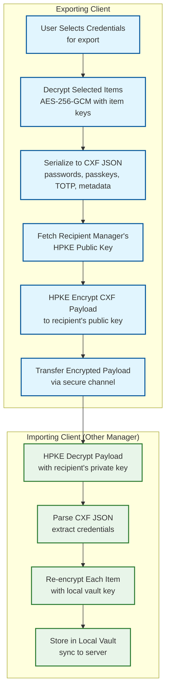
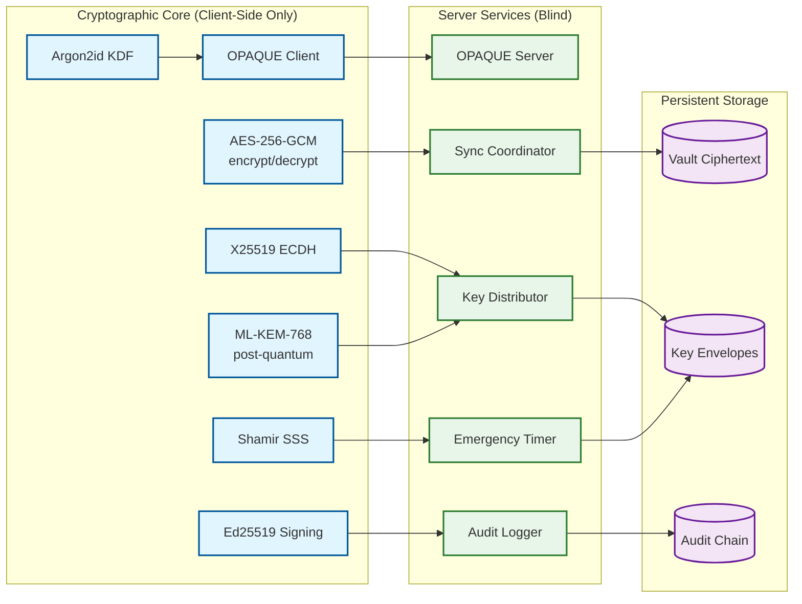

# 02 — High-Level Design: Password Manager

## System Architecture

```mermaid
flowchart TB
    subgraph Clients["Client Layer"]
        WEB[Web App\nbrowser vault UI]
        EXT[Browser Extension\nManifest V3 autofill + overlay]
        MOB[Mobile App\niOS / Android\nSecure Enclave integration]
        DESK[Desktop App\nnative client]
    end

    subgraph Edge["Edge & Gateway Layer"]
        CDN[CDN\nstatic assets + extension updates]
        GW[API Gateway\nTLS 1.3 termination, rate limiting,\nJWT validation, geo-routing]
    end

    subgraph Auth["Authentication Services"]
        OPAQUE_SVC[OPAQUE Auth Service\nregistration + login\nno plaintext password]
        MFA[MFA Service\nTOTP + WebAuthn/FIDO2\nphishing-resistant]
        SESSION[Session Service\ntoken issuance + rotation\ndevice binding]
        PASSKEY_RP[Passkey Relying Party\nWebAuthn assertion verification]
    end

    subgraph Vault["Vault Services"]
        VSYNC[Vault Sync Service\nCRDT merge, versioning]
        VITEMS[Item Store\nciphertext blob storage]
        VKEYS[Key Envelope Store\nencrypted vault/item keys]
        SHARE[Sharing Service\nasymmetric key re-encryption\nhybrid PQ key exchange]
    end

    subgraph Ext["Extension & Autofill Services"]
        HINTS[Autofill Hint Service\nURL → credential metadata]
        BREACH[Breach Detection Service\nk-anonymity hash prefix query]
        PWGEN[Password Generator\nentropy source + policy]
        SENTINEL[Sentinel Monitor\nanomaly detection]
    end

    subgraph Emergency["Emergency, Export & Portability"]
        EMERG[Emergency Access Service\nShamir SSS + time-delay gating]
        EXPORT[Export Service\nCXF format + HPKE transport]
        IMPORT[Import Service\nCSV / CXF ingestion]
    end

    subgraph Infra["Infrastructure Layer"]
        VDB[(Vault DB\nsharded relational\nciphertext + metadata)]
        KEYDB[(Key Store\nencrypted key envelopes\nseparate access controls)]
        AUDITDB[(Audit DB\nappend-only, hash-chained)]
        SYNCQ[Sync Queue\nchange event fan-out]
        CACHE[(Session Cache\nin-memory store)]
        BREACHDB[(Breach Hash DB\nprefix-indexed\n15B+ hashes)]
    end

    WEB & EXT & MOB & DESK --> CDN
    WEB & EXT & MOB & DESK --> GW

    GW --> OPAQUE_SVC --> MFA --> SESSION
    GW --> PASSKEY_RP --> SESSION
    SESSION --> CACHE

    GW --> VSYNC --> SYNCQ
    VSYNC --> VITEMS --> VDB
    VSYNC --> VKEYS --> KEYDB
    SYNCQ --> MOB & DESK & EXT

    GW --> SHARE --> VKEYS
    GW --> HINTS --> VDB
    GW --> BREACH --> BREACHDB
    GW --> SENTINEL
    GW --> EMERG --> KEYDB
    GW --> EXPORT --> VDB
    GW --> IMPORT --> VSYNC

    VSYNC --> AUDITDB
    OPAQUE_SVC --> AUDITDB
    SENTINEL --> AUDITDB

    classDef client fill:#e1f5fe,stroke:#01579b,stroke-width:2px
    classDef api fill:#fff3e0,stroke:#e65100,stroke-width:2px
    classDef service fill:#e8f5e9,stroke:#2e7d32,stroke-width:2px
    classDef data fill:#f3e5f5,stroke:#6a1b9a,stroke-width:2px
    classDef cache fill:#fffde7,stroke:#f57f17,stroke-width:2px
    classDef queue fill:#e0f7fa,stroke:#00695c,stroke-width:2px

    class WEB,EXT,MOB,DESK client
    class CDN,GW api
    class OPAQUE_SVC,MFA,SESSION,PASSKEY_RP,VSYNC,VITEMS,VKEYS,SHARE,HINTS,BREACH,PWGEN,SENTINEL,EMERG,EXPORT,IMPORT service
    class VDB,KEYDB,AUDITDB,BREACHDB data
    class CACHE cache
    class SYNCQ queue
```

---

## Key Design Decisions

### Decision 1: Zero-Knowledge Architecture (Client-Side Encryption)

| Attribute | Detail |
|---|---|
| **Options** | (A) Server-side encryption with server-held keys; (B) Client-side encryption, server stores ciphertext only; (C) Client-side encryption with encrypted metadata (URLs, titles) |
| **Decision** | Option C — all encryption/decryption on client, including all metadata |
| **Rationale** | A server-side compromise in option A exposes all user vaults. Option B (as historically implemented) limits blast radius to "just" metadata — but the 2022 LastPass breach proved that unencrypted metadata (URLs, titles, timestamps) leaks the structure of users' digital lives. Option C encrypts everything: item content, URLs, titles, notes, and timestamps. The server processes only opaque ciphertext envelopes. This eliminates the metadata attack surface entirely, at the cost of making server-side search impossible. |
| **Trade-offs** | Server-side search, deduplication, and analytics are impossible; sharing and emergency access require asymmetric cryptography workarounds; client bears full computational cost. |

### Decision 2: OPAQUE for Authentication (Migrating from SRP)

| Attribute | Detail |
|---|---|
| **Options** | (A) Transmit password hash (bcrypt/Argon2) over TLS; (B) SRP (Secure Remote Password); (C) OPAQUE aPAKE |
| **Decision** | Option C — OPAQUE |
| **Rationale** | Option A sends a credential derivative that a compromised server can use for offline attacks. SRP (B) is widely deployed but not UC-secure and vulnerable to some precomputation attacks. OPAQUE provides mutual authentication, forward secrecy, and a UC-security proof. The master password never leaves the client — even during registration the server receives only an OPRF-blinded output. The IETF CFRG draft is nearing RFC status, and production deployments (major messaging platforms for encrypted backup key recovery) have validated the protocol at scale. Industry leaders are actively migrating from SRP to OPAQUE. |
| **Trade-offs** | More complex to implement than SRP; requires OPAQUE library availability; migration from SRP requires a re-registration flow for existing users (transparent on next login). |

### Decision 3: CRDT-Based Vault Synchronization

| Attribute | Detail |
|---|---|
| **Options** | (A) Last-write-wins (server timestamp); (B) Operational transformation (OT); (C) CRDT per-item versioning with vector clocks |
| **Decision** | Option C — CRDT semantics with vector clocks |
| **Rationale** | LWW (A) is simple but silently drops concurrent updates from different devices. OT (B) is complex to reason about under network partitions. CRDT (C) enables offline-first operation with deterministic merge on reconnect. For a vault, items are independent — merging at item granularity with a set-level CRDT (add-wins for items, LWW within an item using vector timestamps) gives correct behavior without operational transform complexity. |
| **Trade-offs** | Tombstones must be retained for deleted items to prevent re-appearance; vector clocks grow with device count; merge logic must operate on metadata only (no plaintext inspection by server). |

### Decision 4: Asymmetric Re-Encryption for Sharing

| Attribute | Detail |
|---|---|
| **Options** | (A) Share master password or vault key directly; (B) Create shared vault with separate key; (C) Per-item key re-encryption with recipient's public key |
| **Decision** | Options B+C combined — shared vaults with per-item keys wrapped for each recipient |
| **Rationale** | Option A is a zero-knowledge violation. Option B alone doesn't support item-level sharing granularity. Combining B and C: for shared vaults, a vault key is encrypted with each member's public key; for item-level sharing, the item key is wrapped with the recipient's public key. Server orchestrates key distribution but never decrypts. Revoking access means re-encrypting the vault key with a new value and not sharing the new key with the revoked party. |
| **Trade-offs** | Key management complexity grows with sharing depth; forward secrecy on revocation requires re-encrypting all items the revoked user had access to (expensive); key transparency is hard to audit. |

### Decision 5: Time-Delayed Emergency Access with Threshold Cryptography

| Attribute | Detail |
|---|---|
| **Options** | (A) Admin password reset (breaks zero-knowledge); (B) Pre-shared backup key with trusted contact; (C) Shamir's Secret Sharing (k,n) threshold scheme with time delay |
| **Decision** | Option C — Shamir's Secret Sharing with user-configured time delay |
| **Rationale** | Option A destroys zero-knowledge guarantee. Option B requires trusting a single contact entirely. SSS allows the vault owner to split their account key into n shares, requiring k shares to reconstruct. Designating k trusted contacts means any k of them can recover the vault after a configurable waiting period (1–30 days), during which the vault owner can cancel the request. NIST NISTIR 8214C formally endorses threshold cryptography for this pattern. |
| **Trade-offs** | Requires trusted contacts to hold shares securely; time delay introduces latency in genuine emergencies; share holders must be educated users; share revocation requires re-splitting and redistributing. |

### Decision 6: Separate Key Store and Vault Store

| Attribute | Detail |
|---|---|
| **Options** | (A) Store encrypted keys alongside ciphertext in same database; (B) Separate key envelope store with different access controls |
| **Decision** | Option B — physically separate key store |
| **Rationale** | Separating key envelopes from ciphertext enables independent access control policies, separate audit trails, and different replication strategies. A key-only breach reveals no plaintext without the corresponding ciphertext; a ciphertext-only breach reveals nothing without the keys. Defense-in-depth through separation of concerns at the storage layer. |
| **Trade-offs** | Two-database transactions require eventual consistency handling; additional network hop per vault operation; operational complexity of maintaining two distinct data stores. |

### Decision 7: Hybrid Post-Quantum Key Exchange for Sharing and Sync

| Attribute | Detail |
|---|---|
| **Options** | (A) Classical-only (X25519/ECDH); (B) Post-quantum-only (ML-KEM-768); (C) Hybrid classical + post-quantum (X25519 + ML-KEM-768) |
| **Decision** | Option C — hybrid key exchange |
| **Rationale** | Vault data has a multi-decade secrecy lifespan, making harvest-now-decrypt-later (HNDL) a real threat. Classical-only (A) is vulnerable to future quantum attacks. Post-quantum-only (B) relies entirely on algorithms that may still have undiscovered weaknesses (ML-KEM was standardized in NIST FIPS 203 in August 2024). Hybrid (C) provides security from both: even if ML-KEM is broken, X25519 still protects; even if X25519 falls to quantum attack, ML-KEM protects. Applied to all key transport: sharing, device enrollment, CXF export. AES-256 vault encryption is already quantum-resistant and needs no change. |
| **Trade-offs** | Larger key sizes (ML-KEM-768 public key is 1,184 bytes vs. 32 bytes for X25519); ~2x bandwidth for key exchange; slightly higher latency on sharing operations; client libraries must support both algorithms. |

### Decision 8: Passkey Storage with WebAuthn Authenticator Role

| Attribute | Detail |
|---|---|
| **Options** | (A) Store passkeys as opaque blobs (like passwords); (B) Implement full WebAuthn platform authenticator within the password manager |
| **Decision** | Option B — full WebAuthn authenticator |
| **Rationale** | Passkeys are not static secrets like passwords — they are asymmetric key pairs that require active cryptographic operations (assertion signing). Storing them as blobs (A) would require extracting keys and injecting them into the browser's WebAuthn API, which is fragile and browser-dependent. Implementing a full authenticator (B) means the password manager registers itself as a credential provider (via the Credential Provider API on mobile, browser extension APIs on desktop), performs ECDSA/Ed25519 signing internally, and returns completed assertions. This supports conditional UI, discoverable credentials, and shared passkey groups for families/teams. |
| **Trade-offs** | Significant implementation complexity; must track evolving WebAuthn specification; passkey private keys must be encrypted in the vault like any other item; cross-device passkey sync requires the same CRDT infrastructure as password sync. |

### Decision 9: CXP/CXF for Credential Portability

| Attribute | Detail |
|---|---|
| **Options** | (A) Proprietary encrypted export format; (B) CSV plaintext export; (C) FIDO Alliance Credential Exchange Format (CXF) with HPKE transport |
| **Decision** | Option C — CXF with HPKE |
| **Rationale** | Proprietary formats (A) create lock-in and are a regulatory risk as portability requirements tighten. CSV (B) exposes credentials in plaintext during transfer. CXF (C), published by the FIDO Alliance in October 2024, provides a standardized JSON format that all major password managers are adopting. HPKE (Hybrid Public Key Encryption) protects credentials in transit to the receiving manager's public key — no plaintext ever touches disk during transfer. Supports passwords, passkeys, TOTP seeds, and metadata. |
| **Trade-offs** | CXF specification is still evolving; requires both exporting and importing managers to support the protocol; passkey export includes private key material, which has security implications if the receiving manager has weaker protections. |

---

## Data Flow: Vault Unlock and Autofill

**Step-by-step:**
1. User enters master password; secret key is retrieved from device secure storage (Keychain/Keystore).
2. Argon2id derives a 512-bit stretched key from both inputs. First 256 bits become the auth key (used in OPAQUE); second 256 bits become the account key.
3. OPAQUE two-round protocol authenticates user without transmitting password; server returns session token.
4. Client uses session token to fetch encrypted vault key envelope and encrypted vault items.
5. Account key unwraps vault key; vault key unwraps per-item keys; items are decrypted in local memory.
6. Autofill engine matches current page URL against decrypted credential URLs (domain match with registrable domain enforcement) and renders suggestions.
7. On Manifest V3 service worker restart, session key is re-derived from secure storage; vault is re-decrypted from local cache without round-trip to server.

---

## Data Flow: Adding a New Vault Item

---

## Data Flow: Secure Sharing (with Hybrid Post-Quantum Key Exchange)

**Hybrid key exchange detail:**
1. Alice fetches Bob's classical public key (X25519, 32 bytes) and post-quantum encapsulation key (ML-KEM-768, 1,184 bytes) from the server's public key registry.
2. Alice performs X25519 ECDH to derive a classical shared secret (32 bytes).
3. Alice performs ML-KEM-768 encapsulation to derive a post-quantum shared secret (32 bytes) and a ciphertext (1,088 bytes).
4. Both shared secrets are combined via HKDF: `combinedKey = HKDF(classicalSecret || pqSecret, "hybrid-share-v1")`.
5. Alice encrypts the item key with `combinedKey` using AES-256-GCM.
6. The wrapped item key, X25519 ephemeral public key, and ML-KEM ciphertext are uploaded to the server.
7. Bob reverses the process: X25519 DH + ML-KEM decapsulation + HKDF to derive the same `combinedKey`, then decrypts the item key.

---

## Data Flow: Master Password Change

**Critical Rule that never changes:** Individual item keys and vault keys do not change during a password change. Only the account key (the outermost wrapping layer) changes. This means the operation re-wraps O(vaults) key envelopes, not O(items) — typically 1-5 vaults, completing in under a second.

---

## Data Flow: Emergency Access (Shamir's Secret Sharing)

---

## Data Flow: Passkey Authentication (Password Manager as Authenticator)

**Passkey lifecycle:**
1. **Registration:** Website sends a WebAuthn creation request. The password manager generates a new ECDSA P-256 key pair, stores the private key encrypted in the vault (as a passkey-type VaultItem), and returns the public key credential to the website.
2. **Authentication (shown above):** Website sends a challenge. The browser's Credential API routes to the password manager (registered as a credential provider). The manager looks up the matching passkey by rpId, decrypts it, signs the challenge, and returns the assertion.
3. **Sync:** Passkey items sync across devices via the same CRDT infrastructure as passwords. All devices can perform assertions for any synced passkey.
4. **Shared passkey groups:** For family or team sharing, passkey items can be shared via the same asymmetric re-encryption mechanism as passwords — the encrypted private key is re-wrapped for each group member.

---

## Data Flow: CXF Credential Export

**Security properties of CXF export:**
- Credentials are never written to disk in plaintext — they pass from encrypted vault → memory → HPKE ciphertext.
- The recipient manager's HPKE public key is fetched from a FIDO Alliance key directory or exchanged via QR code.
- HPKE provides authenticated encryption: the exporting manager signs the payload, so the importer can verify provenance.
- Passkey export includes the full COSE private key, allowing the receiving manager to perform WebAuthn assertions.
- Users must re-authenticate (master password + MFA) before any export operation.

---

## Component Interaction Summary

This diagram emphasizes the fundamental architectural split: all cryptographic operations execute exclusively on the client. Server services are purely coordinative — they route ciphertext, manage timers, and append to audit logs. No server component ever holds a decryption key or processes plaintext.
