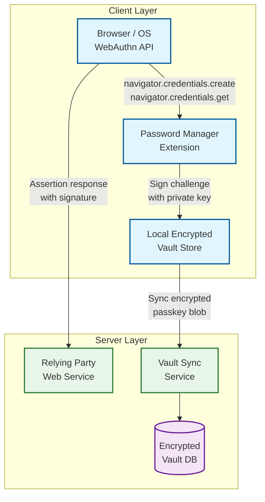

# 04 — Deep Dives & Bottlenecks: Password Manager

## Deep Dive 1: Zero-Knowledge Encryption Architecture

### The Key Hierarchy in Detail

Zero-knowledge means the server is architecturally incapable of decrypting vault contents—not merely contractually prohibited. This requires a precise key hierarchy where every level of encryption is performed client-side before any data touches the network.

```
Master Password (memorized, never stored anywhere)
        │
        ▼ Argon2id (memory-hard KDF, 64 MB, 3 iterations)
   ┌────┴────────────────────────────────────────┐
   │                  512-bit stretched key       │
   └──────┬──────────────────────────────────────┘
          │
    ┌─────┴─────┐
    │           │
authKey    accountKey  (32 bytes each)
  (for      (master encryption key for all other keys)
  OPAQUE)
          │
          ├── wraps ──► vaultKey₁ (per vault, 256-bit random)
          │                  │
          │                  ├── wraps ──► itemKey_A (per item, 256-bit random)
          │                  ├── wraps ──► itemKey_B
          │                  └── wraps ──► itemKey_N
          │
          ├── wraps ──► vaultKey₂ (shared team vault)
          │
          └── wraps ──► deviceSessionKey (per trusted device, short-lived)
```

**Why per-item keys?** Item-level key granularity enables:
- Sharing individual items without exposing the vault key (wrap item key with recipient's public key)
- Rotating a single compromised item's key without re-encrypting the entire vault
- Future support for item-level access expiry

**The account key never leaves the client in plaintext.** When stored server-side, it is wrapped in the `exportKey` derived by OPAQUE during registration. The `exportKey` is itself never stored—it exists only transiently during the OPAQUE protocol execution.

### Limitations of Zero-Knowledge Claims

Research from ETH Zurich (USENIX Security 2026) identified 12 attacks against major password managers that technically violated zero-knowledge semantics:

1. **Integrity-only violations**: Server can swap ciphertext between items without the client detecting it—if authentication tags are valid for the item but don't bind the item ID in the AAD. **Fix**: Include item ID and vault ID as AEAD additional authenticated data (AAD), so any re-ordering is detectable.

2. **Downgrade attacks**: Servers could force older, weaker cryptographic parameters (e.g., PBKDF2 instead of Argon2id) on authentication. **Fix**: Client-enforced minimum parameters; KDF algorithm and parameters signed into the key envelope.

3. **Organization vault privilege escalation**: Admin accounts in organization vaults with server-mediated key distribution allowed server to assign vault keys to unauthorized members. **Fix**: Cryptographic membership proofs; key distribution signed by existing members.

### Key Rotation

When a user changes their master password:
1. Client derives new `accountKey'` from new master password
2. Client re-wraps all vault keys with `accountKey'` — vault keys themselves don't change
3. Client re-wraps account key for OPAQUE with new auth material
4. Atomic server update: new `encryptedAccountKey`, new `vaultKeyEnvelopes`, new OPAQUE record
5. All other devices are forcefully signed out (their session keys are now stale)

Vault key rotation (e.g., after revoking a shared user) requires:
1. Generate new vault key
2. Re-encrypt all items under new vault key (client-side, sequential or batched)
3. Upload new ciphertext blobs atomically with new vault key envelope
4. Revoke old vault key envelopes

This is expensive for large vaults but necessary for forward secrecy on revocation.

---

## Deep Dive 2: Vault Synchronization

### Offline-First Architecture

Every client maintains a local encrypted SQLite database (or equivalent structured store) containing:
- All vault item ciphertext blobs
- Item metadata (id, version_vector, timestamps, tombstones)
- Pending write queue (mutations not yet confirmed by server)
- Last-confirmed sync version per vault

**Write path (online):**
1. User edits item → client encrypts → writes to local store → increments local device clock in version vector
2. Client immediately sends to server; server confirms with updated server_version
3. Server fan-outs change event to other devices via WebSocket / push notification

**Write path (offline):**
1. User edits item → client encrypts → writes to local store
2. Mutation enqueued in pending write queue
3. On reconnect, client uploads pending queue; server resolves with CRDT merge

**Read path (online):** Client polls for changes since `last_sync_version` on reconnect; WebSocket push during active session.

**Read path (offline):** Client reads entirely from local store — no network required.

### Conflict Resolution Deep Dive

For a vault with devices A, B, C, the version vector for an item might look like:
```
localState:   { A: 5, B: 3, C: 0 }  // A and B have edited this item
serverState:  { A: 5, B: 2, C: 1 }  // C has also edited (server has B:2 not B:3)
```

Neither state dominates the other — concurrent edit by B and C on the same item. Resolution:
- Compare `client_modified_at` timestamps (last client-reported edit time)
- Higher timestamp wins within the item
- Losing version is kept as a "conflict copy" accessible to the user
- Merged version_vector: `{ A: 5, B: 3, C: 1 }` (component-wise max)

**Tombstone retention:** Deleted items (is_deleted=true) must be retained until all known devices have confirmed they received the deletion sync. The server maintains a device acknowledgment map per tombstone and purges only after all registered devices have synced past the deletion event.

### Sync Protocol Details

```
Client → Server:  POST /sync  { device_id, last_sync_version: 1047 }
Server → Client:  {
  changes: [
    { id: "abc", version_vector: {...}, encrypted_data: "...", is_deleted: false },
    { id: "def", is_deleted: true, version_vector: {...} }
  ],
  server_version: 1089,
  next_poll_after: 30s
}
```

The server applies changes to its append-only change log and resolves concurrent writes using database-level optimistic locking (`version_vector` comparison before update). Clients that fail the version check receive a 409 Conflict with the current server state, forcing client-side merge.

---

## Deep Dive 3: Browser Extension Security Model

### Architecture Overview

The browser extension comprises three isolated components:
1. **Service Worker (background script)**: Holds the unlocked vault in memory after authentication; processes autofill requests; communicates with the cloud API
2. **Content Script**: Injected into every web page; scans DOM for form fields; communicates with service worker via message passing (never shares memory)
3. **Extension Popup**: The vault UI; communicates with service worker via message passing

**Critical isolation property**: Content scripts run in an isolated world—they share the page's DOM but not its JavaScript runtime. Web page JavaScript cannot access content script variables, and vice versa. The vault keys and decrypted credentials live only in the service worker, never in the content script or page context.

### Autofill Security Controls

**Origin binding**: Credentials are bound to a registrable domain (eTLD+1). The content script reports the current page origin to the service worker; the service worker returns only matching credentials. This prevents:
- Subdomain hijacking (`evil.bank.com` cannot receive `bank.com` credentials)
- Homoglyph attacks (visual lookalike domains detected via Unicode normalization)

**DOM-based clickjacking defense** (addressing 2025 research):
- Extension overlay buttons rendered in isolated extension iframe, not injected into page DOM
- Pointer-events overlay detection: if a transparent element covers the extension iframe, autofill is blocked
- Intersection Observer API used to detect if the extension icon is fully visible before activating

**Fill-on-submit vs. fill-on-page-load**:
- Fill-on-page-load: convenient but leaks credential existence to page analytics
- Fill-on-submit: safer — credentials only filled after explicit user interaction, triggered by keypress or button click
- Production default: fill-on-demand with user click; fill-on-page-load configurable

### Session Key Storage

After vault unlock, the service worker holds the vault key in memory. Persistent storage options:
- **Memory only (safest)**: Key lost on browser restart; user re-enters master password
- **OS secure storage via native messaging**: Extension calls native app that stores key in OS keychain; survives restart; requires native host installation
- **Extension local storage (encrypted)**: Key encrypted with a device-bound key stored in OS keychain; usable in Manifest V3 service workers

Manifest V3 service workers are terminated after inactivity, requiring periodic "keep-alive" mechanisms or re-derivation from cached encrypted session.

### AI Agent Autofill Risk (2025 concern)

As AI browser agents emerge, they can trigger autofill programmatically without user interaction. Production defenses:
- Autofill only triggered on verified user gesture events (isTrusted=true in event object)
- AI agents require explicit user authorization before credential injection
- Audit log records whether autofill was user-initiated or agent-initiated

### Manifest V3 Service Worker Lifecycle

Manifest V3 replaced persistent background pages with ephemeral service workers that the browser can terminate after ~30 seconds of inactivity. This fundamentally changes how the extension manages vault state.

**Problem**: A terminated service worker loses all in-memory vault keys. Users would need to re-enter their master password after every idle period.

**Workarounds and trade-offs:**

| Approach | How It Works | Security Cost |
|---|---|---|
| **Periodic keep-alive** | Ping the service worker every 25s via alarm API | Keeps keys in memory indefinitely; weaker timeout model |
| **Offscreen document** | Use `chrome.offscreen.createDocument()` to host a hidden DOM that survives longer | Still terminates eventually; adds attack surface |
| **Native messaging bridge** | Service worker delegates key storage to a native host app using OS keychain | Best security; requires native app installation |
| **Encrypted session storage** | Wrap vault key with device-bound key; store in `chrome.storage.session` | Key available across restarts; encrypted at rest by browser |

**Production recommendation**: Combine encrypted session storage for convenience with native messaging for high-security accounts. The device-bound wrapping key should itself be stored in the OS secure enclave and accessible only via biometric or PIN verification.

---

## Deep Dive 4: Emergency Access with Shamir's Secret Sharing

### Setup Phase (Vault Owner — Alice)

1. Alice designates Bob as emergency contact with threshold k=1, n=1 (or distributes k=2, n=3)
2. Client generates n Shamir shares of Alice's account key
3. Each share encrypted with the designated contact's public X25519 key
4. Encrypted shares uploaded to server; server stores opaque blobs associated with emergency record
5. Alice receives a recovery verification code (optional backup not requiring contacts)

### Request Phase (Emergency Contact — Bob)

1. Bob requests emergency access via the app
2. Server records request time; sends email notification to Alice
3. Alice has `wait_period_days` (1–30) to cancel the request
4. If not cancelled, server releases Bob's encrypted share to Bob after the wait period
5. Bob decrypts his share using his private key; if k=1 of n=1, full account key recovered
6. Bob can decrypt Alice's encrypted account key envelope → decrypt vault keys → decrypt vault

### Multi-Party Threshold (k=2 of n=3)

For higher security:
- Three trusted contacts (Carol, Dave, Eve) each hold one share
- Any 2 of 3 can collaborate to recover Alice's account key
- If one contact is compromised or unavailable, recovery still works with the other two
- Server serves each contact's share independently (each is encrypted for that contact's key)
- Reconstruction happens client-side using Lagrange interpolation

### Security Properties

- **Server blindness**: Server stores only encrypted shares; cannot reconstruct the account key
- **Forward secrecy from Alice's perspective**: Alice can cancel any pending request before the wait period expires
- **Share revocation**: Alice can revoke and regenerate all shares (re-split account key) without changing the vault key — useful if a contact relationship ends
- **Audit trail**: All emergency access events (invite, request, cancel, approve) logged in tamper-evident audit log

---

## Deep Dive 5: Passkey Storage and WebAuthn Architecture

### Passkeys as First-Class Vault Items

Passkeys (discoverable FIDO2 credentials) are increasingly replacing passwords. A password manager storing passkeys becomes the authenticator itself, which introduces architectural requirements beyond traditional credential storage.



### Passkey Storage Format

Each passkey item in the vault contains:

```
PasskeyItem {
  credential_id:      bytes        // Public identifier sent to relying party
  rp_id:              string       // Relying party origin (e.g., "example.com")
  rp_name:            string       // Human-readable relying party name
  user_handle:        bytes        // Opaque user identifier from RP
  user_display_name:  string       // User-provided display name
  private_key:        bytes        // ECDSA P-256 or Ed25519 private key (encrypted)
  public_key:         bytes        // Corresponding public key
  sign_count:         uint32       // Monotonic counter (anti-replay)
  created_at:         timestamp
  last_used_at:       timestamp
  discoverable:       bool         // Whether this is a resident/discoverable credential
  extensions:         map          // PRF, largeBlob, credBlob extensions
}
```

**Critical**: The private key is the secret; it must be encrypted with the item key like any other sensitive field. The `credential_id` and `public_key` are not secrets but should still be encrypted to avoid metadata leakage (revealing which relying parties a user has accounts with).

### Sign Count Synchronization Problem

WebAuthn relying parties use `sign_count` to detect cloned authenticators. Each authentication increments the counter; if the RP sees a counter value lower than the last one, it flags a potential clone.

**Problem with multi-device sync**: If Device A and Device B both sign with the same passkey between syncs, the sign count diverges. The RP may see counter values arrive out of order.

**Solutions:**
1. **Global counter via sync service**: Before each authentication, client requests a counter increment from the sync service. This adds latency and requires connectivity.
2. **Per-device counter partitioning**: Assign counter ranges per device (Device A uses even numbers, Device B uses odd). Avoids collisions but breaks monotonic assumption for multi-device.
3. **Zero counter strategy**: Set `sign_count = 0` permanently, signaling to the RP that this authenticator does not support clone detection. This is the approach adopted by most synced passkey implementations.

**Production recommendation**: Use `sign_count = 0` (option 3). Clone detection is irrelevant when the password manager explicitly supports multi-device sync. Relying parties SHOULD NOT reject zero-counter credentials per the WebAuthn L3 specification.

### Passkey Sharing and Organization Vaults

Sharing passkeys in an organization vault introduces a unique challenge: the private key must be usable by multiple users, but the relying party sees only one credential. This works because:
- The passkey is stored encrypted in the shared vault
- Any member with vault access can decrypt the private key and sign challenges
- The relying party is unaware that multiple humans share the credential
- Audit logging on the password manager side tracks which user performed each authentication

---

## Race Conditions and Edge Cases

### Concurrent Vault Key Rotation and Item Write

**Scenario**: Device A starts rotating vault key (re-encrypting all items) while Device B simultaneously writes a new item under the old vault key.

**Risk**: Device B's new item is encrypted with old vault key. After rotation, the old vault key should be discarded. Device B's item appears corrupt.

**Resolution**:
- Vault key rotation is a server-atomic operation: server increments `key_rotation_version`
- All writes must include the `key_rotation_version` they used for encryption
- Server rejects writes with stale `key_rotation_version` after rotation completes
- Device B receives 409 Conflict, re-fetches new vault key envelope, re-encrypts, retries

### Account Key Derived from Compromised Master Password

If master password is phished:
1. Attacker immediately changes master password, locking out legitimate user
2. Legitimate user has no way to prove identity to recover zero-knowledge vault

**Mitigations**:
- Email-based 2FA required for master password change
- 72-hour grace period where previous session tokens remain valid (allows legitimate user to notice and cancel)
- TOTP/WebAuthn MFA on account prevents attacker from completing master password change

### Device Revocation During Active Session

**Scenario**: Admin revokes Device B from the account while Device B has an active session with a valid session token and cached vault keys in memory.

**Risk**: Device B continues to read and write vault data using its cached session. Writes from a revoked device could overwrite legitimate changes. The revoked device retains decrypted vault data in its local store.

**Resolution**:
- Session tokens include a `device_id` claim; the auth service maintains a revocation list checked on every API call
- Server rejects any API request from a revoked device with a 403 and a `DEVICE_REVOKED` error code
- The revoked device's local vault store is flagged for remote wipe at next connectivity (the server sends a push notification with a wipe command)
- If the revoked device never comes online again, the local data persists but the device cannot obtain fresh vault key envelopes to decrypt new items
- Server-side: all vault key envelopes issued to the revoked device are deleted; future rotations exclude the device

### Emergency Access and Master Password Change Race

**Scenario**: Alice initiates a master password change at T=0. Bob's emergency access request (submitted days earlier) clears its waiting period at T=1 (seconds later). Bob receives Alice's old account key shares while Alice's new account key is being committed.

**Risk**: Bob recovers the old account key. If Alice's master password change is atomic, the old account key is no longer valid — Bob's emergency access fails. If the change is non-atomic, Bob might decrypt some items encrypted under the old key and miss items re-wrapped under the new key.

**Resolution**:
- Master password change atomically invalidates all pending emergency access shares (they were encrypted with a derivative of the old key material)
- Emergency contacts are notified that their share has been revoked and Alice must re-issue shares
- The server enforces a lock: during a master password change transaction, emergency access release is blocked (`emergency_lock` flag on the account)
- If Alice's password change fails mid-transaction, the old shares remain valid

### Shared Vault Key Rotation During Member Join

**Scenario**: Admin initiates shared vault key rotation (due to a departing member) while simultaneously a new member is being added. The join operation encrypts the old vault key for the new member; the rotation generates a new vault key.

**Risk**: New member receives an envelope for a vault key that is immediately rotated and discarded. The new member cannot decrypt any vault items.

**Resolution**:
- Vault key rotation acquires an advisory lock on the vault membership list
- Member additions check the lock and either queue behind the rotation or abort with a retry hint
- If the join completes before rotation starts, the rotation includes the new member when re-wrapping the new vault key
- Server returns `vault_key_version` with every sync response; client detects version mismatch and re-fetches the vault key envelope

### AI Agent Autofill Race Condition

**Scenario**: A user has an AI browser agent managing form submissions. The agent calls autofill for Site A while the user simultaneously navigates to Site B. The content script reports Site B's origin to the service worker, but the agent's autofill request was bound to Site A's tab context.

**Risk**: Credential for Site A injected into Site B's form, leaking credentials to the wrong origin.

**Resolution**:
- Autofill requests include the `tab_id` and `frame_id` from the requesting content script
- The service worker verifies that the tab's current URL matches the requested origin at the moment of fill (not at the time of the request)
- If the URL has changed between request and fill, the operation is aborted with a `ORIGIN_MISMATCH` error
- A nonce is generated at request time and verified at fill time; if the content script has been replaced (navigation), the nonce is invalid

### Tombstone Accumulation

With millions of active users performing frequent operations, tombstone accumulation degrades sync performance. After 90 days (configurable), tombstones are pruned if:
- All registered devices have confirmed they synced past the deletion event
- No pending emergency access grants exist that predate the deletion

Purged items are moved to encrypted backup vaults for audit retention purposes.

### Dual-Key Derivation Failure on Weak Master Password

**Scenario**: A user creates an account with a 4-character master password. The Argon2id derivation succeeds, but the resulting account key has low effective entropy (bounded by the password's ~20 bits, regardless of Argon2id stretching).

**Risk**: Offline Brute Force (Checking every single possibility) against stolen ciphertext is feasible in hours.

**Resolution** (inspired by the dual-key model):
- At account creation, the client generates a 128-bit random Secret Key stored only on the user's devices (never on the server)
- The effective key material is `Argon2id(master_password || secret_key)`, giving a minimum floor of 128 bits of entropy even with a weak master password
- The Secret Key is displayed once at setup for the user to record offline
- Account recovery requires both the master password and the Secret Key
- Trade-off: losing the Secret Key with no backup means permanent lockout — recovery is impossible by design

---

## Failure Mode Analysis

### Failure Mode 1: Key Store Becomes Unavailable

**Trigger**: Key store database (holding encrypted account key envelopes and vault key envelopes) suffers an outage — hardware failure, network partition, or runaway query.

**Cascade effects:**
1. No new device enrollments (devices cannot fetch their vault key envelopes)
2. No master password changes (cannot write new key envelopes)
3. No shared vault member additions (cannot issue new vault key envelopes)
4. Existing sessions with cached keys continue working normally

**Detection**: Deep health check fails (synthetic key fetch returns error); circuit breaker opens for key-store-dependent operations within 10 seconds.

**Mitigation stack:**
- Key store has 5x replication; single-replica failure is transparent
- On full primary failure, promote synchronous replica (< 2 minutes)
- All clients cache their vault key envelopes locally after first fetch; key store outage does not prevent vault access on already-enrolled devices
- Key-dependent operations (password change, device enrollment, sharing) are queued and retried with exponential backoff

### Failure Mode 2: Sync Service Partition

**Trigger**: Network partition isolates the sync service from the vault database but not from clients.

**Cascade effects:**
1. Clients can connect to sync service but receive stale data or timeout on writes
2. Multiple clients making concurrent edits accumulate divergent local states
3. On partition heal, a burst of conflict resolution requests hits the server

**Detection**: Sync service health check detects DB connection failure; transitions to degraded mode.

**Mitigation stack:**
- Sync service returns HTTP 503 with `Retry-After` header; clients fall back to local-only mode
- Clients continue operating from local encrypted store; mutations queued in pending write queue
- On partition heal, clients sync pending queues ordered by `client_modified_at`; server processes with standard CRDT merge
- Burst control: server applies per-account rate limiting during recovery to prevent thundering herd

### Failure Mode 3: Browser Extension Crash During Autofill

**Trigger**: Service worker crashes (out-of-memory, uncaught exception) while credentials are being injected into a page form.

**Cascade effects:**
1. Partial fill: username injected but password field empty (or vice versa)
2. User submits form with incomplete credentials, potentially triggering account lockout on the target site
3. Service worker restarts but vault key is lost from memory

**Detection**: Content script detects that the message channel to the service worker was closed mid-fill.

**Mitigation stack:**
- Atomic fill: content script receives both username and password in a single message; fills both fields in a single synchronous DOM operation; partial fill cannot occur from a single message
- If the message channel closes before the fill message is received, the content script does not fill any field
- Service worker recovery: on restart, re-derive vault key from encrypted session storage (not from master password re-entry) to minimize disruption

### Failure Mode 4: Tombstone Storm After Mass Delete

**Trigger**: An organization admin deletes a shared vault with 50,000 items. Each item generates a tombstone record. All organization members (10,000 users × 3 devices) receive 50,000 tombstone sync events.

**Cascade effects:**
1. 50,000 × 30,000 = 1.5 billion sync messages fanned out
2. Sync service overwhelmed; queue depth spikes; auto-scaler lags behind
3. Client-side sync takes minutes; UI appears frozen

**Detection**: Sync queue depth exceeds threshold; per-vault change rate alert triggers.

**Mitigation stack:**
- Batch tombstones: a vault deletion generates a single `vault_deleted` event rather than per-item tombstones
- Clients receiving `vault_deleted` event purge all items for that vault locally in one operation
- Tombstone coalescing: if more than 100 tombstones are generated for the same vault within 60 seconds, collapse into a single `bulk_delete` event
- Fan-out throttling: spread device notifications over a 5-minute window rather than instant delivery

---

## Slowest part of the process Analysis

| Slowest part of the process | Description | Mitigation |
|---|---|---|
| **Argon2id on auth** | 64MB/3-iter Argon2id per login; at 5,000 auth/s this requires 320 GB RAM for parallel computation | Auth is client-side; server only runs OPAQUE, which is lightweight — Slowest part of the process is on user's device, not server |
| **Vault sync fan-out** | 50,000 changes/s; each change fanned out to avg 3 devices = 150,000 push messages/s | Sync queue with connection-aware fan-out; coalesce changes if device is offline; WebSocket multiplexing per account |
| **Breach hash database queries** | 10M breach checks/day with 10 TB bloom filter / hash index | Read-replicated breach DB; CDN-cached prefix ranges (prefix space is only 16^5 = 1M buckets); most prefixes cacheable |
| **Large vault initial download** | Users with 2,000+ items: 2,000 × 2KB = 4 MB of ciphertext on first sync | Paginated download with streaming decompression; zstd compression reduces ciphertext size ~40% |
| **Key rotation for large shared vaults** | 10,000-member org vault key rotation: re-encrypting key for each member = 10,000 ECDH + AES operations | Batched server-side re-wrapping using admin's account key; admin client does operation; parallelized with concurrency limit |
| **Hot account contention** | Org admin account reads vault key 100,000 times/day as members sync | Cache encrypted vault key envelopes at CDN edge (safe — they're ciphertext); only key material changes on rotation |
| **Passkey sign count sync** | Every passkey authentication requires a globally consistent counter increment across all devices | Use `sign_count = 0` strategy; eliminates counter synchronization overhead entirely |
| **Service worker restart overhead** | Manifest V3 terminates service worker after 30s idle; re-derivation of vault key on every restart adds 200–500ms latency | Cache encrypted vault key in `chrome.storage.session`; decrypt with device-bound key on restart; avoid full Argon2id re-derivation |
| **Emergency share re-generation** | Master password change invalidates all Shamir shares; re-splitting and re-encrypting for N contacts is O(N) public-key operations | Parallelize share encryption; notify contacts asynchronously; accept that emergency access is temporarily unavailable during rotation |
| **Conflict copy accumulation** | High-edit-frequency shared vaults accumulate conflict copies that bloat sync payloads | Auto-resolve conflicts older than 7 days using last-writer-wins; present unresolved conflicts in UI with merge assistant |
| **WebSocket connection scaling** | 50M users × 3 devices × 0.1 active fraction = 15M concurrent WebSocket connections | Connection-aware fan-out; coalesce changes per connection; use server-sent events as fallback for low-activity devices |
| **Cross-shard sharing latency** | Sharing an item from shard 1 to shard 3 requires two sequential writes with event propagation | Accept eventual consistency (< 5s); use internal event queue with at-least-once delivery; client polls for pending shares |
