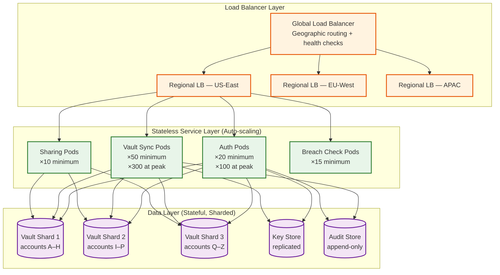
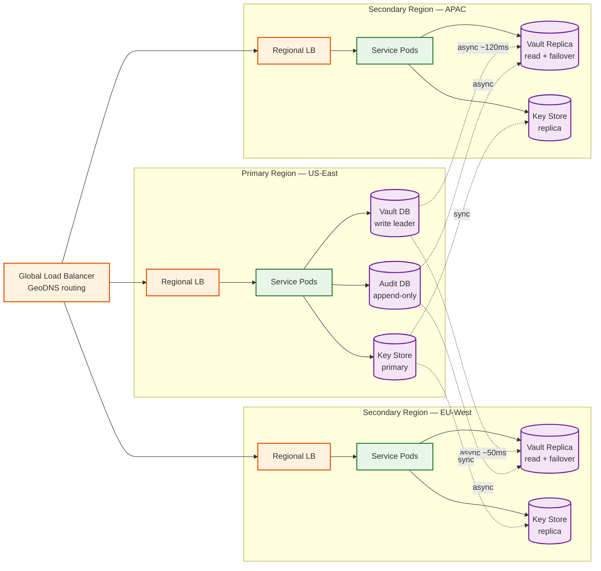
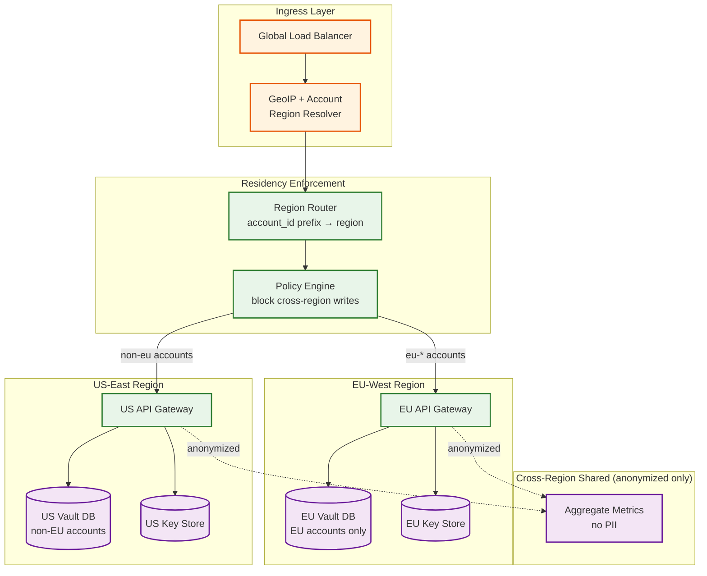

# 05 — Scalability & Reliability: Password Manager

## Horizontal Scaling Strategy

### Service Layer



All API service pods are stateless. Account-to-shard mapping uses consistent hashing on `account_id` to reduce rebalancing during scale events. Services scale horizontally based on:
- CPU utilization (target 60% average)
- Request queue depth (auto-scale when > 1,000 pending requests)
- Connection count (for WebSocket-heavy vault sync pods)

### Database Sharding

Vault data is sharded by `account_id` using consistent hashing with 256 virtual nodes. Each physical shard hosts ~8 million accounts at 50M total:

```
Vault DB per shard:
  Items:      7.5B total / 3 shards = 2.5B items per shard
  Storage:    2.5B × 2KB = 5 TB per shard
  Plus index: ~500 GB per shard (item_id, vault_id, modified_at)
  Replicas:   3 synchronous replicas per shard
```

**Shard routing**: The API gateway resolves account shard membership from a lightweight shard map cache (account_id prefix → shard endpoint). Shard map fits in memory (~50 MB) and is refreshed every 30 seconds.

**Cross-shard operations**: Sharing items across accounts (Alice in shard 1, Bob in shard 3) avoids distributed transactions by using an eventually consistent approach:
1. Alice's shard records the share grant (SharedItemRecord)
2. Share record fanned out to Bob's shard via internal event queue
3. Bob's client polls `/shares/received` which reads from Bob's shard

---

## Vault Replication

### Multi-Region Replication



**Replication strategy by data type:**
| Data | Replication Mode | Rationale |
|---|---|---|
| Vault ciphertext | Asynchronous | Slight staleness acceptable; client has local copy |
| Key envelopes | Synchronous | Auth must succeed in any region; cannot serve stale keys |
| Audit log | Asynchronous | Durability over consistency; eventual consistency acceptable |
| Session cache | No replication | Sessions re-issued per region; client re-authenticates on regional failover |

### Data Residency Enforcement

For GDPR (EU), PDPA (APAC), and other data sovereignty regulations, user accounts are pinned to their home region. The routing and enforcement architecture prevents accidental cross-border data leakage.



**Enforcement rules:**
- `account_id` includes a region prefix assigned at account creation based on the user's declared country of residence (e.g., `eu-XXXX`, `ap-XXXX`, `us-XXXX`)
- The policy engine rejects any API request where the `account_id` prefix does not match the region of the receiving API gateway
- Cross-region vault sharing: when an EU user shares an item with a US user, only the encrypted item key envelope is replicated to the US region — the ciphertext blob remains in the EU region, and the US client fetches it via a cross-region read proxy with audit logging
- Region migration (user moves from EU to US): requires explicit user consent, generates a data transfer audit record, and re-pins all data to the new region within 72 hours

---

## Conflict Resolution at Scale

### Change Log Architecture

All vault changes are appended to a per-vault change log before being applied to the item store. This provides:
1. **Replay**: New devices can catch up by replaying from change log
2. **Ordering**: Total ordering of changes per vault
3. **Audit**: Full history of vault mutations (encrypted)

```
VaultChangeLogEntry {
  sequence_number:  bigint            // monotonically increasing per vault
  item_id:          UUID
  operation:        enum              // upsert, delete
  ciphertext_diff:  bytes?            // for upsert: full new ciphertext
  version_vector:   map
  device_id:        UUID
  timestamp:        timestamp
}
```

Change log is retained for 90 days (configurable). Clients sync by providing their last known `sequence_number`; server returns all subsequent entries.

### Conflict Handling at Server Layer

The server performs optimistic locking on `version_vector` during writes:
```
function attemptWrite(item, incomingVersionVector):
  currentItem = fetchFromDB(item.id)

  if currentItem is null:
    // New item — write unconditionally
    DB.insert(item)
    return SUCCESS

  if vectorDominates(incomingVersionVector, currentItem.version_vector):
    // Incoming update is strictly newer — safe to overwrite
    DB.update(item)
    return SUCCESS

  elif vectorDominates(currentItem.version_vector, incomingVersionVector):
    // Server has newer version — reject client's stale write
    return CONFLICT(currentItem)

  else:
    // True concurrent edit — server records both; client merges
    DB.insertConflictCopy(item, incomingVersionVector)
    return CONFLICT_MERGE_REQUIRED(currentItem)
```

Conflict copies are flagged with `has_conflict=true` and presented to the user during the next vault unlock.

---

## Back-Pressure Mechanisms

### Why Back-Pressure Matters for Password Managers

Unlike most SaaS applications, a password manager cannot simply drop requests under load — a failed sync could mean a user loses access to newly saved credentials. Back-pressure must be applied carefully to delay, batch, or throttle rather than discard.

### Per-Account Write Throttling

Each account is limited to a maximum write rate to prevent abuse and protect shared infrastructure:

```
WriteThrottle {
  max_writes_per_minute:    60      // Normal usage is ~5 writes/min
  burst_allowance:          20      // Short burst for vault import
  overflow_behavior:        queue   // Queue excess writes; never drop
  queue_max_depth:          500     // Per-account pending write queue
  queue_overflow_action:    429 Too Many Requests with Retry-After
}
```

When a user imports a vault (thousands of items at once), the client batches items into groups of 50 and submits with a self-imposed delay. The server accepts batches up to the burst allowance and queues the rest, returning a `Retry-After` header.

### Sync Fan-Out Throttling

When a change is committed, it must be fanned out to all of the user's devices. During peak hours or mass-change events (e.g., a breach response triggering password rotations across an enterprise), the fan-out system applies back-pressure:

1. **Priority queuing**: Authentication-critical changes (master password rotation, device revocation) get highest priority; regular item changes are lower priority
2. **Coalescing**: If multiple changes to the same item occur within a 5-second window, only the latest state is fanned out
3. **Staggered delivery**: Device notifications are spread over a configurable window (default 30 seconds for non-critical changes) to avoid thundering herd
4. **Connection-aware routing**: Devices connected via WebSocket receive changes inline; offline devices receive a single "sync needed" push notification on reconnect rather than individual change notifications

### Database Write Queue Depth Monitoring

The vault database maintains a write-ahead queue. When queue depth exceeds thresholds, progressive back-pressure is applied:

| Queue Depth | Action |
|---|---|
| < 1,000 | Normal operation |
| 1,000 – 5,000 | Delay non-critical writes (metadata updates, audit log) by 500ms |
| 5,000 – 10,000 | Enable write coalescing; throttle per-account writes to 30/min |
| > 10,000 | Shed load: return 503 for new sync requests; existing sessions continue from local cache |

---

## Reliability: Circuit Breakers and Graceful Degradation

### Degraded Mode Operation

| Service Degraded | Client Behavior |
|---|---|
| Sync service unavailable | Client operates fully from local encrypted cache; mutations queued locally |
| Breach check service down | Autofill proceeds without breach warning; non-blocking |
| Auth service degraded | Existing valid session tokens continue working; no new logins |
| Key store unavailable | No new device enrollments; existing devices with cached session keys continue |
| Emergency access service down | Emergency requests cannot be submitted; non-blocking on normal operations |

### Health Checks and Circuit Breakers

Each service implements three health check levels:
1. **Liveness**: Is the process running? → Restart if fails
2. **Readiness**: Can it serve traffic? (DB connection live, cache warm) → Remove from load balancer
3. **Deep health**: Can it complete a synthetic vault read/write? → Alert on-call; trigger circuit breaker

Circuit breaker configuration for vault sync:
```
CircuitBreaker {
  failureThreshold:  5 failures in 10 seconds
  halfOpenRequests:  1 probe request every 30 seconds
  openDuration:      60 seconds before testing recovery
  fallbackBehavior:  serve from read replica; queue writes
}
```

---

## Disaster Recovery

### Recovery Objectives

| Scenario | RTO | RPO | Strategy |
|---|---|---|---|
| Single pod failure | < 30s | 0 | Auto-restart; load balancer failover |
| Single DB replica failure | < 2 min | 0 | Replica promotion (synchronous replica up-to-date) |
| Full region failure | < 1 hour | < 5 min | DNS failover to secondary region; async replication lag = RPO |
| Data corruption | < 4 hours | < 24 hours | Point-in-time restore from daily snapshot |
| Ransomware / total data loss | < 24 hours | < 24 hours | Offsite encrypted backup restore |

### Backup Strategy

```
Daily full backup:
  - Vault DB snapshot: encrypted, archived to geographically separate object storage
  - Key store snapshot: encrypted with separate backup encryption key (held offline)
  - Audit log: append-only; entire history preserved

Continuous WAL shipping:
  - PostgreSQL WAL streamed to secondary regions in real time
  - Point-in-time recovery (PITR) to any second in last 7 days

Backup integrity:
  - Weekly automated restore drill to isolated environment
  - Backup decryption verified (plaintext structure validated without exposing user data)
  - Restore time measured against RTO targets quarterly
```

### Key Continuity During Disaster

A special concern for zero-knowledge systems: if the key store is lost, all encrypted vault data becomes permanently inaccessible. Mitigations:
1. **Key store has 5× replication** across geographically distributed data centers (synchronous for primary region)
2. **Offline backup keys**: Key store encryption master key held in offline HSM; required only for key store recovery, not normal operations
3. **User-held recovery keys**: Users can optionally export their vault in an encrypted format that only their master password can decrypt — truly air-gapped backup

---

## Multi-Region Active-Active Consideration

### Challenge

Active-active multi-region requires resolving cross-region write conflicts. For a zero-knowledge system:
- Server cannot read ciphertext to do semantic merge
- Must rely entirely on metadata (version vectors, timestamps) for conflict resolution
- Cross-region replication lag (50–150ms) means concurrent writes to same item are possible

### Decision: Primary-with-Hot-Standby

Rather than active-active, use active-passive-with-fast-failover:
- All writes go to primary region
- Secondary regions serve reads from replicas
- On primary region failure, secondary promoted via DNS TTL=30s
- Accept up to 50ms (primary-region RTT) latency increase for writes from other regions
- European users routed to EU-West primary; APAC routed to APAC primary; others to US-East

This reduces conflict rate dramatically while providing sub-1-minute failover. Complexity of cross-region active-active conflict resolution without plaintext inspection is prohibitive.

---

## Load Testing and Capacity Planning

### Key Scenarios

| Scenario | Target Load | Slowest part of the process Identified |
|---|---|---|
| Morning sync storm | 200,000 sync requests/minute | Vault DB read IOPS; mitigated by read replicas |
| Mass password change event (breach news) | 500,000 item updates in 1 hour | Write queue saturation; mitigated by write throttling per account |
| New device enrollment | 100,000/hour during promotions | Key store write contention; mitigated by sharding by account_id |
| Emergency access flood (social engineering campaign) | N/A | Rate limited to 3 requests per account per 24 hours |

### Auto-Scaling Policies

```
VaultSyncPods:
  min: 50 pods
  max: 500 pods
  scaleUp:   when CPU > 70% for 60s, add 25 pods
  scaleDown: when CPU < 30% for 300s, remove 10 pods

AuthPods:
  min: 20 pods
  max: 200 pods
  scaleUp:   when auth_queue_depth > 500 for 30s
  scaleDown: when auth_queue_depth < 50 for 300s
```

---

## Chaos Engineering Experiments

Chaos experiments validate that the system degrades gracefully rather than catastrophically under real-world failure conditions. For a zero-knowledge password manager, chaos engineering is especially critical because users cannot tolerate data loss — every failure mode must result in either correct operation or safe offline fallback, never data corruption.

### Experiment 1: Vault Sync Under Network Partition

**Hypothesis**: When a network partition isolates the sync service from the vault database for 5 minutes, clients continue operating from local cache and successfully reconcile all pending mutations when the partition heals.

**Method:**
1. Inject a network partition between sync service pods and the vault DB primary
2. Simulate 1,000 concurrent users performing vault edits during the partition
3. Heal the partition after 5 minutes
4. Verify all pending writes are reconciled within 2 minutes of healing
5. Verify no data loss: every edit made during the partition appears in the final vault state

**Success criteria:**
- Zero data loss across all 1,000 simulated users
- Client-side error rate during partition < 5% (most operations served from cache)
- Reconciliation time after healing < 2 minutes
- No conflict copies created for edits that were clearly sequential

### Experiment 2: Key Store Unavailability

**Hypothesis**: A 10-minute key store outage prevents new device enrollments and password changes but does not affect existing vault access.

**Method:**
1. Kill all key store replicas except one, then partition the remaining replica
2. Attempt new device enrollment (should fail gracefully with user-facing error)
3. Attempt master password change (should fail gracefully)
4. Verify existing devices can still read and write vault data using cached keys
5. Restore key store; verify queued enrollments and password changes complete

**Success criteria:**
- Existing device vault operations: 100% success rate
- New enrollment attempts: fail within 5 seconds with clear error message
- No key material corruption after key store recovery

### Experiment 3: Region Failover Under Load

**Hypothesis**: Full primary region failure triggers DNS failover to the secondary region within 60 seconds, and users experience < 5 minutes of degraded service.

**Method:**
1. Simulate 100,000 active users connected to the primary region
2. Kill all primary region service pods and databases simultaneously
3. Measure time until DNS failover routes traffic to secondary region
4. Measure time until secondary region is fully serving traffic
5. Verify that async replication lag (RPO) is within the 5-minute target

**Success criteria:**
- DNS failover completes within 60 seconds
- Secondary region fully operational within 5 minutes
- Data loss (RPO) < 5 minutes of vault changes
- Key store (synchronously replicated) has zero data loss

### Experiment 4: Tombstone Accumulation Storm

**Hypothesis**: Deleting a 50,000-item organization vault does not cause sync service degradation for other accounts.

**Method:**
1. Create an organization vault with 50,000 items and 100 members (300 devices)
2. Delete the vault via admin action
3. Monitor sync service latency for unrelated accounts during the tombstone fan-out
4. Verify all 300 devices receive the vault deletion within 10 minutes

**Success criteria:**
- P99 sync latency for unrelated accounts increases by < 50ms during the event
- Tombstone coalescing reduces fan-out from 50,000 per-item events to a single `vault_deleted` event
- All member devices confirm deletion within 10 minutes

### Experiment 5: Concurrent Master Password Change Across Devices

**Hypothesis**: If two devices simultaneously attempt to change the master password, exactly one succeeds and the other receives a clear conflict error.

**Method:**
1. Enroll two devices for the same account
2. Simultaneously initiate master password change from both devices
3. Verify that only one change is committed (optimistic locking on account key version)
4. Verify the losing device receives a conflict error and can retry

**Success criteria:**
- Exactly one password change commits
- No orphaned key envelopes (all envelopes reference the winning account key version)
- Losing device can successfully retry with the new account state

---

## Capacity Planning Projections

### Growth Model

| Metric | Current (Year 1) | Year 2 | Year 3 | Year 5 |
|---|---|---|---|---|
| Total accounts | 10M | 25M | 50M | 100M |
| Avg items per vault | 80 | 120 | 150 | 200 |
| Total vault items | 800M | 3B | 7.5B | 20B |
| Avg devices per account | 2.5 | 3.0 | 3.5 | 4.0 |
| Peak concurrent connections | 5M | 12.5M | 25M | 50M |
| Daily sync requests | 500M | 1.5B | 3.75B | 10B |
| Daily auth requests | 30M | 75M | 150M | 300M |

### Storage Projections

```
Per item:
  Ciphertext:     ~2 KB average
  Metadata:       ~200 bytes (item_id, vault_id, version_vector, timestamps)
  Index overhead:  ~100 bytes per item

Year 1 total storage:
  Vault data:     800M × 2.3 KB = 1.84 TB (before replication)
  With 3× replication: 5.52 TB
  Key store:      10M accounts × 5 key envelopes avg × 500 bytes = 25 GB
  Audit log:      500M events/day × 500 bytes × 90 days retention = 22.5 TB

Year 5 total storage:
  Vault data:     20B × 2.3 KB = 46 TB (before replication)
  With 3× replication: 138 TB
  Key store:      100M × 5 × 500 bytes = 250 GB
  Audit log:      10B events/day × 500 bytes × 90 days = 450 TB
```

### Infrastructure Scaling Milestones

| Milestone | Trigger | Action Required |
|---|---|---|
| 25M accounts | Vault DB exceeds 5 TB per shard | Add 4th shard; rebalance consistent hash ring |
| 50M accounts | WebSocket connections exceed single-LB capacity | Deploy connection-aware LB tier with sticky routing |
| 10B daily syncs | Change log exceeds IOPS capacity | Partition change log by vault_id prefix; introduce hot/cold tiering |
| 100M accounts | Key store exceeds single-node memory | Shard key store by account_id; synchronous replication per shard |
| 450 TB audit log | Storage costs dominate infrastructure budget | Tier audit log: 7-day hot → 90-day warm → 7-year cold (object storage) |
