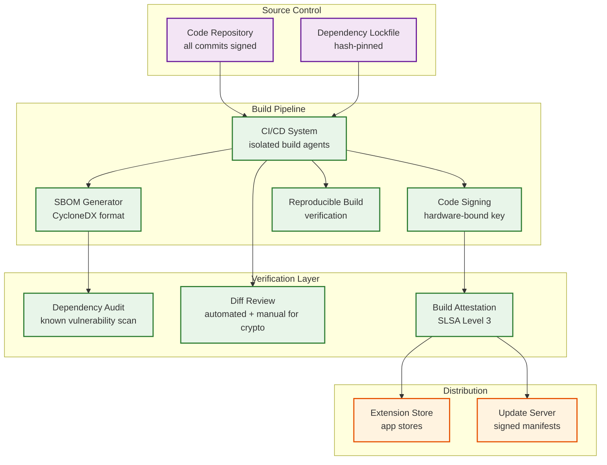

# 06 — Security & Compliance: Password Manager

## Threat Model

### Assets and Adversaries

| Asset | Value | Adversary |
|---|---|---|
| Master password | Unlocks entire vault | Phishing, keylogger, shoulder surfing |
| Account key | Decrypts all vault keys | Memory scraping, device compromise |
| Vault key | Decrypts all items in a vault | Key store breach, insider threat |
| Item keys | Decrypts individual credentials | Vault DB breach |
| Session tokens | Provides authenticated API access | Network interception, XSS, token theft |
| Authentication credential (OPAQUE record) | Enables impersonation | Server DB breach |
| Emergency key shares | Enable account recovery | Compromised trusted contact |
| Breach database prefix queries | Infers password patterns | Traffic analysis |

### Threat Categories

**T1 — Server-Side Compromise**
- Attacker gains read/write access to vault database
- Impact: Access to ciphertext only (zero-knowledge protection); no plaintext without client-side keys
- Residual risk: Metadata leak (which accounts have items, item counts, modification times); integrity attacks if AAD not enforced

**T2 — Authentication Bypass**
- Brute Force (Checking every single possibility) or credential stuffing against auth endpoint
- Mitigations: OPAQUE (master password never transmitted); server-side rate limiting (5 failed attempts = 15-min lockout + CAPTCHA); anomaly detection on login patterns

**T3 — Client Device Compromise**
- Malware on user device reads vault key from memory
- Impact: Full vault access
- Mitigations: Auto-lock on inactivity; biometric-protected device keys; memory encryption in OS Secure Enclave; short session TTL

**T4 — Browser Extension Attack**
- Malicious web page exploits autofill to extract credentials
- Mitigations: Content script isolation; origin-bound credential scoping; isTrusted event validation; DOM-based clickjacking defenses

**T5 — Supply Chain Attack on Extension**
- Compromised extension update distributes malicious version
- Mitigations: Extension signing; reproducible builds; CI/CD with dependency hash pinning; browser store review process; auto-rollback capability

**T6 — Insider Threat**
- Malicious employee at password manager company
- Impact: Access to ciphertext, metadata, key envelopes (still requires master password to decrypt)
- Mitigations: Zero-knowledge architecture limits blast radius; access logs; separation of duties; dual-control for key store administration

**T7 — Emergency Access Abuse**
- Attacker social-engineers trusted contact to initiate emergency access
- Mitigations: Multi-day wait period; immediate notification to account owner; owner can cancel at any time; threshold > 1 requires multiple colluding contacts

**T8 — Passkey Relay Attack**
- Attacker attempts to relay passkey authentication to a different origin
- Mitigations: WebAuthn origin binding (rpId must match origin); passkey credential scoped to specific rpId at registration; browser enforces origin binding

**T9 — Harvest-Now-Decrypt-Later (HNDL) / Post-Quantum Threat**
- Nation-state adversary captures encrypted vault traffic and stored ciphertext today, intending to decrypt with future quantum computers
- Impact: All vault data protected by current asymmetric cryptography (X25519 key exchange, Ed25519 signatures) becomes vulnerable when cryptographically relevant quantum computers emerge (estimated 2030–2040)
- Symmetric algorithms (AES-256) are quantum-resistant under Grover's algorithm (effective 128-bit security), but key exchange and digital signatures are vulnerable
- Mitigations: Hybrid key exchange using X25519 + ML-KEM-768 (NIST FIPS 203, finalized August 2024); post-quantum digital signatures using ML-DSA (FIPS 204) for key envelope integrity; see Post-Quantum Migration Roadmap section below

**T10 — AI Agent Credential Injection**
- AI browser agents programmatically trigger autofill, bypassing the human-in-the-loop security model
- Attack surface: An AI agent manipulated by prompt injection navigates to a malicious site and triggers credential fill without the user's awareness
- Impact: Credentials for legitimate sites injected into attacker-controlled forms; credential theft at scale
- Mitigations: Autofill gated on `isTrusted=true` event validation (rejects programmatic events); AI agent actions require explicit per-action user confirmation for credential operations; agent-initiated fills are flagged in audit log with `agent_initiated=true`; organization policies can disable agent-initiated autofill entirely

**T11 — Supply Chain Compromise of Cryptographic Dependencies**
- Attacker compromises an upstream cryptographic library (e.g., the Argon2 implementation, AES-GCM library, or X25519 key exchange implementation) used by the password manager client
- Impact: Backdoored cryptography could leak key material, weaken entropy, or introduce side channels
- Mitigations: See Supply Chain Security section below; dependency pinning with hash verification; reproducible builds; cryptographic library vendoring with manual audit of every update

---

## Zero-Knowledge Proof Architecture

### What the Server Can and Cannot Know

**Server CAN observe:**
- Account IDs and email hashes (for account lookup)
- Item metadata: item IDs, vault IDs, timestamps, version vectors, is_deleted flag
- Number of items per vault
- Ciphertext sizes (rough approximation of content length)
- Access patterns: which items are synced most frequently, from which device IDs
- Emergency access relationships (who designated whom)
- IP addresses (hashed for audit, raw for rate limiting)
- Public keys (by definition public)

**Server CANNOT observe:**
- Master password or any derivative
- Account key, vault key, item keys in plaintext
- Item content: titles, usernames, passwords, notes, URLs
- Organization membership of specific credentials
- Which websites a user's credentials belong to

**AAD Enforcement (Addressing USENIX 2026 research):**
All encrypted items include the following in AEAD additional authenticated data:
```
AAD = SHA256(item_id || vault_id || schema_version || key_rotation_version)
```
This prevents the server from transposing ciphertext between items (integrity attack), as the auth tag validation would fail with wrong AAD values.

---

## Key Management

### Key Lifecycle

```
┌─────────────────────────────────────────────────────┐
│  ACCOUNT KEY LIFECYCLE                               │
│                                                       │
│  Create:     Derived from master password (Argon2id) │
│              Never stored in plaintext anywhere       │
│  Store:      Wrapped in OPAQUE exportKey at server   │
│  Access:     Re-derived at each login via OPAQUE     │
│  Rotate:     On master password change               │
│  Revoke:     On account deletion (key gone; ctext    │
│              retained per compliance, unreadable)    │
└─────────────────────────────────────────────────────┘

┌─────────────────────────────────────────────────────┐
│  VAULT KEY LIFECYCLE                                 │
│                                                       │
│  Create:     Random 256-bit on vault creation        │
│  Store:      Wrapped in account key; stored server   │
│  Access:     Unwrapped by client using account key   │
│  Rotate:     On shared vault member revocation;      │
│              annual rotation recommended for orgs    │
│  Revoke:     Remove vault key envelope from revoked  │
│              account; existing items re-encrypted    │
└─────────────────────────────────────────────────────┘

┌─────────────────────────────────────────────────────┐
│  ITEM KEY LIFECYCLE                                  │
│                                                       │
│  Create:     Random 256-bit per item at creation     │
│  Store:      Wrapped in vault key; stored with item  │
│  Access:     Unwrapped by client using vault key     │
│  Rotate:     If item is re-shared or explicitly      │
│              rotated by user                         │
│  Revoke:     Removed with item deletion              │
└─────────────────────────────────────────────────────┘
```

### Algorithm Choices and Rationale

| Algorithm | Use Case | Rationale |
|---|---|---|
| Argon2id | Key derivation from master password | Memory-hard; resists GPU/ASIC Brute Force (Checking every single possibility); winner of Password Hashing Competition |
| AES-256-GCM | Symmetric encryption of all item content | NIST-approved; authenticated encryption (AEAD); hardware acceleration ubiquitous |
| X25519 | Asymmetric key exchange (sharing, emergency access) | Faster than RSA-4096; no parameter selection vulnerabilities; standard for modern key exchange |
| Ed25519 | Digital signatures (item integrity) | Fast verification; small key/signature size; secure against side-channel attacks |
| HKDF-SHA256 | Key derivation from shared secrets | Standard IETF key derivation; HMAC-based; strong security proofs |
| OPAQUE | Password-authenticated key exchange | UC-secure; prevents server-side offline attacks; IETF in progress |
| Shamir's Secret Sharing | Emergency access key splitting | Information-theoretically secure; well-studied; NIST-endorsed (NISTIR 8214C) |

---

## Breach Response Procedures

### Vault Data Breach

If vault database is compromised:
1. **T+0**: Incident declared; security team alerted; database access revoked
2. **T+1 hour**: Forensic snapshot taken; affected time range determined
3. **T+4 hours**: All active sessions invalidated; users forced to re-authenticate
4. **T+8 hours**: Affected user notification sent (required by GDPR within 72 hours of detection)
5. **T+24 hours**: Public transparency report published (scope, impact, protective measures)
6. **User action required**: Change master password (rotates account key; renders stolen ciphertext useless for new keys); generate new passwords for affected items

**Why a vault data breach is not catastrophic under zero-knowledge**: Stolen ciphertext without client-side keys requires brute-forcing the master password offline. With Argon2id (64MB, 3 iterations), testing a single password guess requires ~1 second per core. A 12-character random password with full charset takes ~10^18 seconds on a million-core cluster.

### Authentication Credential Breach

If OPAQUE server records are stolen:
1. OPAQUE records are not directly usable for vault decryption (exportKey requires OPAQUE protocol execution with the correct master password)
2. Attacker can run dictionary attacks against OPAQUE records offline
3. Response: Force all users to rotate master passwords (invalidates old OPAQUE records)
4. Weak passwords become the primary risk; breach detection UI warns users with weak passwords

### Key Store Breach

If encrypted account key envelopes are stolen:
1. Each envelope is protected by OPAQUE exportKey (requires master password to derive)
2. Compound attack: OPAQUE record + key envelope allows offline master password Brute Force (Checking every single possibility) against both simultaneously
3. Mitigation: Key store and auth store physically separated; different access credentials; separate network segment

---

## Compliance Framework

### SOC 2 Type II Controls

| Trust Service Criterion | Control |
|---|---|
| CC6.1 (Logical access) | RBAC; MFA required for admin; OPAQUE auth for users |
| CC6.6 (Threat protection) | WAF; DDoS mitigation; intrusion detection |
| CC7.1 (Anomaly detection) | ML-based login anomaly detection; rate limiting |
| CC9.1 (Vendor management) | Third-party dependency audits; SBOM maintained |
| A1.1 (Availability) | 99.95% SLO; auto-scaling; DR procedures |
| C1.1 (Confidentiality) | Zero-knowledge architecture; encrypted in transit and at rest |

### GDPR Compliance

| Requirement | Implementation |
|---|---|
| **Data minimization** | Server stores only ciphertext and metadata; no plaintext user data |
| **Right to erasure** | Account deletion removes all vault ciphertext, key envelopes, and audit log PII within 30 days |
| **Data portability** | Users can export vault in encrypted format (decryptable only with master password) |
| **Breach notification** | Automated pipeline detects and reports to DPA within 72 hours |
| **EU data residency** | EU accounts pinned to EU-West region; no cross-border transfer of user data |
| **DPA agreements** | Data Processing Agreements with all sub-processors |
| **Privacy by design** | Zero-knowledge architecture is the technical implementation of privacy by design |

### HIPAA Considerations

For enterprise health-sector customers with PHI in vaults:
- Business Associate Agreement (BAA) required before provisioning
- Enhanced audit logging with longer retention (7 years)
- Minimum password strength enforced at org level (12+ characters, complexity rules)
- Mandatory MFA for all organization accounts
- Access controls: vault items tagged with PHI classification; view logs required

---

## Post-Quantum Migration Roadmap

### Why Password Managers Are a Priority Target

Password managers are uniquely vulnerable to HNDL attacks because:
1. Vault ciphertext is stored indefinitely — a stolen vault snapshot from today remains valuable for decades
2. A single vault may protect hundreds of high-value secrets (banking, healthcare, government credentials)
3. Key exchange during sharing and device enrollment uses asymmetric cryptography vulnerable to quantum attack

### Migration Phases

```
Phase 1 — Inventory & Assessment (Now)
├── Catalog all asymmetric algorithm usage: X25519 (key exchange),
│   Ed25519 (signatures), RSA (legacy interop)
├── Identify data-at-rest protected only by asymmetric wrapping
├── Assess which stored ciphertext is vulnerable to HNDL
└── Estimate migration effort per component

Phase 2 — Hybrid Key Exchange (Near-term)
├── Replace X25519 key exchange with hybrid X25519 + ML-KEM-768
│   (FIPS 203) for all new key exchanges
├── Vault sharing: shared vault key envelopes encrypted with hybrid KEM
├── Device enrollment: session key negotiation uses hybrid KEM
├── Emergency access: Shamir shares wrapped with hybrid-encrypted
│   contact public keys
└── Backward compatibility: clients that don't support ML-KEM
    fall back to X25519-only with a deprecation warning

Phase 3 — Post-Quantum Signatures (Medium-term)
├── Replace Ed25519 with ML-DSA-65 (FIPS 204) for key envelope
│   integrity signatures
├── AAD binding includes post-quantum signature over item metadata
├── Audit log entries signed with ML-DSA for long-term non-repudiation
└── Certificate transparency proofs use post-quantum signatures

Phase 4 — Vault Re-encryption Campaign (Long-term)
├── Existing vault key envelopes re-wrapped with hybrid KEM
├── Historical ciphertext remains AES-256-GCM (quantum-resistant)
├── Re-sign all key envelopes with ML-DSA
└── Deprecate and remove pure X25519/Ed25519 code paths
```

### Algorithm Selection Rationale

| Use Case | Current | Post-Quantum Replacement | NIST Standard |
|---|---|---|---|
| Key exchange (sharing, enrollment) | X25519 | X25519 + ML-KEM-768 (hybrid) | FIPS 203 |
| Digital signatures (key integrity) | Ed25519 | ML-DSA-65 | FIPS 204 |
| Symmetric encryption | AES-256-GCM | AES-256-GCM (unchanged) | Already quantum-resistant |
| Key derivation | Argon2id | Argon2id (unchanged) | Not affected by quantum |
| Hash functions | SHA-256, HKDF | SHA-256, HKDF (unchanged) | Grover: 128-bit effective |

**Why hybrid, not pure post-quantum?** ML-KEM is newer and has seen less cryptanalytic scrutiny than X25519. A hybrid approach ensures that even if ML-KEM is broken by classical means, X25519 still provides security. The combined ciphertext is larger (~1.5 KB per key exchange vs. ~32 bytes for pure X25519) but acceptable for password manager workloads.

---

## Supply Chain Security

### Threat Surface

For a password manager, supply chain compromise is existential — a backdoored client ships malicious code to every user's device with full access to their decrypted vault.

### Build Pipeline Security



### Dependency Management

| Control | Implementation |
|---|---|
| **Hash pinning** | Every dependency locked to exact version + SHA-256 hash; lockfile committed to repository |
| **Cryptographic library vendoring** | Critical crypto libraries (Argon2, AES-GCM, X25519, ML-KEM) vendored into the repository; updates require manual security review |
| **Automated vulnerability scanning** | CI runs dependency audit on every commit; blocks merge if critical CVE detected in any direct or transitive dependency |
| **Minimal dependency policy** | Strict limit on total dependency count; prefer standard library implementations; every new dependency requires security review |
| **SBOM (Software Bill of Materials)** | Generated on every build in CycloneDX format; published alongside release artifacts; enables downstream vulnerability tracking |

### Reproducible Builds

All client releases are reproducibly buildable — any third party can clone the source, run the build, and verify that the output binary matches the distributed binary bit-for-bit. This provides:
- **Tamper detection**: If the distributed binary does not match the reproducible build output, the supply chain has been compromised
- **Build attestation**: SLSA Level 3 attestation generated for every release, signed with a hardware-bound signing key
- **Community verification**: Security researchers and auditors can independently verify any release

### Extension Update Security

Browser extension updates are a high-risk vector because updates are applied automatically. Defenses:
- Extension updates are signed with a key held in a hardware security module (HSM)
- Update manifests include a SHA-256 hash of the extension package; the browser verifies before installation
- Critical updates (those touching cryptographic code paths) require dual-approval from two authorized signers
- Auto-rollback: if crash rate exceeds 1% within 1 hour of an update, the previous version is automatically restored

---

## Key Transparency and Verifiable Builds

### The Key Transparency Problem

In a zero-knowledge system, the server distributes public keys for sharing and device enrollment. A malicious server could substitute its own public key, intercept shared vault keys, and decrypt shared items.

### Key Transparency Log

All public key changes are recorded in an append-only, cryptographically verifiable transparency log (similar to Certificate Transparency for TLS):

```
KeyTransparencyEntry {
  account_id:       hash
  public_key:       bytes          // The new public key
  previous_key_hash: SHA-256       // Hash of the previous key (chain integrity)
  timestamp:        timestamp
  signature:        bytes          // Signed by the account's identity key
  inclusion_proof:  MerkleProof    // Proves entry is in the log
}
```

**Verification flow:**
1. When Alice shares a vault with Bob, her client fetches Bob's public key from the server
2. Alice's client also fetches the key transparency proof for Bob's current key
3. Alice's client verifies: (a) the key is in the transparency log, (b) the inclusion proof is valid against the log's Merkle root, (c) the log's Merkle root is signed by the transparency log operator
4. If verification fails, Alice is warned that Bob's key may have been tampered with

**Gossip protocol**: Clients periodically exchange signed Merkle root hashes via an out-of-band gossip protocol (or check against multiple independent monitors) to detect a split-view attack where the server presents different log states to different clients.

---

## Security Hardening Checklist

### Server Hardening

- [ ] TLS 1.3 only; no TLS 1.0/1.1; HSTS with preloading
- [ ] Certificate Transparency monitoring; alert on unexpected issuance
- [ ] HTTP security headers: CSP, X-Frame-Options, X-Content-Type-Options
- [ ] Database connections over TLS with mutual auth
- [ ] Secrets (DB passwords, API keys) stored in managed secrets vault with automatic rotation
- [ ] Network segmentation: vault DB not directly reachable from internet
- [ ] Web Application Firewall with OWASP rule set + custom rules for password manager API

### Extension Hardening

- [ ] Manifest V3 (removes remote code execution capability)
- [ ] Strict CSP in extension manifest: no eval, no inline scripts
- [ ] All external resources hashed in CSP
- [ ] Extension signing with published public key; signature verification on update
- [ ] Content Security Policy prevents extension loading untrusted resources
- [ ] API calls pinned to production domain; no wildcard permissions

### Client Hardening

- [ ] Mobile: certificate pinning with backup pins; pin rotation process defined
- [ ] Memory: sensitive keys zeroed from memory after use (where language permits)
- [ ] Clipboard: auto-clear clipboard after 30 seconds when credential is copied
- [ ] Screen capture: vault content blocked from screenshots/screen recording on mobile
- [ ] Jailbreak/root detection: warn user; optionally disable biometric unlock
- [ ] Anti-tampering: code signing verified at startup on desktop

### Passkey-Specific Security Controls

- [ ] Passkey private keys encrypted with item key; never exposed in plaintext outside the client's secure memory region
- [ ] WebAuthn `rpId` validation: passkey can only sign challenges for the exact relying party it was registered with
- [ ] Cross-origin passkey use blocked: content script verifies `rpId` matches the page's registrable domain before signing
- [ ] Passkey export: when exporting vault, passkey private keys are included in the encrypted export — no separate export path that could leak them
- [ ] Discoverable credential enumeration: the extension does not reveal which passkeys exist for a given rpId until the user explicitly unlocks the vault
- [ ] PRF extension data (if stored): treated as sensitive and encrypted at item level, not stored in cleartext metadata

### Incident Response Automation

- [ ] Automated breach detection pipeline monitors for vault DB access anomalies (query patterns inconsistent with normal sync)
- [ ] Canary accounts: synthetic accounts with known vault contents; if any item changes unexpectedly, breach alarm triggers
- [ ] Automated session invalidation: on detecting anomalous auth patterns, all sessions for affected accounts are revoked within 60 seconds
- [ ] Pre-staged breach notification templates: GDPR-compliant notification ready to send within 1 hour of confirmed breach
- [ ] War room automation: on incident declaration, dedicated communication channel created, on-call escalated, forensic snapshot initiated — all within 5 minutes
