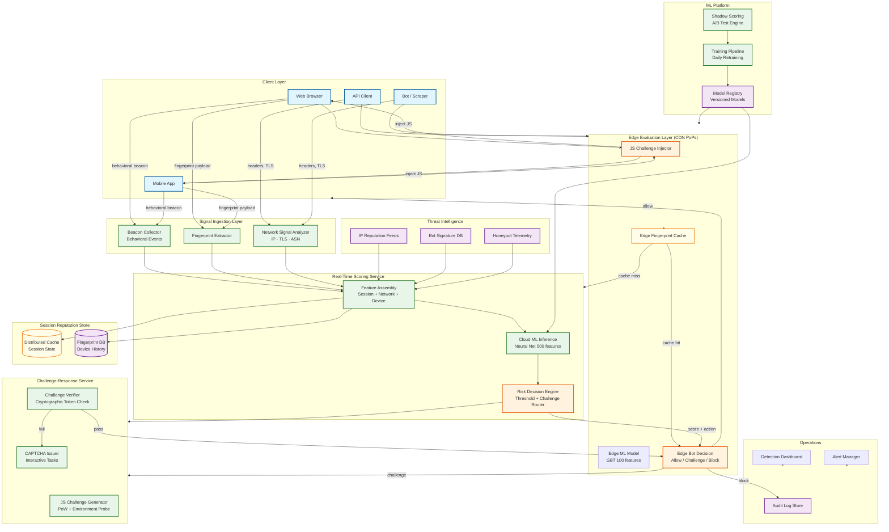
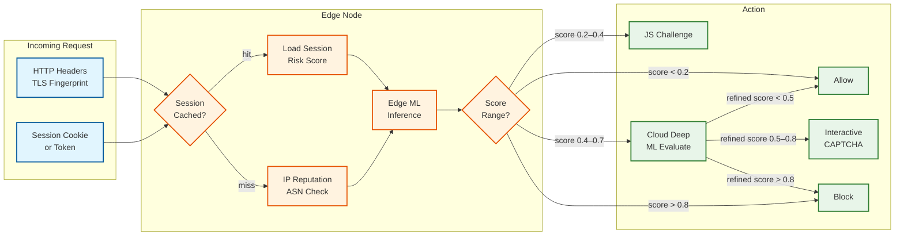
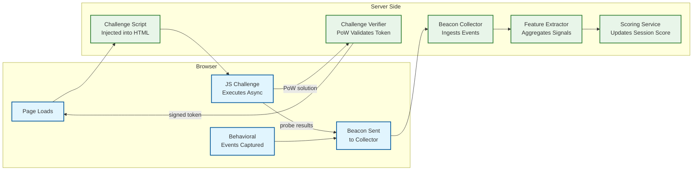
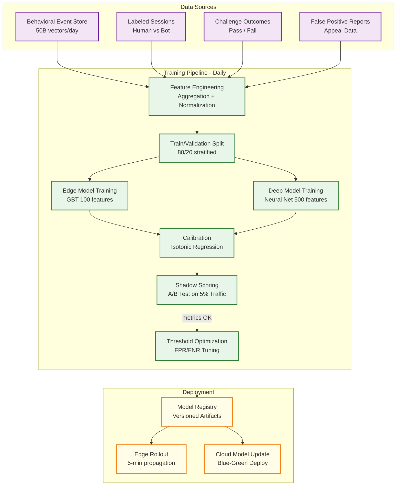
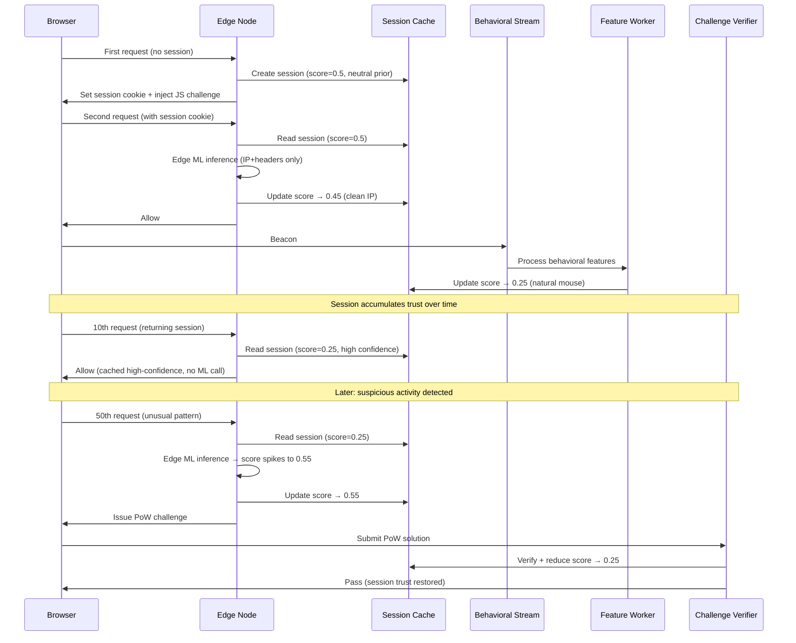
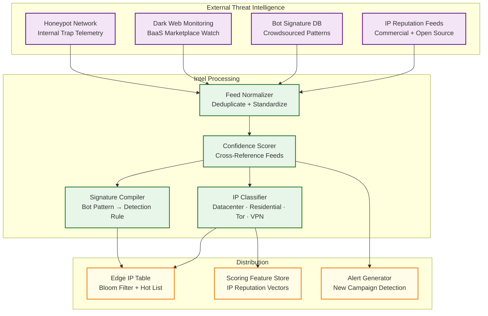
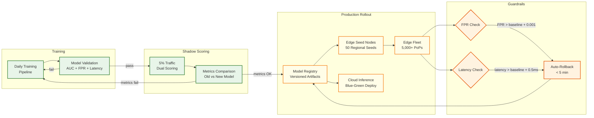

# 02 — High-Level Design: Bot Detection System

## System Architecture



---

## Key Design Decisions

### Decision 1: Edge-First Scoring Architecture

**Choice:** Run a lightweight gradient-boosted tree model at CDN edge nodes, making the majority of decisions without any round-trip to a central scoring service.

**Rationale:** At 5M req/sec globally, a centralized scoring service would require thousands of cores and add 30–100ms of latency per request. The majority of traffic (roughly 80%) falls into clearly human (score < 0.2) or clearly bot (score > 0.8) ranges and can be decided in < 2ms at the edge. Only borderline requests (0.2–0.8) escalate to the cloud deep model.

**Tradeoff:** Edge models must be small (< 10MB) and retrained frequently to push updates to hundreds of PoPs within 5 minutes. This constrains model complexity; the full deep model's accuracy gains can only be realized for the borderline fraction of traffic.

### Decision 2: Fail-Open on Scoring System Failure

**Choice:** When the scoring service is unavailable, edge nodes default to allowing requests through rather than blocking.

**Rationale:** The alternative—fail closed (block all traffic on failure)—would cause a site-wide outage any time the scoring system degrades. Since the scoring system is in the critical path of every request, its failure mode must favor availability over security. A brief window of degraded bot protection is recoverable; blocking all legitimate users is catastrophic for revenue.

**Tradeoff:** A targeted outage of the scoring service (via DDoS of the scorer itself) could be used as a bot evasion technique. Mitigated by defense-in-depth: WAF, rate limiting, and IP blocklists remain active even when ML scoring is unavailable.

### Decision 3: Probabilistic Risk Score Instead of Binary Verdict

**Choice:** Expose a continuous [0.0, 1.0] risk score rather than a binary allow/block decision, and let each product team configure their own thresholds.

**Rationale:** Different endpoints have different bot-tolerance tradeoffs. A public blog homepage can tolerate more bot traffic (SEO crawlers are valuable); a checkout endpoint should be extremely aggressive. A single binary verdict cannot accommodate this diversity. The score-based model lets each endpoint owner tune the challenge threshold and block threshold independently.

**Tradeoff:** Requires that downstream systems integrate the score rather than a simple boolean. Increases integration complexity. Threshold misconfiguration (too aggressive) can spike false positives; threshold too permissive misses bots.

### Decision 4: JavaScript Challenge as Primary Signal Amplifier

**Choice:** The primary detection mechanism is a JavaScript challenge injected into page responses that runs inside the browser and returns a signed payload of environment probes, proof-of-work solutions, and behavioral measurements.

**Rationale:** Server-side signals alone (IP, headers, TLS) are easily spoofed. JavaScript executing inside the browser can probe the execution environment in ways that are much harder to fake convincingly—WebGL renderer enumeration, AudioContext oscillator response, timing of cryptographic operations, presence/absence of browser APIs, and behavioral signals that only make sense with a real human and a real browser. This creates a qualitatively richer signal than header analysis.

**Tradeoff:** Requires JavaScript execution, so it cannot evaluate non-browser API clients directly. API clients are evaluated via header/TLS signals only, which are weaker. Requires careful async execution to avoid blocking page load; the JS challenge runs after page paint.

### Decision 5: Session Reputation with Decaying Trust

**Choice:** Maintain a session-level trust score that accumulates evidence across all requests in a session and decays exponentially during idle periods.

**Rationale:** Single-request evaluation is stateless and misses bot patterns that are only visible over time—e.g., an automated form-filler that navigates at superhuman speed, or a browser farm that rotates fingerprints every 5 requests. Session-level state allows the system to detect these sequential patterns and avoid re-challenging users who have recently verified their humanity.

**Tradeoff:** Requires a distributed session store with sub-millisecond reads at every edge PoP. The session store becomes a critical dependency. If the session store is unavailable, the system falls back to per-request evaluation with a neutral prior.

---

## Data Flow: Request Evaluation



---

## Data Flow: JavaScript Challenge Pipeline



---

## Data Flow: ML Training Pipeline



---

## Data Flow: Session Reputation Lifecycle



---

## Data Flow: Threat Intelligence Pipeline



---

## Data Flow: Model Deployment and Rollback



---

## Architecture Decision: Edge Model Complexity Trade-Off

The two-tier architecture arises from a fundamental trade-off:

```
                    ┌─────────────────────────────────────────────┐
                    │        Model Complexity vs. Latency         │
                    │                                             │
Accuracy (AUC) 1.0 │                            ● Deep Model     │
                    │                        ●                    │
               0.95│                    ●                         │
                    │                ●                             │
               0.90│            ●                                 │
                    │        ●  ← Edge Model (sweet spot)         │
               0.85│    ●                                         │
                    │●                                            │
               0.80│                                              │
                    └─────────────────────────────────────────────┘
                    0.1ms   1ms    5ms   10ms   50ms  100ms
                              Inference Latency
```

The edge model operates at the "knee" of this curve: it captures 88% AUC at 1.5ms, while going beyond requires disproportionate latency increases. The deep model adds 8% AUC but requires 10–30ms and GPU hardware.

---

## Domain Event Model

The system publishes domain events for downstream consumers and audit:

| Event | Payload | Consumers |
|-------|---------|-----------|
| `request.evaluated` | request_id, session_id, score, action, model_version, latency_ms | Analytics, audit log |
| `challenge.issued` | session_id, challenge_type, risk_score, trigger_reason | Challenge service, metrics |
| `challenge.solved` | session_id, challenge_type, solve_duration_ms, solve_quality_score | Session updater, model training |
| `challenge.failed` | session_id, challenge_type, failure_reason | Session updater, escalation engine |
| `session.created` | session_id, fingerprint_hash, initial_score, ip, user_agent | Session store, analytics |
| `session.escalated` | session_id, old_score, new_score, trigger_signals | Alert manager, analytics |
| `session.blocked` | session_id, score, block_reason, signals_summary | Audit log, threat intel |
| `fingerprint.new` | fingerprint_hash, raw_signals_summary, consistency_score | Fingerprint DB, analytics |
| `fingerprint.flagged` | fingerprint_hash, flag_reason, ip_diversity | Threat intel, analytics |
| `model.deployed` | model_version, model_type, deployment_target, metrics | Ops dashboard, audit |
| `model.rollback` | model_version, rollback_reason, new_active_version | Alert manager, audit |
| `false_positive.confirmed` | session_id, fingerprint_hash, challenge_type, root_cause | Model retraining, FP analytics |
| `threat_intel.updated` | feed_name, entries_added, entries_removed, lag_minutes | Edge distribution, metrics |

### Event Consumer Matrix

| Consumer | Events Consumed | Purpose |
|----------|----------------|---------|
| **Audit Log Store** | All events | Compliance, forensics, incident investigation |
| **Real-Time Dashboard** | request.evaluated, session.blocked, challenge.* | Live traffic monitoring |
| **Model Training Pipeline** | challenge.solved/failed, false_positive.confirmed, session.blocked | Label generation for next training cycle |
| **Session Score Updater** | challenge.solved/failed | Adjust session trust based on challenge outcomes |
| **Threat Intel Enricher** | session.blocked, fingerprint.flagged | Feed confirmed bot patterns back to intel |
| **Alert Manager** | session.escalated, model.rollback, false_positive.confirmed | Operational alerting |
| **Customer Analytics API** | request.evaluated, session.blocked | Per-customer bot traffic reporting |

---

## Architecture Checklist

| Concern | How Addressed |
|---------|--------------|
| **Edge-first latency** | GBT model in-process at CDN PoPs; zero network calls for 80% of decisions |
| **Fail-open resilience** | Scoring failure → allow all; WAF + rate limiter as independent defense |
| **Model freshness** | Daily retraining + 4-hour incremental updates; hierarchical edge distribution in < 5 min |
| **False positive safety** | Progressive challenge ladder; calibrated scores; accessibility accommodations |
| **Privacy compliance** | Hash-before-store; in-browser aggregation; pseudonymous session IDs; GDPR data minimization |
| **Adversarial resilience** | Model rotation; canary features; honeypot signals; red team exercises |
| **Horizontal scaling** | Stateless beacon receivers; partitioned event streams; sharded session store |
| **Observability** | Per-request scoring traces; model drift detection; FPR/FNR estimation pipeline |
