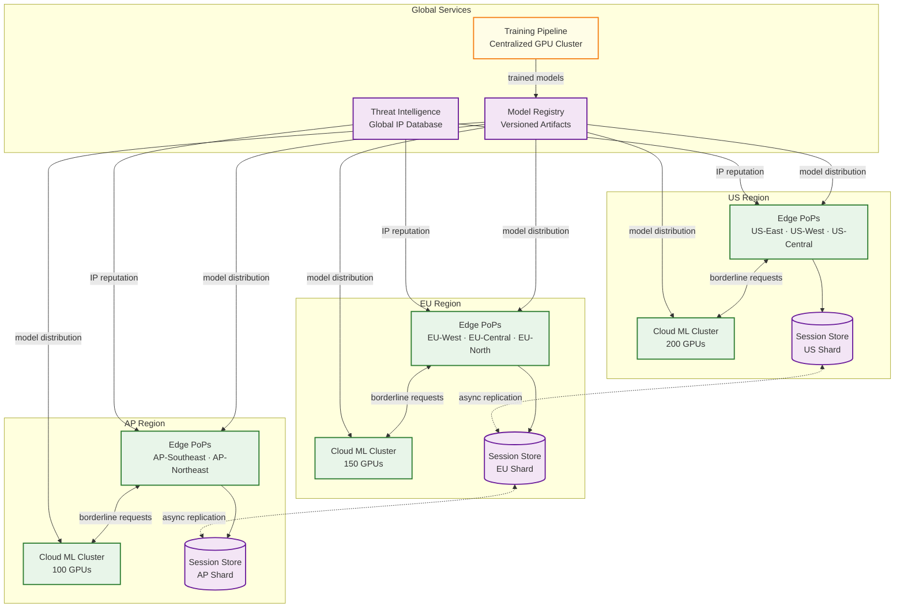

# 05 — Scalability & Reliability: Bot Detection System

## Edge-First Evaluation Architecture

The single most important scalability decision in a bot detection system is moving the majority of request evaluation to the CDN edge, eliminating the need for a round-trip to a central scoring service for 80% of traffic.

### Edge Node Capabilities

Each CDN edge node runs three in-process components:

**1. Session Cache (in-process LRU, ~2GB per node)**
Stores the most recently seen session states for sessions that have visited this PoP. Cache entries include the session's current risk score, fingerprint hash, and challenge state. With typical geographic locality (users repeat visits to the same PoP), local cache hit rates reach 85–90%.

**2. Fingerprint Cache (shared across nodes in same PoP, ~50GB)**
Stores fingerprint records for recently seen devices. Since fingerprints are stable across sessions, this cache has a much higher hit rate than session state: ~95%+ for returning devices within 24 hours.

**3. Edge ML Model (in-process, ~5MB)**
The lightweight gradient-boosted tree model is loaded into memory at startup and reloaded (hot-swap with zero downtime) when a new model version is pushed. The model serves inference in 0.5–2ms per request using only CPU, with no external I/O during inference.

### Request Evaluation Decision Tree

```
Incoming Request
    │
    ├─ [Allowlisted IP or API key?] → ALLOW (skip scoring)
    │
    ├─ [Hard-blocked IP in local blocklist?] → BLOCK (no scoring needed)
    │
    ├─ [Session in local cache with high confidence score?]
    │   ├─ Score < 0.15 → ALLOW (cache hit, no network call)
    │   └─ Score > 0.85 → BLOCK (cache hit, no network call)
    │
    ├─ [Session in regional cache?]
    │   ├─ Fetch score, apply edge model re-score with current request signals
    │   └─ Decide based on combined score
    │
    └─ [No session state] → Run full edge ML evaluation
        ├─ Score < 0.25 → ALLOW (create new session, score = 0.25)
        ├─ Score 0.25-0.75 → Escalate to cloud deep model (async)
        └─ Score > 0.75 → Issue challenge or block
```

### Edge Scalability Numbers

```
Edge node capacity:
  - CPU: 32 cores per node
  - Throughput: 50,000 requests/sec per node (0.5ms per request average)
  - At 5M req/sec globally: 100 edge nodes needed (deployed across 500+ PoPs for redundancy)

Regional ML cluster capacity:
  - Invoked for ~20% of requests: 1M req/sec
  - Each GPU server handles 1,000 req/sec (10ms inference)
  - Required: 1,000 GPU servers across 20 regions = 50 per region
  - Auto-scales based on queue depth

Global session store capacity:
  - 500M concurrent sessions × 620 bytes = 310GB
  - Distributed across 100 shards (3.1GB per shard)
  - 3× replication = 930GB total storage
  - Replication factor provides read availability during shard failures
```

---

## ML Model Serving at Scale

### Serving Architecture: Three Deployment Tiers

**Tier 1: Edge ML (deployed to CDN PoPs)**
- Model type: GBT (gradient-boosted tree), serialized as binary decision tree array
- Serving mechanism: In-process library, no network overhead
- Update mechanism: Push via CDN model distribution network (5-min propagation)
- Rollback: Automatic on error rate spike (> 2% increase in error responses post-deploy)

**Tier 2: Cloud Deep ML (GPU inference clusters)**
- Model type: Ensemble of GBT + 3-layer neural network, 500 features
- Serving mechanism: gRPC service with batching (collect requests for 5ms, batch-infer)
- Batch size: 64–256 requests per inference call
- GPU utilization: 80–85% under normal load, 95% during attacks
- Scaling: Horizontal scale-out takes < 90 seconds (pre-warmed instance pool)

**Tier 3: Training Cluster (daily pipeline)**
- Training data: 50B feature vectors from past 30 days, stored in columnar format
- Training hardware: 64 GPU cluster, ~4 hours per full training run
- Incremental update: Mini-batch online update of edge model every 4 hours using past 4 hours of labeled data
- Feature drift detection runs after each training: if any feature's distribution shifts by > 2 standard deviations from baseline, an alert fires and the feature's weight is automatically reduced

### Model Freshness and Version Management

```
Model lifecycle:
    Training Start (00:00 UTC)
         │
         ↓
    Training Complete (~04:00 UTC)
         │
         ↓
    Automated Validation (4 hours):
    ├─ AUC must be ≥ baseline - 0.01
    ├─ False positive rate must be ≤ baseline + 0.001
    ├─ Latency must be ≤ baseline + 0.5ms
    └─ Calibration error must be ≤ 0.05
         │
    ├─ [Validation fails] → Alert + retain previous model
    └─ [Validation passes] → Shadow scoring on 5% of traffic for 1 hour
         │
    ├─ [Shadow metrics OK] → Full production rollout
    └─ [Shadow metrics fail] → Alert + retain previous model

Rollout:
    Edge model: Push to all PoPs via CDN distribution, 5-minute global propagation
    Cloud model: Blue-green deployment, shift 10% traffic → 100% over 30 minutes
```

### Batch Inference Optimization

Cloud deep model inference is batched to maximize GPU utilization:

```
FUNCTION batch_inference_loop(request_queue):
    WHILE TRUE:
        batch = []
        deadline = current_time + 5ms   // max wait for batch accumulation

        WHILE current_time < deadline AND len(batch) < MAX_BATCH_SIZE:
            request = request_queue.poll(timeout=deadline - current_time)
            IF request != NULL:
                batch.append(request)

        IF len(batch) == 0:
            CONTINUE

        // Construct feature matrix: [batch_size × 500]
        feature_matrix = stack([r.features for r in batch])

        // Single GPU inference call for entire batch
        scores = gpu_model.forward(feature_matrix)

        // Return results to waiting callers
        FOR i = 0 TO len(batch) - 1:
            batch[i].promise.resolve(scores[i])
```

---

## Real-Time Feature Computation at Scale

### The Feature Store Pattern

Real-time feature computation must combine:
- **Point-in-time features**: IP reputation, fingerprint stats (< 1ms lookup)
- **Session aggregate features**: Accumulated behavioral stats (< 2ms from session store)
- **Population statistics**: How does this session's behavior compare to the population? (requires precomputed population statistics)

Population statistics (e.g., "what's the p95 typing speed seen today?") cannot be computed per-request—they require aggregation over millions of sessions. These are precomputed as **feature statistics artifacts** updated every 10 minutes by a streaming aggregation job and cached in a feature store readable by all scoring workers.

```
Feature Store Schema:
    // Updated every 10 minutes by streaming aggregation
    population_stats: {
        mouse_velocity_p50: float,
        mouse_velocity_p95: float,
        typing_speed_p50: float,
        typing_speed_p95: float,
        request_rate_p95_by_asn: map[ASN → float],
        canvas_hash_frequency: map[hash → int],  // how many sessions share each canvas hash
        ...
    }

    // Updated every 1 hour
    ip_population_stats: {
        requests_per_ip_p95: float,
        session_count_per_ip_p95: float,
        fingerprint_diversity_per_ip_p95: float
    }
```

Using these precomputed statistics, per-request feature computation includes normalized z-score features:

```
z_mouse_velocity = (session.mouse_velocity_mean - pop_stats.mouse_velocity_p50)
                   / pop_stats.mouse_velocity_std

z_typing_speed = (session.typing_speed - pop_stats.typing_speed_p50)
                 / pop_stats.typing_speed_std
```

These z-score features are significantly more predictive than raw values because they account for population drift over time (e.g., typing speeds change as the user population shifts).

---

## Graceful Degradation Strategy

### Degradation Levels

The system defines five degradation levels that activate automatically based on health checks:

**Level 0 (Normal):** Full ML scoring, behavioral analysis, session reputation, challenge system all active.

**Level 1 (Behavioral degradation):** Beacon collector offline or overwhelmed. Behavioral features drop out of scoring. Edge model continues with network + fingerprint features only. Expect ~5% reduction in detection accuracy.

**Level 2 (Session store degradation):** Session store unavailable or partitioned. Fall back to per-request stateless evaluation using only network and fingerprint signals. Neutral priors for all sessions. Expect ~10% reduction in accuracy; false positive rate may increase.

**Level 3 (Cloud ML degradation):** Cloud deep model inference cluster unavailable. Edge model handles all requests. Borderline decisions (0.25–0.75) use edge model output directly. Expect ~8% reduction in accuracy for borderline traffic. Challenge thresholds widen to compensate.

**Level 4 (Edge ML degradation):** Edge model files corrupted or unavailable (e.g., during model push gone wrong). Fall back to rule-based scoring: IP reputation + blocklist + known headless browser UA patterns. Expect ~20% reduction in accuracy. Alert fires immediately; previous model version served within 2 minutes via rollback.

**Level 5 (Fail-open):** Complete scoring system failure. All traffic allowed through; only hard-coded IP blocklist checked. Alert fires to on-call. Separate WAF and rate limiter layers provide defense-in-depth. This level is designed to last < 5 minutes before rollback or alternative scoring kicks in.

### Health Check Architecture

```
Component Health Checks (interval: 5 seconds):

Edge ML Model:
  - Inference call on synthetic feature vector
  - Expected output: known score ± 0.01
  - Failure → log, increment error counter, alert if 3 consecutive failures

Session Store:
  - Read/write synthetic key
  - Expected latency < 2ms
  - Failure → switch to local cache-only mode for affected partition

Cloud ML Cluster:
  - Health endpoint check
  - Inference latency P99 check (must be < 50ms)
  - Failure → remove unhealthy replicas from load balancer, scale out

Beacon Collector:
  - Queue depth check (< 10M messages backed up)
  - Consumer lag check (< 30 seconds)
  - Failure → shed load by increasing beacon interval directives

Threat Intelligence Feed:
  - Last successful update timestamp
  - Stale if > 30 minutes: alert, continue using cached data
  - Stale if > 4 hours: fall back to local IP reputation only
```

---

## Horizontal Scaling Properties

| Component | Scaling Strategy | Slowest part of the process | Mitigation |
|---|---|---|---|
| **Beacon Collectors** | Stateless horizontal scale | Event stream partition count | Pre-partition to 10K shards |
| **Behavioral Feature Workers** | Scale by partition count | Session state fan-out | In-process state, 10-sec checkpoint |
| **Edge ML Nodes** | Co-located with CDN PoPs | Model size (5MB per node) | In-process model, hot-swap updates |
| **Cloud ML Inference** | GPU horizontal scale | GPU availability | Pre-warmed instance pool |
| **Session Store** | Consistent hash sharding | Cross-region replication lag | Write local, async replicate |
| **Fingerprint DB** | Range-sharded by hash | Read amplification for popular hashes | Cache top 10M fingerprints in hot layer |
| **Challenge Verifier** | Stateless horizontal scale | Token lookup (distributed KV) | Token store co-located with challenge issuer |
| **Training Pipeline** | Single daily run, GPU cluster | Training data I/O (10TB/day) | Columnar storage with predicate pushdown |

---

## Multi-Region Architecture



### Regional Data Sovereignty

Session data is kept within the user's geographic region to comply with data residency requirements:
- **EU sessions**: Session state, behavioral features, and fingerprint data stored in EU region only
- **Cross-region sessions**: If a user roams (e.g., EU→US), the session is migrated lazily—edge node in the new region creates a local session entry and asynchronously fetches the prior session state
- **Model training**: Anonymized feature vectors (without session IDs or IP addresses) are replicated globally for training; raw data stays regional

---

## Attack Surge Handling

### Surge Detection and Response

```
Surge Detection Pipeline:
  Monitor (every 10 seconds):
    ├─ Global request rate vs. baseline (7-day rolling average by hour)
    ├─ Per-endpoint request rate vs. baseline
    ├─ Bot score distribution shift (KL divergence from 24h baseline)
    └─ Per-ASN request rate anomaly

  Surge Levels:
    Level 1 (Elevated):  request_rate > 1.5× baseline
      ├─ Action: Auto-scale beacon collectors + 20%
      ├─ Action: Increase edge model cache TTL from 30s to 60s
      └─ Action: Alert operations team (Slack)

    Level 2 (Attack):    request_rate > 3× baseline OR bot_rate > 70%
      ├─ Action: Auto-scale cloud ML cluster + 50%
      ├─ Action: Raise PoW difficulty by 2 bits
      ├─ Action: Enable aggressive IP rate limiting (100 req/min per IP)
      └─ Action: Page on-call engineer

    Level 3 (Severe):    request_rate > 10× baseline
      ├─ Action: Activate geo-blocking for non-customer regions
      ├─ Action: Switch to rule-based scoring (bypass ML)
      ├─ Action: Enable hard-block for all datacenter IPs
      └─ Action: Incident commander escalation
```

### Adaptive PoW Difficulty

During attack surges, PoW difficulty is automatically raised to increase the computational cost of large-scale bot operations:

```
FUNCTION compute_dynamic_pow_difficulty(current_threat_level, endpoint_sensitivity):
    base_difficulty = 18   // ~200ms on laptop, ~262K hashes

    threat_adjustment = 0
    SWITCH current_threat_level:
        CASE NORMAL:    threat_adjustment = 0
        CASE ELEVATED:  threat_adjustment = 1   // ~400ms
        CASE ATTACK:    threat_adjustment = 3   // ~1.6s
        CASE SEVERE:    threat_adjustment = 5   // ~6.4s

    endpoint_adjustment = 0
    SWITCH endpoint_sensitivity:
        CASE LOW:       endpoint_adjustment = 0   // blog, public pages
        CASE MEDIUM:    endpoint_adjustment = 1   // search, listing pages
        CASE HIGH:      endpoint_adjustment = 2   // checkout, login
        CASE CRITICAL:  endpoint_adjustment = 3   // payment, account creation

    difficulty = base_difficulty + threat_adjustment + endpoint_adjustment
    RETURN min(difficulty, 26)   // cap at 26 bits (~50s), beyond which UX degrades
```

---

## Capacity Planning Model

### Growth Projections

| Metric | Year 1 | Year 2 | Year 3 | Year 5 |
|--------|--------|--------|--------|--------|
| Protected endpoints | 500 | 2,000 | 8,000 | 30,000 |
| Peak requests/sec | 5M | 12M | 30M | 100M |
| Concurrent sessions | 500M | 1.2B | 3B | 10B |
| Behavioral events/day | 50B | 120B | 300B | 1T |
| Edge PoPs | 500 | 800 | 1,200 | 2,000 |
| Cloud GPU-hours/day | 224 | 500 | 1,200 | 4,000 |
| Session store size | 310GB | 750GB | 1.8TB | 6TB |
| Event store (90-day) | 300TB | 720TB | 1.8PB | 6PB |

### Cost Optimization Strategies

| Strategy | Savings | Trade-Off |
|----------|---------|-----------|
| **Tiered event retention** | 40% storage cost | 90-day full fidelity → 1-year sampled → delete |
| **Edge model quantization** | 50% model size (5MB→2.5MB) | < 0.2% AUC loss; faster inference |
| **Adaptive beacon frequency** | 30% ingestion bandwidth | Increase beacon interval for low-risk sessions (60s instead of 30s) |
| **Spot GPU instances for training** | 60% training cost | Training may be interrupted; checkpoint and resume |
| **Feature vector compression** | 50% event store size | Delta encoding between consecutive feature vectors |
| **Session store tiering** | 35% cache cost | Hot (in-process) → Warm (regional) → Cold (global); only hot tier needs sub-ms reads |

---

## Disaster Recovery

### Recovery Scenarios

| Scenario | RTO | RPO | Recovery Procedure |
|----------|-----|-----|-------------------|
| **Single edge PoP failure** | 0s (automatic) | 0 | DNS/Anycast routes traffic to next-nearest PoP; no data loss |
| **Regional session store failure** | 30s | 5s | Promote replica; affected sessions fall back to stateless mode during failover |
| **Cloud ML cluster failure** | 0s (automatic) | 0 | Edge models handle all traffic; borderline requests evaluated with edge model only |
| **Model registry corruption** | 5 min | 0 | Rollback to last known-good model version; edge nodes retain current model in memory |
| **Global session store failure** | 2 min | 30s | All edges switch to stateless mode; detection degrades ~10%; session data rebuilt from behavioral stream |
| **Training pipeline failure** | 12h | 24h | Models continue serving; age alert fires at 12h; last model remains valid for 48-72h typically |
| **Complete edge failure (all PoPs)** | N/A | N/A | Not possible by design (edge nodes are independent); individual PoP failures handled by Anycast |

### Chaos Engineering Tests

Quarterly chaos engineering exercises validate degradation behavior:

```
Chaos Scenarios (run in staging, then shadow production):
  1. Kill 20% of edge nodes in largest region → verify Anycast rerouting
  2. Partition session store from 1 region → verify stateless fallback
  3. Inject 500ms latency into cloud ML cluster → verify edge-only decisions
  4. Deploy corrupted model to 5% of edge nodes → verify hash validation + rollback
  5. Spike traffic 10x to single endpoint → verify auto-scaling + PoW escalation
  6. Drain all threat intel feeds → verify cached IP reputation continues
```
