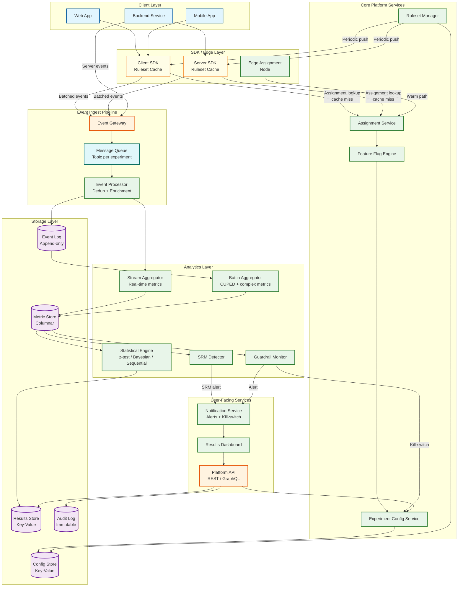
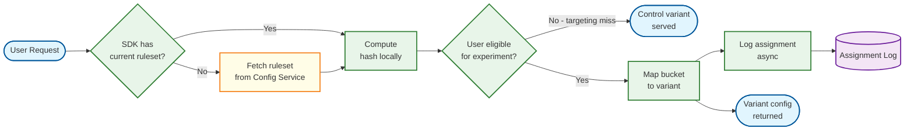

# 02 — High-Level Design: A/B Testing Platform

## System Architecture



---

## Key Design Decisions

### Decision 1: Stateless Edge Assignment Over Centralized Service

**Problem:** Assignment sits on the critical path of every product request. A centralized assignment service adds a network hop that violates the < 5 ms p99 SLO at scale.

**Decision:** Push the experiment ruleset (a compact JSON document listing all active experiments, their traffic allocations, targeting rules, and variant configurations) to client and server SDKs. SDKs evaluate assignment locally via a pure function with no I/O. Ruleset refreshes happen asynchronously every 30–60 seconds.

**Trade-offs:** The ruleset must be small enough to fit in memory (< 50 MB). Experiment configuration changes propagate with up to 60-second lag. Targeting that requires server-side user attributes (e.g., subscription tier) requires a thin server-side lookup, but the hash computation itself remains local.

---

### Decision 2: Append-Only Event Log as the System of Record

**Problem:** Metric definitions change after an experiment starts. Pre-aggregating too early locks in old definitions.

**Decision:** Store all raw events in an immutable, append-only log keyed by `(entity_id, event_type, timestamp)`. All metric computation is a query (or stream) over this log. Pre-aggregated snapshots are materialized views, not the source of truth.

**Trade-offs:** Storage cost is higher (raw events retained 90 days). Query latency for ad-hoc metrics is higher. But this design allows retroactive metric corrections and the platform can re-derive any metric from raw data at any time.

---

### Decision 3: Dual-Path Metric Computation (Streaming + Batch)

**Problem:** Analysts want near-real-time dashboards (< 15 min lag), but some metrics (CUPED-adjusted, quantile metrics, ratio metrics) are computationally expensive.

**Decision:** Run two parallel computation paths:
- **Streaming path:** Stateful stream processor computes simple aggregates (counts, sums) continuously with < 5 min lag. Results feed the live dashboard.
- **Batch path:** Scheduled batch jobs (every 1 hour) recompute all metrics from the raw event log with full accuracy, applying CUPED and variance reduction. Results overwrite streaming estimates.

Streaming results are labeled "preliminary" and batch results are labeled "final" in the UI.

---

### Decision 4: Sequential Testing as the Default Analysis Mode

**Problem:** Analysts peek at p-values before the experiment reaches the pre-specified sample size. Under classical frequentist analysis, any decision made on early data inflates the Type I error rate.

**Decision:** Default to sequential testing with always-valid confidence sequences (based on the mixture sequential probability ratio test, mSPRT). These produce p-values that remain statistically valid regardless of when the analyst looks. The platform computes them continuously and surface them in dashboards, removing any incentive to run classical t-tests against live data.

---

### Decision 5: Layered Mutual Exclusion for Experiment Isolation

**Problem:** Concurrent experiments can interact: experiment A tests a new checkout flow; experiment B tests a coupon offer on the same checkout page. Users in both simultaneously receive a confounded treatment.

**Decision:** Experiments are organized into **layers** (also called namespaces). Within a layer, each user is assigned to at most one experiment. Each layer hashes the entity ID with a layer-specific salt, producing an independent assignment namespace. Experiments targeting different features can share a layer if the product team confirms they are independent, or be placed in separate layers for guaranteed isolation at the cost of reduced eligible traffic per experiment.

---

## Data Flow: Experiment Assignment



---

## Data Flow: Event Tracking and Metric Computation

```mermaid
flowchart LR
    A([SDK Event]) --> B[Event Gateway\nValidation + Auth]
    B --> C[Message Queue\nPartitioned by entity_id]
    C --> D[Event Processor\nDedup + Enrich]
    D --> E[(Event Log)]
    D --> F[Stream Aggregator]
    F --> G[(Metric Store\nStreaming estimates)]
    E --> H[Batch Aggregator\n1-hr schedule]
    H --> I[CUPED Engine]
    I --> G
    G --> J[Statistical Engine]
    J --> K[(Results Store)]
    K --> L([Dashboard])

    classDef client fill:#e1f5fe,stroke:#01579b,stroke-width:2px
    classDef api fill:#fff3e0,stroke:#e65100,stroke-width:2px
    classDef service fill:#e8f5e9,stroke:#2e7d32,stroke-width:2px
    classDef data fill:#f3e5f5,stroke:#6a1b9a,stroke-width:2px
    classDef queue fill:#e0f7fa,stroke:#00695c,stroke-width:2px

    class A,L client
    class B api
    class D,F,H,I,J service
    class C queue
    class E,G,K data
```



---

## Data Flow: Guardrail and SRM Monitoring

```mermaid
flowchart TB
    A[(Metric Store)] --> B[SRM Detector\nchi-squared on\nactual vs expected splits]
    A --> C[Guardrail Monitor\ncompare variant vs control\non guardrail metrics]
    B --> D{SRM\ndetected?}
    D -->|Yes| E[Pause Experiment\n+ Alert]
    D -->|No| F[Continue]
    C --> G{Guardrail\nbreach?}
    G -->|Yes| H[Kill-switch:\nforce all traffic\nto control]
    G -->|No| I[Continue]
    E --> J[Notification Service]
    H --> J
    H --> K[Config Service\nupdate experiment state]

    classDef service fill:#e8f5e9,stroke:#2e7d32,stroke-width:2px
    classDef data fill:#f3e5f5,stroke:#6a1b9a,stroke-width:2px
    classDef api fill:#fff3e0,stroke:#e65100,stroke-width:2px

    class B,C,D,G,J service
    class A data
    class E,F,H,I,K api

---

## Architecture Decision Records

### ADR-001: SHA-256 Over Simpler Hash Functions for Assignment

| Field | Detail |
|---|---|
| **Status** | Accepted |
| **Context** | The assignment hash function must produce uniform, independent bucket assignments across experiments. Simpler hash functions (CRC32, MurmurHash) are faster but have weaker avalanche properties, meaning that small changes in input (e.g., sequential user IDs) may produce correlated bucket assignments across experiments. |
| **Decision** | Use SHA-256 truncated to 8 bytes. The per-experiment salt ensures independence. SHA-256's cryptographic quality guarantees uniformity that is indistinguishable from random. |
| **Consequences** | (1) Slightly higher CPU cost per hash (~200ns vs. ~50ns for MurmurHash), but assignment is not CPU-bound. (2) Guaranteed uniformity eliminates the need for empirical uniformity testing on new experiment configurations. (3) Reproducible: any party with the entity_id and experiment config can verify the assignment independently. |

### ADR-002: Dual-Path Metric Computation Over Single-Path

| Field | Detail |
|---|---|
| **Status** | Accepted |
| **Context** | Analysts want near-real-time results (< 5 min lag) but accurate metrics (CUPED-adjusted, outlier-winsorized) require batch computation over the full event log. A single streaming path cannot run CUPED; a single batch path cannot provide freshness. |
| **Decision** | Run parallel streaming (simple aggregates, < 5 min lag) and batch (full-fidelity, < 90 min lag) computation paths. Streaming results are labeled "preliminary"; batch results overwrite streaming when available. |
| **Consequences** | (1) Analysts see fresh data without waiting for batch. (2) Batch results are authoritative and include CUPED. (3) Increased infrastructure complexity (two pipelines). (4) Requires clear UX to distinguish preliminary vs. final results. |

### ADR-003: 10,000-Bucket Granularity Over Fewer Buckets

| Field | Detail |
|---|---|
| **Status** | Accepted |
| **Context** | The bucket count determines the minimum traffic granularity. Fewer buckets (100) give 1% granularity but limit the precision of traffic allocation. More buckets (1,000,000) give extreme precision but increase ruleset size and targeting complexity. |
| **Decision** | 10,000 buckets, providing 0.01% traffic granularity. This allows experiments with as little as 0.01% traffic allocation — sufficient for high-risk experiments on large platforms. |
| **Consequences** | (1) 0.01% granularity supports micro-experiments for risky changes. (2) Ruleset size remains manageable. (3) Bucket collision probability between experiments in the same layer is well-understood. (4) The bucket namespace is large enough that traffic allocation changes rarely need to "move" users across buckets. |

### ADR-004: Control Fallback as the Universal Failure Mode

| Field | Detail |
|---|---|
| **Status** | Accepted |
| **Context** | When the assignment system fails (stale cache expired, config corruption, SDK initialization error), the system must choose between: (a) serving a random variant, (b) serving no experiment (control), or (c) blocking the request. |
| **Decision** | Always fall back to control (variant 0). This means the product behaves as if no experiments are running — the safest possible state for both users and experiment integrity. |
| **Consequences** | (1) No user harm from experimental treatments during failures. (2) Assignment log records fallback assignments with source="fallback", enabling accurate filtering. (3) Experiments may see a dip in treatment traffic during outages, but this is preferable to contaminated assignments. (4) Control fallback creates a natural "off switch" for the entire experimentation platform in emergencies. |

---

## Architecture Case Studies

### Case Study 1: Consumer Marketplace — 200M DAU, 5,000 Concurrent Experiments

A large marketplace platform ran 5,000 concurrent experiments across search ranking, product pages, checkout, and seller tools. Key architectural lessons:

- **Layer per product vertical:** Search experiments in one layer, checkout in another, seller tools in a third. Cross-vertical experiments (e.g., testing a search algorithm change that also affects product page layout) required a dedicated cross-vertical layer with 20% of total traffic reserved.
- **Revenue-first guardrails:** Every experiment touching the purchase funnel had automated revenue guardrails. A 0.3% GMV drop at p < 0.01 triggered automatic experiment termination. In Year 1, this killed 12 experiments that would have shipped revenue-negative features.
- **Warehouse-native analysis:** The marketplace's data already lived in a warehouse. Instead of duplicating events into the experiment platform's event log, they used the warehouse-native analysis pattern: assignment records were exported to the warehouse, and SQL templates computed metrics in-warehouse. This eliminated 80 TB of redundant data storage.

### Case Study 2: Media Streaming — Subscription Experiments with Long Feedback Loops

A streaming platform tested subscription plan changes, onboarding flows, and content recommendation algorithms:

- **30-day metric windows:** Subscription metrics (trial-to-paid conversion, 30-day retention) require experiments to run for 6+ weeks. Sequential testing with mSPRT allowed analysts to stop experiments with obvious losers early, saving 2-3 weeks on average.
- **Content recommendation contamination:** Recommendation experiments create feedback loops. The platform implemented a "recommendation freeze" variant where treatment users received algorithmically different recommendations but the same model computed metrics, isolating the treatment effect from the feedback loop.
- **Holdback for cumulative effect measurement:** A 2% global holdback ran for 12 months. The holdback showed that the cumulative effect of 500+ shipped experiments was a 15% improvement in engagement — validating the experimentation program's ROI.

### Case Study 3: B2B SaaS — Account-Level Experiments with Small Sample Sizes

A B2B SaaS platform with 50,000 accounts experimented on pricing, feature rollout, and workflow changes:

- **Account-level randomization:** Entity type = "org". All users in an account see the same variant. The hash is computed on `org_id`, not `user_id`.
- **Bayesian as default:** With 50,000 accounts split across 2-3 variants, most experiments have < 25,000 observations per variant. Bayesian analysis with informative priors provided more useful decision support than underpowered frequentist tests.
- **Revenue-weighted analysis:** Enterprise accounts contribute 100× the revenue of SMB accounts. The statistical engine weights observations by account revenue tier, ensuring that the experiment measures impact on revenue, not account count.

---

## Cross-Cutting Architecture Concerns

### Experiment Lifecycle State Machine

```
DRAFT → VALIDATING → SCHEDULED → RUNNING → STOPPING → STOPPED → ARCHIVED
  │         │                      │  │
  │         └── VALIDATION_FAILED  │  └── PAUSED → RUNNING (resume)
  └── DELETED                      │
                                   └── FORCE_STOPPED (guardrail breach / kill-switch)
```

Key state transitions and their constraints:
- **DRAFT → VALIDATING**: Triggered by experiment owner clicking "Start" or scheduled start time
- **VALIDATING → RUNNING**: Pre-start validation passes (layer capacity available, targeting rules valid, primary metric defined, no SRM risk from targeting overlap)
- **RUNNING → PAUSED**: Manual pause by owner or SRM warning (not breach)
- **RUNNING → FORCE_STOPPED**: Automated kill-switch from guardrail breach; not reversible
- **STOPPED → ARCHIVED**: After results review; archived experiments free layer capacity
- Every state transition writes an immutable audit log entry

### Data Flow Isolation Boundaries

| Boundary | Data Flows In | Data Flows Out | Restriction |
|---|---|---|---|
| **Assignment path** | Entity ID, targeting attributes | Variant assignment, flag overrides | No access to events, metrics, or results |
| **Event pipeline** | Raw events, experiment context | Processed events, streaming aggregates | No access to experiment config; enrichment only |
| **Analysis engine** | Aggregated metrics, CUPED covariates | Statistical results, p-values, CIs | No access to raw events (only aggregates); no access to PII |
| **Dashboard** | Pre-computed results, experiment metadata | Rendered visualizations | Read-only; cannot trigger experiment changes |
| **Config service** | Experiment definitions, lifecycle commands | Ruleset, state changes | Cannot read events or results; write access is permission-gated |
| **Audit system** | All state changes from all services | Audit records | Write-only from services; read-only for compliance team |

### Consistency Model

| Component | Consistency Level | Rationale |
|---|---|---|
| Experiment config → SDK ruleset | Eventual (30-60 second lag) | Acceptable: experiments change infrequently |
| Event pipeline | Exactly-once (after ACK) | Critical: duplicate or lost events corrupt metrics |
| Streaming aggregates | At-least-once (with dedup) | Preliminary results; minor inaccuracy acceptable |
| Batch aggregates | Exactly-once | Authoritative: drives decisions |
| Assignment log | Eventually consistent (async write) | Not on hot path; used for analytics only |
| Statistical results | Eventually consistent (batch-driven) | Results update periodically; staleness bounded by SLO |
| Audit log | Strongly consistent (synchronous write) | Legal requirement: every action must be recorded before it takes effect |

### Event Schema Governance

Event schemas are the contract between product teams (who emit events) and the experimentation platform (which computes metrics). Schema governance prevents the most common cause of metric computation errors:

```
Schema lifecycle:
1. Product team proposes new event type or modifies existing schema via PR
2. Platform validates: no metric definitions break under the new schema
3. Schema registered in the schema registry with a version number
4. Old schema remains valid for 30 days (backward compatibility window)
5. Events sent with an unregistered schema version are rejected at the gateway

Breaking changes:
  - Removing a property used by any active metric → BLOCKED
  - Renaming a property → treated as remove + add → BLOCKED
  - Changing property type (string → int) → BLOCKED
  - Adding a new property → ALLOWED (additive change)
  - Adding a new event type → ALLOWED

Schema registry contains:
  - 200+ event types (mature platform)
  - ~3,000 individual properties across all types
  - Version history for every schema change
  - Dependency map: which metrics depend on which properties
```

### Technology Stack Decision Framework

Rather than prescribing specific technology choices, the platform's storage and compute tiers are chosen based on access pattern requirements:

| Component | Access Pattern | Storage Model Required | Sizing Constraint |
|---|---|---|---|
| Event ingest buffer | High write throughput, sequential reads | Durable distributed log | 500K writes/sec sustained, 7-day retention |
| Event archive | Batch scan, rarely random read | Columnar file format on distributed storage | 50 TB/day ingest, 90-day hot retention |
| Assignment cache (SDK) | Read-heavy, sub-ms latency | In-process memory (compiled binary) | < 1 MB footprint per SDK instance |
| Experiment config store | Low write, moderate read, strong consistency | Replicated key-value or document store | < 100K total experiments; reads on config change only |
| Streaming aggregates | Continuous update, point reads | In-memory data grid with persistence | 500K updates/sec; state fits in ~64 GB per partition |
| Batch aggregates | Periodic bulk write, analytical read | Columnar analytical store | 10,000 experiment × 50 metrics × 365 days |
| Statistical results | Periodic write, dashboard read | Document store or analytical store | Low volume; optimized for read latency |
| Audit log | Append-only, infrequent read | Immutable append-only log | 7-year retention, integrity verification |
| Compiled rulesets | Infrequent write, CDN-distributed read | Object store + CDN | < 3 MB per version; global edge distribution |

**Selection principle**: Choose the simplest technology that satisfies the access pattern. A platform running 100 experiments does not need the same stack as one running 10,000. The architecture is designed so each component can be independently upgraded as scale demands grow.
