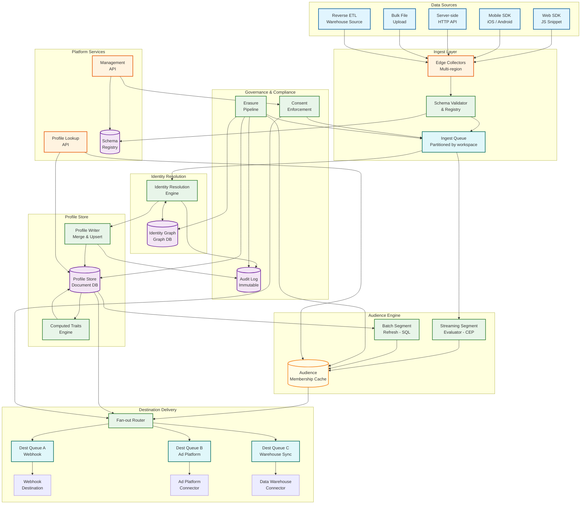
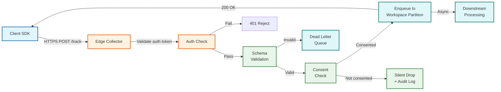
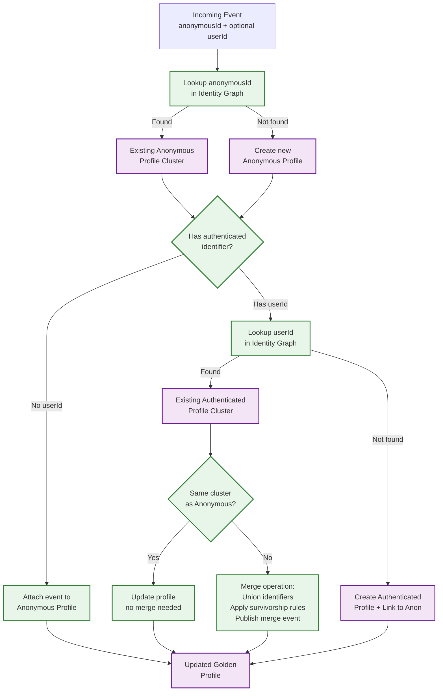
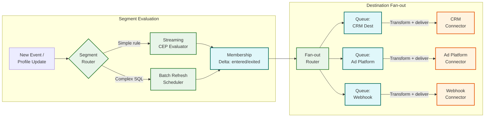

# 02 — High-Level Design: Customer Data Platform

## System Architecture

---

## Key Design Decisions

### Decision 1: Ingest Queue Architecture

| Aspect | Detail |
|---|---|
| **Options** | (A) Synchronous write to profile store; (B) Single global queue; (C) Partitioned queue per workspace |
| **Decision** | Partitioned queue per workspace (C) |
| **Rationale** | Synchronous writes create head-of-line blocking and couple ingest latency to downstream processing speed. A single global queue creates cross-workspace interference — a noisy workspace can delay all others. Workspace-partitioned queues provide isolation, independent backpressure, and allow per-workspace throughput tuning. Within each workspace partition, events are further sub-partitioned by anonymous ID to preserve per-user ordering for identity resolution. |

### Decision 2: Identity Graph Storage

| Aspect | Detail |
|---|---|
| **Options** | (A) Relational DB with adjacency list; (B) Dedicated graph database; (C) Document store with embedded identifier arrays |
| **Decision** | Dedicated graph database (B) for identity graph, with profile document store (C) for the unified profile |
| **Rationale** | Identity resolution requires traversing connected components to find all profiles sharing an identifier — this is a graph BFS/DFS operation that is very expensive in relational tables (multiple self-joins). A native graph database stores adjacency natively and supports sub-millisecond traversal for typical identity clusters (2–20 nodes). The unified profile is a different access pattern (point lookup by profile ID) better served by a document store. Keeping them separate allows each to be optimized and scaled independently. |

### Decision 3: Dual-Path Segment Evaluation

| Aspect | Detail |
|---|---|
| **Options** | (A) Pure batch SQL nightly; (B) Pure streaming CEP; (C) Dual-path with routing logic |
| **Decision** | Dual-path evaluation (C) |
| **Rationale** | Pure batch produces stale membership (24h lag), preventing real-time personalization. Pure streaming cannot handle segments requiring historical aggregations, complex SQL joins, or percentile computations across the full profile history — these require a full dataset scan. The dual-path approach compiles segment definitions at creation time: simple event-occurrence and trait-filter rules are routed to the streaming CEP evaluator; complex SQL-based segments use a batch refresh pipeline. A segment can be promoted from batch to streaming if it can be reformulated as a streamable rule. |

### Decision 4: Destination Delivery Queue Model

| Aspect | Detail |
|---|---|
| **Options** | (A) Synchronous HTTP fan-out per event; (B) Single shared delivery queue; (C) Per-destination isolated queues |
| **Decision** | Per-destination isolated queues (C) |
| **Rationale** | Synchronous fan-out ties event processing to the slowest destination — one slow webhook holds up all others. A single shared queue causes head-of-line blocking: a destination that goes offline fills the queue and starves healthy destinations. Per-destination queues provide isolation, independent retry policies, and independent circuit breakers. If a destination is down, only that destination's queue backs up; all others continue delivering normally. This is critical when a destination like a data warehouse sync is a high-volume batch operation running alongside real-time webhook destinations. |

### Decision 5: Composable vs. Packaged CDP Architecture

| Aspect | Detail |
|---|---|
| **Options** | (A) Traditional packaged CDP — all storage and processing internal; (B) Composable CDP — warehouse as source of truth, CDP as activation layer only |
| **Decision** | Support both patterns with a warehouse-sync and reverse ETL capability |
| **Rationale** | Traditional (packaged) CDPs duplicate data that already exists in the customer's data warehouse, creating synchronization problems and data governance headaches. Composable CDPs address this but require the customer to already have a mature warehouse — inappropriate for SMB customers. The pragmatic solution is a packaged CDP that continuously syncs all events and profiles to the customer's warehouse, while also supporting reverse ETL to pull warehouse-computed traits back into CDP profiles. This lets customers migrate toward a composable model over time without a wholesale platform switch. |

---

## Data Flow: Event Collection

---

## Data Flow: Identity Resolution

---

## Data Flow: Audience Building and Destination Fan-out

---

## Architecture Decision Records

### ADR-001: Event Store as Immutable Source of Truth

| Field | Detail |
|---|---|
| **Status** | Accepted |
| **Context** | The system needs a durable record of every customer interaction. Profile state changes over time (traits, audiences, consent), and downstream consumers need to backfill new computed traits from historical events. Multiple components (profile store, identity graph, audience cache) derive their state from events. |
| **Decision** | The append-only event log is the system's authoritative source of truth. All other stores (profile, identity graph, audience membership) are derived materialized views that can be rebuilt by replaying the event log from a checkpoint. |
| **Consequences** | (1) The event log must meet the highest durability requirements — synchronous replication, multi-AZ, multi-region backup. (2) Profile store corruption is recoverable via event replay, dramatically simplifying disaster recovery. (3) Storage cost is dominated by the event log (PB-scale). (4) Schema changes must be handled carefully — the event log contains events in all historical schema versions. (5) New computed traits can be backfilled by replaying events through the new trait definition. |
| **Rejected alternative** | Profile store as source of truth. This is simpler but cannot recover from corruption, cannot backfill new traits, and loses the ability to answer "what happened" questions. |

### ADR-002: Per-Workspace Queue Partitioning Over Global Queue

| Field | Detail |
|---|---|
| **Status** | Accepted |
| **Context** | At 2M events/sec peak with 100+ workspaces, a single global queue creates cross-workspace interference. One workspace's traffic spike delays processing for all others. Different workspaces have different SLAs and throughput needs. |
| **Decision** | Each workspace receives a dedicated logical partition in the ingest queue. Within each workspace partition, events are sub-partitioned by anonymousId for per-user ordering. |
| **Consequences** | (1) A noisy workspace only affects its own processing; other workspaces continue at normal latency. (2) Per-workspace throughput can be tuned independently (more partitions for high-volume workspaces). (3) Per-workspace backpressure is possible — a workspace exceeding its quota gets throttled while others are unaffected. (4) Operational complexity increases: monitoring must be per-workspace, not global. (5) Low-volume workspaces still require a minimum partition allocation, creating some resource waste. |
| **Rejected alternative** | Single global queue with priority tags. Simpler to operate but provides weak isolation and no per-workspace backpressure. |

### ADR-003: Separate Identity Graph and Profile Store

| Field | Detail |
|---|---|
| **Status** | Accepted |
| **Context** | Identity resolution requires graph traversal (BFS/DFS over identity clusters), while profile serving requires fast point lookups by profile ID. These are fundamentally different access patterns. |
| **Decision** | Use a graph database for the identity graph (nodes = identifiers, edges = co-occurrence evidence) and a document store for unified profiles (keyed by profile ID). The identity resolution engine reads/writes the graph; the profile writer reads/writes the document store. They communicate via the event pipeline. |
| **Consequences** | (1) Each store can be independently scaled and optimized for its access pattern. (2) Identity graph can be rebuilt from event log without affecting profile read latency. (3) Adds operational complexity: two different database technologies to manage. (4) Requires careful synchronization — a merge in the identity graph must result in a corresponding merge in the profile store. (5) The event pipeline between them is the consistency boundary — transient inconsistency is acceptable. |

### ADR-004: Crypto-Shredding Over Physical Deletion for Erasure

| Field | Detail |
|---|---|
| **Status** | Accepted |
| **Context** | The append-only event log is immutable by design (ADR-001). GDPR requires the ability to erase personal data. Physical deletion from an immutable log requires expensive compaction (rewriting PB-scale data). |
| **Decision** | Each profile's events are encrypted with a user-specific data key (UDK). To erase a user, the UDK is deleted from the key management service, rendering all encrypted events permanently unreadable. Supplemented by event suppression index for query-time filtering and background compaction for eventual physical removal. |
| **Consequences** | (1) Erasure is a O(1) key deletion, not a O(N) log rewrite. (2) Requires per-profile key management at the scale of hundreds of millions of keys. (3) Key management service becomes a critical dependency. (4) Regulatory acceptance varies — some jurisdictions may not consider crypto-shredding as equivalent to physical deletion. Legal counsel must confirm per-jurisdiction. (5) Key rotation adds operational complexity. |

---

## Architecture Case Studies

### Case Study 1: E-Commerce CDP (500M Profiles, Cell-Based)

A major global retailer operates a CDP processing 30B events/day across 500M customer profiles spanning 15 countries with different privacy regulations. Key architectural decisions:

- **Cell-based deployment**: Profiles are partitioned into cells by geographic region (EU, NA, APAC, LATAM). Each cell is a complete CDP instance with its own event store, profile store, and identity graph. Cross-cell identity stitching is handled by a dedicated global identity resolver that only sees hashed identifiers — no plaintext PII crosses cell boundaries.
- **Seasonal scaling**: Black Friday traffic peaks at 10× normal volume. The ingest tier pre-scales 48 hours before known peak events using historical traffic patterns. The fan-out tier enables batch coalescing mode during peaks, reducing per-event delivery to 15-minute batched pushes for non-real-time destinations.
- **Offline-to-online stitching**: Physical store purchases (POS events) arrive via batch upload with a 2–4 hour delay. The identity resolver uses loyalty card ID to stitch POS events to online profiles, enabling cross-channel audience building (e.g., "browsed online + bought in store within 7 days").

### Case Study 2: Media Streaming CDP (8 Device Types, Household Identity)

A streaming media platform runs a CDP handling 15B content consumption events/day across 200M subscriber profiles and 8 device types (smart TV, phone, tablet, laptop, gaming console, set-top box, voice assistant, car). Key challenges:

- **Household identity model**: A single subscription may have 5 individual profiles within a household. The identity graph maintains a two-level hierarchy: household cluster → individual profiles. Device-level anonymous events are first attributed to the household, then disambiguated to the individual via watch history patterns and time-of-day heuristics.
- **Real-time content recommendations**: The profile lookup API serves recommendations at content selection time (< 50ms). The profile includes pre-computed content affinity vectors (genre preferences, director preferences, recency-weighted). These vectors are updated by a dedicated computed traits engine that processes content view events in near-real-time.
- **Content licensing audience building**: Audiences are built for content licensing negotiations (e.g., "how many subscribers watched genre X in the last quarter"). These audiences require batch evaluation across the full profile set with exact counts — streaming evaluation is insufficient. A dedicated batch pipeline runs overnight and materializes licensing metrics.

### Case Study 3: B2B SaaS CDP (Account-Level Segmentation)

A B2B software company operates a CDP that unifies product usage events, CRM data, and marketing engagement across 50M company accounts and 300M individual contacts. Key differences from consumer CDP:

- **Account hierarchy**: The identity graph includes an additional layer: individual → company account → parent company. Identity resolution must handle the case where an individual changes companies (their profile should move to the new company's account, not merge the two companies).
- **Product-led growth signals**: Computed traits include account-level aggregations (total active users in account, feature adoption scores, expansion signals). These require cross-profile aggregation — the trait engine must aggregate events from all individuals within an account to compute account-level traits.
- **Lead scoring as audience evaluation**: Sales-qualified-lead (SQL) segments use complex rules combining individual behavior (email opens, demo requests) with account-level signals (usage growth, number of seats). This requires the batch evaluation path — streaming cannot efficiently join individual and account-level data in real-time.
