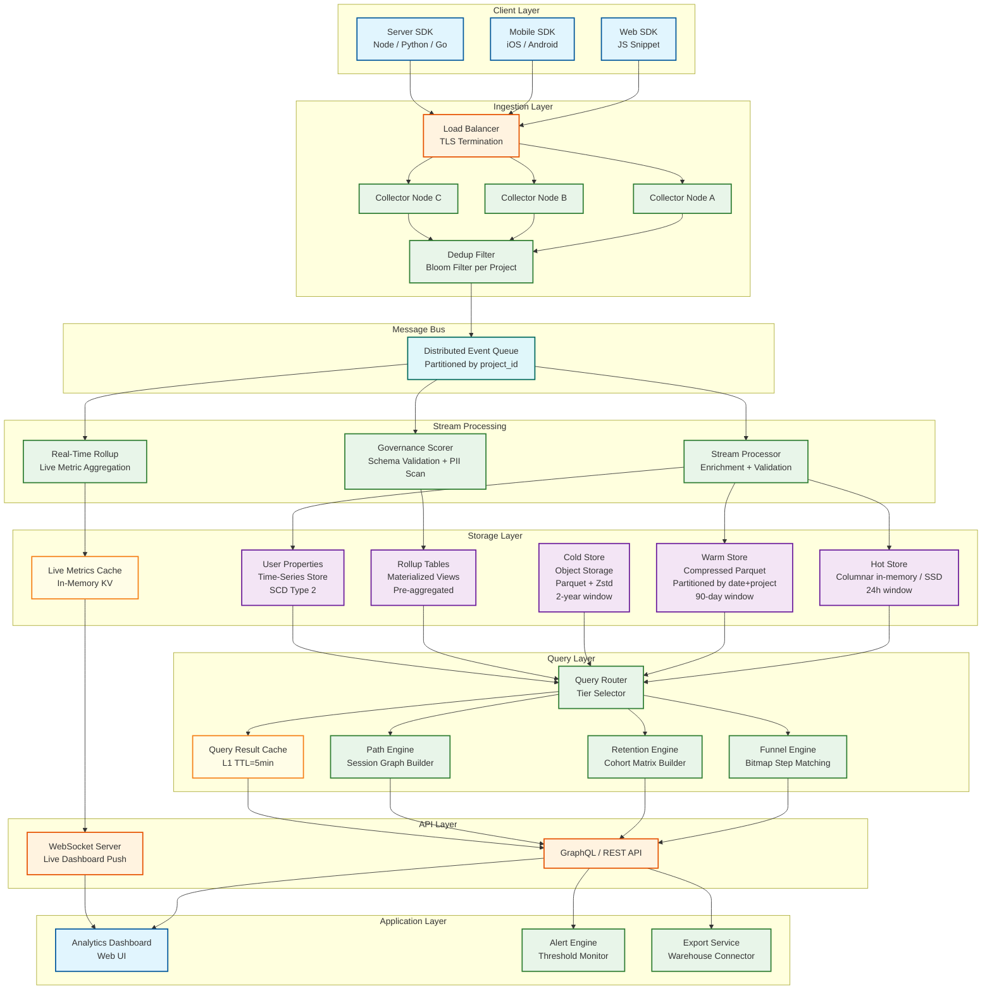
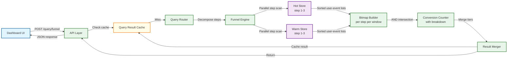

# 12.16 Product Analytics Platform — High-Level Design

## System Architecture

---

## Key Design Decisions

### Decision 1: Schema-on-Read for Event Properties

**Choice:** Store event properties as a compressed JSON blob or as a sparse dynamic column map; resolve schema at query time using property dictionaries.

**Rationale:** Product teams instrument new events constantly. Requiring schema registration before ingestion creates operational friction and delays time-to-insight. Schema-on-read allows raw events to be stored with any property set, with type inference and conflict detection surfaced post-ingestion via the governance layer.

**Trade-off:** Query-time property access is slower than native-typed columns for schema-on-write. Mitigated by materializing commonly-queried properties into typed columns during warm-store compaction—a hybrid approach where high-frequency properties get promoted to native columns while long-tail properties remain in the JSON blob.

---

### Decision 2: Separate Hot, Warm, and Cold Storage Tiers

**Choice:** Three-tier storage architecture: in-memory/NVMe hot store (last 24h), compressed columnar warm store (last 90 days), cold object storage (historical).

**Rationale:** Most queries are over recent data (last 30 days). A three-tier design ensures recent queries hit fast local storage while keeping storage costs linear with data volume rather than compute cost. The query router dispatches sub-queries to the appropriate tier and merges results.

**Trade-off:** Complexity of result merging across tiers, especially when a query window spans multiple tiers. Addressed by enforcing non-overlapping tier boundaries and merging at the query router with a deterministic merge strategy.

---

### Decision 3: Bitmap-Based Funnel Computation

**Choice:** Represent each funnel step as a roaring bitmap of user IDs who completed that step; compute conversion by ANDing consecutive step bitmaps after applying time-window constraints.

**Rationale:** Funnel queries require counting distinct users at each step while enforcing step ordering within a time window. Correlated subqueries on row-oriented data are O(n²) per step. Bitmap intersection is O(n/64) and can be vectorized. For 100M users, a full bitmap is 12.5MB—fits in L3 cache.

**Trade-off:** Bitmap approach requires sorting events by (user\_id, timestamp) per step, which is an expensive pre-sort. Mitigated by maintaining sort-order during columnar compaction so step bitmaps can be built in a single sequential scan.

---

### Decision 4: HyperLogLog for Distinct User Counting

**Choice:** Use HyperLogLog++ sketches for all distinct user count aggregations in pre-computed rollups and real-time metrics.

**Rationale:** Exact COUNT DISTINCT over 100M+ users requires either materializing all user IDs (expensive) or sorting (O(n log n)). HyperLogLog provides ~0.8% relative error at <1% of the memory cost. For business-level metrics, 0.8% error is acceptable and invisible to users.

**Trade-off:** Exact counts required for regulatory reporting or billing must bypass sketches and use exact computation, with explicit latency trade-off communicated to callers.

---

### Decision 5: Event Deduplication via Bloom Filter

**Choice:** Per-project bloom filter keyed on (project\_id, event\_id) maintained in the collector tier; refresh daily with exact hash set for previous 72 hours.

**Rationale:** SDKs retry events on network failure, creating duplicates. Downstream deduplication after storage is expensive (requires recomputation of all affected aggregates). Collector-side bloom filter catches ~99.9% of duplicates before they enter the queue. False positive rate of 0.01% means a tiny fraction of unique events incorrectly dropped—acceptable given at-least-once delivery semantics.

**Trade-off:** Bloom filter does not catch duplicates across partitions if the same event reaches different collector nodes. Mitigated by consistent hashing of event\_id to a single collector partition before dedup check.

---

## Component Dependency Matrix

| Component | Depends On | Failure Impact | Recovery Strategy |
|---|---|---|---|
| **SDK Client** | Collector endpoint (DNS) | Events queued locally in IndexedDB/SQLite | Circuit breaker; retry with exponential backoff |
| **Collector Tier** | Load balancer, Bloom filter cache, Message queue | Events rejected; clients retry | Stateless; auto-scale; LB health checks |
| **Message Queue** | Disk/replication for durability | Ingestion halted; events queued at collectors | 3x replication; 7-day retention; partition failover |
| **Stream Processor** | Queue, Hot store, Identity cache, Governance rules | Events not processed; freshness degrades | Consumer group rebalance; checkpoint replay |
| **Hot Store** | NVMe/RAM, Stream processor writes | Dashboard queries show stale data | Ephemeral by design; rebuilt from queue replay |
| **Warm Store** | SSD, Compaction from hot store | Ad hoc queries over 24h–90d window degraded | Compaction backlog; query falls through to cold |
| **Cold Store** | Object storage | Historical queries fail | Cross-region replication; eventual consistency |
| **Query Router** | All storage tiers, Cache, Query executors | All queries fail | Stateless; auto-scale; degraded mode returns cached results |
| **Identity Resolution** | Key-value store, identify() events | Anonymous events not linked to users | Cache rebuild from identity event log |

---

## Critical Path vs. Non-Critical Path

| Path | Components | Failure Impact | SLO |
|---|---|---|---|
| **Ingestion critical path** | SDK → Collector → Queue → Stream Processor → Hot Store | Data loss or freshness violation | 99.99% availability |
| **Query critical path** | API → Query Router → Storage Tier → Query Engine | Query failures | 99.9% availability |
| **Non-critical: Compaction** | Hot→Warm, Warm→Cold background jobs | Historical queries slower; no data loss | Best-effort; 2h SLO |
| **Non-critical: Rollup refresh** | Stream processor → Rollup tables | Dashboard shows slightly stale aggregates | 15-minute freshness |
| **Non-critical: Governance scoring** | Stream processor → Governance scorer | Schema violations not flagged; PII not detected | Best-effort; 24h SLO |

---

## Failure Domain Analysis

| Failure Domain | Blast Radius | Detection | Recovery Time |
|---|---|---|---|
| **Single collector node** | ~3% of ingestion traffic (if 30+ nodes) | Health check failure; LB removes | Seconds (LB reroute) |
| **Queue partition failure** | Events for ~1/N projects queued at producer | Consumer lag spike; partition ISR alert | Minutes (leader election) |
| **Stream processor crash** | Consumer group rebalance; brief processing pause | Consumer lag increase; checkpoint gap | 30–60 seconds (rebalance) |
| **Hot store node loss** | 24h data for a shard unavailable | Query errors for recent data; hot store health check | Minutes (rebuild from queue) |
| **Identity cache failure** | Anonymous events not resolved to user\_id | Identity resolution miss rate spike | Minutes (cache warm from event log) |
| **Region-wide outage** | All ingestion and queries for affected region | External monitoring; canary failure | Hours (DR promotion; DNS failover) |
| **Bloom filter corruption** | Duplicate events accepted (count inflation) | Dedup rate anomaly | Minutes (rebuild from 72h event log) |
| **Metadata store failure** | Cannot create/modify funnels, cohorts, retention configs | API errors for definition management; queries on saved definitions cached | Minutes (replica promotion) |

---

## Architecture Decision Records (ADRs)

### ADR-1: Roaring Bitmaps Over B-Tree Indexes for User Set Operations

**Context:** Funnel, retention, and cohort queries fundamentally require set intersection/union/difference over user ID sets. Two primary approaches: (1) B-tree secondary indexes on user\_id with index-join, (2) roaring bitmap representations.

**Decision:** Roaring bitmaps.

**Rationale:** B-tree index joins are O(n log n) per set operation and require random I/O. Roaring bitmaps are O(n/64) for intersection via SIMD, fit in cache (100M users = 12.5MB), and compose naturally (AND, OR, ANDNOT). The trade-off — bitmaps require sequential user\_id encoding (not arbitrary strings) — is addressed by maintaining a per-project user\_id → integer mapping dictionary, amortized at ingestion time.

### ADR-2: Counting Bloom Filter (Not Standard) for Deduplication

**Context:** Event deduplication requires both insertion and deletion (for GDPR erasure of queued events). Standard bloom filters do not support deletion.

**Decision:** Counting bloom filter with 4-bit counters.

**Rationale:** Counting bloom filters support decrement operations, enabling deletion at the cost of 4× memory overhead (4 bits per bucket instead of 1). For 1B events with 0.01% false positive rate: standard = 1.5GB, counting = 6GB. The 6GB memory cost is justified by the requirement for GDPR-compliant deletion of events that are still in the dedup window.

### ADR-3: Parquet Over ORC for Columnar Storage

**Context:** Both Parquet and ORC are mature columnar formats. The system needs a format for warm and cold storage tiers.

**Decision:** Parquet with Zstd compression.

**Rationale:** Parquet's nested data support (MAP type for event properties) is more mature than ORC's. The ecosystem of readers (query engines, warehouse connectors) is broader for Parquet. Zstd compression provides 15–20% better compression than Snappy at comparable decompression speed. Trade-off: ORC has slightly better predicate pushdown for string columns, but Parquet's dictionary encoding + Bloom filter indexes close this gap.

---

## Case Studies

### Case Study 1: E-Commerce Platform Migration (Proprietary Analytics → Self-Hosted)

**Problem:** An e-commerce platform with 200M events/day was spending $180K/month on a SaaS analytics vendor. Data residency requirements (EU customer data must stay in EU) made the SaaS vendor's US-only storage a compliance risk.

**Solution:** Migrated to self-hosted analytics platform with regional deployment:
- EU events ingested and stored in EU region; US events in US region
- Shared metadata store with cross-region query routing for global dashboards
- Parquet on regional object storage with project-level encryption keys

**Result:** 62% cost reduction ($180K → $68K/month). GDPR compliance achieved with per-region data residency. Query latency improved by 40% due to data locality.

### Case Study 2: SaaS Product with Extreme Tenant Skew

**Problem:** A multi-tenant analytics platform had 50,000 projects, but one enterprise customer generated 40% of total event volume (4B events/day). This customer's queries monopolized query executors, causing P99 latency violations for smaller tenants.

**Solution:**
- Dedicated storage partition and sub-sharding (16 sub-partitions) for the large tenant
- Separate query worker pool allocated exclusively to the large tenant (workload isolation)
- Fair-scheduling across remaining worker pool for all other tenants
- Per-project query concurrency limits: large tenant = 50 concurrent, small tenants = 20

**Result:** P99 funnel query latency dropped from 4.2s to 1.1s for small tenants. Large tenant maintained 1.8s P99 with dedicated resources. Total compute cost increased 15% but SLO violations dropped 95%.

### Case Study 3: Privacy-First Analytics After Cookie Deprecation

**Problem:** A media company relied on third-party cookies for cross-site user tracking. Cookie deprecation broke their funnel analysis across marketing site → product → checkout flow.

**Solution:**
- Server-side event collection replacing client-side pixel tracking
- First-party identity resolution using hashed email as canonical user\_id
- Probabilistic identity matching for anonymous sessions using device fingerprint + behavioral signals (accuracy: ~85%)
- Differential privacy noise injection for exported cohort data (ε=1.0)

**Result:** Funnel coverage restored to 92% of pre-deprecation levels. GDPR compliance improved because raw PII never leaves the server-side collector. Export data passes differential privacy audit.

---

## Data Flows

### Flow 1: Event Ingestion

```mermaid
flowchart LR
    SDK[SDK Client] -->|HTTPS POST /events batch| COL[Collector]
    COL -->|Check event_id| BF[Bloom Filter]
    BF -->|Not seen| VAL[Validate Envelope\ntimestamp, project_id, user_id]
    BF -->|Already seen| ACK[202 Accepted\nskip duplicate]
    VAL -->|Valid| ENRICH[Enrich\nIP→geo, UA→device]
    ENRICH -->|Partition by project_id| MQ[Message Queue]
    MQ -->|Consumer group| SP[Stream Processor]
    SP -->|Write-ahead| HOT[Hot Columnar Store]
    SP -->|Async batch| WARM[Warm Parquet Files]
    SP -->|Governance check| GOV[Governance Scorer]
    HOT -->|Ack to producer| OK[200 OK]

    classDef client fill:#e1f5fe,stroke:#01579b,stroke-width:2px
    classDef api fill:#fff3e0,stroke:#e65100,stroke-width:2px
    classDef service fill:#e8f5e9,stroke:#2e7d32,stroke-width:2px
    classDef data fill:#f3e5f5,stroke:#6a1b9a,stroke-width:2px
    classDef cache fill:#fffde7,stroke:#f57f17,stroke-width:2px
    classDef queue fill:#e0f7fa,stroke:#00695c,stroke-width:2px

    class SDK client
    class COL,VAL,ENRICH,SP,GOV api
    class BF,MQ queue
    class HOT,WARM data
    class OK,ACK cache
```

### Flow 2: Funnel Query Execution

### Flow 3: Retention Computation

```mermaid
flowchart LR
    REQ[Retention Query\ncohort=first_purchase\nwindow=12weeks] -->|Parse| RE[Retention Engine]
    RE -->|Load cohort users| COHORT[Cohort Resolver\nWeek 0 users]
    COHORT -->|bitmap of user IDs| SCAN[Event Scanner\nWeek 1..12 return events]
    SCAN -->|Per-week active bitmaps| MATRIX[Retention Matrix Builder\nRow=cohort_week Col=return_week]
    MATRIX -->|Divide by cohort size| PCT[Percentage Calculator]
    PCT -->|Result JSON| RESP[Response\n12x12 retention grid]

    classDef client fill:#e1f5fe,stroke:#01579b,stroke-width:2px
    classDef service fill:#e8f5e9,stroke:#2e7d32,stroke-width:2px
    classDef data fill:#f3e5f5,stroke:#6a1b9a,stroke-width:2px

    class REQ client
    class RE,COHORT,SCAN,MATRIX,PCT service
    class RESP data
```

### Flow 4: User Journey / Path Analysis

```mermaid
flowchart LR
    PREQ[Path Query\nafter=checkout_started\ntop_paths=20] -->|Parse| PE[Path Engine]
    PE -->|Filter anchor event| ANCHOR[Anchor Event Finder\nall sessions with checkout_started]
    ANCHOR -->|session_ids| SESS[Session Reconstructor\nnext N events per session]
    SESS -->|ordered event sequences| GRAPH[Graph Builder\ncount edge weights A→B]
    GRAPH -->|prune low-frequency edges| TOP[Top-N Path Selector]
    TOP -->|Sankey-compatible JSON\nnodes + weighted edges| RESP[Response]

    classDef client fill:#e1f5fe,stroke:#01579b,stroke-width:2px
    classDef service fill:#e8f5e9,stroke:#2e7d32,stroke-width:2px
    classDef data fill:#f3e5f5,stroke:#6a1b9a,stroke-width:2px

    class PREQ client
    class PE,ANCHOR,SESS,GRAPH,TOP service
    class RESP data
```

---

## Architecture Decision Records (ADRs)

### ADR-001: Schema-on-Read vs. Schema-on-Write for Event Properties

**Status:** Accepted

**Context:** Product teams need to start tracking new event properties immediately without waiting for schema migrations. However, schema-on-read creates downstream challenges: type conflicts, property name inconsistencies, and governance decay.

**Decision:** Use schema-on-read for all event properties. Store properties as MAP<STRING, STRING> with type inference at query time. Complement with an optional governance layer that scores events against registered schemas without blocking ingestion.

**Consequences:**
- (+) Zero-friction instrumentation: teams add properties without coordination
- (+) Retroactive analysis: historical events with unregistered properties are still queryable
- (-) Query-time type resolution adds ~5% CPU overhead per query
- (-) High-cardinality properties discovered only after they've been stored

**Alternatives rejected:**
- Schema-on-write with auto-migration: rejected because migration latency blocks fast iteration
- Hybrid schema registry with write-time validation: rejected because validation at 500K events/sec adds unacceptable latency

---

### ADR-002: Roaring Bitmaps for Funnel Step Computation

**Status:** Accepted

**Context:** Funnel queries require counting distinct users at each step while enforcing temporal ordering. SQL-based approaches (correlated subqueries, window functions) do not meet the sub-second latency requirement at 100M+ user scale.

**Decision:** Represent each funnel step as a roaring bitmap of qualifying user IDs. Compute conversion by sequential bitmap intersection after parallel per-step columnar scans.

**Consequences:**
- (+) O(n/64) intersection via SIMD instructions; 50M users intersected in ~50ms
- (+) Per-step scans are fully parallelizable across storage tiers
- (-) Requires user\_id → integer mapping (maintained as per-project monotonic ID allocator)
- (-) Bitmaps for steps with very sparse user sets waste memory (mitigated by roaring bitmap run-length compression)

---

### ADR-003: HyperLogLog++ for Distinct Count Approximation

**Status:** Accepted

**Context:** Dashboard metrics require distinct user counts over time windows spanning months. Exact COUNT DISTINCT requires hash set materialization (800 MB for 100M user IDs), infeasible at sub-second latency.

**Decision:** Use HyperLogLog++ for all real-time dashboard distinct counts and rollups. Exact counts only for queries explicitly requesting exact mode (with disclosed latency penalty).

**Consequences:**
- (+) 1 KB per sketch regardless of cardinality; mergeable across time windows
- (+) ~0.8% relative error: invisible for product analytics decisions
- (-) Cannot provide exact intersection cardinality; intersection requires bitmap approach
- (-) Small cardinalities (<100) have higher relative error; mitigated by HLL++ bias correction

---

### ADR-004: SCD Type 2 for User Properties Instead of Event Denormalization

**Status:** Accepted

**Context:** Funnel and retention breakdowns by user properties require knowing the user's property value at the time of each event, not the current value. Event denormalization (stamping current property values on each event at write time) produces incorrect historical analysis when properties change.

**Decision:** Maintain a separate user\_properties table with SCD Type 2 semantics (valid\_from, valid\_to timestamps). Query-time as-of joins resolve property values at event timestamp.

**Consequences:**
- (+) Historical correctness: users classified by their properties at event time
- (+) Property changes don't require rewriting historical events
- (-) As-of join adds 50–200ms to queries with property breakdowns
- (-) User properties table grows with every property change (mitigated by compaction)

**Alternatives rejected:**
- Event-time denormalization: rejected because property changes require O(events) rewrite
- Latest-value join: rejected because breakdown results are incorrect whenever properties change
