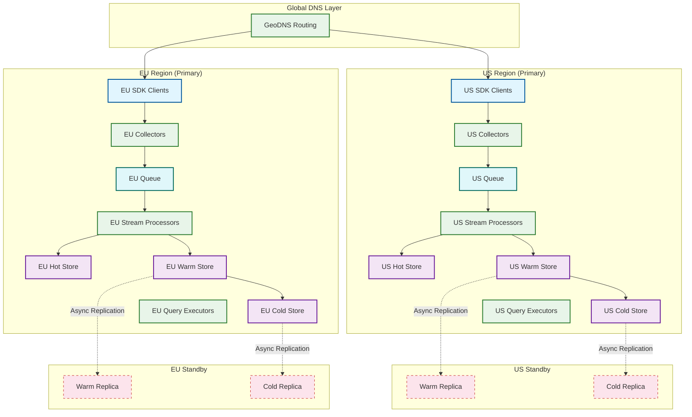

# 12.16 Product Analytics Platform — Scalability & Reliability

## Scalability Limits

| Dimension | Current Limit | Slowest part of the process | Scaling Strategy |
|---|---|---|---|
| Events/second (sustained) | 500K | Queue partition throughput | Add partitions; sub-partition whale tenants |
| Events/second (burst) | 1M | Collector tier CPU | Auto-scale collector fleet; SDK-side batching |
| Unique projects | 200K | Metadata store connections | Shard metadata by project\_id hash |
| Users per project | 500M | Bitmap memory during funnel queries | HLL approximation above threshold; bitmap sharding |
| Properties per event | 500 | JSON parsing cost at query time | Promote frequent properties to native columns |
| Concurrent queries | 1,000 | Query executor pool size | Auto-scale executor fleet; admission control |
| Cold storage total | 5 PB | Object storage namespace limits | Prefix-based sharding; cross-region distribution |
| Retention window | 10 years | Cold storage cost | Tiered pricing; retention policy enforcement |

---

## Capacity Planning Formulas

### Storage Capacity

```
daily_storage_gb = (events_per_day × avg_event_bytes_raw) / compression_ratio / 1e9
annual_storage_tb = daily_storage_gb × 365 / 1000
total_storage_tb = annual_storage_tb × retention_years × replication_factor

Example (10B events/day, 2yr retention, 3x replication):
  daily = (10e9 × 400) / 6 / 1e9 = 667 GB/day
  annual = 667 × 365 / 1000 = 243 TB/year
  total = 243 × 2 × 3 = 1,458 TB ≈ 1.5 PB
```

### Compute Capacity

```
query_workers = (cold_queries_per_second × avg_query_duration_s) / queries_per_worker
stream_processors = events_per_second / processing_rate_per_instance
collector_nodes = events_per_second / collector_throughput_per_node

Example:
  query_workers = (104 cold QPS × 1.5s avg) / 10 per_worker = 16 workers
  stream_processors = 347K EPS / 15K per_instance = 24 instances
  collector_nodes = 500K EPS / 50K per_node = 10 nodes
```

---

## Event Partitioning Strategy

### Primary Partition Scheme

Events are partitioned across the storage layer using a two-level scheme that balances query performance with write throughput:

**Level 1 — Logical partition:** `(project_id, event_date)`
- All events for a given project on a given day are co-located
- Enables efficient project-scoped queries without cross-partition scanning
- Enables efficient time-range Cutting off unnecessary steps: queries with date filters skip entire partitions

**Level 2 — Physical partition (within a logical partition):** `event_name`
- Columnar files are further subdivided by event\_name within the logical partition
- Funnel queries, which scan for specific event names, skip unrelated files entirely
- Each (project\_id, event\_date, event\_name) combination forms one or more row groups

**Within row group ordering:** `(user_id, client_timestamp)`
- Events for the same user within a row group are sorted together
- Funnel computation's step matching is a sequential scan over user events: this sort order makes it cache-friendly
- Bloom filters per row group on user\_id enable fast "does this row group contain user X?" checks

### Hot Spot Mitigation

Large projects (>100M events/day) create hot partitions that overwhelm individual storage nodes. Mitigation strategies:

**Shard splitting:** Oversized partitions are detected by a background monitor watching partition file sizes. When `(project_id, event_date)` exceeds 500GB compressed, the partition is split into `(project_id, event_date, user_id_hash_bucket)` sub-partitions (8 buckets by default). Query fanout is added transparently: a query for project P on date D fans out to all 8 sub-partitions and merges results.

**Write-side sharding:** Collector nodes hash-route events within a large project to 8× the normal queue partitions, distributing write load across more stream processors. The query router is aware of the sharding level and generates sub-partition-aware query plans.

---

## Query Parallelism

### Intra-Query Parallelism

A single funnel query against 1B events over 30 days requires scanning 30 daily partitions across multiple event names. This is decomposed into a parallel query plan:

```
Funnel query plan:
  Steps: [A, B, C]
  Date range: [Day 1 ... Day 30]

  Decompose into 90 parallel tasks:
    Task(step=A, date=Day1), Task(step=A, date=Day2), ..., Task(step=A, date=Day30)
    Task(step=B, date=Day1), ..., Task(step=B, date=Day30)
    Task(step=C, date=Day1), ..., Task(step=C, date=Day30)

  Each task:
    Scan partition (project_id, date, event_name=step)
    Return: sorted list of (user_id, min_timestamp)

  Merge phase (sequential):
    Merge all Task(step=A) results by user_id: user_step_A_bitmap
    Merge all Task(step=B) results by user_id: user_step_B_bitmap
    ...
    Apply ordering + time window: compute final conversion counts
```

**Executor model:** A distributed query executor maintains a worker pool. Each query gets allocated up to 32 worker slots. Parallel tasks are dispatched to workers, with results streamed back to a merge coordinator. Worker slots are fair-scheduled across concurrent queries to prevent one large query from starving smaller ones.

### Inter-Query Caching

**L1 Result Cache:** Exact query match cache keyed on (project\_id, query\_hash). TTL: 5 minutes for recent data, 30 minutes for historical data (> 2 days old). Hit rate: ~30% for common dashboard queries that refresh automatically.

**L2 Materialized Views:** Pre-computed rollups for the most common query shapes:
- Daily event count by event\_name (refreshed every 5 min from stream processor)
- Weekly unique user count by event\_name (refreshed hourly)
- Funnel completions for pinned funnels (refreshed daily)
- Retention matrices for saved retention configs (refreshed nightly)

**L3 Columnar Scan:** Full parallel scan across partitions. Required for ad hoc queries with arbitrary filters and breakdowns not covered by materialized views.

**Query routing logic:**
```
FUNCTION route_query(query):
  IF L1_cache.contains(query.hash):
    RETURN L1_cache.get(query.hash)

  IF query.shape MATCHES materialized_view:
    result = materialized_view_scan(query)
    IF result.freshness_ok(query.max_staleness):
      L1_cache.set(query.hash, result)
      RETURN result

  result = cold_columnar_scan(query)  // Parallel columnar execution
  L1_cache.set(query.hash, result)
  RETURN result
```

---

## Pre-Aggregation and Materialized Views

### Streaming Rollup Maintenance

The stream processor maintains a real-time rollup table updated as events arrive. The rollup is a columnar structure with the following dimensions:

```
Rollup table schema:
  project_id, event_date, event_hour, event_name → {
    total_count: INT64,
    unique_users_hll: HyperLogLog sketch (1KB per cell),
    unique_sessions_hll: HyperLogLog sketch,
    property_value_counts: MAP<property_key, MAP<value, count>>  // Top 100 values only
  }
```

The HyperLogLog sketches are mergeable: daily distinct-user counts are computed by OR-merging hourly sketches. This means the rollup is correct whether queried hourly, daily, or weekly—no re-aggregation required.

**Rollup granularity ladder:**
- 1-minute rollup: retained 24 hours (for real-time dashboard)
- 1-hour rollup: retained 7 days
- 1-day rollup: retained 90 days
- 1-week rollup: retained 2 years

Queries select the finest available granularity consistent with the requested time range, then aggregate upward. A 30-day trend query uses daily rollups (30 row lookups) rather than scanning 30 days of raw events.

---

## Cold Storage Tiering

### Tier Definition

| Tier | Storage Medium | Latency | Retention | Access Pattern |
|---|---|---|---|---|
| Hot | In-memory + NVMe SSD | < 10ms | 24 hours | Frequent random access for dashboards |
| Warm | Network-attached SSD | 50–200ms | 90 days | Ad hoc queries, moderate frequency |
| Cold | Object storage (Parquet) | 500ms–5s | 2+ years | Rare historical queries |

### Tier Migration

Events flow through tiers via background compaction:
1. **Hot → Warm (24h):** Stream processor writes to hot store continuously. A compaction job runs every hour, reading hot store data older than 24h, re-sorting by (user\_id, timestamp), applying dictionary compression, and writing to warm store as Parquet files. Hot store records then expire.
2. **Warm → Cold (90d):** A nightly compaction job reads warm store files older than 90 days, applies additional compression (Zstd level 19), and writes to cold object storage. Warm store files are then garbage-collected.

### Cold Query Acceleration

Cold object storage queries are the most expensive. Acceleration techniques:
- **Partition Cutting off unnecessary steps:** Cold files are organized in `project_id/YYYY/MM/DD/event_name/` prefix paths. Queries with date and event\_name filters only retrieve matching prefixes.
- **Row group statistics:** Each Parquet file stores min/max statistics per column per row group. Queries with user\_id or timestamp filters skip row groups that cannot match.
- **Parallel object reads:** Cold query workers open multiple concurrent read streams per file, saturating available network bandwidth.
- **Query result caching with 30-min TTL:** Cold query results are expensive to produce; caching at L1 for longer than hot-tier results is warranted.

---

## Multi-Region Architecture

### Region Layout

The system operates in multiple geographic regions to satisfy data residency requirements and reduce query latency for globally distributed customers.

**Primary architecture:** Each project is assigned to a home region based on the customer's configured data residency setting. Events are always ingested in the home region. Cross-region forwarding of raw events is never performed (residency compliance).

**Event ingestion routing:** The SDK resolves the appropriate ingestion endpoint at initialization based on the project's home region. A global DNS routing layer directs SDK requests to the nearest regional ingestion cluster. If the home region's ingest endpoint is unavailable, events are queued locally and forwarded when recovered (not re-routed to another region).

**Query serving:** Queries always execute in the home region. If the customer's team members are geographically distributed, a thin query caching layer in additional regions can serve repeated read-only queries with low latency, but all cache misses route back to the home region.

### Cross-Region Failover

Each regional deployment includes a standby region that receives asynchronous replication of the warm and cold stores (not the hot store, which is ephemeral). The RTO (Recovery Time Objective) for a regional failure is:
- Hot store: 0 data — must re-ingest from queue if regional failure occurs before compaction
- Warm/cold store: < 1 hour (promote standby; redirect DNS)

During a regional failure, ingestion is rejected (not silently dropped): clients receive 503 and retry using exponential backoff. The message queue maintains messages for up to 7 days, providing a recovery window for delayed processing after failover.

---

## Reliability Patterns

### Ingestion Reliability

**At-least-once delivery:** SDKs retry events on any non-2xx response. Events are retried with exponential backoff (1s, 2s, 4s, up to 60s) and jitter. The event\_id deduplication at the collector ensures retries do not create duplicate events in the store.

**Circuit breaker at SDK:** If the SDK receives 5 consecutive 503 responses, it activates a local circuit breaker: events are stored in IndexedDB (web) or SQLite (mobile) for up to 24 hours. The circuit breaker retries every 60 seconds. This prevents event loss during extended outages without blocking the application.

**Queue durability:** The message queue is configured with a replication factor of 3 (writes acknowledged only when 2 of 3 replicas confirm). This provides durability against single-node queue failures.

### Query Reliability

**Query timeout and degraded mode:** All queries have a 30-second execution timeout. If a query times out:
1. Return partial results with a `partial: true` flag if > 50% of partitions have been scanned
2. Otherwise return an error with a retry hint (query routed to lower priority queue for background execution)

**Materialized view fallback:** If a cold query times out and a materialized view approximation exists (covering at least 95% of the requested time range), return the materialized view result with a staleness notice rather than an error.

**Quota enforcement:** Per-project query quotas prevent one large customer from monopolizing query compute. Quotas are enforced at the query router as concurrent-query limits (e.g., 20 concurrent queries per project). Requests exceeding the limit are queued with a 429 response and a Retry-After header indicating estimated wait time.

---

## Back-Pressure Mechanisms

### Ingestion Back-Pressure

When the ingestion pipeline cannot keep up with incoming event volume, uncontrolled queuing leads to memory exhaustion and cascading failure. The system implements four levels of back-pressure:

```
FUNCTION apply_ingestion_back_pressure(current_state):
  queue_lag = get_max_partition_lag()
  hot_store_write_latency = get_p99_write_latency()
  memory_pressure = get_stream_processor_heap_usage()

  // Level 1: Soft throttle — reduce batch size
  IF queue_lag > 30_SECONDS OR hot_store_write_latency > 100ms:
    reduce_collector_batch_size(factor=0.5)
    emit_metric("backpressure.level", 1)
    RETURN "SOFT_THROTTLE"

  // Level 2: Adaptive rate limiting — slow down SDK acknowledgement
  IF queue_lag > 120_SECONDS OR memory_pressure > 80%:
    enable_collector_rate_limit(max_events_per_second_per_project=1000)
    respond_with_header("X-Rate-Limit-Remaining", remaining_budget)
    emit_metric("backpressure.level", 2)
    RETURN "RATE_LIMITED"

  // Level 3: Shed low-priority traffic
  IF queue_lag > 300_SECONDS OR memory_pressure > 90%:
    // Drop auto-capture events (lower priority than explicit instrumentation)
    enable_auto_capture_shedding()
    // Disable real-time rollup updates (accept staleness)
    pause_streaming_rollup()
    emit_metric("backpressure.level", 3)
    RETURN "SHEDDING"

  // Level 4: Circuit breaker — reject new events with 503
  IF queue_lag > 600_SECONDS OR memory_pressure > 95%:
    activate_ingestion_circuit_breaker()
    respond_503_with_retry_after(estimated_recovery_seconds)
    emit_metric("backpressure.level", 4)
    RETURN "CIRCUIT_OPEN"

  RETURN "HEALTHY"
```

### Back-Pressure Signal Propagation

| Signal | Source | Consumer | Mechanism |
|---|---|---|---|
| `X-Rate-Limit-Remaining` | Collector | SDK | HTTP header on 202 response |
| `Retry-After` | Collector | SDK | HTTP header on 429/503 response |
| Queue partition lag | Queue | Stream processor | Consumer group lag metric |
| Hot store write latency | Hot store | Stream processor | Async health check |
| Memory pressure | JVM/OS | All processors | Garbage collector pressure metric |
| `X-Backpressure-Level` | Collector | Load balancer | Header for LB-level traffic shaping |

### Query Back-Pressure

When query executor utilization exceeds 80%, the query router activates progressive query degradation:

1. **Serve from cache only:** For queries with a valid but stale cache entry, return the stale result with a `data_freshness` timestamp rather than executing a new scan
2. **Defer cold scans:** Queries requiring cold storage scans are queued with a `202 Accepted` and a polling endpoint for the result (async query execution)
3. **Reduce parallelism:** Each query's worker slot allocation is reduced from 32 to 8, trading latency for throughput fairness
4. **Reject ad hoc queries:** Only pre-saved queries and dashboard queries are accepted; new ad hoc queries receive 429 with instructions to retry later

---

## Chaos Engineering Experiments

### Experiment 1: Collector Node Failure During Peak Ingestion

**Hypothesis:** If one collector node fails during peak traffic (500K events/sec), the remaining nodes absorb the traffic within 30 seconds with < 0.1% event loss.

**Method:** Kill one of three collector nodes while generating synthetic peak load. Measure event loss, queue lag, and recovery time.

**Expected outcome:** Load balancer detects unhealthy node within 10 seconds (health check interval). Remaining two nodes absorb ~166K extra events/sec each. SDK retries on failed requests (5-second timeout) succeed on second attempt routed to healthy node. Queue lag increases by <15 seconds. No events lost post-SDK-retry.

**Kill criteria:** Abort if event loss exceeds 1% or queue lag exceeds 120 seconds.

### Experiment 2: Hot Store Unavailability

**Hypothesis:** If the hot store becomes unavailable for 5 minutes, the system gracefully degrades: new events are queued but not queryable until hot store recovery; existing warm/cold data remains queryable.

**Method:** Block network access from stream processors to hot store. Monitor query behavior and ingestion queue lag.

**Expected outcome:** Stream processors detect write failure within 5 seconds, begin buffering events in the queue (queue lag grows at ingestion rate). Query router detects hot store unavailability and routes all queries to warm + cold tiers only (dashboard freshness degrades to warm tier granularity: ~1 hour). After hot store recovery, stream processors drain buffered events; hot store freshness recovers within queue\_lag / processing\_rate seconds.

### Experiment 3: Queue Partition Leader Failover

**Hypothesis:** Queue partition leader failover (simulated broker kill) completes within 30 seconds with no message loss (RF=3, min ISR=2).

**Method:** Kill the broker hosting the leader replica for the highest-traffic partition. Monitor producer acks, consumer lag, and event deduplication rates post-failover.

**Expected outcome:** New leader elected within 15 seconds. Producers experience ~5 seconds of failed writes (buffered and retried by collector). Consumer group rebalances to new leader; lag temporarily increases by ~5 seconds worth of events then recovers. Bloom filter handles duplicate retries.

### Experiment 4: Identity Resolution Cache Failure

**Hypothesis:** If the identity resolution cache (key-value store mapping anonymous\_id → user\_id) becomes unavailable, events are still ingested correctly but with anonymous\_id only, and identity resolution is deferred until cache recovery.

**Method:** Take down the identity resolution cache while generating traffic from both anonymous and identified users.

**Expected outcome:** Stream processors detect cache unavailability, switch to "passthrough" mode: events are written with `user_id = NULL` and `anonymous_id` preserved. A background reconciliation job, triggered on cache recovery, resolves the identity for events written during the outage by scanning the identity graph and updating user\_id on the affected events.

---

## Capacity Planning

### Compute Sizing Formula

```
Ingestion compute (collector nodes):
  target_throughput = peak_events_per_second × avg_event_size_bytes
  per_node_throughput = 50K events/second (validated benchmark)
  collector_nodes = CEIL(target_throughput / per_node_throughput) × 1.5 (headroom)

  Example: 500K events/sec → 500K / 50K × 1.5 = 15 collector nodes

Stream processor compute:
  per_processor_throughput = 10K events/second (with enrichment + governance + dual write)
  processors = CEIL(peak_events_per_second / per_processor_throughput) × 1.3

  Example: 500K events/sec → 500K / 10K × 1.3 = 65 stream processors

Query executor compute:
  concurrent_cold_queries = cold_query_rate × avg_cold_query_duration_seconds
  worker_slots_per_node = 10
  query_nodes = CEIL(concurrent_cold_queries / worker_slots_per_node) × 1.5

  Example: 104 cold queries/sec × 2s avg = 208 concurrent → 208 / 10 × 1.5 = 32 query nodes
```

### Storage Growth Projection

```
Monthly storage growth:
  daily_ingestion = events_per_day × compressed_bytes_per_event
  monthly_raw = daily_ingestion × 30
  monthly_with_rollups = monthly_raw × 1.10 (rollup overhead)
  monthly_with_replication = monthly_with_rollups × replication_factor

  Example:
    10B events/day × 67 bytes = 670 GB/day
    Monthly: 670 × 30 = 20.1 TB
    With rollups: 22.1 TB
    With RF=3: 66.3 TB/month net new storage

  2-year projection: 66.3 × 24 = 1,591 TB ≈ 1.6 PB
```

### Hardware Reference Architecture

| Component | Count | Specification | Purpose |
|---|---|---|---|
| Collector nodes | 15 | 8 vCPU, 16 GB RAM, 100 GB SSD | Stateless event intake, bloom filter, enrichment |
| Stream processors | 65 | 16 vCPU, 64 GB RAM, 500 GB NVMe | Event processing, identity resolution, governance |
| Hot store nodes | 12 | 16 vCPU, 128 GB RAM, 2 TB NVMe | In-memory + NVMe columnar storage (24h window) |
| Warm store nodes | 40 | 8 vCPU, 32 GB RAM, 10 TB SSD | Compressed Parquet files (90-day window) |
| Query executor nodes | 32 | 32 vCPU, 128 GB RAM, 1 TB NVMe | Parallel query execution, bitmap computation |
| Metadata store | 3 | 8 vCPU, 32 GB RAM, 500 GB SSD | Funnel definitions, cohorts, project config (Raft cluster) |
| Identity resolution cache | 6 | 8 vCPU, 64 GB RAM | Key-value store for anonymous\_id → user\_id mapping |
| Cold storage | — | Object storage | 2+ year event archive, Parquet + Zstd |
| Message queue brokers | 9 | 16 vCPU, 64 GB RAM, 4 TB SSD | Partitioned event queue (RF=3, 300 partitions) |

---

## Disaster Recovery

### Recovery Objectives

| Failure Scenario | RPO | RTO | Recovery Strategy |
|---|---|---|---|
| Single collector node loss | 0 events (SDK retry) | 10 seconds (LB detection) | Automatic health check removal |
| Single stream processor failure | 0 events (queue replay) | 30 seconds (consumer rebalance) | Automatic partition reassignment |
| Hot store data loss | 24 hours (re-ingest from queue) | 15 minutes (warm tier fallback) | Query falls back to warm tier; hot re-populated from queue backlog |
| Warm store corruption | 0 (restored from cold + hot) | 4 hours (recompaction from cold) | Rebuild warm from cold archive + hot recent data |
| Regional failure | < 1 hour (async replication lag) | 2 hours (DNS + standby promotion) | Promote standby region; re-route SDK endpoints |
| Queue cluster failure | 0 (RF=3, min-ISR=2) | 2 minutes (leader election) | Automatic leader failover |
| Identity resolution cache loss | 0 (rebuilt from identity table) | 10 minutes (cache warm-up) | Rebuild from persistent identity graph store |

### DR Runbook: Regional Failure

**Phase 1 — Detection (0–5 minutes):**
1. External synthetic monitors detect ingestion and query endpoint unresponsiveness
2. Canary events from affected region stop appearing in monitoring
3. Automated alert fires: "Region X: ingestion and query endpoints unresponsive for 3 consecutive minutes"
4. On-call engineer confirms regional failure (not DNS or network transient)

**Phase 2 — Decision (5–10 minutes):**
1. Assess: is the failure expected to resolve within RTO (2 hours)?
2. If no: initiate failover. If yes: wait and monitor (re-assess every 15 minutes)
3. Notify affected customers via status page: "Regional degradation detected; failover in progress"

**Phase 3 — Failover (10–60 minutes):**
1. Promote standby region's warm/cold store replicas to primary
2. Update DNS records: SDK ingestion endpoints → standby region
3. Redirect query routing: API endpoints → standby region
4. Verify ingestion flow: first events appearing in standby within 5 minutes of DNS propagation
5. Verify query results: compare sample queries against last-known-good results

**Phase 4 — Validation (60–120 minutes):**
1. Run data integrity checks: compare event counts for T-24h between primary (backup) and standby
2. Verify rollup and retention matrix consistency
3. Identify data gap: events between last replication and failure onset (RPO window)
4. Queue replay of any events buffered in SDK local storage during outage

**Phase 5 — Failback (planned, next maintenance window):**
1. Restore primary region infrastructure
2. Replicate standby data back to primary
3. Perform rolling DNS cutover: 10% → 50% → 100% traffic back to primary
4. Verify full consistency; decommission standby as primary

---

## Multi-Region Architecture Diagram



---

## Performance Tuning Guide

| Parameter | Default | Tuning Guidance |
|---|---|---|
| **SDK batch size** | 10 events | Increase to 50 for high-volume apps; reduces HTTP overhead by 5× |
| **SDK flush interval** | 30 seconds | Decrease to 5s for real-time dashboards; increase to 60s for batch-oriented apps |
| **Bloom filter size** | 12 bits/element | Increase to 16 bits for < 0.001% false positive rate in regulatory environments |
| **Hot store row group size** | 128 MB | Decrease to 64 MB for projects with many small event types; increases Cutting off unnecessary steps |
| **Query executor worker slots** | 10 per node | Decrease to 5 for memory-heavy queries (large bitmaps); increase to 16 for lightweight rollup queries |
| **Materialized view refresh** | 5 minutes | Decrease to 60s for dashboard-heavy workloads; increase to 30 min for cost optimization |
| **Result cache TTL (recent)** | 5 minutes | Increase to 15 min for cost-sensitive deployments accepting slightly stale dashboards |
