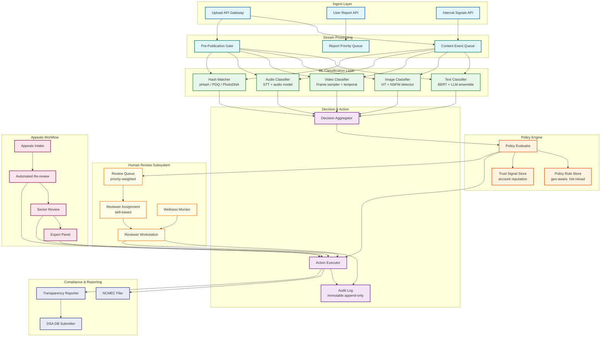
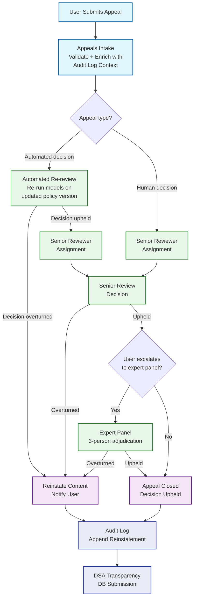
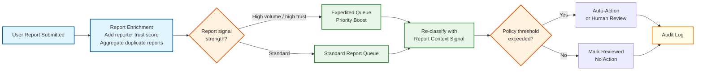

# 12.17 Content Moderation System — High-Level Design

## System Architecture



---

## Key Design Decisions

### Decision 1: Pre-Publication Gate for High-Risk Categories Only

Blocking all content pre-publication would add unacceptable latency to the user upload experience. Instead, the system applies synchronous screening only to designated high-risk categories where first-publication is itself the harm (CSAM, terrorist recruitment content, doxxing with threat signals). For all other content, items are published optimistically and scanned asynchronously. The pre-publication gate executes hash matching (fast, sub-50ms) and high-confidence model inference in the critical path; lower-confidence cases are published with a time-limited hold pending human review.

**Implication:** Reduces pre-publication latency to the minimum necessary while satisfying legal obligations for the most harmful content categories.

### Decision 2: Ensemble Classification with Confidence-Gated Routing

No single model is reliable across all content types and cultural contexts. The system runs an ensemble of specialized models (BERT-based text classifier, ViT-based image classifier, audio STT + downstream classifier) and a large language model for contextual edge cases. Each model outputs a calibrated confidence score. A three-zone routing policy routes items based on composite score:

- **Zone A (high confidence violation):** Auto-action immediately
- **Zone B (near-threshold / uncertain):** Route to human review queue
- **Zone C (high confidence benign):** Fast-path allow with sampling audit

**Implication:** Maximizes automation rate for clear cases while concentrating human attention on genuinely ambiguous items.

### Decision 3: Policy Engine as Hot-Reloadable Rule Layer, Separate from Models

Conflating policy (what is allowed) with classification (what is present) creates a coupling that makes it impossible to update community guidelines without retraining models. The policy engine is a separate runtime component that reads configurable rule sets (stored in a rule store), evaluates classified content against current policy, and produces enforcement actions. Rules can be updated and deployed without touching ML infrastructure. Geo-specific variants (EU vs. US vs. jurisdiction-specific) are first-class policy constructs, not code branches.

**Implication:** Policy updates can be rolled out in minutes rather than weeks, and compliance with new regulations does not require model retraining.

### Decision 4: Human Review Queue as a First-Class Infrastructure Component

The human review queue is not a fallback; it is a designed throughput component with its own capacity planning, priority scheduling, SLA monitoring, and wellness constraints. The queue uses a weighted priority scoring function that combines content severity tier, viral velocity (view rate of flagged content), account trust score, and regulatory SLA deadline proximity. Reviewers are matched to queue items by skill profile (language, content type specialization, CSAM clearance level).

**Implication:** Queue depth and SLA compliance are system metrics monitored on the same dashboards as ML inference latency and error rates.

### Decision 5: Immutable Audit Log as the Source of Truth for Appeals

All moderation decisions—automated and human—are written to an append-only, cryptographically chained audit log before the corresponding enforcement action is executed. This log is the authoritative record for appeals adjudication, regulatory audits, and model quality analysis. The appeals system reads from the audit log to reconstruct full decision context; reviewers cannot modify or delete log entries. This makes the system legally defensible and enables reproducible review of any past decision.

**Implication:** Adds a synchronous write-to-audit-log step in the enforcement path but eliminates entire categories of legal risk and enables trust in the appeals process.

---

## Data Flow: Content Upload to Enforcement

```mermaid
flowchart LR
    A[User Submits Content] --> B{Pre-publication\nhigh-risk check?}
    B -->|Yes| C[Synchronous\nHash Match + Fast Classifier]
    B -->|No| D[Publish & Enqueue\nfor async scan]
    C -->|Definite match| E[Block Upload\nNotify User]
    C -->|No match| D
    D --> F[ML Ensemble\nClassification]
    F --> G[Policy Engine\nEvaluation]
    G -->|Zone A: high confidence violation| H[Auto-Action\nRemove / Restrict]
    G -->|Zone B: near-threshold| I[Route to\nHuman Review Queue]
    G -->|Zone C: benign| J[Allow\nSampling Audit]
    H --> K[Audit Log\nWrite]
    I --> L[Reviewer\nDecision]
    L --> K
    K --> M[Notify User\nof Enforcement]
    M --> N{User Appeals?}
    N -->|Yes| O[Appeals Workflow]
    N -->|No| P[Case Closed]

    classDef action fill:#e8f5e9,stroke:#2e7d32,stroke-width:2px
    classDef decision fill:#fff3e0,stroke:#e65100,stroke-width:2px
    classDef terminal fill:#f3e5f5,stroke:#6a1b9a,stroke-width:2px
    classDef log fill:#fffde7,stroke:#f57f17,stroke-width:2px

    class C,F,G action
    class B,N decision
    class E,J,P terminal
    class K log
```



---

## Data Flow: Appeals Workflow



---

## Data Flow: User Report Processing



---

## Component Responsibilities Summary

| Component | Primary Responsibility | Key Interface |
|---|---|---|
| **Ingest Layer** | Normalize content items across types; emit events to stream | REST upload API; internal gRPC for service-to-service |
| **Content Event Queue** | Durable, ordered delivery of content items to classifiers; partitioned by content type | Topic-partitioned message queue |
| **ML Ensemble** | Parallel classification across modalities; return calibrated confidence scores | gRPC inference API; batch and single-item modes |
| **Hash Matcher** | Near-exact perceptual similarity lookup against known-bad databases | In-memory LSH index; updated via delta sync from hash DB |
| **Policy Engine** | Apply geo-specific, trust-aware rules to produce enforcement action | In-process rule evaluation; rule updates via config push |
| **Decision Aggregator** | Combine model scores + hash signals into unified severity score | Internal service call; no external API |
| **Action Executor** | Execute enforcement actions (remove, restrict, notify, report); write audit log | Async action queue; synchronous for pre-publication blocks |
| **Review Queue** | Priority-sorted queue of human review tasks; manages SLA timers | Internal queue API; reviewer workstation polls |
| **Reviewer Workstation** | Interface for human reviewers to view, decide, and submit moderation decisions | Web app; decisions posted to Action Executor |
| **Appeals Workflow** | Multi-tier appeals adjudication; SLA tracking; DSA submission | REST appeals API; internal review routing |
| **Transparency Reporter** | Aggregate moderation statistics; generate DSA-compliant reports | Batch job; exports to DSA Transparency Database |

---

## Architecture Decision Records

### ADR-001: Ensemble of Specialized Models Over Single Multimodal Model

| Field | Detail |
|---|---|
| **Status** | Accepted |
| **Context** | The system must classify content across multiple modalities (text, image, video, audio) and multiple harm categories (CSAM, hate speech, violence, spam, etc.). A single large multimodal model could handle all inputs, but specialized models offer better latency, lower cost, and independent update cycles. |
| **Decision** | Deploy an ensemble of specialized models — one per content type × harm category — with a score aggregation layer that fuses outputs into a unified decision. |
| **Consequences** | (1) Each model can be independently retrained and deployed without affecting others. (2) When a new policy changes the hate speech threshold, only the hate speech model's evaluation changes; CSAM detection is unaffected. (3) Operational complexity increases: many models to manage, version, and monitor. (4) Latency is bounded by the slowest model in the parallel ensemble, not accumulated sequentially. (5) The score aggregation layer becomes a critical component that must handle heterogeneous confidence scales. |
| **Rejected alternative** | Single multimodal LLM for all classification. This was rejected due to 10-100× higher inference cost, 5-10× higher latency, and the inability to update individual harm categories independently. |

### ADR-002: Policy Engine as Hot-Reloadable Rule Set Separate from Models

| Field | Detail |
|---|---|
| **Status** | Accepted |
| **Context** | Regulatory requirements change frequently (new DSA implementing regulations, new national laws). Baking policy into model training couples enforcement thresholds to the multi-week model retraining cycle. |
| **Decision** | Separate the classification layer ("what is present?") from the policy layer ("what action to take?"). The policy engine is a hot-reloadable rule store that can be updated in minutes without model changes. |
| **Consequences** | (1) New regulations become policy rule deployments, not model retraining tickets. (2) Geo-specific policies coexist in a single system. (3) Policy changes can be rolled out with staged canary deployment. (4) The policy engine must be high-performance (sub-10ms per evaluation) since it's in the critical path. |

### ADR-003: Fail-Restrictive Degradation Over Fail-Open

| Field | Detail |
|---|---|
| **Status** | Accepted |
| **Context** | When ML inference is unavailable, the system must choose between allowing content without ML classification (fail-open) or routing to human review (fail-restrictive). |
| **Decision** | Default to fail-restrictive: all unclassified content queues for human review during ML outages. Hash matching (CPU-based) continues independently. |
| **Consequences** | (1) No harmful content auto-allowed during outages. (2) Human review queue must be sized to absorb 100% of content volume for short outage windows. (3) Content publication latency increases during outages. (4) Reviewer surge pools must be activatable within minutes. |

### ADR-004: Immutable Audit Log as Source of Truth

| Field | Detail |
|---|---|
| **Status** | Accepted |
| **Context** | Regulatory audits (DSA, NetzDG) require complete chain-of-custody records for every moderation decision. The audit trail must be tamper-evident and retained for years. |
| **Decision** | Implement the audit log as a cryptographically-chained, append-only log replicated across 3 geographic regions with quorum writes. No delete or update operations are supported. |
| **Consequences** | (1) Every moderation decision is irrevocably recorded. (2) Tamper detection is automatic via hash chain verification. (3) Storage grows linearly (~1 TB/day) and requires long-term tiered storage. (4) The audit log becomes the system's backbone: source for disaster recovery, model quality measurement, training data generation, and compliance reporting. |

### ADR-005: Confidence Calibration via Platt Scaling per Model

| Field | Detail |
|---|---|
| **Status** | Accepted |
| **Context** | Raw model output scores from different architectures (BERT sigmoid, ViT softmax, XGBoost probability) are not calibrated. A 0.9 from one model does not carry the same meaning as 0.9 from another. The score aggregation layer must compare and combine heterogeneous scores. |
| **Decision** | Apply Platt scaling (logistic regression on model outputs) to calibrate each model's raw scores into well-calibrated probability estimates. Calibration is verified monthly using reliability diagrams. |
| **Consequences** | (1) Scores from different models are directly comparable. (2) The policy engine can use a single threshold framework across all model types. (3) Calibration must be maintained as data distributions shift. (4) ECE (Expected Calibration Error) becomes a key monitoring metric. (5) Recalibration is lightweight (no retraining needed; just re-fit the Platt scaling parameters). |

---

## Architecture Case Studies

### Case Study 1: Social Platform with DSA Compliance

A major social platform operating in the EU implemented a full DSA-compliant moderation system processing 5B content items/day. Key architectural lessons:

- **Transparency pipeline as first-class service:** Rather than retrofitting transparency reporting onto the existing moderation system, they built a dedicated transparency pipeline that consumes the audit log stream in real-time, generates DSA-format statement-of-reasons records, and batches submissions to the DSA Transparency Database every 15 minutes. This decoupled approach means the transparency pipeline can evolve with regulatory changes without modifying the core moderation pipeline.
- **Geo-scoped enforcement with content preservation:** When content is illegal in Germany (NetzDG) but legal in other jurisdictions, the system applies geo-restricted enforcement (invisible in Germany, visible elsewhere) rather than global removal. This requires the enforcement layer to understand per-region visibility rules, not just binary "visible/removed" states.
- **Appeals volume management:** With a ~30% appeal rate on enforced content and a DSA-mandated 72-hour first-response SLA, the appeals volume at scale exceeds human reviewer capacity. The automated re-review tier resolves 70% of appeals without human involvement. The key was implementing model-version-aware re-review: the re-review explicitly runs the current model version and policy version, not the original, and logs both for quality measurement.

### Case Study 2: Video-First Platform with CSAM Prioritization

A short-form video platform handling 800M video uploads/day built a tiered moderation architecture that allocates 60% of GPU capacity to video content:

- **Audio-first triage for video:** Before any frame classification, the platform extracts the audio track and runs speech-to-text classification. If the audio contains high-confidence violations (grooming language, terrorism incitement), the video skips expensive frame classification and goes directly to enforcement. This eliminates 15% of frame classification GPU cost.
- **CSAM content routing priority:** CSAM detection runs on a dedicated, highest-priority inference fleet. CSAM hash matching is synchronous and blocks publication. All other classification is asynchronous. This architectural separation ensures that CSAM detection latency is never degraded by competing workload.
- **Reviewer wellness at scale:** With 40,000 reviewers globally, the platform found that policy-based wellness (HR guidelines) was insufficient. They embedded wellness constraints directly into the assignment algorithm (described in Section 06). The result: reviewer turnover in the CSAM review team dropped by 35% in the first year, and reviewer accuracy improved by 8% (attributed to reduced fatigue-induced errors).

### Case Study 3: Marketplace Platform with Product Moderation

An e-commerce marketplace moderates 5M product listings/day for prohibited items, counterfeits, and misleading claims:

- **Product-category-specific models:** Instead of one general image classifier, the marketplace trained specialized models for each high-risk product category (pharmaceuticals, weapons, luxury brand counterfeits). Each model has its own precision/recall target and threshold, set by the compliance team. The weapon classifier has 99.5% recall with 85% precision (safety-critical), while the counterfeit detector has 95% precision with 80% recall (brand protection with lower false positive tolerance).
- **Seller trust as routing signal:** New sellers have a 100% review rate (every listing queued for human review). As sellers accumulate positive moderation history, their review rate drops via an exponential trust-growth curve. Veteran sellers (> 1,000 successful listings, 0 violations) reach a 2% sampled review rate. This dramatically reduces review volume while concentrating human effort on the highest-risk sellers.
- **Brand owner co-enforcement:** Brand owners submit reference images and product descriptions to the platform. The system trains per-brand authentication models that compare listing images to the brand's reference set. Suspected counterfeits are flagged and routed to brand-specialized reviewers. This model offloads the counterfeit detection problem from the platform's general classifier to specialized per-brand models maintained by the brand owners themselves.

---

## Cross-Cutting Architecture Concerns

### Content Lifecycle State Machine

Every content item in the moderation system follows a well-defined state machine. Understanding this lifecycle is essential because enforcement actions, appeals, and re-reviews all operate as state transitions:

```
                    ┌──────────────────────────────┐
                    │                              │
                    ▼                              │
SUBMITTED → HASH_CHECKED → CLASSIFYING → SCORED → POLICY_EVALUATED
                                                        │
                          ┌─────────────────────────────┤
                          │              │              │
                          ▼              ▼              ▼
                    AUTO_ALLOWED   QUEUED_FOR_REVIEW   AUTO_ACTIONED
                          │              │              │
                          │              ▼              │
                          │        UNDER_REVIEW         │
                          │         │        │          │
                          │         ▼        ▼          │
                          │    REVIEWED_OK  REVIEWED_VIOLATION
                          │         │              │
                          │         │              ▼
                          │         │        ENFORCEMENT_APPLIED
                          │         │              │
                          ▼         ▼              ▼
                    ┌──────────────────────────────────┐
                    │         APPEALABLE STATE         │
                    └──────────┬───────────────────────┘
                               │
                          ┌────┴────┐
                          ▼         ▼
                    APPEAL_FILED  NO_APPEAL
                          │
                    ┌─────┴──────┐
                    ▼            ▼
              APPEAL_UPHELD  APPEAL_OVERTURNED
                    │            │
                    ▼            ▼
              ENFORCEMENT    REINSTATED
              CONFIRMED
```

Key invariants enforced by the state machine:
- An item cannot be in UNDER_REVIEW by two reviewers simultaneously
- An APPEAL_OVERTURNED item must be REINSTATED before any new enforcement action
- Every state transition writes an audit log entry atomically
- The ENFORCEMENT_APPLIED → APPEALABLE window is bounded (DSA: 6 months)

### Data Flow Isolation Boundaries

The system enforces strict data flow boundaries between operational, compliance, and wellness data:

| Boundary | Data Flows In | Data Flows Out | Restriction |
|---|---|---|---|
| **Moderation pipeline** | Content items, model scores, policy rules | Enforcement actions, audit records | Cannot access reviewer wellness data |
| **Reviewer platform** | Assigned items, decision context | Decisions, review metadata | Cannot access other reviewers' items or performance data |
| **Compliance layer** | Audit log stream, enforcement records | DSA submissions, NCMEC reports, transparency reports | Read-only access to audit log; cannot trigger enforcement |
| **Wellness system** | Reviewer activity patterns, check-in responses | Intervention triggers, break enforcement | Cannot access moderation decisions or quality metrics |
| **Quality system** | Calibration results, kappa scores, override rates | Coaching referrals, retraining triggers | Cannot access reviewer wellness data |
| **ML training pipeline** | Labeled decisions, content embeddings | New model versions | Cannot access PII; only content features and labels |

These boundaries are enforced at the infrastructure level through separate service accounts, network policies, and encryption key hierarchies — not just application-level access checks.
