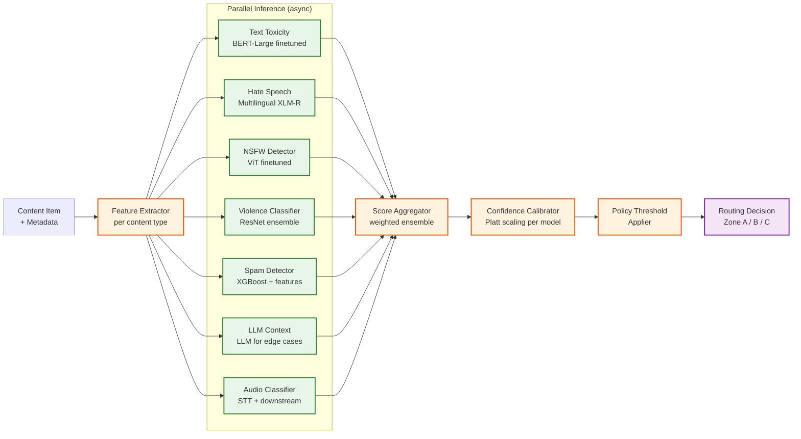

# 12.17 Content Moderation System — Deep Dives & Bottlenecks

## Deep Dive 1: ML Classification Pipeline

### Architecture Detail

The ML classification pipeline is not a single model but an orchestrated ensemble of specialized classifiers operating in parallel, with a coordinating layer that aggregates outputs into a unified decision signal. The pipeline is architected to meet two conflicting requirements: sub-500ms latency for the pre-publication path, and comprehensive coverage for the async post-publication path.



### Confidence Calibration

Raw model output scores are not probabilities—a sigmoid output of 0.9 from one model is not directly comparable to 0.9 from a different architecture. Each model undergoes Platt scaling calibration on a held-out validation set to produce calibrated probability estimates. Calibration is verified monthly using reliability diagrams; models showing ECE (Expected Calibration Error) > 5% trigger a recalibration run.

### LLM Fallback for Contextual Edge Cases

For items scoring in the uncertainty band (Zone B boundary ± 0.1), the pipeline optionally invokes an LLM-based contextual classifier implementing the "policy-as-prompt" pattern: the current policy text is provided as context, and the LLM is asked to assess whether the content violates the policy given its full context (including post title, user profile signals, and surrounding conversation thread). This approach is more expensive (100-200ms additional latency, higher inference cost) but dramatically reduces false positives on contextually sensitive content (satire, news reporting, academic discussion of harmful topics).

### Adversarial Obfuscation Normalization

Before text is passed to classifiers, a normalization layer applies a cascade of transformations:

1. **Unicode normalization**: Map homoglyphs (Cyrillic 'а' → Latin 'a', etc.) to canonical form
2. **Leetspeak expansion**: Expand common substitutions (3 → e, @ → a, ! → i)
3. **Whitespace stripping**: Remove zero-width characters, directional markers, invisible separators
4. **Repeated character collapse**: "haaaaaate" → "hate"
5. **Phonetic expansion** (language-specific): normalize phonetic respellings used to evade keyword filters

Each normalization step is logged so analysts can identify emerging evasion patterns. New normalization rules can be deployed without model retraining.

### Slowest part of the process: Video Frame Throughput

Video content is the dominant throughput Slowest part of the process. A 10-minute user video at standard resolution generates ~1,200 frames at 2fps sampling. At 50,000 video submissions/hour at peak, this is 60M frames/hour requiring classification. The mitigation strategy is three-layered:

1. **Keyframe selection**: Use scene-change detection to select representative keyframes rather than uniform temporal sampling; reduces frame count by 60-70% for most content
2. **Early-exit on high-confidence signals**: If the first 10 frames produce a Zone A signal, skip remaining frames and trigger immediate action
3. **Async batch processing**: Video frames are processed in GPU batches of 512; videos are not pre-publication blocked unless text metadata or audio produces a high-confidence signal first

---

## Deep Dive 2: Human Review Queue Architecture

### Priority Queue Implementation

The review queue is a distributed priority queue implemented on top of a sorted-set data structure. Each item in the queue carries a floating-point priority score (computed per Algorithm 2 in the low-level design). The queue is partitioned by:

- **Content type shard**: Text, Image, Video, Audio each get dedicated partition shards, matching reviewer skill profiles
- **Geo shard**: Content requiring language-specific review routes to geo-partitioned sub-queues (e.g., German-language queue for NetzDG compliance)
- **Severity tier shard**: CRITICAL items get a dedicated high-throughput shard to prevent starvation

Each partition maintains a SLA timer index that fires expiry alerts when items approach their deadline without being assigned. The alerting triggers automatic priority boost and emergency reviewer pool activation.

### SLA Management

```
SLA computation per content type and regulatory context:

  CSAM (confirmed): 1 hour (NCMEC reporting obligation)
  Terrorism / incitement: 1 hour (DSA illegal content)
  Hate speech (Germany): 24 hours (NetzDG)
  Standard violation (EU): 72 hours (DSA standard)
  Standard violation (global): 7 days (internal SLA)
  Low severity / spam: 14 days (internal SLA)

SLA timer management:
  - Each review_task has a sla_deadline timestamp set at creation
  - Timer service polls queue every 60 seconds for items within 20% of SLA window
  - At 80% elapsed: priority boost (×2)
  - At 95% elapsed: alert reviewer manager; pull from contractor overflow pool
  - At 100% elapsed: task marked EXPIRED; automatic escalation to senior reviewer;
                     SLA breach event logged for transparency reporting
```

### Inter-Rater Reliability and Quality Control

A quality control program continuously measures the consistency of reviewer decisions. Every reviewer receives a 5-10% injection of calibration items—content previously reviewed and given a gold-standard label by an expert panel. The system computes Cohen's kappa between each reviewer's decisions on calibration items and the gold standard.

- **Kappa > 0.80**: Reviewer is operating at high reliability; reduced calibration injection
- **Kappa 0.60-0.80**: Standard reliability; normal calibration rate
- **Kappa 0.40-0.60**: Marginal reliability; increased calibration injection + coaching referral
- **Kappa < 0.40**: Underperforming; work reviewed by senior reviewer; potential retraining

This program also detects systematic bias (e.g., a reviewer consistently more lenient with a particular content category) by analyzing decision patterns across content categories and reviewer cohort comparisons.

### Reviewer Workstation Performance as a Throughput Constraint

Reviewer throughput is directly proportional to workstation UX performance. Each 1-second increase in content load time reduces reviewer throughput by approximately 3-4 items/hour due to cognitive context switching. The workstation is built as a low-latency, single-page application that:

- Pre-fetches the next 3 content items while the reviewer is deciding on the current item
- Delivers pre-rendered decision context (model scores, policy match explanation, account history summary) alongside content
- Applies graduated blurring to harmful visual content (NSFW: blurred by default; CSAM: maximum blur with explicit reveal gesture required)
- Supports keyboard shortcuts for all decision actions (eliminating mouse travel)
- Auto-saves reviewer decisions to prevent loss if the session crashes

---

## Deep Dive 3: Policy Engine

### Rule Evaluation Model

The policy engine evaluates content against a precedence-ordered list of rules. Rules are stored in a versioned rule store (key-value store with watch semantics) and loaded into the engine's in-process memory with a TTL-based refresh. Hot-reload is achieved via a publish-subscribe mechanism: when a policy team member pushes a new rule version, all policy engine instances receive the update within 30 seconds without restart.

```
Rule evaluation order:
  1. Category-specific emergency rules (highest priority; e.g., active CSAM hash DB update)
  2. Geo-specific rules (EU DSA, German NetzDG, country-specific legal orders)
  3. Content-type rules (image-specific, video-specific)
  4. Account trust overrides (high-trust accounts get wider thresholds)
  5. Global baseline rules (lowest priority; catch-all)

First matching rule wins (unless rule is marked additive).
```

### Geo-Specific Policy Variants

As of 2025, platforms operating in the EU must comply with the Digital Services Act, while Germany maintains additional NetzDG obligations, and other jurisdictions impose their own requirements. The policy engine treats `geo_scope` as a first-class rule attribute. At evaluation time, the engine fetches the user's geo context (IP-derived country code, validated against account registration country for consistency) and applies the most restrictive applicable ruleset.

Critically, geo-specific rules must be applied to both content creator and content viewer contexts. Content that is legal in one jurisdiction but illegal in another may need to be geo-restricted rather than globally removed.

### Policy Rollout and Experimentation

New policies go through a staged rollout:

1. **Shadow mode**: New rule evaluates content but produces no enforcement action; outputs logged for impact analysis
2. **Canary (1% traffic)**: Rule is enforced for 1% of content; outcomes compared to shadow baseline
3. **Progressive rollout**: 10% → 25% → 50% → 100% with automatic rollback on anomaly detection
4. **Emergency rules**: Bypass staged rollout; applied globally within seconds (used for active CSAM campaigns or coordinated attack patterns)

### Slowest part of the process: Rule Proliferation

Mature platforms accumulate thousands of policy rules over years of regulatory and community guidelines evolution. A naive sequential evaluation against all rules becomes a Slowest part of the process at scale. Mitigation:

- Rules are compiled into a decision tree indexed by content type + category, enabling O(log n) evaluation rather than O(n)
- Redundant rules are flagged by the policy management tool and pruned on a quarterly basis
- Rule dependency analysis prevents circular conditions that could cause evaluation loops

---

## Deep Dive 4: Appeals Workflow Under DSA Compliance

### Regulatory Context

As of July 1, 2025, the EU DSA requires platforms to:
- Provide an internal complaint mechanism for all content moderation decisions
- Offer access to out-of-court dispute settlement bodies for EU users
- Submit machine-readable transparency reports including appeals outcome data
- Maintain a public DSA Transparency Database entry for every content removal

The appeals system must satisfy these requirements while handling hundreds of thousands of appeals per month at scale without consuming unlimited human reviewer capacity.

### Automated Re-Review as First-Line Appeals

The majority of appeals (estimated 70-80%) are resolved at the automated re-review tier without human involvement. The re-review runs the current classification pipeline (which may reflect updated model versions and updated policy rules since the original decision) and compares the new result to the original. Given the empirically observed reversal rate of ~30% in internal appeals and ~52% at out-of-court bodies (based on DSA reports from 2025), a well-calibrated automated re-review can significantly reduce human escalation volume.

Key design decisions at this tier:
- **Re-review is not an identical replay**: It uses the current policy version, which may have been updated since the original decision
- **Appeal context is injected**: The appellant's statement is passed to the LLM contextual classifier as additional context that was not available at the original classification time
- **Model confidence must exceed original**: If re-review produces the same action but with lower confidence, the item is escalated to human review rather than re-affirmed automatically

### Expert Panel Composition and Bias Prevention

The expert panel tier (tier 3) uses a three-person adjudication panel. Panel composition must avoid conflicts of interest:

- No panelist who reviewed the original item or any related item from the same account
- No panelist from the same cultural/geographic background as the content creator for geo-sensitive content
- Odd number of panelists to guarantee a majority decision

Panel decisions are recorded with full rationale and contribute to the gold-standard label pool for reviewer calibration. This creates a virtuous cycle: expert panel decisions improve reviewer quality, which reduces the volume of genuinely ambiguous items reaching the panel.

---

## Slowest part of the process Analysis Summary

| Slowest part of the process | Root Cause | Mitigation |
|---|---|---|
| Video frame throughput | High frame count × high video volume | Keyframe selection; early-exit; GPU batch processing |
| Pre-publication latency | Sequential dependency on multiple classifiers | Parallel async inference; hash-match fast-path; LLM only on uncertainty |
| Human review queue depth | Reviewer throughput capped by headcount | Priority queue ensures worst violations reviewed first; contractor surge pools |
| Policy update lag | Rule compilation and distribution | Hot-reload via pub-sub; emergency bypass path |
| Hash database consistency | Delta updates to distributed nodes | In-memory snapshots with 60-second sync; all nodes serve same version during sync |
| Appeal backlog at peak | Surge in user reports during viral events | Automated re-review handles 70-80%; human review reserved for genuine edge cases |
| Reviewer quality variance | Human inconsistency under fatigue | Calibration injection; inter-rater kappa monitoring; wellness-triggered breaks |

---

## Race Conditions and Correctness Challenges

### Concurrent Moderation Decisions

A content item can receive simultaneous moderation signals from: an initial automated scan, a user report that triggers a re-scan, and an account-level action that changes the account's trust score. If these signals race, two conflicting decisions could attempt to update the item's enforcement state.

**Resolution**: All enforcement actions are serialized through the Action Executor, which uses optimistic locking on the `content_item.enforcement_state` field. Only the most severe pending action is applied; subsequent less-severe actions are no-ops if the item is already in a more restrictive state.

### Appeal During Active Enforcement Change

If an enforcement action is being applied at the same moment an appeal overturn is being processed, the system must ensure the overturn takes precedence without leaving the content in an intermediate state.

**Resolution**: Appeals system writes the overturn decision to the audit log with a version counter. The action executor checks this counter before applying any enforcement change; if the audit log version is newer, the executor re-reads state before acting. The audit log's append-only semantics ensure the overturn is always visible to subsequent readers.

### Hash Database Update During Active Scan

If a new hash is added to the CSAM database while a batch scan is in progress, some items in the batch may be evaluated against the old database version.

**Resolution**: Hash scans tag their results with the database version used at scan time. Items scanned against an older version are flagged for re-scan after the update is applied. The re-scan is enqueued automatically as part of the hash DB update propagation process.

---

## Deep Dive 5: Coordinated Inauthentic Behavior (CIB) Detection

### Architecture Detail

Coordinated inauthentic behavior — networks of fake or compromised accounts acting together to amplify content, manipulate engagement, or overwhelm the moderation system with false reports — is fundamentally different from per-item content violations. CIB detection operates at the account network level, not the content level.

```
FUNCTION detectCoordinatedBehavior(window_events: List<ContentEvent>) -> List<CIBCluster>:

  // Step 1: Build temporal co-action graph
  // Nodes = accounts; edges = co-actions within a time window
  graph = new Graph()

  FOR EACH event IN window_events:
    graph.addNode(event.account_id)

  FOR EACH pair (event_a, event_b) WHERE:
    event_a.action_type == event_b.action_type AND
    abs(event_a.timestamp - event_b.timestamp) < 30_seconds AND
    event_a.target_content == event_b.target_content AND
    event_a.account_id != event_b.account_id:
      graph.addEdge(event_a.account_id, event_b.account_id, weight += 1)

  // Step 2: Identify dense subgraphs (suspicious clusters)
  clusters = graph.detectCommunities(min_edges_per_node = 3, min_cluster_size = 5)

  // Step 3: Score each cluster for inauthenticity signals
  cib_clusters = []
  FOR EACH cluster IN clusters:
    score = computeCIBScore(cluster)
    // CIB score factors:
    //   - Account age distribution (many new accounts = higher score)
    //   - IP/device overlap (shared infrastructure = higher score)
    //   - Temporal synchrony (suspiciously precise timing = higher score)
    //   - Content similarity (near-identical posts = higher score)
    //   - Historical trust scores of member accounts

    IF score > CIB_THRESHOLD:
      cib_clusters.append(CIBCluster(accounts = cluster, score = score))

  RETURN cib_clusters
```

CIB detection runs as a background batch job every 5 minutes on a sliding window of recent activity. Detected clusters are forwarded to the Trust & Safety team for investigation and potential network-level enforcement (suspending the entire cluster rather than individual items).

### Report Bombing Defense

A specific CIB pattern is *report bombing*: coordinated false user reports targeting legitimate content or accounts to trigger automated moderation. Defense:

1. **Reporter credibility scoring**: Each reporter has a cumulative credibility score based on historical accuracy (reports that led to actual violations vs. false reports). Reports from low-credibility reporters receive lower priority.
2. **Report volume anomaly detection**: If a single content item receives > 100 reports within 5 minutes, this triggers a CIB check rather than treating each report independently.
3. **Reporter network analysis**: If the reporting accounts cluster tightly in the co-action graph, the reports are de-duplicated and treated as a single signal from the cluster.

---

## Edge Cases

### Edge Case (Unusual or extreme situation) 1: Cultural Context Misclassification

A Buddhist swastika symbol (a sacred religious icon) is classified as a hate symbol by the image classifier. The model cannot distinguish between the Nazi swastika and the Buddhist swastika based on visual features alone.

**Solution:** Context injection. The policy engine receives both the model classification score AND contextual signals: the poster's account profile (religion/culture settings if voluntarily provided), the posting context (a Buddhist temple photo gallery vs. a political forum), and the geographic context. The policy engine has a rule that lowers the enforcement threshold for swastika-like images when cultural context suggests religious use, routing to human review instead of auto-removal.

### Edge Case (Unusual or extreme situation) 2: News Reporting of Violence

A legitimate news organization posts graphic images of a conflict zone. The violence classifier correctly identifies graphic violence but should not remove the content because it has journalistic value.

**Solution:** Account trust tiers. Verified journalist and news organization accounts have elevated trust scores that raise the auto-action threshold for violence and graphic content categories. Their content is flagged but routed to a dedicated "news review" queue staffed by reviewers trained in editorial judgment, not auto-removed.

### Edge Case (Unusual or extreme situation) 3: Satire and Parody Misclassified as Hate Speech

A comedian posts a satirical video mocking extremism. The toxicity classifier flags it as hate speech because the satire uses the vocabulary of the group being satirized.

**Solution:** The LLM contextual classifier is invoked for all hate speech classifications in the uncertainty band. The LLM receives the full context (including account history showing comedy content, audience engagement patterns showing laughter/positive reactions, and the video's satirical framing) and produces a "satire/parody" probability. If the satire probability exceeds 80%, the item is classified as "contextually non-violating" and allowed through with an audit note.

### Edge Case (Unusual or extreme situation) 4: Emergent Harm Category Without Training Data

A new form of harmful content emerges (e.g., AI-generated CSAM, or a new type of drug trafficking coded language) that the current models have never seen.

**Solution:** The LLM-based classifier serves as a zero-shot safety net. Policy administrators write a natural-language description of the new harm category and add it to the LLM policy-as-prompt context. The LLM can classify novel content against this description without any training data. All classifications in this new category route to human review initially. As human reviewers label content, these labels feed the rapid training pipeline, and a specialized model for the new category can be deployed within 2-4 weeks.

---

## Real-World Case Studies

### Case Study 1: Large Social Platform — 2B DAU, 10B Content Items/Day

**Context:** A global social platform processes 10B content items/day (posts, comments, stories, messages) across 100+ languages with regulatory obligations in 50+ jurisdictions.

**Key architectural decisions:**
- **Regional classification stacks:** Separate ML inference fleets per major region (Americas, Europe, APAC), each with language-specific model variants. European content is processed in EU regions for GDPR compliance. Models are trained centrally but served regionally.
- **Two-tier review queue:** Tier 1 reviewers handle high-volume, lower-complexity items (spam, clearly benign, clearly violating). Tier 2 reviewers handle contextually ambiguous items, appeals, and CSAM. This bifurcation improves throughput by 3× for Tier 1 while preserving quality for Tier 2.
- **Real-time viral velocity gating:** Content reaching > 10K views/minute is shadow-restricted pending review, limiting viral spread of potentially harmful content before classification is complete.

**Lesson:** At 10B items/day, you cannot classify everything in real-time. The system must prioritize what gets fast-path classification (high-risk content types, viral content, content from untrusted accounts) and accept delayed classification for low-risk items.

### Case Study 2: Video-First Platform — Frame Throughput Dominance

**Context:** A video-first social platform where 80% of content is video (vs. 20% on text-first platforms). Average video length is 45 seconds. 500M videos uploaded/day.

**Key architectural decisions:**
- **Audio-first triage:** Before any frame classification, extract audio track and run speech-to-text. If the transcript contains high-confidence violations, skip expensive frame classification and route directly to enforcement. This eliminates 15% of video classification GPU cost.
- **Thumbnail-only fast path:** For pre-publication screening, classify only the first frame and the user-selected thumbnail. Full frame classification runs asynchronously post-publication. This reduces pre-publication latency from 3s to 200ms for video content.
- **Scene-change-based keyframe selection:** Instead of uniform temporal sampling (2fps), detect scene transitions and sample 1 frame per scene. Reduces frame count by 65% with < 1% recall loss on violation detection.

**Lesson:** Video platforms must solve frame throughput as their primary architectural challenge. The key insight is that most video violations are detectable from a small subset of frames, and audio analysis provides high-signal pre-filtering that reduces GPU requirements significantly.

### Case Study 3: Marketplace Platform — Product Listing Moderation

**Context:** An e-commerce marketplace moderates product listings for prohibited items (counterfeit goods, weapons, regulated substances, misleading health claims). 5M new listings/day.

**Key architectural decisions:**
- **Product-specific classifiers:** Instead of general image/text classifiers, the platform uses product-category-specific models (pharmaceutical classifier, weapon classifier, counterfeit brand detector). Each model is trained on domain-specific data and has domain-specific policy thresholds.
- **Seller trust scoring as primary signal:** New sellers have all listings queued for human review (100% review rate). As sellers accumulate positive moderation history, their review rate drops (veteran sellers: 2% sampled review). This dramatically reduces review volume while concentrating human effort on the highest-risk sellers.
- **Brand owner partnership program:** Brand owners submit reference images and descriptions of their genuine products. The system trains a per-brand authentication model that detects counterfeit listings by comparing listing images to the brand's reference set. False positives are reviewed by brand-specialized reviewers.

---

## Deep Dive 6: Model Retraining and Deployment Pipeline

### The Continuous Improvement Loop

Content moderation models degrade over time as adversarial tactics evolve, cultural norms shift, and new harm categories emerge. The retraining pipeline is not a periodic batch process but a continuous feedback loop that converts human reviewer decisions into model improvements.

### Data Labeling Pipeline

Human reviewer decisions generate labeled training data as a byproduct of operational moderation:

```
Label sourcing hierarchy (by quality, descending):

1. Expert panel decisions (gold standard)
   - 3-person adjudication panels; used for calibration items
   - ~500 new labels/day; highest confidence
   - Used for evaluation sets, NOT primary training (too small)

2. High-kappa reviewer decisions (silver standard)
   - Decisions from reviewers with Cohen's kappa > 0.80
   - ~50,000 new labels/day; high confidence
   - Primary training data source

3. Consensus decisions (bronze standard)
   - Items where ≥ 3 reviewers agreed independently
   - Used for bulk training; weighted lower than silver

4. Automated decisions with high confidence (copper standard)
   - Zone A auto-actions where model confidence > 0.99
   - Used carefully — risk of reinforcing model biases
   - Weight: 0.3× compared to silver labels
```

### Label Debiasing

Training on operational labels introduces systematic bias: the model only sees items that were flagged for review (selection bias), and reviewer decisions may reflect cultural biases (annotator bias). Debiasing measures:

- **Negative sampling**: Randomly sample Zone C items (auto-allowed) and include in training as negative examples at a 20:1 ratio
- **Cross-cultural validation**: Hold out 10% of labels from each geographic reviewer pool and test against labels from other pools; flag categories where cross-pool agreement is low
- **Temporal stratification**: Ensure training sets include items from different time periods to prevent temporal bias (models overfitting to a particular adversarial wave)

### Retraining Triggers

```
Trigger 1: Scheduled retraining
  - Weekly for high-drift categories (hate speech, spam)
  - Monthly for stable categories (CSAM hash matching is hash-based, not model-based)

Trigger 2: Drift-detected retraining
  - KL divergence of score distribution > threshold
  - Precision or recall drops > 3% on weekly calibration audit
  - New normalization rules added (model should adapt to post-normalized input)

Trigger 3: Policy-triggered retraining
  - New policy category added (e.g., deepfake detection)
  - Policy threshold change that materially alters the decision boundary
  - New jurisdiction requires different classification granularity

Trigger 4: Adversarial-triggered retraining
  - New evasion technique identified (e.g., novel Unicode abuse)
  - Cross-platform signal from GIFCT or Technology Coalition
  - Sustained recall drop in a specific category
```

### Canary Deployment for New Models

New model versions are deployed through a staged canary process:

| Phase | Traffic | Duration | Rollback Trigger |
|---|---|---|---|
| Shadow mode | 0% (inference only, no action) | 48 hours | Precision < target - 5% on shadow eval |
| Canary | 1% of traffic | 24 hours | False positive rate > 1.2× baseline |
| Progressive | 10% → 25% → 50% | 6 hours each | Any precision/recall regression |
| Full rollout | 100% | — | — |

During canary deployment, the system runs both the existing and new model in parallel for the canary traffic slice. Decisions are made by the existing model; the new model's outputs are logged for comparison. If the new model's decisions would have produced worse outcomes (measured by expert panel review of a sample), the canary is aborted.

### Model Versioning and Rollback

Every model version is tagged with:
- Training data snapshot ID (immutable reference to the exact training set)
- Policy version it was trained against
- Calibration parameters (Platt scaling coefficients)
- Evaluation metrics on the standardized test set

Rollback to a previous model version can be executed within 5 minutes (the previous version remains loaded in warm standby on the GPU fleet). The rollback triggers automatic recalibration of confidence thresholds against the previous model's score distribution.

---

## Performance Optimization Patterns

### Pattern 1: Tiered Content Complexity Routing

Not all content items require the full inference pipeline. A lightweight pre-classifier (running on CPU, not GPU) triages items into complexity tiers:

```
Tier 1 (trivial): Short text (<50 chars), no media
  → Keyword blocklist check + hash check only
  → Bypasses GPU inference entirely
  → ~30% of all content items

Tier 2 (standard): Text or single image
  → Standard BERT + ViT inference
  → ~50% of all content items

Tier 3 (complex): Multi-modal (text + image + video), or high-risk account
  → Full ensemble including LLM contextual classifier
  → ~15% of all content items

Tier 4 (heavy): Long-form video (>5 min), live stream segments
  → Dedicated video GPU fleet with extended processing window
  → ~5% of all content items
```

This tiering reduces GPU utilization by ~40% compared to routing everything through the full pipeline.

### Pattern 2: Embedding Cache for Repeat Content

Platforms often see the same content shared multiple times (reposts, forwards, viral content). An embedding cache stores the feature embedding of recently processed content:

- Cache key: content hash (SHA-256 for exact match) or perceptual hash (for near-duplicates)
- Cache value: all model scores from the previous evaluation
- Cache TTL: 24 hours (policy rules may change; stale scores must expire)
- Cache hit rate: ~15-20% on typical social platforms (higher during viral events)

On a cache hit, the system skips GPU inference entirely and applies the cached scores to the current policy rules. This is safe because model scores are content-intrinsic; only policy rules (which are always evaluated fresh) determine the enforcement action.

### Pattern 3: Adaptive Sampling for Low-Risk Content

For content from accounts with established trust scores (>1 year history, no prior violations, high trust tier), the system applies adaptive sampling:

- Only 10% of content from high-trust accounts undergoes full ML inference
- The remaining 90% receives hash-matching only (catches known-bad content but skips ML classification)
- If any sampled item from a high-trust account triggers a violation, the account's sampling rate increases to 100% for the next 7 days
- This reduces GPU inference volume by ~25% at the cost of a detection lag for violations from high-trust accounts that turn adversarial
