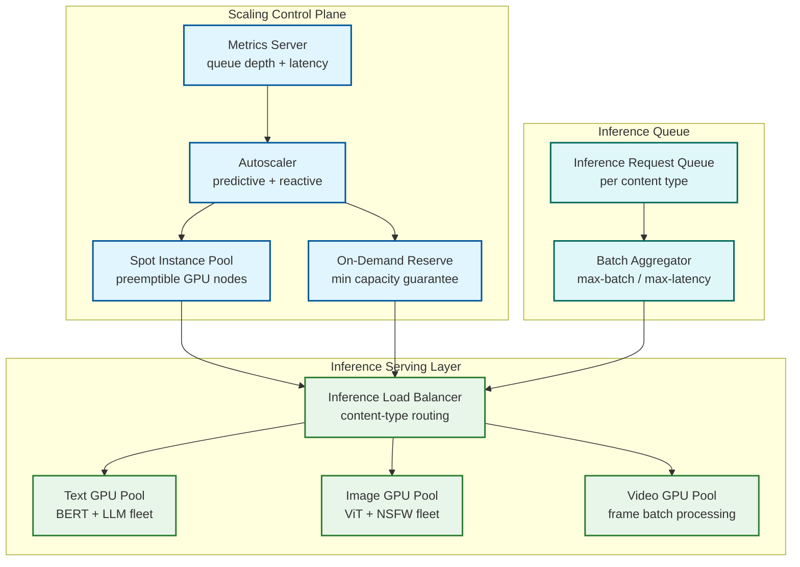

# 12.17 Content Moderation System — Scalability & Reliability

## GPU Inference Fleet Scaling

### Scaling Architecture

The ML inference layer is the most resource-intensive component of the moderation system. GPU instances are expensive and have non-trivial spin-up times (2-5 minutes for a new node to join the inference pool), making reactive autoscaling insufficient for sudden traffic spikes.



### Predictive vs. Reactive Scaling

Reactive autoscaling alone (scale up when queue depth or latency SLO is breached) is insufficient because new GPU nodes take 2-5 minutes to warm up, during which backlog accumulates and latency SLOs are already breached. The solution uses a two-layer scaling strategy:

**Predictive scaling (primary)**: A forecasting model trained on historical traffic patterns predicts content ingest volume 15 minutes ahead. The autoscaler provisions nodes in advance of predicted demand. Historical data shows strong diurnal and weekly patterns, enabling accurate 15-minute forecasts with <15% MAPE.

**Reactive scaling (secondary)**: Monitors p95 inference queue wait time and GPU utilization. If reactive signals exceed thresholds (queue wait > 200ms, GPU utilization > 85%), additional nodes are spun up immediately from a pre-warmed warm pool (nodes in standby state, fully initialized but not serving traffic, costing ~30% of active node cost).

**Floor capacity**: A minimum GPU reservation ensures baseline coverage at all hours, preventing cold-start delays during off-peak → on-peak transitions.

### Batch Optimization

GPU inference is substantially more efficient in batches. The batch aggregator collects inference requests up to a maximum batch size (typically 256 items for text, 64 for images) or a maximum wait time (50ms), whichever comes first. This creates a deliberate trade-off between throughput (larger batches) and latency (longer wait). For pre-publication items, the wait time ceiling is reduced to 10ms, prioritizing latency over throughput.

### Model Serving Versioning

Multiple model versions can be active simultaneously during rolling upgrades. The inference load balancer routes a configurable percentage of traffic to each model version (canary deployment). Model versions are tagged with the policy version they were trained against, enabling correlation between model updates and policy changes in observability tooling.

---

## Queue Partitioning and Backpressure

### Content-Type Partitioning

The content event queue is partitioned along three dimensions to prevent resource contention and enable independent scaling:

| Partition | Content | Consumers | Key Concern |
|---|---|---|---|
| `pre-pub-critical` | Pre-publication high-risk content | Dedicated fast-path consumers | Sub-500ms end-to-end |
| `text-async` | Async text classification | Text GPU fleet | Throughput-optimized |
| `image-async` | Async image classification | Image GPU fleet | GPU memory-optimized |
| `video-async` | Video processing pipeline | Video GPU fleet | Long-tail item sizes |
| `reports` | User-reported items | Priority re-scan consumers | High priority, moderate volume |
| `hash-updates` | Hash DB delta sync | Hash matching nodes | Consistency-critical |

### Backpressure Propagation

When the inference fleet is saturated (GPU utilization > 90%), the system applies backpressure to the ingest layer to prevent unbounded queue growth:

1. **Tier 1 (queue depth > 500K)**: Slow non-critical ingest paths (rate-limit async scan enqueuing for low-trust accounts)
2. **Tier 2 (queue depth > 2M)**: Pause async scan for low-severity content categories; only process CRITICAL and HIGH severity items
3. **Tier 3 (queue depth > 5M)**: Invoke degraded mode — see Graceful Degradation below

Queue depth thresholds are calibrated against worst-case reviewer throughput to ensure the review queue does not grow faster than it can be drained.

---

## Human Review Queue: Reviewer Pool Elasticity

### Staffing Model

The reviewer workforce consists of three tiers with different mobilization speeds:

| Tier | Type | Capacity | Mobilization Time | Cost |
|---|---|---|---|---|
| Core | Full-time trained reviewers | 40% of daily capacity | Already active | Highest/fixed |
| Flex | Part-time trained reviewers | 30% of daily capacity | 1-2 hours | Medium |
| Surge | Contractor overflow pool | 30% of daily capacity | 4-24 hours | Variable |

Surge pool activation is triggered by queue depth projections: if the queue is projected to exceed its SLA capacity within the next 4 hours based on current ingest rate and reviewer throughput, surge pool activation begins. The 4-hour lead time accounts for contractor ramp-up time.

### Geographic Distribution

Reviewer pools are geographically distributed to serve geo-specific queue partitions. Each geographic pool has:
- Language-certified reviewers for local content moderation
- Regulatory knowledge certification for applicable local laws (NetzDG, DSA obligations)
- Overlap hours with adjacent geographic pools to handle shift transitions

Queue routing ensures content requiring language-specific review (e.g., German-language hate speech for NetzDG compliance) is only routed to reviewers with the appropriate language certification.

---

## Graceful Degradation During Content Surges

### Degradation Mode Hierarchy

The system is designed to fail in a direction that minimizes harm: when capacity is constrained, it is better to queue for review than to auto-allow potentially harmful content.

```
Level 0 (Normal): Full pipeline; all content types scanned; hash + ML + human review
Level 1 (Moderate surge):
  - Deprioritize video frame classification (use audio/text signals only for video)
  - Increase Zone A threshold slightly to reduce human review routing rate
  - Activate flex reviewer tier
Level 2 (High surge):
  - Video classification: hash match + audio transcript only; no frame classification
  - Pause low-priority content categories (spam, low-NSFW)
  - Activate surge contractor pool
  - Alert engineering on-call
Level 3 (Severe surge / ML outage):
  - All unconfirmed items (not hash-matched) route to human review
  - Pre-publication gate: hash match only; LLM disabled
  - Circuit breaker on LLM inference (high cost, high latency)
  - Page incident commander
Level 4 (Critical: human review queue overflowing):
  - Temporary upload restriction for low-trust accounts
  - Emergency contractor pool expansion (cross-region)
  - Executive notification
  - Publish platform status update
```

### ML Inference Outage Handling

When the ML inference fleet becomes unavailable (deployment failure, GPU driver crash, network partition):

1. **Circuit breaker**: Inference clients detect consecutive failures and open the circuit; fallback logic activates immediately (no waiting for timeout)
2. **Fallback**: Hash matching continues (CPU-based; unaffected by GPU outage). All content not cleared by hash matching routes directly to human review
3. **Queue depth monitoring**: Human review queue depth is watched closely during ML outage; if depth exceeds surge thresholds, contractor pools are activated
4. **Recovery**: When ML inference recovers, items queued during the outage are re-processed; human review decisions made during the outage are reconciled against ML decisions (if they conflict, human decision stands)

---

## Multi-Region Deployment and Data Sovereignty

### Regional Architecture

The moderation system is deployed in multiple geographic regions to satisfy data sovereignty requirements (EU GDPR, regional data residency laws) and to reduce latency for geo-distributed reviewer workforces.

Each region is a full stack:
- Regional ingest endpoints
- Regional ML inference fleet
- Regional review queue and reviewer workstations
- Regional policy engine (synchronized policy from global policy store)
- Regional audit log (synchronized to global log for compliance)

Content is processed in the region where the user is located where legally required. Cross-region content sharing (e.g., a hash DB update from NCMEC applies globally) uses encrypted, replicated channels with provenance tracking.

### Cross-Region Reviewer Failover

When a regional reviewer pool experiences an outage (workstation backend failure, network partition, or natural disaster affecting an office), the system must continue processing safety-critical items without violating data sovereignty:

```
Cross-region reviewer failover protocol:

Step 1: Detect regional reviewer unavailability
  - Reviewer heartbeat loss > 50% of regional pool for > 5 minutes
  - OR reviewer platform health check fails for entire region

Step 2: Classify items by data sovereignty constraint
  FOR EACH queued item IN affected_region.queue:
    IF item.data_sovereignty == STRICT:
      // Cannot leave region — hold in queue, extend SLA timer
      item.sla_extension = 4_hours
      item.status = WAITING_REGIONAL_RECOVERY
    ELSE IF item.severity == CRITICAL OR item.category IN [CSAM, TERRORISM]:
      // Safety override — route to nearest qualified reviewer pool
      target_region = findNearestQualifiedPool(item.language, item.category)
      transfer(item, target_region, encrypted=true, audit_logged=true)
    ELSE:
      // Standard items — hold with extended SLA
      item.sla_extension = min(8_hours, item.remaining_sla × 0.5)

Step 3: Monitor recovery
  - When regional pool recovers, drain transferred items back
  - Reconcile any decisions made by cross-region reviewers
  - Audit log: mark all cross-region decisions with provenance
```

The failover protocol distinguishes between items with strict data sovereignty requirements (which must remain in-region even at the cost of extended SLA) and safety-critical items where the harm of delayed review outweighs the data residency concern. This is a deliberate policy trade-off documented in the system's compliance framework.

### Network Partition Handling

When a network partition isolates a regional deployment from the global control plane:

**Split-brain prevention**: Each region maintains a local copy of the policy engine rules and hash database. During a partition, the region continues operating with its last-known-good state:
- Policy rules: stale but functional (rules change infrequently; median update frequency is weekly)
- Hash database: may miss hashes added during the partition window (60-second propagation lag becomes unbounded during partition)
- Audit log: writes locally; replicates to global log on partition heal

**Partition detection**: Heartbeat-based detection with a 30-second timeout. If the global control plane is unreachable for > 30 seconds, the region enters autonomous mode.

**Partition heal reconciliation**:
1. Hash DB: delta sync from global to regional; replay missed hash additions; retroactively re-scan content processed during partition window against new hashes
2. Policy rules: check for version mismatch; if rules changed during partition, re-evaluate items processed under stale rules (only for rules marked `retroactive_enforcement = true`)
3. Audit log: merge local entries into global log with partition markers; verify cryptographic chain integrity across the merge boundary
4. Moderation decisions: decisions made during partition are final (no retroactive overturns for items already actioned); items queued but not yet actioned are re-evaluated under current rules

### Hash Database Global Consistency

The known-bad hash databases (CSAM, terrorist, copyright) must be globally consistent across all regional deployments. A dedicated hash synchronization service pushes delta updates to all regions within 60 seconds of a new hash being added. During the propagation window, regions that have not yet received the update may miss matches for newly added hashes—acceptable given that CSAM reporting obligations are measured in hours, not seconds.

---

## Reliability Patterns

### Idempotency in Enforcement Actions

Every enforcement action (remove, restrict, suspend) is idempotent. Duplicate action requests for the same content item and action type are no-ops, returning the current state without side effects. This is implemented via an idempotency key (item_id + action_type + decision_id) that is checked before executing any enforcement change.

### Audit Log Durability

The audit log is the system's most durability-critical component. It is implemented as an append-only log replicated synchronously across three geographically distinct nodes (quorum write: requires 2/3 nodes to acknowledge before the write is confirmed). The log uses cryptographic chaining (each entry includes the hash of the previous entry) to provide tamper evidence. Log compaction is never performed; entries are retained indefinitely for legal and regulatory purposes.

### Saga Pattern for Complex Multi-Step Enforcement

Some enforcement actions involve multiple steps (e.g., account termination requires: remove all content, revoke authentication tokens, notify user, file regulatory report, archive account data). These are implemented as sagas with explicit compensation actions for each step. If any step fails, compensating actions roll back completed steps to a consistent state. The saga state machine is persisted in the audit log, enabling replay from any point in case of infrastructure failure.

---

## Chaos Engineering Experiments

| Experiment | Target | Expected Behavior | Verification |
|---|---|---|---|
| GPU fleet 50% failure | ML inference layer | Remaining fleet handles load; queue depth increases; backpressure triggers warm pool activation | Pre-publication p99 stays < 1s; no items auto-allowed |
| Hash DB node failure | Hash matching service | Surviving replicas serve reads; write propagation shifts to remaining nodes | Match rate unchanged; propagation lag < 120s |
| Review queue partition failure | Human review system | Items re-routed to surviving partitions; SLA timers preserved | No SLA breaches; items do not lose priority |
| Policy engine hot-reload failure | Policy enforcement | Previous policy version remains active; new version rolls back | All content evaluated against a valid policy version |
| Audit log write failure | Compliance layer | Circuit breaker pauses enforcement (fail-safe); items queue for retry | No enforcement actions executed without audit record |
| Network partition between regions | Multi-region deployment | Each region operates independently; hash DB may lag; reconciles on heal | No cross-region data loss; eventual consistency < 5 min |
| Reviewer workstation network failure | Human review UI | Auto-save preserves in-progress decisions; reconnect resumes session | No reviewer work lost; partial decisions recoverable |

---

## Capacity Planning Formulas

### GPU Fleet Sizing

```
Text GPU count = (text_items_per_sec / throughput_per_gpu_text) × headroom_factor
  = (35,000 × 0.8 / 10,000) × 3 = ~8.4 → 12 GPUs (text)

Image GPU count = (image_items_per_sec / throughput_per_gpu_image) × headroom_factor
  = (7,000 / 2,000) × 3 = ~10.5 → 12 GPUs (image)

Video GPU count = (video_items_per_sec × frames_per_video / throughput_per_gpu_image) × headroom_factor
  = (700 × 120 / 2,000) × 3 = ~126 → ceiling with keyframe optimization (÷3) → 42 GPUs

LLM GPU count = (zone_b_items_per_sec × llm_invocation_rate / throughput_per_gpu_llm) × headroom
  = (700 × 0.1 / 50) × 2 = ~2.8 → 8 GPUs (for latency headroom)

Total GPU fleet = 12 + 12 + 42 + 8 = ~74 GPUs minimum; ~200 with redundancy and burst
```

### Reviewer Headcount

```
Daily items requiring review = daily_content × routing_rate
  = 1B × 2% = 20M items/day

Reviewer throughput (blended) = 0.8 × 120 items/hr (text) + 0.2 × 40 items/hr (video)
  = 96 + 8 = 104 items/hr average

Effective reviewer hours/day = 8 hours × 0.75 (breaks, wellness, admin)
  = 6 effective hours/reviewer/day

Items per reviewer per day = 104 × 6 = 624 items

Reviewers needed = 20M / 624 = ~32,000 reviewers at peak

With 3 tiers: Core 40% (12,800) + Flex 30% (9,600) + Surge 30% (9,600)
```

### Queue Depth Projection

```
Queue steady state = ingest_rate × avg_wait_time
At baseline: 700 items/sec × 300s avg wait = 210,000 items

At 3× peak: 2,100 items/sec × 600s avg wait (SLA pressure) = 1.26M items

Queue capacity must support 5M items (headroom for 4× sustained peak)
```

---

## Disaster Recovery Runbooks

### Runbook 1: Complete ML Inference Fleet Failure

**Trigger:** All GPU inference nodes unavailable (deployment failure, cloud GPU capacity exhaustion)

```
Step 1: Immediate failover (0-5 minutes)
  - Circuit breakers open on all inference clients
  - Hash matching continues (CPU-based, unaffected)
  - All non-hash-matched content routes directly to human review queue

Step 2: Triage (5-30 minutes)
  - Activate surge reviewer pool
  - Enable degraded mode Level 3 (hash match + human review only)
  - Pre-publication gate: allow content that passes hash match; queue rest
  - Notify platform status: "Moderation processing delayed"

Step 3: Recovery options
  IF GPU fleet recoverable within 30 min:
    - Wait for recovery; replay queued items through ML pipeline
  ELSE:
    - Provision GPU instances in alternate region/cloud
    - Model artifacts stored in multi-region object storage (always available)
    - New fleet operational within 15-30 min of instance availability

Step 4: Post-recovery reconciliation
  - Items reviewed by humans during outage: compare with ML retroactive scan
  - Items where human and ML disagree: flag for quality review
  - Audit log: mark all items processed during outage with "degraded_mode" tag
```

### Runbook 2: Reviewer Platform Outage

**Trigger:** Reviewer workstation backend unavailable; reviewers cannot access queue

```
Step 1: Assess impact (0-5 minutes)
  - Determine which reviewer pools are affected (all or regional)
  - Check SLA timers: any CRITICAL or NetzDG items approaching deadline?

Step 2: Mitigate SLA risk (5-15 minutes)
  - For items within 80% of SLA deadline with no human review:
    escalate to automated re-review with current ML pipeline
  - For CSAM items: automated hash-based decisions stand (remove)
  - For borderline items: apply conservative enforcement (restrict, not remove)

Step 3: Restore reviewer access
  - Failover to backup reviewer workstation backend
  - Restore reviewer session state from auto-save
  - Resume normal queue processing

Step 4: Post-incident
  - Calculate SLA impact: how many items breached SLA during outage?
  - Reconcile conservative automated decisions: human review pending items
  - Update transparency report with outage impact
```

### Runbook 3: Hash Database Corruption

**Trigger:** Hash match rate drops to near-zero OR false positive rate spikes

```
Step 1: Detect and isolate (0-5 minutes)
  - Compare hash match rate against 7-day baseline
  - Check hash DB version consistency across nodes
  - If corruption suspected: freeze hash DB updates

Step 2: Diagnose
  IF match rate dropped:
    - Hash DB may have been truncated or overwritten
    - Check most recent hash sync event for anomalies
    - Verify hash DB replica integrity via checksum comparison
  IF false positive rate spiked:
    - Bad hashes may have been injected
    - Identify the source of recent hash additions
    - Cross-reference with upstream hash providers (NCMEC, GIFCT)

Step 3: Restore
  - Restore hash DB from last known-good snapshot
  - Replay delta updates from upstream providers since snapshot
  - Verify match rate returns to baseline on test content set
  - Resume hash DB synchronization

Step 4: Impact assessment
  - Calculate window of missed matches (for corruption)
  - Calculate false positives generated (for bad hash injection)
  - Retroactively scan content from the corruption window
```

---

## Auto-Scaling Decision Timeline

Content surges require coordinated scaling across multiple subsystems with different activation speeds. The system uses a unified scaling coordinator that orchestrates actions across a defined timeline:

```
T+0 (surge detected):
  Signal: Ingest rate > 2× baseline for > 2 minutes
  Action: Begin predictive GPU warm pool activation
  Action: Notify queue monitoring system to increase polling frequency

T+2 min:
  Signal: GPU warm pool nodes joining inference fleet
  Action: Increase batch sizes to maximize GPU throughput
  Action: Pre-stage flex reviewer notifications

T+5 min:
  Signal: Sustained surge confirmed (not transient spike)
  Action: Activate flex reviewer tier (1-2 hour mobilization begins)
  Action: Expand queue partition capacity
  Action: Reduce calibration injection rate (10% → 5%)

T+15 min:
  Signal: Queue depth > 500K OR GPU utilization > 85% sustained
  Action: Enter Level 1 degradation (deprioritize video frame classification)
  Action: Begin surge contractor pool notification

T+30 min:
  Signal: Queue depth > 2M OR SLA burn rate > 2.0
  Action: Enter Level 2 degradation
  Action: Page engineering on-call
  Action: Activate surge contractor pool

T+1 hour:
  Signal: Surge contractor reviewers beginning to come online
  Action: Reassess degradation level; step down if queue draining

T+4 hours:
  Signal: Full surge capacity activated
  Action: Return to Level 0 if queue is draining
  Action: Sustained monitoring for secondary surge
```

### Surge Prediction and Pre-Positioning

The auto-scaling system incorporates external signals that predict surges before they hit the content pipeline:

| Signal Source | Lead Time | Confidence | Action |
|---|---|---|---|
| Major news event detection | 15-60 min | Medium | Pre-warm GPU pool; alert flex reviewers |
| Platform feature launch | 24-48 hours | High | Pre-scale all infrastructure; full staffing |
| Sports/entertainment event schedule | Days | High | Schedule surge reviewer shifts; pre-warm region-specific pools |
| Election/political event calendar | Weeks | High | Maximum staffing; specialized policy rules pre-loaded; legal team on standby |
| Adversarial campaign intelligence | Hours | Medium | Hash DB updates; normalization rule patches; specialized reviewer alerts |

---

## Live Streaming Moderation Architecture

Live streaming content presents a distinct scaling challenge: content must be moderated in real-time while it is being broadcast, and any delay means potentially harmful content has already been seen by viewers.

### Frame Sampling Strategy for Live Streams

```
Live stream moderation pipeline:

Frame sampling:
  - Sample 1 frame every 5 seconds (0.2 fps) during normal stream
  - Increase to 1 frame/second when any sampled frame scores > 0.5 on any category
  - Audio: continuous STT with rolling 30-second context window

Decision latency target:
  - Frame classification: < 200ms (uses dedicated low-latency GPU pool)
  - Audio classification: < 500ms (STT + classifier)
  - Enforcement action: < 2 seconds from detection to stream interruption

Enforcement actions for live streams:
  - Temporary mute (audio violation, not visual)
  - Frame freeze (visual violation detected; stream paused for viewers)
  - Stream termination (high-confidence severe violation)
  - Banner overlay ("Content under review" shown to viewers during assessment)
```

### Live Stream Scaling Challenges

| Challenge | Mitigation |
|---|---|
| Concurrent streams × frames/stream = massive GPU demand | Dedicated live-stream GPU fleet with predictive scaling based on scheduled streams |
| Latency must be real-time (not async) | Dedicated low-latency inference path; no batch aggregation for live streams |
| False positive = visible stream interruption (bad UX) | Higher confidence thresholds for live stream enforcement; prefer banner overlay over termination |
| Adversarial streamers test boundaries in real-time | Rate-limited re-assessment; account trust scoring affects threshold sensitivity |
| Simultaneous large events (sports, concerts) | Event-based pre-scaling; geographical distribution of inference fleet |
