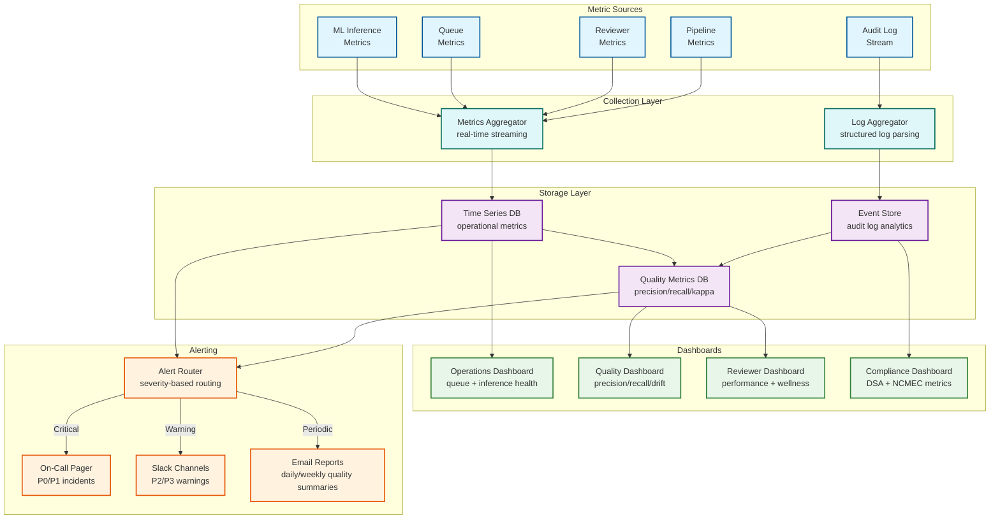

# 12.17 Content Moderation System — Observability

## Observability Philosophy

Content moderation systems have a uniquely complex observability challenge: unlike most systems where correctness can be validated by comparing output to a ground truth (test failures, error rates, latency percentiles), moderation correctness is fundamentally a human judgment that is expensive to obtain and varies across cultural contexts. The observability stack must therefore track both system-level operational health (are the pipelines running?) and moderation-quality health (are the decisions correct?). These two dimensions require different instrumentation, different alerting thresholds, and different response teams.

---

## Moderation Quality Metrics

### Precision, Recall, and F1

The core accuracy metrics for each content category are precision and recall, computed from periodic sampling audits:

```
Precision = True Positives / (True Positives + False Positives)
  -- Of all content actioned, how much was actually violating?
  -- Low precision = over-moderation (false positives, user trust harm)

Recall = True Positives / (True Positives + False Negatives)
  -- Of all violating content, how much was caught?
  -- Low recall = under-moderation (missed violations, safety harm)

F1 = 2 × (Precision × Recall) / (Precision + Recall)
  -- Harmonic mean; useful when precision/recall trade-off is not dominated by one dimension
```

Targets by category (sample):

| Category | Precision Target | Recall Target | Rationale |
|---|---|---|---|
| CSAM | 95% | 99.9% | False negatives cause irreversible harm; accept more false positives |
| Terrorism / incitement | 90% | 99% | Safety-critical; high recall priority |
| Hate speech | 85% | 90% | Context-dependent; higher false positive rate acceptable |
| NSFW (adult) | 92% | 88% | Precision matters more; false positives harm creator trust |
| Spam | 98% | 85% | High precision essential; spam misclassification is noisy |

These metrics are computed weekly using a stratified random sample of moderation decisions, labeled by senior reviewers against gold-standard policy. Results feed into the model retraining pipeline when drift is detected.

### False Positive Rate Tracking

False positives (legitimate content incorrectly removed) are tracked through multiple signals:

1. **Appeals overturn rate**: Content reinstated through the appeals process is a confirmed false positive. Tracked by category, model version, and geo-context.
2. **Calibration injection accuracy**: When reviewers disagree with automated decisions on calibration items, this is a signal of false positive or false negative patterns.
3. **Creator appeal rate**: The proportion of enforcement-actioned creators who file appeals (a high appeal rate relative to overturn rate may indicate systemic over-removal in a category).
4. **Human override rate**: The rate at which human reviewers override the automated recommendation (Zone B items where the reviewer takes a different action than the model suggested).

Dashboard: False positive rate by category, by model version, by geo-context, trending over 30/90/365 days.

### Model Drift Detection

Models trained on historical data drift as language, culture, and adversarial tactics evolve. Drift is detected through:

**Distribution shift monitoring**: The distribution of model output scores is sampled every hour and compared to a reference distribution (the 30-day rolling baseline). Significant shifts (KL divergence > threshold) trigger an alert. Score distribution shifts often precede precision/recall degradation, providing early warning.

**Calibration drift**: ECE (Expected Calibration Error) is computed weekly on the latest calibration item set. An ECE increase > 5% triggers recalibration. An ECE increase > 15% triggers model review.

**Adversarial signal correlation**: When the adversarial signal team identifies new obfuscation techniques and adds normalization rules, the system measures whether model scores for previously-evading content shift as expected. If newly normalized content still scores below threshold, the model may be insensitive to that obfuscation family and retraining is needed.

---

## Queue Health Metrics

### Review Queue Dashboard

The human review queue has its own health dashboard with real-time metrics:

| Metric | Description | Alert Threshold |
|---|---|---|
| Queue depth (by partition) | Number of items waiting for review | > 500K total; > 50K CRITICAL partition |
| Queue ingress rate | Items added per minute | Sudden 3× spike |
| Queue drain rate | Items completed per minute | < 80% of ingress rate for > 10 minutes |
| SLA compliance rate | % of items reviewed within SLA | < 95% (warn); < 90% (alert) |
| SLA breach count | Items that expired without review | > 0 for CRITICAL partition; > 10/hour for HIGH |
| Assignment wait time | Time from QUEUED to ASSIGNED | p95 > 30 minutes |
| Review cycle time | Time from ASSIGNED to COMPLETED | p95 > 5 minutes deviation from baseline |
| Reviewer utilization | Active reviews / total reviewer capacity | > 90% (surge activation trigger) |

### SLA Burn Rate Alerting

The queue monitoring system uses a burn rate model (borrowed from SLO error budget concepts) to alert when the SLA compliance rate is degrading faster than sustainable:

```
SLA burn rate = (1 - current SLA compliance rate) / (1 - SLA target)

Burn rate > 1.0: consuming SLA budget faster than it's replenishing
Burn rate > 2.0: alert (page queue manager)
Burn rate > 5.0: page on-call engineer; activate surge pool
Burn rate > 10.0: incident declaration; activate emergency protocols
```

---

## Reviewer Performance Metrics

### Individual Reviewer Metrics

The reviewer performance dashboard (visible to reviewer managers, not individual reviewers to avoid gaming) tracks:

| Metric | Calculation | Use Case |
|---|---|---|
| Inter-rater kappa | Cohen's kappa vs. gold-standard calibration items | Quality gate; coaching trigger |
| Decision throughput | Items reviewed per hour (rolling 7-day) | Capacity planning |
| Override rate | % of auto-recommendations the reviewer overrides | Training signal; quality signal |
| Reversal rate | % of reviewer's decisions later overturned in appeals | Quality signal; coaching trigger |
| Average review duration | ms per item (rolling 7-day) | Fatigue signal; workstation performance signal |
| Wellness check-in response trend | Self-reported wellness over time | HR intervention signal |
| Exposure counts by category | Daily/weekly count per harmful category | Wellness compliance |

### Cohort-Level Quality Analysis

Individual reviewer metrics are aggregated into cohort analyses to identify systemic patterns:

- **Regional cohort comparison**: Do reviewers in one geo-pool have systematically different precision/recall than another? (May indicate policy understanding gaps or cultural context differences)
- **Time-of-shift analysis**: Does decision quality degrade as a shift progresses? (Indicates fatigue; informs optimal shift length)
- **Category-specific cohort analysis**: Are there categories where the overall reviewer pool has low agreement? (Indicates policy ambiguity; triggers policy clarification process)

---

## Pipeline Operational Metrics

### ML Inference Health

| Metric | Alert Condition |
|---|---|
| Inference request queue wait time (p95) | > 200ms (warn); > 500ms (page) |
| GPU utilization | > 85% (scale trigger); > 95% (alert) |
| Model error rate | > 0.1% (warn); > 1% (alert) |
| Batch size efficiency | < 50% of max batch size (indicates low throughput) |
| Model version distribution | > 5% on deprecated model version |
| Inference latency p99 by content type | > 2× baseline (model degradation signal) |

### Hash Matching Health

| Metric | Alert Condition |
|---|---|
| Hash match latency p99 | > 50ms |
| Hash DB version lag | > 60 seconds behind global latest |
| Hash DB coverage | # of nodes running latest version < 99% |
| Match rate by category | Sudden spike (new adversarial campaign); sudden drop (DB sync failure) |

### Ingest and Routing Health

| Metric | Alert Condition |
|---|---|
| Ingest rate (items/sec) | 3× above baseline (traffic anomaly) |
| Pre-publication gate latency p99 | > 500ms |
| Content event queue depth | > 1M items |
| Consumer group lag | > 30 seconds |
| Routing zone distribution | Zone A rate > 5% (model or policy anomaly) |

---

## Compliance Observability

### DSA Reporting Metrics

| Metric | Description |
|---|---|
| DSA submission lag | Time from enforcement action to DSA database submission |
| DSA submission success rate | % of required submissions successfully delivered |
| Statement of reasons completeness | % of submissions with all required fields populated |
| Appeal reporting completeness | % of closed appeals with DSA-required fields |

### NCMEC Reporting Metrics

| Metric | Description |
|---|---|
| CSAM detection to removal latency | Time from hash match to content removal |
| NCMEC submission latency | Time from detection to CyberTipline filing |
| NCMEC submission success rate | % of required reports filed successfully |
| CSAM detection count trend | Weekly CSAM items detected (baseline monitoring) |

---

## Observability Architecture



---

## Anomaly Detection and Incident Response

### Viral Content Early Warning

The observability system monitors content velocity (view-rate-per-minute for flagged content) as a leading indicator of potentially harmful viral spread. When content in the moderation pipeline has a velocity exceeding 10,000 views/minute:

1. Automatic priority boost to CRITICAL tier in human review queue
2. Alert fired to Trust & Safety on-call
3. Temporary velocity-based shadow restriction applied pending human review (content remains visible but is deprioritized in feed algorithms)

### Adversarial Campaign Detection

Sudden spikes in hash match rates for a specific category (e.g., CSAM match rate doubles overnight) indicate a new adversarial campaign. The system:

1. Fires an alert to the Trust & Safety intelligence team
2. Automatically shares the spike signal with cross-platform industry partners (GIFCT, Technology Coalition)
3. Triggers a manual review of recently scanned content in the affected category to identify missed items

---

## Error Budget Integration

### SLO Error Budget Dashboard

```
┌─────────────────────────────────────────────────────────────────┐
│  SLO Error Budget Status (Rolling 30-Day Window)                │
├─────────────────────────┬──────────┬──────────┬─────────────────┤
│ SLO                     │ Target   │ Consumed │ Status          │
├─────────────────────────┼──────────┼──────────┼─────────────────┤
│ Pre-pub screening p99   │ ≤ 500ms  │   18%    │ ███░░░░░░ GREEN │
│ Post-pub scan latency   │ ≤ 5 min  │   42%    │ ██████░░░ GREEN │
│ Review SLA compliance   │ 99%      │   31%    │ █████░░░░ GREEN │
│ ML classification avail │ 99.95%   │   55%    │ ████████░ YELLOW│
│ NCMEC submission        │ 100%/24h │    0%    │ ░░░░░░░░░ GREEN │
│ Hash DB consistency     │ 99.999%  │    5%    │ █░░░░░░░░ GREEN │
│ Audit log durability    │ 9 nines  │    0%    │ ░░░░░░░░░ GREEN │
└─────────────────────────┴──────────┴──────────┴─────────────────┘
```

### Multi-Window Burn Rate Alerts

```
FUNCTION evaluateModBurnRate(slo, window_1h, window_6h):
  budget = slo.monthly_error_budget

  burn_1h = (errors_in(1h) / budget) × (30 × 24)
  burn_6h = (errors_in(6h) / budget) × (30 × 24 / 6)

  IF slo.name == "NCMEC_submission":
    // Zero-tolerance SLO: any single failure is a P0
    IF errors_in(1h) > 0:
      TRIGGER P0_ALERT("NCMEC submission failure")
    RETURN

  IF burn_1h > 14.4 AND burn_6h > 6:
    TRIGGER P0_ALERT("Fast burn: " + slo.name)
  ELSE IF burn_1h > 6 AND burn_6h > 3:
    TRIGGER P1_ALERT("Medium burn: " + slo.name)
  ELSE IF burn_6h > 1:
    TRIGGER P2_ALERT("Slow burn: " + slo.name)
```

---

## Operational Runbooks

### Runbook: Model Drift Detected

**Trigger:** KL divergence of model score distribution > threshold for any category

```
Step 1: Diagnose drift type
  - Check if drift correlates with a policy update (expected drift)
  - Check if drift correlates with a content composition change (new trend)
  - Check if drift correlates with adversarial evasion campaign (attack)

Step 2: Assess impact
  - Calculate precision/recall on most recent calibration sample
  - Compare to 30-day baseline
  - If precision drop > 5% OR recall drop > 3%: escalate to ML team

Step 3: Mitigate
  IF adversarial evasion detected:
    - Update normalization layer with new evasion patterns
    - Re-run drifted items through updated normalization + classification
  IF content composition changed:
    - Collect new labeled samples from recent content
    - Fast-track model retraining with updated training set
  IF expected drift from policy change:
    - No model action needed; update baseline distribution

Step 4: Monitor
  - Track KL divergence for 7 days post-mitigation
  - Verify precision/recall return to target levels
```

### Runbook: Review Queue SLA Breach Risk

**Trigger:** SLA burn rate > 2.0 for any review queue partition

```
Step 1: Identify the partition(s) at risk
  - Check per-partition queue depth, ingress rate, and drain rate
  - Identify the SLA tier(s) most at risk (CRITICAL? NetzDG? Standard?)

Step 2: Immediate actions
  IF CRITICAL partition (CSAM/terrorism):
    - Activate all available CSAM-cleared reviewers from flex pool
    - Page Trust & Safety on-call
    - Consider temporary threshold adjustment: raise Zone A to route
      more items to auto-action (accept slightly higher false positive risk)
  IF geo-specific partition (NetzDG):
    - Activate German-language flex reviewers
    - Page compliance on-call
  IF standard partition:
    - Activate flex reviewer tier
    - Extend shift for core reviewers (with wellness monitoring)

Step 3: Prevent SLA breach
  - Priority boost for items within 80% of SLA deadline
  - Reduce calibration injection rate temporarily (from 10% to 2%)
    to maximize reviewer throughput on real items
  - If breach is imminent for non-CRITICAL items: extend SLA
    window and document the extension for transparency reporting

Step 4: Post-incident
  - Root cause: traffic spike? ML routing anomaly? staffing gap?
  - Adjust staffing model or ML thresholds to prevent recurrence
```

---

## Distributed Tracing

### Content Item Trace Structure

Every content item carries a trace ID through the entire moderation pipeline. Traces are sampled at 1% for all items and 100% for items that trigger enforcement actions, appeals, or NCMEC reports.

A complete trace for a video content item includes spans for:

```
├── Edge receipt + authentication               [5ms]
├── Content metadata extraction                  [10ms]
├── Hash computation (pHash, PDQ)                [15ms]
├── Hash DB lookup                               [8ms]
├── Feature extraction                           [20ms]
│   ├── Audio: STT transcription                 [150ms]
│   ├── Video: keyframe extraction               [50ms]
│   └── Text: OCR + normalization                [30ms]
├── ML inference (parallel)                      [120ms]
│   ├── Text toxicity classifier                 [40ms]
│   ├── Hate speech classifier                   [45ms]
│   ├── NSFW image classifier                    [60ms]
│   ├── Violence classifier                      [55ms]
│   └── LLM contextual (if Zone B ± 0.1)        [200ms]
├── Score aggregation + calibration              [5ms]
├── Policy engine evaluation                     [10ms]
├── Routing decision                             [2ms]
│   ├── Zone A: Action executor                  [15ms]
│   ├── Zone B: Human review queue insert        [50ms]
│   └── Zone C: Fast-path allow                  [2ms]
├── Audit log write                              [10ms]
└── (if Zone A) Enforcement action execution     [20ms]
    ├── Content visibility change                [5ms]
    ├── DSA statement of reasons generation      [10ms]
    └── (if CSAM) NCMEC CyberTipline submission  [500ms]
```

Average trace depth: 12–20 spans. Traces are retained for 30 days for debugging; summary statistics retained for 1 year.

---

## Compliance Monitoring Dashboards

### GDPR and Data Privacy Dashboard

| Metric | Description | Alert Condition |
|---|---|---|
| Erasure request backlog | Pending data deletion requests | > 50 requests older than 25 days (30-day GDPR deadline) |
| Erasure completion rate | % of requests completed within SLA | < 95% in rolling 30-day window |
| Data residency violations | Items processed outside required region | Any violation → P0 |
| Consent record integrity | % of enforcement actions with valid consent chain | < 99.9% |
| Forensic hold count | Active forensic holds preventing erasure | Report to legal team weekly |
| Cross-region data transfers | Items transferred across region boundaries | Audit log entry for each; alert on unexpected volume |

### Audit Trail Health Dashboard

The audit log is the single most compliance-critical component. Its health is monitored continuously:

| Metric | Description | Alert Condition |
|---|---|---|
| Write latency p99 | Time to confirm audit log write | > 50ms (warn); > 200ms (page) |
| Write success rate | % of writes confirmed | < 99.999% → P0 |
| Chain integrity check | Periodic cryptographic chain verification | Any chain break → P0; freeze enforcement |
| Replication lag | Lag between primary and replica nodes | > 5 seconds (warn); > 30 seconds (page) |
| Storage utilization | Disk usage on audit log cluster | > 80% (alert); trigger compaction to cold tier |
| Query latency | Time to retrieve audit records for investigation | > 2 seconds for most recent 30 days |

### Reviewer Wellness Compliance Dashboard

This dashboard is access-restricted to HR and the wellness program. It monitors aggregate wellness signals without exposing individual reviewer data:

| Metric | Description | Alert Condition |
|---|---|---|
| CSAM exposure cap utilization | % of reviewers who reached daily CSAM cap | > 30% of pool (understaffing signal) |
| Mandatory break compliance | % of triggered breaks that were actually taken | < 100% → system enforcement check |
| Wellness check-in response rate | % of prompted check-ins completed | < 90% → investigate UI/workflow issue |
| Wellness referral rate | % of reviewers referred to EAP in rolling month | > 5% (systemic stress indicator) |
| Average shift wellness score | Mean of end-of-shift self-reported scores | Declining trend over 2 weeks → escalate |
| Turnover leading indicators | Combination of declining kappa + increasing break skips + declining speed | Alert to reviewer management |

---

## Data Pipeline Observability

### End-to-End Data Freshness Monitoring

Content moderation depends on several data pipelines whose freshness directly impacts safety:

| Pipeline | Freshness Target | Staleness Alert | Impact of Staleness |
|---|---|---|---|
| Hash DB sync (NCMEC/GIFCT) | < 60 seconds | > 120 seconds | Missed known-bad content matches |
| Policy rule propagation | < 30 seconds | > 60 seconds | Stale enforcement rules; potential compliance violation |
| Model score cache refresh | < 24 hours TTL | Stale entries > 1% | Outdated scores applied to changed policy rules |
| Adversarial signal feed | < 1 hour | > 2 hours | Delayed response to new evasion techniques |
| Calibration item pool refresh | < 7 days | > 14 days | Calibration items no longer representative |
| Trust score updates | < 15 minutes | > 30 minutes | Account trust decisions based on stale data |

### Pipeline Health Aggregation

A composite pipeline health score aggregates the freshness and error rates across all data pipelines into a single operational indicator:

```
FUNCTION computePipelineHealth():
  health_score = 100

  FOR EACH pipeline IN monitored_pipelines:
    IF pipeline.is_stale():
      health_score -= pipeline.criticality_weight × staleness_factor(pipeline)
    IF pipeline.error_rate > pipeline.error_threshold:
      health_score -= pipeline.criticality_weight × 10

  IF health_score < 80:
    TRIGGER WARNING("Pipeline health degraded: " + health_score)
  IF health_score < 50:
    TRIGGER ALERT("Pipeline health critical: " + health_score)
    // Consider entering degraded operation mode

  RETURN health_score
```

Criticality weights: Hash DB sync (30), policy propagation (25), model cache (15), adversarial feed (15), trust scores (10), calibration pool (5).
