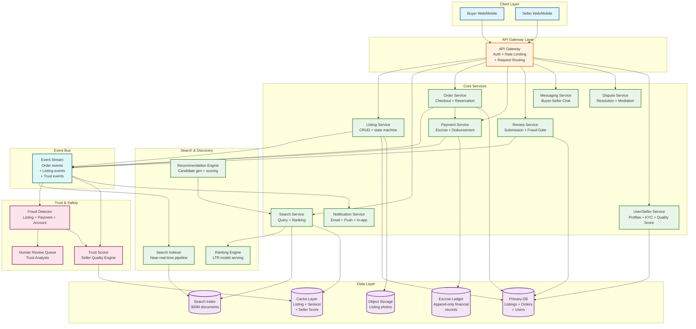
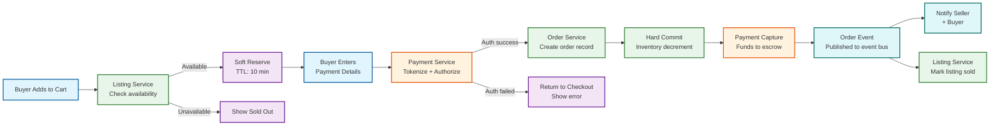
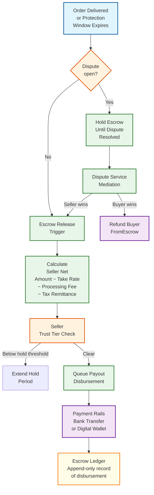
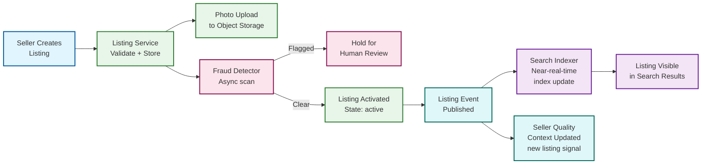
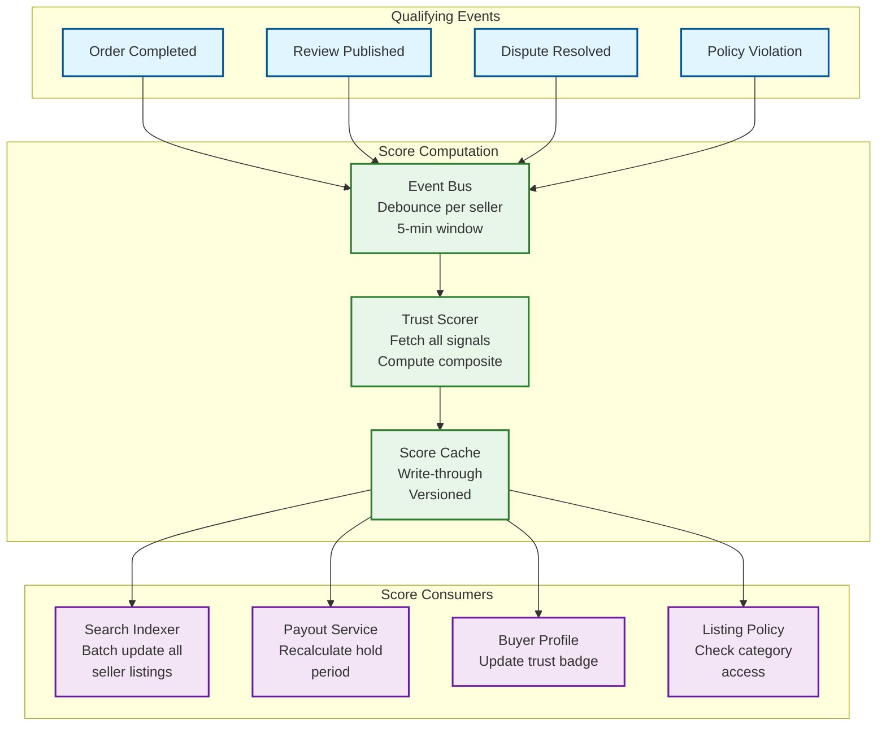
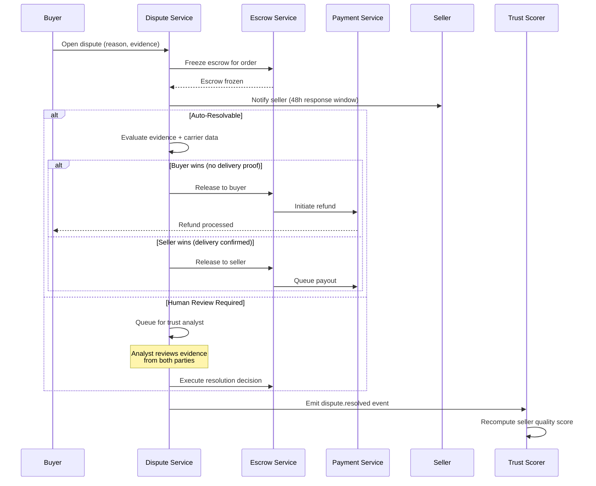

# 12.18 Marketplace Platform — High-Level Design

## System Architecture



---

## Key Design Decisions

### Decision 1: Escrow-Based Payment with Conditional Release

Charging the buyer at order creation and immediately forwarding proceeds to the seller creates a non-recoverable situation when buyers dispute non-delivery or item misrepresentation. The platform would need to chase sellers for refunds—a losing proposition at scale. Instead, buyer payment is captured at checkout into a platform-held escrow account. Funds are released to the seller only when one of three conditions is met: (1) delivery is confirmed by carrier tracking, (2) the buyer confirms receipt, or (3) the buyer protection window expires without a dispute being filed. This makes the platform the trusted intermediary for both sides: buyers trust that payment won't disappear, sellers trust that payment is secured and will be released.

**Implication:** The platform must hold substantial float (days of GMV in escrow), which creates regulatory obligations as a payment intermediary. The escrow ledger must be a separate, append-only financial record independent of the operational database.

### Decision 2: Seller Quality Score as a First-Class, Asynchronously Updated Signal

Seller quality affects search ranking, payout hold periods, buyer trust badges, and listing visibility—it is the most cross-cutting signal in the system. Computing it synchronously on every affected operation would create tight coupling and latency problems. Instead, the seller quality score is a pre-computed, cached signal updated asynchronously after each qualifying event (order completion, review submitted, dispute resolved, policy action taken). The score is versioned and timestamped; downstream systems consume the current score from cache and receive invalidation events when scores change materially.

**Implication:** There is an inherent staleness window (typically seconds to minutes) between a quality-changing event and the score update propagating to search ranking. This is acceptable—ranking is not expected to update in real time—but requires explicit SLO for propagation latency.

### Decision 3: Multi-Stage Search Pipeline (Recall → Rank → Filter → Personalize)

A naive approach applies a single scoring function to all 300M listings per query. This doesn't scale. The production pipeline uses four stages: (1) lightweight ANN (approximate nearest neighbor) vector recall to retrieve the top ~1,000 candidates from 300M in under 10ms; (2) learning-to-rank re-ranking of the 1,000 candidates using rich features (seller quality, behavioral signals, listing freshness) in under 20ms; (3) hard filtering for sold-out, policy-suspended, and geo-restricted listings; (4) diversity injection and personalization layer to avoid filter bubbles and surface new sellers. Each stage has a different latency budget and a different trade-off between recall and precision.

**Implication:** The system can improve ranking quality by improving any single stage without rebuilding the others. New ranking signals can be added to the re-ranker without touching the recall layer.

### Decision 4: Inventory Reservation with TTL-Based Soft Reserve

A race condition exists when multiple buyers simultaneously view the same single-quantity listing and attempt to purchase. Without reservation, two buyers can complete checkout for the same item. The solution uses a two-phase reservation: when a buyer enters checkout, a soft reserve is written with a TTL (10 minutes). If checkout completes within the TTL, the reserve converts to a hard commit and inventory is decremented. If TTL expires without checkout completion, the reserve is released and the item becomes available again. Only one soft reserve per listing can exist for single-quantity items.

**Implication:** Items can appear "unavailable" during checkout even if no purchase occurs (TTL reserve squatting). This is the correct trade-off: a false "sold out" for 10 minutes is far less harmful than an oversell.

### Decision 5: Trust Signals as Graph-Structured, Not Record-Structured, Data

Review fraud and coordinated seller manipulation are graph problems, not row-based anomaly detection problems. A seller with 5,000 five-star reviews from accounts that all signed up in the same week, have never reviewed other sellers, and share overlapping IP ranges cannot be detected by examining any single review record. It requires modeling the bipartite graph of reviewer-to-seller relationships and computing structural anomaly scores (reviewer clustering coefficients, temporal burst detection, IP diversity of review sources). Storing trust signals in a graph database alongside the transactional relational database allows this structural analysis without degrading OLTP performance.

**Implication:** Trust scoring requires a separate analytical pipeline that processes the review graph nightly (or in near-real-time for burst anomalies) and updates seller quality scores accordingly.

---

## Data Flow: Buyer Checkout



---

## Data Flow: Escrow Release and Payout



---

## Data Flow: Listing Creation to Search Visibility



---

## Component Responsibilities Summary

| Component | Primary Responsibility | Key Interface |
|---|---|---|
| **API Gateway** | Authentication, rate limiting, request routing, SSL termination | REST/GraphQL; JWT token validation |
| **Listing Service** | Listing CRUD, state machine (draft→active→sold), photo orchestration | REST API; publishes listing events to event bus |
| **Search Service** | Query parsing, multi-stage retrieval, ranking assembly | REST search API; reads from search index and cache |
| **Search Indexer** | Near-real-time index updates from listing events; document transformation | Consumes listing events; writes to search index |
| **Ranking Engine** | LTR model serving; combines relevance + seller quality + behavioral signals | gRPC inference API; called by Search Service |
| **Order Service** | Checkout orchestration, inventory reservation, order record management | REST checkout API; coordinates with Payment and Listing services |
| **Payment Service** | Payment authorization, capture, escrow accounting, disbursement scheduling | Internal gRPC; integrates with external payment processor and banking rails |
| **Escrow Ledger** | Append-only financial record of all escrow events (capture, hold, release, refund) | Write-only from Payment Service; read for audits and reconciliation |
| **Fraud Detector** | Multi-layer fraud scoring for listings, transactions, and reviews | Async event consumer; writes scores to Trust DB; escalates to human review |
| **Trust Scorer** | Computes and updates seller quality score from all quality signals | Event-driven; updates score cache; publishes score change events |
| **Dispute Service** | Opens, tracks, and resolves buyer-seller disputes; controls escrow release | REST disputes API; integrates with Payment Service for refund/release |
| **Review Service** | Review submission with fraud gate; score aggregation; public display | REST reviews API; fraud check before write; async quality score update |

---

## Component Dependency Matrix

Understanding which components depend on which — and the failure impact — is critical for operational planning:

| Component | Depends On | Failure Impact |
|---|---|---|
| **Search Service** | Search Index, Ranking Engine, Cache, Availability Cache | Buyers cannot find listings; GMV drops immediately |
| **Order Service** | Listing Service, Payment Service, Cache, Primary DB | No new orders; direct GMV loss |
| **Payment Service** | External Processor, Escrow Ledger, Token Vault | No payment capture or disbursement; financial operations halt |
| **Listing Service** | Primary DB, Object Storage, Event Bus | Sellers cannot create/update listings; supply growth stops |
| **Trust Scorer** | Event Bus, Primary DB, Cache | Seller quality scores stale; ranking quality degrades silently |
| **Fraud Detector** | Event Bus, Trust Graph DB, ML Model Server | Fraudulent listings and reviews go undetected |
| **Search Indexer** | Event Bus, Search Index | New listings invisible; search becomes progressively stale |
| **Dispute Service** | Order Service, Payment Service, Escrow Ledger | Buyer disputes unresolved; escrow funds frozen indefinitely |
| **Notification Service** | Event Bus, Email/Push providers | Users not notified of order updates; support ticket volume spikes |

### Critical Path vs. Non-Critical Path

```
Critical path (synchronous, latency-sensitive):
  Buyer → API Gateway → Search Service → Ranking Engine → Response
  Buyer → API Gateway → Order Service → Payment Service → Escrow Ledger → Response

Non-critical path (asynchronous, eventual):
  Listing Event → Search Indexer → Index Update
  Order Event → Trust Scorer → Score Update → Cache Invalidation
  Review Event → Fraud Detector → Fraud Score → State Update
  Order Event → Notification Service → Email/Push
```

**Design principle:** No non-critical path component should block or slow the critical path. All cross-cutting updates flow through the event bus, ensuring the buyer's checkout latency is independent of trust scoring, search indexing, and notification delivery.

---

## Data Flow: Seller Quality Score Lifecycle



---

## Data Flow: Dispute Resolution with Escrow Impact



---

## Technology Selection Guidelines

| Component | Recommended Approach | Why Not the Alternative |
|---|---|---|
| **Primary DB** | Sharded relational (horizontally partitioned) | NoSQL lacks the transactional guarantees needed for inventory and orders |
| **Search Index** | Dedicated search engine (inverted index + vector) | Relational DB cannot handle 300M full-text + vector queries at 8K QPS |
| **Event Bus** | Distributed log with consumer groups | Point-to-point messaging loses the replay and multi-consumer properties |
| **Escrow Ledger** | Append-only event-sourced store | Mutable balance tables are reconciliation-hostile |
| **Cache** | Distributed in-memory store | Local caches create consistency issues for availability and scores |
| **Fraud Graph** | Graph database | Relational JOINs cannot efficiently compute graph distance and clustering |
| **Object Storage** | Cloud object store + CDN | Block storage uneconomical at PB scale for photos |
| **ML Model Serving** | Low-latency inference service (gRPC) | REST adds unnecessary overhead for inline ranking inference |

---

## Real-World: Marketplace Architecture at Scale

### Case Study: Multi-Category E-Commerce Marketplace

A marketplace serving 50M+ buyers, 2M+ sellers, and 300M+ listings across 30+ categories:

**Architecture decisions that worked:**
- **Search as a first-class service:** Dedicated search team maintains the multi-stage pipeline independently from the listing team. Search index is a derived view, not a primary store — any inconsistency is self-healing on the next index refresh cycle.
- **Escrow as a separate financial system:** The escrow ledger is deployed as an independent service with its own database, replication, and backup strategy. The operations team treats it with the same rigor as a banking system — separate change management, quarterly penetration tests, and financial audits.
- **Event bus as the integration backbone:** All cross-service communication flows through the event bus. No service calls another service synchronously for non-critical operations. This allowed the team to add a new "seller analytics" consumer without modifying any existing service.

**Architecture decisions that caused pain:**
- **Tight coupling of seller quality score to search index:** Initially, the seller quality score was stored as a field in the search document. Updating it required re-indexing the listing. At 300M listings and 5M sellers, a single seller's score change triggered updates to hundreds of listing documents. Decoupling the score into a separate lookup (fetched at query time, not stored in the index) resolved the fanout problem.
- **Monolithic fraud detection:** Initially, listing fraud, review fraud, and payment fraud were all handled by a single "fraud service." As each attack vector evolved, the service became a Slowest part of the process for deployment velocity. Splitting into three specialized services (each with its own model deployment cycle) improved detection accuracy and team velocity.

### Case Study: Cross-Border Marketplace Payment Architecture

A marketplace enabling transactions between buyers and sellers in 15+ countries:

**Challenges solved:**
- **Multi-currency escrow:** Buyer pays in their local currency. Escrow holds in the buyer's currency (not the seller's) to avoid FX exposure during the hold period. FX conversion happens at disbursement time, with the rate locked 24 hours before the payout batch.
- **Regional payment processor routing:** EU buyers routed through an EU-based processor (PSD2/SCA compliance); US buyers through a US processor; APAC buyers through regional processors supporting local payment methods (bank transfers, digital wallets). Gateway-level routing based on buyer's card BIN or payment method type.
- **International payout rails:** Cross-border payouts use SWIFT for high-value, local faster-payment networks (ACH in US, SEPA in EU, FPS in UK) for domestic payouts. Minimum payout thresholds ($25 domestic, $100 international) to ensure transfer fees don't exceed a percentage of the payout.
- **Tax complexity:** Each buyer-seller jurisdiction pair requires different tax treatment. A US buyer purchasing from a UK seller: no US sales tax (international purchase), but UK VAT may apply on the seller side. Tax engine maintains a jurisdiction-pair matrix with 200+ combinations.

**Key lesson:** The payment service interface abstraction (single internal API regardless of payment method or region) was worth the 6-month upfront investment. Every new region or payment method is a configuration change, not a code change.
