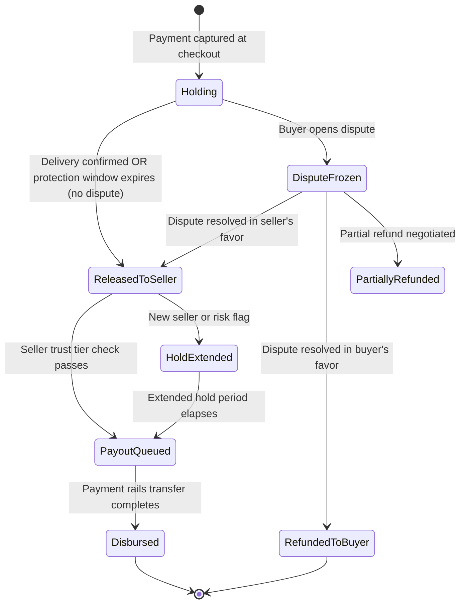
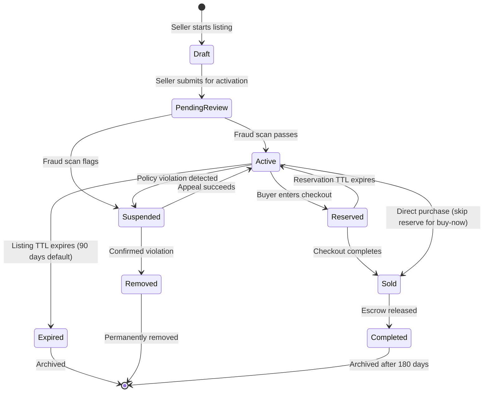

# 12.18 Marketplace Platform — Deep Dives & Bottlenecks

## Deep Dive 1: Multi-Stage Search Ranking Pipeline

### The Four-Stage Architecture

Production marketplace search does not apply a single scoring function to 300M listings per query—the computational cost would be prohibitive. The solution is a cascade of increasingly expensive, increasingly accurate scoring stages, each reducing the candidate set before passing to the next stage.

```mermaid
flowchart LR
    A[Query\n"vintage camera\nnikon\nnear me"] --> B[Query Understanding\nEntity extraction\nIntent classification\nSpell correction]
    B --> C[ANN Vector Recall\nTop ~1,000 candidates\nfrom 300M in ≤ 10ms]
    C --> D[BM25 Lexical Recall\nMerge with vector\nresults → 1,500 candidates]
    D --> E[LTR Re-Ranker\n30+ features\n≤ 20ms for 1,500 docs]
    E --> F[Hard Filters\nAvailability, policy,\ngeo restrictions]
    F --> G[Diversity + Personalization\nDe-dup seller\nPersonalize for buyer]
    G --> H[Promoted Injection\nBlended at fixed\npositions]
    H --> I[Return top 48\nresults to buyer]

    classDef query fill:#e1f5fe,stroke:#01579b,stroke-width:2px
    classDef recall fill:#e8f5e9,stroke:#2e7d32,stroke-width:2px
    classDef rank fill:#fff3e0,stroke:#e65100,stroke-width:2px
    classDef filter fill:#f3e5f5,stroke:#6a1b9a,stroke-width:2px
    classDef output fill:#fffde7,stroke:#f57f17,stroke-width:2px

    class A,B query
    class C,D recall
    class E rank
    class F,G,H filter
    class I output
```

### LTR Feature Groups

The learning-to-rank model at stage 3 uses feature groups that capture different quality dimensions:

| Feature Group | Examples | Signal Type |
|---|---|---|
| **Relevance** | Title BM25 score, semantic similarity to query, category match depth | Query-doc |
| **Quality** | Seller overall score, review count, trust tier | Doc-static |
| **Freshness** | Listing age (hours), last price change recency | Doc-static |
| **Behavioral** | 7-day CTR, 7-day conversion rate, 30-day view count | Doc-dynamic |
| **Price** | Price percentile within category, price vs. median | Query-doc |
| **Shipping** | Estimated delivery days, free shipping indicator | Doc-static |
| **Personalization** | Buyer's category affinity, prior seller interactions | Query-user |

**Model choice:** Gradient-boosted tree (LambdaMART) trained on click and purchase data. Neural ranking models (BERT-based cross-encoders) are too slow for 1,500 candidates per query; they are used for the offline training signal, not live inference.

**Training signal:** Purchases are strong positive signals; clicks with long dwell are medium; bounces are weak negative signals. Implicit feedback must be debiased for position effects (clicks on position 1 are inflated by exposure, not quality).

### Index Freshness for New Listings

New listings must appear in search within 30 seconds. Batch index rebuilds (hours) are unacceptable. The solution:

1. **Near-real-time index update pipeline:** Listing activation event → stream processor → incremental write to search index shard
2. **Dual-path query:** At query time, results from the main index are supplemented by a "hot listings" in-memory index covering items listed in the last 5 minutes (small enough to scan entirely, indexed by category)
3. **Availability filter short-circuit:** A separate availability cache (Redis, updated by Order Service on every sale) is checked after retrieval; sold-out listings are filtered before ranking, preventing buyers from clicking on unavailable items

**Slowest part of the process:** Index shard updates under peak listing creation (10,000/minute) → batch micro-updates every 5 seconds per shard with write coalescing to avoid index segment fragmentation.

---

## Deep Dive 2: Payment Escrow and Disbursement

### Escrow State Machine



### Disbursement Calculation

Every disbursement is a multi-party split computed atomically:

```
order_total = item_price + shipping_charged_to_buyer

platform_fee = order_total * take_rate  // e.g., 8% of order total

payment_processing_fee = (order_total * interchange_rate) + fixed_fee
// e.g., 2.9% + $0.30 per transaction

tax_remittance = collected_sales_tax  // passed through to tax authority

seller_net = order_total - platform_fee - payment_processing_fee - tax_remittance

// Ledger entries (all atomic):
DEBIT  escrow_account              order_total
CREDIT platform_revenue_account    platform_fee
CREDIT payment_processor_account   payment_processing_fee
CREDIT tax_remittance_account       tax_remittance
CREDIT seller_pending_payout        seller_net
```

**Financial integrity:** Every transaction produces exactly four ledger entries that sum to zero. Discrepancies trigger automated reconciliation alerts. The escrow ledger is append-only—entries are never updated or deleted.

### Payout Batching

Disbursing every seller net amount individually via banking rails would generate millions of micro-transfers per day, each incurring transfer fees. Production systems batch payouts:

- **Standard batch:** Twice daily (00:00 and 12:00 UTC). All sellers with cleared escrow and passed hold period receive a single aggregate transfer per bank account.
- **Instant payout option:** Premium sellers can request real-time disbursement (separate fee) via faster payment rails.
- **Cross-border complexity:** Payouts to international sellers require FX conversion at a locked rate, additional compliance checks, and integration with international wire/SWIFT or regional faster-payment networks.

---

## Deep Dive 3: Trust & Safety — Four Attack Vectors

### Vector 1: Fraudulent Listings

**Pattern:** Seller lists non-existent or counterfeit items, collects payment, never ships.

**Detection layers:**
1. **Account age gate:** New accounts cannot list high-value items (>$200) without additional verification
2. **Listing content classifier:** NLP model detects pricing anomalies (luxury goods priced 80% below market), template-matched descriptions from known fraud patterns, copy-paste listing descriptions across multiple seller accounts
3. **Image perceptual hash:** Listing photos checked against database of known counterfeit product images; watermark removal attempt detection
4. **Behavioral signals:** Rapid listing creation after account creation; listing many identical items across categories; messaging patterns soliciting off-platform payment

**Response:** Flagged listings enter human review queue (trust analysts); account may be proactively suspended pending review.

### Vector 2: Review Fraud

**Pattern A (Boosting):** Seller pays for fake five-star reviews to inflate reputation.
**Pattern B (Bombing):** Competitor pays for fake one-star reviews to harm a rival seller.

**Detection beyond per-review signals (covered in LLD):**

- **Temporal graph analysis:** Model the bipartite graph of (reviewer → seller) reviews. A coordinated attack creates a dense subgraph of reviews from accounts with short path distances in the social graph.
- **Linguistic fingerprinting:** Reviews from coordinated farms often share syntactic templates even when surface-level words differ. Sentence embedding clustering identifies farms.
- **Purchase funnel bypass detection:** Legitimate reviews require a completed purchase. Any review submitted via unusual API path or for which no matching completed order exists → hard suppression.

### Vector 3: Payment Fraud

**Pattern:** Stolen credit card used to purchase items; item shipped before card dispute is raised.

**Detection layers:**
1. **Device fingerprint + velocity:** Same device placing multiple orders to different addresses; orders from device first seen < 24 hours ago
2. **Billing-shipping mismatch:** Different billing address, IP geolocation, and shipping address
3. **Card testing signals:** Multiple failed authorization attempts from same device/IP followed by a success
4. **Order anomaly:** First order from a new account being high-value, expedited shipping, gift wrapping (patterns associated with card fraud)

**Response:** High-risk transactions blocked; medium-risk require 3DS strong authentication challenge; funds held in extended escrow for elevated-risk orders even after delivery.

### Vector 4: Account Takeover (ATO)

**Pattern:** Attacker takes over a legitimate seller's account, changes banking details, and receives their pending payouts.

**Detection and mitigation:**
1. **Login anomaly detection:** Impossible travel (login from two geographies within 1 hour), device fingerprint change, credential stuffing pattern (high-velocity login attempts)
2. **Payout account change: hard freeze.** Any change to seller banking details triggers a 72-hour hold on all pending payouts and sends a verification email/SMS to the account's registered contacts
3. **High-value action re-authentication:** Changes to price, shipping address, bank details require re-authentication regardless of session state
4. **Progressive trust for new bank accounts:** First payout to a newly added bank account is sent as a small verification deposit (micro-deposit pattern) before full disbursement

---

## Deep Dive 4: Dispute Resolution Automation

### Automated Resolution Patterns

| Scenario | Evidence Available | Auto-Resolution |
|---|---|---|
| Item not received | Carrier tracking shows "delivered" within protection window | Reject dispute; buyer protection ends |
| Item not received | No carrier scan past "label created" after 10 days | Auto-refund buyer; escrow returned |
| Item not received | Carrier shows "in transit" past estimated delivery by 5+ days | Extend protection window; notify buyer |
| Item not as described | Buyer provides photo evidence rated high-confidence mismatch by image similarity model | Refund buyer; flag seller quality score |
| Item not as described | Ambiguous evidence | Route to human trust analyst |
| Seller issues voluntary refund | Any dispute state | Resolve in buyer's favor; close dispute |

**Human review escalation criteria:**
- Dispute value > $500
- Seller or buyer has multiple prior disputes (pattern flag)
- Evidence is contradictory between parties
- Seller does not respond within 48 hours

### Dispute Impact on Seller Quality

Disputes are the highest-weight negative signal in the seller quality score:
- Dispute opened: neutral (disputes can be frivolous)
- Dispute resolved against seller: −0.1 to quality score (normalized)
- Dispute resolved in seller's favor: +0.02 (vindication signal)
- Seller response within 48 hours to dispute: +0.01 (engagement signal)
- High dispute rate (>5% of orders): search penalty applied; payout hold extended

---

## Key Bottlenecks and Mitigations

| Slowest part of the process | Root Cause | Mitigation |
|---|---|---|
| **Search index staleness** | Batch index refresh cycles | Near-real-time incremental indexing + hot listing overlay |
| **Checkout race conditions** | Concurrent purchases of single-quantity items | TTL-based optimistic soft reserve |
| **Payment processor rate limits** | External API quota exhaustion during holiday peaks | Connection pool + queue-based smoothing; secondary processor failover |
| **Seller quality score fanout** | One dispute triggers recomputation, then cascades to search index update for all their listings | Debounce recomputation (coalesce events in 5-min window); batch search index update |
| **Escrow ledger contention** | Millions of ledger writes per day to same financial accounts | Append-only event sourcing; aggregate balances computed on read, not stored as mutable state |
| **Review fraud graph query** | Graph traversal queries on billions of edges | Pre-materialized subgraph summaries per seller; incremental updates on new review events |
| **Photo ingest throughput** | 14.4 TB/day of new photo uploads from sellers | Async direct-to-object-storage upload with signed URLs; resize/compress pipeline runs independently of listing creation |

---

## Deep Dive 5: Seller Quality Score Propagation and Consistency

### Why This Is Critical

The seller quality score flows into at least four downstream systems: search ranking (determines listing visibility), payout timing (determines hold days), buyer-facing trust badges (determines buyer trust), and listing policy enforcement (determines which categories a seller can list in). A stale, inconsistent, or corrupted score propagates incorrect signals across the entire platform simultaneously.

### Score Propagation Architecture

```
Qualifying Event (order completed, review submitted, dispute resolved)
  │
  ├─→ Event Bus (order.completed, review.published, dispute.resolved)
  │
  ├─→ Trust Scorer Service
  │     ├─ Fetch all input signals for seller_id
  │     ├─ Compute new score (40% review + 25% shipping + 20% dispute + 15% response)
  │     ├─ Compare with previous version — if delta > threshold (0.01):
  │     │    ├─ Write new SellerQualityScore record (versioned, immutable)
  │     │    ├─ Update cache (write-through to distributed cache)
  │     │    └─ Emit score.changed event
  │     └─ If delta < threshold: skip (debounce)
  │
  ├─→ Score Change Event consumers:
  │     ├─ Search Indexer: update seller_score + trust_tier + search_boost
  │     │    for ALL listings by this seller (batch update, coalesced)
  │     ├─ Payout Service: recalculate hold period for pending payouts
  │     ├─ Buyer Profile Cache: update trust badge
  │     └─ Listing Policy Engine: check if new tier unlocks/restricts categories
```

### Failure Modes

1. **Score computation storm** — A seller completes 200 orders in a holiday batch. Each order completion triggers a score recomputation. Without debouncing, 200 redundant computations run.
   - **Mitigation:** Event coalescing with 5-minute debounce window. Buffer qualifying events per seller_id; recompute once after window closes. Exception: immediate recomputation for policy violations (severity demands real-time score update).

2. **Score-rank propagation skew** — Score updates take 30 seconds to reach the search index. During this window, a seller whose score dropped due to a dispute is still showing the old (higher) trust badge and ranking position.
   - **Mitigation:** Acceptable latency for quality (seconds-level staleness is fine for ranking). For safety-critical changes (seller suspended, fraud detected), a separate "hard override" path bypasses the score pipeline and directly marks all listings as suspended in the availability cache (milliseconds latency).

3. **Score manipulation via selective activity** — A seller games the score by completing many low-value orders (to boost shipping rate) while providing poor service on high-value orders.
   - **Mitigation:** Weight score components by order value, not just order count. A $500 order with late shipping weighs more than ten $10 orders shipped on time.

---

## Deep Dive 6: Concurrency and Race Conditions

### Race Condition 1: Double-Purchase of Single-Quantity Item

**Scenario:** Buyer A and Buyer B both view a single-quantity listing. Both click "Buy Now" within 100ms of each other.

**Analysis:**
```
T=0ms:   Buyer A calls POST /v1/checkout/reserve
T=50ms:  Buyer B calls POST /v1/checkout/reserve
T=60ms:  Buyer A's request reaches Listing Service — reads quantity_reserved=0, available=1
T=65ms:  Buyer B's request reaches Listing Service — reads quantity_reserved=0, available=1
T=70ms:  Buyer A's optimistic UPDATE: SET quantity_reserved=1, version=2 WHERE version=1 → SUCCESS
T=75ms:  Buyer B's optimistic UPDATE: SET quantity_reserved=1, version=2 WHERE version=1 → FAIL (version is now 2)
T=80ms:  Buyer B's service retries: reads version=2, quantity_reserved=1, available=0 → returns "sold out"
```

**Resolution:** Optimistic concurrency control via version column. Only one update can succeed for any given version. The losing buyer receives an "item no longer available" response within 100ms — fast enough that they don't even see a loading state.

### Race Condition 2: Checkout Completes During Reservation TTL Cleanup

**Scenario:** Buyer reserves a listing (10-min TTL). At T=9:59, the TTL cleanup job starts releasing the reservation. At T=10:00, the buyer clicks "Complete Purchase."

**Analysis:** The TTL cleanup and the checkout completion race on the reservation record.

**Resolution:** The checkout completion operation acquires a row-level lock on the reservation record before proceeding. If the TTL cleanup has already deleted the reservation, the checkout returns "reservation expired" and the buyer must restart. If the checkout acquires the lock first, it converts the reservation to a hard commit atomically, and the TTL cleanup skips it (reservation no longer in pending state).

### Race Condition 3: Review Submission During Fraud Score Recomputation

**Scenario:** A review is submitted and awaiting fraud scoring. Simultaneously, the nightly fraud graph re-analysis triggers a batch recomputation of all fraud scores for that seller's reviews. The batch job reads the new review before its individual fraud score is computed, potentially flagging it based on stale signals.

**Resolution:** Each review has a `fraud_score_version` field. The batch re-analysis only processes reviews with a finalized fraud score. Newly submitted reviews in `pending_fraud_check` state are excluded from batch processing and processed individually by the online fraud scorer first.

### Race Condition 4: Payout During Active Dispute

**Scenario:** A seller's payout batch runs at midnight. At 11:58 PM, a buyer opens a dispute on one of the seller's orders. The dispute should freeze the escrow, but the payout batch may have already calculated the disbursement amount including the disputed order's funds.

**Resolution:** The payout batch acquires a read lock on all escrow records for the seller and checks dispute status at computation time. If a dispute is opened between computation and disbursement, the transfer fails atomic validation (escrow state has changed from "released" to "dispute_frozen") and the disputed amount is excluded on retry.

---

## Edge Cases

### Edge Case (Unusual or extreme situation) 1: Seller Changes Price While Buyer Is in Checkout

**Scenario:** Buyer reserves a listing at $50. Seller changes the price to $75 while the buyer is in checkout.

**Resolution:** The reservation captures a `price_snapshot` at reservation time. The checkout completes at the reserved price, not the current price. The seller's price change only affects new reservations. The listing page shows the current price; the checkout page shows the reserved price with "price locked for your session."

### Edge Case (Unusual or extreme situation) 2: Partial Refund with Multiple Payment Methods

**Scenario:** Buyer paid $100 total: $70 from credit card + $30 from platform wallet. They dispute and receive a $40 partial refund. Which payment method gets the refund?

**Resolution:** Refunds follow a priority order: (1) platform wallet first (instant, no fees), (2) credit card remainder. The $40 refund goes: $30 to wallet + $10 to card. This minimizes payment processing fees on refunds.

### Edge Case (Unusual or extreme situation) 3: Seller Account Suspended Mid-Dispute

**Scenario:** A seller is suspended for fraud. They have 15 open orders, 3 active disputes, and $8,000 in pending payouts.

**Resolution:** Account suspension triggers a cascade:
1. All active listings immediately set to `suspended` state (removed from search)
2. Open orders without shipping confirmation → auto-refund buyers
3. Open orders with shipping confirmation → continue normal delivery flow; payout frozen
4. Active disputes → resolved in buyer's favor (seller cannot respond)
5. Pending payouts → frozen indefinitely; funds held for regulatory review
6. Seller appeals process available; if reinstated, payouts resume with extended hold

### Edge Case (Unusual or extreme situation) 4: Timezone-Based Tax Jurisdiction Ambiguity

**Scenario:** A buyer in a US state border town has an address that geocodes to a location where two jurisdictions claim taxing authority. The tax engine returns different rates depending on which service resolves the ZIP+4.

**Resolution:** Use the buyer's full address (not just ZIP) with the authoritative tax engine. In ambiguous cases, apply the higher rate (platform absorbs the small overcharge risk rather than risk under-collection). Tax filing records the jurisdiction code used for audit trail.

---

## Real-World: Large E-Commerce Marketplace Search Architecture

A major two-sided marketplace serving 300M+ listings and 8,000+ search QPS uses the following search architecture:

- **Recall layer:** HNSW-based approximate nearest neighbor search reduces 300M candidates to ~2,000 per query in < 10ms. Combined with BM25 lexical recall for long-tail queries where vector similarity underperforms keyword match.
- **Re-ranking:** LambdaMART gradient-boosted tree with 47 features. Feature computation takes ~5ms; inference takes ~15ms for 2,000 candidates. Features include 7-day CTR, conversion rate, seller score, price percentile, shipping speed, listing age, and photo quality score.
- **Availability filtering:** Separate availability bitset cache (updated within 100ms of each sale) filters sold items post-retrieval. This decoupling allows the main index to refresh on a 5-minute cycle without showing sold-out items.
- **Diversity injection:** Final result set constrained to max 3 listings per seller in top 20 results. New sellers (< 30 days) receive guaranteed impressions in at least 1 position per 5 queries in their category.
- **Key numbers:** 99th percentile search latency: 180ms. Index update latency: median 8 seconds from listing activation to search visibility. Zero-result rate: 2.3% of queries.

### Real-World: Marketplace Payment Escrow at Scale

A large marketplace processing $200M+ daily GMV through an escrow system:

- **Escrow float:** At any given time, approximately $800M in funds are held in escrow (4-day average hold across all trust tiers)
- **Disbursement:** 2 batch runs per day for standard sellers; instant payout option available for verified sellers at 1.5% fee
- **Reconciliation:** Automated daily reconciliation comparing escrow ledger events with payment processor settlement files. Discrepancy rate: < 0.001% (approximately $8,000/day requires manual investigation on $800M float)
- **Dispute rate:** 2.8% of orders result in disputes; 65% auto-resolved within 24 hours; 35% escalated to human review (average resolution: 3.5 days)
- **Engineering decision:** Chose event-sourced escrow ledger over mutable balance table. The 3x increase in query complexity (aggregate events vs. read balance) was justified by the 10x improvement in reconciliation speed and the complete elimination of unexplained balance discrepancies

---

## Deep Dive 7: Photo Processing Pipeline

### Challenge at Scale

With 3M new listings/day × 6 photos each = 18M photos/day = 14.4 TB/day of raw image data. The photo pipeline must handle upload, validation, transformation, storage, and CDN distribution without blocking the listing creation flow.

### Pipeline Architecture

```
Seller uploads photo → Signed URL (direct to object storage, bypassing application servers)
  │
  ├─→ Raw photo lands in staging bucket
  │
  ├─→ Photo Processing Queue (triggered by object storage event)
  │     ├─ Validate: file type, size limits, resolution minimums
  │     ├─ Safety check: nudity/violence classifier (block if flagged)
  │     ├─ Perceptual hash: compute pHash for counterfeit image matching
  │     ├─ Resize: generate 4 variants (thumbnail 150px, small 400px, medium 800px, large 1200px)
  │     ├─ Compress: WebP conversion with quality factor 82 (saves 30-40% vs JPEG)
  │     ├─ Strip EXIF: remove metadata (seller privacy; location data leakage prevention)
  │     └─ Write all variants to production bucket with CDN-friendly naming
  │
  ├─→ CDN warm: pre-push first 2 variants to edge caches in buyer-heavy regions
  │
  └─→ Update listing record: mark photo as processed; attach CDN URLs
```

### Failure Modes

1. **Photo processing backlog:** If the pipeline falls behind (processing queue depth > 100K), new listings are created but show placeholder images. The listing is discoverable in search but displays a "photos processing" state.
   - **Mitigation:** Auto-scale photo processing workers; prioritize photos for listings in high-traffic categories.

2. **Counterfeit image match:** Perceptual hash matches a known counterfeit image. The listing is immediately held for human review; the seller sees "listing under review."
   - **False positive rate:** ~2% of legitimate listings are flagged due to similar (but not counterfeit) product photos. Manual review resolves within 4 hours.

3. **CDN cache poisoning:** A photo CDN URL is cached with an incorrect variant. The buyer sees a low-resolution thumbnail instead of the full-size image.
   - **Mitigation:** Cache keys include variant identifier; cache invalidation on photo reprocessing.

---

## Deep Dive 8: Listing State Machine

### State Transitions



### State Invariants

| Rule that never changes | Enforcement |
|---|---|
| Only `active` listings appear in search results | Search indexer filters on state; availability cache only includes `active` listings |
| `reserved` listings cannot be reserved by another buyer | Database constraint: `quantity_reserved + quantity_sold <= quantity` enforced at write time |
| `sold` listings cannot transition to `active` | State machine code rejects invalid transitions; DB trigger as defense-in-depth |
| `suspended` listings generate no payout | Payout service checks listing state before including in disbursement batch |
| Price changes only allowed in `draft` and `active` states | API rejects price mutations in other states |

---

## Algorithm Complexity Analysis

| Algorithm | Time Complexity (Speed of the algorithm) | Space Complexity (Memory usage of the algorithm) | Slowest part of the process |
|---|---|---|---|
| **ANN Vector Recall** | O(log N) per query (HNSW) | O(N × d) for index (N=300M, d=384) | Memory: 300M × 384 × 4 bytes = 460 GB |
| **BM25 Lexical Recall** | O(q × k) where q=query terms, k=postings length | O(N × avg_terms) inverted index | Disk I/O for long postings lists |
| **LTR Re-Ranking** | O(C × F) where C=candidates, F=features | O(model_size) ≈ 50 MB | Latency: 15ms for 1,500 candidates |
| **Seller Quality Score** | O(R + O + D) where R=reviews, O=orders, D=disputes | O(1) per seller (output: single score record) | I/O: fetching signals from 3 services |
| **Review Fraud (individual)** | O(S) where S=signals per review | O(1) per review | External calls: graph distance, embedding similarity |
| **Review Fraud (graph batch)** | O(V + E) graph traversal per seller cluster | O(V + E) graph in memory | Memory: full reviewer-seller graph must fit in RAM |
| **Reservation (optimistic)** | O(1) best case, O(retries) worst case | O(1) | Contention: retries under concurrent purchase |
| **Checkout Saga** | O(steps) = O(5) constant | O(1) per saga instance | External latency: payment processor (800ms) |

---

## Edge Case (Unusual or extreme situation) 5: Multi-Quantity Listing with Partial Fulfillment

**Scenario:** A seller lists 10 units of an item. Buyer A reserves 3 units and completes checkout. Buyer B simultaneously reserves 4 units. Buyer C tries to reserve 5 units (only 3 remain).

**Resolution:** Each reservation decrements `quantity_reserved` atomically using optimistic concurrency. After Buyer A's checkout, the listing state remains `active` (7 units remaining). After Buyer B's reservation, 3 units are available. Buyer C's request for 5 units fails with "only 3 available." The listing transitions to `sold` only when `quantity_sold == quantity` (all units sold). Partial fulfillment is tracked per order — each buyer's order is independent.

**Complication:** If Buyer A disputes and receives a refund for 2 of 3 units, those 2 units become available again. The listing transitions back from `sold` to `active` if previously all sold. This requires the listing state machine to support `sold → active` transitions triggered by refund events.

## Edge Case (Unusual or extreme situation) 6: Seller Deactivates During Active Buyer Checkout

**Scenario:** A seller voluntarily deactivates their account while a buyer is mid-checkout on one of their listings.

**Resolution:** Seller deactivation is a graceful process:
1. All listings transition to `deactivated` state (removed from search)
2. Active reservations are honored — buyers in checkout can complete their purchase
3. Open orders continue through fulfillment (seller is expected to ship)
4. After all open orders are completed/resolved, account enters `inactive` state
5. Pending payouts are disbursed on normal schedule (seller deactivation ≠ fraud)
6. Re-activation within 90 days restores all listings and seller quality history

## Edge Case (Unusual or extreme situation) 7: Currency Conversion Rate Drift During Escrow Hold

**Scenario:** A cross-border order is placed in EUR. Escrow holds EUR. Over the 5-day hold period, EUR/USD drops 3%. The seller expects USD payout based on the rate at order time.

**Resolution:** The platform offers two modes:
- **Rate-at-disbursement** (default): Seller accepts FX risk during hold period. Escrow stores original currency (EUR). Conversion happens at payout time using market rate.
- **Rate-at-order** (premium sellers): Platform locks the FX rate at order time. Platform absorbs FX risk (hedged with financial instruments). Premium feature: 0.5% FX markup.

The architectural implication: escrow records must store `original_currency`, `original_amount`, and optionally `locked_fx_rate`. Payout calculation differs based on FX mode.
