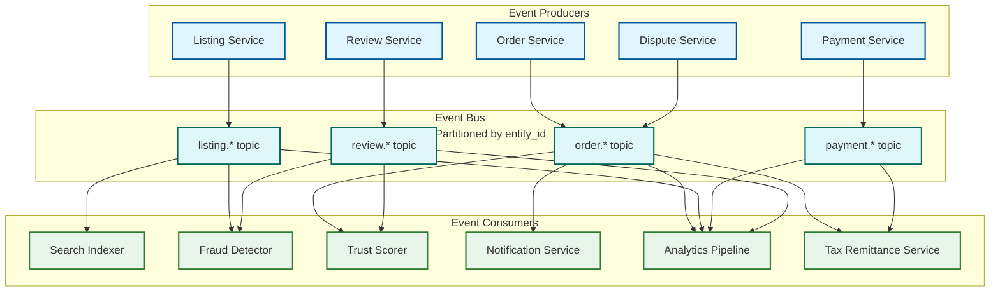
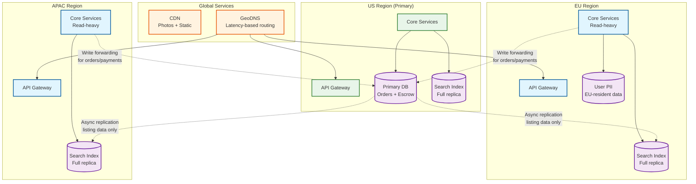

# 12.18 Marketplace Platform — Scalability & Reliability

## Scalability Architecture

### Listing and Search Index Partitioning

With 300M active listings, no single search node can hold the full index in memory. The search index is partitioned (sharded) across multiple nodes:

```
Sharding strategy: Category-aware consistent hashing
  Shard key: category_id + listing_id (prevents hot shards from popular categories)
  Shard count: 100 shards (allows horizontal expansion without full re-sharding)
  Replicas per shard: 3 (2 read replicas + 1 primary for index updates)

Query fan-out:
  A query for "vintage camera" fans out to:
    1. Identify candidate shards (Electronics, Cameras categories → 2 shards)
    2. Broadcast to both shards in parallel
    3. Merge and re-rank results from both shards at search aggregator
    4. Return top N to buyer

Global queries (no category filter):
  Fan out to all 100 shards → merge top-100 from each → final re-rank
  Mitigated by query understanding that adds category hints for most queries
```

### Database Partitioning Strategy

Different data access patterns require different partitioning strategies:

| Table | Partition Strategy | Rationale |
|---|---|---|
| Listings | Range partition by listing_id (UUID v7 time-ordered) | Evenly distributes writes; new listings cluster in latest partition |
| Orders | Shard by buyer_id | Buyer order history queries (most common) are single-shard |
| Orders (seller view) | Denormalized read replica sharded by seller_id | Seller order management queries are single-shard |
| Reviews | Partition by seller_id | Review reads for a seller listing page are single-shard |
| EscrowLedger | Append-only; partition by date | Financial reconciliation is time-range based |
| SellerQualityScore | Single row per seller; shard by seller_id | Small table; read heavy |

**Cross-shard operations:** Checkout requires reads across Listings, Users, and Orders. These are handled by the Order Service application layer, not as database JOINs, to maintain partition independence.

### Event Bus for Decoupling

All cross-service coordination flows through the event bus rather than synchronous service calls:



**Consumer group isolation:** Each consumer group (search indexer, fraud detector, etc.) maintains independent read offsets. A slow fraud detection pipeline does not block search indexing. Consumers can replay from any offset during outages or backfills.

---

## Holiday Peak Handling

Marketplaces experience 5–10× traffic spikes on major shopping holidays. The following systems require special handling:

### Checkout Throughput

At 5× peak (290 orders/sec), the payment processor becomes the Slowest part of the process:

- **Connection pooling:** Maintain warm connection pools to payment processor to avoid connection setup latency under burst
- **Secondary processor failover:** Pre-integrated backup payment processor; automatic failover if primary error rate exceeds 1% for 30 seconds
- **Checkout queue smoothing:** Excess checkout requests are queued with a status page ("Completing your order...") rather than rejected. Queue depth is bounded at 30 seconds of capacity; beyond that, new requests receive "busy" response

### Search Read Scaling

- **Read replica auto-scaling:** Search nodes scale horizontally on CPU and QPS metrics; pre-warm additional nodes 2 hours before anticipated peaks (based on historical patterns)
- **Query result caching:** Top 10,000 most-common queries are cached with 30-second TTL. Cache hit rate ~40% on holiday peaks reduces live query load substantially
- **Graceful degradation:** Under extreme load, disable personalization layer (most expensive) and serve un-personalized ranked results

### Listing Availability Cache

The availability check (is this listing still available?) must be consistent even under peak load. A stale read from the main database could serve a sold-out listing:

- **Dedicated availability cache** (in-memory, write-through from Order Service on every sale): Single source of truth for in-search availability filtering
- **Cache capacity:** 300M boolean flags ≈ 300 MB per replica (trivially fits in memory)
- **Invalidation SLA:** Availability flag updated within 100ms of order commitment; search results filter against this cache, not the main listing database

---

## Reliability Patterns

### Payment Service: Critical Path Hardening

The payment service is the highest-reliability component ($225M/day GMV flows through it):

- **Idempotency keys:** Every payment operation includes a buyer-generated idempotency key. Duplicate requests (from client retries) return the original result without re-executing
- **Saga pattern for checkout:** Order creation is a distributed saga:
  1. Reserve inventory (compensatable: release reservation)
  2. Create order record (compensatable: mark order cancelled)
  3. Authorize payment (compensatable: void authorization)
  4. Capture payment (compensatable: refund)
  5. Create escrow record (compensatable: release escrow)
  If any step fails, the saga executes compensating transactions in reverse order
- **Circuit breaker on payment processor:** If error rate exceeds threshold, stop sending requests to degraded processor and route to backup; prevents cascading failures from propagating to buyers

### Search Service: Graceful Degradation

Search failure degrades buyer experience but is not a financial-integrity issue:

| Failure Mode | Degradation Response |
|---|---|
| Search index shard unavailable | Query remaining shards; mark shard as degraded; serve partial results with "limited results" indicator |
| LTR re-ranker latency spike | Fall back to lexical BM25 scoring only; disable neural features |
| Personalization service unavailable | Serve un-personalized results; no buyer-visible indicator |
| Recommendation engine down | Surface "editor's picks" static fallback set |

### Escrow Ledger Durability

The escrow ledger represents real money—it requires the highest durability guarantees in the system:

- **Synchronous replication:** Ledger writes are committed to a minimum of 2 replicas before returning success
- **Geographic distribution:** Primary replica + 2 cross-region replicas; RPO = 0 (no data loss) for committed transactions
- **Reconciliation job:** Daily automated reconciliation compares escrow ledger totals against payment processor settlement reports; any discrepancy triggers immediate alert and manual review
- **Audit log retention:** Escrow records retained for 7 years minimum (financial regulation); cold storage after 18 months

### Seller Quality Score: Eventual Consistency

Seller quality scores are eventually consistent across subsystems:

- **Score version propagation:** When a seller quality score is recomputed, a new version is published to all downstream caches (search ranking, buyer-facing profile, payout eligibility)
- **Version skew tolerance:** A search index using score version N while the payout system uses version N+1 for a brief window is acceptable
- **Hard limits:** If the score cache for a seller is completely missing (cache miss), fall back to conservative defaults (new seller tier) rather than serving stale data that might grant inflated trust

---

## Multi-Region Architecture

Global marketplace serving buyers and sellers across time zones requires multi-region deployment:

```
Region strategy:
  Active-active for read traffic (search, listing browse)
  Active-passive for write traffic (orders, payments, escrow)
  Global single source of truth for financial records (one primary region)

Data residency:
  User PII stored in user's home region (GDPR EU data sovereignty)
  Listing data replicated globally for search serving
  Financial records in primary region with encrypted backups in secondary regions

Latency optimization:
  Search index replicated to all regions; queries served from nearest region
  Listing photos served via CDN (no origin hits for cached photos)
  Payment processing routed to regionally appropriate processor (EU buyers via EU processor)
```

### Multi-Region Architecture Diagram



### Cross-Region Latency Budget

| Operation | Within Region | Cross-Region | Strategy |
|---|---|---|---|
| Search query | < 200ms | < 200ms (local replica) | Full index replica in each region |
| Listing browse | < 100ms | < 100ms (local replica) | Listing data replicated globally |
| Checkout (order creation) | < 3s | < 5s (write forwarding) | Order writes forwarded to primary |
| Payment capture | < 3s | < 4s (regional processor) | Regional payment processor routing |
| Photo serving | < 50ms | < 50ms (CDN) | CDN with global edge caching |
| Seller dashboard | < 500ms | < 1s (read-after-write) | Read-your-writes consistency for seller |

---

## Disaster Recovery

### RTO/RPO Targets by Component

| Component | RPO (Data Loss Tolerance) | RTO (Recovery Time) | Strategy |
|---|---|---|---|
| **Escrow Ledger** | 0 (zero data loss) | < 15 minutes | Synchronous multi-region replication |
| **Order Database** | 0 | < 30 minutes | Synchronous replication to standby |
| **Listing Database** | < 5 minutes | < 1 hour | Async replication; listings can be re-created |
| **Search Index** | < 30 minutes | < 2 hours | Rebuild from listing DB; serve partial results during recovery |
| **Seller Quality Scores** | < 1 hour | < 30 minutes | Recompute from order/review data; serve cached values during recovery |
| **Photo Storage** | < 24 hours | < 4 hours | Cross-region replication with eventual consistency |

### Disaster Recovery Runbook

```
Scenario: Primary region failure (full outage)

Phase 1 — Detection (< 2 minutes):
  - Health check failures trigger automated failover evaluation
  - On-call paged; 3 consecutive failed health checks = confirmed outage

Phase 2 — Traffic Failover (< 5 minutes):
  - GeoDNS updated to route all traffic to secondary regions
  - Search continues serving from regional replicas (no impact)
  - Read operations continue from replicated data

Phase 3 — Write Failover (< 15 minutes):
  - Promote secondary DB replica to primary (escrow ledger: zero-loss guaranteed)
  - Order DB promoted with potential loss of last few seconds of transactions
  - Payment service reconnects to promoted DB
  - Verify escrow ledger integrity via automated reconciliation

Phase 4 — Validation (< 30 minutes):
  - Run financial reconciliation against payment processor
  - Verify no duplicate or lost orders in failover window
  - Resume seller payouts only after reconciliation passes

Phase 5 — Recovery (hours):
  - Restore original region when available
  - Replicate changes back; re-establish original topology
  - Post-incident review
```

---

## Back-Pressure Mechanisms

### Checkout Load Shedding

During extreme traffic (Black Friday, flash sales), the checkout path must shed load gracefully:

```
FUNCTION handle_checkout_request(request):
  // Level 1: Queue-based smoothing
  IF checkout_queue_depth > MAX_QUEUE_DEPTH:
    IF request.order_value < LOW_VALUE_THRESHOLD:
      RETURN "temporarily_busy" with retry_after header
    // High-value orders always proceed

  // Level 2: Payment processor protection
  IF payment_processor_error_rate > 1%:
    switch to secondary processor
    IF secondary_error_rate > 5%:
      queue checkout for delayed processing
      RETURN "order_queued" with estimated_completion

  // Level 3: Search degradation cascade
  IF search_qps > CAPACITY_THRESHOLD:
    disable personalization layer (saves 40% compute)
    IF still overloaded:
      disable LTR re-ranking; use BM25-only scoring
      IF still overloaded:
        serve cached results for top queries; reject new queries with retry
```

### Event Bus Backlog Management

When downstream consumers fall behind (e.g., search indexer during a listing import bulk load):

| Consumer | Backlog Threshold | Response |
|---|---|---|
| Search Indexer | > 100K events | Scale indexer instances; switch to batch micro-updates |
| Fraud Detector | > 50K events | Triage: prioritize high-value listing events; defer low-value |
| Trust Scorer | > 10K events per seller | Coalesce events; compute one score update per seller per window |
| Notification Service | > 500K events | Degrade to essential notifications only (order confirmation, payment) |
| Analytics Pipeline | > 1M events | Acceptable; analytics can process hours-old data |

---

## Capacity Planning Formulas

### Search Cluster Sizing

```
Required search nodes = (total_listings × doc_size_bytes) / memory_per_node
                        × replica_factor
                        × headroom_factor

Example:
  300M listings × 5 KB = 1.5 TB raw index
  Inverted index overhead: 2× → 3 TB
  Replica factor: 3 → 9 TB
  Headroom (25%): 11.25 TB
  Memory per node: 64 GB
  Nodes required: 11.25 TB / 64 GB ≈ 176 nodes

  But QPS also matters:
  8,300 QPS ÷ 100 QPS per node = 83 nodes (QPS-bound)
  Take max(176, 83) = 176 nodes (memory-bound at this scale)
```

### Database Shard Calculation

```
Write throughput per shard: ~5,000 writes/second (practical limit)

Order writes at peak: 290 orders/sec × 4 writes/order = 1,160 writes/sec
  → 1 shard sufficient for orders (with headroom)

Listing writes at peak: 10,000 listings/min = 167 writes/sec
  → 1 shard sufficient for listings

Reservation writes at peak: 290 reservations/sec = 290 writes/sec
  → 1 shard sufficient

Growth-adjusted: at 5× current scale:
  Order writes: 5,800/sec → 2 shards
  Listing writes: 835/sec → 1 shard

Read scaling drives shard count more than writes (buyer queries dominate).
Read replicas: 3 per shard for search-serving read load.
```

### Escrow Float Estimation

```
Escrow float = daily_orders × avg_order_value × avg_hold_days
             = 5M × $45 × 4 days = $900M

At 5× peak: $4.5B in escrow float
Banking partner requirements:
  - Segregated trust accounts (not commingled with operating funds)
  - FDIC insurance limits apply per depositor ($250K)
  - Multi-bank strategy required above ~$500M float
```

---

## Chaos Engineering Experiments

| Experiment | Hypothesis | Expected Outcome |
|---|---|---|
| Kill 1 of 3 search index replicas | Search serves from remaining 2 replicas; latency increases < 20% | Verified: search auto-heals; p99 latency from 180ms to 210ms |
| Kill payment processor connection | Circuit breaker triggers; failover to secondary within 30 seconds | Verified: 15-second detection, 20-second failover, 2 orders retried |
| Introduce 500ms latency to event bus | Search index freshness degrades; listing visibility delayed | Verified: freshness SLO breached at 500ms+; alert fired at 60s stale |
| Simulate seller score computation failure | Downstream systems serve stale scores; no hard failure | Verified: stale scores served for up to 1 hour without alert (gap identified → alert added) |
| Drop 10% of fraud detection events | Fraudulent listings survive longer; detection time increases | Verified: fraud removal SLA drops from 95% to 87% within 60 min (acceptable for 10% loss) |
| Exhaust reservation TTL cleanup workers | Reservations not cleaned up; listings appear "sold out" longer | Verified: dead reservations accumulate; GMV impact ~0.1% per hour of outage |

---

## Data Archival and Cold Storage Strategy

As the marketplace matures, historical data grows unboundedly. An archival strategy prevents operational databases from degrading:

| Data | Hot Storage | Warm Storage | Cold Storage | Retention |
|---|---|---|---|---|
| **Active listings** | Primary DB | N/A | N/A | Until sold/expired |
| **Completed orders (< 90 days)** | Primary DB | N/A | N/A | Query-optimized |
| **Completed orders (90 days – 2 years)** | N/A | Read-only replicas | N/A | Buyer/seller history |
| **Completed orders (> 2 years)** | N/A | N/A | Object storage (Parquet) | 7-year financial retention |
| **Escrow records** | Primary DB (active) | Archived DB (released) | Object storage | 7 years minimum |
| **Reviews** | Primary DB | N/A | N/A | Indefinite (public content) |
| **Search analytics** | Real-time pipeline | 90-day analytics DB | Object storage | 2 years |
| **Fraud signals** | Real-time cache | Graph DB (1 year) | Object storage | 5 years |
| **Listing photos** | CDN + object storage | N/A | Low-tier object storage (sold listings) | 1 year after sold/expired |

### Archival Impact on Query Patterns

```
Query: "Show me all my orders from the last 2 years"
  → Hot storage: orders from last 90 days (sub-100ms)
  → Warm storage: orders from 90 days to 2 years (sub-500ms)
  → Combined: merge and sort by date (< 1 second total)

Query: "Show me order #12345 from 3 years ago" (support ticket)
  → Cold storage lookup by order_id (2-5 seconds; acceptable for support use case)
  → Rehydrate into warm storage if further investigation needed
```

---

## Platform SLA Tiers

Different marketplace participants receive different SLA guarantees based on their tier:

| Participant Tier | Search Availability | Checkout Availability | Payout SLA | Support Response |
|---|---|---|---|---|
| **Standard buyer** | 99.9% | 99.95% | N/A | 24-hour email |
| **Premium buyer** | 99.95% | 99.99% | N/A | 4-hour priority |
| **Standard seller** | 99.9% (listing) | 99.95% (order view) | Within hold + 1 BD | 24-hour email |
| **Verified Pro seller** | 99.95% | 99.99% | Same-day instant option | 1-hour dedicated |
| **Enterprise seller (API)** | 99.99% | 99.99% | Guaranteed daily | Dedicated account manager |

**Implementation:** SLA tiers are enforced via priority queuing at the API gateway level. Under load shedding, standard-tier requests are shed before premium/enterprise-tier requests.
