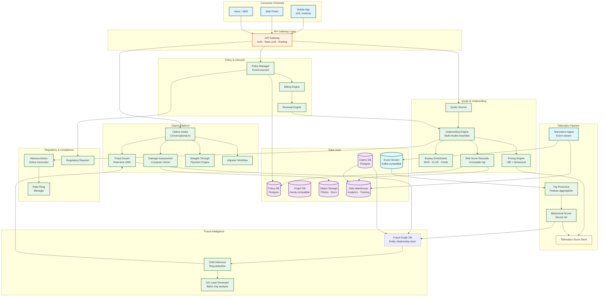
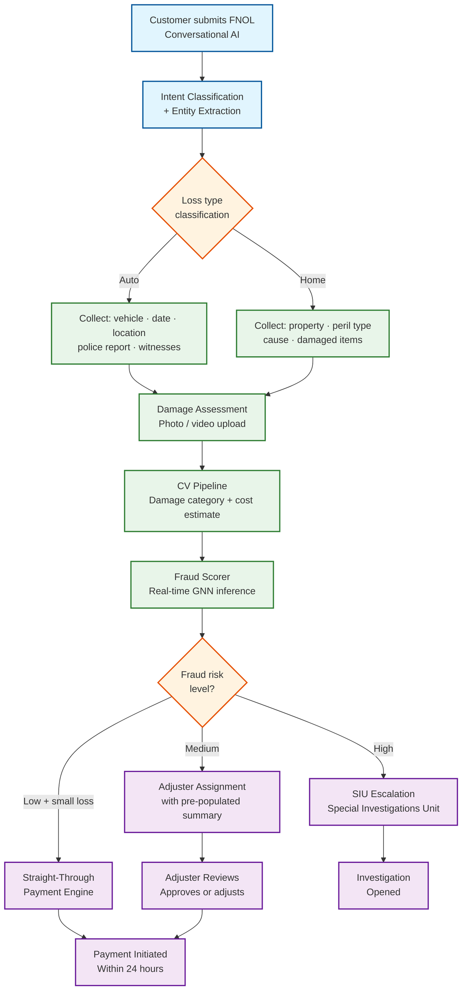

# 12.19 AI-Native Insurance Platform — High-Level Design

## System Architecture

---

## Key Design Decisions

### Decision 1: Immutable Risk Score Record at Every Binding Event

Every binding decision (new policy, renewal, endorsement) writes an immutable risk score record before the policy record is created. This record captures the exact feature vector, model version, approved algorithm version, and output scores at the moment the decision was made. This is not optional—it is a regulatory requirement. If a state insurance commissioner audits a rate decision made 18 months ago, the system must reproduce the exact inputs and outputs from that moment, using the actuarial algorithm version that was filed and approved at that time.

**Implication:** Model versioning is not just a DevOps concern—it is a compliance obligation. The risk score record is append-only and must survive model retraining, algorithm updates, and even database migrations without alteration.

### Decision 2: State-Parameterized Scoring, Not a Single Model

Insurance rating algorithms are approved on a state-by-state basis. A new rating variable (e.g., a telematics-derived aggressive braking score) must be filed and approved in each state before it can be used for rating in that state. A single model trained on all state data cannot satisfy this requirement—if the model inadvertently uses a prohibited factor for a given state, that state's rate filing is invalid.

The solution is a parameterized scoring engine: the feature set and algorithm weights are configuration objects (keyed by state × line-of-business × algorithm version). The underwriting engine selects the correct feature set and algorithm at inference time, never passing prohibited variables to the model. The approved algorithm version is stamped on the risk score record.

**Implication:** Adding a new rating variable requires a rate filing workflow before it can be activated in production. The feature pipeline and model are decoupled from the regulatory approval process.

### Decision 3: Dual-Write Telematics to Stream and Cold Storage

Telematics events are written to two destinations simultaneously: a low-latency event stream for real-time feature computation, and a cold object store for long-term archival. The event stream feeds the trip processor (near-real-time behavioral score updates). The cold store feeds the data warehouse for model retraining and serves as the regulatory archive (telematics data used for pricing decisions must be retained for the life of the policy plus state-mandated retention periods).

**Implication:** Telematics data has three lifetimes: real-time (seconds, for score updates), operational (30 days, for dispute resolution), and archival (7 years, for regulatory compliance). The storage tier transitions must be automatic and the cold archive must remain queryable for litigation support.

### Decision 4: Real-Time Fraud Scoring on the Critical FNOL Path

Fraud scoring is synchronous on the FNOL submission path—the claim is not acknowledged to the customer until a fraud score is computed and routed (either to straight-through payment or to adjuster queue). This design means high-fraud claims never enter the payment queue; they arrive in the adjuster workflow already flagged. The alternative (asynchronous fraud scoring after acknowledgment) risks payment of fraudulent claims before scoring completes.

The fraud scorer maintains a warm subgraph in memory for each active claim entity (updated continuously from the fraud graph). At FNOL, the scorer expands a 2-hop subgraph centered on the claimant and runs GNN inference. The ≤3-second SLO requires the GNN inference latency to be sub-second after subgraph retrieval.

**Implication:** The fraud graph must support sub-second subgraph retrieval for any entity. Graph DB query optimization (indexed entity lookup, in-memory hot subgraphs for high-risk entities) is a critical performance engineering problem.

### Decision 5: Conversational Claims Intake as a Structured Data Extraction Problem

The conversational AI claims intake is not a general-purpose chatbot—it is a state machine that extracts a defined set of structured fields required to open a claim (date of loss, loss type, property description, witness contacts, police report number). The conversation is designed to be empathetic but directive: the AI always steers toward collecting the next required field.

Intent classification and entity extraction run on every turn. If the customer is expressing distress, the AI acknowledges it before continuing extraction. If the AI is uncertain about a critical field (e.g., cannot reliably extract a vehicle plate number), it escalates to a live adjuster rather than guessing. This design produces a fully structured FNOL record as the output, not a transcript—enabling downstream automation without NLP post-processing.

**Implication:** The claims conversation is designed around a schema, not around natural language understanding in the abstract. Edge cases (ambiguous answers, distressed customers, complex losses) are escalation triggers, not model problems to solve.

---

## Data Flow: Quote-to-Bind

```mermaid
flowchart LR
    A[Consumer starts quote] --> B[Quote Service\ncollects application data]
    B --> C[Bureau Enrichment\nMVR · CLUE · Credit async calls]
    B --> D[Telematics Feature\nRetrieval from TST]
    C & D --> E[Underwriting Engine\nMulti-model ensemble]
    E --> F{State feature set\nselection}
    F --> G[Prohibited factor\nexclusion per state]
    G --> H[Model Inference\nGLM + GBM + Telematic NN]
    H --> I[Risk Score\nComputed]
    I --> J[Pricing Engine\napply approved rate algo]
    J --> K[Generate Quote\nPremium + Coverage options]
    K --> L{Customer\naccepts?}
    L -->|Yes| M[Write Risk Score Record\nImmutable — pre-bind]
    M --> N[Issue Policy\nPolicy Manager]
    N --> O[Billing Setup]
    L -->|No| P[Quote Expires\nArchived for analytics]

    classDef service fill:#e8f5e9,stroke:#2e7d32,stroke-width:2px
    classDef decision fill:#fff3e0,stroke:#e65100,stroke-width:2px
    classDef data fill:#f3e5f5,stroke:#6a1b9a,stroke-width:2px
    classDef terminal fill:#e1f5fe,stroke:#01579b,stroke-width:2px

    class B,C,D,E,G,H,I,J,K,M,N,O service
    class F,L decision
    class P terminal
```

---

## Data Flow: Claims FNOL to Resolution

---

## Data Flow: Telematics to Premium Adjustment

```mermaid
flowchart LR
    A[Mobile SDK\n10Hz sensor events] --> B[Edge Preprocessor\non-device trip detection]
    B --> C[Batch Upload\nper trip completion]
    C --> D[Telematics Ingest Service\nevent validation + enrichment]
    D --> E[Event Stream\ndurable · partitioned by driver]
    E --> F[Trip Processor\nreconstruct trip · compute features]
    F --> G[Behavioral Scorer\nneural net inference]
    G --> H[Behavioral Score Store\nrolling 30-day window]
    H --> I[Pricing Engine\nre-rate at billing cycle]
    I --> J{Score\nchange?}
    J -->|Significant delta| K[Rate Adjustment\nNotify policyholder]
    J -->|Within threshold| L[No rate change\nlog for monitoring]
    G --> M[Fraud Graph Update\nadd trip node + features]

    classDef device fill:#e1f5fe,stroke:#01579b,stroke-width:2px
    classDef pipeline fill:#e8f5e9,stroke:#2e7d32,stroke-width:2px
    classDef store fill:#fffde7,stroke:#f57f17,stroke-width:2px
    classDef decision fill:#fff3e0,stroke:#e65100,stroke-width:2px
    classDef queue fill:#e0f7fa,stroke:#00695c,stroke-width:2px

    class A,B device
    class C,D,F,G,I pipeline
    class H,M store
    class J decision
    class E queue
```

---

## Component Responsibility Matrix

| Component | Inputs | Outputs | Scaling Model | Failure Impact | Recovery Strategy |
|---|---|---|---|---|---|
| **API Gateway** | Consumer HTTP/WS requests | Authenticated, rate-limited requests to downstream | Horizontal; scale with TLS termination load | Total platform unavailability | Multi-AZ load balancer failover; <30s |
| **Quote Service** | Application data, bureau responses, telematics features | Bindable quote offer with premium | Horizontal; long-lived connections (90s timeout) | Quote funnel halted; revenue impact | Retry with circuit breaker; preliminary quote pathway |
| **Underwriting Engine** | Feature vector, state × LOB × algo version | Risk score, coverage tier, adverse action flag | GPU/CPU fleet; scale inference pods independently | Scoring failure → no new quotes | GLM-only fallback (CPU, no GPU dependency) |
| **Bureau Enrichment** | Applicant identity | Normalized MVR, CLUE, credit data | Connection pool per bureau; independent scaling | Degraded quote accuracy; not total failure | Cache-first; preliminary quote; widen confidence band |
| **Pricing Engine** | Risk score, behavioral score, algo config | Annual/monthly premium, coverage options | Stateless; horizontal | No premium computation → no bindable offer | Direct rate table lookup fallback (conservative) |
| **Telematics Ingest** | SDK/OBD-II sensor events | Durably enqueued, validated events | Partition by driver_id; horizontal consumers | Delayed behavioral scoring; not data loss | Stream replay from device-side buffer (24h) |
| **Trip Processor** | Raw event stream | Reconstructed trips with computed features | Stream consumer group; auto-scale on lag | Delayed trip scoring; backlog grows | Increase consumer count; process backlog at 3× rate |
| **Behavioral Scorer** | Trip feature vectors | Updated rolling behavioral score | GPU batch inference; scheduled | Score staleness; no premium impact until billing | Batch catch-up; score at next billing cycle |
| **Claims Intake (AI)** | Customer messages, attachments | Structured FNOL record | Horizontal; scale NLP inference pods | Claims cannot be filed | Web form fallback (no AI conversation) |
| **Fraud Scorer** | FNOL data, entity subgraph | Fraud score, risk tier, signals | GPU inference; warm subgraph cache | Claims enter payment queue unscored | Rule-based fallback; async GNN scoring within 24h |
| **Fraud Graph DB** | Entity/relationship writes | Subgraph queries, traversals | Vertical (in-memory graph); read replicas | Fraud scoring degraded or unavailable | Failover to read replica; stale graph (minutes) |
| **Damage Assessment** | Photos, videos | Damage category, cost estimate range | GPU queue; batch priority | Adjuster must manually assess | Manual adjuster assignment; CV backlog cleared async |
| **Straight-Through Payment** | Approved low-risk claim | Payment initiation record | Horizontal; idempotent | Payment delayed; customer impact | Retry with idempotency key; manual payment queue |
| **Rate Filing Manager** | Regulatory approvals, algo configs | Active algo version per state × LOB | Single leader; read replicas | Underwriting uses stale algo (last-known-good) | Cached config with 24h TTL; manual override |
| **Adverse Action Generator** | Underwriting decisions with adverse flag | FCRA-compliant notice (email + mail) | Event consumer; scales with decision volume | Regulatory violation if notices are late | Priority queue with deadline monitoring; manual queue |

---

## Architectural Decision Records (ADRs)

### ADR-1: Event-Sourced Policy Lifecycle Over CRUD Updates

**Context:** Insurance policies undergo frequent state changes (endorsements, renewals, cancellations) over multi-year lifetimes. Regulatory audits require reproducing exact policy state at any historical point.

**Decision:** Policy records are event-sourced. The `policy_event` log is the source of truth; the materialized `policy` record is a projection. No policy fields are updated in place—every change appends an event with a reason code and actor ID.

**Consequences:**
- Any historical policy state is reconstructable by replaying events up to a timestamp
- Regulatory auditor can trace every premium change to a specific event and actor
- Read path requires materialized projection (maintained asynchronously); minor staleness possible
- Storage grows linearly with policy age; compaction only of materialized views, never events

**Alternatives considered:** Temporal tables (bi-temporal database) were considered but rejected because event causality (why a change happened) is critical for regulatory audit—temporal tables capture what changed and when, but not the business reason.

### ADR-2: Separate Bureau Enrichment Cache from Policy Database

**Context:** Bureau responses (MVR, CLUE, credit) are external data with independent TTLs and cost implications. Mixing them into the policy DB creates lifecycle confusion.

**Decision:** Bureau responses are cached in a dedicated time-scoped cache (30-day TTL per response type). At bind time, the system checks cache freshness; if the cached response is within TTL, it is used directly. If stale, a fresh bureau call is made. The binding risk score record references the bureau response IDs (for audit) but does not store the raw bureau data.

**Consequences:**
- 80%+ cache hit rate for returning applicants (quote → abandon → return flow)
- Bureau costs reduced by $20M+/year at scale (40M abandoned quotes avoid re-pull)
- Staleness window: a customer's driving record could change between cached pull and bind; reconciliation at bind mitigates
- Cache invalidation on known data changes (customer reports accident) is manual/advisory

**Alternatives considered:** Inline bureau calls at every quote stage—rejected due to $100M+ annual cost at scale and 60s+ latency on every re-quote.

### ADR-3: Synchronous Fraud Scoring on FNOL Path

**Context:** The fraud scorer adds 1–3 seconds to the FNOL acknowledgment path. Async scoring would reduce FNOL latency but risks paying fraudulent claims before scores are available.

**Decision:** Fraud scoring is synchronous on the FNOL path. The claim is not acknowledged until the fraud score is computed and the claim is routed (straight-through, adjuster, or SIU). Exception: during CAT mode, fraud scoring shifts to async (claims acknowledged immediately, scored within 24h).

**Consequences:**
- Zero high-fraud claims enter the straight-through payment queue (under normal operation)
- FNOL latency is 1–3s higher than pure-async alternative
- Fraud graph DB and GNN inference are on the critical FNOL path (high availability requirement)
- CAT mode degrades this guarantee (accepted trade-off: hurricane claims volume overwhelms sync scoring)

**Alternatives considered:** Async scoring with a 15-minute payment hold—rejected because the delay creates a poor customer experience for the 97% of claims that are legitimate, and the payment hold window was too short for complex GNN inference during peak load.

### ADR-4: On-Device Telematics Aggregation (No Server-Side Raw GPS)

**Context:** Raw GPS traces reveal exact policyholder movements (home, work, medical facilities, sensitive locations). Storing this server-side creates massive privacy liability.

**Decision:** The mobile SDK computes trip features (distance, hard braking events, speeding percentage, etc.) on-device. Only aggregated feature vectors are uploaded. Raw GPS is never transmitted unless the customer explicitly requests trip replay for dispute resolution (opt-in, 30-day window, purged after review).

**Consequences:**
- Privacy-by-design: a data breach cannot expose policyholder movement history
- Regulatory advantage: avoids CCPA/state privacy law complications around location data
- Trade-off: model retraining cannot use raw GPS for feature engineering; must use aggregated features only
- Dispute resolution is limited to aggregated metrics; no server-side "ground truth" for contested trips

**Alternatives considered:** Server-side GPS storage with encryption and strict access control—rejected because the attack surface (subpoena, insider threat, breach) is too large and the regulatory liability exceeds the engineering benefit.

### ADR-5: Separate Model Registries for Underwriting and Fraud

**Context:** Underwriting models are subject to state rate filing approval (cannot deploy without regulatory sign-off). Fraud models are not rate-filed—they can be updated more frequently without regulatory gating.

**Decision:** Two independent model registries: one for underwriting (rate-filed, per-state activation, immutable once filed) and one for fraud (continuous deployment, challenger-champion testing, weekly retraining permitted).

**Consequences:**
- Underwriting model updates require rate filing workflow; deployment may take weeks to months per state
- Fraud model updates deploy within hours; no regulatory approval required
- Risk score record references underwriting model version (for audit); fraud model version is logged separately
- Data science team operates with different deployment cadences for the two model families

---

## Cross-Cutting Concerns

| Concern | Strategy | Components Affected |
|---|---|---|
| **Idempotency** | Idempotency keys on all write operations (quote creation, FNOL submission, payment initiation) | Quote Service, Claims Intake, STP |
| **Distributed tracing** | Trace context propagated through all services; correlation ID from API Gateway through to data warehouse | All services |
| **Schema evolution** | Feature vector schema versioned with algorithm version; old features preserved in risk score records | Underwriting Engine, Rate Filing Manager |
| **Multi-tenancy** | Platform supports multiple insurance entities (MGAs, carriers) with data isolation at the policy database level | Policy DB, Claims DB, Rate Filing Manager |
| **Secrets management** | Bureau API credentials, encryption keys, and payment processor tokens in hardware security module (HSM) | Bureau Enrichment, STP, Risk Score Recorder |
| **Data sovereignty** | Telematics data, PII, and claims data do not leave the jurisdiction of the policyholder's state unless required | All data stores |
| **Audit logging** | Every data access, model inference, and admin action logged with actor, timestamp, and resource | All services; centralized audit log |

---

## Real-World Architecture Case Studies

### Case Study 1: Lemonade — Claims Automation at Scale

Lemonade pioneered conversational claims intake, achieving a 3-minute claims resolution for qualifying claims. Key architectural patterns:

- **Intent-driven conversation:** Claims AI uses a fixed schema of required fields per loss type; conversation is directive, not open-ended
- **Instant payment threshold:** Claims under $1,000 with fraud score < 0.2 are auto-approved and paid without adjuster involvement
- **Anti-fraud safeguard:** Customers record a video statement describing the loss; the video is analyzed for behavioral cues (a signal, not a determinant)
- **Regulatory compliance:** Auto-payment thresholds are configured per state; some states require adjuster sign-off regardless of amount

**Architectural lesson:** Straight-through payment is not a single threshold but a multi-dimensional eligibility matrix (amount × fraud score × loss type × state regulation × policy age).

### Case Study 2: Root Insurance — Telematics-First Underwriting

Root built the first large-scale telematics-first auto insurer, using smartphone sensor data as the primary underwriting signal:

- **Test drive period:** New applicants complete a 2–4 week "test drive" before receiving a bindable quote; behavioral data replaces traditional rating factors
- **On-device processing:** Sensor fusion (accelerometer + gyroscope + GPS) runs entirely on-device; only trip-level features uploaded
- **Adverse selection management:** Root monitored that telematics opt-in rates self-selected for lower-risk drivers; the non-telematics pricing tier was priced higher to account for adverse selection in the opt-out population
- **Regulatory challenge:** Multiple states initially questioned whether telematics-based rating met actuarial justification standards; Root filed detailed statistical exhibits demonstrating loss correlation

**Architectural lesson:** Telematics transforms the underwriting model from a point-in-time snapshot to a continuous behavioral signal—but the regulatory apparatus still operates on point-in-time rate filings, creating a fundamental cadence mismatch.

### Case Study 3: Coalition — Continuous Underwriting for Cyber Insurance

Coalition pioneered continuous underwriting in the cyber insurance vertical, where the insured's risk posture changes weekly (unlike auto or home):

- **External attack surface scanning:** Coalition continuously scans the insured's internet-facing infrastructure for vulnerabilities, open ports, and misconfigurations
- **Dynamic risk scoring:** The policyholder's risk score is updated weekly based on scan results; significant risk increases trigger mid-term notification
- **Proactive loss prevention:** Rather than waiting for claims, Coalition notifies policyholders of critical vulnerabilities and offers remediation assistance
- **Underwriting model:** The scan data is a first-class rating variable—policyholders with unpatched critical vulnerabilities pay higher premiums at renewal

**Architectural lesson:** In lines of business where the insured's risk changes rapidly, the underwriting model must be designed for continuous re-evaluation, not annual renewal-time-only scoring. The telematics pipeline in auto insurance is the closest analog in personal lines.

---

## Data Flow: End-to-End Event Lifecycle

The platform's event flow spans five distinct temporal phases, each with different latency, durability, and consistency requirements:

### Phase 1: Real-Time Ingestion (milliseconds)

Consumer actions (quote request, FNOL submission, telematics upload) enter through the API Gateway and are immediately validated and routed. Each action is assigned a correlation ID that propagates through all downstream processing. Events are durably enqueued before acknowledgment—the consumer never receives a success response until the event is persisted.

### Phase 2: Synchronous Processing (seconds)

The critical processing that must complete before the consumer receives a response: underwriting ensemble inference (200ms), fraud scoring (1–3s), and risk score record write (50ms). These operations are on the hot path and are subject to strict latency SLOs. Failures on this path trigger graceful degradation (GLM-only fallback, rule-based fraud scoring) rather than error responses.

### Phase 3: Near-Real-Time Processing (minutes)

Post-response processing that must complete within a billing cycle: SHAP attribution computation (2–5 min), telematics trip scoring (5–30 min), damage assessment CV pipeline (10–60 min), and fraud graph entity/relationship updates. These operations are decoupled from the consumer-facing response but feed into downstream decisions.

### Phase 4: Batch Analytics (hours to days)

Periodic batch processes: weekly fraud ring detection via Louvain community detection on the full graph (6–8 hours), monthly loss ratio cohort computation (2–4 hours), weekly PSI feature drift analysis (1–2 hours), and regulatory report generation. These processes run in the data warehouse against replicated data.

### Phase 5: Regulatory & Archival (months to years)

Long-horizon processes: annual model retraining on loss data with 12-month development lag, rate filing preparation and state-by-state submission (weeks to months per state), and data lifecycle transitions (hot → warm → cold → archive). Risk score records and policy event logs must remain queryable for 7+ years to satisfy regulatory audit requirements.

---

## Failure Propagation Map

Understanding how component failures cascade through the platform is critical for resilience engineering:

| Failed Component | Immediate Impact | Cascading Impact | Mitigation |
|---|---|---|---|
| Bureau enrichment (all providers) | Quotes scored without external data | Higher uncertainty premiums; lower bind rate | Preliminary quote pathway; cache serves recent applicants |
| Fraud graph DB | Fraud scoring falls back to rule-based | Higher false positive/negative rate; increased SIU workload | Rule-based fallback; async GNN scoring when graph recovers |
| ML inference fleet (GPU) | Telematics NN unavailable | GLM + GBM only scoring; no telematics discount computation | GLM-only conservative scoring; queue telematics scoring |
| Policy DB (primary) | No new policy binds; no endorsements | Revenue halt; customer experience degradation | Failover to read replica for reads; queue writes for replay |
| Event stream | Telematics events not ingested; claim events delayed | Score staleness; delayed claims processing | Device-side buffering (24h); replay on recovery |
| Rate Filing Manager | Cannot load approved algorithm version | Underwriting engine uses last-known-good config (cached) | 24h config cache; page compliance if stale > 4h |

---

## External Dependency Management

The platform depends on external services with fundamentally different reliability profiles:

| External Dependency | SLA (typical) | Failure Mode | Platform Response |
|---|---|---|---|
| MVR provider API | 99.5%, 30s timeout | Timeout or stale data | Cache-first; preliminary quote without MVR; widen confidence band |
| CLUE loss history API | 99.5%, 45s timeout | Timeout or partial response | Accept partial; flag for manual review if missing critical fields |
| Credit bureau (soft pull) | 99.9%, 15s timeout | Rate limit exceeded | Cached response preferred; queue exceeded requests for retry |
| Credit bureau (hard pull) | 99.9%, 15s timeout | Consumer consent expired | Re-prompt consent at bind; cannot proceed without fresh consent |
| Payment processor | 99.99%, 5s timeout | Transaction timeout | Idempotent retry with exponential backoff; manual queue after 3 failures |
| OFAC screening service | 99.9%, 2s timeout | API unavailable | Queue for manual screening; block binding until cleared |
| Weather data provider | 99.5%, 10s timeout | Stale data | Acceptable lag for CAT event detection; 15-min cache TTL |

**Key principle:** No external dependency failure should cause data loss or silent incorrect behavior. Failures degrade quality (wider confidence intervals, preliminary quotes, delayed scoring) but never lose customer submissions or produce binding decisions without proper audit trails.
