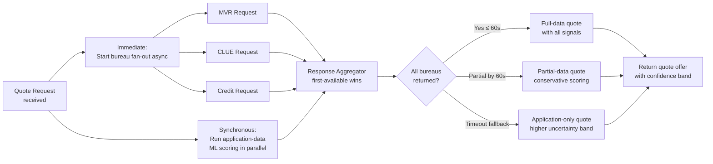
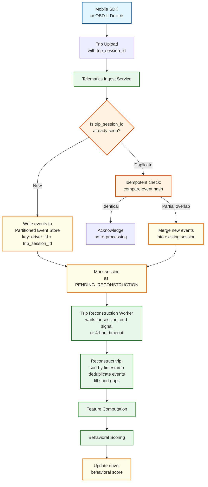
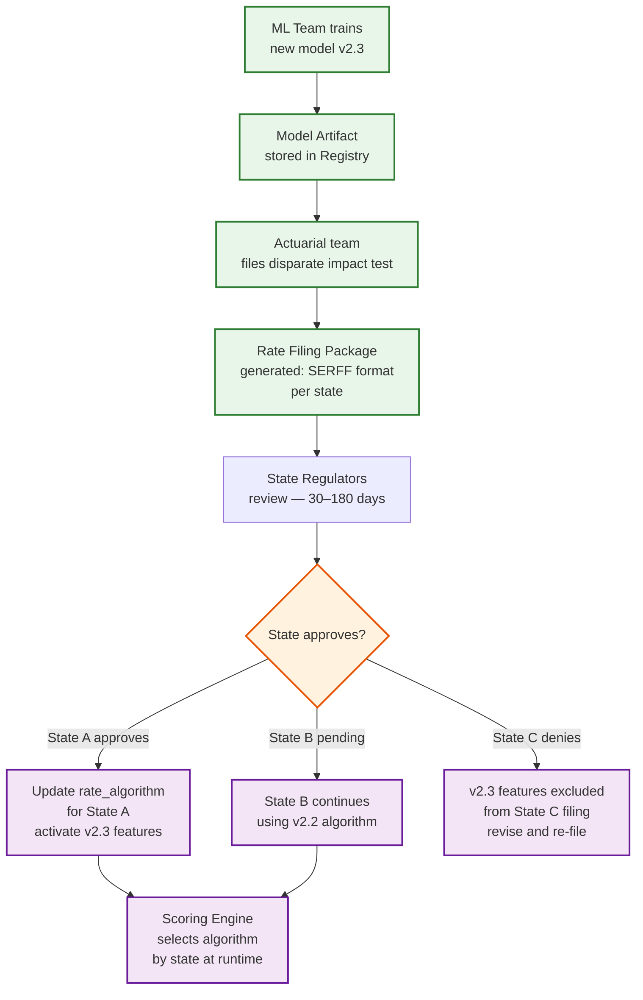

# 12.19 AI-Native Insurance Platform — Deep Dives & Bottlenecks

## Deep Dive 1: Underwriting Pipeline — Bureau Enrichment Latency Problem

### The Problem

The most significant Slowest part of the process in the quote-to-bind flow is external bureau enrichment. Motor Vehicle Record (MVR) providers, CLUE (property loss history) databases, and credit bureaus are third-party systems with highly variable response latencies—p50 of 2 seconds, p99 of 45 seconds, and occasional timeouts up to 120 seconds. The customer-facing quote SLO is 90 seconds from submission to bindable offer. With three mandatory bureau calls in sequence, the system would regularly exceed this SLO.

### The Solution: Speculative Pre-Fetch and Parallel Fan-Out



Bureau calls are fired immediately upon quote request receipt, in parallel, before any ML scoring begins. The quote returns as soon as the ML scoring finishes AND either all bureaus have responded OR the timeout threshold is reached (60 seconds). For timed-out bureaus, the system applies a conservative score adjustment (assumes adverse history was present) and widens the premium uncertainty band, issuing a preliminary offer. The customer can bind on the preliminary offer; the final rate is reconciled within 48 hours when bureau data arrives, with a rebate if the final rate is lower.

### Caching Bureau Responses

MVR and CLUE responses are cached per applicant (keyed by SSN hash) with a configurable TTL (typically 30 days). For renewal underwriting, cached responses are reused if within TTL, avoiding repeat bureau charges. Cache freshness is tracked per record; records within 7 days of TTL expiry trigger a background refresh call so the cache is warm for renewals.

**Credit report caching:** A credit pull is a hard inquiry under FCRA if used for underwriting decisions. The system caches soft pulls for pre-qualification (not rating-determinative) and initiates hard pulls only at policy bind, complying with FCRA requirements.

---

## Deep Dive 2: Telematics Pipeline — Reliable At-Least-Once Ingestion

### The Problem

Telematics data has a peculiar reliability profile: mobile devices are frequently offline during trips (tunnels, dead zones), lose battery power mid-trip, or crash the SDK. Raw events may arrive hours after the trip ends, in batch uploads, or in duplicate due to retry logic. The behavioral scoring system must handle:
- Out-of-order event delivery
- Duplicate events (device retries)
- Partial trips (SDK crash mid-trip)
- Mega-batch uploads (device syncs after 3 days offline)

### The Solution: Idempotent Trip Reconstruction



Each trip is identified by a `trip_session_id` generated on the device at trip start. All events from a trip carry this ID. The ingest service groups events by `(driver_id, trip_session_id)` in the event store. Trip reconstruction waits for a `session_end` event or a configurable timeout (4 hours) before processing—this handles gradual uploads from offline devices. Deduplication is event-level (events carry a device-generated sequence number + hash of raw sensor reading).

### Edge Processing for Bandwidth and Privacy

The mobile SDK performs local trip detection (start/end via still-detection algorithm) and computes trip-level aggregate features on-device before upload. The raw 10Hz GPS trace is not uploaded—only aggregated features plus a sparse set of event markers (hard braking events, phone pick-up events). This reduces upload bandwidth by 95%, protects raw GPS history from server storage, and satisfies data minimization requirements. Raw GPS is available only for opted-in dispute resolution (30-day window) stored encrypted with customer-controlled key.

---

## Deep Dive 3: Fraud Graph — Ring Detection at Scale

### The Problem

Organized insurance fraud rings are characterized by shared participants across multiple claims: the same medical provider billing across hundreds of staged accidents, the same attorney representing 40 claimants in the same zip code, or the same body shop being listed on suspicious claims far outside its service area. These patterns are invisible when scoring each claim in isolation.

### Graph Schema for Insurance Fraud

The fraud graph is a heterogeneous knowledge graph where nodes represent different entity types and edges represent participation in a claim:

```
Node types:       CLAIMANT, VEHICLE, PROVIDER (medical/repair), ATTORNEY,
                  ACCIDENT_LOCATION, BODY_SHOP, INSURANCE_AGENT
Edge types:       INSURED_IN (claimant → vehicle),
                  INJURED_AT (claimant → accident_location),
                  TREATED_BY (claimant → provider),
                  REPRESENTED_BY (claimant → attorney),
                  REPAIRED_AT (vehicle → body_shop),
                  CO_PARTICIPANT (claimant ↔ claimant via same accident)
```

### Batch Ring Detection Algorithm

```
FUNCTION detect_fraud_rings(lookback_days: integer = 90) -> list<ring_lead>:

  // Step 1: Extract subgraph of recent claims (sliding window)
  recent_claims = claims_store.query(
    submitted_after = now() - lookback_days,
    status_in = [UNDER_REVIEW, APPROVED, PAID, SIU_INVESTIGATION]
  )

  // Step 2: Compute suspicion signals per entity
  FOR each provider entity P:
    P.unique_claimant_count = count(distinct claimants via TREATED_BY)
    P.avg_billing_per_claim = sum(claim amounts) / claim_count
    P.geographic_spread = std_dev(accident locations treated)
    P.suspicion_score = 0.0
    IF P.unique_claimant_count > 50 AND P.avg_billing_per_claim > $5000:
      P.suspicion_score += 0.4
    IF P.geographic_spread > 100km:  // treating patients from far away
      P.suspicion_score += 0.3

  // Step 3: Community detection on high-suspicion subgraph
  suspicious_nodes = filter(all_nodes, suspicion_score > 0.3)
  subgraph = fraud_graph.induced_subgraph(suspicious_nodes)

  // Louvain community detection → identifies tight clusters
  communities = louvain_community_detection(subgraph)

  // Step 4: Score each community as a ring candidate
  ring_leads = []
  FOR community IN communities WHERE community.size >= 5:
    ring_score = compute_ring_score(community)
    IF ring_score > 0.7:
      ring_leads.append({
        community_id: community.id,
        entity_count: community.size,
        estimated_fraud_amount: community.sum(claim_amounts),
        key_entities: top_5_by_centrality(community),
        ring_score: ring_score,
        evidence_summary: generate_evidence(community)
      })

  RETURN sort_by(ring_leads, by=estimated_fraud_amount, descending=true)
```

Weekly batch jobs produce investigative leads surfaced to the SIU team. Each lead includes a network visualization, top suspicious entities by centrality, cross-claim evidence summary, and estimated total fraud exposure—enabling investigators to prioritize without manually querying the graph.

---

## Deep Dive 4: Rate Filing — Regulatory Compliance Without Deployment Coupling

### The Problem

Adding a new rating variable (e.g., telematics-derived distraction score) to the underwriting model requires:
1. Actuarial analysis proving the variable is correlated with loss outcomes
2. Disparate impact testing (variable may not proxy for protected class)
3. SERFF filing submission to each state insurance commissioner
4. Regulator approval (typically 30–180 days depending on state)
5. Only then: activating the variable in the production scoring engine

This creates a regulatory review process that is completely decoupled from the ML model development cycle. The ML team may have a better model ready in two weeks; it cannot be deployed for a year while rate filings clear 50 states.

### The Solution: Algorithm Version Registry with State-Gated Activation



The production scoring engine never directly references an ML model artifact—it references an `approved_algorithm` configuration record keyed by (state, LOB, version). The algorithm config specifies which model artifact to use and which features are enabled. When a new state approves a new algorithm version, a one-line config update (new algorithm record) activates it for that state without any code deployment. States in different approval stages run different algorithm versions simultaneously in the same production infrastructure.

---

## Slowest part of the process Analysis

| Slowest part of the process | Manifestation | Mitigation |
|---|---|---|
| **Bureau enrichment latency** | Quote completion SLO breached; customers abandon | Parallel fan-out; cached responses; preliminary quote with reconciliation |
| **Fraud GNN subgraph retrieval** | FNOL acknowledgment delayed > 3 seconds | In-memory hot entity cache; indexed 2-hop subgraph queries; async write-back |
| **Telematics event burst at commute peak** | Event stream backlog; behavioral scores stale | Consumer group horizontal scaling; trip reconstruction timeout window buffers bursts |
| **Rate filing state multiplicity** | Model deployment blocked waiting for 50-state approval | Algorithm version registry; state-gated activation; partial rollout by state |
| **Photo damage assessment throughput** | Claims requiring CV assessment queue up during CAT events | GPU auto-scaling for CV pipeline; triage by claim size (skip CV for micro-claims) |
| **SHAP attribution compute latency** | Adverse action notice generation delayed | SHAP computation async after scoring; queued for background completion |
| **Fraud ring detection batch job** | Weekly batch too slow for very large graphs | Incremental community detection (add new claim nodes to existing communities); CAT event real-time ring alert |

---

## Failure Mode Analysis

### Failure Mode 1: Model Ensemble Disagree — GLM and GBM Produce Divergent Risk Scores

**Trigger:** Applicant profile is in a sparse region of the training data where GLM (linear model) and GBM (gradient boosting model) disagree by more than 2 risk tiers.

**Symptom:** Quote engine receives divergent scores. If ensemble uses simple averaging, the final score may be meaningless — neither conservative nor aggressive.

**Impact:** Mispriced premium. Customer binds at an underpriced rate (if average is too low) or abandons an overpriced quote (if average is too high).

**Recovery:**
```
FUNCTION handle_model_disagreement(glm_score, gbm_score, telematics_score):
    divergence = abs(glm_score - gbm_score) / max(glm_score, gbm_score)

    IF divergence > 0.30:  // >30% disagreement
        // Do not average — flag for review
        LOG_WARN("Model divergence: GLM={glm_score}, GBM={gbm_score}")
        EMIT_METRIC("model_disagreement", labels={divergence_band=HIGH})

        // Conservative fallback: use the higher-risk score
        final_score = MAX(glm_score, gbm_score)

        // Widen the premium band (+/-15%) to reflect uncertainty
        premium_band = compute_premium(final_score) * [0.85, 1.15]

        // Flag for actuarial review
        risk_record.review_flag = "HIGH_MODEL_DIVERGENCE"
        RETURN final_score, premium_band

    ELSE:
        // Normal weighted ensemble
        final_score = 0.30 * glm_score + 0.45 * gbm_score + 0.25 * telematics_score
        RETURN final_score, standard_band
```

### Failure Mode 2: Fraud Graph Database Unavailable at FNOL

**Trigger:** Graph database node failure or network partition between claims service and graph DB.

**Symptom:** Fraud scorer cannot retrieve 2-hop subgraph. FNOL path blocks waiting for fraud score (3-second SLO).

**Impact:** Either FNOL acknowledgment is delayed (SLO breach) or claim proceeds without fraud scoring (payment risk).

**Recovery:**
- **Immediate:** Switch to rule-based fraud scoring (no graph features). Rule-based model uses claim-level features only (claim amount, loss type, time-of-day, claimant history from relational DB). Produces a coarser fraud score but runs in <100ms.
- **Queued:** Mark claim for graph-based re-scoring when graph DB recovers. If re-scoring raises the fraud tier, claim is pulled from payment queue and routed to adjuster.
- **Monitoring:** Alert if graph DB unavailability exceeds 5 minutes. Page if exceeds 15 minutes (regulatory risk — claims proceeding without full fraud assessment).

### Failure Mode 3: Bureau Provider Returns Stale or Incorrect Data

**Trigger:** MVR provider returns a record for a different person (name collision on a common name) or returns a 5-year-old record as current.

**Symptom:** Underwriting model scores with incorrect input. Customer may be overcharged or undercharged.

**Impact:** Regulatory risk (adverse action based on incorrect data). Financial risk (mispriced policy). Customer experience risk (customer disputes incorrect rate).

**Mitigation:**
```
FUNCTION validate_bureau_response(request, response):
    // Cross-reference validation
    IF response.full_name != request.full_name:
        IF fuzzy_match(response.full_name, request.full_name) < 0.90:
            FLAG_MISMATCH("name_mismatch", request, response)
            RETURN BUREAU_REJECTED

    IF response.dob != request.dob:
        FLAG_MISMATCH("dob_mismatch", request, response)
        RETURN BUREAU_REJECTED

    // Freshness validation
    IF response.report_date < now() - 90_days:
        LOG_WARN("Stale bureau response: {response.report_date}")
        FLAG_STALE(response)
        // Still usable but flag for reconciliation at bind

    // Consistency check: cross-bureau signals
    IF mvr_response.violations > 0 AND credit_response.derogatory_count == 0:
        // Not necessarily inconsistent — but worth logging for actuarial analysis
        LOG_INFO("Uncorrelated bureau signals: MVR violations without credit derogatory")

    RETURN BUREAU_ACCEPTED
```

### Failure Mode 4: Telematics Score Poisoning via Spoofed Sensor Data

**Trigger:** Policyholder uses a GPS spoofing app or modified SDK to report artificially safe driving behavior.

**Symptom:** Behavioral score improves dramatically. Premium decreases. Actual driving risk unchanged.

**Impact:** Underpriced policy. If widespread, the telematics-enrolled pool's loss ratio degrades toward the unenrolled pool, destroying the behavioral pricing advantage.

**Mitigation:**
- **On-device attestation:** SDK verifies device integrity (no rooting, no GPS mocking detected). Attestation fails → trips marked as unverified.
- **Physics-based anomaly detection:** Accelerometer data that is inconsistent with GPS trajectory (smooth GPS with no accelerometer events → likely spoofed).
- **Trip plausibility scoring:** Trips that show implausibly consistent behavior (zero hard brakes over 1000 miles) are flagged.
- **Cross-signal validation:** Trips where reported speed exceeds road speed limits for the GPS location by >20% are flagged.

### Failure Mode 5: SHAP Explainability Drift — Explanations Don't Match Model Behavior

**Trigger:** SHAP computation uses an approximation (KernelSHAP, TreeSHAP) that diverges from the model's actual decision boundary in a specific input region.

**Symptom:** Adverse action notice cites "driving record violations" as the primary reason, but the actual dominant feature was "credit score" (which happens to be correlated with the MVR in that population).

**Impact:** FCRA compliance risk — consumer receives an adverse action notice with incorrect reason codes. If challenged, the insurer cannot defend the reasons provided.

**Mitigation:**
- Use model-native SHAP (TreeSHAP for GBM) rather than model-agnostic approximations where possible
- Run periodic validation: for 1% of decisions, compare SHAP top-3 features against perturbation-based feature importance. Alert if divergence >20%
- Store both SHAP attribution AND the complete feature vector in the risk score record, enabling post-hoc re-explanation if challenged

---

## Race Conditions

### Race 1: Renewal Pricing During Active Trip

**Scenario:** Billing cycle runs renewal pricing at the exact moment a driver is completing a trip. The behavioral scorer is processing the trip. The pricing engine reads the behavioral score store, which reflects the pre-trip score.

**Impact:** Renewal premium computed on stale behavioral score. Customer's improved driving in the just-completed trip is not reflected.

**Mitigation:** Accept the race — the behavioral score updates within 30 minutes, and the next billing cycle (monthly) will incorporate it. Document in customer-facing materials that "behavioral score updates are reflected at the next billing cycle." This is operationally acceptable because the delta from a single trip is typically <2% of the behavioral score.

### Race 2: Concurrent Bureau Responses and Model Inference

**Scenario:** Bureau calls return at different times. The aggregator starts model inference when the first two bureaus (MVR, CLUE) return. The third bureau (credit) returns mid-inference with data that would change the feature set.

**Impact:** Model runs without credit data. If the state's approved algorithm requires credit data, the score may be invalid.

**Mitigation:** The response aggregator waits for all required bureaus (as defined by the state's algorithm) or the 60-second timeout, whichever comes first. Inference does not start until the feature set is complete for the target state's algorithm. Missing required bureaus trigger the partial-data pathway (conservative scoring + reconciliation).

### Race 3: Fraud Graph Update During GNN Inference

**Scenario:** A new claim is added to the fraud graph (creating new edges) while a GNN inference is running on an overlapping subgraph.

**Impact:** GNN inference runs on a stale subgraph. The new claim's edges (which might reveal a ring pattern) are not reflected.

**Mitigation:** Accept the race — the claim being scored in this FNOL cycle is not the new claim that was just added. The new claim will be scored on its own FNOL with the updated graph. Weekly batch ring detection will catch any ring patterns that emerge from the combination.

---

## Algorithm Complexity Analysis

### Fraud Ring Detection Scalability

```
Batch ring detection on full fraud graph:

  Graph size: 12M nodes, 500M edges
  Louvain community detection: O(n × log(n)) where n = nodes in suspicious subgraph
  Pre-filtering (suspicion scoring): O(n + m) where m = edges = 500M
  Suspicious subgraph: typically 1-5% of full graph = 120K-600K nodes

  Community detection on 600K nodes: ~30 minutes on single node
  Ring scoring per community: O(k^2) where k = community size (avg 20)
  Total communities: ~10,000
  Ring scoring total: 10,000 × 20^2 = 4M operations → <1 minute

  Total batch job: ~35 minutes → fits in weekly batch window
  Incremental variant (add new claims only): ~5 minutes
```

### Quote Scoring Pipeline End-to-End Latency Budget

```
Total budget: 200ms for scoring (excluding bureau enrichment)

  Feature extraction from application data:        5ms
  Feature extraction from telematics store:         20ms (cache read)
  Feature extraction from bureau responses:         5ms (deserialization)
  Prohibited factor enforcement:                    1ms
  GLM inference:                                    5ms (CPU)
  GBM inference:                                   30ms (CPU)
  Telematics neural net inference:                  45ms (GPU)
  Ensemble aggregation:                             2ms
  Risk score record write (async start):            5ms (fire-and-forget, committed before bind)
  Premium computation:                             10ms
  Response serialization:                           5ms
  ────────────────────────────────────────────
  Total:                                          133ms → 67ms headroom for variance
```

---

## Real-World Case Studies

### Case Study 1: Lemonade's 3-Minute Claims Payment

**Problem:** Lemonade set the industry benchmark with a 3-minute claims payment for qualifying claims.

**Approach:**
- Chatbot collects structured FNOL via a state-machine driven conversation (not open-ended NLU)
- Claims under $1,000 with no fraud indicators are auto-approved
- Payment initiated via API to bank transfer rails
- Fraud detection runs in parallel — if fraud is detected after payment, recovery process initiates

**Key Lesson:** Straight-through payment works because the claims population for a digital-first insurer is self-selected: customers who file through a chatbot (vs. calling an agent) tend to be younger, tech-savvy, and filing smaller claims. The fraud rate on this population is lower than the general claims population, enabling aggressive auto-approval thresholds.

### Case Study 2: Root Insurance's Telematics-First Underwriting

**Problem:** Root Insurance built underwriting around smartphone-based telematics as the primary risk signal, not just a discount factor.

**Approach:**
- "Test drive" period: 2-3 weeks of driving data collected before quoting
- Behavioral features (hard braking, phone usage, time-of-day driving) are the primary rating variables
- Traditional actuarial factors (age, ZIP, vehicle) are secondary adjustment factors

**Key Lesson:** The test-drive model inverts the quote flow. Traditional: quote first, then add telematics for discount. Root: drive first, then receive a telematics-based quote. This solves the cold-start problem (no telematics data at first quote) but extends the time-to-quote from 90 seconds to 3 weeks — a fundamental UX trade-off that works for price-sensitive customers willing to wait for a better rate.

### Case Study 3: Coalition's Cyber Insurance Underwriting

**Problem:** Coalition uses real-time cybersecurity scanning to underwrite cyber insurance policies — a domain where traditional actuarial loss tables are inadequate because the threat landscape changes weekly.

**Approach:**
- Active risk scanning of the applicant's external attack surface at quote time
- Continuous monitoring of policyholders (not just at underwriting) — mid-term risk changes trigger coverage endorsements
- Claims data feeds directly into the underwriting model within weeks (not the 12-month development lag typical in traditional insurance)

**Key Lesson:** Cyber insurance demonstrates the extreme case of the "real-time/batch duality" — the risk landscape changes so fast that annual retraining is too slow. Coalition retrains on a monthly cadence and uses real-time signals (new vulnerability disclosures) to adjust individual policies mid-term. The architectural pattern of "continuous underwriting" (vs. bind-once-renew-annually) is a preview of where AI-native insurance is heading for all lines.

---

## Performance Optimization Deep Dive

### Bureau Enrichment Optimization

| Optimization | Technique | Impact |
|-------------|-----------|--------|
| **Speculative pre-fetch** | Start bureau calls on quote initiation, not after data collection | Saves 5-10s in the critical path |
| **Cache-aside with TTL** | SSN-keyed cache; 30-day TTL for MVR/CLUE; no cache for credit hard pulls | 60-70% cache hit rate for returning shoppers |
| **Partial result scoring** | Score with available bureaus after 60s timeout; reconcile later | Prevents SLO breach for slow bureaus |
| **Bureau response normalization** | Pre-compute normalized features from bureau response at cache-write time | Eliminates 5ms deserialization cost on cache hit |
| **Batch pre-warm** | For renewal population, fire bureau calls 7 days before renewal date | 95%+ cache hit rate at renewal scoring time |

### GNN Inference Optimization for Fraud Scoring

```
Optimization: Hot entity subgraph caching

  Problem: 2-hop subgraph retrieval from graph DB = 200-500ms
  Solution: Maintain an in-memory hot subgraph cache for entities
            likely to appear in upcoming FNOL submissions

  Cache population strategy:
    1. Active policyholders: pre-load 1-hop neighborhood for all active claimants
    2. High-risk entities: pre-load 2-hop neighborhood for entities with suspicion > 0.5
    3. Recently active: cache subgraphs retrieved in the last 24h (LRU eviction)

  Cache size: ~10GB for top 100K entities with 2-hop subgraphs
  Cache hit rate: 85-90% (most FNOL submissions involve known active policyholders)
  Cache miss penalty: fall back to graph DB query (200-500ms) + populate cache

  Result: p50 subgraph retrieval drops from 300ms to 5ms
          p99 remains ~500ms (cache misses for new/unknown entities)
```

---

## Autonomy Boundary Analysis

### What AI Can Decide Alone
- Document extraction and classification from claim submissions
- Initial claim triage and routing by complexity tier
- Fraud signal detection and flagging for review
- Policy document summarization and comparison
- Auto-population of structured fields from unstructured submissions

### What AI Can Recommend But Not Execute
- Risk scoring and premium adjustment recommendations
- Claim settlement amount estimates
- Policy underwriting risk grades
- Fraud investigation priority rankings
- Reinsurance allocation suggestions

### What Requires Human Approval
- Final underwriting decisions and policy issuance
- Claim approval and settlement disbursement
- Fraud case escalation and investigation outcomes
- Policy cancellation or non-renewal decisions
- Regulatory filing submissions

### Deterministic Source of Truth
The Policy Administration System (PAS) and Claims Management System are the systems of record. AI writes to a recommendation layer only — underwriting decisions, claim settlements, and policy changes require human action through the deterministic insurance workflow.

### Rollback Path
Underwriters and claims adjusters can override any AI-generated score or recommendation. Full audit trail preserves AI assessments, human overrides, and decision rationale for regulatory compliance and actuarial review.
