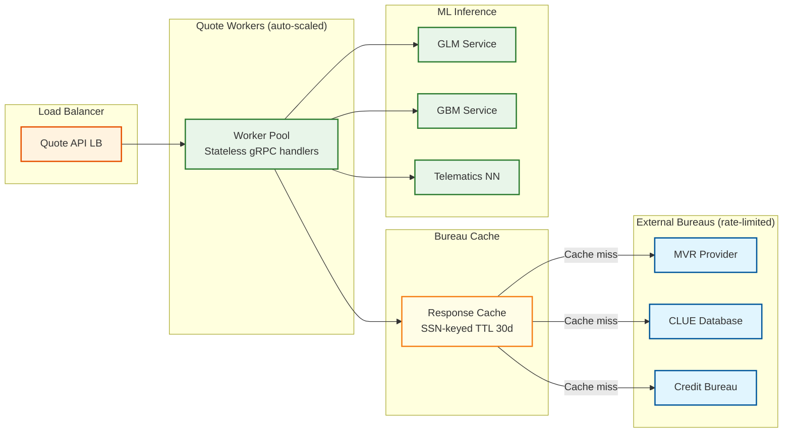
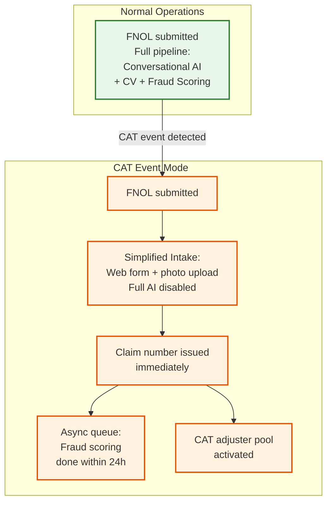
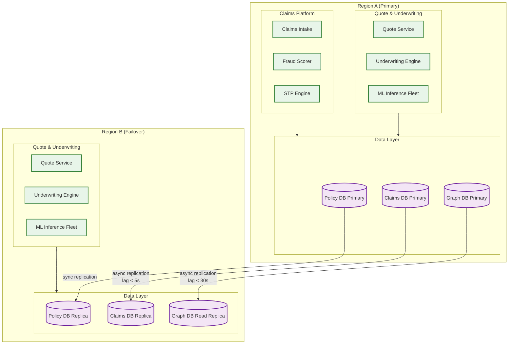

# 12.19 AI-Native Insurance Platform — Scalability & Reliability

## Scaling Dimensions

The platform has four independent scaling concerns that must each be addressed separately:

1. **Quote burst scaling** — Marketing campaigns, end-of-month deadlines, and price comparison site surges produce 10–50× baseline quote volume within minutes
2. **Telematics ingest scaling** — Commute-hour spikes produce 3× baseline event volume; CAT events produce no burst (claims dominate, not telematics)
3. **Claims CAT event scaling** — Hurricanes, wildfires, and hailstorms can produce 100× normal FNOL volume within hours of event onset
4. **Fraud graph scaling** — Steady growth of entity graph over years; query performance degrades as graph density increases

---

## Quote Burst Scaling

### Architecture

The quote service is stateless and horizontally scalable. Each quote request is handled by a worker that fans out bureau calls, awaits results, runs inference, and returns a response. The Slowest part of the process is not compute but external bureau rate limits.



**Bureau rate limit management:** Each bureau has a contractual API rate limit (e.g., 500 requests/minute for MVR). At burst time, the quote service maintains a token bucket per bureau. When the token bucket is exhausted, new quote requests join a short-lived priority queue (tiered by customer acquisition source: direct channel > comparison aggregator). The preliminary quote pathway (application-data-only scoring) is available immediately for customers still within their quote session, providing an initial offer while bureau data is awaited.

**Auto-scaling trigger:** Managed container orchestration scales quote workers on CPU utilization and queue depth. Scale-out lead time is approximately 90 seconds. To handle instant spikes (marketing campaign launch), a warm pool of pre-initialized workers (10× normal capacity) is maintained during high-risk windows (end-of-month, advertised promotions).

---

## Telematics Ingest Scaling

### Partition Strategy

The event stream is partitioned by `driver_id`. This ensures all events for a single driver's trip land on the same partition, enabling stateful trip reconstruction within a single consumer without cross-partition coordination.

```
Partition count: 256 partitions
Average drivers per partition: 1.5M / 256 = ~5,900 drivers
Peak events per partition: 104,000 / 256 = ~406 events/sec
Events per partition at 200-byte average: 81 KB/sec — well within partition capacity
```

Consumer group horizontal scaling: trip processor workers consume from partition subsets. Adding workers redistributes partition assignments. Trip reconstruction state is held in a local in-process store (single-driver trip data rarely exceeds 50 KB) with checkpoint writes to a distributed KV store for crash recovery.

### Backpressure Handling

During commute spikes, the event stream provides natural buffering. The trip processor does not need to keep up in real-time—a behavioral score update within 30 minutes of trip completion satisfies the SLO. The consumer lag metric (events behind latest offset) is the primary scaling signal. If consumer lag exceeds 5 minutes of events, additional trip processor workers are added.

---

## Claims CAT Event Scaling

### The CAT Problem

A Category 4 hurricane making landfall produces an estimated 50,000 FNOL submissions within the first 6 hours—a 300× multiple over the 16,400 claims-per-day baseline. This is not a sustained load; it is a multi-hour burst that must be absorbed without losing any FNOL submission (lost claims create regulatory and reputational damage).

### CAT Response Architecture



**CAT mode activation:** When the geospatial claims density detector identifies > 500 FNOL submissions within a 50-mile radius in 60 minutes, CAT mode is triggered automatically. Conversational AI intake is replaced by a simplified structured web form. Fraud scoring shifts from synchronous (blocking payment) to asynchronous (scored within 24 hours). Claims are assigned to a pre-contracted CAT adjuster pool. Straight-through payment is suspended for affected region pending fraud review.

**FNOL queue durability:** All FNOL submissions write to a durable event queue before any downstream processing. This decouples intake acknowledgment (immediate) from processing capacity (scaled separately). During CAT events, the intake queue may have a multi-hour backlog; this is expected and acceptable as long as the queue does not drop messages.

---

## Model Serving Reliability

### Graceful Degradation Tiers

The underwriting engine is designed with three degradation tiers:

| Tier | Models Available | Behavior | When Triggered |
|---|---|---|---|
| **Full** | GLM + GBM + Telematics NN | Normal underwriting; full ensemble | Healthy |
| **Partial** | GLM + GBM only | Telematics score substituted with population average; slightly wider premium band | Telematics NN unavailable |
| **Minimum** | GLM only | GBM result used from last successful run if within 24h; else conservative GLM-only premium | GBM service unavailable |
| **Manual** | None | All quotes routed to manual underwriting queue; online binding suspended | All models unavailable |

GLM is a simple logistic regression that runs on CPU with sub-5ms latency and requires no GPU infrastructure—it is the reliability anchor. GBM runs on CPU clusters. Only the telematics neural net requires GPU. This tier structure means a GPU outage degrades telematics scoring but does not stop quoting.

### Multi-Region Deployment

The scoring infrastructure is deployed across two active regions with policy database replicated synchronously. Risk score records are written with a two-phase commit across regions before the quote is confirmed as bindable. The policy database uses active-passive replication with sub-5-second failover (DNS-based, pre-warmed).

Claims processing can tolerate eventual consistency for most operations (adjuster notes, document uploads) but requires strong consistency for payment initiation (no double-payments). Payment initiation uses a distributed idempotency token (claim_id + payment_attempt_number) and calls the payment processor with exactly-once semantics enforced by the idempotency key.

---

## Database Sharding Strategy

### Policy Database

Sharded by `policyholder_id` modulo shard count. This ensures all policies for a single customer are co-located (supporting customer-centric queries) and distributes write load across shards. Cross-shard queries (e.g., "all policies in state X for regulatory report") are served by the data warehouse (eventual consistency acceptable for regulatory reports with 30-day delay).

### Claims Database

Sharded by `claim_id`. Claims are accessed by ID after FNOL; no customer-centric query pattern requires cross-shard access at transaction time. Exception: customer portal "view my claims" query runs against read replicas with cross-shard scatter-gather.

### Fraud Graph

The graph database is not sharded—graph traversals require global visibility. The fraud graph is scaled vertically (large in-memory graph DB) with a read replica for GNN inference and a primary for writes. At 76 GB estimated graph size, a single well-provisioned graph DB node is sufficient. Horizontal sharding of graph databases introduces prohibitive cross-shard traversal latency for 2-hop neighbor queries.

---

## SLO-Driven Capacity Planning

| SLO | Capacity Driver | Headroom Target |
|---|---|---|
| Quote p99 ≤ 200ms (scoring) | ML inference fleet CPU/GPU | 3× peak demand |
| FNOL p99 ≤ 3s fraud score | Fraud graph in-memory hot entities | Top 100K entities pre-loaded |
| Telematics score freshness ≤ 30min | Trip processor consumer lag | ≤ 10 min at sustained peak |
| CAT FNOL queue no loss | Intake queue replication | Cross-region durable queue |
| Policy DB write durability | Synchronous multi-region replication | Commit blocked until both regions ACK |

---

## Multi-Region Deployment

### Architecture



### Region Failover Strategy

| Component | Failover Mechanism | RPO | RTO |
|-----------|-------------------|-----|-----|
| Policy database | Synchronous replication; promote replica to primary | 0 | 30 seconds (DNS failover) |
| Claims database | Async replication; promote with potential 5s data lag | 5 seconds | 2 minutes |
| Fraud graph | Read replica in secondary region; writes queued during failover | 30 seconds | 5 minutes (graph rebuild) |
| Quote service | Active-active; DNS-based routing | 0 | 0 (transparent) |
| ML inference fleet | Independent fleet per region | 0 | 0 (independent) |
| Bureau enrichment cache | Region-local cache; cold start on failover | N/A (repopulates on demand) | Gradual (as quotes arrive) |
| Telematics pipeline | Per-region event stream; no cross-region dependency | 0 | 30 seconds |

---

## Back-Pressure Mechanisms

### Mechanism 1: Quote Service Under Bureau Rate Limit Exhaustion

```
FUNCTION quote_back_pressure(bureau_provider, request):
    tokens = bureau_rate_limiter.try_acquire(bureau_provider)

    IF tokens > 0:
        RETURN bureau_api.call(request)

    // Rate limit exhausted — engage tiered back-pressure
    IF request.channel == DIRECT_CONSUMER:
        // High-priority: queue with 30s timeout
        RETURN bureau_queue.enqueue(request, timeout=30s, priority=HIGH)

    IF request.channel == COMPARISON_AGGREGATOR:
        // Lower priority: immediate partial quote (no bureau)
        RETURN generate_partial_quote(request, reason="BUREAU_RATE_LIMIT")

    IF request.channel == RENEWAL_BATCH:
        // Lowest priority: defer to next batch window
        RETURN DEFERRED
```

### Mechanism 2: Claims Pipeline During CAT Event

```
FUNCTION claims_cat_back_pressure(fnol_request):
    IF NOT cat_mode_active:
        RETURN process_full_pipeline(fnol_request)

    // CAT mode: simplified intake, deferred scoring
    claim_number = generate_claim_number()
    claim_record = {
        claim_number: claim_number,
        fnol_data: fnol_request.structured_fields,
        status: PENDING_SCORING,
        cat_event_id: active_cat_event.id,
        intake_mode: SIMPLIFIED
    }

    // Durable write — claim is persisted before acknowledgment
    claims_db.write(claim_record)

    // Acknowledge immediately — scoring deferred
    RESPOND_TO_CUSTOMER(claim_number, estimated_contact_time="24-48 hours")

    // Queue for async processing
    fraud_scoring_queue.enqueue(claim_number, priority=LOW)
    cv_assessment_queue.enqueue(claim_number, priority=LOW_IF_UNDER_5K)
    adjuster_assignment_queue.enqueue(claim_number, cat_adjuster_pool=true)
```

### Mechanism 3: Telematics Ingest During Peak Commute

```
FUNCTION telematics_ingest_back_pressure(event_batch):
    consumer_lag = get_consumer_lag_minutes()

    IF consumer_lag < 5:
        // Normal: process all events
        RETURN process_full_features(event_batch)

    IF consumer_lag < 15:
        // Moderate lag: skip optional features
        RETURN process_core_features_only(event_batch)
        // Core: speed, hard braking, distance
        // Skipped: phone usage detection, detailed turn analysis

    IF consumer_lag > 15:
        // High lag: aggregate in-flight, skip per-event analysis
        RETURN process_trip_summary_only(event_batch)
        // Only compute: total distance, trip duration, harsh event count
        // Full re-processing scheduled for off-peak window
```

---

## Chaos Engineering Experiments

### Experiment 1: Bureau Provider Outage

**Hypothesis:** When the primary MVR provider is unreachable for 15 minutes, the quote engine falls back to cached responses and partial-data scoring, maintaining the 90-second SLO for 95% of quotes.

**Injection:** Block network access to MVR provider API.

**Validation:**
- Cache hit rate for MVR responses
- Percentage of quotes completing within 90 seconds
- Partial-quote flag rate
- Customer bind rate during degradation (should decrease but not to zero)

### Experiment 2: Fraud Graph Latency Spike

**Hypothesis:** When graph DB query latency increases to 3 seconds (from normal 300ms), the fraud scorer automatically switches to rule-based fallback, keeping FNOL acknowledgment within the 3-second SLO.

**Injection:** Introduce artificial latency (2.7s) on graph DB network interface.

**Validation:**
- FNOL acknowledgment latency remains <3s
- Fraud scoring mode switches from graph-based to rule-based
- Claims flagged for graph-based re-scoring after recovery
- No fraudulent claim payments during degradation window

### Experiment 3: ML Inference Fleet Partial Failure

**Hypothesis:** Loss of 50% of GPU nodes does not prevent quoting — the system degrades to GLM+GBM scoring (no telematics neural net) and continues serving quotes.

**Injection:** Terminate 50% of GPU inference pods.

**Validation:**
- Quote engine switches to Partial degradation tier
- GLM+GBM scoring latency remains <100ms
- Telematics scores use cached values (last successful computation)
- Premium uncertainty band widens by 15%

### Experiment 4: CAT Event Simulation

**Hypothesis:** Injecting 10,000 FNOL submissions in 1 hour (from a concentrated geographic area) automatically triggers CAT mode within 5 minutes and processes all submissions without loss.

**Injection:** Generate synthetic FNOL submissions geo-located in a 50-mile radius.

**Validation:**
- CAT mode triggers automatically (geospatial density detector)
- All 10,000 FNOLs acknowledged with claim numbers
- No FNOL lost from durable queue
- Fraud scoring deferred (async queue grows, not blocking)
- Adjuster pool notification sent

### Experiment 5: Policy Database Failover

**Hypothesis:** Primary policy DB failure triggers failover to replica within 30 seconds. In-flight quote binds retry automatically and succeed within 60 seconds.

**Injection:** Terminate primary policy DB instance.

**Validation:**
- Failover detected within 10 seconds
- DNS switches to replica within 30 seconds
- In-flight bind transactions retry and succeed
- No double-bind (idempotency key prevents duplicate policies)
- Risk score records durably committed in secondary before bind confirmation

---

## Capacity Planning Formulas

### Quote Infrastructure Sizing

```
quote_workers = peak_concurrent_quotes × (1 + headroom_factor) / workers_per_instance

Example:
  peak_concurrent_quotes = 1,440 (16 QPS × 90s average lifetime)
  headroom_factor = 2.0 (handle 3× burst)
  workers_per_instance = 50 (each instance handles 50 concurrent quotes)

  quote_workers = 1,440 × 3 / 50 = 86 instances → round to 100

ML inference fleet:
  GPU instances = peak_concurrent_quotes × telematics_nn_probability / gpu_throughput
  = 1,440 × 0.7 (70% have telematics) / 500 RPS per GPU × headroom(3)
  = 1,440 × 0.7 × 3 / 500 = 6 GPU instances (right-sized)
```

### Telematics Storage Growth

```
Monthly growth:
  Trip records: 15M trips × 1KB = 15 GB/month
  Behavioral scores: 1.5M drivers × 4KB update/month = 6 GB/month
  Raw events (30-day hot window): 34,700 events/sec × 200 bytes × 86,400 sec × 30 = 18 TB
  Compressed hot store: 18 TB × 0.02 (compression ratio) = 360 GB

Annual growth (cold archive):
  Trip records: 180 GB
  Behavioral scores: 72 GB
  Raw events (if opted-in for archive): ~1 TB compressed

7-year regulatory retention:
  Trip records: 1.3 TB
  Behavioral scores: 500 GB
  Total cold archive: ~10 TB (manageable in object storage)
```

### Fraud Graph Memory Sizing

```
Current: 12M nodes × 500B + 500M edges × 100B = 56 GB
Growth: ~2M new nodes + 50M new edges per year

Year 1: 56 GB
Year 2: 56 + (2M × 500B) + (50M × 100B) = 56 + 1 + 5 = 62 GB
Year 5: 56 + 4 × (1 + 5) = 80 GB
Year 10: ~110 GB → still fits in single 128 GB graph DB node

Breakpoint for horizontal sharding: ~150 GB → estimated ~Year 15
Decision: vertical scaling sufficient for foreseeable future
```

---

## AI Release Ladder

Every AI model or capability change MUST follow this rollout sequence:

| Stage | Description | Gate Criteria |
|-------|-------------|---------------|
| 1. Offline Evaluation | Benchmark against historical ground truth | Meets baseline metrics |
| 2. Shadow Mode | Run in parallel, compare to production | No regression on key metrics |
| 3. Canary (Blast-Radius Capped) | 1-5% traffic, human review of all outputs | Error rate < threshold |
| 4. Human-Reviewed Production | AI recommends, human approves all actions | Approval rate > 90% |
| 5. Limited Autonomous Production | AI acts within pre-approved boundaries | Continuous monitoring |
| 6. Instant Rollback | One-click revert to previous model/rules | < 5 min rollback time |

**Regulatory constraint:** Under insurance regulatory frameworks (state/national insurance commissions), Stage 5 is limited to low-risk administrative tasks (document classification, triage routing). All underwriting decisions and claim settlements must remain at Stage 4 with mandatory human review. Rate-filing changes require regulatory approval before deployment.

---

## Data Lifecycle Management

### Policy Data Lifecycle

| State | Duration | Storage | Access Pattern |
|-------|----------|---------|----------------|
| Active policy | Policy life (1-5 years) | Primary relational DB (hot) | Transactional reads/writes |
| Expired/cancelled | 7 years post-expiry (regulatory) | Warm archival DB (read-only) | Regulatory audit queries |
| Past retention | After 7 years | Deleted (with cryptographic deletion certificate) | N/A |
| Risk score records | Policy life + 7 years | Immutable append-only store | Regulatory audit (infrequent) |

### Claims Data Lifecycle

| State | Duration | Storage | Access Pattern |
|-------|----------|---------|----------------|
| Open claim | Until resolution | Primary claims DB (hot) | Adjuster workflow (frequent) |
| Closed claim | 7 years post-close | Warm archival DB | Audit, litigation support |
| Photos/documents | 7 years post-close | Object storage (tiered) | Infrequent retrieval |
| Fraud graph nodes | Indefinite | Graph DB | Fraud detection queries |

### Telematics Data Lifecycle

```
FUNCTION manage_telematics_lifecycle(driver_id):
    // Tier 1: Hot (real-time scoring)
    // Trip events < 30 days → hot event store
    // Used for: behavioral score updates, dispute resolution

    // Tier 2: Warm (operational)
    // Trip records 30 days - 12 months → warm relational DB
    // Used for: model retraining features, customer portal

    // Tier 3: Cold (regulatory)
    // Trip records 12 months - 7 years → compressed object storage
    // Used for: regulatory audits, litigation support

    // Tier 4: Deletion
    // After 7 years (or earlier if policy cancelled + 3 years)
    // Cryptographic deletion: overwrite encryption keys
    // Retain: aggregate statistics only (no PII)
```

---

## AI Release Ladder

Every AI model or capability change MUST follow this rollout sequence:

| Stage | Description | Gate Criteria |
|-------|-------------|---------------|
| 1. Offline Evaluation | Benchmark against historical ground truth | Meets baseline metrics |
| 2. Shadow Mode | Run in parallel, compare to production | No regression on key metrics |
| 3. Canary (Blast-Radius Capped) | 1-5% traffic, human review of all outputs | Error rate < threshold |
| 4. Human-Reviewed Production | AI recommends, human approves all actions | Approval rate > 90% |
| 5. Limited Autonomous Production | AI acts within pre-approved boundaries | Continuous monitoring |
| 6. Instant Rollback | One-click revert to previous model/rules | < 5 min rollback time |

**Regulatory constraint:** In this regulated domain, Stage 5 (autonomous production) requires explicit regulatory approval and may not apply to all decision types. Under state insurance regulations and FCRA, all underwriting, pricing, and claims decisions with consumer impact must remain at Stage 4 with mandatory human oversight and actuarial review. Rate filing approval is required before deploying any model change that affects premium calculation.
