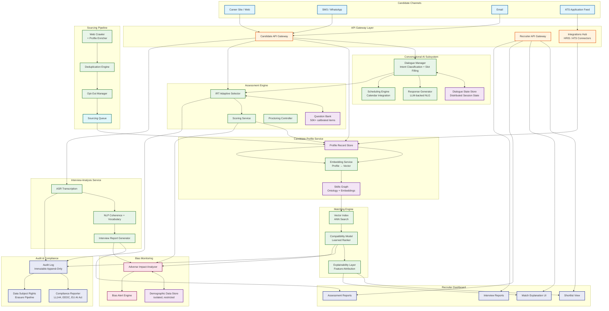
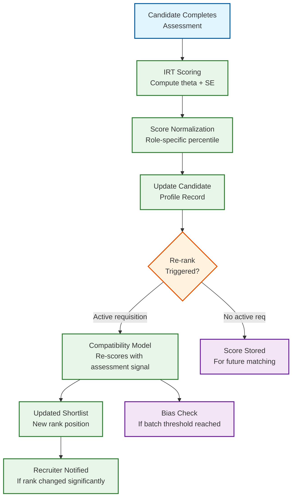
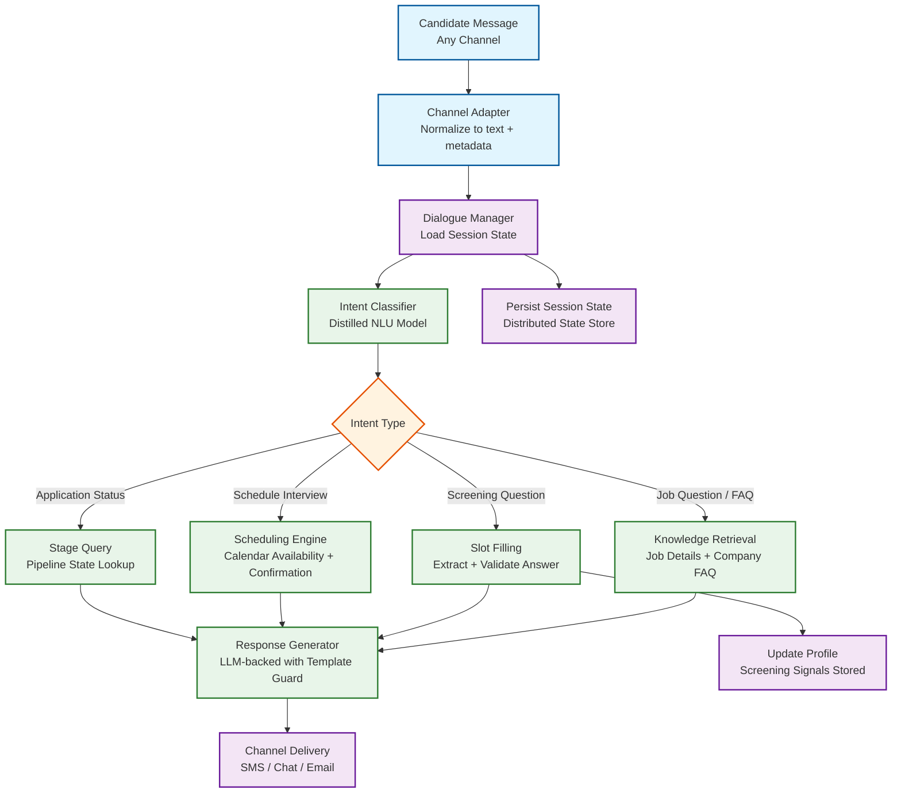
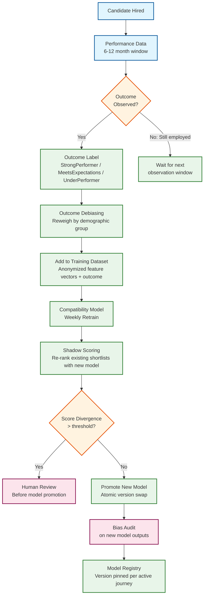
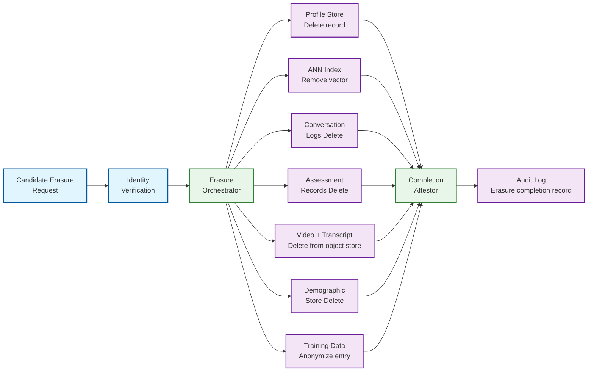

# 12.20 AI-Native Recruitment Platform — High-Level Design

## System Architecture

---

## Key Design Decisions

### Decision 1: Skills Graph as the Shared Semantic Foundation

All subsystems that reason about candidate fit—sourcing query expansion, matching embedding space, assessment item tagging, and career path inference—share a common skills ontology and skills graph. The skills graph maps explicit skills (Python, Kubernetes) to adjacent skills (container orchestration, cloud-native development) and inferred competency clusters through learned co-occurrence from millions of job descriptions and career trajectories. Rather than building separate feature engineering pipelines per subsystem, every skill representation is grounded in this shared graph, ensuring that improvements to the ontology (new skill added, incorrect adjacency corrected) propagate uniformly across sourcing, matching, and assessment.

**Implication:** Avoids the data model drift problem where different subsystems develop conflicting representations of "the same skill." Enables compound learning: a well-calibrated assessment item teaches the matching engine what a particular skill actually looks like in practice.

### Decision 2: Embedding-Based Matching with a Learned Compatibility Layer

Pure embedding cosine similarity (candidate vector vs. job vector) captures semantic skill overlap but fails to capture hiring team preferences, role seniority fit, culture dimensions, and the historical fact that certain skill combinations predict success for this specific organization. The system uses ANN (approximate nearest neighbor) search for recall—retrieving the top-K semantically similar candidates—and then a learned compatibility model (gradient-boosted ranker trained on historical hire outcomes) for precision re-ranking within that candidate set. The two layers are independent: the ANN index can be updated daily without retraining the ranker; the ranker can be retrained weekly without rebuilding the index.

**Implication:** Separation of recall and precision allows independent iteration cycles and isolates the bias surface: the ANN index is trained on skill co-occurrence (neutral); the ranker, which is trained on historical hire outcomes, requires careful bias monitoring and regular retraining with outcome debiasing techniques.

### Decision 3: Conversational AI as the Candidate-Facing Orchestrator

Rather than exposing candidates to a fragmented set of forms, email sequences, and portal logins, a stateful dialogue manager serves as the single conversational interface for all candidate-facing interactions: job discovery, FAQ, application screening, scheduling, assessment delivery, and status updates. The dialogue manager maintains state across channels and time gaps. This design reduces candidate drop-off (each form / portal step is a drop-off event), enables real-time personalization ("I see you applied for role X—would you also be interested in role Y?"), and gives the platform a full structured record of every candidate interaction for compliance and quality analysis.

**Implication:** The dialogue state store becomes a consistency-critical system component. A candidate switching from web to SMS mid-conversation must experience seamless continuity; this requires distributed session state with conflict-free merge semantics, not a simple key-value cache.

### Decision 4: Bias Monitoring as a Synchronous Gate, Not an Offline Report

Adverse impact must be detected before outreach is triggered, not discovered during an annual audit. After each decision batch closes (a batch is defined as one stage transition for one job requisition—e.g., all resume screens for req #4521 this week), the bias monitoring service computes selection rate ratios across demographic categories. If any ratio falls below the 4/5ths threshold with statistical significance (Fisher's exact test, p < 0.05), the batch is flagged and a compliance review is triggered before any rejection notifications or next-stage invitations are sent. This introduces a small delay (up to 5 minutes per batch) but converts the bias check from a retroactive legal defense into a prospective quality gate.

**Implication:** Requires demographic data to be collected at application time (with clear disclosure) and stored in an isolated, access-restricted demographic store separate from the matching features used for ranking. The matching model must never receive demographic attributes as input features.

### Decision 5: Audit Log as Cryptographically Chained Append-Only Store

The audit log is not a traditional application log—it is a legal record with tamper-evidence requirements. Every AI decision, stage transition, bias analysis result, and data access event is appended to a hash-chained log where each entry includes the SHA-256 hash of the previous entry. This design ensures that any modification or deletion of a past entry breaks the hash chain and is immediately detectable.

**Implication:** The audit log has no delete API, no update API, and no compaction. Entries are retained for 7 years (LL144 + EEOC litigation defense horizon). Storage costs are significant (~26 TB/year) but are justified by the regulatory requirement. The log serves three purposes simultaneously: regulatory compliance (LL144, EU AI Act Article 12), debugging (reproducing past decision contexts), and bias investigation (tracing adverse impact to specific model versions and feature vectors).

### Decision 6: Model Version Pinning Per Candidate Journey

When a candidate enters the pipeline for a specific requisition, the current model version is recorded at the (candidate_id, req_id) level. All subsequent evaluations for that journey use the pinned version. This prevents the fairness violation of evaluating candidates for the same role under different criteria due to model upgrades.

**Implication:** The serving infrastructure must support running multiple model versions simultaneously (current production + all pinned versions for active journeys). Memory and compute overhead is ~20% higher than single-version serving, but this cost is necessary to maintain the Rule that never changes that all candidates for the same requisition are evaluated by the same model.

### Decision 7: Multimodal Interview Analysis Without Facial Signals

Video interview analysis extracts value from audio (ASR transcript) and linguistic structure (coherence, domain vocabulary, answer completeness) without analyzing visual signals from the candidate's face. This decision is driven by legal and ethical constraints: facial expression analysis in hiring has been challenged under ADA (deaf candidates), BIPA (Illinois biometric law), and emerging EU AI Act provisions, and has demonstrated racial and gender bias in published research. By restricting analysis to speech and language signals, the platform produces legally defensible, competency-anchored interview reports while eliminating the highest-risk bias surface in video analysis.

**Implication:** Technically limits the signal extracted from video vs. a full multimodal model, but this is the correct trade-off given the legal landscape. Competency scoring based on answer content is more predictively valid than facial expression scoring in controlled research.

---

## Data Flow: Assessment to Matching Score Update

**Assessment-to-match feedback timing:** When a candidate completes an assessment, the compatibility model's feature vector gains a new signal (normalized assessment score). The model is not retrained—the existing model simply receives a richer feature vector for this candidate. The re-ranking happens within 30 seconds of score computation, so the recruiter's shortlist is updated in near-real-time with the new assessment-informed ranking.

---

## System Boundary: What the Platform Owns vs. Integrates

| Capability | Owned by Platform | Integrated (External) |
|---|---|---|
| Candidate profile management | ✓ | — |
| Skills graph ontology | ✓ | — |
| Embedding generation | ✓ | — |
| ANN vector search | ✓ | — |
| Compatibility model training + serving | ✓ | — |
| Conversational AI dialogue management | ✓ | — |
| LLM inference | — | External LLM provider (managed or self-hosted) |
| Calendar integration | — | Enterprise calendar APIs (read/write) |
| ATS synchronization | — | ATS vendor APIs (bidirectional) |
| Video recording infrastructure | — | Video platform (candidate's browser or mobile) |
| ASR transcription | ✓ (domain-adapted) | Base ASR model from provider |
| Background screening | — | Third-party screening vendor |
| Identity verification | — | Third-party identity service |
| Email/SMS delivery | — | Communication platform APIs |
| Object storage (video, artifacts) | — | Cloud object storage service |

---

## Data Flow: Candidate Application to Shortlist

```mermaid
flowchart LR
    A[Candidate Applies] --> B[API Gateway\nConsent + Notice Check]
    B --> C{AEDT notice\ngiven ≥ 10 days?}
    C -->|No| D[Send Notice\nAwait Opt-In or 10-Day Window]
    C -->|Yes| E[Profile Enrichment\nResume Parse + Skills Extraction]
    E --> F[Embedding Service\nGenerate Candidate Vector]
    F --> G[ANN Search\nTop-K Similar Candidates for Req]
    G --> H[Compatibility Model\nRe-rank Top-K]
    H --> I[Bias Monitor\nAdverse Impact Check on Batch]
    I -->|Alert: threshold breach| J[Compliance Hold\nHuman Review Before Outreach]
    I -->|Clear| K[Shortlist Delivered\nto Recruiter Dashboard]
    K --> L[Recruiter Reviews\nWith Match Explanation]
    L --> M[Conversational AI\nEngages Candidate]
    M --> N[Assessment + Interview\nStructured Signals Added]
    N --> O[Updated Shortlist Rank\nCompatibility Model Re-scores]

    classDef input fill:#e1f5fe,stroke:#01579b,stroke-width:2px
    classDef process fill:#e8f5e9,stroke:#2e7d32,stroke-width:2px
    classDef decision fill:#fff3e0,stroke:#e65100,stroke-width:2px
    classDef bias fill:#fce4ec,stroke:#880e4f,stroke-width:2px
    classDef output fill:#f3e5f5,stroke:#6a1b9a,stroke-width:2px

    class A,B input
    class E,F,G,H,M,N,O process
    class C,I decision
    class J bias
    class D,K,L output
```

---

## Data Flow: Conversational Recruiting Session

---

## Component Responsibilities Summary

| Component | Primary Responsibility | Key Interface | Scaling Axis | Failure Mode |
|---|---|---|---|---|
| **Candidate API Gateway** | Channel normalization, authentication, consent enforcement, rate limiting | REST / WebSocket; SMS via webhook adapter | Stateless replicas behind LB | Gateway down → all candidate interactions blocked |
| **Recruiter API Gateway** | Recruiter authentication, shortlist serving, decision recording | REST; session-based auth | Stateless replicas | Gateway down → recruiter dashboard unavailable |
| **Dialogue Manager** | Multi-turn session state management, intent routing, slot filling | Internal gRPC; state persisted to distributed session store | CPU-bound replicas | Crash → session recovery from checkpoint (1 repeated prompt) |
| **Response Generator** | LLM-backed natural language response with template guard | gRPC; receives intent + slots, returns response text | GPU replicas (LLM inference) | LLM down → template fallback |
| **Sourcing Pipeline** | Crawler orchestration, deduplication, opt-out enforcement, enrichment queue | Crawler → queue → profile service; rate-limited per source | Worker pool; per-source rate limit | Crawler stall → no new sourced profiles (no candidate impact) |
| **Opt-Out Manager** | Maintains blocklist; enforces candidate opt-out across all pipelines | Bloom filter for fast lookup; full list in persistent store | Single writer; read replicas | Bloom filter stale → opted-out candidate visible temporarily |
| **Skills Graph** | Shared ontology, skill adjacency model, embedding space foundation | Graph query API; embedding lookup by skill ID or free text | Read replicas; write through coordinator | Graph inconsistency → embedding drift |
| **Embedding Service** | Converts profile or job text into vector space representation | gRPC; called at profile update time and job creation time | GPU replicas | Service down → profiles queued for later embedding |
| **ANN Vector Index** | Approximate nearest neighbor retrieval of candidate vectors for a job vector | HNSW index; rebuilt incrementally; read replica per shard | Sharded by candidate_id hash | Shard loss → reduced recall (N-1 shards serve) |
| **Compatibility Model** | Learned re-ranker: takes top-K ANN candidates and produces ordered shortlist | gRPC inference; gradient-boosted ranker; versioned model artifact | CPU/GPU replicas | Model unavailable → ANN-only ranking (degraded precision) |
| **Explainability Layer** | SHAP feature attribution for match decisions; human-readable explanations | Called post-ranking; results cached per (candidate, req) | CPU replicas; cacheable | Unavailable → shortlist served without explanations |
| **Assessment Engine** | IRT-driven adaptive question selection, session management, scoring | REST session API; question bank loaded in memory per shard | CPU replicas; in-memory item bank | Service down → assessment sessions paused (not lost) |
| **Proctoring Controller** | Monitors assessment integrity; flags anomalous behavior patterns | WebSocket (real-time); event stream to assessment engine | Per-session workers | Down → assessment proceeds without proctoring (flagged) |
| **Interview Analysis Service** | ASR → NLP → competency report pipeline for video submissions | Async; object storage for video input; report written to candidate profile | GPU worker pool (ASR/NLP bound) | Workers down → queue grows; videos safe in object storage |
| **Bias Monitor** | Per-batch adverse impact analysis; alert emission; demographic data query | Reads decision batch events; writes alerts to compliance queue | Single instance per batch (CPU) | Down → decisions held (never released without check) |
| **Demographic Data Store** | Isolated storage for self-reported demographic categories | Restricted read API; only bias_monitor + compliance_reporter | Replicated within AZ | Down → bias monitor circuit breaker opens |
| **Audit Log** | Immutable append-only log of every algorithmic decision | Write-once; append API; no delete path; cryptographic chaining | Append-only; sharded by time | Write failure → **halt all decision services** |
| **Compliance Reporter** | Generates LL144 bias audits, EEOC reports, EU AI Act documentation | Batch job; reads from audit log + demographic store | Batch compute; scheduled | Delayed → audit deadline risk (compliance alert) |
| **GDPR Erasure Pipeline** | Orchestrates data subject erasure across all subsystems | Event-driven; completion attestation per subsystem | Per-request workers | Incomplete erasure → compliance violation |
| **Scheduling Engine** | Calendar integration for interview scheduling via conversational AI | gRPC; reads calendar APIs; writes confirmations | Stateless replicas | Calendar API down → scheduling degraded (manual fallback) |

---

## Data Flow: Hire Outcome Feedback Loop

**Feedback loop timing:**
- Near-term signal (available in 1-2 weeks): recruiter acceptance rate (did recruiter advance AI shortlisted candidates?)
- Medium-term signal (available in 1-3 months): offer acceptance rate, interview-to-offer conversion
- Long-term signal (available in 6-12 months): on-the-job performance ratings from hiring manager

**Debiasing requirement:** Before any outcome label enters the training set, sample reweighting ensures that the joint distribution of outcome and demographic group membership is statistically independent. Without this step, the model learns to reproduce past interviewer biases encoded in historical hire decisions.

---

## Data Flow: GDPR Erasure Pipeline

**Erasure completion Rule that never changes:** The orchestrator marks a request as "complete" only after receiving attestation from every subsystem. If any subsystem fails to attest within 25 days (5 days before the 30-day GDPR deadline), a SEV-1 compliance alert fires. Partial completion is never treated as complete.

---

## Technology Landscape

| Component | Technology Choices | Selection Rationale |
|---|---|---|
| Candidate Profile Store | Distributed document store (sharded by candidate_id) | Flexible schema for evolving profile enrichment fields |
| ANN Vector Index | HNSW-based vector database | Sub-100ms query latency at billion scale with incremental updates |
| Skills Graph | Native graph database | Index-free adjacency for skill traversal; embedding lookup by skill ID |
| Session State Store | Distributed key-value store with CRDT support | Cross-channel session consistency; conflict-free merge semantics |
| Audit Log | Append-only log with cryptographic chaining | Tamper-evident; regulatory retention requirements |
| Video Storage | Object storage with lifecycle policies | Cost-effective for large binary objects; 90-day TTL |
| LLM Inference | Self-hosted or managed LLM endpoint | Controllable latency; data residency compliance |
| Bias Computation | Statistical compute service (batch) | Fisher's exact test, selection rate analysis; not ML inference |
| Job Queue | Distributed message queue with exactly-once delivery | Video analysis, profile enrichment, erasure orchestration |
| Model Registry | Versioned artifact store with promotion workflow | Shadow scoring, A/B rollout, rollback capability |

---

## Architecture Decision Records

### ADR-1: Why Not a Single LLM for Everything?

**Context:** Modern LLMs can perform text similarity, ranking, question answering, and analysis. Why not use a single LLM as the matching engine, assessment scorer, and interview analyzer?

**Decision:** Use purpose-built models for each subsystem, with LLMs only for conversational AI response generation.

**Rationale:**
- **Latency:** Matching 500M candidates requires sub-100ms ANN search. LLM inference per candidate would take ~100ms × 1000 candidates = 100 seconds per match operation.
- **Auditability:** Regulators require per-component model documentation. A single monolithic LLM cannot be audited at the component level for bias.
- **Bias isolation:** The ANN embedding is trained on skill co-occurrence (neutral); the ranker is trained on hire outcomes (bias-sensitive). Mixing these training objectives in one model makes bias correction impossible.
- **Cost:** LLM inference for 10M match operations per day at ~$0.003 per inference = $30,000/day for matching alone. Purpose-built models cost ~$500/day for the same volume.

### ADR-2: Why CRDT Session State Instead of Traditional Database?

**Context:** Conversational AI session state must support concurrent writes from multiple channels and survive cross-channel switches.

**Decision:** Use a CRDT-based distributed key-value store for session state instead of a traditional relational database.

**Rationale:**
- **Concurrent writes:** When a candidate sends SMS and email within seconds, both channel adapters write to the session simultaneously. Traditional databases require distributed locking; CRDTs merge writes automatically.
- **Availability over consistency:** Session state is more valuable available (with potential short-term staleness) than consistent (with potential unavailability). CRDTs guarantee availability under partition.
- **Conflict detection:** CRDTs can track concurrent writes and flag conflicts (two different answers to the same question), enabling the clarification prompt pattern.

### ADR-3: Why Synchronous Bias Gate Instead of Async Monitoring?

**Context:** Bias monitoring could run asynchronously after decisions are released, catching violations retroactively.

**Decision:** Bias monitoring is a synchronous gate that blocks decision release until analysis completes.

**Rationale:**
- **Irreversibility:** Once a rejection email is sent, the damage is done. Retroactive detection of adverse impact cannot un-reject a candidate.
- **Legal defense:** Proactive detection demonstrates good faith to regulators. Retroactive-only monitoring is viewed as insufficient diligence.
- **Latency cost:** The synchronous gate adds ≤ 5 minutes per batch — acceptable for a process where recruiter review takes hours or days anyway.
- **Trade-off acknowledged:** In edge cases (demographic store outage), decisions are held rather than released without analysis. This is the correct trade-off: brief delay over potential discrimination.
