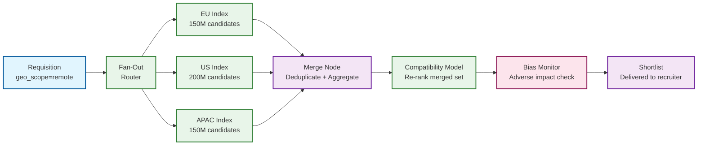

# 12.20 AI-Native Recruitment Platform — Scalability & Reliability

## Horizontal Scaling Architecture

### Stateless Services and Their Scaling Axes

The platform is designed around the principle that compute is horizontally scalable; data is the hard part. Each service is stateless with respect to individual requests; all durable state is pushed to dedicated data stores:

| Service | Scaling Axis | State Location |
|---|---|---|
| Candidate API Gateway | Replica count (CPU-bound) | No local state; session state in distributed store |
| Dialogue Manager | Replica count (CPU-bound) | Dialogue session state in distributed key-value store |
| Embedding Service | GPU replica count | No local state; model loaded at startup |
| ANN Vector Index | Sharded by candidate_id hash | HNSW index shards; 1 shard = ~50M vectors |
| Compatibility Model | GPU/CPU replica count | Model artifact loaded from object storage |
| Assessment Engine | Replica count (CPU-bound) | Session state in distributed store; item bank in memory |
| Interview Analysis | Worker pool (GPU-bound for ASR/NLP) | Job queue; results written to profile service |
| Bias Monitor | Single instance per batch (CPU-bound) | Reads from demographic store; writes to batch record |

### Vector Index Sharding

At 500M candidate profiles, a single ANN index is too large to fit in memory on a single node (~4.25 TB). The index is sharded horizontally by candidate_id hash modulo shard_count:

```
Index sharding design:
  Shard count: 10 shards (expandable via consistent hashing)
  Per shard:   50M candidates × ~1.5 KB index overhead = ~75 GB per shard
  RAM per node: 128 GB → 1–2 shards per node with headroom
  Total nodes: 10–20 index nodes

Query fan-out:
  A single matching query searches ALL shards in parallel (broadcast query)
  Each shard returns its top-K candidates by similarity score
  A merge node aggregates and re-ranks across shards
  Total latency: max(shard latency) + merge time ≈ 50 ms + 5 ms = 55 ms

Rebalancing:
  Adding a new shard: consistent hashing minimizes data movement
  Only ~1/N candidates need to be moved to the new shard
  During rebalancing: both old and new shards serve queries for migrated candidates
  Migration validated before old shard references are removed
```

### Matching Pipeline Scaling Under Requisition Volume

100,000 active requisitions × 100 new applications/day = 10M match operations/day. Each match operation fans out to all 10 index shards. Total shard queries: 100M/day = ~1,157 queries/second to the index tier. Each shard handles ~116 queries/second, well within typical ANN index throughput of ~1,000–10,000 queries/second per node.

**Burst scenario:** Job fair or university recruiting season where a single employer posts 500 roles and receives 1,000 applications per role in 24 hours (500,000 applications in one day). Matching throughput spikes 5x:
- Index tier absorbs spike via horizontal auto-scaling of query replicas
- Compatibility model inference queue absorbs burst with auto-scaled inference workers
- Bias monitoring batch windows dynamically adjust to maintain ≤ 5-minute cycle time

---

## Sourcing Crawler Reliability

### Crawler Architecture

The sourcing crawler runs as a horizontally scalable worker pool with per-source rate limiting enforced at the crawler coordinator:

```
Crawler design:
  Sources: 20+ professional networks and public data sources
  Per-source rate: configured in crawler policy store (e.g., 10 requests/sec)
  Worker pool: 200 crawler workers; work distributed via job queue
  Fetch → Parse → Dedup → Enrich → Queue pipeline
  Dedup: SHA-256 hash of (name, email, current_employer, current_title) → idempotent profile ID

Resilience:
  Retry with exponential backoff (max 3 retries) on 5xx from source
  Circuit breaker per source: 5 consecutive failures → open circuit for 10 min
  Poisoned URL handling: URLs that consistently fail to parse are quarantined
  Dead letter queue: failed enrichment jobs persisted for manual review
```

### Opt-Out Enforcement

The opt-out manager maintains a blocklist keyed by {email, phone, external_profile_url}. All crawler-discovered profiles are checked against the blocklist before queuing for enrichment. Opt-out requests from candidates are propagated to the opt-out store within 1 hour. Existing profile records for opted-out candidates are soft-deleted within 24 hours and hard-deleted within 30 days (GDPR timeline).

**Enforcement gap risk:** A candidate who opts out but whose profile is already in the index could still appear in matching results during the 24-hour soft-delete window. Mitigation: The compatibility model filters out opted-out candidate IDs at query time using a real-time opt-out membership check against a bloom filter that is updated immediately on opt-out receipt.

---

## Interview Analysis Pipeline Reliability

### At-Least-Once Processing for Video Submissions

Video submissions are stored in object storage at upload time before any analysis begins. The analysis pipeline reads from object storage, not from the upload stream, ensuring that a worker crash never loses a submission. The job queue tracks processing state:

```
Video submission lifecycle:
  UPLOADED → object storage written, job queued
  PROCESSING → worker claims job via distributed lock (30-min TTL)
  COMPLETE → report written to candidate profile; job marked done
  FAILED → retry after 5 min; max 3 retries; then dead letter queue

Idempotency:
  Each video analysis job has a unique submission_id
  If a worker crashes mid-analysis, the job is reclaimed by another worker after lock TTL
  The new worker re-analyzes the video from scratch (analysis is deterministic for same model version)
  Duplicate completion is prevented by check-and-set on job status in job store
```

### Graceful Degradation

If the NLP coherence model or domain vocabulary model is unavailable (transient GPU failure), the pipeline produces a partial report: ASR transcript is always available, and a reduced report with only raw transcript and speech metrics is returned to the recruiter with a "partial analysis" flag. This prevents the recruiter experience from blocking on a full analysis when a single model is down.

---

## Reliability Patterns

### Bias Monitoring Circuit Breaker

If the demographic data store is unavailable, the bias monitoring service cannot analyze adverse impact. Rather than blocking all stage decisions until the store recovers, the system uses a circuit breaker with a configurable fallback:

- **Closed (normal)**: Bias check runs synchronously; decisions released after clear/flagged
- **Open (degraded)**: Bias check is skipped; all stage decisions are held in a pending buffer; a compliance notification is sent to the platform owner
- **Half-open (recovering)**: Bias check resumes; buffered decisions are analyzed retroactively before any pending outreach is triggered

This ensures that decisions are never silently released without bias analysis—they are either analyzed in real time, or held until analysis is possible.

### Conversation Session Durability

Dialogue sessions are checkpointed to the distributed session store after every turn. If the dialogue manager instance serving a session crashes mid-turn, the next incoming message from the candidate re-establishes the session from the latest checkpoint. The candidate experiences at most one repeated prompt ("I didn't catch your last response—could you repeat?") rather than losing all session context.

### Model Version Pinning During Candidate Journey

A candidate who began their application journey with compatibility model v2.3 will continue to be ranked against that model throughout their journey for that requisition. Upgrading the compatibility model mid-journey could change a candidate's rank in ways that are not explained by any change in the candidate's qualifications. The system pins the model version per {candidate_id, req_id} at the time of first matching and does not upgrade mid-journey unless a major bias correction requires it (in which case, all candidates for the requisition are re-ranked simultaneously with a human review step).

---

## Surge Handling

### University Recruiting Season

In September–October (US fall recruiting season), platform load spikes 3–5x across the assessment, video, and matching subsystems simultaneously:

| Subsystem | Spike Behavior | Mitigation |
|---|---|---|
| Assessment Engine | 5x concurrent sessions | Pre-scale worker pool 48h before season start (calendar-driven predictive scaling) |
| Video Analysis | 4x daily submission volume | Prioritize recent submissions; schedule older-date submissions in off-peak hours |
| Matching Engine | 3x matching operations | ANN index query replicas auto-scale; compatibility model inference workers pre-scaled |
| Conversational AI | 5x concurrent sessions | LLM response time degrades under heavy load; queue LLM requests with 2-second timeout before falling back to template-based responses |

### Failure Isolation: Bulkhead Design

The platform uses bulkhead isolation between subsystems to prevent cascading failures:

- The video analysis pipeline has a dedicated thread pool separate from the matching engine; a video analysis backlog does not consume matching engine resources
- The bias monitoring service has a dedicated connection pool to the demographic store; a bias monitoring spike does not exhaust the connection pool for other services
- The conversational AI gateway is rate-limited per employer account to prevent a single high-volume customer from starving other customers

---

## Multi-Region Deployment

### Data Residency Requirements

EU-based candidates must have their profile data processed and stored in EU-region infrastructure (GDPR data residency). This requires:

- **Per-region profile stores**: Candidate profiles for EU, US, APAC stored in their respective regional clusters
- **Regional ANN indexes**: Each region maintains its own vector index for its candidate profiles; matching queries are regional by default
- **Cross-region matching**: If a job requisition in the US is open to remote candidates worldwide, matching spans regional indexes with a federated query fan-out
- **Model serving per region**: Embedding service and compatibility model served from regional inference clusters; no candidate data crosses regional boundaries for inference

### Cross-Region Matching Architecture

When a requisition is open to remote candidates globally, the matching pipeline executes a federated query across regional indexes:

```
Cross-region matching flow:

  1. Recruiter opens req #4521 with geo_scope = "remote"
  2. Matching engine identifies candidate regions: EU, US, APAC
  3. Fan-out: parallel ANN search dispatched to each regional index
  4. Each region returns top-K candidates with similarity scores
  5. Merge node aggregates results; deduplicates candidates with profiles in multiple regions
  6. Compatibility model re-ranks the merged candidate set
     (model inference runs in the req's home region — only candidate_ids + feature vectors cross boundaries)
  7. Bias monitoring runs on the merged batch

Latency budget:
  Regional ANN search (parallel): max(50 ms EU, 55 ms US, 60 ms APAC) = 60 ms
  Cross-region network for result transfer: ~100 ms (EU → US aggregator)
  Compatibility model re-rank: 10 ms
  Total: ~170 ms (vs. 60 ms for single-region match)

Data sovereignty Rule that never changes:
  Candidate profile data NEVER leaves its home region.
  Only candidate_ids and pre-computed feature vectors (not PII) cross regional boundaries.
  Feature vectors are derived from anonymized skill representations, not raw profile text.
```



### RTO and RPO

| Subsystem | RTO Target | RPO Target |
|---|---|---|
| Candidate API Gateway | 2 min | 0 (multi-region active-active) |
| Matching Engine | 5 min | 15 min (ANN index rebuild from profile store) |
| Conversational AI | 2 min | 30 sec (session state replicated across AZs) |
| Assessment Engine | 5 min | 0 (session state in replicated store) |
| Audit Log | 30 min | 0 (synchronous cross-AZ replication) |
| Bias Monitor | 10 min | 0 (reads from audit log; stateless computation) |
| Sourcing Crawler | 30 min | 1 hour (job queue drained; re-crawl on recovery) |

---

## Disaster Recovery and Data Protection

### Backup Strategy

```
Backup tiers:

  Tier 1 — Candidate Profile Store (RPO: 0)
    Synchronous replication across 3 AZs within region
    Cross-region async replication with 15-min lag
    Point-in-time recovery: 7-day rolling window (1-min granularity)

  Tier 2 — Audit Log (RPO: 0, immutable)
    Write-ahead log with synchronous replication to 3 AZs
    Cross-region async replication (real-time streaming)
    No point-in-time recovery needed: append-only, no deletions
    7-year retention in cold object storage with integrity verification

  Tier 3 — ANN Vector Index (RPO: 15 min)
    Not backed up — rebuilt from profile store embeddings on demand
    Rebuild time: 500M vectors × 5 ms = ~42 minutes per shard (parallelized across 10 shards)
    During rebuild: stale index serves queries with reduced recall

  Tier 4 — Video Submissions (RPO: 0)
    Stored in object storage with 3-AZ replication at upload time
    No additional backup needed — object storage IS the primary store
    90-day lifecycle policy auto-deletes expired videos

  Tier 5 — Assessment Item Bank (RPO: N/A)
    Static artifact stored in version-controlled object storage
    Loaded into memory at service startup
    No runtime backup needed — source-of-truth is the artifact repository
```

### Failover Decision Matrix

| Failure Scenario | Detection | Automated Action | Human Action Required? |
|---|---|---|---|
| Single AZ loss | Health check failure (30s) | Route traffic to remaining AZs | No |
| Regional outage | Cross-region health check (60s) | DNS failover to secondary region | Verify data consistency post-recovery |
| Matching engine degradation | p99 > 5s for 5 minutes | Circuit breaker: serve cached shortlists | Investigate root cause |
| Bias monitor unavailable | Health check failure (30s) | Hold all decision batches; notify compliance | Compliance officer reviews held batches |
| Audit log write failure | Write error rate > 0.1% | **Halt all decision-making services** | Engineering + compliance restore service |
| LLM provider outage | Response timeout > 5s | Fall back to template-based responses | No (graceful degradation) |
| GPU fleet saturation | Queue depth > threshold | Auto-scale GPU instances; queue overflow to CPU | Monitor scaling response |

### Chaos Engineering Practices

```
Recruitment platform chaos experiments:

  Experiment 1: Bias Monitor Unavailability
    Inject: Kill bias_monitor service for 10 minutes
    Expected: All decision batches held; compliance notification sent; zero decisions released
    Validates: Circuit breaker on bias monitoring gate

  Experiment 2: Demographic Store Latency Spike
    Inject: Add 30-second latency to demographic store reads
    Expected: Bias monitoring batch cycle time exceeds SLO; alert fires;
              batches accumulate but are NOT bypassed
    Validates: Bias monitoring does not silently skip checks under pressure

  Experiment 3: ANN Index Shard Loss
    Inject: Remove one of 10 ANN index shards
    Expected: Matching continues with reduced recall (9/10 shards);
              queries return results with "partial_index" flag;
              shard rebuild initiates automatically
    Validates: Graceful degradation of matching quality, not matching availability

  Experiment 4: Cross-Region Network Partition
    Inject: Block traffic between US and EU regions
    Expected: Each region operates independently for local requisitions;
              cross-region matching returns partial results with regional flag;
              no candidate data loss
    Validates: Regional isolation under partition

  Experiment 5: LLM Provider Total Outage
    Inject: Block all outbound calls to LLM inference endpoint
    Expected: Conversational AI degrades to template-based responses;
              scheduling and FAQ still functional; screening questions
              presented as structured forms instead of natural language
    Validates: Conversational AI graceful degradation path
```

---

## Back-Pressure and Load Shedding

### Admission Control Strategy

The platform implements a five-level back-pressure system that protects core compliance invariants while gracefully degrading non-critical features:

```
FUNCTION admission_control(request, system_load) -> action:

  // Level 0: Normal operation (load < 70%)
  IF system_load.cpu < 0.7 AND system_load.queue_depth < 1000:
    RETURN ACCEPT(request)

  // Level 1: Throttle non-essential features (load 70-80%)
  IF system_load.cpu < 0.8:
    IF request.type == ANALYTICS_QUERY OR request.type == REPORT_GENERATION:
      RETURN DEFER(request, delay=60s)
    RETURN ACCEPT(request)

  // Level 2: Reduce matching quality (load 80-90%)
  IF system_load.cpu < 0.9:
    IF request.type == MATCHING_QUERY:
      RETURN ACCEPT_DEGRADED(request, reduce_ann_k=0.5, skip_shap=true)
    IF request.type == VIDEO_ANALYSIS:
      RETURN QUEUE(request, priority=LOW)
    RETURN ACCEPT(request)

  // Level 3: Defer non-critical pipelines (load 90-95%)
  IF system_load.cpu < 0.95:
    IF request.type == SOURCING_CRAWL:
      RETURN PAUSE(request)
    IF request.type == CONVERSATIONAL_AI:
      RETURN ACCEPT_DEGRADED(request, use_templates=true)
    RETURN ACCEPT(request)

  // Level 4: Protect compliance invariants only (load > 95%)
  // NEVER shed: bias monitoring, audit log writes, GDPR erasure
  IF request.type IN [BIAS_CHECK, AUDIT_WRITE, ERASURE_REQUEST]:
    RETURN ACCEPT(request)  // always accepted
  RETURN REJECT(request, retry_after=30s)
```

### Load Shedding Priority Matrix

| Priority | Service | Shed Strategy | Compliance Impact |
|---|---|---|---|
| P0 — Never shed | Bias monitoring, Audit log, GDPR erasure | Always processed | Direct regulatory obligation |
| P1 — Last to shed | Candidate API (applications), Assessment engine | Queue with bounded wait | Candidate experience impact |
| P2 — Degrade gracefully | Matching engine, Conversational AI | Reduce quality (fewer shards, template fallback) | Reduced matching recall; robotic responses |
| P3 — Defer | Video analysis, Report generation | Queue to off-peak processing | Delayed results (within SLO) |
| P4 — First to shed | Sourcing crawler, Analytics queries | Pause entirely | No immediate business impact |

---

## Capacity Planning

### Growth Model and Scaling Triggers

| Metric | Current | Year 2 | Year 3 | Scaling Trigger |
|---|---|---|---|---|
| Candidate profiles | 500M | 1.2B | 2.5B | > 800M: add ANN index shards |
| Active requisitions | 100K | 250K | 500K | > 150K: add matching engine replicas |
| Daily match operations | 10M | 30M | 80M | > 20M: horizontal scale compatibility model |
| Concurrent chat sessions | 500K | 1.2M | 3M | > 700K: add LLM inference GPUs |
| Video submissions/day | 500K | 1.2M | 3M | > 800K: add analysis worker pool |
| Audit log size | 26 TB/yr | 65 TB/yr | 170 TB/yr | > 50 TB/yr: tiered storage migration |

### Cost Optimization Strategies

```
Cost reduction levers:

  1. Embedding quantization: float32 → int8 reduces vector storage 4x
     Trade-off: ~2% recall degradation at top-100; acceptable for recall stage

  2. Tiered video storage: hot (7 days, SSD) → warm (83 days, HDD) → delete
     Reduces video storage cost by 60% vs. all-SSD

  3. LLM response caching: Cache FAQ responses by intent + slot hash
     30% of conversational turns are repeat FAQ → 30% LLM cost reduction

  4. Off-peak video analysis: Shift 60% of video processing to off-peak hours
     Use spot/preemptible GPU instances → 70% cost reduction on analysis compute

  5. Assessment item bank compression: Top 2,000 items cover 95% of sessions
     Reduce cold item calibration compute by 80%

  6. Regional ANN index right-sizing: APAC has 150M candidates but only 20%
     of query volume → fewer read replicas, smaller instance types
```

---

## Real-World: Global Enterprise Recruitment Platform Scaling

### Context
A multinational technology company deployed the platform across 40 countries with 300,000 active requisitions, 1.2 billion candidate profiles, and regulatory compliance in 15 jurisdictions simultaneously.

### Scaling Challenges Encountered

**Challenge 1: ANN Index Rebuild Storm**
When the skills graph was updated (quarterly), all 1.2 billion candidate embeddings needed re-computation. At 5 ms per embedding, sequential re-embedding would take 69 days. Solution: parallel re-embedding across 200 GPU workers with incremental index swaps (rebuild new index alongside old; atomic swap when complete). Total re-embedding time: ~8 hours. During rebuild, matching served from the old index with a "freshness warning" flag.

**Challenge 2: Bias Monitoring at Multi-Jurisdiction Scale**
Different jurisdictions required different protected categories: US (EEOC categories), EU (gender, age, disability, ethnicity), India (caste, religion, gender), Brazil (race/color, gender, disability). The bias monitoring service was refactored from a single-category model to a jurisdiction-aware category registry that dynamically loads the applicable protected categories based on the candidate's location and the requisition's jurisdiction. Each jurisdiction's statistical significance threshold and minimum sample size were configurable.

**Challenge 3: Conversational AI Language Scaling**
Supporting 100+ languages required separate NLU models per language family. At peak, the platform ran 12 language-specific intent classifiers and 8 multilingual LLM endpoints. Solution: a language routing layer that detected candidate language from the first message and routed to the appropriate model cluster. Fallback: if a language-specific model was unavailable, route to the multilingual model with a quality degradation flag.

### Architecture Decisions Validated

| Decision | Validation |
|---|---|
| Two-stage matching (ANN + ranker) | ANN index rebuild did not block ranker updates; ranker retrained weekly during quarterly index rebuild |
| Bias monitoring as synchronous gate | Caught 47 adverse impact incidents in the first year that would have been missed by annual audit |
| Regional data sovereignty | Passed GDPR audit in 3 EU member states; no candidate PII crossed regional boundaries |
| Template fallback for conversational AI | During a 2-hour LLM provider outage, 85% of candidate interactions completed successfully via templates |

---

## Consistency Model

### Consistency Requirements by Component

| Component | Consistency Model | Justification |
|---|---|---|
| Candidate profile store | Strong consistency (within region) | Recruiter must see latest profile state; stale data → wrong shortlist |
| ANN vector index | Eventual consistency (15-min lag) | Slight index staleness is acceptable; rebuild happens on schedule |
| Session state store | Strong consistency with CRDT merge | Candidate must see consistent session state across channels |
| Audit log | Strong consistency (3-AZ sync write) | Regulatory requirement: no audit entry loss |
| Bias monitoring batch | Linearizable reads | Bias check must see all decisions in the batch — no partial reads |
| Assessment session | Strong consistency | Item selection must see all previous responses in the session |
| Model registry | Eventual consistency | Model promotion propagates to all regions within minutes |
| Shortlist cache | Eventual consistency (15-min TTL) | Stale shortlist is acceptable; invalidated on material change |

### Cross-Region Consistency

```
Cross-region replication model:

  Profile store: Async replication with 15-min lag
    → Cross-region reads may be slightly stale
    → Acceptable: matching runs on local profiles; cross-region matching
      uses federated query, not replicated data

  Audit log: Async streaming replication (near-real-time)
    → Secondary region has full audit history within seconds
    → Used for disaster recovery, not for active queries

  Session state: Per-region (no cross-region replication)
    → Candidates always routed to their home region
    → If region fails, session state is lost; session re-established from profile

  Model registry: Global replication (eventual, minutes)
    → Model promotion propagates to all regions
    → Stale model version in secondary region for brief window
    → Acceptable: model version pinning prevents mid-journey model changes
```

---

## AI Release Ladder

Every AI model or capability change MUST follow this rollout sequence:

| Stage | Description | Gate Criteria |
|-------|-------------|---------------|
| 1. Offline Evaluation | Benchmark against historical ground truth | Meets baseline metrics |
| 2. Shadow Mode | Run in parallel, compare to production | No regression on key metrics |
| 3. Canary (Blast-Radius Capped) | 1-5% traffic, human review of all outputs | Error rate < threshold |
| 4. Human-Reviewed Production | AI recommends, human approves all actions | Approval rate > 90% |
| 5. Limited Autonomous Production | AI acts within pre-approved boundaries | Continuous monitoring |
| 6. Instant Rollback | One-click revert to previous model/rules | < 5 min rollback time |

**Regulatory constraint:** Under the EU AI Act (Aug 2026), recruitment AI is classified as high-risk. Stage 5 may only apply to low-risk administrative tasks (scheduling, parsing). All candidate-affecting ranking and selection decisions must remain at Stage 4 with mandatory human oversight and bias auditing.
