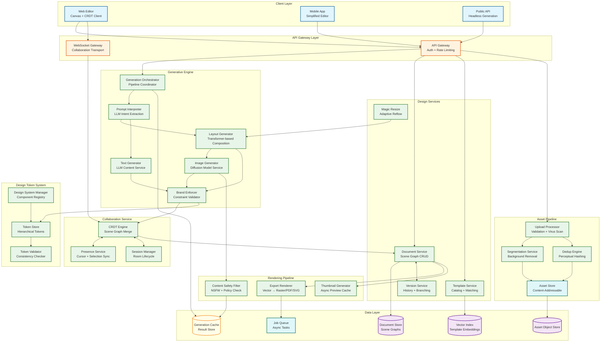
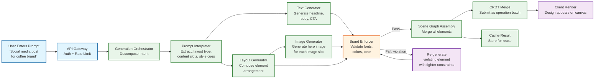
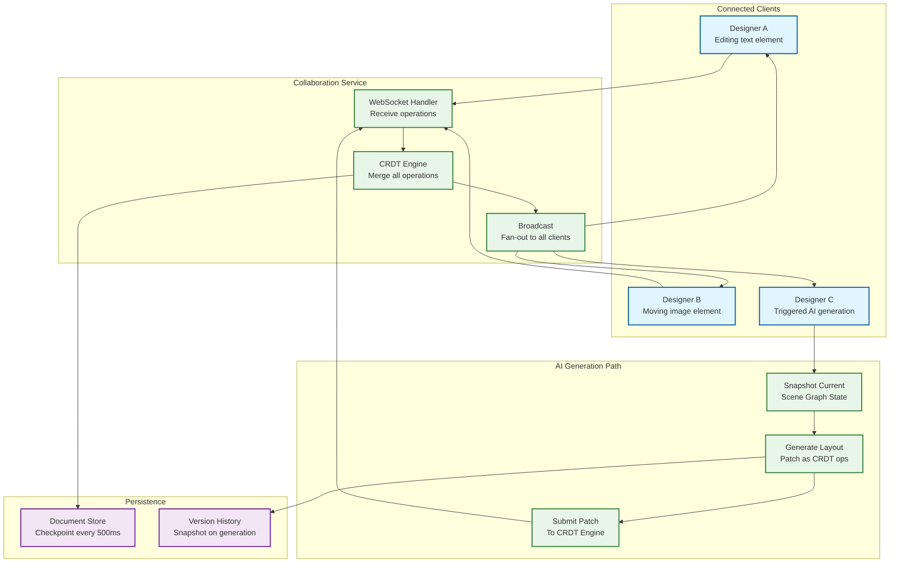

# 12.21 AI-Native Creative Design Platform — High-Level Design

## System Architecture



---

## Key Design Decisions

### Decision 1: Multi-Model Orchestration Over Monolithic Generation

A monolithic end-to-end model (prompt → finished design as a single inference) would produce impressive demos but fail in production for three reasons: (1) the output must be a structured, editable scene graph—not a flat image—requiring explicit element decomposition; (2) different generation subtasks (layout, imagery, text) have different latency profiles, model architectures, and retraining cadences; (3) brand enforcement requires inspecting and constraining intermediate outputs between generation stages, which is impossible with a single-pass model.

The platform uses a **generation orchestrator** that decomposes a user's prompt into subtasks via an LLM-based prompt interpreter, dispatches each subtask to a specialized model (layout transformer, diffusion image generator, LLM text generator), and assembles the results into a unified scene graph after brand validation. Each model can be updated, scaled, and quantized independently.

**Implication:** The orchestrator introduces coordination overhead (~200 ms) but enables independent model iteration. A new diffusion model version can be deployed without touching the layout transformer, and vice versa. Brand enforcement sits between generation and rendering, acting as a deterministic filter that can veto or adjust any generation output.

### Decision 2: CRDT-Based Scene Graph as the Single Source of Truth

All state—human edits and AI-generated content—flows through a CRDT-based scene graph. This eliminates the "two writers" problem where human edits and AI patches compete for document authority. The CRDT treats every mutation as an operation on a node in the scene graph tree: insert element, update property, move position, delete element. AI generation produces a batch of operations that are merged into the live document through the same path as a human's drag-and-drop.

**Implication:** The AI generation pipeline cannot write directly to the document store—it submits its output as a CRDT operation batch to the collaboration service, which merges it with any concurrent human edits and broadcasts the result to all connected clients. This ensures that a design is never in an inconsistent state between what the human sees and what the AI produced.

### Decision 3: Brand Enforcement as a Constraint Layer, Not a Post-Processing Filter

Brand consistency cannot be achieved by generating an unconstrained design and then adjusting colors and fonts afterward. Color shifts applied to generated images produce artifacts; font substitution after layout breaks text fitting; logo insertion after composition disrupts visual balance. Instead, brand constraints are injected at generation time:

- **Layout generator** receives brand spacing scale and grid system as conditioning parameters
- **Image generator** receives brand color palette as style conditioning (via CLIP-guided style embedding)
- **Text generator** receives brand voice guidelines as system prompt context
- **Brand enforcer** validates the assembled scene graph against the full brand kit rule set; violations are corrected by re-generating only the violating element with tighter constraints

**Implication:** Brand enforcement adds ~100 ms validation latency but prevents the need for iterative post-hoc correction, which would be both slower and lower quality.

### Decision 4: Client-Side Vector Rendering with Server-Side Export

The canvas editing experience runs entirely client-side using GPU-accelerated vector rendering (WebGPU/WebGL). The scene graph is rendered locally at 60 FPS without round-trips to the server. This is essential for interactive editing (drag, resize, type) where 100ms+ server round-trip latency would make the tool feel unresponsive.

Server-side rendering is reserved for two use cases: (1) export to final formats (high-resolution PNG, print-ready PDF, SVG) where deterministic cross-platform output is required; (2) thumbnail generation for design listings and search results.

**Implication:** The client must be capable of rendering the full scene graph locally, which constrains scene graph complexity (designs with 1000+ elements may degrade client performance). The system enforces soft limits on element count and provides performance warnings.

### Decision 5: Content-Addressable Asset Store with Perceptual Deduplication

At 100M uploads/day, naive per-user file storage would produce massive duplication (the same stock photo uploaded by thousands of users). The asset store uses content-addressable storage (SHA-256 hash as the key) combined with perceptual hashing (pHash) for near-duplicate detection. Two images that are the same photo at different resolutions or with minor cropping differences are stored once and referenced by all users.

**Implication:** Reduces asset storage by an estimated 40% compared to per-user storage. However, requires careful handling of the dedup lookup: a hash computation + perceptual hash comparison adds ~50 ms to the upload pipeline, which is acceptable for async upload but would be too slow for inline operations.

---

## Data Flow: Text-to-Design Generation



---

## Data Flow: Collaborative Editing with AI Generation



---

## Component Responsibilities Summary

| Component | Primary Responsibility | Key Interface |
|---|---|---|
| **API Gateway** | Authentication, rate limiting, request routing, API versioning | REST + GraphQL; WebSocket upgrade for collaboration |
| **Generation Orchestrator** | Decomposes generation requests into subtask pipeline; coordinates model dispatch and result assembly | Internal gRPC; async with progress streaming |
| **Prompt Interpreter** | Extracts structured intent (layout type, content slots, style cues, brand context) from natural language prompt | LLM inference; output is structured JSON intent spec |
| **Layout Generator** | Produces spatial arrangement of typed elements (positions, sizes, hierarchy) given content slots and constraints | Transformer inference; output is element placement array |
| **Image Generator** | Produces images for design elements via diffusion model (text-to-image, inpainting, style transfer) | GPU inference; output is image bytes + generation metadata |
| **Text Generator** | Generates text content for design elements (headlines, body, CTAs) given context and brand voice | LLM inference; output is text + formatting suggestions |
| **Brand Enforcer** | Validates generated content against brand kit rules; rejects or adjusts violations | Deterministic rule engine; input is scene graph + brand kit; output is pass/fail + corrections |
| **CRDT Engine** | Merges concurrent operations (human + AI) on the scene graph; maintains consistency | WebSocket transport; LWW-Register + RGA for text; tree-based CRDT for scene graph |
| **Document Service** | Persists scene graph state; manages design metadata, sharing, permissions | REST CRUD; backed by document store |
| **Version Service** | Tracks design history; supports undo/redo and branching | Snapshot-based; delta-compressed version chain |
| **Template Service** | Manages template catalog; semantic search for template matching | Embedding-based search via vector index |
| **Asset Pipeline** | Processes uploads (validation, virus scan, segmentation, deduplication); stores in content-addressable store | Async pipeline; upload → process → store |
| **Export Renderer** | Converts scene graph to final output format (PNG, PDF, SVG, MP4) | Async job queue; deterministic rendering engine |
| **Content Safety Filter** | Screens AI-generated images for NSFW, violence, and policy-violating content | ML classifier; runs on every generated image before canvas display |
| **Design Token System** | Manages hierarchical design tokens; validates component consistency against token definitions | Token CRUD API; used by brand enforcer and design system manager |

---

## Technology Selection Rationale

| Layer | Technology Choice | Rationale | Alternatives Considered |
|---|---|---|---|
| **Diffusion model serving** | Custom inference server with TensorRT + INT8 quantization | Maximum throughput per GPU; deterministic memory allocation; batch scheduling control | Standard model serving frameworks (rejected: insufficient batching control for latency-sensitive workloads) |
| **Layout model** | Custom transformer (50M params) trained on design layout corpus | Layout generation is a domain-specific task; no off-the-shelf model matches the structured output requirement | LLM-based layout (rejected: too slow for sub-second layout; output parsing unreliable); Rule-based grid (rejected: cannot learn visual balance from data) |
| **CRDT implementation** | Custom tree-based CRDT with LWW-Register per property + positional RGA for text | Scene graph requires hierarchical CRDT not available in standard libraries; concurrent AI operations require custom merge semantics | Standard CRDT libraries (rejected: no tree-based or scene graph-aware CRDT); OT-based collaboration (rejected: OT requires centralized transform server; CRDT enables multi-region without central coordinator) |
| **Document storage** | Distributed document store with strong consistency per workspace | Scene graph documents require single-document transactions; workspace-level partitioning | Relational database (rejected: schema too rigid for variable scene graph structure); Key-value store (rejected: no transaction support for multi-element updates) |
| **Asset storage** | Content-addressable object storage with CDN distribution | 44 PB/year growth requires cost-efficient, globally distributed storage; content-addressing enables deduplication | Block storage (rejected: cost prohibitive at petabyte scale); Self-hosted object storage (rejected: operational overhead) |
| **Vector search (templates + assets)** | Dedicated vector index with CLIP embeddings | Semantic template search and copyright similarity detection require approximate nearest neighbor search at scale | Full-text search only (rejected: cannot capture visual similarity); Exact embedding match (rejected: too strict; miss semantic near-matches) |
| **Real-time transport** | WebSocket with per-session encryption | Low-latency bidirectional communication for collaboration; supports cursor presence and operation streaming | Server-sent events (rejected: unidirectional); gRPC streaming (rejected: browser support limited) |
| **Export rendering** | Custom rendering engine with format-specific backends (PDF, SVG, PNG, MP4) | Cross-format deterministic rendering requires unified scene graph interpretation; format-specific backends handle color space (sRGB→CMYK), font embedding, and animation | Browser-based rendering (rejected: non-deterministic across browsers); Third-party rendering API (rejected: no scene graph awareness) |
| **Content safety** | Multi-model pipeline: CLIP classifier + specialized NSFW detector + copyright embedding search | No single model achieves 99.99% catch rate; layered approach with independent models reduces false negative rate multiplicatively | Single safety model (rejected: 99.9% max catch rate, not 99.99%); Human-only review (rejected: 50M generations/day cannot be human-reviewed) |

---

## Capacity Planning Decision Tree

```
When to add GPU capacity:
  IF generation p95 > 4.5s sustained for 1 hour → add GPUs (approaching 5s SLO)
  IF GPU utilization > 80% for > 30 min → pre-scale for next hour's predicted load
  IF cache hit rate drops below 10% → investigate (model version change? prompt diversity spike?)
  IF free-tier queue depth > 5x baseline → activate cache-only mode for free-tier

When to add collaboration capacity:
  IF CRDT merge latency p95 > 50ms → add CRDT engine instances
  IF WebSocket server connection count > 80% capacity → add WebSocket servers
  IF cross-region collaboration latency p95 > 200ms → add regional relay nodes

When to add storage capacity:
  IF asset store monthly growth > 20% above plan → review lifecycle policies; increase deletion eligibility
  IF generation cache miss rate > 90% → cache is undersized; expand cache tier
  IF document store write latency p95 > 50ms → add write replicas; review partitioning
```
