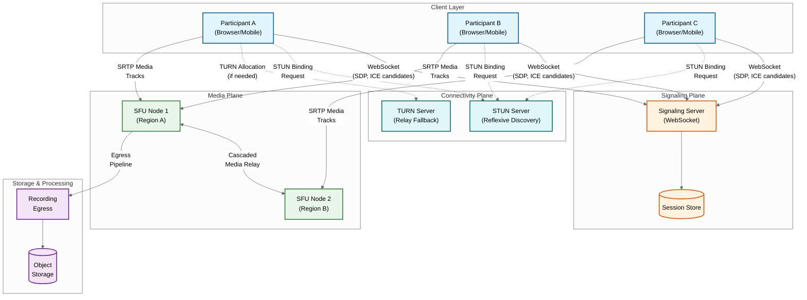
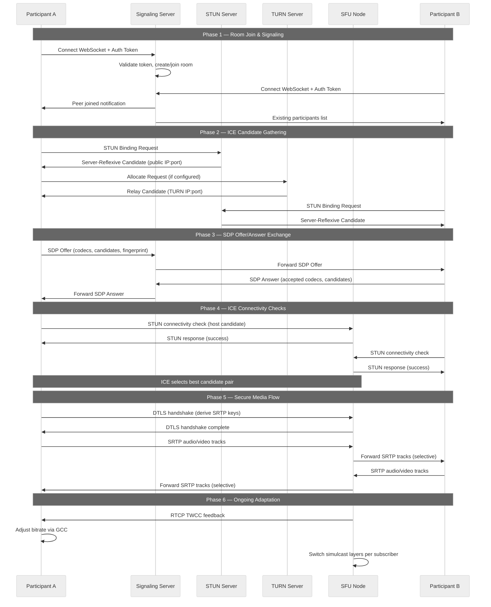
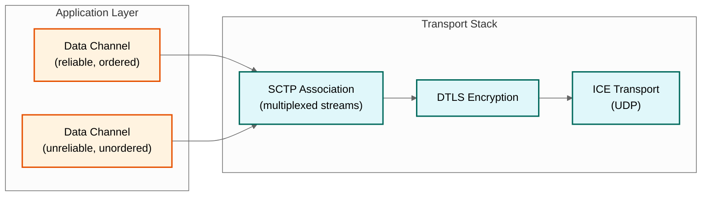
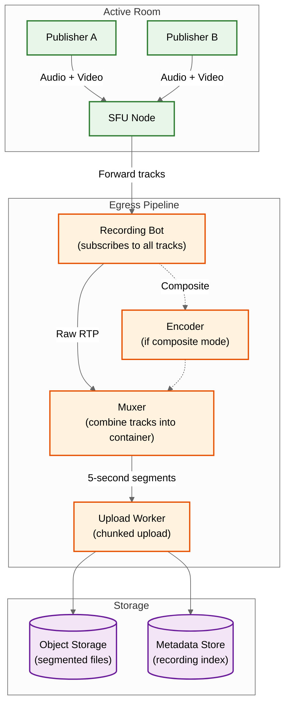
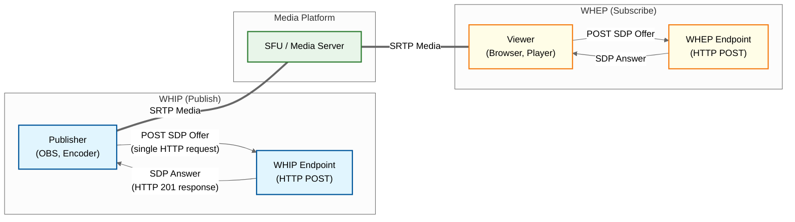

# High-Level Design — WebRTC Infrastructure

## System Architecture

The WebRTC infrastructure consists of three planes: the **signaling plane** (WebSocket-based session management), the **connectivity plane** (STUN/TURN for NAT traversal), and the **media plane** (SFU for packet forwarding). These planes operate independently but coordinate through shared session state.



---

## Call Establishment Flow

The lifecycle of a WebRTC call involves coordinated interaction across all three planes. The sequence below shows a 1:1 call where both participants connect through an SFU.



---

## ICE Negotiation State Machine

The ICE agent transitions through a well-defined state machine during connectivity establishment. Understanding these states is critical for debugging connection failures.

```mermaid
%%{init: {'theme': 'neutral'}}%%
stateDiagram-v2
    [*] --> New: createPeerConnection()
    New --> Gathering: setLocalDescription()
    Gathering --> Gathering: candidate discovered
    Gathering --> Complete: all candidates gathered

    state "Connectivity Checking" as Checking {
        [*] --> Waiting
        Waiting --> InProgress: begin check
        InProgress --> Succeeded: STUN response
        InProgress --> Failed: timeout
        Succeeded --> Nominated: USE-CANDIDATE
    }

    New --> Checking: remote candidates arrive
    Complete --> Checking: remote candidates arrive
    Checking --> Connected: nominated pair established
    Connected --> Completed: all checks finished
    Connected --> Disconnected: consent timeout (30s)
    Completed --> Disconnected: consent timeout (30s)
    Disconnected --> Checking: ICE restart
    Disconnected --> Failed: 30s no recovery
    Failed --> New: full renegotiation
```



**State Transitions and Timing:**

| Transition | Trigger | Typical Duration | Impact |
|---|---|---|---|
| New → Gathering | `setLocalDescription()` called | Instantaneous | Candidate discovery begins |
| Gathering phase | STUN/TURN requests complete | 200-500ms | Host candidates instant; TURN slowest |
| Checking phase | Connectivity checks execute | 50-300ms | Priority-ordered; aggressive nomination |
| Checking → Connected | First nominated pair succeeds | < 100ms after best check | Media can flow |
| Connected → Disconnected | No STUN consent response for 30s | 30s timeout | Media paused; ICE restart triggered |
| Disconnected → Checking | ICE restart with new credentials | < 500ms | Re-gather on new interface |
| Disconnected → Failed | No recovery within 30s | 30s | Connection terminates |

---

## Data Channel Architecture

WebRTC data channels provide reliable and unreliable message delivery over the same ICE/DTLS transport used for media. They run over SCTP (Stream Control Transmission Protocol) encapsulated in DTLS.



**Data Channel Modes:**

| Mode | SCTP Config | Use Case | Behavior |
|---|---|---|---|
| **Reliable ordered** | Retransmit, in-order delivery | Chat messages, file transfer | TCP-like semantics over UDP |
| **Reliable unordered** | Retransmit, any-order delivery | Batch updates, state sync | All messages arrive, order doesn't matter |
| **Unreliable ordered** | No retransmit, max retransmit = 0 | Game state, cursor position | Drop if late, but preserve ordering |
| **Unreliable unordered** | No retransmit, unordered | Sensor data, heartbeats | UDP-like semantics |

**Key Design Consideration:** Data channels share the same ICE/DTLS transport as media via BUNDLE. This means data channel congestion can theoretically affect media quality if the shared transport becomes saturated. In practice, data channels carry kilobytes while media carries megabits, so interference is minimal. For high-throughput data transfer (file sharing), consider rate-limiting to avoid competing with media bandwidth.

---

## Recording and Egress Pipeline

Recording in SFU architecture requires a specialized egress pipeline that subscribes to tracks without publishing, acting as a silent participant.



**Recording Modes:**

| Mode | Description | Resource Cost | Output |
|---|---|---|---|
| **Track-based** | Store each track as a separate file | Low (no processing) | Individual audio/video files per participant |
| **Composite** | Decode all tracks, compose into a single grid video | High (decode + layout + encode) | Single video file with participant grid |
| **Audio-only composite** | Mix all audio tracks into one stream | Medium (audio mixing) | Single audio file |

**Segmented Upload Strategy:**

```
Recording durability via segment-based upload:
1. Egress muxes media into 5-second segments
2. Each segment uploaded independently to object storage
3. Manifest file tracks segment order and timestamps
4. If egress crashes: at most 5 seconds of recording lost
5. On recovery: new egress bot joins, starts new segment chain
6. Post-processing: concatenate segments into final recording

Benefit: A 60-minute recording becomes 720 independent uploads.
         Any single upload failure affects only 5 seconds.
```

---

## WHIP/WHEP: Simplified Ingestion and Egress

WebRTC-HTTP Ingestion Protocol (WHIP) and WebRTC-HTTP Egress Protocol (WHEP) standardize how media enters and exits WebRTC infrastructure via simple HTTP-based negotiation, replacing custom signaling for unidirectional flows.



**WHIP/WHEP vs Custom Signaling:**

| Factor | Custom WebSocket Signaling | WHIP/WHEP |
|---|---|---|
| **Connection setup** | Persistent WebSocket + multi-message exchange | Single HTTP POST (offer) → 201 response (answer) |
| **Complexity** | Full signaling protocol implementation | Standard HTTP endpoint |
| **Use case** | Bidirectional interactive calls | Unidirectional publish (WHIP) or subscribe (WHEP) |
| **ICE candidates** | Trickle via WebSocket | Bundled in SDP or via PATCH requests |
| **Interoperability** | Custom per-platform | Standardized — any WHIP client works with any WHIP server |
| **When to use** | Multi-party rooms, interactive sessions | Broadcast ingestion, surveillance, one-to-many streaming |

---

## Media Flow Through SFU

In a group call with N participants, the SFU operates as a selective packet router. Each participant publishes their tracks once, and the SFU forwards copies to each subscriber with per-subscriber quality selection.

**Publisher path:**
1. Client encodes video at multiple simulcast layers (e.g., 720p @ 1.5 Mbps, 360p @ 500 Kbps, 180p @ 150 Kbps)
2. Client encodes audio with Opus codec at 50 Kbps
3. RTP packets are encrypted via SRTP and sent to the SFU over the ICE-selected transport
4. SFU receives packets and stores them in a per-track jitter buffer (reorders out-of-sequence packets)

**Subscriber path:**
1. SFU determines which simulcast layer each subscriber should receive based on:
   - Subscriber's estimated available bandwidth (via TWCC/REMB feedback)
   - Subscriber's requested resolution (e.g., thumbnail vs. main view)
   - Room policy (e.g., active speaker gets high quality, others get low)
2. SFU forwards the selected layer's RTP packets to the subscriber
3. If bandwidth drops, SFU switches to a lower simulcast layer — no packet loss, just lower resolution
4. Subscriber decodes and renders each received track independently

**Key optimization — Last-N:**
For rooms with many participants, the SFU only forwards the top N active speakers' video tracks, dramatically reducing subscriber bandwidth. Audio is always forwarded for all participants (low bandwidth cost). A voice activity detector (VAD) determines active speakers.

---

## Key Architectural Decisions

### Decision 1: SFU Over MCU

| Factor | SFU | MCU |
|---|---|---|
| **CPU cost** | Minimal (packet forwarding only) | High (decode + composite + re-encode per output) |
| **Latency** | 1-5ms forwarding | 50-200ms (encoding pipeline) |
| **Scalability** | Horizontal via cascading | Vertical (limited by encoding capacity) |
| **Client flexibility** | Each subscriber receives individual tracks, can layout locally | Single composite stream, fixed layout |
| **Bandwidth** | Higher downstream (N-1 tracks) | Lower downstream (1 composite) but server bears encoding cost |
| **Simulcast/SVC** | Natural fit (per-subscriber layer selection) | Not applicable |

**Decision:** SFU is the standard for all real-time interactive use cases. MCU is reserved only for specific legacy scenarios (SIP interop) or server-side recording compositing.

### Decision 2: Simulcast Over SVC

| Factor | Simulcast | SVC |
|---|---|---|
| **Codec support** | VP8, H.264, VP9, AV1 | VP9, AV1 only (limited H.264) |
| **Encoder complexity** | Multiple independent encodes | Single layered encode |
| **SFU complexity** | Simple layer switching | Must parse and strip NAL units |
| **Bandwidth efficiency** | ~40% overhead (redundant encoding) | ~15% overhead (shared base layer) |
| **Switching artifacts** | Brief freeze during layer switch (keyframe needed) | Seamless layer dropping |
| **Client support** | Universal | Incomplete (mobile platforms lag) |

**Decision:** Simulcast as the primary approach for broad compatibility. SVC for VP9/AV1-capable endpoints where bandwidth efficiency matters (large rooms).

### Decision 3: WebSocket-Based Signaling

**Rationale:** WebSockets provide full-duplex, low-latency signaling over a persistent connection. Alternatives:
- HTTP long polling: Higher latency, connection overhead per message
- Server-Sent Events: Unidirectional (server → client only)
- gRPC streaming: Better for service-to-service; browser support limited
- Pub/sub messaging: Good for inter-server, overkill for client-server signaling

**Decision:** WebSocket for client-server signaling. Pub/sub message bus for inter-SFU coordination and signaling server clustering.

### Decision 4: Custom Protocol for SFU Cascading

**Rationale:** Using WebRTC between SFU nodes would require ICE negotiation, SDP exchange, and DTLS handshake for each inter-node connection—adding unnecessary complexity and latency. A custom protocol using serialized metadata (e.g., FlatBuffers) over direct UDP/TCP connections allows:
- Supplementing RTP packets with track identifiers and room context
- Eliminating ICE negotiation (servers have known public addresses)
- Lower connection establishment latency (no DTLS handshake needed between trusted servers)
- Simpler topology management (mesh can be preconfigured)

**Decision:** Custom relay protocol for server-to-server media forwarding; standard WebRTC for client-to-server.

---

## Architecture Pattern Checklist

| Pattern | Applied? | Implementation |
|---|---|---|
| **Hub-and-spoke** | Yes | SFU as central hub; clients as spokes with single upstream connection |
| **Cascaded mesh** | Yes | Multi-SFU topology for large rooms and multi-region deployment |
| **Event-driven** | Yes | Signaling via WebSocket events; room state changes broadcast to subscribers |
| **Pub/sub** | Yes | Inter-SFU coordination via message bus; room topic-based state distribution |
| **Circuit breaker** | Yes | TURN fallback when direct/reflexive paths fail; SFU failover on node loss |
| **Sidecar** | Yes | Recording egress as sidecar to SFU (subscribes to tracks without publishing) |
| **Edge deployment** | Yes | STUN/TURN servers at edge PoPs; SFU nodes in regional data centers |
| **Graceful degradation** | Yes | Simulcast layer downgrade; audio-only mode; last-N video limiting |

---

## Component Interaction Summary

| Component | Communicates With | Protocol | Purpose |
|---|---|---|---|
| Client | Signaling Server | WebSocket (WSS) | SDP exchange, ICE candidates, room events |
| Client | STUN Server | STUN over UDP | Reflexive candidate discovery |
| Client | TURN Server | TURN over UDP/TCP/TLS | Relay allocation and media relay |
| Client | SFU Node | SRTP/SRTCP over UDP | Encrypted media track publish/subscribe |
| SFU Node | SFU Node | Custom relay (RTP + metadata) | Cascaded media forwarding |
| SFU Node | Message Bus | Pub/sub | Room state sync, participant routing |
| Signaling Server | Session Store | Key-value reads/writes | Room metadata, participant registry |
| SFU Node | Recording Egress | Internal subscription | Track data for recording pipeline |
| WHIP Client | WHIP Endpoint | HTTP POST + SRTP | Unidirectional media ingestion |
| WHEP Client | WHEP Endpoint | HTTP POST + SRTP | Unidirectional media egress |

---

## Active Speaker Detection

Active speaker detection drives the most impactful optimization in group calls — Last-N video forwarding. Only the top N speakers receive full-quality video forwarding, saving bandwidth proportional to room size.

**Detection Pipeline:**

```
Audio Level Extraction (per track, every 20ms):
1. SFU reads RTP header extension (urn:ietf:params:rtp-hdrext:ssrc-audio-level)
   - 7-bit level value (0 = loudest, 127 = silence)
   - Voice Activity Detection (VAD) flag (1 bit)
2. Apply exponential smoothing:
   smoothed_level = 0.7 * smoothed_level + 0.3 * current_level
3. Track recent activity window (last 2 seconds)

Speaker Ranking (every 500ms):
1. Score each participant:
   score = weighted_average(levels_last_2s) * vad_frequency
2. Sort by score descending
3. Top N speakers get full-quality video forwarded
4. Others get audio only (or low-quality thumbnail)

Hysteresis to Prevent Flickering:
- New speaker must maintain higher score for 1 second before replacing current top-N
- Departing speaker stays in top-N for 2 seconds after going silent
- This prevents rapid switching during conversation turn-taking
```

**Last-N Configuration by Room Size:**

| Room Size | Last-N Value | Video Tracks Forwarded | Bandwidth Savings |
|---|---|---|---|
| 2-4 | All | All participants | None (all visible) |
| 5-9 | 4 | Top 4 speakers | ~50% |
| 10-25 | 4-6 | Top 4-6 speakers | ~75% |
| 26-100 | 4 | Top 4 speakers | ~95% |
| 100+ | 4-9 (configurable) | Top speakers only | ~97% |

---

## Codec Negotiation and Selection

Codec selection during SDP offer/answer determines the encoding format for the entire session. The negotiation must balance quality, compatibility, and computational cost.

**Codec Preference Hierarchy:**

```
Video Codec Selection (SFU perspective):
1. AV1  — Best compression (30-50% better than VP9), SVC-native
            Limited: High encode cost, not all clients support it
2. VP9  — Good compression, SVC support, wide browser support
            Default for rooms where SVC is beneficial (large rooms)
3. VP8  — Universal support, low encode complexity
            Default for small rooms, mobile-heavy audiences
4. H.264 — Hardware encode/decode on all devices
             Use when mobile battery life is priority

Audio Codec:
1. Opus — Universal choice: 6-510 kbps, speech + music modes
          Features: in-band FEC, DTX (discontinuous transmission)
          No negotiation needed — Opus is mandatory in WebRTC spec
```

**SDP Codec Negotiation Flow:**

```
Offer:  "I support VP8, VP9, AV1, H.264" (preference order)
Answer: "I accept VP8, VP9" (intersected + reordered by receiver preference)
Result: VP8 used (highest mutual preference)

SFU behavior:
- SFU does NOT transcode between codecs
- All participants in a room must use the same video codec
- Room codec is locked when the first participant publishes
- Late joiners must support the room's codec or join audio-only
```
