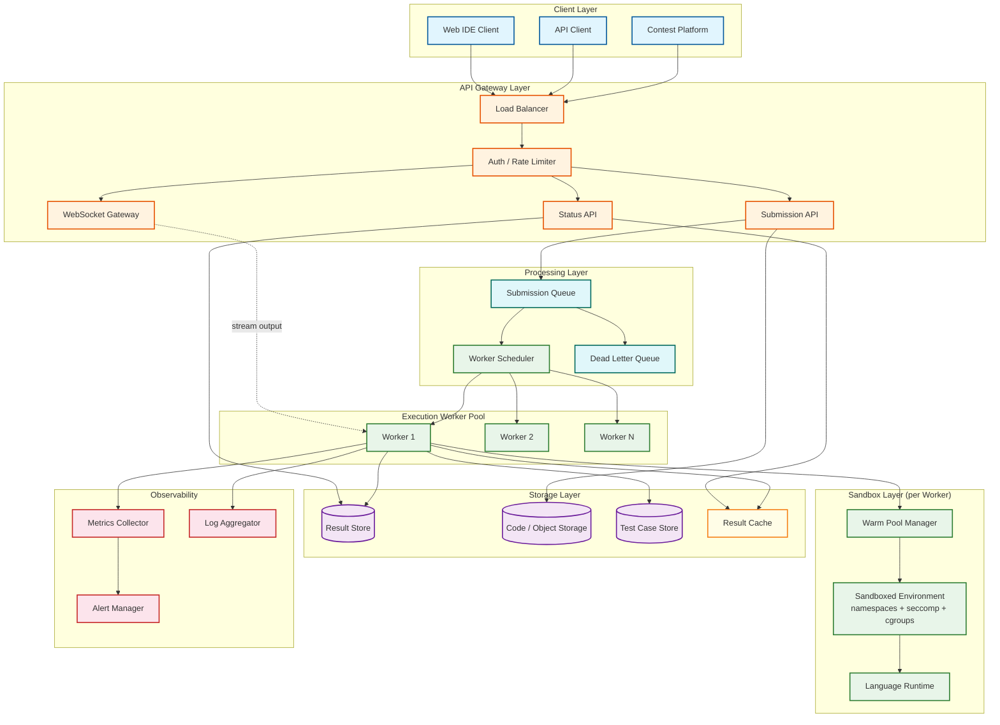
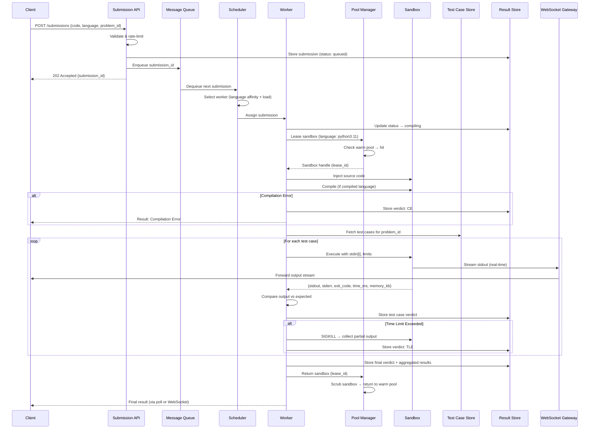
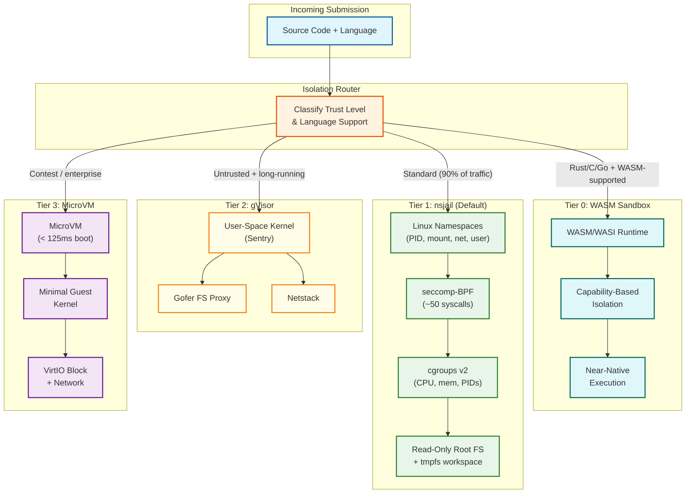
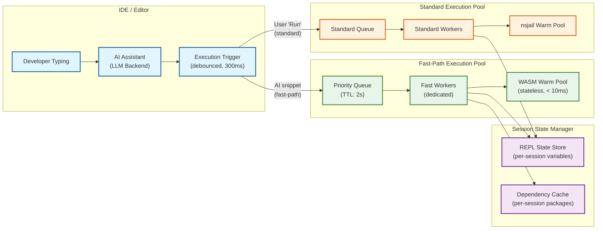
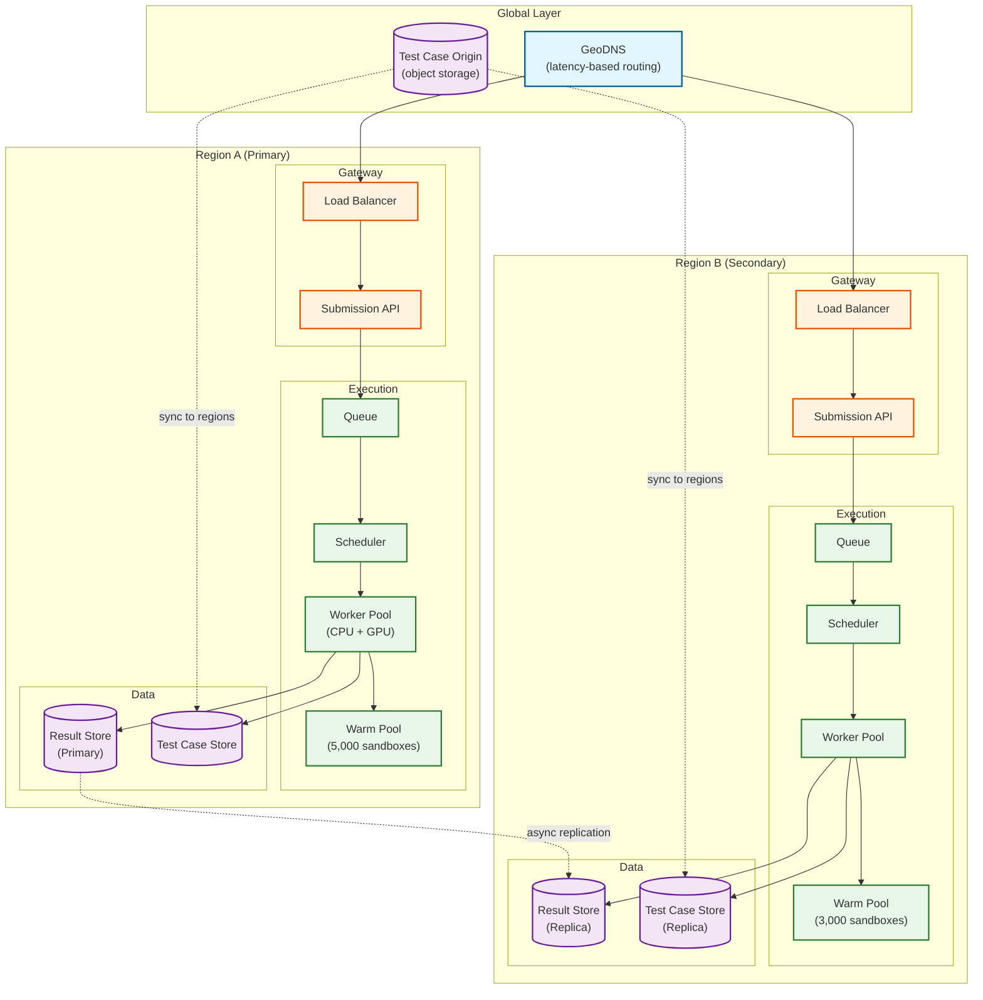

# High-Level Design — Code Execution Sandbox

## 1. System Architecture



---

## 2. Submission Lifecycle

The journey of a code submission from client to verdict follows this flow:



---

## 3. Key Architectural Decisions

### Decision 1: Isolation Technology Selection

| Option | Security | Performance | Operational Complexity | Verdict |
|---|---|---|---|---|
| **Plain Docker** | Low — shared kernel, 340 syscalls exposed | High — near-native | Low | Insufficient for untrusted code |
| **Docker + seccomp + gVisor** | High — user-space kernel intercepts syscalls | Medium — 10-30% I/O overhead | Medium | Good balance for most workloads |
| **Firecracker microVM** | Very High — hardware VM boundary, separate kernel | Medium — 125ms boot, 5MB overhead | High — kernel/rootfs management | Best for adversarial environments |
| **WASM/WASI** | High — no kernel access, capability-based | High — near-native for supported languages | Medium — limited language support | Future option; limited language coverage today |
| **nsjail** | High — namespaces + cgroups + seccomp-BPF + Kafel | High — minimal overhead | Low — single binary, protobuf config | Excellent for competitive programming |

**Selected Approach:** Tiered isolation based on trust level:
- **Tier 1 (Default):** nsjail with namespaces + cgroups v2 + seccomp-BPF — covers 90% of use cases with minimal overhead
- **Tier 2 (High Security):** gVisor (runsc) for untrusted or long-running submissions
- **Tier 3 (Maximum Isolation):** Firecracker microVM for contest environments or enterprise deployments

### Decision 2: Warm Pool Strategy

**Problem:** Creating a fresh sandbox takes 1-3 seconds (namespace setup, filesystem mount, cgroup creation). At 175 submissions/second, this latency is unacceptable.

**Solution:** Pre-warm a pool of ready-to-use sandboxes per language runtime.

| Aspect | Design Choice | Rationale |
|---|---|---|
| Pool sizing | Per-language, based on historical demand | Python pool: 200, C++: 150, Java: 100, etc. |
| Minimum pool size | 10% of peak demand per language | Guarantee warm hits for steady-state traffic |
| Maximum pool size | 150% of peak demand per language | Cap resource consumption during low traffic |
| Scrubbing on return | Full filesystem wipe, PID namespace reset, cgroup reset | Prevent cross-submission data leakage |
| Health checks | Periodic liveness probe (exec a no-op in sandbox) | Detect and replace broken sandboxes |
| Eviction | LRU eviction when total pool exceeds cluster limit | Free memory during low-demand periods |
| Replenishment | Background thread maintains pool at target size | Async creation doesn't block request path |

### Decision 3: Queue Architecture

**Problem:** Submission ingestion rate can spike 10× during contests. Workers process at a fixed rate determined by compute capacity.

**Solution:** Message queue decouples submission acceptance from execution.

| Aspect | Design Choice |
|---|---|
| Queue type | Persistent message queue with at-least-once delivery |
| Partitioning | By language (enables language-affinity worker routing) |
| Priority | Contest submissions get higher priority than practice |
| Visibility timeout | 60 seconds (if worker doesn't ACK, message re-queues) |
| Dead letter queue | After 3 failed attempts, move to DLQ for manual review |
| Ordering | Per-user FIFO (First-In-First-Out, like a line at a store) within partition (prevent starvation) |
| Backpressure | If queue depth > 10,000, return 503 with retry-after header |

### Decision 4: Test Case Execution Model

| Option | Pros | Cons | Selected |
|---|---|---|---|
| **Sequential in single sandbox** | Simple; reuse compiled binary | Single test failure affects subsequent tests; harder to parallelize | Default |
| **Parallel across sandboxes** | Faster total execution; isolated failures | Higher resource usage; compilation duplicated per sandbox | For contests |
| **Sequential with early termination** | Stop on first failure; save resources | User doesn't see all failing tests | Optional |

---

## 4. Data Flow Summary

### Write Path (Submission → Execution)

1. **Client** sends code via REST API
2. **API Gateway** validates, rate-limits, authenticates
3. **Submission API** stores code in Object Storage, metadata in Result Store, enqueues submission ID
4. **Scheduler** dequeues, selects worker based on language affinity and current load
5. **Worker** leases sandbox from warm pool, injects code, compiles, executes against test cases
6. **Worker** stores per-test-case verdicts and final aggregate verdict in Result Store

### Read Path (Result Retrieval)

1. **Client** polls `GET /submissions/{id}` or listens on WebSocket
2. **Status API** checks Result Cache → Result Store
3. Returns submission status, per-test-case verdicts, execution metrics

### Streaming Path (Real-Time Output)

1. **Client** opens WebSocket connection to WebSocket Gateway
2. **Worker** pipes sandbox stdout/stderr to WebSocket Gateway via internal pub/sub
3. **Gateway** forwards output chunks to client with < 100ms latency
4. Connection closes when execution completes or times out

---

## 5. Architecture Pattern Checklist

| Pattern | Application in This System |
|---|---|
| **Queue-Based Load Leveling** | Message queue absorbs submission spikes; workers consume at steady rate |
| **Competing Consumers** | Multiple workers consume from the same queue; work is distributed |
| **Bulkhead** | Separate worker pools per language prevent one language's issues from affecting others |
| **Circuit Breaker** | If a language runtime consistently fails, stop scheduling to that pool and alert |
| **Sidecar** | Monitoring agent runs alongside worker, collecting metrics and logs |
| **Strangler Fig** | Migrate from Docker-based isolation to gVisor/Firecracker incrementally |
| **Ephemeral Infrastructure** | Sandboxes are created, used once, destroyed—no persistent state |
| **Object Pool** | Warm pool of pre-created sandboxes, leased and returned |
| **Defense in Depth** | Multiple overlapping security layers (namespaces, seccomp, cgroups, read-only FS) |

---

## 6. Isolation Technology Architecture

The sandbox supports a tiered isolation model where the isolation depth is selected based on the trust level and workload characteristics.



### Tier Comparison

| Dimension | Tier 0 (WASM) | Tier 1 (nsjail) | Tier 2 (gVisor) | Tier 3 (MicroVM) |
|---|---|---|---|---|
| **Isolation boundary** | Runtime sandbox (no kernel access) | Kernel namespaces + syscall filter | User-space kernel intercept | Hardware VM boundary |
| **Startup time** | < 10ms | < 50ms (warm), 1-3s (cold) | 100-200ms | 125ms (Firecracker) |
| **Performance overhead** | < 5% | < 2% | 10-30% (I/O heavy) | 5-10% |
| **Language coverage** | ~10 (compilable to WASM) | All 60+ | All 60+ | All 60+ |
| **Kernel attack surface** | None (no syscalls) | Reduced (~50 syscalls) | Minimal (Sentry intercepts) | Separate guest kernel |
| **Memory overhead** | < 10MB per sandbox | 80-200MB per sandbox | 100-250MB per sandbox | 128MB + 5MB VMM |
| **Use case** | AI assistant fast-path | Standard submissions | Long-running, untrusted | Contests, enterprise |
| **Scrubbing cost** | None (stateless WASM instance) | Medium (filesystem wipe + cgroup reset) | Medium-High | None (destroy + recreate) |

---

## 7. WASM Sandbox Architecture (2025+ Pattern)

WASM/WASI sandboxing represents a fundamental shift in isolation model: from **kernel-enforced** (OS prevents escape) to **runtime-enforced** (WASM VM prevents escape by construction). The sandbox has no kernel syscall surface — memory safety, control flow integrity, and resource limits are all enforced by the WASM runtime.

```
WASM Sandbox Execution Model:

  Source Code (Rust/C/Go)
       │
       ▼
  WASM Compiler (ahead-of-time or JIT)
       │
       ▼
  WASM Module (.wasm binary)
       │
       ▼
  ┌─────────────────────────────────────┐
  │  WASM Runtime (Wasmtime / Wasmer)   │
  │  ┌───────────────────────────────┐  │
  │  │ Linear Memory (bounded)       │  │
  │  │ - Max 256MB, no host access   │  │
  │  │ - Bounds-checked on every op  │  │
  │  ├───────────────────────────────┤  │
  │  │ WASI Capabilities             │  │
  │  │ - fs: /workspace (read/write) │  │
  │  │ - stdin/stdout (piped)        │  │
  │  │ - clock_time (allowed)        │  │
  │  │ - network: DENIED             │  │
  │  │ - env vars: DENIED            │  │
  │  ├───────────────────────────────┤  │
  │  │ Fuel Metering                 │  │
  │  │ - Instruction budget: 10B ops │  │
  │  │ - Wall-clock timeout: 5s      │  │
  │  └───────────────────────────────┘  │
  └─────────────────────────────────────┘
```

**Key architectural implications:**

| Challenge | WASM Resolution | OS-Sandbox Comparison |
|---|---|---|
| **Memory isolation** | Linear memory with bounds checking on every access | cgroups memory limit + OOM kill |
| **CPU limits** | Fuel metering (instruction counting) | cgroups cpu.max + wall-clock timer |
| **Filesystem** | WASI capability grants — explicit file handles only | Mount namespaces + read-only root |
| **Network** | No network capability by default (no socket API) | Empty network namespace |
| **Process isolation** | No fork/exec — single-threaded by default | PID namespace + pids.max |
| **Startup time** | < 10ms (pre-compiled AOT module instantiation) | 50ms warm / 1-3s cold |
| **Scrubbing** | None — WASM instances are stateless, create and discard | Filesystem wipe, cgroup reset |

---

## 8. AI Code Assistant Execution Architecture (2025+ Pattern)

AI code assistants generate 10-100× more execution requests than human submissions. Each auto-complete suggestion triggers a sandbox execution to validate the suggestion before presenting it to the user. This creates a distinct execution profile.



### Fast-Path vs Standard-Path Execution

| Dimension | Fast-Path (AI Snippets) | Standard-Path (User Submissions) |
|---|---|---|
| **Volume** | 50-200M/day | 5M/day |
| **Latency target** | P99 < 500ms E2E | P99 < 3s E2E |
| **Typical code size** | 5-20 lines | 50-500 lines |
| **Resource limits** | 128MB memory, 2s wall-clock | 256MB memory, 10s wall-clock |
| **Isolation tier** | WASM (Tier 0) preferred | nsjail (Tier 1) default |
| **Session state** | Stateful (REPL context preserved) | Stateless (fresh per submission) |
| **TTL in queue** | 2s (discard if stale — user has moved on) | Indefinite (never discard) |
| **Test cases** | None (execute and return output) | Multiple test cases with verdict evaluation |
| **Priority** | Low (best-effort, droppable) | High (user-initiated, must complete) |

### Session State Challenges

AI-assisted execution often requires REPL-like semantics where variables and imports persist across multiple snippet executions within a coding session:

| Challenge | Resolution |
|---|---|
| **State persistence across snippets** | Serialize execution environment (globals dict, import state) to session store after each snippet; restore on next execution |
| **State size growth** | Cap serialized state at 10MB per session; evict LRU sessions after 30 minutes of inactivity |
| **State corruption** | If a snippet crashes mid-execution, roll back to the last known-good state snapshot |
| **Dependency installation** | Cache installed packages per session in a shared layer; sandbox mounts the dependency cache read-only |
| **Security of persistent state** | Session state stored outside the sandbox; injected at execution start; never writable from within the sandbox |

---

## 9. Multi-Region Deployment Topology



### Multi-Region Design Decisions

| Decision | Choice | Rationale |
|---|---|---|
| **Routing** | GeoDNS with latency-based routing | Minimize submission-to-execution latency; sandbox execution is latency-sensitive |
| **Execution locality** | All execution in the same region as submission | Never transfer code cross-region; test cases replicated to all regions |
| **Result replication** | Async replication from primary to secondary | Verdicts are eventually consistent across regions; acceptable because users query the region they submitted to |
| **Failover** | DNS-based failover with health checks | If Region A is unhealthy, DNS shifts traffic to Region B within 60 seconds |
| **Test case consistency** | Sync from object storage origin to regional caches | Test cases are immutable once published; eventual consistency is safe |
| **Contest mode** | Pin contest to a single region | Ensures all contestants face identical queue conditions and execution latency |
