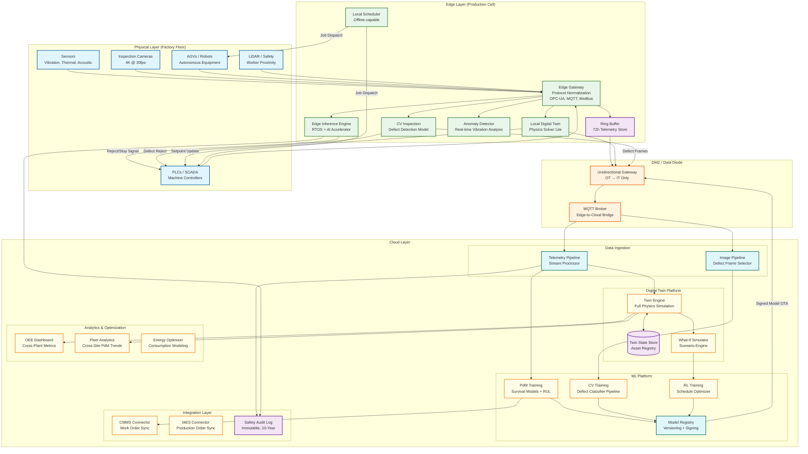
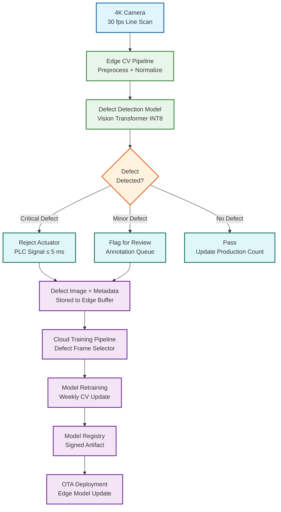
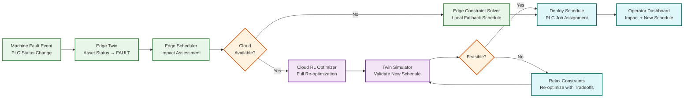
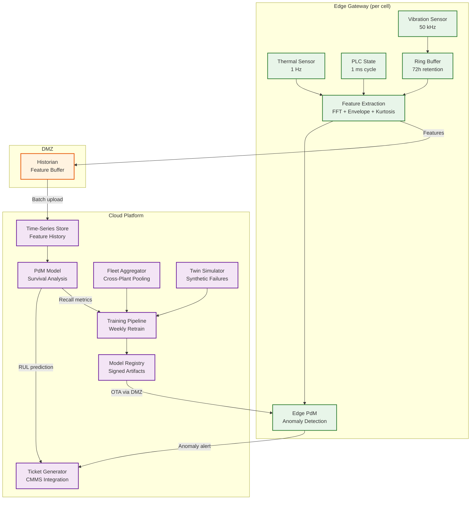
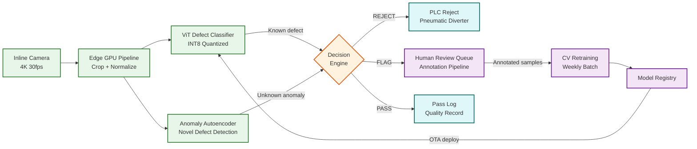

# 13.1 AI-Native Manufacturing Platform — High-Level Design

## System Architecture



---

## Key Design Decisions (ADR Format)

### ADR-01: Edge-Fog-Cloud Hierarchy with Physics-Constrained Inference Placement

**Status:** Accepted

**Context:** ML models in manufacturing have latency requirements spanning 5 orders of magnitude (5 ms to 5 minutes). A single compute tier cannot satisfy all constraints.

**Decision:** The platform does not use a uniform compute model. Every ML model is assigned to a specific compute tier based on its latency constraint:

| Tier | Latency Budget | Models | Hardware |
|---|---|---|---|
| **Edge (hard real-time)** | < 10 ms | Defect rejection, emergency stop, worker safety | RTOS + edge AI accelerator (NPU/GPU); hardware watchdog |
| **Fog (soft real-time)** | 100 ms – 2 s | PdM anomaly alerts, local twin sync, robot path planning | Edge server with general-purpose GPU; Linux RT kernel |
| **Cloud (batch/advisory)** | Seconds to minutes | Model training, fleet analytics, cross-plant scheduling, what-if simulation | Scalable GPU clusters; distributed storage |

**Rationale:** Physics determines the tier assignment, not preference. A conveyor at 2 m/s passes the rejection point in 100 ms; cloud inference at 200 ms is physically impossible. PdM requires 15-minute feature windows from hours of historical data; edge cannot store sufficient history. Training requires fleet-wide data aggregation impossible at the edge.

**Consequences:** Model deployment is not a uniform container push. Edge models must be compiled to specific accelerator targets (INT8 quantized, ONNX Runtime or TensorRT), tested against timing budgets on representative hardware, and deployed with rollback capability that preserves the previous model on-device until the new model passes acceptance tests.

**Alternatives Considered:** (1) Cloud-only inference with edge caching — rejected because physics prevents it for safety-critical models. (2) Edge-only inference — rejected because training requires fleet-wide data that cannot fit on edge.

### ADR-02: Unidirectional Data Flow from OT to IT (IEC 62443 Enforcement)

**Status:** Accepted

**Context:** Manufacturing networks must bridge IT and OT domains with fundamentally different security priorities (IT: confidentiality; OT: availability + safety).

Data flows from the factory floor (OT network) to the analytics cloud (IT network) through a DMZ that enforces unidirectional communication for safety-critical segments:

- **OT → IT (allowed):** Sensor telemetry, twin state updates, defect images, audit logs
- **IT → OT (restricted):** Model artifacts (signed, integrity-verified), schedule recommendations (require local validation), twin setpoint suggestions (require PLC-side safety interlock confirmation)
- **IT → OT (blocked):** Direct PLC commands, unsolicited firmware updates, arbitrary network traffic

This is enforced by hardware data diodes in safety-critical segments (SIL-2 and above) and by firewall rules in lower-criticality segments. The model deployment pipeline pushes signed artifacts to a staging area in the DMZ; edge gateways pull from the staging area on their own schedule.

**Consequences:** The cloud cannot "push" real-time commands to the factory floor. All closed-loop control runs at the edge. The cloud provides advisory outputs (recommended setpoints, schedule plans) that the edge validates and applies autonomously.

**Alternatives Considered:** (1) Firewall-based segmentation without data diode — rejected for SIL-2 segments because software firewalls can be misconfigured; hardware diodes are physically unidirectional. (2) Full air gap with manual data transfer — rejected because it would eliminate real-time analytics and automated model deployment.

### ADR-03: Digital Twin as the Integration Backbone

**Status:** Accepted

**Context:** PdM, CV, scheduling, energy optimization, and robotics coordination all need access to shared asset state. Point-to-point integration creates O(N²) coupling.

Rather than building point-to-point integrations between PdM, CV, scheduling, and control systems, all subsystems communicate through the digital twin state:

- PdM writes health indices to the twin → scheduling reads health indices when planning maintenance windows
- CV writes quality metrics to the twin → the what-if simulator uses quality trends to evaluate process parameter changes
- The scheduler writes planned job sequences to the twin → robot coordination reads the sequence to plan paths
- Energy optimizer reads machine state from the twin → writes energy-optimal setpoint suggestions back to the twin

**Consequences:** The twin state store becomes the single source of truth and the primary Slowest part of the process. It must support high-throughput concurrent reads and writes from multiple subsystems, with conflict resolution for simultaneous setpoint suggestions from different optimizers. The twin uses a last-writer-wins strategy with priority tiers: safety overrides (highest) > quality holds > scheduling > energy optimization (lowest).

**Alternatives Considered:** (1) Event bus for inter-subsystem communication — rejected because it doesn't provide conflict resolution or physics simulation. (2) Shared database with triggers — rejected because it lacks physics solver capability and produces race conditions under concurrent writes.

### ADR-04: Offline-First Edge Architecture

**Status:** Accepted

**Context:** Factory production runs 24/7 at $50,000/hour. Cloud connectivity cannot be a production dependency.

Every edge gateway maintains enough local state and compute capability to operate independently during cloud outages:

- **Local model cache:** All active inference models stored on edge NVMe; no model download needed at inference time
- **72-hour telemetry buffer:** Ring buffer on edge NVMe stores raw sensor data for post-outage upload and forensic analysis
- **Local scheduling fallback:** A constraint solver runs on-edge with the last-known production order list; produces valid (if suboptimal) schedules without cloud input
- **Twin state persistence:** Local twin state checkpointed to disk every 60 seconds; survives edge restart

**Consequences:** Reconnection after a cloud outage triggers a delta sync protocol: edge uploads accumulated telemetry, twin state updates, and inference logs; cloud pushes any pending model updates and schedule adjustments. The sync protocol uses vector clocks per asset to detect and resolve conflicts between edge-autonomous decisions and cloud-planned decisions.

### ADR-05: Physics-Informed ML Over Pure Data-Driven Models

**Status:** Accepted

**Context:** Run-to-failure data is sparse (5–10 events/year/asset type). Pure data-driven models require orders of magnitude more failure examples than manufacturing produces.

Pure data-driven models (e.g., training an LSTM on raw vibration time series to predict failure) require large volumes of run-to-failure data—which is rare in manufacturing (a well-maintained factory may see only 5–10 bearing failures per year per asset type). Physics-informed models combine:

- **Physics priors:** Known degradation models (Paris' law for crack growth, Archard's law for wear) provide the shape of the degradation curve
- **Sensor features:** Spectral features (FFT peaks, envelope analysis, kurtosis) extracted from vibration and acoustic data provide the current health indicator values
- **Digital twin simulation:** The twin generates synthetic run-to-failure trajectories by accelerating degradation in simulation, augmenting the sparse real failure data

**Consequences:** The PdM pipeline is not a standard ML training loop. It includes a physics simulation stage (twin generates synthetic failures), a feature engineering stage (domain-specific spectral analysis), and a hybrid model training stage (combining physics priors with learned parameters). The ML engineer must collaborate with domain experts (reliability engineers, tribologists) to define the physics priors correctly.

**Alternatives Considered:** (1) Pure deep learning on raw waveforms — rejected because 3.6B samples/day is computationally prohibitive and 5-10 failures/year is statistically insufficient. (2) Rule-based threshold alarms — rejected because they lack predictive capability and produce excessive false alarms.

### ADR-06: Defense-in-Depth Safety Architecture

**Status:** Accepted

**Context:** The AI inference engine participates in safety functions (worker proximity detection, anomaly-triggered emergency stop) but must not be the sole safety mechanism.

**Decision:** Three independent safety layers operate in parallel: (1) AI layer (probabilistic, software) detects subtle patterns and recommends early action; (2) PLC safety function (deterministic, firmware) monitors hard thresholds independently of AI; (3) Hardware safety relay (electromechanical, no software) de-energizes actuators on limit exceedance.

**Rationale:** IEC 61508 requires that no single point of failure can lead to a dangerous state. The AI model can crash, timeout, or produce garbage output; layers 2 and 3 must continue to protect independently. The AI provides optimization value (earlier detection, better discrimination) but is never the last line of defense.

**Consequences:** The AI model's SIL classification is reduced (SIL-1 for advisory stop, not SIL-2 for primary safety) because the PLC and hardware relay carry the safety burden. This simplifies AI model validation (no SIL-2 software certification for the ML model itself) at the cost of requiring hardware safety infrastructure.

### ADR-07: Time Synchronization via IEEE 1588 PTP

**Status:** Accepted

**Context:** Cross-sensor analysis (correlating vibration anomaly with thermal spike with PLC state change) requires all sensor readings to share a common time base with sub-microsecond accuracy.

**Decision:** All edge gateways and PLCs synchronize to IEEE 1588 Precision Time Protocol. A GPS-disciplined PTP grandmaster clock serves as the factory-wide time source. Edge gateways serve as PTP boundary clocks for their cell-level sensor networks.

**Rationale:** NTP provides millisecond accuracy; PTP provides sub-microsecond accuracy. When correlating a vibration spike at sensor A with a temperature anomaly at sensor B to determine if they're from the same root cause, the timing precision must be tighter than the physical propagation time of the fault (vibration travels through steel at ~5,000 m/s; across a 2m machine in 0.4 ms). NTP accuracy is insufficient for this analysis.

**Consequences:** Requires PTP-capable network switches on the OT network (most industrial switches support PTP). GPS antenna installation per factory for grandmaster clock. PTP adds ~$1,000 per factory in infrastructure cost but is essential for causal analysis across sensors.

---

## Data Flow: Sensor Reading to Predictive Maintenance Alert

```mermaid
flowchart LR
    A[Vibration Sensor\n50 kHz Accelerometer] --> B[Edge Gateway\nOPC-UA Ingestion]
    B --> C[Ring Buffer\nRaw Waveform Storage]
    C --> D[Feature Extractor\nFFT + Envelope + Kurtosis]
    D --> E[Anomaly Detector\nStatistical Process Control]
    E -->|Normal| F[Downsample + Forward\nSpectral Summary to Cloud]
    E -->|Anomaly Detected| G[Trigger Detailed Analysis\nFull Waveform Upload]
    F --> H[Cloud PdM Pipeline\n15-min RUL Refresh]
    G --> H
    H --> I[Survival Model\nPhysics-Informed RUL]
    I --> J{RUL < Threshold?}
    J -->|Yes| K[Auto-Generate\nMaintenance Ticket]
    J -->|No| L[Update Health Index\nin Digital Twin]
    K --> M[CMMS Integration\nSchedule + Parts Order]
    L --> N[OEE Dashboard\nAsset Health Heatmap]

    classDef sensor fill:#e1f5fe,stroke:#01579b,stroke-width:2px
    classDef edge fill:#e8f5e9,stroke:#2e7d32,stroke-width:2px
    classDef cloud fill:#f3e5f5,stroke:#6a1b9a,stroke-width:2px
    classDef decision fill:#fff3e0,stroke:#e65100,stroke-width:2px
    classDef output fill:#e0f7fa,stroke:#00695c,stroke-width:2px

    class A sensor
    class B,C,D,E edge
    class F,G,H,I cloud
    class J decision
    class K,L,M,N output
```



---

## Data Flow: Inline Quality Inspection



---

## Data Flow: Schedule Disruption Recovery



---

## Component Responsibilities Summary

| Component | Primary Responsibility | Key Interface | Scaling Characteristic |
|---|---|---|---|
| **Edge Gateway** | Protocol normalization (OPC-UA, MQTT, Modbus, EtherCAT → unified schema), sensor ingestion, time alignment (PTP), change-of-value filtering | Sensor bus → internal telemetry stream; dual-NIC OT/IT separation | Linear per production cell; 20–100 per factory |
| **Edge Inference Engine** | RTOS-hosted model execution for safety-critical decisions; hardware watchdog enforcement; fail-safe state management | Telemetry stream → inference result → PLC actuator command | Bounded by NPU TOPS per gateway; vertical scaling via accelerator upgrade |
| **Edge CV Pipeline** | Image acquisition, preprocessing, defect detection/classification, reject signal generation | Camera GigE Vision → model inference → PLC reject signal | Linear per camera station; GPU partitioned per camera pair |
| **Local Digital Twin** | Lightweight physics solver for per-cell asset state; kinematics, thermal model; checkpoint to disk | Sensor stream → twin state update; twin state → setpoint suggestions | Memory-bounded: ~6 MB state per asset; 100 assets per gateway |
| **DMZ / Data Diode** | Unidirectional OT→IT data flow enforcement; model artifact staging for IT→OT deployment | Edge buffer → cloud ingestion; model registry → edge staging area | Throughput: 1 Gbps per diode link; add links for bandwidth |
| **Cloud Telemetry Pipeline** | Stream processing of cloud-forwarded telemetry; time-series storage; feature aggregation for PdM | MQTT bridge → stream processor → time-series database | Partitioned by plant_id; horizontal per factory |
| **Cloud Twin Engine** | Full-fidelity physics simulation; what-if scenarios; fleet-wide digital twin management | Telemetry stream + asset registry → full twin state; scenario API | CPU-bound physics solver; scales with asset complexity |
| **PdM Training Pipeline** | Survival model training; physics-informed feature engineering; synthetic failure generation from twin | Training data store → model training → model registry | GPU-bound; fleet-wide training shared across factories |
| **CV Training Pipeline** | Defect classifier retraining; active learning from human-annotated edge frames; model versioning | Defect image store → training → model registry → edge OTA | GPU-bound; weekly retraining per defect domain |
| **RL Scheduling Engine** | Multi-agent RL training for production scheduling; evaluates in twin simulator before deployment | Twin simulator → RL training → scheduling policy → edge scheduler | Bounded by twin simulator throughput for episode evaluation |
| **Model Registry** | Artifact versioning, signing, integrity verification, canary deployment orchestration | Training pipelines → registry → OTA deployment to edge fleet | Storage-bound; ~500 GB total across all model versions |
| **Safety Audit Log** | Immutable append-only log of all safety-critical decisions with cryptographic chaining | Edge inference events + PLC commands → append-only log; 10-year retention | Append-only; tiered storage (hot/warm/cold) |

---

## Data Flow: Predictive Maintenance Pipeline



---

## Data Flow: Computer Vision Quality Inspection



---

## Technology Selection Rationale

| Layer | Technology Choice | Rationale | Alternatives Considered |
|---|---|---|---|
| **Edge OS** | RTOS (VxWorks or Zephyr) for SIL-2 paths; Linux RT for non-safety | Deterministic scheduling required for sub-10 ms deadlines; SIL-2 certification available | Standard Linux (rejected: no deterministic scheduling guarantees) |
| **Edge AI Framework** | ONNX Runtime + TensorRT for GPU; OpenVINO for VPU/NPU | Cross-platform model portability; INT8 quantization support; deterministic memory allocation | TFLite (rejected: less NPU support); PyTorch Mobile (rejected: larger runtime footprint) |
| **Sensor Protocol** | OPC-UA for structured data; MQTT for lightweight telemetry; EtherCAT for real-time control | OPC-UA is the industry standard for interoperability; EtherCAT provides deterministic µs-level timing for safety loops | Modbus (legacy support only; too slow for high-frequency); PROFINET (EtherCAT preferred for safety-rated paths) |
| **Time-Series Storage** | Purpose-built time-series database with columnar compression | 50 factories × 430 GB/day requires compression ratios >10:1; time-partitioned queries must be sub-second | Generic relational DB (rejected: compression and query performance inadequate); Object storage (rejected: no indexed query capability) |
| **Twin Engine** | Custom physics solver with OpenUSD scene graph | Manufacturing physics (thermal, kinematic, wear) requires domain-specific solvers; OpenUSD provides standard 3D representation | Commercial PLM twin (rejected: insufficient real-time API; locked to vendor); Game engine (rejected: overkill for physics; poor determinism) |
| **ML Training** | Standard GPU cluster with distributed training | Fleet-wide models require multi-GPU training; weekly retraining cycles tolerate batch compute | Edge training (rejected: insufficient compute for fleet models); Cloud TPU (rejected: GPU availability and framework compatibility) |
| **Safety Communication** | EtherCAT Safety (FSoE) on dedicated bus | Hardware-level safety protocol meeting IEC 61508 SIL-3 capable; deterministic cycle time | PROFIsafe (viable alternative; EtherCAT chosen for lower cycle time); Standard Ethernet (rejected: no safety certification) |
| **Model Signing** | RSA-4096 with HSM-stored keys | Industry-standard code signing; HSM prevents key extraction; edge verification is computationally cheap | ECDSA-384 (viable; RSA chosen for broader HSM support); GPG (rejected: not enterprise-grade key management) |

---

## Capacity Planning Decision Tree

```
When to add edge compute capacity:
  IF gateway CPU utilization > 70% sustained for 8h → add gateway or upgrade CPU
  IF gateway GPU utilization > 60% sustained → model optimization first; if still high, add GPU
  IF ring buffer utilization > 60% → increase NVMe size or reduce retention window
  IF sensor ingestion dropping packets → add gateway; rebalance machine-to-gateway assignment

When to add cloud capacity:
  IF telemetry ingestion lag > 60 seconds → add stream consumer instances
  IF time-series query p95 > 5 seconds → add read replicas or increase hot tier retention
  IF PdM retraining takes > 24 hours → add GPU capacity to training cluster
  IF twin simulation queue depth > 100 → add twin engine compute instances

When to add network capacity:
  IF factory WAN utilization > 80% during normal operation → upgrade WAN link
  IF reconnection sync takes > 2 hours → upgrade WAN or increase edge-side data reduction
  IF OT switch bandwidth > 60% → redesign OT network topology (add switches, redistribute)
```
