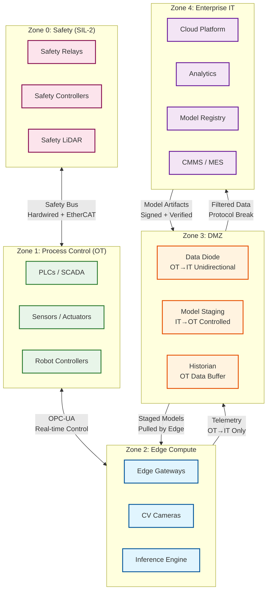

# 13.1 AI-Native Manufacturing Platform — Security & Compliance

## Regulatory Landscape

The AI-native manufacturing platform operates at the intersection of industrial cybersecurity, functional safety, and data protection—three regulatory domains with distinct and sometimes conflicting requirements.

### IEC 62443 — Industrial Automation and Control Systems Security

IEC 62443 is the primary cybersecurity standard for industrial environments. It defines a zone-and-conduit model that segments the network into security zones with controlled communication paths (conduits) between them.

**Platform obligations:**

| Requirement | Implementation |
|---|---|
| Zone segmentation | Factory floor (OT), DMZ, enterprise IT, and cloud are separate security zones; each zone has defined security level (SL-1 to SL-4) |
| Conduit control | All inter-zone communication traverses defined conduits with protocol-specific allow lists; no zone-to-zone routing outside conduits |
| Security levels per zone | OT zone: SL-3 (protection against intentional attack by sophisticated means); DMZ: SL-3; Cloud: SL-2 |
| Component hardening | Edge gateways run minimal OS (stripped Linux or RTOS); no unnecessary services; SSH disabled in production; all ports closed except defined conduit ports |
| Account management | No shared accounts; individual credentials per device and per human operator; machine-to-machine communication uses mutual TLS with per-device certificates |
| Incident response | Automated detection of unauthorized devices on OT network; alert within 30 seconds; automated quarantine of rogue devices |

### IEC 61508 — Functional Safety

IEC 61508 governs safety-critical control systems. The platform's edge inference engine participates in safety functions and must comply with the applicable Safety Integrity Level (SIL).

**SIL assignment for platform components:**

| Component | SIL Level | Rationale |
|---|---|---|
| Worker proximity detection (LiDAR/camera → machine stop) | SIL-2 | Direct worker safety; machine must stop within 50 ms of exclusion zone violation |
| Emergency stop via anomaly detection | SIL-1 | Equipment protection; AI provides early warning but PLC safety function is the primary safeguard |
| Defect rejection actuator | Not safety-rated | Quality function, not safety; failure mode is escaped defect, not personal injury |
| Production scheduling | Not safety-rated | Optimization function; no safety consequence of suboptimal schedule |

**SIL-2 compliance for worker proximity detection:**

```
SIL-2 requirements:
  Probability of dangerous failure per hour (PFH): < 10^-6
  Hardware fault tolerance: 1 (single fault does not cause dangerous failure)
  Systematic capability: SC 2

  Implementation:
    - Dual-channel sensor: LiDAR + camera; both must agree on "zone clear" to enable machine operation
    - Independent processing: two separate inference pipelines on different hardware
    - Voter logic: 2oo2 (both channels must agree on "safe") for machine enable;
                   1oo2 (either channel detects violation) for machine stop
    - Watchdog: Hardware watchdog on each channel; timeout → machine stop (fail-safe)
    - Proof test: Automated daily self-test of sensor paths and actuator response
    - Diagnostic coverage: > 90% (required for SIL-2)
```

### ISO 55000 — Asset Management

The PdM and digital twin components must align with ISO 55000 asset management principles:
- Asset lifecycle tracking from commissioning to decommissioning
- Documented maintenance strategy per asset class (time-based, condition-based, or predictive)
- Performance measurement (OEE, availability, reliability)
- Continuous improvement based on failure mode analysis

### GDPR — Worker Data Protection (EU Jurisdictions)

In EU factories, worker safety monitoring (LiDAR, camera-based proximity detection) may capture personal data:

| Data Type | Classification | Handling |
|---|---|---|
| Worker proximity coordinates | Personal data (location tracking of identifiable workers) | Purpose limitation: used only for safety; retention ≤ 24 hours unless incident |
| Safety camera footage | Personal data if workers identifiable | No facial recognition; silhouette-only processing; footage retained 7 days unless incident |
| Worker badge scan at machine login | Personal data | Used for access control and audit; retained per employment contract |
| Aggregated productivity metrics (per-cell, not per-worker) | Non-personal | Freely used for OEE analytics |

---

## OT/IT Network Security Architecture

### Zone and Conduit Model



### Data Diode Enforcement

For SIL-rated segments (Zone 0, Zone 1), the OT→IT boundary uses a hardware data diode—a physically unidirectional network device that allows data to flow from OT to IT but makes IT→OT communication physically impossible:

```
Data diode properties:
  Direction: OT → IT only (no return path at physical layer)
  Protocol: UDP-based; data diode transmits packets; no TCP handshake possible
  Throughput: 1 Gbps per diode link

  What crosses the diode:
    - Sensor telemetry (structured messages, one-way)
    - Safety audit log entries (one-way)
    - Twin state updates (one-way)
    - CV inspection results and defect images (one-way)

  What cannot cross the diode:
    - Commands from IT to OT (physically blocked)
    - Model artifacts (must use separate controlled conduit)
    - Configuration changes (must use separate controlled conduit)

  Model deployment path (separate from diode):
    - Model artifact uploaded to staging server in DMZ
    - Edge gateway polls staging server on scheduled interval (every 15 min)
    - Gateway verifies artifact signature before download
    - No push mechanism; edge always initiates the pull
```

---

## Model Security and Supply Chain

### Model Artifact Integrity

```
Model signing and verification:
  Signing:
    1. ML pipeline produces model artifact (weights + graph + metadata)
    2. Model hash computed: SHA-256 of complete artifact
    3. Hash signed with platform code-signing key (RSA-4096, stored in HSM)
    4. Signature + model hash stored in model registry alongside artifact

  Verification (at edge deployment):
    1. Edge gateway downloads artifact from DMZ staging server
    2. Computes SHA-256 of downloaded artifact
    3. Verifies signature using platform public key (embedded in gateway firmware)
    4. If verification fails: artifact rejected; alert raised; previous model retained
    5. If verification succeeds: artifact staged for deployment

  Supply chain protection:
    - Training pipeline runs in isolated compute environment (no internet access)
    - Training data access logged; requires dual approval
    - Model artifact is immutable after signing; any modification invalidates signature
    - No model can be deployed to edge without passing through the signing pipeline
```

### Adversarial Attack Surface for ML Models

| Attack Vector | Risk | Mitigation |
|---|---|---|
| Adversarial input to CV model (malicious pattern on part surface that causes misclassification) | Low probability in manufacturing (attacker would need physical access to production line) | Input validation: reject images outside expected intensity/contrast range; anomaly autoencoder detects out-of-distribution inputs |
| Model poisoning via training data manipulation | Compromised training data could train a model that misses specific defect types | Training data provenance tracking; anomaly detection on training loss curves; validation holdout from separate data source |
| Model extraction via edge inference API | Attacker queries edge model to reconstruct weights | Edge inference API is internal only (not exposed to IT network); rate limiting on internal API; no gradient information returned |
| Model evasion via environmental manipulation | Attacker manipulates lighting or camera angle to reduce CV accuracy | Calibration checks: periodic reference part inspection; alert if accuracy on reference parts degrades |

---

## Access Control

### Role-Based Access Matrix

| Role | Can Access | Cannot Access |
|---|---|---|
| Production Operator | Machine status, production counts, quality results for their cell | PdM model internals, raw sensor data, other cells |
| Maintenance Technician | Maintenance tickets, asset health indices, sensor trends for assigned assets | Model training data, scheduling algorithms, other plants |
| Quality Engineer | Inspection results, defect trends, CV model accuracy reports | Raw sensor telemetry, scheduling, PdM model parameters |
| Plant Manager | Plant-wide OEE, quality dashboards, maintenance KPIs | Model weights, raw telemetry, security zone configuration |
| ML Engineer | Model artifacts, training metrics, feature pipelines, model registry | Individual worker data, safety zone configurations |
| OT Security Engineer | Network zone configurations, firewall rules, device inventory, security alerts | Production data, quality results, business metrics |
| Platform Administrator | System configuration, edge gateway management, deployment orchestration | Individual worker data, safety interlock configuration (requires safety engineer) |
| Safety Engineer | Safety interlock configuration, SIL documentation, worker proximity system | ML model training, production scheduling, business analytics |

### Edge Device Authentication

```
Edge gateway authentication:
  Device identity: Per-device X.509 certificate issued during commissioning
  Certificate rotation: Every 90 days via automated renewal through DMZ CA
  Mutual TLS: All edge-to-cloud communication uses mTLS; both sides verify certificates

  PLC-to-gateway authentication:
    OPC-UA: Application-level certificate authentication per OPC-UA specification
    EtherCAT: Network-level isolation (dedicated physical bus); no authentication layer (protocol limitation)
    MQTT: Username/password + TLS; per-device credentials

  Decommissioning:
    Device certificate revoked in CRL within 1 hour of decommission request
    Edge gateway data wiped (secure erase of NVMe) before physical removal
    All model artifacts and cryptographic material destroyed
```

---

## Threat Model

### Attack Surface Analysis

| Attack Surface | Threat Agent | Attack Vector | Impact | Likelihood | Risk | Mitigation |
|---|---|---|---|---|---|---|
| Factory Wi-Fi / Ethernet | External attacker | Compromise IT network, pivot to OT through flat network | Production shutdown, equipment damage, safety hazard | High (if flat network) | Critical | IEC 62443 zone segmentation; no direct IT→OT routing; DMZ with controlled conduits |
| OPC-UA endpoints on edge gateways | Insider or compromised IT host | Send malicious commands to PLCs via OPC-UA write operations | Equipment damage, production of defective parts | Medium | High | OPC-UA session authentication; per-client certificates; write operations require dual approval for safety-critical parameters |
| Model artifacts in transit | Supply chain attacker | Replace model artifact with adversarial model that passes good/bad parts incorrectly | Defective parts shipped to customers; quality system silently bypassed | Low | Critical | Code-signing with HSM-stored RSA-4096 key; SHA-256 verification at edge; model provenance tracking from training data to deployment |
| Sensor data streams | Physical access attacker | Inject false sensor readings to mask degradation or trigger false alarms | Missed failures leading to equipment damage; unnecessary downtime from false alarms | Low | High | Sensor cross-validation (physics-based plausibility checks); out-of-range detection; sensor health monitoring |
| Edge gateway firmware | Advanced persistent threat | Compromise firmware to exfiltrate IP (toolpath programs, production recipes) | Trade secret theft; competitive intelligence loss | Low | High | Secure boot with TPM; firmware signing; no USB ports in production; read-only root filesystem |
| Historian / DMZ buffer | Ransomware | Encrypt OT data buffer in DMZ; demand ransom | Loss of historical telemetry; audit trail disruption | Medium | High | DMZ historian is append-only with immutable storage backend; automated backup every 15 min; historian rebuild from edge ring buffers |
| Worker safety system | Sophisticated insider | Disable or miscalibrate proximity detection to cause safety incident | Worker injury or fatality | Very Low | Critical | Independent safety certification per IEC 61508; safety system on physically separate hardware; daily proof tests; tamper detection |

### Kill Chain Analysis: IT-to-OT Pivot

```
Typical IT-to-OT attack progression:
  Stage 1: Initial compromise of enterprise IT (phishing, exploit, credential theft)
  Stage 2: Lateral movement within IT network; discovery of OT-connected systems
  Stage 3: Pivot attempt from IT to OT (the DMZ is the critical defense)
  Stage 4: OT reconnaissance and manipulation

Platform defenses at each stage:
  Stage 1 → Stage 2:
    - Standard IT security (EDR, network monitoring, patching) — outside platform scope
    - Platform-specific: model registry and analytics servers are hardened; minimal attack surface

  Stage 2 → Stage 3 (critical boundary):
    - Physical data diode: IT→OT traffic is physically impossible for safety-critical zones
    - DMZ staging server: only accepts model artifacts via API with mTLS + signed payload
    - Edge gateways PULL from DMZ; no push path exists (port scan from IT finds nothing)
    - Protocol break: DMZ converts IT protocols (REST) to OT protocols (OPC-UA); no protocol passthrough
    - Network monitoring: any unsolicited IT→DMZ traffic triggers alert within 30 seconds

  Stage 3 → Stage 4 (if DMZ compromised):
    - Edge gateways verify artifact signatures using keys embedded in firmware (not in DMZ)
    - PLC safety functions are independent of edge gateways; hardwired safety relays cannot be software-overridden
    - OT network monitoring detects unauthorized OPC-UA sessions
    - Physical safety interlocks operate on dedicated safety bus (EtherCAT Safety)

  Recovery:
    - OT zone can operate in full isolation (offline-first design)
    - IT compromise → isolate DMZ → factory continues producing using edge-autonomous mode
    - No production downtime from IT security incident (by design)
```

---

## Compliance Matrix

| Regulation / Standard | Scope | Key Requirements | Platform Implementation | Audit Evidence |
|---|---|---|---|---|
| **IEC 62443** | OT cybersecurity | Zone segmentation, security levels, component hardening, incident response | 5-zone architecture (Safety, OT, Edge, DMZ, IT); per-zone SL assessment; automated rogue device detection | Network topology documentation; penetration test reports; device inventory with SL mapping |
| **IEC 61508** | Functional safety | SIL assessment, hardware fault tolerance, diagnostic coverage, proof testing | Dual-channel sensing (LiDAR+camera); 2oo2/1oo2 voting; hardware watchdogs; daily proof tests | SIL calculation worksheets; proof test records; FMEDA reports; V&V documentation |
| **ISO 27001** | Information security | Risk assessment, access control, incident management, business continuity | RBAC matrix; mTLS everywhere; encrypted data at rest; incident response playbooks | Risk register; access review logs; incident tickets; BCP test results |
| **ISO 55000** | Asset management | Lifecycle tracking, maintenance strategy, performance measurement | Digital twin tracks full lifecycle; PdM + scheduled + condition-based maintenance; OEE dashboards | Asset register; maintenance strategy documents; OEE trends by asset class |
| **GDPR** (EU) | Worker data protection | Purpose limitation, data minimization, retention limits, DPIA | Silhouette-only processing; no facial recognition; 24h retention; per-factory DPIA | DPIA documents; data flow diagrams; retention policy audit; DPO review records |
| **NIS2 Directive** (EU) | Critical infrastructure security | Risk management, incident reporting, supply chain security | 24h incident notification; annual risk assessment; ML supply chain verification | Incident notification records; risk assessment reports; supplier security assessments |
| **Machinery Directive 2006/42/EC** | Machine safety | Risk assessment, safety components, documentation | Safety system design per EN ISO 12100; CE marking documentation | Technical file; risk assessment; declaration of conformity |

---

## Incident Response for OT Security Events

### Response Tiers

| Tier | Trigger | Response Time | Actions | Escalation |
|---|---|---|---|---|
| **Tier 1: Anomaly** | Unusual network traffic pattern; unexpected device on OT network | < 5 min | Automated: log event, increase monitoring sensitivity, notify SOC | If pattern persists > 15 min → Tier 2 |
| **Tier 2: Confirmed Intrusion Attempt** | Failed authentication to edge gateway; port scan detected on OT segment | < 15 min | Block source IP; isolate affected conduit; notify plant security + CISO | If any OT device compromised → Tier 3 |
| **Tier 3: OT Compromise** | Unauthorized command to PLC; model artifact tampered; edge gateway firmware modified | < 5 min (automated) | Isolate DMZ from IT; switch to offline-autonomous mode; halt model deployments; notify regulatory authority (NIS2) | Physical security + forensic team on-site |
| **Tier 4: Safety System Impact** | Safety system behavior anomaly; worker proximity detection malfunction | Immediate (automated) | All affected machines → safe state (stopped); activate backup safety systems; facility evacuation if warranted | Safety authority notification; production halt until investigation complete |

### OT Forensic Preservation

```
OT incident forensic requirements:
  1. Do NOT power off OT devices (volatile state is critical evidence)
  2. Capture PLC program memory (compare against known-good baseline)
  3. Preserve edge gateway logs (NVMe ring buffer contains 72h of raw telemetry)
  4. Export safety audit log (hash-chain verified, tamper-evident)
  5. Network packet capture from SPAN ports on OT switches (if pre-configured)
  6. Photograph physical state of machines and control panels

  Critical difference from IT forensics:
    - IT forensics: image the disk, power off, analyze offline
    - OT forensics: keep running (shutdown may be more dangerous than continued operation);
      capture volatile state first; physical evidence matters
    - Safety system state must be verified BEFORE investigating the security incident
    - Production continuity may take precedence over evidence preservation (plant manager decision)
```

---

## Network Microsegmentation Details

### Conduit Specifications

| Conduit | From Zone | To Zone | Protocols | Direction | Throughput | Monitoring |
|---|---|---|---|---|---|---|
| C1: Safety telemetry | Zone 0 (Safety) | Zone 2 (Edge) | EtherCAT Safety over dedicated bus | Bidirectional (hardwired) | 100 Mbps | Hardware diagnostics; no software monitoring (independence requirement) |
| C2: Process data | Zone 1 (OT) | Zone 2 (Edge) | OPC-UA, MQTT over TLS | Bidirectional | 1 Gbps | OPC-UA session monitoring; message rate anomaly detection |
| C3: Telemetry export | Zone 2 (Edge) | Zone 3 (DMZ) | HTTPS (structured telemetry), UDP (data diode) | OT→IT only | 1 Gbps | Data diode link monitoring; throughput anomaly detection |
| C4: Model staging | Zone 3 (DMZ) | Zone 2 (Edge) | HTTPS (pull-only from edge side) | IT→OT (edge-initiated) | 100 Mbps | Pull frequency monitoring; artifact size validation |
| C5: Data export | Zone 3 (DMZ) | Zone 4 (IT/Cloud) | HTTPS, gRPC over mTLS | Bidirectional | 10 Gbps | Standard API monitoring; rate limiting |
| C6: Model upload | Zone 4 (IT/Cloud) | Zone 3 (DMZ) | HTTPS with signed payload | IT→DMZ only | 1 Gbps | Signature verification; upload rate limiting |

### Firewall Rules (Simplified)

```
Zone 0 (Safety) firewall rules:
  ALLOW: EtherCAT Safety protocol on dedicated physical interface ONLY
  DENY: ALL IP traffic (Zone 0 is not IP-connected; it uses dedicated safety bus)
  Note: Zone 0 isolation is PHYSICAL, not logical; no firewall can bridge it

Zone 1 (OT) firewall rules:
  ALLOW: OPC-UA (port 4840) TO Zone 2 edge gateways (specific IPs)
  ALLOW: MQTT (port 8883, TLS) TO Zone 2 edge gateways (specific IPs)
  DENY: ALL traffic FROM Zone 3, Zone 4 (no inbound from IT/DMZ)
  DENY: ALL outbound to internet
  DENY: ALL protocols except OPC-UA, MQTT, NTP

Zone 2 (Edge) firewall rules:
  ALLOW: OPC-UA (port 4840) FROM Zone 1 PLCs (specific IPs)
  ALLOW: MQTT (port 8883) FROM Zone 1 sensors (specific IPs)
  ALLOW: HTTPS (port 443) TO Zone 3 DMZ historian (specific IP)
  ALLOW: HTTPS (port 443) FROM Zone 3 model staging server (specific IP; edge-initiated only)
  DENY: ALL traffic FROM Zone 4 (no direct IT→edge path)
  DENY: ALL outbound to internet

Zone 3 (DMZ) firewall rules:
  ALLOW: HTTPS (port 443) FROM Zone 2 edge gateways (telemetry upload)
  ALLOW: HTTPS (port 443) TO Zone 2 edge gateways (model pull responses)
  ALLOW: HTTPS (port 443) FROM Zone 4 cloud platform (model upload, API access)
  ALLOW: HTTPS (port 443) TO Zone 4 cloud platform (telemetry forwarding)
  DENY: ALL direct Zone 1 ↔ Zone 4 traffic (must traverse DMZ with protocol break)
  DENY: ALL Zone 3 → Zone 1 traffic (DMZ cannot reach OT directly)
```

---

## Safety Audit Log Design

```
safety_audit_entry {
  entry_id:        UUID
  timestamp:       uint64              -- nanosecond precision, PTP-synchronized
  prev_entry_hash: bytes[32]           -- SHA-256 chain; tamper-evident

  event_type:      enum               -- EMERGENCY_STOP | DEFECT_REJECT | SETPOINT_CHANGE |
                                       -- SAFETY_ZONE_VIOLATION | MODEL_DEPLOYMENT |
                                       -- MAINTENANCE_ACTION | OPERATOR_OVERRIDE

  source: {
    plant_id:      string
    cell_id:       string
    asset_id:      UUID
    gateway_id:    string
    model_version: string | null
  }

  event_data: {
    trigger:       string              -- what triggered the event
    sensor_values: map<string, float64> -- sensor readings at event time
    action_taken:  string              -- what the system did
    response_time_ms: float64          -- detection-to-action latency
    human_present: boolean | null      -- from proximity detection
  }

  entry_hmac:      bytes               -- HMAC-SHA256; key in edge TPM
}

Retention: 10 years (regulatory requirement for IEC 61508 compliance)
Storage: Edge-local → replicated to cloud (append-only, immutable)
Integrity: Hash chain verified daily; HMAC verified on every read
Access: Read-only for all roles except safety engineer (who can annotate, not modify)
```
