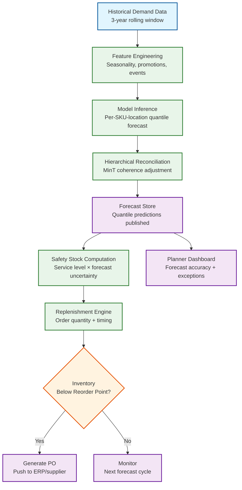
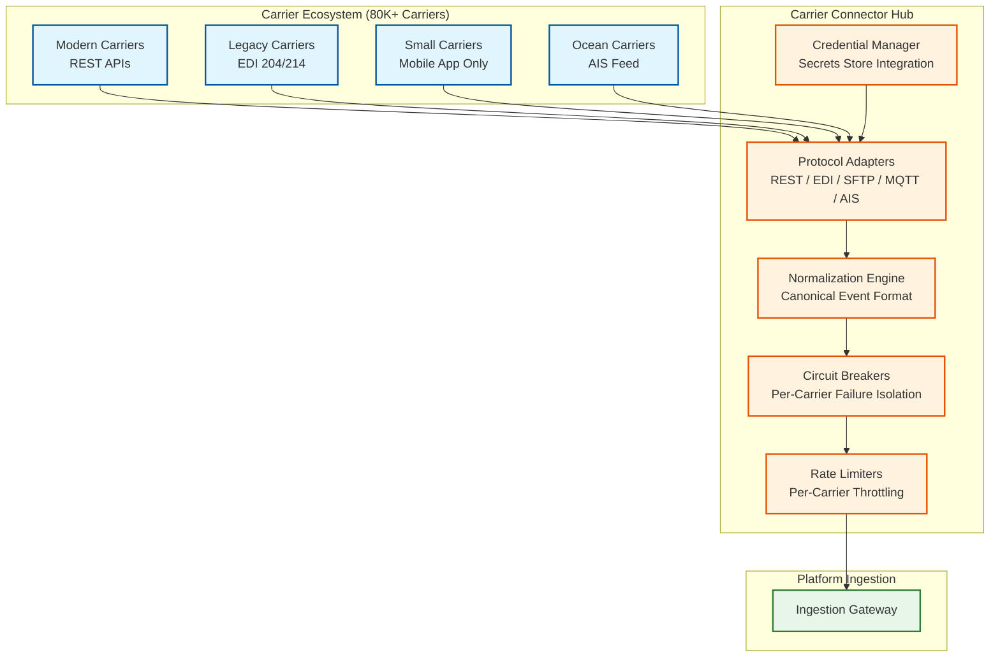

# 13.2 AI-Native Logistics & Supply Chain Platform — High-Level Design

## System Architecture

```mermaid
flowchart TB
    subgraph Sources["Data Sources"]
        GPS[GPS / Cellular Trackers]
        EDI[EDI Messages\n204/214/990]
        AIS[AIS / ADS-B\nOcean & Air]
        IOT[IoT Sensors\nTemp / Humidity / Vibration]
        TEL[Vehicle Telematics\nOBD-II / CAN Bus]
        ERP[ERP / OMS\nOrder Feeds]
    end

    subgraph Gateway["Ingestion & Gateway Layer"]
        IGWY[Telemetry Ingestion Gateway\nProtocol Normalization]
        OGWY[Order API Gateway\nAuth + Rate Limiting]
        CCON[Carrier Connector Hub\n80K+ Carriers]
    end

    subgraph Stream["Stream Processing Layer"]
        SEP[Shipment Event Processor\nEnrichment + Dedup]
        TEP[Telemetry Event Processor\nGeofence + Anomaly Detection]
        CEP[Complex Event Processor\nDisruption Detection]
    end

    subgraph Core["Core Intelligence Services"]
        RTE[Route Optimization Engine\nVRP Solver + Re-optimizer]
        DFS[Demand Forecasting Service\nHierarchical Probabilistic]
        WHO[Warehouse Orchestrator\nAMR + Pick-Path + Slotting]
        FMS[Fleet Management Service\nPredictive Maintenance + Safety]
        LMD[Last-Mile Delivery Optimizer\nDynamic Routing + ETA]
        INV[Inventory Intelligence\nSafety Stock + Replenishment]
    end

    subgraph Visibility["Visibility & Analytics Layer"]
        ETA[ETA Prediction Engine\nML-based Multi-modal]
        VIS[Visibility Service\nUnified Shipment Timeline]
        DIS[Disruption Manager\nClassification + Re-routing]
        SIM[What-If Simulator\nScenario Engine]
    end

    subgraph Data["Data Layer"]
        TSS[(Time-Series Store\nTelemetry & Sensors)]
        SDB[(Shipment DB\nLifecycle Records)]
        GDB[(Graph DB\nSupply Network Topology)]
        FDB[(Forecast Store\nQuantile Predictions)]
        WDT[(Warehouse Digital Twin\nReal-time State)]
        OBJ[(Object Storage\nCold Chain Audit / Archive)]
    end

    subgraph Consumer["Consumer Layer"]
        SHP[Shipper Dashboard]
        DRV[Driver Mobile App]
        CTR[Customer Tracking Page]
        PLN[Planner Workbench]
        API_OUT[Partner APIs]
    end

    GPS & AIS & IOT & TEL --> IGWY
    EDI --> CCON
    ERP --> OGWY

    IGWY --> SEP & TEP
    CCON --> SEP
    OGWY --> RTE & INV

    SEP --> VIS & ETA
    TEP --> CEP & FMS
    CEP --> DIS

    DIS --> RTE
    ETA --> VIS & LMD
    VIS --> SHP & CTR

    RTE --> SDB & DRV
    DFS --> FDB & INV
    WHO --> WDT & DRV
    FMS --> TSS & SHP
    LMD --> DRV & CTR
    INV --> SDB & PLN

    SIM --> PLN

    SEP & TEP --> TSS
    RTE & LMD --> SDB
    DFS --> FDB
    WHO --> WDT
    VIS --> GDB

    SHP & PLN --> OGWY
    API_OUT --> OGWY

    classDef source fill:#e1f5fe,stroke:#01579b,stroke-width:2px
    classDef gateway fill:#fff3e0,stroke:#e65100,stroke-width:2px
    classDef service fill:#e8f5e9,stroke:#2e7d32,stroke-width:2px
    classDef data fill:#f3e5f5,stroke:#6a1b9a,stroke-width:2px
    classDef cache fill:#fffde7,stroke:#f57f17,stroke-width:2px
    classDef queue fill:#e0f7fa,stroke:#00695c,stroke-width:2px
    classDef consumer fill:#fce4ec,stroke:#880e4f,stroke-width:2px

    class GPS,EDI,AIS,IOT,TEL,ERP source
    class IGWY,OGWY,CCON gateway
    class SEP,TEP,CEP,RTE,DFS,WHO,FMS,LMD,INV,ETA,VIS,DIS,SIM service
    class TSS,SDB,GDB,FDB,WDT,OBJ data
    class SHP,DRV,CTR,PLN,API_OUT consumer
```

---

## Key Design Decisions

### Decision 1: Event-Driven Telemetry Pipeline with Per-Shipment Ordering

All telemetry (GPS pings, sensor readings, EDI status updates, carrier API callbacks) flows through a unified event ingestion gateway that normalizes heterogeneous protocols into a canonical shipment event format. Events are partitioned by shipment_id in the stream processing layer, guaranteeing per-shipment causal ordering while allowing parallel processing across millions of concurrent shipments. This design is critical because a GPS ping that arrives before its corresponding "pickup confirmed" EDI message must not cause the ETA model to conclude the shipment is in transit without a confirmed pickup—the per-shipment ordering ensures events are processed in the correct causal sequence even when they arrive out of order from different sources.

**Implication:** The ingestion gateway must handle protocol translation (MQTT for IoT, HTTP for carrier APIs, AS2/SFTP for EDI, AIS NMEA for ocean) and apply per-shipment sequence numbering before routing to the stream processor. Late-arriving events (EDI messages delayed by hours) are replayed against the current shipment state using event sourcing semantics—the shipment timeline is reconstructed, not overwritten.

### Decision 2: Warm-Start Metaheuristic Solver for Route Optimization

The route optimization engine does not re-solve VRP instances from scratch on every change. Instead, it maintains a live solution state per depot and applies incremental perturbation when conditions change: a new order inserts a stop into the cheapest feasible position; a traffic delay shifts subsequent stop ETAs and may trigger stop resequencing; a vehicle breakdown reassigns affected stops to nearby vehicles. Only when cumulative perturbations degrade solution quality below a threshold (measured by total cost increase vs. last full solve) does the engine trigger a full re-optimization. This warm-start approach reduces re-optimization latency from 30 seconds (full solve) to under 5 seconds (incremental perturbation) for 90% of real-time changes.

**Implication:** The solver must maintain an in-memory representation of the current solution that supports efficient insert, remove, and resequence operations on individual routes. This is architecturally distinct from a batch solver that takes input, computes output, and discards state. The warm-start solution state must be checkpointed to durable storage every 60 seconds for crash recovery.

### Decision 3: Probabilistic Forecasting with Coherent Reconciliation

The demand forecasting service generates quantile predictions (P10, P25, P50, P75, P90) rather than single point forecasts. Quantile forecasts propagate uncertainty into downstream inventory decisions: safety stock is set based on the spread between P50 and P95, not on a single expected value plus a static safety factor. However, quantile forecasts generated independently at each level of the product-geography hierarchy are mathematically incoherent (the sum of SKU-level P90 forecasts does not equal the category-level P90 forecast). The platform applies MinT (Minimum Trace) optimal reconciliation to adjust all forecasts simultaneously, minimizing total forecast error subject to the coherence constraint.

**Implication:** Reconciliation is a large-scale matrix operation (10M SKU-location combinations × multiple hierarchy levels) that runs as a post-processing step after individual model inference. It requires a distributed linear algebra framework and is the computational Slowest part of the process in the forecast pipeline—not the individual model inference.

### Decision 4: Warehouse Digital Twin as the Planning Surface

Warehouse orchestration does not plan against an idealized warehouse model; it plans against a continuously updated digital twin that reflects the real-time physical state: AMR positions and battery levels, bin occupancy, conveyor segment status, human picker locations and productivity rates, dock door assignments, and zone temperatures. Every physical state change (AMR completes a task, picker scans a bin, conveyor stops) is reflected in the digital twin within 1 second. The optimization layer (pick-path, slotting, wave planning) queries the digital twin as its input state, not a static configuration file. This ensures that computed plans are physically feasible at the moment they are issued.

**Implication:** The digital twin is a per-warehouse in-memory data structure that receives ~2,000 state updates per second (from AMR position updates alone). It must support concurrent reads (optimization queries) and writes (state updates) without lock contention degrading latency. A CRDT-based state model or actor-based concurrency model is appropriate.

### Decision 5: Multi-Source ETA Prediction with Source-Specific Confidence Weighting

ETA predictions are generated by an ML model that ingests the latest telemetry from all available sources for a shipment and produces a time-to-arrival distribution (not a single point estimate). The model assigns confidence weights to each source based on the transport mode, geography, and historical reliability: GPS pings from a truck are weighted heavily; EDI status updates from a carrier with a history of delayed reporting are down-weighted; AIS pings in congested port areas are weighted lower than in open ocean. The ETA model is retrained weekly using actual delivery timestamps as ground truth labels.

**Implication:** The ETA model must handle missing inputs gracefully (a shipment in rural Africa may have only hourly satellite pings; a shipment in urban Germany has GPS every 10 seconds). The model architecture uses a masked attention mechanism that naturally handles variable-length, irregularly sampled telemetry sequences.

---

## Data Flow: Warehouse Pick-to-Ship

```mermaid
flowchart LR
    A[Wave Planner\nGroup orders into waves] --> B[Task Generator\nCreate pick tasks per SKU-bin]
    B --> C[AMR Dispatcher\nAssign tasks to AMRs]
    C --> D[Pick-Path Optimizer\nSequence picks for shortest path]
    D --> E[AMR Execution\nNavigate to bin, pick item]
    E --> F{Quality\nCheck?}
    F -->|Pass| G[Pack Station\nConsolidate into shipment]
    F -->|Fail| H[Exception Handler\nRe-pick or substitute]
    H --> C
    G --> I[Label & Manifest\nGenerate shipping label]
    I --> J[Dock Assignment\nRoute to correct loading dock]
    J --> K[Vehicle Load\nScan-verified loading]

    classDef input fill:#e1f5fe,stroke:#01579b,stroke-width:2px
    classDef process fill:#e8f5e9,stroke:#2e7d32,stroke-width:2px
    classDef decision fill:#fff3e0,stroke:#e65100,stroke-width:2px
    classDef output fill:#f3e5f5,stroke:#6a1b9a,stroke-width:2px

    class A,B input
    class C,D,E,G,H,I,J process
    class F decision
    class K output
```

---

## Data Flow: Order to Delivery

```mermaid
flowchart LR
    A[Order Received\nfrom ERP/OMS] --> B[Order Validation\n+ Inventory Check]
    B --> C[Carrier Selection\nRate + SLA + Capacity]
    C --> D[Route Optimization\nVRP Solver assigns stops]
    D --> E[Dispatch\nDriver App receives route]
    E --> F[In-Transit Tracking\nGPS + IoT telemetry stream]
    F --> G{Anomaly\nDetected?}
    G -->|Yes| H[Disruption Manager\nClassify + Re-route]
    H --> D
    G -->|No| I[ETA Update\nML prediction refreshed]
    I --> J[Customer Notification\nProactive status + live map]
    J --> K[Delivery\nProof-of-delivery capture]
    K --> L[Post-Delivery\nCarrier scorecard update]

    classDef input fill:#e1f5fe,stroke:#01579b,stroke-width:2px
    classDef process fill:#e8f5e9,stroke:#2e7d32,stroke-width:2px
    classDef decision fill:#fff3e0,stroke:#e65100,stroke-width:2px
    classDef output fill:#f3e5f5,stroke:#6a1b9a,stroke-width:2px

    class A,B input
    class C,D,E,F,H,I process
    class G decision
    class J,K,L output
```

---

## Data Flow: Demand Forecast to Replenishment

---

## Component Responsibilities Summary

| Component | Primary Responsibility | Key Interface |
|---|---|---|
| **Telemetry Ingestion Gateway** | Protocol normalization (MQTT, HTTP, AS2, AIS NMEA), rate limiting, per-shipment partitioning | Produces canonical events to stream processing layer |
| **Shipment Event Processor** | Event enrichment (carrier name, route context), deduplication, sequence correction | Reads from ingestion queue; writes to shipment DB and visibility service |
| **Route Optimization Engine** | VRP solving with warm-start incremental re-optimization; route assignment to vehicles | gRPC API; maintains in-memory solution state per depot |
| **Demand Forecasting Service** | Probabilistic forecast generation and hierarchical reconciliation | Batch pipeline; publishes to forecast store; consumed by inventory service |
| **Warehouse Orchestrator** | AMR task assignment, pick-path optimization, wave planning, slotting optimization | Real-time API; reads/writes digital twin; commands AMR fleet controller |
| **Fleet Management Service** | Telematics aggregation, predictive maintenance scheduling, driver safety scoring | Ingests from telematics stream; writes maintenance alerts and driver reports |
| **Last-Mile Delivery Optimizer** | Dynamic routing for delivery drivers; real-time ETA; proof-of-delivery processing | Mobile app API; 60-second re-optimization cycle; customer tracking feed |
| **ETA Prediction Engine** | ML-based time-to-arrival estimation with confidence intervals | Consumes telemetry events; publishes ETA updates to visibility service |
| **Visibility Service** | Unified shipment timeline assembly; tracking page data serving | Read API for dashboards, tracking pages, and partner APIs |
| **Disruption Manager** | Anomaly classification, disruption severity scoring, re-routing recommendation | Triggered by complex event processor; feeds re-routing to route engine |
| **Inventory Intelligence** | Safety stock computation, replenishment recommendation, dead stock detection | Consumes forecasts; writes replenishment orders to ERP integration |
| **What-If Simulator** | Scenario simulation for planners (disruptions, demand spikes, network changes) | Interactive API; reads supply network graph; returns simulated outcomes |

---

## Architecture Decision Records (ADRs)

### ADR-001: Per-Shipment Stream Partitioning Over Per-Carrier or Per-Region

**Context:** Telemetry events arrive from heterogeneous sources (GPS, EDI, AIS, IoT). The stream processing layer must maintain causal ordering to prevent state corruption (e.g., a GPS ping showing "in transit" arriving before the "pickup confirmed" EDI event).

**Decision:** Partition the ingestion stream by `shipment_id`, not by carrier, region, or event type.

**Alternatives considered:**
- Per-carrier partitioning: Simpler carrier onboarding, but a single carrier's outage floods one partition while others idle. Also breaks ordering when a shipment transfers between carriers (intermodal).
- Per-region partitioning: Geographic locality for processing, but cross-region shipments require cross-partition coordination.
- Per-event-type partitioning: Separates GPS from EDI from IoT, but destroys the per-shipment causal ordering that the visibility service depends on.

**Consequences:**
- (+) Per-shipment causal ordering is guaranteed by construction—all events for one shipment go to one partition.
- (+) Partition count can be scaled independently of carrier count or region count.
- (-) Hot partitions possible if a single shipment generates abnormally high event volume (e.g., IoT sensor on a high-value pharmaceutical shipment reporting every 10 seconds). Mitigation: per-shipment rate limiting at the ingestion gateway.
- (-) Rebalancing partitions requires careful draining to avoid event reordering during rebalance.

### ADR-002: In-Memory Solver State with Periodic Checkpointing Over Stateless Request-Response

**Context:** Route optimization must support both full VRP solves (30-second budget) and incremental re-optimization (5-second budget). Incremental re-optimization requires access to the current solution state.

**Decision:** Maintain solver state in-memory with 60-second checkpoint intervals to durable storage. Each depot has exactly one active solver instance with primary-standby failover.

**Alternatives considered:**
- Stateless solver (store solution in external DB, load on every request): 200–500 ms solution load latency per request eliminates the latency advantage of warm-start; ~3,000 DB reads/minute per depot during active re-optimization.
- Event-sourced solver state (replay all events to reconstruct solution): Correct but impractical—replaying 8 hours of events to reconstruct a solution takes 10+ seconds, negating the warm-start benefit.

**Consequences:**
- (+) Incremental re-optimization completes in < 5 seconds by directly modifying in-memory state.
- (+) Checkpoint cost is negligible: 50 KB per depot every 60 seconds.
- (-) Crash recovery loses up to 60 seconds of state (RPO = 60s). Acceptable: the solver re-processes queued events on recovery.
- (-) Solver affinity (one instance per depot) limits horizontal scaling—cannot spread one depot across multiple machines. Acceptable: no single depot has more stops than a single machine can handle.

### ADR-003: Probabilistic Forecasting with Post-Hoc Reconciliation Over End-to-End Hierarchical Model

**Context:** Demand forecasts must be coherent across the product-geography hierarchy (SKU-level forecasts must sum to category-level forecasts).

**Decision:** Train per-category quantile regression models at the leaf (SKU-location) level, then apply MinT optimal reconciliation as a post-processing step.

**Alternatives considered:**
- End-to-end hierarchical model (single model predicts all hierarchy levels simultaneously): Theoretically elegant but requires custom loss functions, prohibitive training data volume (all levels of all hierarchies in a single training set), and couples model quality across unrelated product categories.
- Top-down disaggregation (forecast at category level, proportionally split to SKUs): Discards SKU-level signals; proportional splits assume constant market share within a category, which is wrong during promotions or product launches.
- Bottom-up aggregation without reconciliation: Simple but produces incoherent forecasts that cause contradictory inventory signals.

**Consequences:**
- (+) Per-category models are independent: retraining one category does not risk degrading accuracy for others.
- (+) MinT reconciliation is a well-studied linear algebra problem with known convergence guarantees.
- (-) Reconciliation is the computational Slowest part of the process: 25–30 minutes for 10M nodes, longer than inference itself.
- (-) Reconciliation adjustments can move individual SKU-level forecasts significantly, which may surprise planners who trusted the pre-reconciliation numbers. Mitigation: surface reconciliation adjustment magnitude in the planner UI.

### ADR-004: Digital Twin as Source of Truth for Warehouse Planning Over Cached State Snapshots

**Context:** Warehouse optimization (pick-path, slotting, wave planning) needs current physical state to produce feasible plans.

**Decision:** Maintain a continuously updated digital twin per warehouse as the single source of truth for all optimization queries. The twin receives ~2,000 state updates/second from AMR position reports and responds to optimization queries concurrently.

**Alternatives considered:**
- Periodic snapshots (snapshot every 5 seconds, optimize against snapshot): Simpler concurrency but plans computed against a 5-second-old snapshot may be infeasible when issued (AMR moved, bin emptied, conveyor stopped).
- Database-backed state (read/write to distributed DB): Adds 5–10 ms latency per state read, unacceptable for AMR collision avoidance (sub-millisecond path checks needed).

**Consequences:**
- (+) Plans are feasible at the moment they are issued.
- (+) Optimization queries serve from in-memory state with sub-millisecond latency.
- (-) Requires actor-based or CRDT-based concurrency model to handle 2,000 writes/sec + concurrent reads without lock contention.
- (-) Per-warehouse instance means 500 stateful processes to manage, each with its own failure domain.

---

## Case Studies

### Case Study 1: Project44-Style Real-Time Visibility at Scale

**Problem:** A global logistics visibility provider needed to track 50M+ active shipments across 175,000 carriers with heterogeneous tracking capabilities (ranging from real-time GPS to daily EDI updates).

**Architecture choices:**
- Carrier-agnostic ingestion gateway supporting 12 protocol adapters (REST, MQTT, AS2/EDI, FTP, carrier-specific SDKs)
- Per-shipment event stream with 5,000 partitions processing 500K events/sec at peak
- ML-based ETA model retrained weekly on 18 months of historical delivery data; produces distribution-based predictions with calibrated 90% confidence intervals
- Multi-source signal fusion: when GPS and EDI conflict, trust the source with lower latency for the current transport mode

**Key lessons:**
- Carrier onboarding speed (minutes, not weeks) became the primary competitive differentiator—achieved through self-service API testing sandboxes and automatic protocol detection
- ETA accuracy improved 35% when the model incorporated carrier-specific delay patterns rather than using a universal model
- Notification debouncing (30-minute threshold for road, 4-hour for ocean) reduced customer complaint rate by 60% compared to raw ETA streaming

### Case Study 2: Blue Yonder-Style Demand Sensing and Fulfillment Optimization

**Problem:** A major CPG company needed to reduce forecast error for 2M SKU-location combinations across 15,000 retail locations while maintaining hierarchical coherence for category-level planning.

**Architecture choices:**
- LightGBM quantile regression models per product sub-category (150 models covering 200 product sub-categories)
- MinT reconciliation across a 6-level hierarchy (SKU → Sub-brand → Brand → Sub-category → Category → Total) × 4-level geography (Store → District → Region → National)
- Daily forecast refresh with demand sensing: intraday POS data adjustments to shift the short-term forecast (7-day horizon) based on actual morning sales

**Key lessons:**
- Hierarchical reconciliation reduced inventory allocation conflicts by 40% (category managers and store planners receiving consistent signals)
- Demand sensing (intraday POS adjustment) improved 1-day accuracy by 25% but had negligible impact on 30-day accuracy—confirming that short-term and long-term forecasting require different approaches
- Cold-start for new SKUs using similar-SKU transfer achieved 35% WMAPE in the first 4 weeks (vs. 55% WMAPE for naive category disaggregation)

### Case Study 3: FourKites-Style Disruption Intelligence

**Problem:** A supply chain visibility platform needed to proactively detect disruptions (port congestion, weather, strikes) and automatically re-route affected shipments before SLA violations occurred.

**Architecture choices:**
- External signal ingestion: weather APIs (5-minute refresh), port congestion indices (hourly), geopolitical risk feeds (real-time), carrier capacity reports (daily)
- Complex event processing with 200+ disruption detection rules combining external signals with shipment trajectory anomalies
- Geofence-based impact analysis: when a disruption is detected, query all active shipments within the affected geographic radius
- Priority-based batch re-optimization: affected shipments ranked by SLA urgency; most time-critical re-routed first

**Key lessons:**
- Proactive disruption detection (average 4-hour advance warning) enabled re-routing 65% of affected shipments before SLA violation
- Pre-computed contingency routes for the top 50 high-volume lanes reduced re-optimization time from 30 seconds to 3 seconds for those lanes
- The what-if simulator was critical for planner adoption—planners were reluctant to accept automated re-routing until they could preview the cost impact before committing

### Case Study 4: Autonomous Last-Mile Integration (2025–2026 Generation)

**Problem:** A delivery platform needed to integrate autonomous delivery vehicles (ADVs) alongside human-driven vans for last-mile delivery in urban areas, handling the different constraint profiles and handoff logistics.

**Architecture choices:**
- Dual-mode route optimizer: separate constraint profiles for ADVs (geo-fenced ODD, no customer interaction, weather-sensitive) and human drivers (HOS limits, customer delivery preferences, all-weather)
- Transfer hub optimization: ADVs deliver to lockers or curbside points; human drivers handle door-to-door; the optimizer jointly places transfer hubs and assigns shipments
- Dynamic mode switching: if an ADV encounters a condition outside its ODD (construction zone, severe weather), the affected stops are re-assigned to the nearest human driver in real time

**Key lessons:**
- Hybrid fleets achieved 22% cost reduction over pure human fleets in dense urban zones but required 3x the route optimization compute due to the additional constraint dimensions
- Transfer hub placement is a facility location problem that must be re-solved weekly as demand patterns shift—treating hubs as fixed locations missed 15% of the optimization opportunity
- Customer acceptance of locker delivery varied dramatically by demographic and geography; the system needed per-customer delivery preference learning to achieve acceptable satisfaction scores

---

## Technology Selection Rationale

### Stream Processing Layer

| Requirement | Technology Approach | Rationale |
|---|---|---|
| Per-shipment event ordering | Partitioned append-only log with shipment_id as partition key | Guarantees causal ordering per shipment while enabling parallel processing across millions of shipments |
| At-least-once delivery with idempotent writes | Idempotent key: (shipment_id, timestamp, source) | Prevents duplicates from carrier reconnection storms and retry logic |
| Multi-protocol ingestion | Protocol-specific adapters behind a unified ingestion gateway | GPS (MQTT), EDI (AS2/SFTP), IoT (MQTT/CoAP), carrier APIs (HTTP); normalized to canonical event format |
| 7-day retention with replay | Stream retention configured for 7 days; consumers can rewind to any offset | Enables reprocessing after bug fixes, new consumer deployment, or backfill operations |

### Data Store Selection

| Store Type | Use Case | Selection Criteria |
|---|---|---|
| **Time-series store** | Telemetry, fleet telematics, cold chain readings | Columnar compression for time-ordered numeric data; native downsampling; retention policies; sub-second queries on recent data |
| **Document store** | Shipment lifecycle records, route solutions | Flexible schema for heterogeneous shipment types; per-tenant partitioning; event-sourced with append-only event collections |
| **Graph store** | Supply chain network topology, carrier-lane relationships | Efficient traversal queries ("all paths from Shanghai to Chicago"); network centrality for disruption impact analysis |
| **Columnar analytics store** | Demand history, carrier scorecards, forecast accuracy | Efficient aggregation across millions of rows; supports the daily forecast pipeline and weekly model retraining |
| **In-memory state store** | Warehouse digital twin, solver state | Sub-millisecond read latency for AMR path planning; concurrent read/write support via actor model |
| **Object store** | Cold chain audit trail archive, POD photos, EDI file archive | Write-once immutable storage for compliance; cost-effective long-term retention; lifecycle policies |

### ML Model Serving Architecture

| Model | Serving Pattern | Latency Requirement | Retraining Frequency |
|---|---|---|---|
| ETA prediction | Online inference (stateless, horizontally scaled) | < 15 ms p99 | Weekly |
| Demand forecasting | Batch inference (parallel workers, overnight pipeline) | < 4 hours (pipeline SLO) | Weekly model; daily inference |
| Predictive maintenance | Near-real-time (micro-batch every 5 minutes) | < 30 seconds from sensor reading to prediction | Monthly |
| Disruption detection | Streaming inference (rules + ML anomaly detection) | < 5 seconds from signal to alert | Quarterly (infrequent disruption events limit training data) |
| Driver safety scoring | Batch (end-of-shift computation) | < 10 minutes per fleet | Monthly |
| Carrier selection scoring | Online (per-shipment scoring at order time) | < 100 ms | Monthly (scorecard refresh) |

---

## Cross-Cutting Concerns

### Multi-Tenancy

The platform serves thousands of shippers (tenants) simultaneously. Multi-tenancy is enforced at every layer:

- **API layer**: OAuth token yields tenant context; all downstream queries are tenant-scoped.
- **Data layer**: All tables partitioned by `tenant_id`; query-layer enforcement prevents cross-tenant data access even if application logic has a bug.
- **Compute layer**: Route solver instances are pooled across tenants (a solver instance handles one depot at a time, regardless of tenant). Warehouse orchestrators are per-warehouse (a warehouse typically belongs to one tenant, but some are multi-tenant 3PL facilities with intra-warehouse tenant isolation at the zone level).
- **ML models**: ETA and demand forecasting models are trained on cross-tenant data (more training data improves accuracy) but serve predictions scoped to each tenant's shipments. Carrier scorecards aggregate across tenants (with k-anonymity: minimum 50 shipments across 5 tenants for any carrier score to be published).

### Carrier Connectivity Architecture

