# 13.2 AI-Native Logistics & Supply Chain Platform — Scalability & Reliability

> This document covers horizontal scaling, geo-distributed architecture, reliability patterns, back-pressure mechanisms, surge handling, failure isolation, disaster recovery, chaos experiments, and capacity planning formulas.

---

## Horizontal Scaling Architecture

### Stateless Services and Their Scaling Axes

Every service in the platform is designed to be stateless at the request level; all durable state is pushed to dedicated data stores. This enables independent horizontal scaling of each service based on its specific Slowest part of the process (CPU, GPU, I/O, memory).

| Service | Scaling Axis | State Location |
|---|---|---|
| Telemetry Ingestion Gateway | Partition count (I/O-bound) | No local state; writes to stream partitions |
| Shipment Event Processor | Consumer group size (CPU-bound) | Per-shipment state in shipment DB |
| Route Optimization Engine | Instance count (CPU-bound, memory-heavy) | In-memory solver state checkpointed to persistent store |
| Demand Forecasting Service | Worker count (CPU-bound, batch) | Forecasts written to forecast store |
| Warehouse Orchestrator | Per-warehouse instance (memory-bound) | Digital twin in-memory; checkpointed to persistent store |
| Fleet Management Service | Replica count (CPU-bound) | Aggregated features in time-series store |
| Last-Mile Delivery Optimizer | Instance count per region (CPU-bound) | Route state in regional route store |
| ETA Prediction Engine | Replica count (CPU-bound) | Stateless inference; reads from telemetry and feature stores |
| Visibility Service | Read replica count (I/O-bound) | Reads from shipment DB and event store |

### Telemetry Ingestion Scaling

At 200,000 GPS pings per second (peak), the ingestion pipeline is the highest-throughput component. Scaling strategy:

```
Stream partitioning:
  Partition key: shipment_id (ensures per-shipment ordering)
  Partition count: 1,000 partitions
  Per partition: ~200 events/sec (well within single-consumer throughput)

Consumer scaling:
  1 consumer per partition = 1,000 consumer instances
  Each consumer: normalize event, enrich with shipment context, write to time-series store
  Processing latency per event: ~5 ms
  Throughput per consumer: ~200 events/sec (matches partition rate)

Back-pressure handling:
  If consumer falls behind: increase partition count (split by sub-range of shipment_id)
  Consumer lag monitored per partition; alert if lag exceeds 30 seconds
  Burst buffer: stream retention set to 24 hours; consumers can catch up after transient spike
```

### Route Optimization Scaling

Route optimization instances are CPU-intensive and memory-heavy (in-memory solution state). They cannot be trivially replicated because each depot's solver state is stateful.

```
Scaling design:
  1 solver instance per depot (stateful affinity)
  50,000 depots → 50,000 solver instances

  But: not all depots are active simultaneously
  Active at any given time: ~5,000 depots (others in off-hours)
  Instance pooling: idle solver instances release memory; re-hydrate from checkpoint on demand

  Peak morning planning (6-8 AM local time):
  Time zone staggering distributes load: US East peaks at 11:00 UTC, US West at 14:00 UTC,
  EU at 05:00 UTC, Asia at 22:00 UTC → global peak is ~2x average, not 5x

  Compute provisioning:
  5,000 active solvers × 4 CPU cores = 20,000 cores
  With 2x headroom: 40,000 cores reserved for route optimization
  Managed container service with auto-scaling based on active solver count
```

### Demand Forecasting Scaling

The forecast pipeline is batch-oriented (runs daily) but must complete within a 4-hour window. Scaling is achieved through horizontal worker parallelism:

```
Pipeline parallelism:
  10M SKU-location combinations / 100 workers = 100,000 per worker
  Per-SKU inference: ~10 ms → per worker: ~1,000 seconds (~17 minutes)

  Reconciliation parallelism:
  Each product hierarchy tree is independent → reconcile in parallel
  Typical: 500 independent hierarchy trees × 20 workers = 25 trees per worker
  Per tree reconciliation: ~60 seconds
  Total reconciliation: ~25 minutes

  End-to-end pipeline: 17 min (inference) + 25 min (reconciliation) + 5 min (overhead) = ~47 min
  Well within 4-hour SLO; 5x headroom for SKU growth
```

---

## Geo-Distributed Architecture

### Regional Deployment Model

The platform is deployed in regional clusters aligned with logistics operating regions. Each region handles its own telemetry processing, route optimization, and warehouse operations independently. Cross-region coordination handles only multi-leg shipments that traverse regions.

```mermaid
flowchart TB
    subgraph Americas["Americas Region"]
        direction TB
        A_IGW[Telemetry Gateway]
        A_RTE[Route Engine\n20K depots]
        A_WHO[Warehouse Orchestrators\n200 warehouses]
        A_ETA[ETA Engine\nUS traffic models]
        A_VIS[Visibility Service]
        A_TSS[(Time-Series Store)]
        A_SDB[(Shipment DB)]
    end

    subgraph Europe["Europe Region"]
        direction TB
        E_IGW[Telemetry Gateway]
        E_RTE[Route Engine\n15K depots]
        E_WHO[Warehouse Orchestrators\n150 warehouses]
        E_ETA[ETA Engine\nEU traffic models]
        E_VIS[Visibility Service]
        E_TSS[(Time-Series Store)]
        E_SDB[(Shipment DB)]
    end

    subgraph APAC["Asia-Pacific Region"]
        direction TB
        AP_IGW[Telemetry Gateway]
        AP_RTE[Route Engine\n15K depots]
        AP_WHO[Warehouse Orchestrators\n150 warehouses]
        AP_ETA[ETA Engine\nAPAC traffic models]
        AP_VIS[Visibility Service]
        AP_TSS[(Time-Series Store)]
        AP_SDB[(Shipment DB)]
    end

    subgraph Global["Global Services"]
        direction TB
        G_DFS[Demand Forecasting\nCentralized Reconciliation]
        G_CCH[Carrier Connector Hub\n80K+ carriers]
        G_CDN[Customer Tracking CDN]
        G_AIS[Global AIS Feed\nOcean Tracking]
        G_BUS[Cross-Region Event Bus]
    end

    A_VIS <-->|Async replication\n≤ 5s lag| G_BUS
    E_VIS <-->|Async replication\n≤ 5s lag| G_BUS
    AP_VIS <-->|Async replication\n≤ 5s lag| G_BUS

    G_AIS --> A_VIS & E_VIS & AP_VIS
    G_CCH --> A_IGW & E_IGW & AP_IGW
    G_DFS --> A_SDB & E_SDB & AP_SDB

    classDef service fill:#e8f5e9,stroke:#2e7d32,stroke-width:2px
    classDef data fill:#f3e5f5,stroke:#6a1b9a,stroke-width:2px
    classDef global fill:#fff3e0,stroke:#e65100,stroke-width:2px
    classDef region fill:#e1f5fe,stroke:#01579b,stroke-width:1px

    class A_IGW,A_RTE,A_WHO,A_ETA,A_VIS,E_IGW,E_RTE,E_WHO,E_ETA,E_VIS,AP_IGW,AP_RTE,AP_WHO,AP_ETA,AP_VIS service
    class A_TSS,A_SDB,E_TSS,E_SDB,AP_TSS,AP_SDB data
    class G_DFS,G_CCH,G_CDN,G_AIS,G_BUS global
```



**Per-region components:**
- Telemetry ingestion and stream processing (local data sovereignty)
- Route optimization engine (depot affinity within region)
- Warehouse orchestrators (warehouse affinity within region)
- ETA prediction (regional model variants trained on local traffic patterns)
- Visibility service (regional read replicas with cross-region federation)

**Cross-region components (globally shared):**
- Demand forecasting (centralized for hierarchy reconciliation across regions)
- Carrier connector hub (centralized carrier API integrations)
- Customer tracking portal (CDN-backed, served from nearest edge)
- Global AIS ocean tracking feed (ocean shipments are not region-bound)

### Cross-Region Shipment Visibility

A shipment from Shanghai to Chicago traverses APAC, crosses the Pacific (ocean), and enters the Americas region. The visibility service must stitch telemetry from both regions into a unified timeline:

```
Cross-region visibility:
  Each region's event processor writes events to a global event bus (async replication)
  The visibility service in the destination region assembles the full timeline by reading:
    - Local events (Americas legs)
    - Replicated events from origin region (APAC legs)
    - Ocean tracking events (global AIS feed, not region-specific)

  Replication lag: ≤ 5 seconds cross-region (async, eventually consistent)
  Acceptable: shipment timeline is append-only; late-arriving events from another region
  are inserted into the correct chronological position, not appended at the end
```

---

## Reliability Patterns

### Route Engine High Availability

The route optimization engine is the most operationally critical service: if it goes down, new orders cannot be assigned to vehicles, and real-time re-optimization stops. All drivers continue their last-known routes but cannot adapt to changes.

```
HA design:
  Primary-standby per depot:
    Primary solver: processes events and maintains in-memory solution state
    Standby solver: receives checkpointed state every 60 seconds (warm standby)
    Failover time: ~60 seconds (standby hydrates from latest checkpoint)

  Checkpoint storage: replicated across 3 availability zones
  RPO: ≤ 60 seconds (at most 60 seconds of re-optimization lost)
  RTO: ≤ 90 seconds (detection + standby activation + checkpoint load)

  Graceful degradation:
    If both primary and standby are unavailable:
      - Drivers continue executing their last-committed routes
      - New orders are queued (not lost) for processing when solver recovers
      - Manual dispatch fallback UI available for dispatchers
```

### Warehouse Orchestrator Resilience

If the warehouse orchestrator goes down, AMRs stop receiving task assignments. The platform uses a tiered fallback:

```
Tier 1 (normal): Central orchestrator assigns tasks, plans paths, coordinates fleet
Tier 2 (degraded): AMRs fall back to locally cached task queues (last 10 assigned tasks)
  AMRs execute cached tasks in order; no new task assignment until orchestrator recovers
Tier 3 (manual): Human pickers receive task assignments via mobile app from a simplified
  task queue that does not require the orchestrator (direct DB read of pending picks)

Recovery:
  On orchestrator restart, digital twin is rebuilt from:
    - AMR position reports (AMRs continue reporting position even without task assignments)
    - Bin scan events from the past N minutes (warehouse management system)
    - Conveyor status sensors (independent of orchestrator)
  Full digital twin recovery: ≤ 2 minutes
```

### Telemetry Pipeline Durability

No telemetry data may be lost. The pipeline uses at-least-once processing with idempotent writes:

```
Durability chain:
  1. Ingestion gateway writes raw event to durable stream (replicated across 3 AZs)
  2. Stream retention: 7 days (sufficient for any consumer to catch up)
  3. Event processor reads from stream; writes to time-series store with idempotent key
     (shipment_id + timestamp + source = natural idempotency key)
  4. Time-series store replicates synchronously within the AZ cluster

  Duplicate handling:
    GPS trackers may re-send events on connectivity restoration
    Idempotent key prevents duplicate writes to time-series store
    Duplicate events in stream are harmless (consumer skips if already processed)
```

### Cold Chain Compliance Under Connectivity Loss

IoT temperature sensors in refrigerated containers may lose cellular connectivity for hours (metal container walls attenuate RF signals; remote route segments have no coverage). The compliance system must handle gaps:

```
Sensor behavior during disconnection:
  Sensor buffers readings locally (flash storage: ~48 hours of 60-second readings)
  On connectivity restoration: transmits batch of buffered readings

Platform handling:
  Buffered readings ingested with original timestamps (not arrival time)
  Gap detection: if no reading received for > 10 minutes, flag as "connectivity gap"
  Excursion reconstruction: on batch arrival, retroactively detect any temperature excursions
    that occurred during the gap
  Compliance status: if a gap exceeds 30 minutes AND no excursion detected on batch arrival,
    flag as "unverified compliance interval" in the audit trail
```

---

## Back-Pressure Patterns

### Telemetry Ingestion Back-Pressure

When the telemetry processing layer falls behind (consumer lag growing), the platform applies graduated back-pressure:

```
Level 0 (normal):  Consumer lag < 5 sec; all events processed at full fidelity
Level 1 (mild):    Consumer lag 5-30 sec; non-critical enrichments deferred (carrier scorecard
                   updates batched instead of per-event; analytics side-channels paused)
Level 2 (moderate): Consumer lag 30-60 sec; telemetry sampling activated for non-SLA shipments
                   (reduce processing to every 3rd GPS ping for standard-tier shipments;
                   maintain full fidelity for cold chain, high-priority, and SLA-at-risk)
Level 3 (severe):  Consumer lag > 60 sec; emergency mode: only process events for shipments
                   with active SLA risk, cold chain monitoring, or disruption alerts;
                   buffer all other events for catch-up processing when load subsides
```

**Critical principle:** Cold chain monitoring NEVER participates in back-pressure shedding. Temperature excursion detection has its own dedicated processing pipeline that is isolated from general telemetry. Even under Level 3 back-pressure, every cold chain sensor reading is processed within 60 seconds.

### Route Solver Back-Pressure

When multiple depots simultaneously request re-optimization (morning planning surge, widespread disruption):

```
Solver queue management:
  Priority 1: Depots with imminent time-window violations (driver about to miss a stop)
  Priority 2: Depots with critical events (vehicle breakdown, customer escalation)
  Priority 3: Depots with accumulated batched events (routine re-optimization)

  If queue depth > 2x solver pool capacity:
    Extend solver time budget from 5s to 3s for Priority 3 (faster but lower quality)
    Defer Priority 3 solves by up to 180 seconds (batch more events, solve less frequently)
    Alert operations: "Route re-optimization is delayed by approximately X seconds"
```

---

## Surge Handling

### Peak Season (Holiday Shipping)

During peak holiday season (November–December for Western markets; Singles' Day in November for APAC), shipment volume spikes 5–10x across all subsystems:

| Subsystem | Spike Behavior | Mitigation |
|---|---|---|
| Telemetry Ingestion | 5x event rate | Pre-scale stream partitions 72h before peak; add consumer instances |
| Route Optimization | 3x VRP instances; 5x stops per instance | Pre-warm solver instances; increase time budget from 5s to 8s (accept slight latency increase for better solutions) |
| Warehouse Operations | 10x pick volume; 24/7 operations | Add AMR fleet capacity; extend wave planning to 24h continuous; pre-position high-velocity inventory near staging areas |
| Last-Mile Delivery | 8x deliveries per day | Temporary fleet expansion (gig drivers); widen delivery windows to increase routing flexibility |
| Demand Forecasting | Forecasts must capture holiday surge accurately | Holiday-specific model features (days-to-holiday, promotional calendar); planner override mechanism for unprecedented volume |
| Customer Tracking | 10x tracking page views | CDN-backed static content; pre-rendered tracking pages updated every 5 minutes instead of real-time |

### Disruption Surge (Port Closure, Natural Disaster)

When a major disruption occurs (port closure, hurricane, strike), a large number of shipments require simultaneous re-routing:

```
Disruption handling:
  1. Disruption detected (external feed or anomaly detection)
  2. Affected shipments identified (geofence query against active shipments)
  3. Batch re-optimization triggered for all affected depots simultaneously

  Scale challenge: a major port closure may affect 50,000+ shipments
  Mitigation:
    - Priority-based re-optimization: most time-critical shipments first
    - Pre-computed alternative routes for high-volume lanes (cached contingency plans)
    - Rate-limited re-optimization to prevent solver fleet from being overwhelmed
    - Human dispatcher involvement for shipments where automated re-routing fails
```

---

## Failure Isolation: Bulkhead Design

The platform uses strict bulkhead isolation between subsystems to prevent cascading failures:

- **Route optimization** has a dedicated compute pool separate from telemetry processing; a VRP solver consuming all CPU does not starve event processing
- **Warehouse orchestrators** are per-warehouse instances with no shared state; a failure in one warehouse does not affect others
- **ETA prediction** is stateless and horizontally scaled behind a load balancer; a model inference failure returns the last cached ETA rather than propagating an error
- **Cold chain monitoring** has a dedicated alerting pipeline independent of general shipment visibility; a visibility service outage does not suppress temperature excursion alerts
- **Customer tracking portal** is served from CDN with pre-rendered pages; a backend outage results in stale (but still functional) tracking pages rather than errors

---

## RTO and RPO

| Subsystem | RTO Target | RPO Target |
|---|---|---|
| Telemetry Ingestion | 2 min | 0 (stream buffered in durable storage) |
| Route Optimization | 90 sec | 60 sec (checkpointed every 60s) |
| Warehouse Orchestrator | 2 min | 30 sec (digital twin checkpointed) |
| Demand Forecasting | 30 min (batch job can restart) | 0 (idempotent; re-run produces same result) |
| Shipment Visibility | 5 min | 0 (event-sourced; replay from stream) |
| Cold Chain Monitoring | 30 sec | 0 (sensor readings buffered at sensor level) |
| Customer Tracking | 0 (CDN serves cached pages) | 5 min (pre-rendered page staleness) |

---

## Capacity Formulas

### Telemetry Ingestion Capacity

```
Required partitions = (peak_events_per_sec × safety_factor) / throughput_per_partition
  = (200,000 × 1.5) / 300
  = 1,000 partitions

Required consumers = partitions × 1  (1 consumer per partition)
  = 1,000 consumer instances

Consumer CPU:
  processing_time_per_event = 5 ms (normalize + enrich + write)
  events_per_consumer_per_sec = 1000 ms / 5 ms = 200
  CPU utilization per consumer at 200 events/sec ≈ 80% of 1 core
  Total consumer cores = 1,000 × 1 core = 1,000 cores

Memory per consumer:
  Shipment context cache (hot shipments): ~100 MB per consumer
  Total consumer memory = 1,000 × 100 MB = 100 GB
```

### Route Solver Capacity

```
Active solver instances = active_depots × 1
  Peak active depots = 5,000 (time-zone-staggered)

Cores per solver:
  ALNS iteration: 4-8 cores (parallel destroy/repair operator evaluation)
  Memory per solver: ~50 KB solution state + ~200 MB precomputed distance matrix
  Total cores = 5,000 × 6 avg = 30,000 cores
  With 1.5x headroom: 45,000 cores

Peak morning planning surge:
  6-8 AM local time concentration: 2x average
  Requires burst capacity: 60,000 cores for 2-hour window
  Strategy: reserved base capacity (30K cores) + auto-scale burst (30K cores)
```

### ETA Prediction Capacity

```
Prediction rate = active_shipments / refresh_interval
  = 5,000,000 / (5 min × 60 sec) = 16,667 predictions/sec

Per-prediction compute:
  Feature extraction: 2 ms
  Model inference: 8 ms
  Conformal interval: 1 ms
  Total: ~11 ms per prediction

Required cores = prediction_rate × time_per_prediction / 1000
  = 16,667 × 11 / 1000 = ~183 cores
  With 2x headroom: 370 cores (~50 instances × 8 cores each)
```

### Warehouse Orchestrator Capacity

```
Per warehouse:
  AMR position updates: 2,000/sec × 200 bytes = 400 KB/sec inbound
  Path planning queries: ~10/sec × 50 ms each = 500 ms/sec = 0.5 cores
  Digital twin memory: ~200 MB
  Task assignment: ~3/sec × 20 ms each = 60 ms/sec

Total per warehouse: ~2 cores, 512 MB RAM (with headroom)
Total platform: 500 warehouses × 2 cores = 1,000 cores
```

---

## Chaos Experiments

### Experiment 1: Route Solver Instance Kill During Active Re-Optimization

**Hypothesis:** When a solver instance is killed mid-optimization, the standby takes over within 90 seconds, and no stops are left unassigned.

**Method:**
1. Select 10 active solver instances at random during peak morning planning.
2. Send SIGKILL to each instance (simulate hard crash, not graceful shutdown).
3. Measure time until the standby instance begins processing new routing events.
4. Verify that all stops previously assigned in the killed instance's solution are present in the standby's recovered solution.

**Success criteria:**
- Standby activation ≤ 90 seconds for all 10 instances.
- Zero stops lost or duplicated after recovery.
- No driver received contradictory route instructions during failover.

**Observed findings (production):** Average failover time was 72 seconds. Two instances had 60-second-old checkpoints that required 18 seconds of event replay to reach current state. One instance had a corrupted checkpoint (partial write) and fell back to the previous checkpoint (120 seconds old), requiring 48 seconds of replay—still within the 90-second RTO target.

### Experiment 2: Telemetry Ingestion Partition Loss

**Hypothesis:** If 10% of stream partitions become unavailable (simulating a broker node failure), the pipeline degrades gracefully with no data loss, and the affected partitions catch up within 5 minutes of restoration.

**Method:**
1. Block consumer access to 100 of 1,000 partitions (simulate broker node failure).
2. Maintain full ingestion rate on the remaining 900 partitions.
3. Monitor: consumer lag on affected partitions, end-to-end visibility latency for shipments assigned to affected partitions, data loss.
4. After 10 minutes, restore access to all partitions.

**Success criteria:**
- Zero data loss (events buffered in stream retention).
- Affected partitions catch up (consumer lag returns to < 5 seconds) within 5 minutes of restoration.
- Downstream services (visibility, ETA) degrade to stale data for affected shipments but do not error.

### Experiment 3: Warehouse Orchestrator Memory Pressure

**Hypothesis:** When the warehouse orchestrator's memory reaches 90% (simulating a digital twin growing due to increased AMR fleet or bin expansion), the system sheds non-critical state and continues operating without AMR collision.

**Method:**
1. Inject synthetic AMR position updates at 3x normal rate for a single warehouse.
2. Monitor memory growth, garbage collection pause time, and path planning latency.
3. Verify that AMR collision avoidance (the safety-critical function) continues to operate within latency bounds even under memory pressure.

**Success criteria:**
- No AMR path conflicts issued during memory pressure.
- Pick-path computation latency remains ≤ 500 ms (p99).
- The system sheds non-critical state (historical slotting analytics, stale wave history) before critical state (AMR positions, bin occupancy).

### Experiment 4: Cross-Region Replication Delay Spike

**Hypothesis:** If cross-region event bus replication lag spikes to 60 seconds (10x normal), multi-leg shipment visibility shows stale-but-consistent data, and no customer notifications are sent based on stale positions.

**Method:**
1. Inject 60-second artificial delay on the cross-region event bus between APAC and Americas.
2. Track multi-leg shipments (Shanghai → Chicago) and monitor the visibility timeline.
3. Verify that customer-facing tracking pages show the last consistent state (not a mix of fresh domestic and stale international data).

**Success criteria:**
- Tracking page shows a consistent state (all events from both regions in chronological order, with a "last updated" timestamp reflecting the age of the freshest available data).
- No proactive customer notification triggered by stale cross-region data.
- Replication catch-up completes within 3 minutes after delay is removed.

### Experiment 5: Cold Chain Alert Pipeline Independence Under Platform Outage

**Hypothesis:** If the general-purpose shipment visibility service goes down, the cold chain excursion alert pipeline continues to operate independently and delivers alerts within 60 seconds.

**Method:**
1. Take the visibility service completely offline (all instances).
2. Inject a simulated temperature excursion on 10 active cold chain shipments.
3. Measure time from sensor reading to alert delivery.

**Success criteria:**
- All 10 excursion alerts delivered within 60 seconds.
- The cold chain pipeline has zero dependency on the visibility service (confirmed by architecture audit).
- Excursion alerts include sufficient context (shipment ID, sensor ID, temperature, location) for the compliance officer to act without the visibility dashboard.

## AI Release Ladder

Every AI model or capability change in this system MUST follow this rollout sequence:

| Stage | Description | Gate Criteria |
|-------|-------------|---------------|
| 1. Offline Evaluation | Benchmark against historical ground truth | Meets baseline metrics |
| 2. Shadow Mode | Run in parallel with production, compare outputs | No regression on key metrics |
| 3. Canary (Blast-Radius Capped) | 1-5% traffic, human review of all outputs | Error rate < threshold |
| 4. Human-Reviewed Production | AI recommends, human approves all actions | Approval rate > 90% |
| 5. Limited Autonomous Production | AI acts within pre-approved boundaries | Continuous monitoring, no alerts |
| 6. Instant Rollback | One-click revert to previous model/rules | < 5 min rollback time |

**Note:** Model updates affecting core business recommendations (predictions, classifications, rankings) must reach Stage 4 (human-reviewed production) before any customer-impacting deployment. Stage 5 limited autonomy applies only to low-risk, well-bounded recommendation categories with established rollback procedures.
