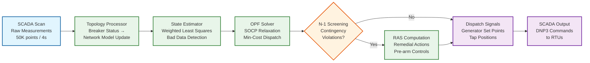
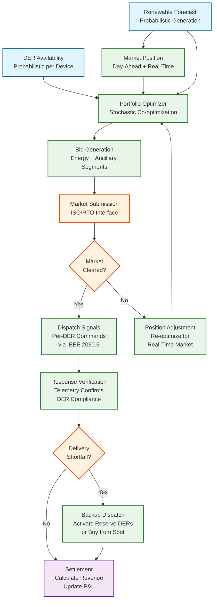

# 13.3 AI-Native Energy & Grid Management Platform — High-Level Design

## System Architecture

```mermaid
flowchart TB
    subgraph Sources["Data Sources"]
        SCADA[SCADA / RTU\nSubstation Telemetry]
        AMI[AMI Head-End\nSmart Meter Reads]
        WX[Weather Feeds\nNWP + Satellite + Radar]
        DER[DER Devices\nSolar / Battery / EV / HVAC]
        MKT[Market Data\nPrices + Schedules]
        SAT[Satellite Imagery\nVegetation + Infrastructure]
    end

    subgraph Gateway["Ingestion & Gateway Layer"]
        SGWY[SCADA Gateway\nDNP3 / IEC 61850 Protocol]
        AGWY[AMI Ingestion Gateway\nMesh Radio / Cellular / PLC]
        DGWY[DER Communication Gateway\nIEEE 2030.5 / OpenADR 3.0]
        MGWY[Market API Gateway\nBid Submission + Settlement]
    end

    subgraph Stream["Stream Processing Layer"]
        SEP[State Estimation Processor\nWeighted Least Squares]
        MEP[Meter Event Processor\nVEE + Anomaly Detection]
        DEP[DER Telemetry Processor\nAvailability + SoC Tracking]
        WXP[Weather Data Processor\nNWP Ensemble Fusion]
    end

    subgraph Core["Core Intelligence Services"]
        OPF[Grid Optimization Engine\nOPF + Contingency Analysis]
        RFS[Renewable Forecast Service\nEnsemble Probabilistic]
        DRO[Demand Response Orchestrator\nSignal Dispatch + Verification]
        VPP[VPP Dispatch Controller\nPortfolio Optimization]
        OPD[Outage Prediction Service\nFailure Probability Models]
        MBO[Market Bidding Optimizer\nStochastic Co-optimization]
    end

    subgraph Analytics["Analytics & Detection Layer"]
        THF[Theft Detection Engine\nConsumption Pattern Analysis]
        LDA[Load Disaggregation\nAppliance-Level Analytics]
        FLR[FLISR Controller\nFault Location + Isolation]
        SDF[Storm Damage Forecaster\nWeather + Vulnerability Models]
    end

    subgraph Data["Data Layer"]
        TSS[(Time-Series Store\nSCADA + AMI Telemetry)]
        GRD[(Grid Model DB\nNetwork Topology)]
        DDB[(DER Registry\nDevice State + Enrollment)]
        FCS[(Forecast Store\nRenewable Predictions)]
        MKS[(Market Position Store\nBids + Settlements)]
        AUD[(Audit Store\nControl Actions + Compliance)]
    end

    subgraph Consumer["Consumer Layer"]
        OPR[Grid Operator Console\nControl Room HMI]
        DRP[DR Program Portal\nCustomer Enrollment]
        CDA[Customer Dashboard\nUsage + Solar + EV Analytics]
        MKD[Market Trader Dashboard\nPositions + P&L]
        CRW[Field Crew App\nOutage + Restoration]
    end

    SCADA --> SGWY
    AMI --> AGWY
    WX & SAT --> WXP
    DER --> DGWY
    MKT --> MGWY

    SGWY --> SEP
    AGWY --> MEP
    DGWY --> DEP

    SEP --> OPF & FLR
    MEP --> THF & LDA
    DEP --> VPP & DRO
    WXP --> RFS & SDF

    OPF --> GRD & OPR
    RFS --> FCS & MBO & VPP
    DRO --> DDB & DRP
    VPP --> MBO & DDB
    OPD --> CRW & OPR
    MBO --> MKS & MKD
    FLR --> OPR & CRW

    SEP --> TSS
    MEP --> TSS
    DEP --> TSS
    OPF --> AUD
    VPP --> AUD
    DRO --> AUD
    THF --> AUD

    LDA --> CDA
    DRP --> DGWY

    classDef source fill:#e1f5fe,stroke:#01579b,stroke-width:2px
    classDef gateway fill:#fff3e0,stroke:#e65100,stroke-width:2px
    classDef service fill:#e8f5e9,stroke:#2e7d32,stroke-width:2px
    classDef data fill:#f3e5f5,stroke:#6a1b9a,stroke-width:2px
    classDef consumer fill:#fce4ec,stroke:#880e4f,stroke-width:2px
    classDef queue fill:#e0f7fa,stroke:#00695c,stroke-width:2px

    class SCADA,AMI,WX,DER,MKT,SAT source
    class SGWY,AGWY,DGWY,MGWY gateway
    class SEP,MEP,DEP,WXP,OPF,RFS,DRO,VPP,OPD,MBO,THF,LDA,FLR,SDF service
    class TSS,GRD,DDB,FCS,MKS,AUD data
    class OPR,DRP,CDA,MKD,CRW consumer
```



---

## Key Design Decisions

### Decision 1: Dual-Plane Architecture — IT/OT Separation with Controlled Data Flow

The platform enforces strict separation between the operational technology (OT) plane (SCADA, grid control, DER dispatch) and the information technology (IT) plane (analytics, forecasting, market operations, customer applications). Data flows from OT to IT through a unidirectional data diode or DMZ-based transfer mechanism; control commands flow from IT to OT only through a hardened command gateway with rate limiting, schema validation, and operator approval workflows. This separation is not just a security best practice—it is a NERC CIP regulatory requirement that mandates network segmentation between BES (Bulk Electric System) cyber systems and corporate IT networks.

**Implication:** The grid optimization engine and FLISR controller run within the OT plane with local compute and storage, operating autonomously during IT-OT link failures. The renewable forecast service, market bidding optimizer, and customer analytics run on the IT plane. VPP dispatch straddles both planes: portfolio optimization runs on IT, but dispatch signal issuance passes through the OT command gateway with per-signal validation. This dual-plane architecture doubles infrastructure cost but is non-negotiable for regulatory compliance.

### Decision 2: Streaming AMI Pipeline with Lambda Architecture for Theft Detection

Smart meter data flows through a lambda architecture: the speed layer processes meter readings in real-time for voltage monitoring, outage detection, and load disaggregation (latency: <60 seconds); the batch layer runs daily theft detection models against 90-day consumption histories for each meter (latency: 24 hours; higher accuracy). The speed layer catches sudden anomalies (meter disconnect/reconnect patterns, impossible consumption drops); the batch layer catches slow-drift fraud (gradual consumption reduction indicating meter tampering). Both layers publish alerts to a unified alert stream, deduplicated by meter ID and anomaly type.

**Implication:** The AMI ingestion gateway must handle 960M readings/day (11,111 readings/sec baseline, 120,000/sec at evening peak). The speed layer uses a streaming framework with per-meter partitioning; the batch layer runs on a distributed analytics engine with columnar storage. The theft detection model operates on per-meter feature vectors (90-day rolling statistics, neighbor comparison, weather-normalized consumption) computed incrementally as new readings arrive.

### Decision 3: Hierarchical VPP Aggregation with Probabilistic Availability Modeling

DERs are not aggregated as simple capacity sums. Each DER has a probabilistic availability model: an EV enrolled in V2G has a departure probability curve based on historical plug-in patterns; a home battery's available capacity depends on the homeowner's self-consumption priority and current state of charge (SoC); a smart thermostat's curtailment capacity depends on current indoor temperature and customer comfort settings. The VPP controller aggregates these probabilistic availability models into a portfolio-level capacity distribution, and bids into energy and ancillary service markets at confidence-adjusted quantities (e.g., bid P90 available capacity for frequency regulation, where delivery failure incurs penalties; bid P50 for day-ahead energy, where over-delivery is simply sold at spot price).

**Implication:** The DER registry must maintain real-time state for 5M+ devices (SoC, connectivity, enrollment status, historical availability patterns). The VPP optimization layer solves a stochastic portfolio optimization problem: maximize expected revenue across energy + ancillary markets, subject to probabilistic delivery constraints, battery degradation limits, and customer comfort guarantees. This is solved using scenario-based stochastic programming with 100–500 renewable generation scenarios.

### Decision 4: Continuous N-1 Contingency Screening with Pre-Armed Remedial Actions

The grid optimization engine does not just solve OPF for current conditions—it simultaneously evaluates what would happen if any single major element (generator, transmission line, transformer) were to trip. For each of the 5,000+ N-1 contingency cases, a simplified DC power flow determines whether the remaining system can carry the load without thermal violations or voltage collapse. When a contingency case shows a violation, the engine pre-computes a remedial action scheme (RAS): a set of control actions (generation redispatch, load shedding, topology switching) that would restore the system to a secure state within the post-contingency time limit. These RAS are "armed" in the control system and execute automatically if the contingency actually occurs.

**Implication:** Contingency screening must complete within the SCADA cycle (4 seconds) for the reduced set of critical contingencies (top 500 by severity), and within 30 seconds for the full N-1 set. This requires parallelized DC power flow solves across a dedicated compute cluster. The RAS arming mechanism must guarantee that pre-computed actions are still valid when executed (the grid state may have changed between RAS computation and contingency occurrence), requiring a validity check before execution.

### Decision 5: Ensemble NWP Post-Processing for Probabilistic Renewable Forecasting

Rather than relying on a single weather model, the renewable forecast service ingests output from 5–10 numerical weather prediction (NWP) models (GFS, ECMWF, NAM, HRRR, and regional models), each with different physics parameterizations, resolutions, and update frequencies. A gradient-boosted quantile regression model is trained on 3 years of historical NWP forecasts versus actual generation, learning the systematic biases and errors of each NWP model across different weather regimes, seasons, and times of day. The post-processing model produces calibrated probabilistic forecasts (quantiles P10 through P90) that outperform any single NWP model.

**Implication:** The forecast service must maintain real-time feeds from multiple NWP providers, each with different data formats, update schedules, and grid resolutions. The post-processing model must be retrained monthly as NWP models are updated by meteorological agencies (model changes alter bias characteristics). A dedicated ramp event detector runs as a post-filter: when the forecast shows >30% generation change within 60 minutes, a ramp alert is issued to the grid operator and the OPF engine increases spinning reserve requirements.

---

## Data Flow: SCADA Cycle — State Estimation to Dispatch



---

## Data Flow: VPP Dispatch Cycle



---

## Architecture Decision Records

### ADR-001: Deterministic OT Control Plane with Resource-Isolated Compute

**Status:** Accepted

**Context:** The grid optimization cycle (state estimation → OPF → contingency screening) must complete within 4 seconds every cycle. Standard cloud-based auto-scaling introduces non-deterministic latency from garbage collection, resource contention, and cold-start delays that are unacceptable for grid control.

**Decision:** The OT control plane runs on dedicated bare-metal compute with:
- Pinned CPU cores (no scheduler preemption)
- Pre-allocated memory pools (no runtime allocation / GC pauses)
- FPGA co-processors for sparse matrix operations (state estimation Cholesky factorization)
- Lock-free ring buffers for SCADA data ingestion (single-writer, multi-reader)
- "Computational budget" mode: state estimator returns best-available result within 400 ms rather than iterating to convergence

**Consequences:**
- (+) Deterministic worst-case execution: 3.8 s guaranteed even during cascading events
- (+) No dependency on cloud provider scheduling or resource availability
- (−) 2x infrastructure cost (dedicated bare-metal at primary + backup control center)
- (−) Cannot leverage cloud elasticity for the control path
- (−) Hardware refresh cycle (3–5 years) vs. cloud's continuous upgrade

**Alternatives rejected:**
- *Cloud-based control:* Latency variance from shared tenancy; unacceptable for safety-critical grid control
- *Container-based OT:* Container scheduling adds 50–200 ms jitter; orchestrator failure is a single point of failure for grid control

### ADR-002: Lambda Architecture for AMI Pipeline with Speed/Batch Bifurcation

**Status:** Accepted

**Context:** Smart meter data serves two conflicting use cases: real-time operational use (outage detection, voltage monitoring) requires sub-minute latency; theft detection requires 90-day historical analysis with daily batch processing. A single pipeline cannot optimize for both.

**Decision:** Implement lambda architecture:
- **Speed layer:** Streaming pipeline processes meter readings in <60 s for voltage monitoring, outage detection, and real-time load disaggregation. Per-meter state maintained in-memory (partitioned by meter_id).
- **Batch layer:** Daily batch pipeline computes 90-day rolling features and runs theft detection model. Reads from columnar warm-tier storage.
- **Serving layer:** Unified alert stream with deduplication by (meter_id, anomaly_type, time_window). Both layers publish to the same downstream consumers.

**Consequences:**
- (+) Real-time operational visibility (sub-minute) and high-accuracy theft detection (90-day context) coexist
- (+) Speed layer failure does not affect theft detection; batch layer failure does not affect real-time monitoring
- (−) Two code paths for meter data processing; risk of divergent logic
- (−) Alert deduplication required between layers

**Alternatives rejected:**
- *Unified streaming with long windows:* 90-day window state for 10M meters requires ~1 TB of in-memory state; cost-prohibitive and operationally fragile
- *Batch-only:* Unacceptable for real-time outage detection and voltage monitoring

### ADR-003: Hierarchical VPP Aggregation with Probabilistic Availability

**Status:** Accepted

**Context:** A VPP with 20,000 heterogeneous DERs cannot be bid as a simple capacity sum. Individual device availability depends on consumer behavior (EV plug-in patterns, battery self-consumption), and availability failures are correlated during extreme weather.

**Decision:** Model each DER with a probabilistic availability distribution:
- Per-device availability: time-varying probability (96 intervals/day) trained on historical behavior
- Conditional availability: separate distributions for normal weather vs. extreme conditions
- Portfolio aggregation: CLT approximation for portfolios >500 devices (mean + variance sufficient)
- Confidence-adjusted bidding: P90 for penalty-heavy products (frequency regulation), P50 for energy
- Correlated tail risk: Monte Carlo simulation with weather-conditioned scenarios for extreme conditions

**Consequences:**
- (+) Market penalties reduced by 85% vs. nameplate-capacity bidding
- (+) Revenue optimized across multiple market products simultaneously
- (+) Explicitly models the correlation between DER failure and high-value market conditions
- (−) Requires per-device behavioral data (3+ months of history before accurate modeling)
- (−) Portfolio optimization is computationally expensive (200 scenarios × 24 hours × 4 products)

### ADR-004: Continuous N-1 Contingency Screening with Extended Protection Failure Modeling

**Status:** Accepted

**Context:** Standard N-1 analysis assumes perfect protection system operation. In practice, relay misoperation (5–10% of operations) can cascade an N-1 into an N-2 or N-3 event. The 2003 Northeast blackout originated from an N-1 event with protection misoperation.

**Decision:** Extend contingency screening to include protection failure modes:
- For each N-1 contingency, evaluate the N-2 scenarios from plausible relay misoperation (failure to trip, sympathetic tripping, breaker failure)
- Total case count: ~25,000 (5,000 N-1 × 5 protection failure modes per contingency)
- Critical subset (top 500 by severity): screened every SCADA cycle (4 s) using parallelized DC power flow
- Full set: screened every 30 seconds
- Pre-armed RAS for contingencies where protection failure causes cascading violations

**Consequences:**
- (+) Detects cascading failure scenarios invisible to standard N-1 analysis
- (+) RAS pre-arming covers protection failure pathways, not just equipment trips
- (−) 5x increase in contingency screening compute (dedicated 50-core cluster)
- (−) RAS validity checking more complex (must verify both equipment state and relay state)

---

## Case Studies

### Case Study 1: ERCOT Solar Duck Curve Management

A large Texas utility managing 15 GW of solar generation faces a daily "duck curve": midday solar oversupply (net load drops to 20 GW vs. 60 GW peak) followed by a 40 GW ramp-up in 3 hours as solar sets and evening demand peaks. The AI-native platform deploys ensemble forecasting with dedicated ramp detection that provides 4-hour advance warning of the evening ramp magnitude (±5% accuracy). VPP batteries pre-charge during midday oversupply (absorbing curtailable solar), then discharge 2 GW during the ramp. The OPF engine pre-positions gas generators on ramp trajectories, starting unit commitment 2 hours before sunset. Result: zero involuntary load shedding during the ramp, solar curtailment reduced from 12% to 3%, and VPP revenue of $45M/year from energy arbitrage (buy cheap midday solar, sell expensive evening power).

### Case Study 2: European Multi-TSO Coordination Under NIS2

A European energy company operating across 4 countries (Germany, France, Netherlands, Belgium) deploys region-isolated OT networks per country (regulatory requirement: grid data stays in-jurisdiction) with a shared IT platform for market analytics and customer applications. Each country's control center operates independently with its own state estimator, OPF engine, and contingency screener. Cross-border tie-line optimization runs at 30-second intervals via secure API, coordinating interchange schedules while respecting each TSO's security constraints. NIS2 compliance is implemented per-country with a centralized compliance dashboard. The dual-plane architecture enables each country to meet its specific regulatory requirements without compromising the shared analytics platform.

### Case Study 3: Island Grid with 100% Renewable + Storage

A Pacific island utility (200 MW peak demand) operates with 100% renewable generation (solar + wind + battery storage, no fossil backup). Grid inertia is zero (all inverter-based resources), requiring synthetic inertia from grid-forming battery inverters. The platform's OPF engine runs a modified formulation that includes rate-of-change-of-frequency (RoCoF) constraints (max 1 Hz/s) enforced by battery response within 100 ms. The VPP controller maintains 40 MW of battery reserve exclusively for frequency response (never dispatched for energy arbitrage). Renewable forecast accuracy is existentially important: a 30% forecast error with no fossil backup means load shedding. The platform deploys on-island NWP post-processing with satellite-based nowcasting (0–2 hour cloud tracking) that reduces sub-hourly forecast error to 6% vs. 18% for standard NWP alone.

### Case Study 4: Wildfire Risk-Aware Grid Management

A California utility integrates real-time wildfire risk into grid operations. Satellite-based vegetation encroachment monitoring identifies high-risk corridors; weather stations and fire weather models produce fire danger indices. When fire danger exceeds threshold, the OPF engine automatically de-energizes high-risk distribution lines (Public Safety Power Shutoffs) while rerouting power through underground alternatives. The outage prediction service pre-positions crews and mobile generation at critical facilities (hospitals, water treatment) before de-energization. The DR orchestrator pre-notifies affected customers 24 hours in advance and activates backup DER programs (home batteries sustain critical loads). The platform reduced PSPS-affected customers by 60% through intelligent rerouting vs. blanket de-energization.

---

## Technology Selection Rationale

### Grid Optimization Engine

| Option | Pros | Cons | Decision |
|---|---|---|---|
| **Commercial EMS solver (e.g., PowerWorld, PSSE)** | Proven in production at 200+ utilities; certified for NERC compliance; operator familiarity | Closed-source; limited customization; 5-minute cycle (not 4-second); licensing cost | Rejected: cycle time too slow; no AI integration path |
| **Open-source solver (MATPOWER / Pandapower)** | Free; well-documented; academic community support | Not production-hardened; no redundancy framework; single-threaded; Python/MATLAB performance | Rejected: performance and reliability insufficient for real-time control |
| **Custom SOCP solver on dedicated hardware** | Full control over execution timing; FPGA acceleration for sparse matrix ops; deterministic latency | High development cost; no vendor support; long development timeline | **Selected:** Only option meeting 4-second deterministic requirement with custom extensions |

### Time-Series Storage

| Option | Pros | Cons | Decision |
|---|---|---|---|
| **Specialized time-series DB** | Purpose-built for high-ingest telemetry; compression; downsampling; retention policies | Vendor lock-in; may not support NERC audit trail requirements | **Selected for SCADA/AMI telemetry:** Best compression and query performance for sensor data |
| **Columnar analytics store** | Excellent for batch analytics (theft detection features); SQL interface | Not optimized for real-time point queries; higher ingestion latency | **Selected for AMI warm tier:** 90-day feature computation and batch analytics |
| **Object storage with Parquet** | Lowest cost; infinite scale; immutable (good for audit) | High read latency; no real-time capability | **Selected for cold tier:** Regulatory retention (3–7 years) at minimal cost |

### DER Communication Protocol

| Protocol | Suited For | Limitation | Usage |
|---|---|---|---|
| **IEEE 2030.5** | Solar inverters, batteries; certificate-based PKI; bidirectional dispatch | Complex implementation; limited vendor support outside solar | Primary for solar + battery DERs |
| **OpenADR 3.0** | Demand response signaling; standardized DR event model | One-directional (signal, not control); no device-level dispatch | DR program enrollment and event signaling |
| **OCPP 2.0** | EV chargers; supports V2G; transaction management | EV-specific; not applicable to other DER types | All EV charger communication |
| **Proprietary (manufacturer API)** | Smart thermostats; full device control | Vendor-specific; no interoperability; API stability risk | Thermostat control via manufacturer cloud API |

---

## Multi-Tenancy and Grid Operator Isolation

For vendors serving multiple utilities, the platform supports strict utility-level isolation:

```
Utility isolation model:
  OT Plane: Fully separate per utility (regulatory requirement)
    - Each utility has its own control center, SCADA gateways, OPF engine
    - No shared compute or storage between utilities' OT systems
    - Separate network segments with no lateral connectivity

  IT Plane: Shared infrastructure with logical isolation
    - Forecast models: shared NWP ingestion, per-utility post-processing models
    - Market bidding: per-utility optimizer (different markets, different portfolios)
    - Customer analytics: per-utility data warehouse with row-level security
    - ML model registry: shared architecture, per-utility trained weights

  Noisy-neighbor prevention:
    - Forecast compute: per-utility resource quotas (CPU/memory limits)
    - AMI pipeline: per-utility stream partitions (no cross-utility data mixing)
    - Theft detection batch: per-utility worker pools (one utility's batch cannot starve another)
    - Market optimization: per-utility solver instances (stochastic optimization is CPU-intensive)

  Data isolation:
    - Smart meter data: per-utility encryption keys (even shared storage cannot be cross-read)
    - DER registry: per-utility partitions with foreign key constraints preventing cross-utility references
    - Audit logs: per-utility append-only stores (regulatory requirement: each utility's audit is independent)
```

---

## Component Responsibilities Summary

| Component | Primary Responsibility | Key Interface |
|---|---|---|
| **SCADA Gateway** | Protocol translation (DNP3, IEC 61850, Modbus), measurement validation, timestamp alignment | Ingests from RTUs/IEDs; produces canonical telemetry events |
| **AMI Ingestion Gateway** | Meter read reception from head-end systems, read validation (VEE), gap filling | Ingests via mesh radio/cellular/PLC head-end; publishes to speed and batch layers |
| **DER Communication Gateway** | DER device communication via IEEE 2030.5, OpenADR 3.0, OCPP 2.0; signal routing | Bidirectional: receives DER telemetry, sends dispatch commands |
| **State Estimation Processor** | Weighted least squares estimation of grid state from redundant SCADA measurements; bad data detection and topology processing | Reads SCADA telemetry; writes grid state vector; feeds OPF engine |
| **Grid Optimization Engine** | Continuous OPF solving, N-1 contingency screening, RAS computation and arming | Reads grid state + forecast + market schedule; issues dispatch set points |
| **Renewable Forecast Service** | Ensemble NWP post-processing, quantile forecast generation, ramp event detection | Ingests NWP feeds; publishes forecasts to VPP, market, and grid operator |
| **Demand Response Orchestrator** | DR program management, signal dispatch, response verification, rebound prevention | Receives dispatch orders from VPP controller; sends signals via DER gateway |
| **VPP Dispatch Controller** | DER portfolio aggregation, availability modeling, market bidding, dispatch scheduling | Reads DER telemetry + forecasts; submits bids; dispatches DERs |
| **Outage Prediction Service** | Equipment failure probability scoring, storm damage zone prediction, crew pre-positioning | Reads sensor data + weather + satellite imagery; publishes risk scores |
| **Market Bidding Optimizer** | Stochastic co-optimization across energy + ancillary markets; settlement calculation | Reads forecasts + VPP capacity; submits bids; tracks market positions |
| **Theft Detection Engine** | Consumption pattern anomaly detection, neighbor comparison, meter tamper identification | Reads 90-day meter history; publishes alerts for field investigation |
| **FLISR Controller** | Automated fault location, feeder isolation, service restoration via switching | Reads fault indicators + SCADA; issues switching commands |
