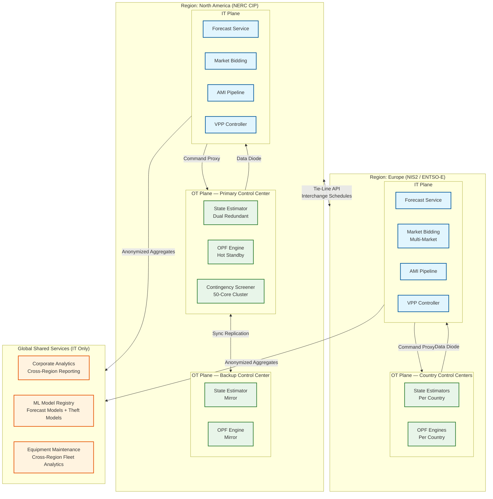

# 13.3 AI-Native Energy & Grid Management Platform — Scalability & Reliability

## Scaling Philosophy

The grid management platform exhibits a fundamental split in scaling characteristics:

- **OT control plane (scale-up):** State estimation and OPF are inherently sequential computations on a shared grid state. Horizontal scaling requires grid decomposition (splitting the network into control areas), which introduces inter-area coordination complexity. The primary scaling strategy is vertical: faster CPUs, FPGA co-processors, optimized sparse matrix libraries, and pre-computed elimination orderings. The 4-second deadline means scaling is bounded by single-machine compute capability per control area.

- **IT analytics plane (scale-out):** AMI ingestion, theft detection, forecasting, and customer analytics are embarrassingly parallel (per-meter, per-plant, per-customer). Standard horizontal scaling applies: add workers to handle more meters or more VPPs. Cloud elasticity enables cost-efficient burst handling (midnight AMI surge, market deadline compute spike).

- **DER communication plane (scale-out with partitioning):** DER gateways are stateless and scale horizontally via consistent hashing. The scaling constraint is per-device state in the DER registry (database), not gateway compute. With 5M DERs at 256 bytes of availability model per device, the entire fleet fits in 1.28 GB of memory—enabling single-node VPP aggregation.

---

## Scaling the Grid Control Plane

### Challenge: 4-Second Deterministic Latency at Scale

The grid optimization cycle (state estimation → OPF → contingency screening) must complete within 4 seconds regardless of system size. As the grid grows (more buses, more generators, more DERs), the computational complexity increases but the time budget does not.

### Scaling Strategy: Hierarchical Decomposition

Large grids are decomposed into control areas that are optimized independently, with tie-line coordination between adjacent areas:

```
Level 1: Substation-level (100-500 buses)
  - Local state estimation and voltage control
  - Runs on edge compute at substation
  - Latency: <500 ms
  - Isolated operation during communication failures

Level 2: Control area (5,000-20,000 buses)
  - Area-wide OPF and contingency screening
  - Runs on dedicated OT compute cluster
  - Latency: <3 seconds
  - Coordinates with Level 1 via set-point commands

Level 3: Inter-area coordination (full interconnection)
  - Tie-line flow optimization between control areas
  - Runs at regional coordination center
  - Latency: <30 seconds (relaxed: inter-area dynamics are slower)
  - Coordinates Level 2 areas via interchange schedules
```

**Key insight:** The 4-second constraint applies only to Level 2 (the operator's control area). Level 1 provides faster local response for voltage excursions. Level 3 provides slower system-wide economic optimization. This hierarchical decomposition ensures that doubling the interconnected grid size does not double the Level 2 computation—each area's OPF complexity is bounded by its own bus count, not the total system size.

### Scaling DER Telemetry Ingestion

With 5M DERs reporting every 60 seconds (83,333 messages/sec), the DER communication gateway must scale horizontally:

```
Architecture:
  - Stateless gateway instances behind a load balancer
  - Device-ID-based consistent hashing routes each DER to a specific partition
  - Each partition handles ~10,000 DERs (833 instances for 5M DERs at 10K each)
  - Actually deployed: 100 gateway instances, each handling 50K DERs
    (50K × 1 msg/60s = 833 msg/sec per instance—well within capacity)

Scaling trigger:
  - When any instance exceeds 80% CPU or 2,000 msg/sec: add instances
  - Consistent hashing ensures minimal DER reassignment during rebalancing
  - DER state is stored in the DER registry (database), not in the gateway
    → gateways are stateless, enabling zero-downtime scaling
```

---

## Scaling the AMI Pipeline

### Horizontal Scaling for Meter Data Ingestion

The AMI pipeline handles 960M readings/day with a midnight surge of 67,000 readings/sec:

```
Stream partitioning:
  - Partition key: meter_id hash
  - 256 partitions → each handles ~3.75M meters
  - At peak: 67,000/256 = ~262 readings/sec per partition
  - Consumer group: 256 workers, one per partition

Storage tiering:
  Hot tier (0-30 days): Time-series database with 15-min resolution
    - Optimized for recent queries: "show me yesterday's consumption"
    - ~4.3 TB/month compressed
  Warm tier (30 days - 3 years): Columnar store with daily rollups
    - Optimized for analytics: "compute 90-day theft features"
    - ~860 GB/month compressed
  Cold tier (3-7 years): Object storage with Parquet files
    - Optimized for regulatory queries: "retrieve 2022 data for audit"
    - ~200 GB/month compressed

Auto-scaling:
  - Midnight surge: scale consumer workers 3x (256 → 768)
  - Scale-down at 3 AM when surge subsides
  - Pre-scheduled scaling (no reactive auto-scale delay)
```

### Scaling Theft Detection

Theft detection must process 10M meter profiles daily:

```
Parallel processing:
  - Feature computation: embarrassingly parallel per meter
  - 10M meters ÷ 1,000 workers = 10,000 meters per worker
  - Feature computation: ~50 ms per meter (90-day rolling statistics)
  - Per worker: 10,000 × 50 ms = 500 seconds = ~8.3 minutes
  - Total pipeline: 8.3 minutes with 1,000 workers

Model inference:
  - Gradient-boosted model: ~1 ms per meter
  - 10M × 1 ms = 10,000 seconds single-threaded
  - With 100 workers: 100 seconds = ~1.7 minutes
  - Total theft detection pipeline: ~10 minutes
```

---

## Reliability Architecture

### Grid Control Plane: Five-Nines Availability (99.999%)

The grid control plane is safety-critical infrastructure. Loss of control capability during a contingency event can result in cascading blackouts affecting millions.

```
Redundancy architecture:
  Primary control center:
    - Dual-redundant state estimators (active-active)
    - Dual-redundant OPF engines (active-standby, hot standby with <2s failover)
    - Triple-redundant SCADA front-end processors
    - N+2 redundancy for DER communication gateways

  Backup control center:
    - Geographically separated (>100 km from primary)
    - Full mirror of primary capabilities
    - Continuous state replication (SCADA telemetry mirrored in real-time)
    - Automatic failover triggered by: primary site power loss, network partition,
      or manual operator command
    - Failover time: <30 seconds (state estimator resynchronizes from replicated data)

  Substation edge compute:
    - Each substation has local protective relay logic
    - Operates autonomously during control center communication failure
    - Local voltage regulation and fault protection continue indefinitely
    - Reduced capability: no system-wide optimization, no market participation
```

### Failure Modes and Recovery

| Failure Mode | Impact | Detection | Recovery |
|---|---|---|---|
| **Single SCADA front-end failure** | None (triple-redundant) | Heartbeat timeout (5s) | Automatic: remaining FEPs absorb load |
| **State estimator failure** | OPF runs on last-good state for 1 cycle | Process monitor | Hot standby takes over within 2s |
| **OPF engine failure** | Grid operates on last dispatch set points | Missing dispatch signal | Hot standby takes over; if both fail, operators assume manual control |
| **AMI head-end failure** | Meter reads delayed (batch catch-up later) | Missing collection acknowledgment | Meters buffer locally; re-collect on restoration |
| **DER gateway failure** | VPP dispatch degraded for affected DERs | DER heartbeat loss spike | Consistent-hash rebalance routes DERs to healthy gateways |
| **Forecast service failure** | Dispatch uses persistence forecast (last-known values) | Missing forecast publication | Restart service; persistence forecast acceptable for <1 hour |
| **Market bidding failure** | Cannot submit bids; financial loss but no grid impact | Missing bid submission confirmation | Manual bid submission via backup terminal |
| **IT-OT link failure** | OT plane operates autonomously; no market optimization | Link heartbeat timeout | OT continues on last-known schedules; automatic reconnection |
| **Primary control center total loss** | 30-second gap during failover | Site-level monitoring | Backup control center assumes control |

### Data Durability

```
SCADA telemetry:
  - Written to dual-attached storage at primary and backup control centers
  - Write-ahead log with synchronous replication
  - RPO: 0 (zero data loss — regulatory requirement)
  - RTO: <30 seconds (backup center has full data replica)

Smart meter data:
  - Asynchronous replication to backup data center
  - RPO: <5 minutes (acceptable: meters re-transmit on gap detection)
  - RTO: <15 minutes (consumers tolerate billing data delays)

DER telemetry:
  - Asynchronous replication
  - RPO: <1 minute
  - RTO: <5 minutes
  - Acceptable loss: DER state reconstructed from next telemetry report (60s)
```

---

## Handling Peak Demand Events

### Scenario: Summer Heat Wave — Record Demand + Solar Ramp-Down

At 5 PM on a 105°F day, air conditioning load peaks while solar generation ramps down (sunset). The platform must handle:

1. **Demand spike:** 40% above normal afternoon load. Every generator at maximum output.
2. **Solar ramp-down:** 80% of solar generation lost in 2 hours (4 PM to 6 PM).
3. **DER dispatch surge:** All VPP capacity activated simultaneously.
4. **Market price spike:** Real-time prices hit $1,000/MWh (100x normal).

**Platform response:**

```
Timeline:
  T-24h: Day-ahead forecast shows high demand + solar ramp
    → Market bidding optimizer increases day-ahead energy purchases
    → DR orchestrator sends day-ahead notification to enrolled customers
    → Outage prediction service scores equipment failure risk (transformers
      under heat stress)

  T-6h: Updated NWP confirms extreme heat
    → VPP controller pre-positions batteries at 90% SoC (reduce self-consumption)
    → EV charging signals: "charge now before peak" to shift load earlier
    → Grid operator notified: "contingency reserves reduced, consider importing"

  T-2h (4 PM): Solar ramp-down begins
    → Ramp event detector fires: "80% solar loss in 120 minutes"
    → OPF increases gas generator output along ramp trajectory
    → VPP begins battery discharge: 35 MW released from home batteries
    → DR orchestrator activates Tier 1 (commercial HVAC pre-cooling complete)

  T-0 (6 PM): Peak demand + minimal solar
    → All VPP capacity dispatched: batteries, thermostats, water heaters
    → DR Tier 2 activated: industrial load curtailment
    → Contingency screening shows N-1 violations on 3 transmission lines
    → RAS armed: automatic load shedding scheme for worst-case contingency
    → Market: buying emergency energy from neighboring control areas

  T+3h (9 PM): Demand subsides
    → VPP recall: batteries begin recharging at controlled rate
    → DR released: thermostats recover (staggered to prevent rebound peak)
    → Post-event analysis: no outages, no involuntary load shedding
```

### Rebound Peak Prevention

After a DR event ends, all curtailed loads attempt to recover simultaneously: 8,000 thermostats all cooling from 78°F back to 72°F creates a demand spike 20–30% above normal (the "rebound peak"). The DR orchestrator staggers recovery:

```
Staggered recovery protocol:
  - Divide curtailed devices into 6 recovery cohorts
  - Cohort 1 (15% of devices): release immediately
  - Cohort 2 (15%): release after 5 minutes
  - Cohort 3 (15%): release after 10 minutes
  - Cohort 4 (15%): release after 15 minutes
  - Cohort 5 (20%): release after 20 minutes
  - Cohort 6 (20%): release after 25 minutes
  - Total recovery spread: 25 minutes
  - Peak rebound reduced from 30% spike to 8% gradual ramp
  - Cohort assignment: prioritize customers with longest curtailment duration
```

---

## Geographic Distribution and Edge Computing

### Substation Edge Architecture

Each substation hosts edge compute for local protection and optimization:

```
Edge compute per substation:
  - Hardware: ruggedized industrial PC (fanless, -40°C to +70°C rated)
  - Compute: 8 cores, 32 GB RAM, 1 TB SSD
  - Connectivity: dual fiber to control center + cellular backup
  - Software: local SCADA data collector, protective relay coordination,
    voltage regulator control, DER monitoring for local feeders

Local capabilities (operate during control center communication loss):
  - Fault detection and isolation (FLISR) for local feeders
  - Voltage regulation via tap changer and capacitor bank control
  - Local DER curtailment if feeder voltage exceeds limits
  - Data buffering: 72 hours of SCADA data cached locally

Synchronization:
  - GPS time synchronization (±1 μs) for SCADA timestamping
  - Configuration pushed from control center with version tracking
  - Local changes (breaker operations, relay settings) reported upstream
```

### Multi-Region Control

For utilities operating across multiple states or countries:

```
Region isolation:
  - Each region has independent control center and OT infrastructure
  - Inter-region coordination via secure API (tie-line schedules, emergency requests)
  - No shared database between regions (regulatory: each region's data stays in-region)
  - Common IT platform for market analytics, customer applications, corporate reporting

Data sovereignty:
  - Smart meter data stored in-region (GDPR, state privacy laws)
  - Grid telemetry: dual storage (local region + corporate backup)
  - DER enrollment data: region-local with anonymized aggregates to corporate
```

---

## Multi-Region Deployment Architecture



**Key constraints:**
- No raw grid telemetry crosses regional boundaries (regulatory)
- OT planes are fully independent per region/country (NERC CIP / NIS2 mandate)
- ML model artifacts (trained models, not training data) can be shared globally
- Tie-line coordination API is the only cross-region OT communication

---

## Back-Pressure Patterns

### AMI Ingestion Pipeline Back-Pressure

```
Level 1 — Normal (queue depth < 1M readings):
  Consumer group processes at normal rate
  No backpressure signaling

Level 2 — Elevated (queue depth 1M–5M readings):
  Scale consumer group 3x (256 → 768 workers)
  Pre-scheduled for midnight surge (no reactive delay)
  Speed layer prioritizes critical meters (revenue, net metering)

Level 3 — High (queue depth 5M–10M readings):
  Signal AMI head-end to delay non-critical collection windows by 15 minutes
  Batch layer processing paused (theft detection deferred to off-peak)
  Alert: "AMI pipeline backlog — billing data may be delayed 30 minutes"

Level 4 — Critical (queue depth > 10M readings):
  Signal AMI head-end to suspend all but emergency reads
  Shedding: drop voltage monitoring reads (reconstructable from SCADA)
  Retain: billing reads, tamper alerts, outage notifications
  Escalation: SEV-2 alert to engineering
```

### DER Telemetry Back-Pressure

```
Level 1 — Normal (< 100K messages/sec):
  All DER telemetry processed in real-time
  VPP availability updated every 60 seconds

Level 2 — Elevated (100K–200K messages/sec):
  Reduce VPP availability update frequency to 120 seconds
  Downsample non-critical DER telemetry (thermostats: every 300 s)
  Prioritize: batteries and EVs (most expensive DERs) retain full resolution

Level 3 — Critical (> 200K messages/sec):
  Gateway shedding: reject telemetry from DERs not currently dispatched
  Dispatched DERs retain full telemetry (needed for compliance verification)
  VPP controller falls back to availability model predictions (no real-time update)
  Alert: "DER telemetry backlog — VPP dispatch using modeled availability"
```

### Grid Optimization Engine Back-Pressure

```
If SCADA cycle completion > 3.5 seconds (approaching 4-second limit):
  1. Reduce contingency screening from 5,000 to 500 critical cases
  2. Switch OPF from SOCP to faster DC-OPF approximation (-200 ms, +1% cost suboptimality)
  3. Skip look-ahead prediction; solve reactive OPF against current state
  4. If still >3.8 seconds: return last-cycle dispatch with conservative damping (±1% change max)
  5. Alert: "Grid optimization degraded — manual operator monitoring recommended"
```

---

## Capacity Formulas

### State Estimation Compute

```
Variables:
  B = number of buses (20,000)
  M = number of measurements (50,000)
  I = Newton-Raphson iterations (typically 4)
  NNZ = non-zeros in gain matrix after factorization (~300,000)

Computation per cycle:
  Jacobian computation: O(M × 4) = O(200,000) FLOPs per iteration
  Gain matrix: O(M × 4²) = O(800,000) FLOPs
  Sparse Cholesky factorization: O(NNZ × B) ≈ O(6 × 10⁹) FLOPs
  Forward/backward substitution: O(NNZ) = O(300,000) FLOPs per iteration
  Total per cycle: I × (200K + 800K + 6B + 300K) ≈ 28 × 10⁹ FLOPs

At 100 GFLOPS (modern CPU, sparse BLAS):
  Compute time: 28 × 10⁹ / 100 × 10⁹ = 280 ms
  With overhead (memory access, cache misses): ~500 ms ✓

FPGA acceleration (4x for sparse factorization):
  Factorization: 6B → 1.5B FLOPs effective
  Total: ~250 ms (headroom for larger networks)
```

### AMI Pipeline Worker Sizing

```
Variables:
  R_day = daily readings (960M for 10M meters at 15-min intervals)
  R_peak = peak readings/sec during midnight surge (67,000)
  T_process = time to validate + store one reading (0.5 ms)
  Workers_baseline = R_day / (86,400 sec × readings_per_sec_per_worker)

Worker capacity:
  Single worker throughput: 1 / T_process = 2,000 readings/sec

Baseline:
  Average rate: 960M / 86,400 = 11,111 readings/sec
  Workers needed: 11,111 / 2,000 = 6 workers (theoretical min)
  With 50% headroom: 9 workers
  Deployed: 256 workers (for burst handling and redundancy)

Peak (midnight surge):
  Peak rate: 67,000 readings/sec
  Workers needed: 67,000 / 2,000 = 34 workers (theoretical min)
  With 3x burst headroom: 102 workers
  Deployed: 768 workers (pre-scaled for surge)

Year 3 projection (5.8B readings/day, 5-min intervals):
  Peak rate: ~200,000 readings/sec
  Workers needed: 200,000 / 2,000 = 100 workers min
  Deployed: 2,048 workers at peak
```

### VPP Dispatch Signal Capacity

```
Variables:
  VPPs = 500 portfolios
  DERs_per_VPP = 20,000 average
  Total_DERs = 10M dispatch targets
  Dispatch_freq = every 4 seconds (freq reg) or 5 min (energy)

Frequency regulation (aggregate signals):
  500 VPPs × 1 signal / 4 sec = 125 signals/sec
  Signal size: ~500 bytes (VPP_id, product, quantity, timestamp, signature)
  Bandwidth: 125 × 500 = 62.5 KB/sec (negligible)

Energy market dispatch (per-device signals):
  10M signals / 300 sec (5-min interval) = 33,333 signals/sec
  Signal size: ~200 bytes per device command
  Bandwidth: 33,333 × 200 = 6.7 MB/sec
  Gateway capacity: 100 gateways × 500 signals/sec = 50,000 signals/sec ✓

Pre-armed frequency response:
  Arm 5,000 DERs per VPP × 500 VPPs = 2.5M armed devices
  Arm/disarm cycle: every 5 minutes = 2.5M / 300 = 8,333 signals/sec
  These are conditional commands (arm with threshold); actual trigger is local
```

---

## Chaos Experiments

| # | Experiment | Method | Expected Behavior | Success Criterion |
|---|---|---|---|---|
| 1 | **Kill primary state estimator mid-cycle** | Process kill during SCADA cycle N | Hot standby takes over at cycle N+1; OPF uses standby output; no missed dispatch | Failover < 2 seconds; zero missed dispatch cycles |
| 2 | **Partition OT from IT network** | Block data diode and command proxy traffic | OT plane operates autonomously on last-known schedules; no market participation; IT degrades gracefully | Grid control uninterrupted; market positions frozen; auto-reconnection within 30 seconds of partition heal |
| 3 | **Simulate 30% DER fleet offline** | Drop 1.5M device heartbeats simultaneously | VPP controller detects availability drop; market positions reduced; dispatches redirected to remaining devices | No market non-delivery penalties; VPP delivery stays >90% of adjusted commitment |
| 4 | **Inject corrupt NWP data** | Publish NWP forecast with 50% systematic bias | Forecast sanity check detects deviation from persistence; confidence score drops to LOW; OPF increases reserves | No dispatch based on corrupt forecast; operator alerted within 5 minutes |
| 5 | **Flood AMI queue beyond capacity** | Inject 500K readings/sec (7x peak rate) | Level 4 back-pressure activated; non-critical reads shed; billing reads retained; AMI head-end signaled to pause | Zero billing data loss; queue stabilizes within 15 minutes; no system crash |
| 6 | **Simultaneous backup control center failover** | Shut down primary control center entirely | Backup center assumes control within 30 seconds; state estimator resynchronizes from replicated data | Grid control interruption < 30 seconds; no missed contingency screening |
| 7 | **Market submission deadline with optimizer failure** | Kill market bidding optimizer at 9:55 AM (5 min before deadline) | Pre-computed bids from prior NWP cycle submitted automatically by deadline failsafe | Bids submitted on time (possibly suboptimal); no "failure to offer" penalty |

---

## Load Testing Strategy

### Synthetic Workload Profiles

| Profile | Description | SCADA Rate | AMI Rate | DER Count | Market Activity | Purpose |
|---|---|---|---|---|---|---|
| **Steady-State** | Normal grid operations, mild weather | 12,500 meas/sec | 11,111 reads/sec | 5M online | Normal bidding | Baseline performance validation |
| **Summer Peak** | Record heat, maximum solar, evening ramp | 12,500 meas/sec | 15,000 reads/sec | 5M (VPP fully dispatched) | Aggressive bidding; price spikes | End-to-end ramp handling; VPP dispatch at scale |
| **Midnight Surge** | AMI collection window with maximum burst | 12,500 meas/sec | 200,000 reads/sec | 2M (night minimal) | Minimal | AMI pipeline burst handling; back-pressure testing |
| **Cascading Event** | 10 breaker operations in 30 seconds | 25,000 meas/sec (doubled) | Normal | 5M | Emergency | Topology change batching; state estimator convergence; RAS firing |
| **Year-3 Scale** | 3x growth across all dimensions | 20,000 meas/sec | 67,000 reads/sec (5-min intervals) | 25M | 4x bid volume | Capacity validation for growth projections |

### Load Test Success Criteria

| Scenario | Metric | Pass Threshold | Fail Action |
|---|---|---|---|
| All profiles | State estimation p99 | ≤ 2,000 ms | Investigate sparse solver performance; check FPGA offload |
| All profiles | OPF solve p99 | ≤ 3,000 ms | Profile interior-point iterations; consider DC-OPF fallback |
| Summer Peak | VPP dispatch compliance | ≥ 85% under full load | Review over-dispatch margin; check gateway capacity |
| Midnight Surge | AMI queue drain time | ≤ 4 hours | Increase consumer workers; verify back-pressure signaling |
| Cascading Event | Topology change handling | Zero missed dispatch cycles | Validate batching window; check Y-bus rebuild cache |
| Year-3 Scale | All SLOs at 3x scale | All within target | Capacity plan revision required before Year 2 growth |

---

## Graceful Degradation Hierarchy

When the platform is under extreme stress (cascading event + communication failures + peak demand), components shed load in a prioritized order:

```
Priority 1 (Never Shed): Grid frequency control, state estimation, FLISR
  - These protect physical safety; shedding means risking blackout or equipment damage

Priority 2 (Shed Last): OPF dispatch, contingency screening, VPP frequency regulation
  - Grid operates on manual/stale dispatch; operators compensate; market penalties accepted

Priority 3 (Shed Early): Market bidding optimization, customer analytics, theft detection
  - Financial and analytical functions; no immediate grid safety impact

Priority 4 (Shed First): Report generation, firmware updates, non-critical DER telemetry
  - Deferrable functions with no operational impact

Shedding mechanism:
  - Each component has a "criticality weight" and a "resource cost"
  - Under resource pressure, components are shed in priority order until load < capacity
  - Shed components enter "suspended" state with automatic re-enablement when pressure subsides
  - All shed decisions logged for post-incident review
```

## AI Release Ladder

Every AI model or capability change in this system MUST follow this rollout sequence:

| Stage | Description | Gate Criteria |
|-------|-------------|---------------|
| 1. Offline Evaluation | Benchmark against historical ground truth | Meets baseline metrics |
| 2. Shadow Mode | Run in parallel with production, compare outputs | No regression on key metrics |
| 3. Canary (Blast-Radius Capped) | 1-5% traffic, human review of all outputs | Error rate < threshold |
| 4. Human-Reviewed Production | AI recommends, human approves all actions | Approval rate > 90% |
| 5. Limited Autonomous Production | AI acts within pre-approved boundaries | Continuous monitoring, no alerts |
| 6. Instant Rollback | One-click revert to previous model/rules | < 5 min rollback time |

**Note:** Model updates affecting core business recommendations (predictions, classifications, rankings) must reach Stage 4 (human-reviewed production) before any customer-impacting deployment. Stage 5 limited autonomy applies only to low-risk, well-bounded recommendation categories with established rollback procedures.
