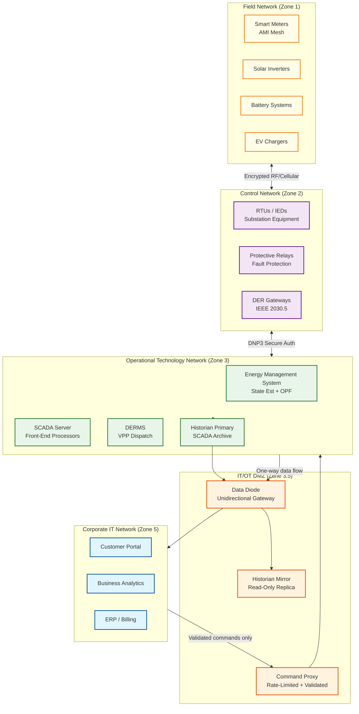

# 13.3 AI-Native Energy & Grid Management Platform — Security & Compliance

## Regulatory Landscape

Energy grid management platforms operate under some of the most prescriptive cybersecurity regulations in any industry, because a successful cyberattack on grid infrastructure can cause physical harm (equipment damage, fires), widespread service disruption (blackouts affecting millions), and cascading failures across interconnected systems.

### NERC CIP Standards (North America)

The North American Electric Reliability Corporation Critical Infrastructure Protection (NERC CIP) standards mandate specific security controls for Bulk Electric System (BES) cyber systems:

| Standard | Requirement | Platform Impact |
|---|---|---|
| CIP-002 | BES cyber system identification and categorization (High/Medium/Low impact) | Classify every platform component by grid impact level |
| CIP-003 | Security management controls and policies | Documented security policies, annual review |
| CIP-004 | Personnel and training (background checks, security awareness) | All operators and developers with BES access require training and clearance |
| CIP-005 | Electronic security perimeters (network segmentation) | Strict IT/OT network separation; defined Electronic Access Points (EAPs) |
| CIP-006 | Physical security of BES cyber systems | Control centers and substations: multi-factor physical access, surveillance |
| CIP-007 | System security management (patching, ports/services, malware prevention) | Patch management with testing before deployment; disabled unnecessary services |
| CIP-008 | Incident reporting and response planning | Documented incident response plan; mandatory reporting to NERC within 1 hour |
| CIP-009 | Recovery plans for BES cyber systems | Tested disaster recovery; backup control center; annual recovery drills |
| CIP-010 | Configuration change management and vulnerability assessments | Change control board for OT changes; 35-day advance notification for significant changes |
| CIP-011 | Information protection (BES cyber system information classification) | Grid topology, SCADA configurations, protection settings classified as BCSI |
| CIP-013 | Supply chain risk management | Third-party software and hardware risk assessment; vendor security reviews |
| CIP-014 | Physical security of critical transmission substations | Risk assessment; armed security or equivalent protection for critical substations |

**Penalty:** Up to $1,000,000 per violation per day. Violations are publicly reported.

### European Regulations (ENTSO-E / NIS2)

| Regulation | Key Requirements |
|---|---|
| NIS2 Directive | Energy sector classified as "essential entity"; mandatory incident reporting within 24 hours; supply chain security; management body accountability |
| GDPR | Smart meter data is personal data; requires lawful basis, data minimization, and customer consent for granular usage analytics |
| EU Network Code on Cybersecurity | Sector-specific cybersecurity requirements for electricity, due for full enforcement by 2026 |

---

## IT/OT Network Architecture

### Network Segmentation



### Data Diode: Unidirectional OT→IT Data Flow

The data diode is a hardware-enforced unidirectional gateway that physically prevents data from flowing from IT to OT networks. It uses fiber-optic transmission with no return path—the receiving side has no way to send data back, regardless of software compromise.

**What flows through the data diode (OT → IT):**
- SCADA historian data (grid state, measurements, events)
- Aggregated DER performance metrics
- Forecast accuracy feedback (actual vs. predicted generation)
- Equipment health telemetry

**What does NOT flow through the data diode:**
- Control commands (these go through the Command Proxy)
- Configuration changes
- Software updates
- Any IT-originated traffic

### Command Proxy: IT→OT Control Path

Commands from the IT plane (market-driven dispatch signals, forecast-based schedule changes) enter the OT network only through a hardened Command Proxy that enforces:

1. **Schema validation:** Commands must match a strict schema (set-point ranges, valid device IDs, authorized command types). Malformed commands are rejected and logged.
2. **Rate limiting:** Maximum 100 commands per second (prevents flooding attacks).
3. **Authorization:** Each command must carry a signed authorization token from the originating service (VPP controller, market bidding optimizer). The proxy validates the signature against a pre-registered key.
4. **Sanity checking:** Commands are checked against current grid state: a dispatch command that would cause a generator to exceed its ramp rate, or a DER command that targets an offline device, is rejected.
5. **Operator override:** During emergency conditions, operators can suspend automated command flow and assume manual control. The proxy enters "manual mode" where only operator-issued commands are accepted.

---

## DER Security

### Device Authentication and Enrollment

Every DER device communicates with the platform through a certificate-based mutual TLS connection:

```
Enrollment process:
  1. Manufacturer pre-provisions device with factory certificate
     signed by a trusted root CA (IEEE 2030.5 PKI hierarchy)
  2. Device connects to enrollment server using factory certificate
  3. Enrollment server verifies device identity against manufacturer
     database (model, serial number, authorized installer)
  4. Server issues operational certificate with:
     - Device ID
     - Authorized capabilities (generation, consumption, V2G)
     - VPP assignment
     - Certificate expiry (1 year, auto-renewable)
  5. Device uses operational certificate for all subsequent communication

Certificate lifecycle:
  - Auto-renewal: 30 days before expiry, device requests new certificate
  - Revocation: immediate revocation via CRL distribution point
    or OCSP responder (for devices compromised or decommissioned)
  - Key storage: device TPM or secure element (no software-only key storage)
```

### DER Command Integrity

Dispatch commands to DERs must be authenticated, integrity-protected, and non-repudiable:

```
Command signing chain:
  1. VPP Controller signs dispatch command with its service certificate
  2. Command Proxy validates signature and adds proxy attestation
  3. DER Gateway forwards command with both signatures
  4. Device verifies VPP Controller signature (has pre-installed trust anchor)
  5. Device executes command and returns signed acknowledgment

Anti-replay protection:
  - Each command includes monotonic sequence number and timestamp
  - Device rejects commands with sequence number ≤ last-executed
  - Device rejects commands with timestamp > 60 seconds old
  - Prevents replay of old dispatch commands after communication restoration
```

---

## Smart Meter Data Privacy

### Customer Data Classification

| Data Type | Classification | Retention | Access |
|---|---|---|---|
| 15-minute interval data | Personal (consumption pattern reveals occupancy) | 3 years for billing; 7 years for regulatory | Customer, authorized utility staff, regulator |
| Daily aggregated consumption | Personal (less sensitive) | 7 years | Customer, billing, analytics (anonymized) |
| Voltage and power quality | Infrastructure (not personal) | 3 years | Grid operations, engineering |
| Tamper and theft flags | Operational (investigation-sensitive) | Duration of investigation + 3 years | Revenue protection team, legal |
| Load disaggregation (appliance-level) | Highly personal (reveals behavior patterns) | Customer-controlled (opt-in only) | Customer only; anonymized aggregates for analytics |

### Privacy-Preserving Analytics

```
Customer analytics approach:
  1. Load disaggregation: performed on-device (edge compute in smart meter)
     or at meter data management system with strict access controls
  2. Peer comparison: customer compared to anonymized aggregate of peer group
     (minimum group size: 15 customers to prevent re-identification)
  3. Theft detection: runs on utility-accessible interval data (lawful basis:
     legitimate interest in preventing theft—a recognized GDPR basis)
  4. Third-party data sharing: only with explicit customer consent;
     data anonymized via k-anonymity (k ≥ 50) or differential privacy (ε ≤ 1.0)

Consent management:
  - Granular consent: customer can opt into energy tips but opt out of
    third-party data sharing
  - Consent withdrawal: effective within 72 hours; historical data anonymized
  - Consent audit trail: immutable log of consent grants and withdrawals
```

---

## SCADA Cybersecurity

### Threat Model

| Threat | Attack Vector | Impact | Mitigation |
|---|---|---|---|
| **False data injection** | Compromise SCADA measurements to mislead state estimator | OPF dispatches incorrect set points; potential equipment damage | State estimator bad data detection; measurement redundancy; anomaly detection on state transitions |
| **Command injection** | Inject unauthorized control commands (open breakers, trip generators) | Equipment damage, localized blackout | Command Proxy validation; operator confirmation for critical commands; command rate limiting |
| **Ransomware on EMS** | Encrypt EMS servers, disabling grid optimization | Loss of automated dispatch; operators fall back to manual control | Air-gapped backups; backup control center; OT network isolation from IT |
| **Supply chain compromise** | Malicious firmware in DER devices or smart meters | Coordinated DER manipulation (simultaneous discharge), meter data exfiltration | Supply chain risk assessment (CIP-013); firmware signing verification; behavioral anomaly detection |
| **Insider threat** | Authorized operator issues damaging commands | Equipment damage, targeted outage | Separation of duties (two-person rule for critical commands); audit trail; behavioral analytics |

### Defense-in-Depth Measures

```
Network layer:
  - IT/OT air gap or data diode (hardware-enforced)
  - Network monitoring: deep packet inspection on OT network
  - Allowlisting: only authorized protocols (DNP3, IEC 61850, IEEE 2030.5) on OT network
  - No internet connectivity from OT network

Application layer:
  - State estimator bad data detection: chi-squared test flags anomalous measurements
  - Command validation: every command checked against grid state and physical constraints
  - Behavioral analytics: detect unusual operator actions (e.g., opening breakers in
    unusual sequence or at unusual times)

Data layer:
  - SCADA historian: write-once audit trail (tamper-evident)
  - Backup and recovery: daily backups to offline storage
  - Encryption: AES-256 for data at rest; TLS 1.3 for data in transit within OT network

Physical layer:
  - Control center: biometric access, CCTV, 24/7 security
  - Substations: intrusion detection, locked cabinets, tamper-evident seals
  - Smart meters: physical tamper detection (cover-open sensor, magnetic field sensor)
```

---

## Compliance Automation

### Audit Trail Requirements

Every control action on the grid must be logged with:
- **Who:** Operator identity or automated system identity
- **What:** Exact command (set point value, breaker command, dispatch signal)
- **When:** GPS-synchronized timestamp (±1 ms)
- **Why:** Triggering condition (OPF recommendation, operator decision, RAS activation, market schedule)
- **Outcome:** Device acknowledgment, actual result, any error

```
Audit log architecture:
  - Write-once append log (no update, no delete)
  - Cryptographic chaining: each entry includes hash of previous entry
    → tampering with any entry invalidates the chain
  - Dual storage: primary site + backup site (synchronous replication)
  - Retention: 7 years minimum (NERC CIP requirement)
  - Access: read-only for compliance team; no modification capability
  - Export: automated monthly export to regulatory archive in mandated format
```

### Automated Compliance Reporting

```
NERC CIP reporting automation:
  - CIP-002: automatic BES cyber system inventory reconciliation (weekly)
  - CIP-005: network segmentation verification via continuous scanning
  - CIP-007: patch status dashboard with days-since-available tracking
  - CIP-008: incident detection → automatic severity classification →
    regulatory notification draft (human review before submission)
  - CIP-010: configuration change tracking with before/after comparison
    and automatic 35-day waiting period enforcement

FERC reporting:
  - Market bid and settlement reconciliation (daily)
  - Generator availability and outage reporting (real-time)
  - Renewable generation curtailment tracking and justification
```

---

## Domain-Specific Threats

### Threat 1: Coordinated DER Manipulation (Botnet Attack)

**Attack vector:** Attacker compromises smart thermostat manufacturer's cloud API (common for consumer IoT devices with weaker security posture). Gains ability to simultaneously command millions of thermostats to maximum heating/cooling, creating a sudden 2 GW load spike that exceeds grid capacity.

**Impact:** Frequency deviation of 1-2 Hz; automatic load shedding; potential cascading blackout if reserves are insufficient.

**Mitigation:**
- Rate limiting at the DER communication gateway: no single manufacturer API can change >10% of enrolled devices in a 5-minute window
- Load-side anomaly detection: if aggregate load deviates >15% from forecast without corresponding weather change, investigate before adjusting dispatch
- DER manufacturer security requirements: mandatory vulnerability assessments, firmware signing, and incident notification SLA as enrollment prerequisites
- "Kill switch" per manufacturer: ability to block all commands from a specific manufacturer API within 30 seconds

### Threat 2: State Estimation Stealth Attack (False Data Injection)

**Attack vector:** Sophisticated attacker compromises 10-20 SCADA measurement points and injects coordinated false data that passes the state estimator's statistical bad data detection (chi-squared test). The false state causes the OPF to issue dispatch commands that overload a specific transmission line.

**Impact:** Hidden thermal overload on targeted transmission line; potential line failure and cascading events.

**Mitigation:**
- Multi-source validation: compare SCADA state estimate with independent PMU (phasor measurement unit) measurements at key substations
- Physically protected measurement points: critical measurements (tie-line flows, major generator outputs) use tamper-evident sensor enclosures with intrusion detection
- Machine learning anomaly detection: train a secondary model on historical state transitions; flag state changes that are statistically plausible but physically unlikely (e.g., load shift pattern not correlated with time of day)
- Measurement diversity: ensure no single compromised communication path can affect >5% of total measurements at any substation

### Threat 3: Market Manipulation via Forecast Poisoning

**Attack vector:** Attacker compromises an NWP data feed (man-in-the-middle or compromised data source) to inject falsified weather predictions. The platform's ensemble post-processing produces systematically biased forecasts, causing the market bidding optimizer to submit incorrect bids.

**Impact:** Financial loss from suboptimal bids; market distortion; potential regulatory investigation for market manipulation.

**Mitigation:**
- NWP data integrity: verify digital signatures on NWP data (most agencies sign GRIB2 files); checksum validation; reject data with invalid provenance
- Cross-source consistency: compare incoming NWP data against other NWP models. If one model deviates >3σ from the ensemble, flag for manual review before including in post-processing
- Forecast-actual feedback: monitor forecast error in real-time. If error exceeds historical bounds for the current weather regime, alert operator and increase forecast uncertainty bands

### Threat 4: Insider Threat — Operator Issues Damaging Dispatch

**Attack vector:** A compromised or disgruntled control center operator issues dispatch commands that deliberately stress the grid: tripping generators, opening critical tie-lines, or dispatching all VPP batteries simultaneously.

**Impact:** Localized or regional blackout; equipment damage; regulatory investigation.

**Mitigation:**
- Two-person rule for critical commands (NERC CIP requirement): opening transmission breakers, tripping generators above 50 MW, and changing protection settings require confirmation from a second authorized operator
- Command reasonableness checking: all operator commands validated against the same physical constraints as automated dispatch (ramp rate limits, voltage bounds, power balance)
- Behavioral analytics: baseline each operator's command patterns (frequency, types, timing); flag significant deviations for supervisory review
- Separation of duties: the operator who dispatches cannot also modify the dispatch validation rules

### Threat 5: Ransomware Targeting OT Historian

**Attack vector:** Ransomware enters the OT network via a compromised USB device (maintenance laptop) or a vulnerability in the IT/OT DMZ. Encrypts the SCADA historian, destroying 7 years of regulatory-required audit trail data.

**Impact:** NERC CIP violation (mandatory data retention); inability to investigate past incidents; $1M/day fine per violation.

**Mitigation:**
- Air-gapped backup: SCADA historian data replicated to offline storage (tape or write-once optical media) weekly; backup verified quarterly
- Write-once storage for audit trail: primary historian uses append-only storage that rejects modification/deletion commands at the hardware level
- OT network micro-segmentation: historian on a separate VLAN from SCADA servers; lateral movement from compromised SCADA to historian requires compromising the VLAN boundary
- USB policy: disabled USB ports on all OT systems; maintenance requires pre-approved, scanned media through a "sheep dip" station

---

## Data Residency and Sovereignty

| Region | Regulatory Framework | Data Residency Requirement | Platform Impact |
|---|---|---|---|
| **North America (NERC)** | NERC CIP, state PUC regulations | BES Cyber System Information (BCSI) must not leave US jurisdiction; SCADA data classified | OT data stays in-region; IT analytics in US data centers |
| **European Union** | NIS2, GDPR, EU Network Code | Smart meter data is personal data under GDPR; grid data subject to NIS2 essential entity requirements | Per-country OT networks; customer data in EU; cross-border transfers require GDPR adequacy or SCCs |
| **United Kingdom** | UK GDPR, NIS Regulations | Post-Brexit independent regime; smart meter data under UK GDPR | Separate UK instance; no automatic data sharing with EU |
| **Australia** | AEMO rules, Privacy Act | Grid data subject to AEMO market rules; customer data under Privacy Act | AEMO market interface; data centers in-country |
| **India** | CEA regulations, DPDP Act 2023 | Grid data under Central Electricity Authority; personal data under DPDP Act | Per-state grid operations; data localization for personal data |

### Data Lifecycle and Retention

| Data Category | Hot (Real-Time) | Warm (Analytics) | Cold (Archive) | Purge | Regulatory Driver |
|---|---|---|---|---|---|
| SCADA telemetry | 30 days | 1 year | 7 years | After 7 years | NERC CIP (audit trail) |
| Control action audit log | 30 days | 7 years | Never purge | Never | NERC CIP (tamper-evident) |
| Smart meter readings | 1 month | 3 years | 7 years | After 7 years | State PUC / GDPR |
| Customer consent records | Active | Lifetime + 3 years | Permanent | Never | GDPR Art. 7 |
| DER telemetry | 30 days | 1 year | 3 years | After 3 years | Business requirement |
| Renewable forecasts | 7 days | 1 year | 3 years | After 3 years | Model retraining |
| Market bids/settlements | 30 days | 3 years | 7 years | After 7 years | FERC market rules |
| Theft investigation records | Active investigation | 3 years post-resolution | 7 years | After 7 years | Legal / evidentiary |
| Equipment health records | Active | Equipment lifetime | 10 years post-decommission | After 10 years | Asset management |

---

## AI/ML Security Considerations

### Forecast Model Integrity

| Risk | Attack Surface | Mitigation |
|---|---|---|
| **Training data poisoning** | Compromised NWP data or manipulated historical generation records used for model training | Training data provenance tracking; anomaly detection on training inputs; model performance monitoring post-deployment |
| **Model extraction** | Attacker queries the forecast API exhaustively to reconstruct the proprietary forecast model | Rate limiting on forecast API; query pattern detection; no raw model access from IT plane |
| **Adversarial input** | Carefully crafted NWP input that causes the model to produce extreme forecasts | Input validation (physical bounds checking); ensemble consistency verification; fallback to persistence on model outlier |
| **Model drift** | Gradual degradation as NWP models are updated by meteorological agencies | Continuous calibration monitoring (PIT histograms); automated retraining trigger; A/B testing of updated models before production deployment |

### Theft Detection Model Privacy

| Concern | Description | Mitigation |
|---|---|---|
| **Model inversion** | Inferring individual consumption patterns from model parameters | Differential privacy (ε ≤ 1.0) applied during model training; model trained on aggregate features, not raw readings |
| **Label leakage** | Theft detection labels reveal which customers were investigated | Investigation records classified; model training uses pseudonymized meter IDs; investigation outcomes not accessible via API |
| **Discriminatory bias** | Model systematically flags certain demographics or neighborhoods | Fairness metrics monitored (equal false positive rates across demographic groups); annual bias audit by independent party |
