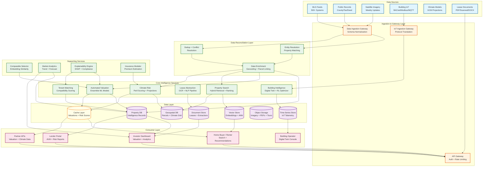
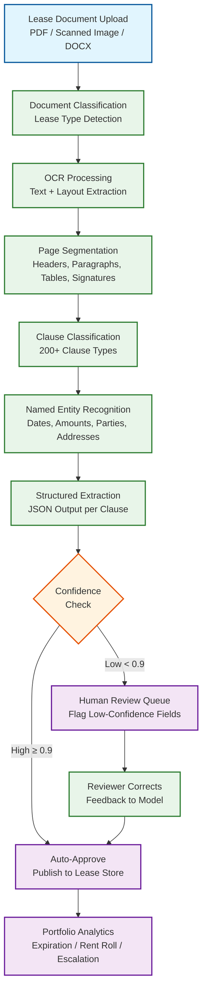
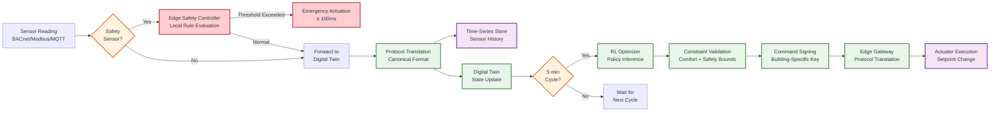
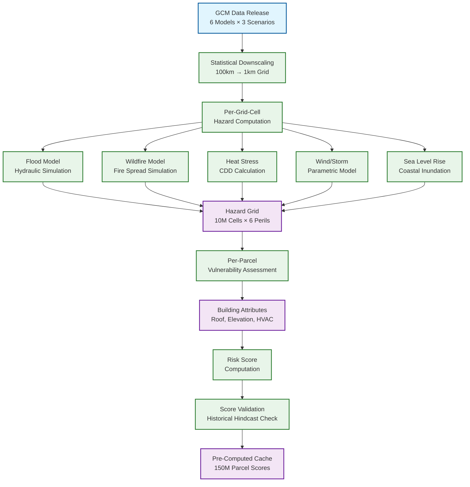

# 13.4 AI-Native Real Estate & PropTech Platform — High-Level Design

## System Architecture



---

## Key Design Decisions

### Decision 1: Entity Resolution as a First-Class Reconciliation Layer

All property data flows through a dedicated entity resolution layer before reaching any intelligence service. A single physical property may appear as different records across MLS feeds (using MLS-specific IDs), county tax rolls (using assessor parcel numbers), deed records (using legal descriptions), and building sensor systems (using building management system IDs). The entity resolution layer maintains a canonical property graph where each node is a unique physical property and edges link to all known external identifiers. Resolution uses a combination of address parsing and normalization (handling abbreviations, unit numbering schemes, directional prefixes), geospatial proximity matching (records within 10m of each other are candidate matches), and learned entity matching models trained on manually verified match/non-match pairs.

**Implication:** Every downstream service (AVM, search, climate risk) operates on canonical property IDs, not source-specific IDs. When a new MLS listing arrives, the ingestion pipeline first resolves it to a canonical property (or creates a new one), then enriches the property record with the new data. This prevents duplicate properties in search results and ensures that a property's valuation incorporates data from all sources, not just the source that happened to be queried. The entity resolution model must be retrained monthly as new address formats, subdivision plats, and county recording practices emerge.

### Decision 2: Spatial-Aware Model Architecture for Property Valuation

The AVM uses an ensemble of three model families that capture different aspects of property value: (1) a gradient-boosted tree model trained on property-level features (square footage, bedrooms, bathrooms, lot size, year built, renovation history, condition scores from listing photos) that captures intrinsic property value; (2) a spatial autoregressive model that captures neighborhood effects and spatial autocorrelation (properties near high-value properties tend to be higher-value, beyond what property-level features explain); and (3) a temporal model that captures market trend momentum at the census-tract level. The ensemble weights are learned per-geography because the relative importance of intrinsic vs. spatial vs. temporal factors varies by market (dense urban markets are more spatially correlated; rural markets are more driven by intrinsic features).

**Implication:** The spatial model requires a pre-computed spatial weight matrix defining neighbor relationships among properties. For 140M properties, a naive full spatial weight matrix is infeasible. The platform uses a K-nearest-neighbor spatial weight matrix (K=15) stored as a sparse matrix, with neighbor distances pre-computed using a geospatial index. This matrix must be recomputed when new properties are added (new construction) or spatial relationships change (new highway, school district rezoning). The recomputation runs as an incremental update (only affected neighborhoods) rather than a full rebuild.

### Decision 3: Two-Tier Building IoT Architecture with Safety Priority

Building IoT data flows through two separate paths based on criticality. Safety-critical sensors (smoke, CO, CO2, fire, flood) use a dedicated low-latency path that bypasses the general ingestion pipeline: sensor → edge gateway → local safety controller → actuation, with a maximum latency budget of 100ms. The safety controller runs on dedicated hardware at the building edge and can actuate emergency responses (ventilation override, sprinkler activation, elevator recall) without any dependency on cloud connectivity. Non-safety sensors (temperature, humidity, occupancy, energy meters) flow through the standard IoT ingestion pipeline to the cloud-hosted digital twin, where the reinforcement learning optimizer processes them on 5-minute cycles for HVAC and energy optimization.

**Implication:** The building edge gateway must maintain a local copy of safety rules and actuation logic that continues operating even during complete network partition from the cloud. The cloud-hosted digital twin receives safety events asynchronously (for logging and analytics) but never sits in the critical path for safety actuation. This split architecture means that the safety path is simple, deterministic, and testable (no ML in the loop), while the optimization path can use complex RL models that are acceptable to fail or degrade gracefully.

### Decision 4: Hybrid Retrieval Architecture for Property Search

Property search combines four retrieval modalities into a single ranked result: (1) geospatial filtering using H3 hexagonal grid indexing at resolution 9 (~175m hexagons) for location-based queries; (2) structured attribute filtering (price range, bedrooms, property type) using inverted indices; (3) semantic search using sentence-transformer embeddings of listing descriptions for natural language queries ("cozy craftsman with a big yard near parks"); and (4) visual similarity search using CNN-extracted embeddings of listing photos for "find homes that look like this" queries. The retrieval pipeline uses a two-stage architecture: stage 1 generates candidate sets from each modality independently (top 500 per modality), then stage 2 applies a learned-to-rank model that fuses candidates into a single ranked list personalized to the user's search history and implicit preferences.

**Implication:** Each modality maintains its own index optimized for its retrieval type (H3 grid for geo, inverted index for attributes, HNSW graph for embeddings). The fusion stage must be latency-bounded (≤ 20ms) because it runs on every query after candidate retrieval. The learn-to-rank model is a lightweight gradient-boosted model (not a deep neural network) trained on click-through data, query-listing-click triples, and listing quality scores. Personalization features (user's past searches, saved homes, price sensitivity) are fetched from a user profile cache with ≤ 2ms latency.

### Decision 5: Pre-Computed Climate Risk Scores with On-Demand Scenario Analysis

Climate risk scoring operates in two modes: (1) pre-computed scores for all 150M parcels across a standard set of scenarios (SSP2-4.5, SSP5-8.5) and time horizons (2030, 2050, 2080), refreshed annually when new downscaled climate model outputs become available; and (2) on-demand scenario analysis for custom queries (e.g., "what if sea level rises 1.5m by 2060 and this building adds flood barriers?"). Pre-computed scores are served from a cache with ≤5ms latency. On-demand analysis runs against the climate grid data with building-specific vulnerability adjustments and takes up to 5 seconds per property.

**Implication:** The annual pre-computation is a massive batch job (150M parcels × 6 perils × multiple scenarios) that takes ~21 hours parallelized across 200 workers. This job runs in a dedicated compute pool and its output is atomically swapped into the serving cache. The on-demand mode allows investors and insurers to model custom scenarios (different emission pathways, building-level mitigation measures) that are not in the pre-computed set. The platform must version climate model inputs so that risk scores are traceable to specific GCM outputs and downscaling methodologies for audit purposes.

---

## Data Flow: MLS Listing to Searchable Property

```mermaid
flowchart LR
    A[MLS Feed Update\nNew/Modified Listing] --> B[Schema Normalization\nMap to Canonical Fields]
    B --> C[Entity Resolution\nMatch to Canonical Property]
    C --> D{New Property\nor Update?}
    D -->|New| E[Create Property Record\nAssign Canonical ID]
    D -->|Update| F[Merge Updates\nConflict Resolution]
    E & F --> G[Data Enrichment\nGeocode + Parcel Link + School District]
    G --> H[Feature Extraction\nPhoto CV + Text Embedding]
    H --> I[Index Updates\nGeo + Text + Visual + Attribute]
    I --> J[AVM Trigger\nRecompute Valuation]
    J --> K[Search Ready\nListing Queryable in ≤ 15 min]

    classDef input fill:#e1f5fe,stroke:#01579b,stroke-width:2px
    classDef process fill:#e8f5e9,stroke:#2e7d32,stroke-width:2px
    classDef decision fill:#fff3e0,stroke:#e65100,stroke-width:2px
    classDef output fill:#f3e5f5,stroke:#6a1b9a,stroke-width:2px

    class A input
    class B,C,G,H,I,J process
    class D decision
    class E,F,K output
```



---

## Data Flow: Lease Document to Structured Intelligence



---

## Component Responsibilities Summary

| Component | Primary Responsibility | Key Interface |
|---|---|---|
| **Data Ingestion Gateway** | MLS feed polling (500+ feeds), public records ingestion, satellite imagery download; schema normalization across heterogeneous sources | Produces canonical property events to reconciliation layer |
| **Entity Resolution Service** | Match incoming records to canonical properties using address normalization, geospatial proximity, and learned matching models | Reads from ingestion queue; writes to property graph; exposes resolution API |
| **Automated Valuation Engine** | Ensemble model inference (GBT + spatial + temporal); comparable selection via embedding similarity; confidence interval computation; bias detection | gRPC API for on-demand; batch pipeline for nightly refresh; writes to property DB and cache |
| **Building Intelligence Service** | IoT telemetry aggregation; digital twin state management; RL-based HVAC optimization; predictive maintenance scheduling; occupancy analytics | Ingests from IoT gateway; reads/writes digital twin state; commands building actuators |
| **Tenant Matching Service** | Credit risk scoring; income verification; compatibility scoring; Fair Housing compliance checking; adverse action reason generation | REST API; reads applicant data + property features; writes screening decisions with audit trail |
| **Lease Abstraction Pipeline** | OCR, layout analysis, clause classification, entity extraction; human-in-the-loop review orchestration; model retraining from corrections | Batch pipeline; reads lease documents from object storage; writes structured extractions to document store |
| **Property Search Service** | Hybrid retrieval (geo + text + visual + attribute); personalized ranking; natural language query understanding | REST API; reads from search indices and vector store; serves consumer and API clients |
| **Climate Risk Service** | Per-parcel risk scoring across 6 perils; scenario analysis; TCFD report generation; climate-adjusted valuation | Pre-computed batch scoring + on-demand API; reads climate grid data; writes scores to cache and geospatial DB |
| **Comparable Selector** | Embedding-based comparable property identification and ranking; adjustment factor computation | Called by AVM; reads property embeddings from vector store; returns ranked comparable set |
| **Market Analytics Service** | Neighborhood trend computation; price index construction; forward-looking market forecasts | Batch pipeline; reads transaction history; publishes market indices; serves dashboards |
| **Explainability Engine** | SHAP value computation; feature importance ranking; regulatory compliance reports; adverse action reason generation | Called by AVM and tenant matching; reads model internals; writes explainability reports |
| **Insurance Modeling Service** | Premium estimation from climate risk + building characteristics; mitigation impact modeling | Reads climate scores and property attributes; writes premium estimates; serves what-if API |

---

## Case Studies

### Case Study 1: Market Correction Detection and AVM Adaptation

**Scenario**: Interest rates rise 200 basis points over 3 months. Home prices begin declining 5-10% in high-appreciation markets, but the AVM continues using spatial and temporal models trained on appreciating markets.

**System Response**: (1) Market analytics service detects price momentum reversal: the 30-day median list-to-AVM ratio drops below 0.95 (listings pricing below AVM estimates), indicating stale valuations. (2) Feature drift detector flags that the price-per-sqft distribution has shifted >2σ from the training distribution. (3) Temporal model component receives stronger weight in the ensemble (capturing trend reversal), while spatial model weight is reduced (spatial spillover from recent high sales is now misleading). (4) Nightly batch retrains the temporal model on last 30 days of transactions (instead of the standard 6-month window) to capture the regime shift faster. (5) On-demand valuations include a "market regime" flag indicating that conditions are changing rapidly and confidence intervals should be widened. **Result**: AVM catches up to the correction within 2-3 weeks instead of the 2-3 months it would take without intervention.

### Case Study 2: Building Safety Incident — CO2 Spike During HVAC Optimization

**Scenario**: The RL optimizer reduces ventilation in a partially occupied floor to save energy (operating within normal parameters). Unexpectedly, a contractor starts using volatile solvents on an adjacent floor, causing CO2 and VOC levels to spike in the optimized zone.

**System Response**: (1) CO2 sensor on the affected floor crosses the OSHA warning threshold (5,000 ppm) → edge safety controller overrides the RL optimization within 80ms. (2) HVAC switches to maximum outdoor air ventilation for the affected zone and adjacent zones. (3) Cloud digital twin receives the safety event asynchronously (500ms later) and pauses RL optimization for the entire floor plate. (4) Building operator receives alert with sensor readings, affected zones, and the cause of the override. (5) RL agent receives a negative reward signal for the override event; the next training iteration will learn that ventilation below a threshold is risky when adjacent zones have uncontrolled activities. **Result**: CO2 returns to safe levels within 8 minutes; no occupant exposure above OSHA limits.

### Case Study 3: Entity Resolution Conflict — Condo Conversion

**Scenario**: A 12-unit apartment building (single tax parcel, single MLS listing when it was last sold as a rental property 5 years ago) is converted to condominiums. Each unit now has its own tax parcel number, and 6 units are listed individually on MLS. The entity resolution system must recognize that the old single-property record now maps to 12 new properties.

**System Response**: (1) County recorder feed shows 12 new parcel numbers carved from the original parcel. (2) Entity resolution detects that the original canonical property's parcel boundary no longer matches any current tax parcel. (3) The system creates 12 new canonical property records, each linked to their new parcel number. (4) The original property record is marked "converted" with links to all 12 successor properties. (5) MLS listings for the 6 active units are matched to their new canonical IDs via address + unit number matching. (6) AVM recomputation triggered: the 6 listed units receive individual valuations; the 6 unlisted units receive modeled valuations based on the listed units as comparables. **Result**: Search correctly shows individual condo units, not the old apartment building listing.

### Case Study 4: Climate Risk Re-Assessment After Hurricane

**Scenario**: A Category 4 hurricane makes landfall, causing flooding in areas outside FEMA's designated flood zones. Pre-computed flood risk scores for 200K affected parcels are now stale.

**System Response**: (1) NOAA hurricane warning triggers pre-computation of updated flood risk for all parcels in the warning area. (2) Post-event satellite imagery is ingested to identify actual flood extent. (3) Actual flood boundaries are compared against the platform's pre-computed flood risk scores — parcels that flooded but had low pre-computed risk are flagged as "model miss" areas. (4) The flood model is re-calibrated to incorporate the new event as a training observation. (5) All affected parcels' risk scores are updated within 72 hours of the event. (6) Lenders and insurers with API integrations receive automated notifications that risk scores in the affected area have been revised. **Result**: The flood model improves its accuracy in the affected region; lenders have updated risk data for underwriting decisions within days.

---

## Cross-Cutting Concerns

### Idempotency Strategy

| Operation | Idempotency Mechanism | Key |
|---|---|---|
| **MLS listing update** | Entity resolution produces canonical ID; duplicate updates for same listing are merged | `mls_id + mls_source` |
| **On-demand valuation** | Result cached by property ID + feature snapshot hash; identical requests return cached result | `property_id + feature_hash` |
| **Lease document upload** | Document fingerprinted (SHA-256 of content); duplicate uploads detected and linked to existing extraction | `document_sha256` |
| **Building sensor reading** | Deduplicated by building_id + sensor_id + timestamp at IoT ingestion gateway | `building_id + sensor_id + timestamp` |
| **Tenant screening request** | Deduplicated by applicant_id + property_id within 24-hour window | `applicant_id + property_id + date` |

### Data Retention Policies

| Data Type | Hot Retention | Warm Retention | Cold/Archive | Deletion Policy |
|---|---|---|---|---|
| **Property records** | Lifetime | N/A | N/A | Never deleted; properties may be marked inactive but record retained |
| **Transaction history** | 20 years | N/A | N/A | Regulatory requirement for valuation audit trail |
| **AVM computation logs** | 90 days | 7 years | Permanent archive | ECOA/fair lending requires 7-year retention |
| **Building sensor data** | 30 days (full resolution) | 1 year (5-min aggregates) | 5 years (hourly aggregates) | Tiered compression; safety events retained 10 years |
| **Lease documents** | Lease term + 7 years | N/A | N/A | Regulatory and audit requirement |
| **Tenant screening data** | 30 days post-decision | 5 years (anonymized) | N/A | FCRA requires deletion; anonymized aggregate retained for fairness monitoring |
| **Search history** | 12 months of inactivity | N/A | N/A | Deleted on user request; auto-purge on inactivity |

### Graceful Degradation Hierarchy

| Level | Trigger | Degraded Capability | Preserved Capability |
|---|---|---|---|
| **L0 — Normal** | All systems healthy | None | Full functionality |
| **L1 — Analytics Degraded** | Climate risk or market analytics service offline | Climate scores serve from cache (up to 13 months stale); no on-demand scenario analysis; market forecasts paused | Search, AVM, building management, lease processing all functional |
| **L2 — Intelligence Degraded** | AVM ensemble partially unavailable (e.g., SAR model offline) | Valuations produced with reduced ensemble (wider confidence intervals, flagged as degraded); comparable search may use brute-force fallback | Search, tracking, building management operational |
| **L3 — Search Degraded** | Search index or vector store unavailable | Visual similarity and semantic search disabled; structured attribute + geospatial search only | AVM, building management, lease processing operational |
| **L4 — IoT Degraded** | Cloud digital twin offline | HVAC optimization paused; buildings revert to schedule-based operation; safety systems unaffected (edge-autonomous) | All non-IoT services operational |
| **L5 — Emergency** | Multiple core services down | Read-only mode: cached valuations and risk scores served; no new computations; building safety on edge-only | Active deliveries of cached data; building safety |

---

## Deployment Strategy

### Market Launch Playbook

| Phase | Duration | Activities | Go/No-Go Criteria |
|---|---|---|---|
| **Phase 1: Data Foundation** | 8 weeks | Onboard MLS feeds for target market; ingest county tax records; run entity resolution; build initial property graph | ≥95% property coverage in target metro; entity resolution accuracy ≥98%; ≥12 months transaction history loaded |
| **Phase 2: Intelligence Calibration** | 4 weeks | Train market-specific AVM; calibrate spatial weights; compute climate risk scores; build search index | AVM MdAPE ≤8% on holdout set; search index covers ≥99% of active listings; disparate impact test passes |
| **Phase 3: Beta Launch** | 4 weeks | Limited API access for 3-5 lending partners; internal search beta; manual validation of valuations against professional appraisals | AVM ≤6% MdAPE on live transactions; lender feedback on explainability reports; zero fair lending violations in sample audit |
| **Phase 4: General Availability** | Ongoing | Public search launch; full API availability; building IoT onboarding begins; marketing and sales push | All phase 3 criteria maintained at scale; support capacity confirmed; runbooks tested |

### ML Model Deployment Pipeline

```
Model Development → Offline Evaluation → Shadow Mode → Canary → Full Rollout

1. Offline Evaluation:
   - Train on T-1 to T-12 month data; evaluate on T-0 month holdout
   - Must beat production model on MdAPE, hit rate, bias, and demographic parity
   - Automated rejection if any metric regresses

2. Shadow Mode (7 days):
   - New model runs in parallel with production; predictions logged but not served
   - Compare new vs. production predictions on live traffic
   - Detect distribution shift between offline and online performance

3. Canary (7 days):
   - Serve new model for 1% of on-demand requests (randomly selected)
   - Monitor: accuracy on subsequent transactions, latency, fairness metrics
   - Automatic rollback if canary error exceeds production by >0.5%

4. Full Rollout:
   - Gradual ramp: 1% → 10% → 50% → 100% over 48 hours
   - Hold at each stage for at least 6 hours
   - Monitoring team on standby during ramp
```

### Building IoT Onboarding Process

Each building requires physical installation (edge gateway, network configuration) and logical configuration (sensor mapping, safety rule compilation). The onboarding process:

1. **Site survey (2 days):** Inventory existing building automation systems; document protocols, sensor counts, actuator types, network topology
2. **Gateway deployment (1 day):** Install dual edge gateways (primary + standby); connect to building network; verify cloud connectivity
3. **Protocol discovery (1 day):** Gateway scans for BACnet objects, Modbus registers, MQTT topics; auto-generates preliminary sensor mapping
4. **Mapping verification (3 days):** Engineer reviews auto-generated mapping; corrects misidentifications; adds missing sensors; configures plausibility bounds
5. **Safety rule compilation (1 day):** Compile building-specific safety rules from code requirements (ASHRAE 62.1 parameters per-zone, NFPA 72 alarm routing, OSHA limits); load to edge gateway
6. **Digital twin initialization (1 day):** Start collecting sensor data; build thermal model from 7 days of baseline data; initialize equipment health baselines
7. **RL policy warm-up (14 days):** Train building-specific RL policy in simulator (using initial thermal model); deploy conservatively (95% exploit / 5% explore); monitor comfort and energy metrics
8. **Handoff (1 day):** Transfer to operations team; document building-specific quirks; add to monitoring dashboard

**Total onboarding time:** ~24 days per building. At target of 50,000 buildings over 3 years, this requires a sustained throughput of ~50 buildings/month, implying 5-6 parallel onboarding teams.

---

## Multi-Tenant API Design

| Concern | Approach |
|---|---|
| **Tenant isolation** | Logical isolation via tenant_id scoping on all queries; shared compute infrastructure; dedicated ANN index replicas for high-volume lending partners |
| **Rate limiting** | Per-tenant rate limits based on contract tier; burst capacity configurable; adaptive rate limiting that tightens during platform stress |
| **Data access control** | Tenants access only their own screening data and portfolio analytics; property valuation and search data is shared (public information); building sensor data access restricted to building owner/operator |
| **Billing** | Metered by API call volume (valuations, searches, climate scores); GPU-second billing for lease processing; per-building/month billing for IoT management |
| **SLA differentiation** | Enterprise tenants get dedicated serving capacity and higher rate limits; developer-tier tenants share capacity and get best-effort SLA |
| **Compliance scope** | Each tenant's regulatory obligations tracked independently; a lender tenant triggers ECOA compliance on valuations; a property manager tenant does not |
| **Audit separation** | Each tenant's API calls and responses stored in tenant-scoped audit partitions; regulatory examinations access only the requesting tenant's audit data |

---

## Architecture Decision Log

| # | Decision | Rationale | Trade-Off |
|---|---|---|---|
| ADR-01 | Entity resolution as synchronous pipeline step (not async) | Downstream services must operate on resolved canonical IDs; async resolution would create a window where search shows duplicates or AVM uses partial data | Adds 50-200ms to ingestion latency per record; worthwhile for data consistency |
| ADR-02 | Separate safety and optimization paths at hardware level (not software) | Software-level separation can be circumvented by bugs, resource contention, or misconfiguration; hardware-level separation (dedicated BACnet network, dedicated edge safety controller) provides defense in depth | Higher hardware cost per building (~$2K additional); justified by liability reduction |
| ADR-03 | Pre-compute climate risk scores (not compute on-demand for all requests) | On-demand computation at 100ms/parcel cannot meet 5ms serving SLO for cached scores; 150M parcels would overwhelm compute if all requested on-demand | Annual pre-compute cost (~$50K); stale scores for up to 13 months between refreshes |
| ADR-04 | Use H3 hexagonal grid (not S2 cells or geohash) for geospatial indexing | H3 hexagons have uniform neighbor distances (unlike square geohash cells); resolution hierarchy enables multi-scale queries; widely adopted with mature libraries | Smaller ecosystem than geohash; minor learning curve |
| ADR-05 | Per-clause tiered accuracy targets for lease extraction (not uniform target) | Financial clause errors cost 1000x more than administrative clause errors; uniform F1 target misallocates review budget | More complex monitoring infrastructure; tiered accuracy is harder to communicate to stakeholders |
| ADR-06 | Two-pass AVM batch (not single-pass with topological ordering) | Single-pass topological ordering of spatial dependency graph destroys parallelism (near-complete graph); two-pass preserves full first-pass parallelism, confines serial work to 5% boundary set | 30 minutes additional batch time; minor cost vs. the alternative of sequential processing |

---

## Data Flow: Building Sensor Reading to HVAC Actuation



---

## Data Flow: Climate Risk Score Pre-Computation


