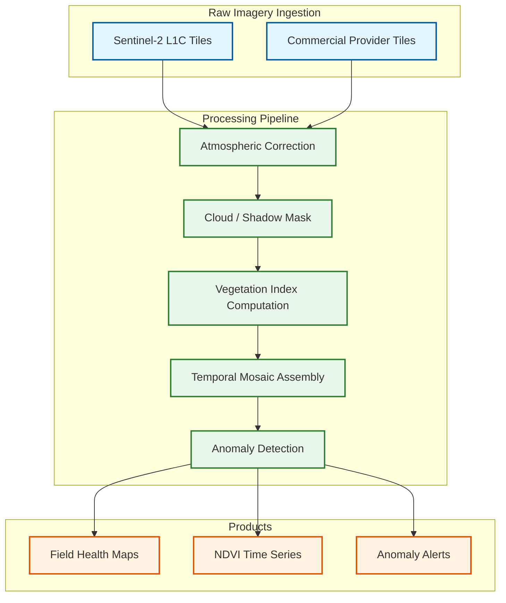
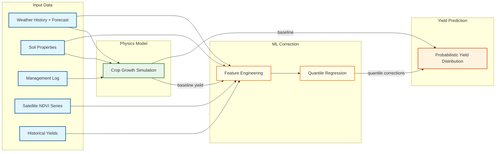
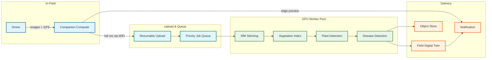

# 13.5 AI-Native Agriculture & Precision Farming Platform — Deep Dives & Bottlenecks

## Deep Dive 1: Precision Spraying — Camera-to-Nozzle Latency Budget

### The 15 ms Challenge

At 20 km/h (5.56 m/s), the spray boom travels 8.3 cm in 15 ms. A typical nozzle spray pattern covers a 25–50 cm swath on the ground. This means the system must complete the entire pipeline—image capture, inference, nozzle mapping, and valve actuation—before the boom has traveled past the targeted weed. Any latency beyond 15 ms results in the spray missing the weed entirely or hitting the crop behind it.

### Latency Budget Breakdown

```
Total budget: 15.0 ms

Image capture + transfer to GPU:     1.5 ms
  - Camera: global shutter, 2 MP, 30 FPS
  - Transfer: CSI-2 interface to embedded GPU memory
  - Trigger: hardware sync pulse, no software overhead

Image preprocessing:                  1.0 ms
  - Undistortion (pre-computed lookup table)
  - Exposure normalization (histogram equalization)
  - Crop to nozzle field-of-view regions

Model inference (INT8 quantized):     7.0 ms
  - Architecture: Modified YOLOv8-nano, INT8 quantized
  - Input: 640×640 RGB
  - Output: bounding boxes + class + confidence
  - Hardware: embedded GPU at 275 TOPS (INT8)
  - Batch: process 4 camera feeds concurrently

Nozzle zone mapping:                  2.0 ms
  - Project detections from image space to ground plane
  - Map ground-plane weed positions to nozzle zones
  - Uses pre-calibrated homography matrix (camera-to-ground)
  - Lookup table: detection pixel → nozzle index

Solenoid actuation:                   2.5 ms
  - PWM signal generation via GPIO
  - Solenoid valve response time: ~1.5 ms (mechanical)
  - Duty cycle modulation: 0% (off), 30-100% (proportional to confidence)

Buffer/overhead:                      1.0 ms
---
Total:                               15.0 ms
```

### Slowest part of the process: Model Accuracy vs. Latency Trade-off

The primary tension is model size. A full-precision YOLOv8-medium model achieves 97% weed detection accuracy but requires 25 ms inference on the same hardware. The INT8-quantized YOLOv8-nano achieves 93% accuracy in 7 ms. The 4% accuracy gap means approximately 7 weeds per 100 are missed—acceptable because the sprayer makes multiple passes during a season, and a missed weed in pass 1 is caught in pass 2.

**Mitigation strategies:**
- **Dual-threshold approach:** Spray at low confidence (> 60%) but flag high-uncertainty detections for review. Over-spraying by 5–10% is far cheaper than under-spraying (herbicide costs $3–8/acre; yield loss from weed competition costs $30–80/acre)
- **Temporal redundancy:** Each weed enters the camera field-of-view across 2–3 consecutive frames as the boom moves forward. If the model misses on frame 1, it gets another chance on frames 2 and 3. This effectively raises the per-weed detection rate from 93% to 99.7% (1 - 0.07³)
- **Seasonal model specialization:** Deploy different model weights for different crop stages. Early-season models (small crop, small weeds on bare soil) are simpler and faster than mid-season models (tall crop, weeds hidden under canopy)

### Slowest part of the process: Vibration and Lighting Variation

Spray booms operate on rough terrain, introducing camera vibration and motion blur. At 20 km/h on uneven ground, vertical boom oscillation can exceed ±15 cm, changing the effective ground sampling distance and blurring images.

**Mitigation:**
- Global shutter cameras (not rolling shutter) to eliminate motion artifacts
- Exposure time < 1 ms to freeze motion even under vibration
- Active LED illumination strips along the boom to eliminate shadow and lighting variation (enables consistent performance from dawn to dusk and overcast conditions)
- IMU-based vibration compensation in the homography transform (real-time rotation correction)

---

## Deep Dive 2: Satellite Imagery Pipeline — Cloud Masking and Temporal Gaps

### The Cloud Masking Problem

Satellite imagery over agricultural regions is frequently contaminated by clouds. In the US Midwest during the growing season (May–September), approximately 40–60% of satellite passes contain some cloud cover. A naive approach that discards any image with cloud presence would reduce the effective revisit frequency from 5 days to 10–15 days—too infrequent for timely crop monitoring.

### Production Pipeline



### Slowest part of the process: Cloud Masking Accuracy

Cloud mask errors come in two flavors, both damaging:
- **False negatives** (cloud classified as clear): Introduce bright artifacts in NDVI maps that look like healthy vegetation. Can trigger false "excess vigor" anomalies or mask genuine problems behind clouds.
- **False positives** (clear classified as cloud): Discard usable pixels, reducing temporal density. Particularly problematic over bright soil (bare fields pre-canopy) where surface reflectance resembles thin cirrus.

**Production approach:**
1. **Ensemble cloud masking:** Run 3 independent cloud detection algorithms (scene classification, pixel-level ML, temporal consistency check) and take majority vote. Agreement threshold: 2/3 algorithms must classify as cloud for pixel to be masked.
2. **Cloud shadow detection:** Clouds cast shadows that are equally problematic (low NDVI from shadow, not crop stress). Use sun angle geometry + cloud height estimation to project shadow positions.
3. **Per-pixel confidence score:** Instead of binary cloud/clear, assign a quality score (0–1) to each pixel. Downstream analytics weight pixels by confidence, reducing the impact of uncertain pixels without discarding them entirely.

### Slowest part of the process: Temporal Gap Filling

When consecutive satellite passes are cloud-contaminated, a field may have no usable imagery for 15–20 days. This creates a gap in the NDVI time series that disrupts anomaly detection (an anomaly detector comparing current NDVI to expected NDVI has no current observation).

**Gap-filling strategies:**
- **Spatial interpolation from nearby clear fields:** If neighboring fields of the same crop type have clear imagery, use spatial kriging to estimate the target field's NDVI. Accuracy degrades with distance; usable within ~5 km.
- **Radar fusion:** Synthetic Aperture Radar (SAR) from Sentinel-1 penetrates clouds and provides vegetation structure information (not identical to optical NDVI but correlated). A trained fusion model translates SAR backscatter to estimated NDVI with R² ≈ 0.7.
- **Crop growth model interpolation:** Use the physics-based growth simulation to predict what the NDVI should be based on accumulated weather since the last clear observation. This is less accurate than actual imagery but provides a biologically plausible interpolation.

---

## Deep Dive 3: Soil Sensor Calibration Drift

### The Problem

Soil sensors deployed in the field are subject to environmental degradation: moisture sensor probes accumulate mineral deposits, pH electrodes drift as reference junctions age, and NPK spectral sensors lose sensitivity as optical windows become occluded by soil particles. Over a 5-year deployment, uncorrected sensor drift can introduce 15–25% error in soil moisture readings and 0.5–1.0 pH unit error in pH readings—rendering prescriptions based on this data counterproductive.

### Calibration Architecture

```
FUNCTION calibrate_sensor(sensor_id, reading):
    // Step 1: Apply factory calibration (linear transform)
    calibrated = factory_model[sensor_id].transform(reading.raw)

    // Step 2: Apply drift correction
    drift_model = get_drift_model(sensor_id)
    calibrated = drift_model.correct(calibrated, reading.timestamp)
    // drift_model is a time-varying linear model updated with ground-truth samples

    // Step 3: Cross-validate with neighbors
    neighbor_readings = get_recent_readings(
        field=sensor.field_id,
        radius=100m,
        window=1h
    )
    IF abs(calibrated.moisture - median(neighbor_readings.moisture)) > 3 * std:
        flag_anomaly(sensor_id, "outlier_vs_neighbors")
        calibrated.confidence = LOW
    ELSE:
        calibrated.confidence = HIGH

    // Step 4: Fuse with satellite soil moisture estimate
    satellite_sm = get_satellite_soil_moisture(sensor.h3_cell, reading.timestamp)
    IF satellite_sm IS AVAILABLE:
        fused = weighted_average(
            calibrated.moisture * calibrated.confidence_weight,
            satellite_sm * satellite_confidence_weight
        )
    ELSE:
        fused = calibrated.moisture

    RETURN fused, calibrated.confidence
```

### Slowest part of the process: Ground-Truth Scarcity

Drift correction requires periodic ground-truth soil samples (physically collected and lab-analyzed). But lab sampling costs $15–30 per sample and takes 5–10 business days. A farm with 500 sensors cannot afford to ground-truth every sensor annually. The platform addresses this through:

- **Sentinel sensors:** Designate 5% of sensors as "sentinels" that are ground-truthed annually. Sentinel drift models are applied to nearby non-sentinel sensors of the same model and installation date.
- **Cross-sensor validation:** If 10 sensors in a 50-acre zone all read consistently but one diverges, the divergent sensor is likely drifted. The platform auto-adjusts the divergent sensor's calibration to match the group consensus (with a drift flag for operator review).
- **Yield map feedback:** After harvest, actual yield map data provides an indirect calibration signal. If a zone's soil sensors reported optimal moisture and nutrients but yield was 20% below prediction, the sensors in that zone are flagged for ground-truth validation.

---

## Deep Dive 4: Yield Prediction — Handling Out-of-Distribution Weather

### The Problem

ML-based yield models are trained on historical weather patterns. When a season brings unprecedented conditions (extreme drought, flooding, late frost, heat dome), the ML model extrapolates beyond its training distribution, producing unreliable predictions. In 2012 (US Midwest drought) and 2019 (historic flooding), pure ML yield models produced errors exceeding 30 bu/acre—compared to their typical 8–12 bu/acre error in normal years.

### Hybrid Model Architecture



### Why the Hybrid Works Under Extreme Weather

The physics-based crop simulation model encodes mechanistic relationships: photosynthesis rate as a function of temperature and solar radiation, water uptake as a function of root depth and soil moisture, grain fill duration as a function of accumulated heat units. These relationships hold even under extreme conditions because they are based on plant biology, not statistical correlations. When the 2012-like drought occurs, the physics model correctly predicts severe yield reduction because it models the water stress mechanism directly.

The ML correction model operates on the residual (actual yield minus simulation yield). In normal years, the residual is +5 to +15 bu/acre (the physics model tends to under-predict because it does not capture all management practices). Under extreme weather, the residual shrinks because the physics model is handling the primary effect. The ML model's job narrows to correcting for local factors (field-specific soil variation, management timing) rather than extrapolating weather impact.

### Slowest part of the process: Simulation Compute Cost

Running DSSAT/APSIM for every prediction unit (5M management zones) at every weather forecast update is computationally prohibitive (500 ms × 5M = 2.5M CPU-seconds = 29 CPU-days per update).

**Scaling strategy:**
1. **Stratified sampling:** Cluster prediction units by crop type, soil class, and climate zone. Run full simulation on 10% representative samples (~500K units). Interpolate results for remaining units using spatial kriging and adjustment factors.
2. **Simulation caching:** Weather is the primary simulation driver, and weather varies slowly across space. Cache simulation results by weather cell (10 km grid) and reuse for fields within the same cell, adjusting only for soil and management differences.
3. **Incremental simulation:** Instead of re-running the full season simulation weekly, advance the existing simulation state by 7 days using the new weather observations. This converts a 500 ms full-season simulation into a 50 ms incremental update.

---

## Deep Dive 5: Connectivity and Edge-Cloud Sync in Rural Environments

### Connectivity Landscape

US rural cellular coverage statistics relevant to agriculture:
- 4G LTE: covers ~75% of farmland area (signal strength varies widely)
- 5G: covers < 5% of farmland (primarily near towns)
- Typical bandwidth when connected: 1–10 Mbps downlink, 0.5–2 Mbps uplink
- Connectivity gaps: 25%+ of a large farm may have zero cellular signal

### Store-and-Forward Architecture

Edge devices (spray controllers, equipment telemetry units, drone companions) must operate autonomously during connectivity gaps and synchronize when connectivity returns.

```
FUNCTION edge_sync_manager(device):
    outbound_queue = PriorityQueue()  // data to upload to cloud
    inbound_cache = LocalStore()      // prescriptions, models, configs from cloud

    // Continuous: buffer outbound data
    ON new_data(record):
        outbound_queue.enqueue(record, priority=record.priority)
        // Priority levels:
        //   CRITICAL: pest outbreak alerts, equipment safety alerts
        //   HIGH: spray session summaries, yield-relevant observations
        //   NORMAL: detailed telemetry, sensor readings
        //   LOW: raw images, diagnostic logs

    // Periodic: attempt sync when connectivity detected
    ON connectivity_available(bandwidth_estimate):
        // Upload critical data first
        WHILE outbound_queue.not_empty() AND connectivity.active():
            batch = outbound_queue.dequeue_batch(max_size = bandwidth_estimate * 30s)
            result = upload_batch(batch)
            IF result.success:
                outbound_queue.acknowledge(batch)
            ELSE:
                outbound_queue.requeue(batch)
                BREAK

        // Download updates if bandwidth allows
        IF connectivity.active() AND bandwidth_estimate > 1 Mbps:
            check_for_updates(
                prescriptions = inbound_cache.prescription_version,
                models = inbound_cache.model_version,
                configs = inbound_cache.config_version
            )

    // Degradation: manage storage pressure
    ON storage_pressure(used_pct):
        IF used_pct > 90%:
            // Drop LOW priority data older than 24 hours
            outbound_queue.evict(priority=LOW, age > 24h)
        IF used_pct > 95%:
            // Drop NORMAL priority data older than 48 hours
            outbound_queue.evict(priority=NORMAL, age > 48h)
            // Never drop CRITICAL or HIGH
```

### Slowest part of the process: Prescription Staleness

If a spray rig operates offline for 3 days and the prescription map was updated on day 2 (new weed hotspot detected by drone survey), the rig applies the stale prescription. There is no perfect solution in a disconnected environment, but mitigations include:

- **Prescription TTL:** Each prescription carries an expiration timestamp. The edge controller warns the operator when using an expired prescription.
- **Edge inference as fallback:** When the prescription is stale, the spray controller relies more heavily on real-time camera inference (spot spray mode) rather than the prescription map (variable-rate mode). This shifts from planned application to reactive detection.
- **Opportunistic sync via nearby devices:** If two rigs pass within LoRa range of each other, they can peer-sync prescription updates without requiring cloud connectivity (mesh gossip protocol).

---

## Deep Dive 6: Drone Fleet Coordination and Processing Pipeline

### The Throughput Challenge

During peak scouting season, 5,000 drone flights generate 40 TB/day of raw imagery. Each flight produces 500–1,500 overlapping images that must be stitched into a georeferenced ortho-mosaic via structure-from-motion (SfM) photogrammetry—a GPU-intensive process requiring 45–70 minutes per flight on a single GPU worker.

### Processing Pipeline Architecture



### Slowest part of the process: Upload Bandwidth

A 200-acre flight generating 8 GB of imagery at 5 Mbps (typical farm WiFi) requires 3.5 hours to upload—longer than the 2-hour SLO for results delivery. The drone companion computer addresses this through:

- **Edge preview:** On-drone processing generates a low-resolution RGB mosaic (~50 MB) immediately after landing, enabling agronomist review within 15 minutes
- **Progressive upload:** Prioritize center-of-field images first, enabling partial SfM processing to begin while upload continues
- **Differential upload:** If re-flying a previously surveyed field, upload only changed regions by comparing GPS-tagged image positions with the previous flight
- **Compression:** JPEG-XL compression reduces upload volume by 40% vs. standard JPEG with no perceptible quality loss for agronomic analysis
- **Edge-cloud handoff:** The drone companion computer generates a coarse plant detection output (weed density map, disease hotspot candidates) using a lightweight on-device model. This preliminary result is transmitted immediately via cellular (< 5 MB), giving the agronomist actionable data within minutes. The full-resolution SfM pipeline in the cloud produces the definitive ortho-mosaic within 2 hours, confirming or refining the edge result

### Slowest part of the process: GPU Worker Cost

At peak, 250 GPU workers processing drone imagery costs approximately $6,000/day on on-demand compute. Cost optimization strategies:

| Strategy | Savings | Trade-off |
|----------|---------|-----------|
| Spot/preemptible instances (80% of workers) | 60–70% | Jobs may be interrupted; re-queue with checkpoint restore |
| Priority tiers (urgent scout vs. routine monitor) | 20% | Routine jobs may wait 4+ hours during peak |
| Nighttime processing (shift non-urgent to off-peak) | 30% | Results delayed to next morning |
| Progressive resolution (preview first, full later) | 15% | Preview uses 4x downsampled images; full resolution deferred |
| Counter-seasonal allocation (winter: training) | N/A | GPU fleet serves drone processing in summer, model training in winter |

---

## Deep Dive 7: Weather Integration and Microclimate Modeling

### The Problem

Gridded weather forecasts (from national weather services) provide data at 3–10 km resolution. A single 10 km grid cell may contain fields with significantly different microclimates due to topography (hilltop vs. valley), proximity to water bodies, and land use (irrigated vs. dryland). Using the same weather data for all fields in a grid cell introduces systematic error in evapotranspiration estimates and frost risk assessments.

### Microclimate Correction Architecture

```
FUNCTION compute_field_microclimate(field, gridded_forecast):
    // Start with gridded forecast as baseline
    field_weather = gridded_forecast.interpolate(field.centroid)

    // Correction 1: Elevation adjustment
    grid_elevation = dem.get_elevation(gridded_forecast.grid_center)
    field_elevation = dem.get_elevation(field.centroid)
    elevation_diff_m = field_elevation - grid_elevation
    // Temperature lapse rate: -6.5°C per 1000m elevation gain
    field_weather.temperature += elevation_diff_m * (-6.5 / 1000)

    // Correction 2: Cold air drainage (valleys accumulate cold air at night)
    IF field.topographic_position == "valley_bottom":
        field_weather.min_temperature -= 2.0  // valleys 2°C colder at night
        field_weather.frost_risk *= 1.5

    // Correction 3: On-farm weather station bias correction
    IF field.has_weather_station:
        // Compare station observations to gridded forecast for last 30 days
        bias = compute_bias(
            station_observations = get_station_data(field.station_id, 30_days),
            gridded_hindcast = get_gridded_data(field.centroid, 30_days)
        )
        field_weather.apply_bias_correction(bias)

    // Correction 4: Irrigation cooling effect
    IF field.irrigation_method != "rainfed":
        IF field.last_irrigation_within(24_hours):
            field_weather.max_temperature -= 1.5  // evaporative cooling
            field_weather.humidity += 5.0  // increased local humidity

    RETURN field_weather
```

### Slowest part of the process: Forecast Data Volume

Ingesting gridded weather forecasts (GRIB2 format) for the entire US at hourly resolution for a 10-day horizon generates 50+ GB per forecast cycle (every 6 hours). The platform extracts only the geographic extent covering managed fields (~15% of the continental US), reducing volume to ~7 GB per cycle. Forecast variables are pre-aggregated to daily summaries (max/min temperature, total precipitation, mean wind, cumulative solar radiation) for most consumers, with hourly detail retained only for spray window computation (wind speed thresholds) and frost risk (overnight minimum tracking).

### Slowest part of the process: Multi-Model Weather Ensemble

Using a single weather forecast model introduces systematic bias (GFS tends to over-predict precipitation in certain regions; ECMWF tends to under-predict temperature extremes in arid zones). The platform ingests forecasts from 3–5 models (GFS, ECMWF, NAM, HRRR, Canadian GEM) and computes a locally weighted ensemble:

| Model | Resolution | Update Frequency | Strength |
|-------|-----------|-----------------|----------|
| GFS (US) | 13 km | Every 6 hours | Global coverage; 16-day horizon |
| ECMWF (EU) | 9 km | Every 12 hours | Most accurate 3–10 day forecasts globally |
| NAM (US) | 12 km | Every 6 hours | Strong for US regional weather patterns |
| HRRR (US) | 3 km | Every hour | Highest resolution; best for 0–18 hour nowcasting |
| On-farm stations | Point | Every 15 min | Ground truth for local microclimate |

The ensemble weighting is adaptive: for each farm region, the platform retrospectively evaluates each model's recent accuracy (7-day rolling) and assigns higher weight to the model that performed best locally. On-farm weather station data, when available, serves as the ground truth for weight calibration. This adaptive ensemble improves temperature forecast accuracy by 15–25% and precipitation forecast accuracy by 10–20% compared to any single model.

For critical decisions (frost alerts, spray window computation), the platform uses the most pessimistic model rather than the ensemble mean—a single model predicting frost triggers a frost alert even if the ensemble average is above freezing. This conservative approach is correct because the cost of a missed frost alert (crop damage) far exceeds the cost of a false alarm (unnecessary frost protection activation).

The HRRR model deserves special attention for spray window computation: its 3 km resolution and hourly updates make it the most accurate short-term wind forecast, which is critical for determining whether spray drift conditions are safe (wind < 10 mph, temperature inversion absent). Spray operations that proceed under unsafe wind conditions risk drift onto neighboring fields—a regulatory violation and liability exposure.
