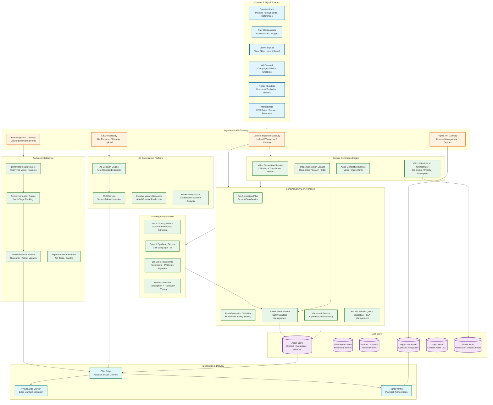
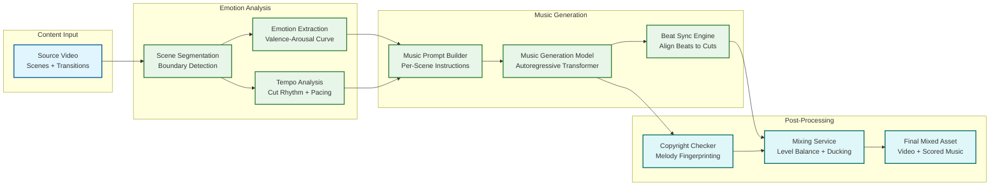
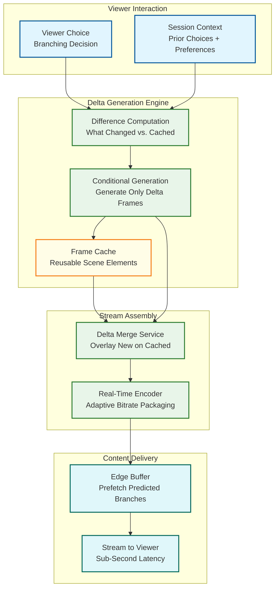
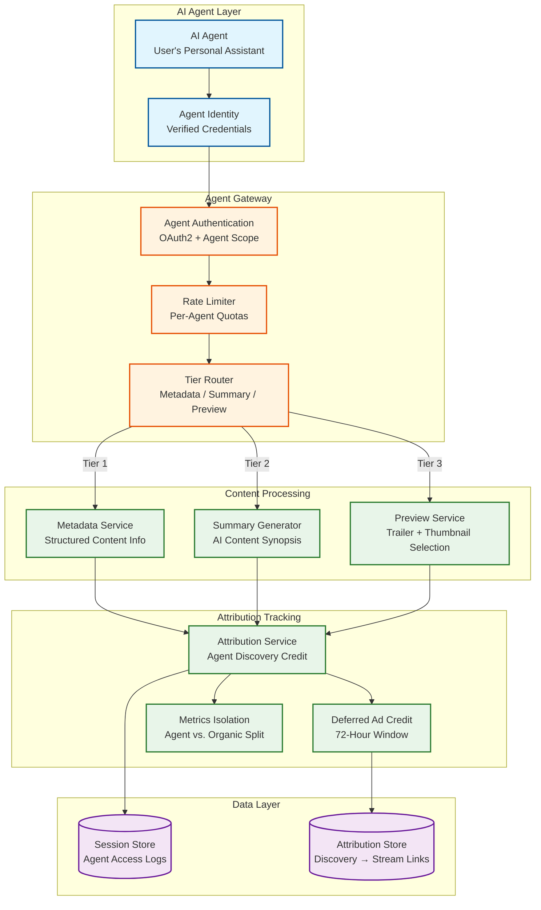

# 13.6 AI-Native Media & Entertainment Platform — High-Level Design

## System Architecture



---

## Data Flow Architecture

### Flow 1: Content Generation Pipeline

```
Creative Brief → Pre-Generation Safety Filter → GPU Scheduler
  → Model Selection (video / image / audio) → Generation Execution
  → Post-Generation Safety Classification → Provenance Manifest Creation
  → Watermark Embedding → Asset Store Registration → Content Asset Graph Update
```

The generation pipeline is request-driven for interactive sessions (creator submits a prompt and waits) and event-driven for batch campaigns (a campaign trigger enqueues thousands of generation jobs). The GPU scheduler mediates between these two demand patterns by maintaining separate queues with priority preemption: interactive jobs can preempt batch jobs at checkpoint boundaries, ensuring batch work is not lost but interactive latency is preserved.

### Flow 2: Dubbing and Localization Pipeline

```
Source Content → Audio Extraction → Speaker Diarization → Voice Embedding
  → Per-Language Pipeline (parallel across 40+ languages):
    → Script Translation + Cultural Adaptation
    → Emotion-Tagged Speech Synthesis (using cloned voice)
    → Lip-Sync Video Transformation (face mesh + phoneme alignment)
    → Timing Verification + Quality Scoring
  → Multi-Language Asset Registration → Provenance Chain Update → Rights Attribution
```

Dubbing is compute-intensive and embarrassingly parallel across languages: each language track is independent after script translation. The platform exploits this by launching all 40+ language tracks simultaneously, bounded only by GPU cluster capacity. The voice cloning step is shared across languages (extract speaker embedding once, synthesize in each language using that embedding).

### Flow 3: Audience Intelligence and Personalization

```
Viewer Interaction → Event Ingestion (Kafka-equivalent stream)
  → Feature Computation (sliding window aggregations)
  → Feature Store Update (in-memory with persistent backing)
  → Page Load Request → Candidate Retrieval (ANN index)
  → Multi-Stage Ranking (recall → filtering → scoring → re-ranking)
  → Variant Selection (contextual bandit for thumbnails)
  → Personalized Response Assembly
```

The personalization pipeline has two time horizons: a batch path (daily model retraining on full behavioral history) and a real-time path (streaming feature updates that alter ranking within 30 seconds of viewer interaction). Both paths feed the same serving layer, which merges batch model scores with real-time feature adjustments.

### Flow 4: Ad Decision and Insertion

```
Stream Playback → Ad Break Signal → Ad Decision Request
  → Viewer Feature Lookup → Contextual Content Analysis
  → Parallel Bid Requests to Demand Partners (50ms timeout)
  → Bid Evaluation + Brand Safety Scoring
  → Creative Variant Selection → Pod Construction (2-4 ads)
  → SSAI Manifest Generation → Manifest Stitched into Stream
  → Impression Tracking → Revenue Attribution
```

Ad insertion is the most latency-sensitive pipeline: the ad decision must complete and the manifest must be stitched before the viewer's playback buffer reaches the ad break position. This creates a hard deadline (typically 200ms from ad break signal to manifest delivery) that bounds the complexity of all upstream decisions.

### Flow 5: Provenance and Rights Verification

```
Content Request → CDN Edge → Provenance Manifest Cache Check
  → If cached: verify manifest signature (ECDSA, ~1ms)
  → If not cached: fetch manifest from Provenance Service
  → Rights Database Query (territory + time + platform check)
  → If authorized: serve content with manifest attached
  → If unauthorized: return rights-blocked response

Content Transformation → Provenance Service:
  → Fetch current manifest → Append transformation record
  → Sign updated manifest (hardware security module)
  → Store updated manifest → Return manifest hash
```

---

## Key Design Decisions

### Decision 1: Multi-Model Orchestration vs. Unified Model

**Choice: Multi-model orchestration with specialized models per content type.**

A single unified model that handles video, image, and audio generation would simplify the architecture but would be inferior at each individual task compared to specialized models. Video diffusion models have fundamentally different architectures (temporal attention, motion modules) than image diffusion models (spatial attention only), and audio generation uses waveform-based architectures entirely different from visual generation.

The multi-model approach requires a routing layer (the GPU Scheduler) that directs jobs to the appropriate model pipeline, but it enables independent scaling (scale up video GPUs during a video campaign without affecting image generation capacity) and independent model upgrades (swap in a new video model without touching the image pipeline).

### Decision 2: Server-Side vs. Client-Side Ad Insertion

**Choice: Server-side ad insertion (SSAI) for primary delivery.**

Client-side ad insertion (CSAI) sends separate ad content URLs to the player, which creates a visible seam (buffering between content and ad), is blocked by ad blockers (30%+ of desktop viewers), and leaks ad targeting signals to the client. SSAI stitches ads into the content manifest at the server level, creating a seamless stream that is indistinguishable from content to ad blockers and client-side inspection.

The trade-off is that SSAI requires per-viewer manifest generation at the CDN edge (10M concurrent streams × unique manifest per viewer), which is computationally expensive but avoids the ~30% ad blocker revenue loss that CSAI would incur.

### Decision 3: Pre-Generation vs. Post-Generation Safety

**Choice: Both, with different strictness levels.**

Pre-generation prompt filtering catches obviously prohibited requests before consuming GPU resources (e.g., explicit violence prompts). But generative models can produce harmful content from innocuous prompts (a "birthday party" prompt might generate an image with unintended nudity if the model has biased training data). Post-generation multi-modal classification catches these emergent violations.

Running both stages appears redundant but serves different purposes: pre-generation saves GPU cost (reject 5–10% of prompts before spending $0.10–1.00 on generation), while post-generation catches the 0.1–0.5% of completed generations that pass pre-filtering but violate safety policies.

### Decision 4: Centralized vs. Edge-Distributed Provenance Verification

**Choice: Edge-cached provenance with centralized authority.**

Provenance verification at the CDN edge (checking C2PA manifest signatures before content delivery) adds latency to every content request. Centralizing verification would create a Slowest part of the process at 10M concurrent streams. Edge distribution with manifest caching achieves both: manifests are cached at edge nodes with a TTL equal to the content cache TTL, and signature verification uses pre-distributed public keys that require no central authority contact during verification.

The centralized Provenance Service remains the authority for manifest creation and updates (when content is transformed), but verification is fully distributed.

### Decision 5: Synchronous vs. Asynchronous Dubbing Pipeline

**Choice: Asynchronous pipeline with synchronous quality gates.**

Dubbing a feature film involves sequential stages (transcription → translation → synthesis → lip-sync → QA) but each stage for each language is independent. The pipeline is modeled as a DAG of asynchronous tasks, where each task writes its output to the asset store and triggers downstream tasks via the event bus. Quality gates (e.g., lip-sync alignment score must exceed threshold) are synchronous checkpoints within each language track—a failing quality gate blocks that language's downstream stages without affecting other languages.

---

## Cross-Cutting Concerns

### GPU Resource Management

GPU compute is the most expensive and constrained resource. The platform treats GPUs as a managed resource pool with:
- **Heterogeneous pools:** High-memory GPUs (80 GB) for video generation, standard GPUs (40 GB) for image and audio, inference-optimized GPUs for serving safety classifiers
- **Priority classes:** Interactive (creator waiting, highest priority), Realtime (ad creative, dubbing with deadline), Batch (campaign generation, model training, lowest priority)
- **Preemption with checkpointing:** Long-running video generations checkpoint every 10 seconds; if preempted by a higher-priority job, they resume from the last checkpoint when capacity is available
- **Spot instance integration:** Batch jobs tolerate spot instance interruption (checkpoint-resume); interactive and realtime jobs run on reserved instances

### Event Bus Architecture

All subsystems communicate through an event bus (partitioned, ordered stream) rather than direct service-to-service calls for asynchronous workflows. Key event types:
- `content.generated` — triggers safety classification, provenance creation, watermarking
- `content.safety_approved` — triggers asset store registration, thumbnail variant generation
- `content.dubbed` — triggers per-language provenance update, rights attribution
- `viewer.interaction` — triggers feature store update, recommendation refresh
- `ad.impression` — triggers revenue attribution, frequency capping update
- `rights.updated` — triggers CDN cache invalidation for affected content

### Multi-Region Deployment

Content generation runs in GPU-dense regions (3–4 regions globally). Personalization and ad serving run in all CDN edge regions (30+ PoPs). The behavioral feature store is replicated to all serving regions with eventual consistency (30-second lag acceptable for personalization). Rights and provenance are replicated with strong consistency (stale rights could serve unlicensed content).

---

## Additional Design Decisions

### Decision 6: UNet vs. Diffusion Transformer (DiT) Architecture

**Choice: Dual-track architecture — UNet for fixed-resolution inference, DiT for variable-resolution and long-form generation.**

Traditional video diffusion models use a UNet backbone with skip connections between downsampling and upsampling stages. UNet is well understood, memory-efficient for fixed resolutions, and has established inference-time optimizations (classifier-free guidance caching, temporal attention windowing). However, UNet requires retraining or fine-tuning for each target resolution because the skip connections create resolution-dependent feature maps.

Diffusion Transformers (DiT) replace the UNet with a patchified vision transformer. This architecture treats spatial and temporal dimensions as token sequences, enabling variable-resolution generation without retraining — the model processes arbitrary patch grids the same way a language model handles variable-length sequences. DiT models are substantially larger (3–8B parameters vs. 1–2B for UNet) but are significantly more parallelizable because transformer blocks lack the sequential data dependencies that UNet skip connections create.

**GPU scheduling implications:**

| Property | UNet Backbone | DiT Backbone |
|---|---|---|
| **Model size** | 1–2B parameters (4–8 GB) | 3–8B parameters (12–32 GB) |
| **Parallelism** | Limited to data parallelism; skip connections create sequential dependencies | Full tensor parallelism across attention heads; pipeline parallelism across transformer blocks |
| **Resolution handling** | Fixed resolution per model; requires separate checkpoints for 720p, 1080p, 4K | Variable resolution via dynamic patch count; single checkpoint serves all resolutions |
| **Inference latency** | Lower per-step cost; fewer parameters to forward-pass | Higher per-step cost, but fewer steps needed (DiT converges faster due to stronger global attention) |
| **KV-cache opportunity** | Minimal; convolutional layers do not benefit from caching | Significant; autoregressive DiT variants cache key-value pairs for temporal generation, reducing redundant computation by 40–60% on subsequent frames |
| **Optimal hardware** | Single high-memory GPU (80 GB) sufficient for most resolutions | Multi-GPU tensor parallel (2–4 GPUs per job) for large DiT; benefits from high-bandwidth interconnect (NVLink) |

The platform routes jobs based on content requirements: fixed-resolution thumbnails and short clips use UNet models on single GPUs for cost efficiency; variable-resolution long-form video and multi-aspect-ratio generation use DiT models with tensor parallelism across GPU pairs. The GPU scheduler must understand this distinction to avoid placing DiT jobs on isolated GPUs without NVLink interconnect.

### Decision 7: AI Music Generation Integration

**Choice: Integrated music generation service with external copyright risk isolation.**

Modern content demands synchronized background music that matches the emotional arc of the visual narrative. Three approaches were evaluated:

1. **Licensed music library with AI matching** — safe from copyright perspective but limited to existing tracks; matching is coarse-grained (genre/mood tags, not scene-level emotional contouring)
2. **External music generation API** — reduces engineering burden but creates a critical-path dependency on a third-party service; latency is unpredictable; model updates outside platform control may change output characteristics
3. **Integrated music generation service** — full control over model, latency, and output characteristics; enables tight synchronization with video emotion curves; requires substantial investment in music-domain training data and model development

The platform uses approach 3 with a critical architectural constraint: the music generation model, training pipeline, and output artifacts are isolated in a separate legal and technical domain (distinct storage, separate provenance chain, dedicated rights database) to contain copyright infringement liability. If a generated music clip is found to reproduce a copyrighted melody (a known failure mode of autoregressive music models trained on copyrighted data), the blast radius is contained to the music subsystem rather than contaminating the entire content asset graph.

**The scoring engine** that connects music to video operates as follows: the video is analyzed to extract an emotion curve (valence-arousal values per scene boundary), which is translated into a sequence of music generation prompts with tempo, key, instrumentation, and dynamic markings. The generated music is then temporally synchronized so that beat boundaries align with scene transitions and emotional peaks coincide with narrative climax points. This synchronization is bidirectional — the music generation model can stretch or compress phrases to hit sync points, and the video timeline can micro-adjust cut points by ±500 ms to align with musical downbeats.

### Decision 8: AI Agent Content Access

**Choice: Structured metadata layer with tiered access and explicit attribution tracking.**

AI agents — autonomous software systems browsing on behalf of users (e.g., personal assistant agents, aggregator bots, research agents) — represent a rapidly growing access pattern. Unlike human viewers who consume content visually and generate organic engagement signals, agents access content programmatically and may summarize, excerpt, or repackage it.

Three access tiers are defined:

| Tier | Access Level | Use Case | Attribution |
|---|---|---|---|
| **Metadata-only** | Title, description, genre, cast, duration, ratings | Agent building a watchlist for its user | No ad impression; no engagement credit |
| **Summary access** | AI-generated content summary (500 words), key scene descriptions, mood/theme tags | Agent recommending content based on deep understanding | Attributed as "agent-mediated discovery"; deferred ad credit if user later streams |
| **Preview access** | 30-second trailer, thumbnail variants, audio preview | Agent showing preview to user for decision-making | Pre-roll ad served to agent session; impression counted at 50% weight |

**Impact on engagement metrics:** Agent-mediated sessions must be tracked separately from organic human sessions. Mixing agent-driven traffic into engagement metrics (completion rates, skip rates, session length) would corrupt the behavioral feature store because agents do not exhibit human viewing patterns. The feature store maintains a `session_source` flag (`ORGANIC`, `AGENT_ASSISTED`, `AGENT_AUTONOMOUS`) and the recommendation engine excludes agent-autonomous sessions from model training data while treating agent-assisted sessions (where the human ultimately watches) as valid engagement signals.

**Ad attribution for agent-mediated sessions:** When an agent discovers content on behalf of a user, and the user subsequently streams that content within a 72-hour attribution window, the agent discovery session receives partial ad credit (30% of the first session's ad revenue is attributed to the agent-mediated discovery). This incentivizes agents to engage with the platform's metadata and summary APIs rather than scraping, while ensuring advertisers pay only for human-viewed impressions.

---

## Extended Data Flow Architecture

### Flow 6: AI Music Scoring Pipeline



**Pipeline details:**

1. **Scene Segmentation** — detects shot boundaries and scene transitions using temporal difference analysis on video frames; outputs a timeline of segments with transition types (cut, dissolve, fade)
2. **Emotion Extraction** — runs a multi-modal emotion model on video frames and any existing dialogue audio to produce a per-second valence-arousal curve; valence captures positive/negative emotional direction, arousal captures intensity
3. **Tempo Analysis** — measures the visual rhythm of the edit (cuts per minute, motion energy per scene) to determine appropriate musical tempo ranges
4. **Music Prompt Builder** — translates the emotion curve and tempo analysis into a sequence of textual music prompts: `"120 BPM, C minor, strings + piano, melancholic rising to hopeful, crescendo at 00:47"` — one prompt per scene segment
5. **Music Generation Model** — autoregressive audio transformer generates music conditioned on the prompt sequence; outputs a waveform aligned to the video timeline
6. **Beat Sync Engine** — fine-tunes the alignment between musical downbeats and video scene transitions using dynamic time warping; stretches or compresses musical phrases by up to ±10% to hit sync points without audible artifacts
7. **Copyright Checker** — runs melody fingerprinting against a database of copyrighted works; flags any segment with >85% melodic similarity for regeneration or human review
8. **Mixing Service** — balances music levels against dialogue (automatic ducking when speech is present), applies room-matched reverb, and produces the final stereo or spatial audio mix

### Flow 7: Interactive Real-Time Generation



Interactive real-time generation supports branching narratives where viewer choices alter the story in real time. The key insight is that most viewer choices affect only a portion of the scene — a character's dialogue changes but the background remains the same, or a camera angle shifts but the lighting persists. The delta generation engine computes what has actually changed from the cached scene state and generates only the differing elements, reducing GPU cost by 60–80% compared to full-frame regeneration.

**Prefetch prediction** is critical for latency: the system predicts the 2–3 most likely viewer choices based on behavioral patterns and pre-generates delta frames for those branches during the current scene's playback. If the viewer's actual choice matches a prefetched branch (predicted correctly 70–85% of the time), the transition is instantaneous. For unpredicted choices, the system falls back to a low-resolution placeholder (generated in <500 ms) that is progressively enhanced to full resolution over 2–3 seconds — a perceptually acceptable degradation since the viewer's attention is on the narrative transition, not pixel-level quality.

### Flow 8: AI Agent Content Access



**Agent authentication** uses standard OAuth2 with an additional `agent_scope` claim that identifies the requesting entity as an AI agent and encodes its access tier. Agents must register and maintain verified credentials; unverified or scraping agents receive only Tier 1 metadata access and are aggressively rate-limited.

**Summary generation** for Tier 2 access is cached per content item (summaries do not vary per agent). The summary model produces a structured output: a 500-word synopsis, key theme tags, emotional arc description, content warnings, and a similarity vector used by agents for recommendation matching. Summaries are regenerated only when the underlying content is updated.

**Attribution tracking** creates a durable link between agent discovery sessions and subsequent human viewing sessions. When a user streams content within 72 hours of their agent accessing that content's metadata or summary, the attribution service creates a `discovery_link` record that triggers deferred ad credit calculation. This is implemented as an event-driven pipeline: the `agent.content_accessed` event is written to the attribution store with a 72-hour TTL, and the `stream.started` event triggers a lookup against recent agent accesses for that user.

---

## Technology Selection Rationale

| Component | Technology Category | Selection Rationale |
|---|---|---|
| **Video Generation** | Diffusion Transformers (DiT) + UNet | DiT for variable-resolution long-form; UNet for fixed-resolution high-throughput batch; dual-track avoids single-model Slowest part of the process |
| **GPU Orchestrator** | Custom multi-queue scheduler | Commercial orchestrators (container schedulers) lack media-specific primitives: checkpoint-resume at diffusion timestep boundaries, model-aware bin-packing, preemption with generation state preservation |
| **Event Bus** | Partitioned ordered stream (Kafka-equivalent) | Content generation events require strict ordering per asset (safety → provenance → watermark must execute in sequence); partition by asset_id ensures ordering without global coordination |
| **Behavioral Feature Store** | In-memory store with WAL + columnar backing | 30-second freshness requires in-memory writes; WAL prevents data loss on node failure; columnar backing enables batch feature recomputation for model retraining |
| **Content Metadata** | Document-oriented store | Content assets have deeply nested, schema-variable metadata (generation params differ per model, safety scores differ per classifier version); document stores handle this naturally without schema migrations |
| **Rights Database** | Relational store with row-level security | Rights queries are complex joins (content × territory × platform × time range); relational model enforces referential integrity; row-level security ensures rights holders see only their own data |
| **Provenance Store** | Append-only log with cryptographic chaining | C2PA manifests are append-only by design; hash-chaining provides tamper evidence; append-only storage aligns with regulatory audit requirements |
| **CDN Edge** | Multi-tier caching with manifest-aware invalidation | Standard CDN caching ignores provenance manifests; custom edge logic validates manifest signatures and checks rights authorization before serving; manifest-aware invalidation purges content when rights expire |
| **Music Generation** | Autoregressive audio transformer | Autoregressive generation enables fine-grained temporal control (prompt per musical phrase); transformer attention captures long-range harmonic structure that diffusion-based audio models struggle with |
| **Agent Gateway** | Dedicated API gateway with scope-based routing | Agent traffic has different rate limiting, authentication, and caching characteristics than human viewer traffic; dedicated gateway prevents agent load from degrading viewer experience |
| **Lip-Sync Model** | Phoneme-aware video transformer | Lip-sync requires per-phoneme spatial control of face mesh vertices; generic video models lack the phoneme conditioning required for perceptually correct results |
| **Safety Classifiers** | Multi-modal ensemble (vision + text + audio) | No single-modality classifier catches all violations; multi-modal ensemble catches cases where visual content is safe but audio is not (or vice versa); ensemble scoring provides calibrated confidence for human review prioritization |

---

## Expanded Cross-Cutting Concerns

### Model Versioning and Rollout

AI models in the content generation pipeline are treated as deployable artifacts with the same rigor as application code. Each model version is registered in the model store with:

- **Quality benchmark scores** — FID, CLIP score, FVD for video, MOS for audio, measured on a held-out evaluation set
- **Safety evaluation results** — pass rate on an adversarial prompt battery (1,000+ prompts designed to elicit policy violations)
- **Latency profile** — p50/p95/p99 inference latency on target hardware, measured under load
- **Compatibility matrix** — which GPU types and parallelism configurations are supported

Model rollout follows a canary strategy: 1% of generation traffic is routed to the new model version for 24 hours, quality and safety metrics are compared against the incumbent, and promotion to full traffic requires both automated metric gates and human review of a random sample of canary generations. Rollback is instantaneous (route traffic back to the previous version) because models are immutable artifacts — no state migration is required.

### Cost Attribution and Chargeback

GPU compute is the dominant cost center. The platform implements fine-grained cost attribution:

- Each generation job records GPU-seconds consumed, GPU type, and whether spot or reserved instances were used
- Cost is attributed to the originating entity: a creator's interactive session, a campaign's batch generation, a dubbing job's language track, or the ad platform's creative variant generation
- Real-time cost dashboards show per-creator, per-campaign, and per-content cost breakdowns
- Budget enforcement prevents runaway generation: creators have per-session GPU budgets, campaigns have total generation budgets, and the platform has a global GPU cost ceiling that triggers batch job throttling before overspend

### Graceful Degradation Under GPU Pressure

When GPU demand exceeds capacity (common during peak creation hours or viral content events), the platform degrades gracefully rather than failing:

1. **Quality reduction** — generation step count is reduced (50 steps → 25 steps), trading quality for 2× throughput; the quality difference at 25 steps is measurable but acceptable for draft iterations
2. **Resolution downscaling** — output resolution is reduced to 720p with a 4K upscale pass deferred to background processing
3. **Batch deferral** — all batch-priority jobs are paused, freeing capacity for interactive and real-time workloads
4. **Speculative generation cutback** — the number of parallel variants generated per request is reduced from 4 to 1
5. **Queue admission control** — new interactive requests receive estimated wait times; if wait exceeds 60 seconds, the UI offers a "notify when ready" option that converts the request to asynchronous

### Content Deduplication and Reuse

Generated content that is semantically similar to existing assets is detected and deduplicated to save storage and serve cached results for repeated prompts:

- **Prompt hashing** — identical prompts with identical parameters receive cached results (exact deduplication)
- **Semantic similarity** — prompts within cosine distance <0.05 in the prompt embedding space are flagged as near-duplicates; the system offers the existing asset before generating a new one
- **Scene-level reuse** — for long-form video, individual scenes that match existing generated scenes (same background, similar action, different dialogue) reuse the background generation and overlay only the differing elements — this is the same principle as the delta generation engine in Flow 7, applied to batch production rather than interactive branching
