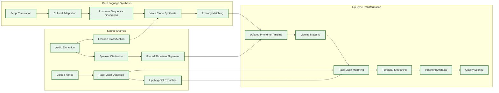

# 13.6 AI-Native Media & Entertainment Platform — Deep Dives & Bottlenecks

## Deep Dive 1: GPU Orchestration for Multi-Model Content Generation

### The Scheduling Challenge

The content generation platform serves workloads spanning four orders of magnitude in compute time and resource requirements:

| Workload | Duration | GPUs | Memory | Preemptible? |
|---|---|---|---|---|
| Thumbnail generation | 200 ms – 3 s | 1 | 16 GB | No (too short to checkpoint) |
| Audio synthesis | 2 – 10 s | 1 | 24 GB | No |
| Short video clip (≤15s) | 15 – 45 s | 4 | 64 GB | At 10s checkpoints |
| Long video (15–60s) | 1 – 5 min | 8 | 160 GB | At 10s checkpoints |
| Feature film dubbing (lip-sync) | 2 – 8 hours | 16–32 | 320 GB | At scene boundaries |
| Batch campaign (10K images) | 30 – 90 min | 50–200 | Mixed | Yes |

A single scheduling policy cannot optimize for all workloads. The production system uses a **multi-tier scheduling architecture**:

**Tier 1 — Interactive Queue (SLO: response in seconds)**
- Thumbnails and short audio go through a fast-path scheduler that maintains a warm pool of loaded models. Models stay resident in GPU memory between requests (no load/unload overhead). The scheduler routes requests to the GPU with the correct model already loaded, treating it like a GPU-aware load balancer.

**Tier 2 — Realtime Queue (SLO: completion within minutes)**
- Video generation and dubbing jobs go through a capacity-aware scheduler that performs bin-packing: fitting multiple jobs onto a GPU cluster while respecting memory constraints and anti-affinity rules (two video generation jobs on the same GPU fight for memory bandwidth).

**Tier 3 — Batch Queue (SLO: completion within hours)**
- Campaign generation and bulk dubbing run on cost-optimized capacity (spot instances, off-peak reserved). These jobs checkpoint frequently (every 10 seconds for video, every scene boundary for dubbing) so they can be preempted by Tier 1/2 work and resumed later.

### The Model Loading Slowest part of the process

Loading a video generation model from object storage into GPU memory takes 30–90 seconds (10–50 GB model weights). For interactive workloads, this is unacceptable—the total generation time would be dominated by model loading.

**Solution: Model-affinity scheduling with warm pools.**

The scheduler maintains a registry of which models are loaded on which GPUs. When an interactive generation request arrives:
1. Check if the requested model is already loaded on any GPU with available capacity → route to that GPU (0 ms load time)
2. If not, check if any GPU has the model in its local cache (on-disk, not in GPU memory) → load from local cache (5–10s)
3. If not, load from object storage (30–90s) but only for batch jobs; interactive jobs are rejected with a "model cold" error that triggers pre-warming

The pre-warming daemon monitors generation request patterns and speculatively loads popular models onto idle GPUs. During business hours (when interactive requests peak), the top 5 models are kept warm across 80% of the interactive GPU pool. During off-peak hours, warm pools shrink and batch work reclaims the capacity.

### Slowest part of the process: GPU Memory Fragmentation

After hours of mixed workloads, GPU memory becomes fragmented: a GPU with 80 GB total memory might have 30 GB free but in non-contiguous blocks, unable to serve a job requiring 24 GB contiguous allocation. Unlike CPU memory, GPU memory typically lacks virtual memory paging.

**Mitigation:**
- **Periodic compaction**: During low-load periods (typically 2–4 AM), the scheduler quiesces one GPU at a time, checkpoints all running jobs, clears GPU memory, and restarts jobs with defragmented allocation
- **Memory pool pre-allocation**: Each model type pre-allocates fixed-size memory pools (model weights pool, intermediate activations pool, output buffer pool) to reduce fragmentation from variable-size allocations
- **Right-sizing**: The scheduler tracks actual peak memory usage per model version and adjusts allocation sizes based on observed (not theoretical) requirements, reclaiming over-provisioned memory

---

## Deep Dive 2: Lip-Sync Dubbing Pipeline

### The Perception Challenge

Human audio-visual speech perception relies on the McGurk effect—the brain fuses what it hears with what it sees. When the fusion fails, the result ranges from "something feels off" (mild mismatch) to uncanny valley revulsion (severe mismatch). The tolerance varies by phoneme type:

| Phoneme Category | Examples | Visual Salience | Sync Tolerance |
|---|---|---|---|
| Bilabial | /p/, /b/, /m/ | Very high (lips close) | ±20 ms |
| Labiodental | /f/, /v/ | High (teeth on lip) | ±30 ms |
| Open vowels | /a/, /o/ | Medium (jaw opening) | ±60 ms |
| Closed consonants | /k/, /g/, /t/ | Low (internal articulation) | ±80 ms |
| Nasal continuants | /n/, /ŋ/ | Very low | ±100 ms |

The dubbing pipeline must achieve phoneme-class-specific alignment, not just global audio-visual sync.

### Pipeline Architecture



### The Cross-Language Timing Problem

Different languages have fundamentally different speaking rates and syllable structures:

| Language | Avg Syllable Rate | Avg Information Rate | Timing Challenge |
|---|---|---|---|
| Japanese | 7.84 syl/s | ~0.49 bits/syl | Fast syllable rate, low information density → needs more time for same meaning |
| Spanish | 7.82 syl/s | ~0.63 bits/syl | Similar speed to Japanese, more information per syllable |
| English | 6.19 syl/s | ~1.08 bits/syl | Slower but higher information density |
| Mandarin | 5.18 syl/s | ~0.94 bits/syl | Tonal language adds pitch dimension |
| German | 5.97 syl/s | ~0.90 bits/syl | Compound words create long phoneme sequences |

A 5-second English dialogue might require 6.5 seconds in Japanese (more syllables for the same meaning) or 4.2 seconds in Mandarin (fewer, more information-dense syllables). The lip-sync pipeline must handle three scenarios:

1. **Dubbed audio shorter than source**: Pad with natural pauses, extend hold positions on neutral mouth shapes
2. **Dubbed audio longer than source**: Compress pauses, increase speaking rate (up to 1.3× before naturalness degrades), or extend the visual segment (acceptable for cuts but not for continuous shots)
3. **Audio matches but phoneme alignment differs**: This is the common case—the mouth must make different shapes at different times while the overall duration is similar

### Slowest part of the process: Multi-Speaker Scenes

When multiple speakers appear simultaneously (conversation scenes, group discussions), the pipeline must:
- Track each speaker's face independently across frames (face tracking with ID persistence)
- Handle occlusions (Speaker A's face partially blocked by Speaker B's head)
- Apply lip-sync transformations to each speaker with different dubbed audio timelines
- Maintain consistent skin tone and lighting across modified and unmodified face regions

The compute cost scales linearly with the number of visible speakers per frame. A 2-speaker dialogue costs 2× the lip-sync compute; an 8-person meeting scene costs 8×. The scheduler must estimate per-scene speaker count from the source video to accurately predict job duration.

### Quality Assurance Pipeline

Every dubbed language track passes through automated QA before human review:
1. **Sync score**: Measure audio-visual alignment at bilabial phonemes (must score ≥ 0.85)
2. **Voice similarity**: Compare synthesized voice to original speaker's voice embedding (cosine similarity ≥ 0.92)
3. **Emotion match**: Classify emotion in synthesized speech and compare to source (accuracy ≥ 85%)
4. **Artifact detection**: Scan for visual artifacts at face mesh boundaries (seam detection, color discontinuity)
5. **Naturalness MOS**: Automated MOS prediction model (must score ≥ 3.8 / 5.0)

Tracks that fail any threshold are re-synthesized with adjusted parameters (slower speaking rate, different prosody emphasis) before escalation to human review.

---

## Deep Dive 3: Real-Time Ad Decision Engine

### The Latency Budget

Ad decisions must complete within 200 ms to avoid viewer-perceptible playback interruption. The budget breaks down as:

```
Total budget: 200 ms
├─ Viewer feature lookup:           10 ms (in-memory feature store)
├─ Content context analysis:        15 ms (pre-computed, cached)
├─ Bid request fan-out:             80 ms (parallel to 5 demand partners, 100 ms timeout)
├─ Bid evaluation + safety:         20 ms
├─ Creative variant selection:      15 ms
├─ Pod construction optimization:   20 ms
├─ SSAI manifest generation:        25 ms
└─ Network overhead:                15 ms
    Total:                         200 ms
```

### The Yield vs. Retention Trade-off

Maximizing ad revenue (yield) per session conflicts with viewer retention:

| Ad Load | Avg CPM | Ads/Hour | Revenue/Hour | Session Length | Total Revenue |
|---|---|---|---|---|---|
| Light (2 breaks × 2 ads) | $12 | 4 | $0.048 | 3.2 hours | $0.154 |
| Medium (3 breaks × 3 ads) | $10 | 9 | $0.090 | 2.5 hours | $0.225 |
| Heavy (4 breaks × 4 ads) | $8 | 16 | $0.128 | 1.5 hours | $0.192 |

The medium load maximizes total revenue despite lower per-hour yield, because viewers watch longer. The ad decision engine must optimize over the full session, not individual ad breaks. This requires:

1. **Session-level ad load planning**: At session start, compute the optimal total ad load for this viewer based on their historical tolerance (some viewers tolerate higher ad loads, others abandon quickly)
2. **Dynamic budget allocation**: Distribute the session's ad budget across breaks, front-loading higher-CPM opportunities while reserving capacity for later breaks if the viewer stays
3. **Real-time adaptation**: If mid-session engagement drops (viewer starts skipping content), reduce ad load in subsequent breaks to extend the session

### Slowest part of the process: Demand Partner Latency

The ad decision fans out bid requests to 5 demand partners in parallel with a 100 ms hard timeout. In practice:
- Partners respond in 30–70 ms under normal load
- During peak hours (prime time), partner latency increases to 80–120 ms
- A single slow partner blocks the decision if waited for sequentially

**Mitigation: Speculative bidding with timeout escalation.**
- Send bid requests to all 5 partners simultaneously
- Set a 60 ms "early close" threshold: if 3+ partners respond by 60 ms, proceed with those bids (the remaining 2 partners' late responses are discarded)
- Only wait the full 100 ms if fewer than 3 partners respond by 60 ms
- Track per-partner latency percentiles and pre-emptively exclude partners whose p95 exceeds 90 ms during peak hours

### AI-Generated Creative Variants

Traditional ad serving selects from a fixed set of pre-produced creatives. The AI-native platform generates creative variants per viewer segment:
- **Dynamic text overlay**: Modify ad copy based on viewer locale, interests, and content context
- **Background adaptation**: Generate background scenes that match the content's visual style (a sports ad during sports content uses a stadium background)
- **Personalized product shots**: Generate product images in context relevant to the viewer (a car ad shows the car in the viewer's likely environment based on locale)

Creative variants are generated in batch (weekly refresh) and cached, not generated in real-time. The ad decision engine selects from pre-generated variants, keeping the selection within the 15 ms budget.

---

## Deep Dive 4: Personalization and Behavioral Feature Store

### Feature Store Architecture

The feature store serves two timescales:

**Real-time features (30-second freshness):**
- Updated on every viewer interaction event
- Stored in-memory across a sharded cluster
- Write path: Event → Stream processor → Feature computation → In-memory update + WAL
- Read path: Personalization API → Feature store shard (by viewer_id hash) → Feature vector response

**Batch features (daily freshness):**
- Computed daily from full behavioral history
- Stored in columnar store, cached in-memory for active viewers
- Include: lifetime value, churn probability, genre diversity, social influence

### The Cold-Start Problem

New viewers have no behavioral history—the feature store returns zero vectors. The personalization engine handles cold start through a cascade:

1. **Session-level signals (available after 30 seconds)**: First content clicked, time spent on landing page, device type, time of day → lightweight model predicts initial preferences
2. **Demographic priors (available at registration)**: Age bucket, locale, language preference → population-level genre affinities as starting features
3. **Exploration boost**: New viewers receive higher exploration rate in thumbnail bandits (30% explore vs. 10% for established viewers) to rapidly learn preferences
4. **Transfer learning**: If viewer authenticates across devices, merge behavioral histories instantly

### Slowest part of the process: Feature Store Hot Partitions

Popular content releases cause millions of viewers to interact with the same content simultaneously. If viewer features are partitioned by viewer_id (uniform distribution), the write load is uniform. But if any feature computation requires content-level aggregation (e.g., "what % of similar viewers liked this content"), the content becomes a hot partition.

**Mitigation:**
- Content-level features are pre-computed in batch and served from a separate cache (not computed on the viewer feature store's hot path)
- Real-time content popularity is approximated using a probabilistic counter (HyperLogLog for unique viewer count, Count-Min Sketch for interaction counts) that distributes writes across multiple counter shards
- The personalization model is designed to use per-viewer features (no content-level features on the hot path); content features are injected during batch model retraining only

### Multi-Armed Bandit for Thumbnail Selection

Each title has 8–12 thumbnail variants. The platform runs a contextual bandit to select the best variant per viewer. The bandit must balance:
- **Exploitation**: Show the variant with the highest predicted click-through rate for this viewer
- **Exploration**: Show under-tested variants to gather data and improve predictions

The production system uses Thompson Sampling with contextual features:
- Each variant maintains a Beta distribution posterior (alpha = clicks, beta = impressions − clicks)
- Viewer features (genre affinity, visual preference embedding) modulate the posterior via a learned context weight
- On each impression, sample from each variant's posterior and select the highest sample

**Key design choice:** The bandit resets its posteriors every 7 days to adapt to temporal shifts (a thumbnail that worked last month may not work this month as viewer fatigue sets in). Historical data is down-weighted with exponential decay (half-life = 3 days) rather than hard-cutoff reset.

---

## Deep Dive 5: AI Music Generation and Content Synchronization

### Music Generation Models

The platform generates background scores, transition music, and full soundtracks using diffusion-based audio models. Unlike text-to-image diffusion (which operates on 2D pixel grids), audio diffusion operates on mel-spectrogram representations—2D time-frequency matrices where the horizontal axis is time (~86 frames/sec at 22050 Hz sample rate) and the vertical axis is 128 mel-frequency bins.

**Generation architecture:**

| Component | Function | Latency | Output |
|---|---|---|---|
| Text encoder | Convert music prompt ("epic orchestral, rising tension, 120 BPM") to conditioning vector | 5 ms | 768-dim embedding |
| Diffusion backbone | Iterative denoising of mel-spectrogram (50 steps, classifier-free guidance scale 3.0) | 4–12 s for 30s clip | 128 × 2,580 mel-spectrogram |
| Vocoder (HiFi-GAN) | Convert mel-spectrogram to waveform | 200 ms | 44.1 kHz audio waveform |
| Post-processor | Loudness normalization (LUFS targeting), stereo panning, format encoding | 50 ms | Final audio file |

**Conditioning mechanisms for controllable generation:**

- **Tempo conditioning**: BPM is encoded as a sinusoidal positional embedding injected at each diffusion step, ensuring beat regularity matches the target (±2 BPM tolerance)
- **Instrument conditioning**: Multi-hot instrument vector (piano, strings, drums, etc.) modulates the cross-attention layers, enabling instrument addition/removal without retraining
- **Energy curve conditioning**: A per-second energy envelope (0.0–1.0) controls the intensity trajectory—essential for matching music energy to scene emotion arcs
- **Style reference conditioning**: A reference audio clip is encoded via a pre-trained audio encoder (CLAP) into a style embedding that steers generation toward a similar timbre and arrangement without copying melody

### Temporal Emotion Extraction from Video

To generate music that matches video content, the pipeline first extracts a per-second emotion trajectory from the source video:

```
FUNCTION extract_emotion_trajectory(video_frames, audio_track):
    // Visual emotion analysis
    FOR each 1-second segment:
        visual_features = extract_scene_features(frames)
        // Scene type: action, dialogue, landscape, chase, romantic
        scene_type = classify_scene(visual_features)
        // Color temperature: warm (positive valence) vs cool (tension)
        color_temp = compute_color_temperature(frames)
        // Motion energy: optical flow magnitude (high = energetic)
        motion_energy = compute_optical_flow_magnitude(frames)
        // Face emotion: if faces present, aggregate facial expressions
        face_emotions = detect_face_emotions(frames)

    // Audio emotion analysis (from original soundtrack or dialogue)
    FOR each 1-second segment:
        speech_emotion = classify_speech_emotion(audio_segment)
        audio_energy = compute_rms_energy(audio_segment)

    // Fuse into emotion trajectory
    emotion_vector = fuse_multimodal_emotions(
        scene_types, color_temps, motion_energies,
        face_emotions, speech_emotions, audio_energies
    )
    // Output: per-second [valence, arousal, tension, surprise] trajectory
    RETURN smooth_trajectory(emotion_vector, window=3s)
```

The emotion trajectory is then converted into music generation conditioning signals:
- **Valence** (positive/negative) maps to major/minor key preference
- **Arousal** (high/low) maps to tempo range and instrument density
- **Tension** maps to dissonance level and harmonic complexity
- **Surprise** maps to sudden dynamic changes and rhythmic variation

### Beat-to-Scene-Transition Alignment

Music that changes beat exactly when the scene cuts creates a professional, cinematic feel. The alignment pipeline:

1. **Scene boundary detection**: Identify all scene transitions (hard cuts, dissolves, wipes) from the video timeline with frame-level precision
2. **Beat grid generation**: Given the target BPM, generate a beat grid (timestamps of every beat and downbeat)
3. **Alignment optimization**: Solve a constrained optimization that shifts the beat grid start time (and optionally adjusts BPM within ±5%) to maximize the number of scene transitions that land within ±50 ms of a beat or downbeat
4. **Priority weighting**: Major scene transitions (act breaks, location changes) are weighted 3× higher than minor cuts; the optimizer preferentially aligns major transitions
5. **Micro-timing adjustment**: After global alignment, individual musical phrases can be stretched/compressed by ±3% using time-stretch algorithms (phase vocoder) to fine-tune alignment at critical transition points

**Quality metric:** "Beat alignment score"—the percentage of scene transitions within 100 ms of a beat. Professional film scores achieve 60–70%; the target for AI-generated scores is ≥55%.

### Copyright Risk Scoring

AI-generated music may inadvertently reproduce copyrighted melodies. The platform implements a multi-layer copyright risk assessment:

| Layer | What It Detects | Method | Threshold |
|---|---|---|---|
| Melody fingerprint | Note sequence similarity to known songs | Dynamic time warping on pitch contours extracted from audio | DTW distance < 0.15 → flag |
| Harmonic progression | Chord sequence similarity | Chord recognition → n-gram matching against copyrighted progression database | 8+ chord exact match → flag |
| Spectral similarity | Timbral/arrangement similarity (style copying) | Cosine similarity of CLAP embeddings between generated and reference tracks | Similarity > 0.92 → flag |
| Rhythm pattern | Beat pattern copying | Onset detection → rhythm pattern hash comparison | Exact rhythm hash match over 8+ bars → flag |

**Critical distinction—style vs. substance:** Copyright law protects specific melodic and lyric expressions, not general styles, genres, or moods. The system differentiates:
- **Melody copying** (high risk): Matching note sequences of 8+ notes → automatic hold for human review
- **Style similarity** (low risk): Similar instrumentation, tempo, genre feel → logged but not blocked
- **Arrangement reference** (medium risk): Similar structural elements (intro length, chorus placement, bridge style) → flagged if combined with melodic similarity

Tracks that exceed any "flag" threshold enter a quarantine state and are reviewed by a music rights specialist before release. The false positive rate is tuned to ~5% (1 in 20 flagged tracks actually has a genuine similarity concern), accepting the review overhead to minimize copyright exposure.

---

## Deep Dive 6: Diffusion Transformer (DiT) Inference Optimization

### Architecture Overview

The platform's video generation model uses a Diffusion Transformer (DiT) architecture—replacing the traditional UNet backbone with a transformer that processes noisy latent patches through multi-head self-attention. DiT offers superior quality for video generation because self-attention captures long-range temporal dependencies (frame 1 influences frame 300) that UNet's convolutional receptive field cannot reach without extreme depth.

**DiT vs. UNet comparison for video generation:**

| Dimension | UNet Diffusion | DiT Diffusion |
|---|---|---|
| Core operation | Convolution (local receptive field) | Self-attention (global receptive field) |
| Temporal modeling | 3D convolutions or temporal attention layers inserted between spatial layers | Native spatiotemporal attention across all patch tokens |
| Memory scaling | O(H × W × T) — linear in spatial and temporal dimensions | O((H × W × T / p²)²) — quadratic in token count (patches) |
| GPU utilization | High for small resolutions; memory-bound for 4K | Compute-bound (attention FLOPs dominate); better GPU utilization at scale |
| Quality at 60s video | Temporal coherence degrades beyond ~10s | Maintains coherence across full 60s via global attention |
| Parallelism | Channel parallelism straightforward | Attention head parallelism + sequence parallelism |

### KV-Cache Memory Scaling

During autoregressive or iterative refinement of video frames, the DiT accumulates key-value (KV) caches for the attention mechanism. The KV-cache memory grows with sequence length and model dimension:

```
KV-cache memory per layer = 2 × sequence_length × head_dim × num_heads × bytes_per_element

For a typical DiT-XL configuration:
  - Layers: 28
  - Attention heads: 16
  - Head dimension: 72
  - Bytes per element: 2 (FP16)

Video at 1080p, 24fps, 30 seconds:
  - Spatial patches: (1080/16) × (1920/16) = 67 × 120 = 8,040 patches per frame
  - Temporal frames: 720 frames (24 fps × 30s)
  - Total tokens: 8,040 × 720 = 5,788,800 tokens

KV-cache per layer = 2 × 5,788,800 × 72 × 16 × 2 bytes = 38.1 GB per layer
Total KV-cache (28 layers) = 1,067 GB → exceeds single-GPU memory
```

This makes naive full-attention DiT infeasible for long videos. The platform uses several strategies:

**Strategy 1 — Sliding window attention with anchor frames:**
- Full attention over a sliding window of 4 seconds (96 frames, ~770K tokens)
- "Anchor frames" (every 2 seconds) are always included in the attention context regardless of window position
- Anchor frames provide long-range coherence; the sliding window provides local detail
- KV-cache reduces to: window tokens + anchor tokens ≈ 850K tokens → 157 GB total → fits on 4× 80 GB GPUs with model parallelism

**Strategy 2 — KV-cache quantization:**
- Quantize cached keys and values from FP16 to INT8 after the first 5 diffusion steps (when the signal-to-noise ratio is high enough that quantization error is masked by remaining noise)
- Reduces KV-cache memory by 50% with <0.5% quality degradation (measured by FVD score)
- Combined with sliding window: 157 GB × 0.5 = 78.5 GB → fits on 2× 80 GB GPUs

**Strategy 3 — Grouped-query attention (GQA):**
- Share KV heads across multiple query heads (4 KV heads shared by 16 query heads)
- Reduces KV-cache by 4× at the cost of ~2% quality loss
- Applied selectively: lower DiT layers use full multi-head attention (where spatial detail matters), upper layers use GQA (where semantic-level features tolerate sharing)

### Tensor Parallelism for DiT Attention Heads

DiT attention is parallelized across GPUs by partitioning attention heads:

```
Tensor parallelism layout (4 GPUs):
  GPU 0: Attention heads 0–3   + FFN columns 0–25%
  GPU 1: Attention heads 4–7   + FFN columns 25–50%
  GPU 2: Attention heads 8–11  + FFN columns 50–75%
  GPU 3: Attention heads 12–15 + FFN columns 75–100%

Communication per layer:
  - All-reduce after attention output projection: 2 × seq_len × model_dim × 2 bytes
  - All-reduce after FFN: same
  - Total: 4 all-reduces per transformer layer × 28 layers = 112 all-reduces per diffusion step
  - With NVLink (600 GB/s bidirectional): ~0.5 ms per all-reduce for 850K-token sequence
  - Total communication overhead: 112 × 0.5 ms = 56 ms per diffusion step
  - At 50 diffusion steps: 2.8 seconds of communication overhead
```

**Optimization — overlapping communication with computation:** The all-reduce for layer N's attention output can overlap with layer N's FFN computation, hiding ~50% of communication latency. This reduces effective communication overhead to ~1.4 seconds for a 30-second video generation.

### Variable-Resolution Generation

Different content types require different resolutions (480p previews, 1080p standard, 4K premium). Rather than maintaining separate models per resolution, the DiT uses variable-resolution patch embedding:

- The patchification layer adapts its stride based on target resolution: stride 8 for 480p (fewer tokens, faster), stride 16 for 1080p (standard), stride 32 for 4K (same token count as 1080p at stride 16, preserving memory budget)
- The model is trained on mixed resolutions, learning resolution-agnostic features in the transformer layers
- Resolution-specific positional embeddings (sinusoidal, interpolated) encode the spatial scale

**GPU utilization comparison by resolution:**

| Resolution | Patch Stride | Tokens/Frame | GPU Compute Utilization | GPU Memory Utilization |
|---|---|---|---|---|
| 480p (preview) | 8 | 1,800 | 35% (compute-underutilized) | 20% |
| 1080p (standard) | 16 | 8,040 | 78% (near optimal) | 65% |
| 4K (premium) | 16 | 32,400 | 95% (compute-saturated) | 92% |
| 4K (optimized) | 32 | 8,100 | 80% (balanced) | 60% |

The stride-32 4K mode trades some fine-grained spatial detail for 4× memory reduction, making 4K generation feasible on the same GPU allocation as 1080p. A post-generation super-resolution pass (lightweight convolutional upscaler, 200 ms) recovers high-frequency spatial detail.

---

## Race Conditions

### RC-1: Concurrent Manifest Updates During Parallel Dubbing

**Scenario:** The dubbing pipeline processes 40 languages in parallel. Each language track, upon completion, appends its dubbing record to the content's C2PA provenance manifest. When two language tracks complete within milliseconds of each other, both read the current manifest version, append their record, and write back—one overwrites the other's update.

**Impact:** Lost provenance records. A dubbed language track exists without a corresponding manifest entry, breaking the cryptographic chain of trust. Downstream verification rejects the track as unprovenanced.

**Mitigation:** The manifest store uses optimistic concurrency control with version vectors. Each language track reads the manifest with its current version tag, appends its record, and issues a conditional write (write-if-version-matches). On conflict, the losing writer re-reads the updated manifest, merges its record, and retries. The merge is always safe because dubbing records for different languages are independent (no semantic conflict—just append ordering). Maximum retry depth is 3; beyond that, records are queued for sequential application.

### RC-2: Feature Store Write-Write Conflict During Burst Events

**Scenario:** A major content premiere drives 5M viewers to interact with the same content within 60 seconds. Each viewer interaction triggers a feature store update for that viewer's profile. However, the real-time feature computation also updates a shared "content trending score" counter. Multiple stream processor instances compute and write this counter concurrently.

**Impact:** Counter value is incorrect (lost updates), causing the personalization model to under- or over-weight the content's trending signal. For a premiere event, under-counting suppresses the content from recommendations precisely when it should be promoted.

**Mitigation:** The trending score counter uses a CRDT (conflict-free replicated data type)—specifically a PN-counter where each stream processor instance maintains its own increment sub-counter. The merged counter value is the sum of all sub-counters, which converges regardless of write ordering. The sub-counters are merged lazily (every 5 seconds) rather than on every write, bounding the merge overhead.

### RC-3: Ad Decision with Stale Frequency Cap

**Scenario:** A viewer watches content on two devices simultaneously (TV and tablet). Both devices hit an ad break at the same time. Both ad decision engines query the frequency cap store, both see "0 impressions for Campaign X today," and both serve Campaign X—violating the advertiser's "1 impression per viewer per hour" frequency cap.

**Impact:** Advertiser is charged for an impression that violated their frequency constraint. If detected in reconciliation, the platform must issue a refund and absorb the revenue loss. At scale, systematic frequency cap violations erode advertiser trust.

**Mitigation:** The frequency cap store uses a "claim-then-serve" protocol: the ad decision engine increments the frequency counter before serving the ad (optimistic reservation). If two concurrent decisions both try to increment, the counter store (which uses atomic increment) ensures one sees the pre-increment value and one sees the post-increment value. The second decision detects the cap violation and selects an alternative ad. The window for the race is reduced to the network round-trip time (~2 ms) rather than the full ad decision duration (~200 ms).

### RC-4: Safety Classifier Version Skew During Rollout

**Scenario:** A new safety classifier version (v2.3) is rolled out via canary deployment. During the rollout, some generation nodes run v2.2 and others run v2.3. A piece of content is generated on a v2.2 node (passes safety check) and later re-scanned by a v2.3 node (which has a stricter threshold and flags it). The content is already published and served to viewers.

**Impact:** Content that passed safety checks under the old model is retroactively flagged, creating an inconsistent state: published content with a safety violation flag. If automated unpublishing triggers, viewers see content disappear mid-session.

**Mitigation:** Safety classifier rollouts use a "shadow scoring" phase before enforcement. For 48 hours after deployment, v2.3 runs in parallel with v2.2 but its scores are logged, not enforced. The safety team reviews the delta (content that v2.3 flags but v2.2 passed) and adjusts thresholds before switching enforcement to v2.3. During the shadow phase, all generation nodes continue using v2.2 for actual decisions, eliminating the version skew window.

---

## Failure Mode Analysis

### FM-1: Music Generation Copyright Match Triggering Content Hold

**Trigger:** The copyright risk scoring system (Deep Dive 5) detects a melody fingerprint match with DTW distance < 0.15 against a known copyrighted song.

**Blast radius:** The generated music track is placed in quarantine. Any content that embeds this music track (potentially dozens of videos awaiting background score) is also placed on hold, blocking their publication pipeline. If the hold occurs after partial publication (music added to some but not all regional variants), the content is in an inconsistent state across regions.

**Detection:** The content pipeline monitors quarantine events and triggers an alert when quarantine count exceeds 10 tracks/hour (indicating either a model regression producing more similar outputs, or a database expansion that increases false positives).

**Recovery sequence:**
1. Music rights specialist reviews the flagged track within 4-hour SLA
2. If false positive: specialist marks as cleared, quarantine is lifted, dependent content pipelines resume automatically
3. If genuine match: track is permanently rejected; dependent content items are re-queued for music regeneration with modified conditioning parameters (different key, different BPM, explicit "avoid melody X" negative conditioning)
4. If systemic (>10 tracks flagged from same model checkpoint): trigger model rollback to previous checkpoint and alert the ML team

### FM-2: DiT KV-Cache OOM During Long Video Generation

**Trigger:** A video generation job for a 60-second 4K video exhausts GPU memory during the KV-cache accumulation phase, despite the sliding window attention strategy. This occurs when the actual token count exceeds the estimated count (due to scene complexity requiring finer patches) or when GPU memory is partially consumed by a co-located model that was not fully unloaded.

**Blast radius:** The generation job crashes. The GPU enters an error state (CUDA OOM), requiring a device reset that takes 5–15 seconds. Any other jobs sharing the GPU node (if multi-tenant) are also killed. The user's generation request times out.

**Detection:** GPU memory utilization monitoring triggers a "soft OOM" alert at 90% memory usage. The generation runtime tracks KV-cache growth rate per diffusion step and projects whether memory will be exhausted before completion.

**Recovery sequence:**
1. On soft OOM alert: checkpoint current diffusion state (intermediate noisy latents + diffusion step number)
2. Reduce KV-cache memory: activate INT8 quantization if not already active, reduce sliding window size from 4s to 2s, enable GQA on all layers
3. Resume generation from checkpoint with reduced memory footprint
4. If hard OOM occurs before checkpoint: job is rescheduled on a GPU node with higher memory (160 GB) or distributed across more GPUs via increased tensor parallelism
5. Report degraded quality estimate to the user ("generated at reduced quality due to resource constraints; regenerate for full quality")

### FM-3: Voice Embedding Corruption Propagating Through 40 Language Tracks

**Trigger:** A performer's voice embedding (used for voice cloning across all dubbed languages) is corrupted during storage or retrieval—a bit flip in the embedding vector, a truncation during network transfer, or a version mismatch where an old embedding is served instead of the current one.

**Blast radius:** All 40 language tracks dubbed using the corrupted embedding will have an incorrect voice quality. The voice may sound subtly wrong (if the corruption is minor—a few flipped bits in a 512-dimensional float32 vector) or completely unintelligible (if truncation occurred). Since the dubbing pipeline processes languages in parallel, all 40 tracks complete before any single track's QA results are available—meaning the full dubbing investment (~2–8 hours of GPU compute per language × 40 languages) may be wasted.

**Detection:** The QA pipeline's voice similarity check (cosine similarity ≥ 0.92 against the reference embedding) catches corruption that changes the voice character. However, subtle corruption (few bits) may produce cosine similarity of 0.90—below threshold but close enough that the QA system might attribute it to synthesis variance rather than embedding corruption.

**Recovery sequence:**
1. Voice embedding integrity is verified via checksum before dubbing starts (prevents storage corruption)
2. The embedding is re-fetched and re-verified at the start of each language track's synthesis (prevents stale cache)
3. If QA detects voice similarity < 0.92 on the first 2+ language tracks: halt remaining tracks (don't waste compute on remaining 38 languages)
4. Re-fetch embedding from authoritative store, verify checksum, re-run corrupted tracks
5. If embedding is confirmed corrupt in authoritative store: alert performer rights team, fall back to the last known good embedding version, re-dub all affected tracks

### FM-4: C2PA Signing Key Rotation During Active Dubbing Pipeline

**Trigger:** The platform's C2PA signing key is rotated (scheduled quarterly, or emergency rotation after a suspected compromise). A dubbing pipeline job that started before the rotation completes after the rotation. The early language tracks were signed with the old key; later tracks are signed with the new key. The content's provenance manifest contains signatures from two different keys.

**Blast radius:** Provenance verification may fail if the verifier does not recognize the old key (post-rotation, the old key's certificate may be revoked in emergency rotation scenarios). Even in scheduled rotation, the mixed-key manifest creates a verification complexity that some downstream consumers (social media platforms performing C2PA checks) may not handle gracefully.

**Detection:** The manifest assembly step (which combines all language tracks' provenance records into a single content manifest) detects mixed signing key IDs and raises a warning.

**Recovery sequence:**
1. For scheduled rotation: the old key remains valid (not revoked) for 30 days after rotation. Mixed-key manifests are valid but flagged for re-signing. A background job re-signs old-key claims with the new key during the 30-day grace period.
2. For emergency rotation (key compromise): old-key signatures are suspect. All tracks signed with the compromised key must be re-signed with the new key. The dubbing pipeline re-signs (but does not re-generate) affected tracks—a fast operation (~100 ms per track) since only the cryptographic signature changes, not the content.
3. The manifest is rebuilt with uniform key ID and re-published.
4. Any content already distributed with the compromised key's signature triggers a "provenance update" push to CDN edges, replacing cached manifests with re-signed versions.

---

## Critical Slowest part of the process Summary

| Slowest part of the process | Impact | Mitigation |
|---|---|---|
| GPU model loading latency (30–90s) | Interactive generation blocked | Model-affinity scheduling + warm pools + speculative pre-warming |
| GPU memory fragmentation | Jobs fail despite sufficient total memory | Periodic compaction + fixed-size memory pools + right-sizing |
| Cross-language timing mismatch | Dubbed audio doesn't fit source video timing | Speaking rate adjustment + pause compression + segment extension for cuts |
| Multi-speaker lip-sync compute | Linear cost scaling with speaker count | Per-scene speaker estimation + parallel per-speaker processing + quality-tiered processing (background speakers get lighter lip-sync) |
| Demand partner latency during peak | Ad decisions exceed 200ms budget | Speculative bidding with early close + partner pre-exclusion + latency hedging |
| Feature store hot partitions on content release | Feature reads spike, increasing latency | Pre-computed content features + probabilistic counters + content-level feature isolation |
| Provenance manifest chain growth | Manifest verification latency grows with chain length | Manifest compaction (merge transformation records) + edge caching + parallel signature verification |
| Safety classifier false negatives on novel content | Policy-violating content reaches production | Multi-model ensemble + adversarial testing + human-in-the-loop for high-visibility |
| Music generation copyright similarity | Content held from publication pending review; dependent videos blocked | Multi-layer fingerprinting with fast human review SLA + negative conditioning for regeneration |
| DiT KV-cache memory explosion for long video | OOM crashes, GPU reset, co-located job eviction | Sliding window attention + KV quantization + GQA + soft OOM checkpoint-and-reduce |
| Voice embedding corruption propagation | Up to 40 language tracks dubbed with wrong voice, wasting GPU-hours | Checksum verification before dubbing + early-halt on first QA failure + embedding versioning |
| Beat-to-scene alignment computational cost | Music regeneration when alignment score < 55% threshold | Pre-computed scene boundary index + BPM search space Cutting off unnecessary steps + alignment caching per video
