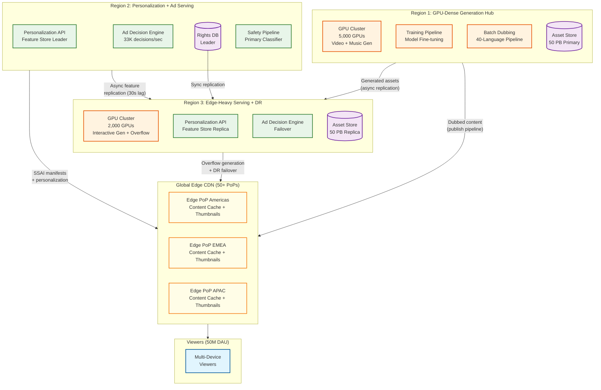

# 13.6 AI-Native Media & Entertainment Platform — Scalability & Reliability

## Scalability Architecture

### GPU Cluster Scaling

The platform operates a globally distributed GPU cluster across 3–4 GPU-dense regions, with each region hosting 2,500–3,000 GPUs across multiple accelerator generations.

**Horizontal scaling strategy:**

| Workload | Scaling Unit | Trigger | Scale-Up Time | Scale-Down Time |
|---|---|---|---|---|
| Interactive generation | GPU pod (8 GPUs + shared memory) | Queue depth > 50 for > 30s | 2–5 min (warm pool expansion) | 15 min (cool-down, model unload) |
| Batch generation | Spot instance fleet | Batch queue > 10,000 jobs | 5–10 min (spot market acquisition) | Immediate (spot preemption acceptable) |
| Dubbing pipeline | Language-parallel GPU allocation | Dubbing job submission | Pre-allocated per job | On job completion |
| Safety classification | Inference GPU pool | Classification queue latency > 500ms | 1–2 min (model already cached) | 10 min |
| Ad creative generation | Batch cycle (weekly) | Campaign submission deadline | Pre-scheduled scaling | After generation cycle |

**Vertical scaling limitations:**
- Individual GPU memory caps generation resolution and duration (80 GB GPU supports ~30s 1080p video; 160 GB supports ~60s 4K)
- Multi-GPU generation requires model parallelism, which introduces communication overhead that reduces throughput by 15–30% per additional GPU
- Cost-performance sweet spot: 4 GPUs for standard video, 8 GPUs for premium 4K content; beyond 8 GPUs the communication overhead exceeds the parallelism benefit

### Content Delivery Scaling

**Multi-region architecture with specialized roles:**

**Region role specialization rationale:**
- **Region 1 (GPU-dense):** Houses 70% of GPU capacity. All batch dubbing, model training, and long-form video generation runs here. Optimized for GPU cost (negotiated reserved capacity, direct liquid cooling, high-bandwidth GPU interconnect for tensor parallelism).
- **Region 2 (Personalization + Ad):** Houses the feature store leader, ad decision engine primary, and rights database leader. Optimized for low-latency stateful services. Minimal GPU footprint (only safety classification inference).
- **Region 3 (Edge-heavy + DR):** Houses 30% of GPU capacity for interactive generation (viewer-facing, latency-sensitive) and serves as disaster recovery for Region 1. Asset store replica ensures content availability if Region 1 fails.

**Edge CDN architecture for personalized content:**

**Personalization at CDN edge:**
- Thumbnail variant selection runs at the edge (pre-computed variant scores cached per viewer segment, not per individual viewer)
- Ad manifest generation runs at the mid-tier CDN (requires demand partner integration)
- Content segments are cached at the edge; SSAI manifests point edge-cached viewers to the right segments (content segment + ad segments interleaved)

**Peak traffic handling (live events, premieres):**
- Pre-warm edge caches 2 hours before scheduled premieres
- Personalization falls back to segment-level (rather than individual-level) during peak to reduce compute
- Ad decision batching: aggregate ad requests from the same content break across viewers and issue a single bid request per segment, then distribute winning bids across individual viewers

**Edge cache tiering strategy:**
- **L1 (edge hot cache, 50+ PoPs):** Top 1,000 titles by current concurrent viewers (~5% of catalog, ~60% of traffic). Cached in memory/NVMe for sub-millisecond response.
- **L2 (mid-tier warm cache, 15 PoPs):** Top 50,000 titles (~10% of catalog, ~25% of traffic). Cached on SSD.
- **L3 (origin cold storage):** Full catalog (500M+ assets). On cache miss at L1/L2, origin serves the asset and promotes it into L2 if request rate warrants.
- **Eviction policy:** L1 uses LRU with a popularity floor (titles with >100 concurrent viewers are pinned regardless of recency). L2 uses TTL-based eviction (24 hours) with promotion/demotion based on request rate.
- **Provenance manifests:** Cached at L1 alongside content with a 5-minute TTL. Manifest cache invalidation is pushed (not pulled) to ensure provenance updates propagate within 5 minutes of content re-signing.

### Feature Store Scaling

The behavioral feature store must serve 50M daily active viewers with 30-second feature freshness.

**Sharding strategy:**
- Viewer features partitioned by consistent hash on viewer_id across 256 shards
- Each shard fits in memory: 50M viewers / 256 shards × 1.6 KB per viewer = ~312 MB per shard
- Read replicas per shard (3× replication) for read-heavy personalization workload
- Write path goes through a single leader per shard; feature computation is idempotent so replayed events produce the same result

**Cross-region replication:**
- Feature store replicated to all serving regions with async replication (30-second lag acceptable)
- On viewer region failover, the viewer may see slightly stale personalization for ≤30 seconds before features catch up

### Ad Platform Scaling

**33,000 ad decisions/second at peak:**
- Ad decision engine is stateless—scales horizontally by adding decision nodes
- Each node handles ~1,000 decisions/sec (bound by bid request fan-out latency)
- Peak requires 33 decision nodes + 50% headroom = ~50 nodes
- Viewer feature lookup is served from local feature store replicas (co-located)
- Demand partner connections maintained via persistent connection pools (avoid TCP handshake per bid request)

**Impression tracking scaling:**
- 120M impressions/hour = 33,333 impressions/sec
- Impression events written to a partitioned stream (by ad campaign) for real-time revenue dashboards
- Deduplication: impression ID (hash of stream_id + break_position + ad_id) stored in a Bloom filter per 1-hour window to reject duplicate tracking pixels

**Ad creative variant scaling:**
- Weekly batch generation of AI creative variants: 10,000 campaigns × 5 viewer segments × 3 visual variants = 150,000 creative assets per cycle
- Creative variants stored in a CDN-backed creative cache, indexed by (campaign_id, segment_id, variant_id)
- At 50M DAU with 9 ads/session average, the creative selection service serves 450M variant lookups/day = ~5,200 lookups/sec at peak
- Lookups are pure cache hits (all variants pre-generated); cache miss triggers fallback to the campaign's default creative

---

## Back-Pressure Mechanisms

### Generation Queue Overflow

When generation request volume exceeds GPU cluster capacity, unbounded queuing leads to stale requests—a viewer who submitted a generation request 10 minutes ago has likely abandoned the session, so completing their job wastes GPU capacity.

**Multi-stage back-pressure:**

| Queue Depth | State | Action |
|---|---|---|
| 0–50 | Normal | Accept all requests; estimated wait time displayed to viewer |
| 50–200 | Elevated | Accept requests but disable speculative pre-generation (thumbnails, preview variants); notify viewers of extended wait |
| 200–500 | Saturated | Reject low-priority requests (draft previews, batch campaigns); interactive generation accepted with degraded quality (fewer diffusion steps: 30 instead of 50) |
| 500+ | Critical | Accept only premium-tier requests; all others receive "generation unavailable, retry later" with estimated recovery time |

**Request aging and eviction:** Requests older than 5× their estimated generation time are evicted from the queue (the viewer has almost certainly moved on). Evicted requests trigger a push notification to the viewer offering to regenerate when capacity is available.

**Admission control feedback loop:** The generation API gateway monitors queue depth every second and adjusts the admission rate using an exponential backoff—doubling the reject probability for each queue depth doubling beyond the threshold. This prevents queue depth oscillation (accepting a burst, rejecting everything, accepting another burst).

### Feature Store Write Amplification

During a major content premiere (5M concurrent viewers engaging with a single title), the feature store receives a burst of viewer interaction events. Each event triggers feature recomputation—updating the viewer's genre affinity vector, watch-time statistics, and session engagement score. If feature computation is expensive (requiring a rolling window aggregation over the last 100 events), the write amplification factor is high: 1 raw event → 5 feature updates → 5 writes to the feature store.

**Back-pressure strategy:**
- **Write coalescing:** Buffer feature updates for the same viewer within a 2-second window. If a viewer generates 10 events in 2 seconds (fast browsing), compute features once from all 10 events rather than 10 separate computations. Reduces write amplification from 5× to ~1.2× during burst periods.
- **Priority-based feature computation:** During burst periods, compute only "hot path" features (those used by the real-time recommendation model: genre affinity, session engagement) and defer "cold path" features (lifetime value, churn probability) to the next batch cycle.
- **Shard-level admission control:** Each feature store shard monitors its write throughput. When writes exceed 80% of shard capacity, the shard signals back-pressure to upstream stream processors, which buffer events in the durable stream (replay-safe).

### Ad Decision Partner Timeout Cascade

When a demand partner experiences degradation, their response latency increases from the normal 40–60 ms to 150–200 ms. If the ad decision engine waits for the slow partner, it exceeds the 200 ms total budget, degrading viewer experience. If all 5 partners degrade simultaneously (e.g., during a global ad exchange outage), every ad decision fails.

**Cascade prevention:**
- **Per-partner circuit breaker:** Each demand partner has an independent circuit breaker with a 5-second evaluation window. If >30% of requests to a partner timeout within the window, the circuit opens and that partner is excluded from bid requests for 30 seconds. Subsequent probes (1 request every 5 seconds) test recovery before closing the circuit.
- **Adaptive timeout:** Each partner's timeout is set dynamically based on their rolling p95 latency (measured over the last 60 seconds). A partner with p95 = 50 ms gets a timeout of 80 ms; a partner with p95 = 100 ms gets a timeout of 120 ms. This prevents slow partners from consuming budget that could be allocated to fast partners.
- **Guaranteed fallback pod:** The ad decision engine always pre-computes a "house ad" pod (platform promotions, sponsor defaults) that can be served in 0 ms if all partner bids fail. This ensures every ad break has content, even during complete partner outage. Revenue is lower (house ads earn $0 CPM) but viewer experience is preserved.

---

## Reliability Architecture

### Generation Pipeline Reliability

**GPU failure handling:**
- GPU hardware failures: 2–5% annual failure rate per GPU → in a 10,000 GPU cluster, expect 1–2 failures per day
- Detection: GPU health monitoring via memory ECC error counters, thermal sensors, and heartbeat checks (every 5 seconds)
- Recovery: checkpoint-based resume on a different GPU; last checkpoint is ≤10 seconds old, so at most 10 seconds of compute is lost
- Bit-flip protection: GPU ECC memory corrects single-bit errors; double-bit errors trigger immediate checkpoint and migration

**Model serving reliability:**
- Primary model replicas: 3 per model across different GPU nodes
- Model version rollback: previous model version is kept warm on standby GPUs; if the new model produces safety violations above threshold (>1%), automatic rollback within 60 seconds
- Graceful degradation: if the video generation model is unavailable, the platform can still serve image generation, audio synthesis, and dubbing (independent model pipelines)

### Personalization Reliability

**Feature store failure modes:**

| Failure | Impact | Recovery |
|---|---|---|
| Single shard leader failure | 1/256 viewers lose real-time feature updates | Follower promoted to leader within 10s; stale features served during gap |
| Feature computation pipeline lag | Features > 30s stale | Personalization continues with stale features; alert triggers pipeline investigation |
| Full feature store outage | No personalized recommendations | Fallback to popularity-based ranking (pre-computed hourly); no individual personalization |
| Cross-region replication lag > 60s | Remote regions serve stale features | Local region computation takes over; slightly increased compute load |

**Fallback cascade:**
1. Real-time features available → full personalization
2. Real-time features stale (>30s) → batch features + segment-level real-time signals
3. Batch features available, no real-time → personalization from daily model only
4. No features available → popularity-based ranking with editorial overrides

### Ad Insertion Reliability

**Revenue impact of failures:**
- Missed ad decision = missed revenue (~$0.01–0.05 per missed impression)
- At 33,000 decisions/sec, a 1-minute outage costs ~$20K–100K in lost revenue
- False insertion (wrong ad, wrong viewer) = advertiser refund + trust damage

**Reliability measures:**
- Ad decision service: active-active across 3 availability zones, no single point of failure
- If primary demand partners timeout, serve from a pre-fetched "backup pod" (lower-CPM house ads or sponsor defaults)
- If SSAI manifest generation fails, serve content without ads (viewer experience preserved; revenue lost but not viewer trust)
- Impression deduplication: exactly-once guarantee for billing-critical impression tracking using idempotent write with impression ID

### Rights Verification Reliability

**Fail-closed design:**
- Rights verification failure → block playback (rather than serve potentially unlicensed content)
- Rights database replication: synchronous replication across 3 nodes; read from any node, write to leader
- Edge caching: rights decisions cached at CDN edge for 5 minutes (TTL); cache miss triggers origin query
- Circuit breaker: if rights service is unavailable for >30 seconds, cached decisions continue serving; new content (not in cache) returns "temporarily unavailable"

### Content Safety Reliability

**Safety pipeline must never fail silently:**
- Pre-generation filter: if unavailable, generation requests queue (not bypassed)
- Post-generation classifier: if unavailable, generated content enters "pending_safety" state (not published)
- Human review queue: if review SLA is breached (>15 min for high-visibility), escalation to on-call safety lead + automated hold on publication

**False negative handling:**
- Post-publication safety re-scan: all published content is re-scanned every 24 hours with the latest classifier version
- If re-scan detects a violation missed by the original classification, automated unpublishing + rights holder notification + incident report

---

## Disaster Recovery

### Recovery Time and Recovery Point Objectives

| Component | RTO | RPO | DR Strategy | Revenue Impact During RTO |
|---|---|---|---|---|
| Content generation pipeline | 30 min | 10 s (last checkpoint) | Failover to Region 3 GPU cluster; resume from checkpoints stored in cross-region object storage | No viewer impact (generation is async); creator experience degraded |
| Personalization API | 5 min | 30 s (feature staleness) | Active-active across Region 2 + Region 3; DNS failover with health checks | Fallback to segment-level personalization; ~5% recommendation quality drop |
| Ad decision engine | 2 min | 0 (stateless) | Active-active; Region 3 absorbs Region 2 traffic; backup pod serving during transition | ~$40K–200K/min revenue loss during full outage; house ads served as fallback |
| Rights database | 15 min | 0 (synchronous replication) | Promote Region 3 read replica to leader; cached decisions at edge bridge the gap | New content blocked from playback; existing streams unaffected (cached rights) |
| Provenance service | 1 hour | 0 (manifest immutability) | Manifests are immutable and cross-region replicated; service recovery from backup | Content publication paused; existing content playback unaffected |
| Feature store | 10 min | 30 s | Rebuild from WAL on new cluster; Region 3 replica serves reads during rebuild | Stale features for ≤30s; personalization quality temporarily reduced |
| Content asset store | 4 hours | 0 (cross-region replication) | Failover to Region 3 replica; CDN edge serves cached content during failover | Edge-cached content (~85% of traffic) unaffected; long-tail content unavailable |
| Safety pipeline | 15 min | 0 (queue persists) | Failover to Region 3; queued content waits for safety check | All new content publication halted; existing published content unaffected |
| Music generation pipeline | 45 min | 30 s (last diffusion checkpoint) | Failover to Region 3; re-queue in-progress jobs | Background score delivery delayed; no viewer impact for already-published content |
| Dubbing pipeline | 2 hours | Scene boundary checkpoint | Long-running jobs resume from last scene checkpoint; cross-region checkpoint replication | Active dubbing jobs delayed; no impact on already-dubbed content |

### Multi-Region Failover

**Active-active services (personalization, ad serving, rights verification):**
- Region 2 and Region 3 both serve personalization and ad decisions
- Region 2 handles ~60% of traffic (feature store leader, primary ad engine); Region 3 handles ~40%
- On Region 2 failure: Region 3 absorbs all traffic; feature store follower promotes to leader (10s); ad decision engine scales horizontally (2 min)
- On Region 3 failure: Region 2 absorbs all traffic; interactive generation failover to Region 1's spare capacity
- Headroom requirement: each region maintains 60% utilization ceiling, leaving 40% buffer for failover absorption

**Active-passive services (content generation, dubbing):**
- Region 1 (GPU-dense) handles all batch generation and dubbing in normal operation
- Region 3 handles interactive generation (latency-sensitive, viewer-facing)
- On Region 1 failure: Region 3 absorbs interactive generation (already handles this); batch work is paused; dubbing jobs resume from cross-region-replicated checkpoints when Region 1 recovers
- On Region 3 failure: Region 1 takes over interactive generation from its spare GPU capacity; batch work is deprioritized to free GPUs
- Generation capacity degrades by ~40% during any single-region GPU failure (batch work paused, interactive prioritized)

**Failover decision automation:**
- Health checks run every 5 seconds from each region to the other two
- Failover triggers automatically after 3 consecutive failed health checks (15 seconds)
- DNS-level failover (weighted routing) redirects viewer traffic within 30 seconds
- Manual override: on-call engineer can force or prevent failover via the operations console (prevents flapping during intermittent connectivity)

### Data Durability

**Content assets:** Cross-region replication with 11-nines durability; versioned storage prevents accidental deletion
**Provenance manifests:** Immutable, append-only storage with geographic redundancy; manifests are never deleted (regulatory requirement)
**Behavioral events:** Write-ahead log with cross-AZ replication; events are durable within 100ms of ingestion
**Rights database:** Synchronous replication (zero RPO); point-in-time recovery for last 30 days
**Voice embeddings:** Triple-replicated with checksums; versioned with performer consent linkage; deletion cascade on consent revocation
**Music generation outputs:** Retained for 90 days post-publication for copyright dispute resolution; archived to cold storage after 90 days

---

## Chaos Experiments

### Experiment 1: GPU Node Failure During Active Video Generation

**Hypothesis:** When a GPU node fails mid-generation, the checkpoint-resume mechanism recovers the job on a different node within 60 seconds, losing no more than 10 seconds of compute.

**Method:** Select a GPU node actively running a video generation job (mid-diffusion step). Kill the node process (SIGKILL) without graceful shutdown. Monitor the scheduler's detection time, checkpoint retrieval, and job resumption on an alternate node.

**Success criteria:** (a) Job resumes within 60 seconds of node death. (b) Resumed job produces output identical (PSNR > 45 dB) to a reference run that completed without interruption. (c) No other jobs on the cluster are affected (blast radius = 1 node).

### Experiment 2: Feature Store Leader Shard Failure

**Hypothesis:** When a feature store leader shard fails, the follower is promoted within 10 seconds, and personalization quality degradation is imperceptible to viewers (recommendation click-through rate drops by < 1%).

**Method:** Kill the leader process for shard 42 (a mid-range shard with ~195K active viewers). Monitor follower promotion time, stale feature duration, and real-time recommendation metrics for affected viewers vs. a control group.

**Success criteria:** (a) Follower promoted within 10 seconds. (b) Feature staleness does not exceed 45 seconds (30s normal + 15s failover gap). (c) CTR for affected viewers remains within 1% of control group during the failover window.

### Experiment 3: Complete Demand Partner Outage During Prime Time

**Hypothesis:** When all 5 demand partners become unreachable simultaneously, the ad decision engine serves house ad pods within 200 ms (no viewer-perceptible delay), and the system recovers to partner-sourced ads within 30 seconds of partner recovery.

**Method:** Inject a network partition between the ad decision engine and all 5 demand partner endpoints during peak traffic (8–10 PM). Measure ad decision latency, fill rate (% of ad breaks with ads), and revenue impact. After 5 minutes, remove the partition and measure recovery time.

**Success criteria:** (a) Ad decision latency remains < 200 ms throughout the outage (house ads served). (b) Fill rate drops to house-ad-only level (expected: ~100% fill but $0 CPM). (c) Within 30 seconds of partition removal, partner-sourced ads resume at > 80% of pre-outage fill rate.

### Experiment 4: Cross-Region Replication Lag Spike

**Hypothesis:** When cross-region feature store replication lag spikes to 5 minutes (10× normal), Region 3's personalization quality degrades gracefully, falling back to batch features without errors or timeouts.

**Method:** Throttle the replication link between Region 2 and Region 3 to simulate high latency (5-minute lag). Monitor Region 3's personalization API response times, error rates, and recommendation quality metrics.

**Success criteria:** (a) Region 3 personalization API continues serving without errors (0% error rate). (b) API latency does not increase by more than 5 ms (stale features are still in memory, just older). (c) Recommendation quality (measured by CTR) drops by < 5% compared to normal replication lag.

### Experiment 5: Safety Pipeline Outage During Content Publication Burst

**Hypothesis:** When the safety classification pipeline is unavailable for 10 minutes during a content publication burst (1,000 items queued), no unsafe content reaches production, and the backlog clears within 30 minutes of safety pipeline recovery.

**Method:** Kill all safety classifier instances during a simulated content publication burst (1,000 generation jobs completing simultaneously). Monitor: (a) whether any content bypasses safety checks, (b) queue depth growth, (c) backlog clearance time after classifier recovery.

**Success criteria:** (a) Zero content items published without safety classification (fail-closed verified). (b) Queue depth remains bounded (no OOM on the queue). (c) Backlog of 1,000 items clears within 30 minutes of safety pipeline recovery (requires ~33 classifications/min sustained throughput).

---

## Capacity Planning

### 5-Year Growth Projections

| Metric | Current | +1 Year | +3 Years | +5 Years | Scaling Strategy |
|---|---|---|---|---|---|
| Daily generation jobs | 50K | 200K | 1M | 5M | GPU cluster expansion + model efficiency (2× per generation) + distillation for low-priority jobs |
| Daily active viewers | 50M | 80M | 150M | 300M | Feature store sharding (256 → 1024 → 4096 shards) + edge CDN expansion to 100+ PoPs |
| Concurrent ad streams | 10M | 20M | 50M | 100M | Ad decision engine horizontal scaling + edge ad decision caching + pre-computed pod serving |
| Content assets (total) | 500M | 1.5B | 5B | 15B | Storage tiering (hot/warm/cold/archive) + metadata index sharding + content deduplication |
| Languages dubbed per title | 40 | 60 | 100 | 150 | Dubbing pipeline parallelism + model improvement + low-resource language models |
| GPU cluster size | 10K | 20K | 40K | 80K | Multi-region GPU expansion + next-gen accelerators (2× FLOPS/watt improvement per generation) |
| Music tracks generated/day | 10K | 50K | 200K | 1M | Dedicated music generation GPU pool + spectrogram caching + style transfer shortcuts |
| Feature store memory (total) | 80 GB | 130 GB | 240 GB | 480 GB | Shard count scaling + feature vector compression (PQ encoding for cold features) |
| Provenance manifests (total) | 500M | 2B | 10B | 50B | Manifest compaction + tiered storage + indexed search for audit queries |
| Peak ad decisions/sec | 33K | 66K | 165K | 330K | Horizontal scaling + edge-side ad decision for simple cases + partner connection pooling |
| Storage (total) | 50 PB | 120 PB | 400 PB | 1.2 EB | Cold storage tiering (90% of content accessed < 1×/year) + transcoding-on-demand for cold content |

### Scaling Thresholds and Trigger Matrix

| Component | Metric | Normal Range | Scale-Up Trigger | Scale-Up Action | Cool-Down Period |
|---|---|---|---|---|---|
| Interactive GPU pool | Queue depth | 0–50 | > 50 for 30s | Add 1 GPU pod (8 GPUs) from warm reserve | 15 min |
| Batch GPU pool | Queue depth | 0–10K jobs | > 10K jobs | Acquire spot instances (up to 200 additional GPUs) | Immediate release on spot preemption |
| Feature store | p99 read latency | < 5 ms | > 10 ms for 60s | Add read replicas to hot shards | 30 min |
| Ad decision engine | p99 decision latency | < 180 ms | > 180 ms for 30s | Add decision nodes (2 at a time) | 10 min |
| Safety classifier | Classification queue depth | 0–100 | > 500 for 60s | Add classifier inference instances | 10 min |
| CDN edge | Cache hit ratio | > 90% | < 85% for 5 min | Pre-warm edge caches with predicted hot content | N/A (event-driven) |
| Music generation pool | Queue depth | 0–200 | > 200 for 60s | Add dedicated music generation GPUs from shared pool | 20 min |
| Dubbing pipeline | Active language tracks | 0–160 (4 titles × 40 langs) | > 200 concurrent tracks | Expand GPU allocation from batch pool | On job completion |

### Cost Optimization

**GPU cost is 60–70% of total infrastructure cost.** Key optimization levers:
- **Model distillation**: Smaller, faster models for lower-priority generation (thumbnails, draft previews) reduce GPU-seconds by 60% with 90% of quality
- **Speculative decoding**: Use small draft model to propose tokens, large model to verify—2× throughput with same quality
- **Batch scheduling**: Route non-urgent work to off-peak hours (30% lower spot prices at 2–6 AM)
- **Result caching**: Cache common generation patterns (e.g., "sunset background, 1080p" → reuse previous generation with slight variation instead of full regeneration)
- **Mixed precision**: FP8 inference where model quality is preserved (saves 2× GPU memory, enabling larger batch sizes)

**Cost breakdown by workload (projected at 20K GPU cluster):**

| Workload | % of GPU-Hours | Cost Optimization Target | Expected Savings |
|---|---|---|---|
| Video generation (interactive) | 25% | Speculative decoding + KV-cache quantization | 30% GPU-hour reduction |
| Video generation (batch) | 20% | Off-peak scheduling + spot instances | 40% cost reduction |
| Dubbing pipeline | 20% | Parallel language processing + checkpoint reuse across similar languages | 25% GPU-hour reduction |
| Music generation | 10% | Spectrogram caching + style transfer shortcuts for common genres | 35% GPU-hour reduction |
| Safety classification | 10% | Model distillation (safety-specific small model) | 50% GPU-hour reduction |
| Thumbnail generation | 5% | Distilled model + result caching | 60% GPU-hour reduction |
| Model training / fine-tuning | 10% | Mixed precision training + gradient checkpointing | 20% GPU-hour reduction |

**Infrastructure cost targets:**
- Year 1: $0.08 per generation job (blended across all job types)
- Year 3: $0.03 per generation job (model efficiency + hardware improvements)
- Year 5: $0.01 per generation job (distillation + caching + next-gen accelerators)

## AI Release Ladder

Every AI model or capability change in this system MUST follow this rollout sequence:

| Stage | Description | Gate Criteria |
|-------|-------------|---------------|
| 1. Offline Evaluation | Benchmark against historical ground truth | Meets baseline metrics |
| 2. Shadow Mode | Run in parallel with production, compare outputs | No regression on key metrics |
| 3. Canary (Blast-Radius Capped) | 1-5% traffic, human review of all outputs | Error rate < threshold |
| 4. Human-Reviewed Production | AI recommends, human approves all actions | Approval rate > 90% |
| 5. Limited Autonomous Production | AI acts within pre-approved boundaries | Continuous monitoring, no alerts |
| 6. Instant Rollback | One-click revert to previous model/rules | < 5 min rollback time |

**Note:** Model updates affecting core business recommendations (predictions, classifications, rankings) must reach Stage 4 (human-reviewed production) before any customer-impacting deployment. Stage 5 limited autonomy applies only to low-risk, well-bounded recommendation categories with established rollback procedures.
