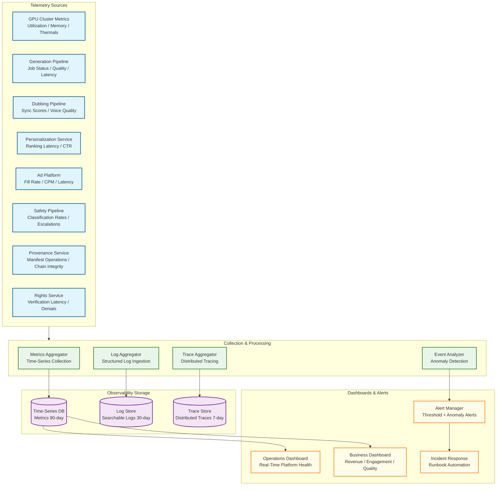

# 13.6 AI-Native Media & Entertainment Platform — Observability

## Observability Architecture

---

## GPU Cluster Metrics

### Hardware Health

| Metric | Description | Alert Threshold | Frequency |
|---|---|---|---|
| `gpu.utilization_pct` | GPU compute utilization per device | < 30% (underutilized) or > 95% (saturated) | 5 s |
| `gpu.memory_used_bytes` | GPU memory consumption | > 90% capacity | 5 s |
| `gpu.memory_fragmentation_ratio` | Free memory / largest contiguous free block | > 2.0 (significant fragmentation) | 30 s |
| `gpu.temperature_celsius` | GPU core temperature | > 85°C (thermal throttling imminent) | 10 s |
| `gpu.ecc_errors_total` | Correctable ECC memory errors (cumulative) | > 100 errors in 1 hour (degrading memory) | 60 s |
| `gpu.power_draw_watts` | Current power consumption | > 95% TDP (power throttling) | 10 s |
| `gpu.pcie_bandwidth_utilization` | PCIe bus utilization for model loading | > 90% during model swap (Slowest part of the process) | 5 s |

### Cluster Scheduling

| Metric | Description | Alert Threshold | Frequency |
|---|---|---|---|
| `scheduler.interactive_queue_depth` | Pending interactive generation jobs | > 50 for > 30 s | 5 s |
| `scheduler.interactive_wait_p99_ms` | Wait time before job starts (interactive) | > 10,000 ms | 30 s |
| `scheduler.batch_queue_depth` | Pending batch generation jobs | > 50,000 (capacity planning trigger) | 60 s |
| `scheduler.preemption_rate_per_min` | Batch jobs preempted by interactive jobs | > 20/min (too much churn) | 60 s |
| `scheduler.spot_interruption_rate` | Spot instance preemptions per hour | > 5% of spot fleet | 300 s |
| `scheduler.model_cache_hit_rate` | % of jobs routed to GPU with model pre-loaded | < 80% (warm pool insufficient) | 60 s |
| `scheduler.gpu_idle_pct` | GPUs with 0% utilization | > 20% during peak hours (wasteful) | 60 s |

---

## Content Generation Metrics

### Quality and Performance

| Metric | Description | Alert Threshold | Frequency |
|---|---|---|---|
| `generation.latency_p95_ms` | End-to-end generation time by content type | Video > 60,000 ms; Image > 5,000 ms | Per job |
| `generation.quality_score_avg` | Automated quality score (FID, CLIP) | < 0.7 for images; < 0.6 for video | Per job |
| `generation.safety_block_rate` | % of generations blocked by safety pipeline | > 15% (model producing too much unsafe content) | Hourly |
| `generation.safety_escalation_rate` | % of generations escalated to human review | > 5% (classifier uncertainty too high) | Hourly |
| `generation.retry_rate` | % of generations retried due to quality issues | > 10% (model performance degradation) | Hourly |
| `generation.checkpoint_size_mb` | Average checkpoint size for resumable jobs | > 5,000 MB (storage cost concern) | Per checkpoint |
| `generation.cost_per_asset_usd` | GPU compute cost per generated asset | Trending upward > 10% week-over-week | Daily |

### Model Performance

| Metric | Description | Alert Threshold | Frequency |
|---|---|---|---|
| `model.inference_latency_p99_ms` | Per-model inference time | > 2× baseline (model degradation) | Per inference |
| `model.tokens_per_second` | Generation throughput per GPU | < 80% of benchmark throughput | 60 s |
| `model.memory_peak_mb` | Peak GPU memory during inference | > 95% of allocated memory | Per job |
| `model.load_time_ms` | Time to load model into GPU memory | > 90,000 ms (cold start issue) | Per model load |
| `model.version_distribution` | % of traffic per model version | Old version > 5% after 48h rollout | Hourly |

---

## Dubbing Pipeline Metrics

| Metric | Description | Alert Threshold | Frequency |
|---|---|---|---|
| `dubbing.lip_sync_score` | Audio-visual alignment quality per language | < 0.85 (perceptual mismatch) | Per segment |
| `dubbing.voice_similarity_mos` | Cloned voice similarity to original | < 0.92 (voice quality issue) | Per segment |
| `dubbing.emotion_match_pct` | Emotion preservation accuracy | < 85% | Per segment |
| `dubbing.naturalness_mos` | Predicted MOS for synthesized speech | < 3.8 / 5.0 | Per segment |
| `dubbing.qa_pass_rate` | % of language tracks passing automated QA | < 90% (systemic quality issue) | Per job |
| `dubbing.human_review_escalation_rate` | % of tracks requiring human review | > 20% (model quality regression) | Daily |
| `dubbing.throughput_seconds_per_minute` | Processing time per minute of content | > 10 seconds/minute (pipeline slowing) | Per job |
| `dubbing.language_failure_rate` | Per-language synthesis failure rate | > 5% for any language | Daily |

---

## Personalization Metrics

### Service Performance

| Metric | Description | Alert Threshold | Frequency |
|---|---|---|---|
| `personalization.api_latency_p99_ms` | End-to-end personalization response time | > 100 ms | 10 s |
| `personalization.feature_freshness_p95_s` | Age of most recent feature update | > 60 s (feature store lag) | 30 s |
| `personalization.fallback_rate` | % of requests served by fallback (popularity-based) | > 1% (feature store or model issue) | 60 s |
| `personalization.cache_hit_rate` | Feature store cache hit rate | < 95% (cache sizing issue) | 30 s |
| `personalization.model_scoring_latency_ms` | Time to score candidates for a viewer | > 50 ms (model too complex) | Per request |

### Business Impact

| Metric | Description | Alert Threshold | Frequency |
|---|---|---|---|
| `personalization.ctr_overall` | Click-through rate on personalized recommendations | Drop > 5% day-over-day | Hourly |
| `personalization.thumbnail_bandit_regret` | Bandit regret vs. oracle (best variant always) | > 15% regret (explore too much) | Daily |
| `personalization.cold_start_ctr` | CTR for viewers with < 10 interactions | < 50% of established viewer CTR | Daily |
| `personalization.diversity_score` | Diversity of recommendations per viewer session | < 0.3 (filter bubble) | Daily |
| `personalization.session_length_impact` | Session length difference: personalized vs. control | Not statistically significant (personalization broken) | Weekly |

---

## Ad Platform Metrics

### Revenue and Performance

| Metric | Description | Alert Threshold | Frequency |
|---|---|---|---|
| `ads.fill_rate` | % of ad opportunities filled with paid ads | < 85% (demand shortage or targeting too narrow) | 5 min |
| `ads.effective_cpm` | Effective CPM across all impressions | Drop > 10% hour-over-hour | Hourly |
| `ads.decision_latency_p99_ms` | Ad decision + SSAI time | > 200 ms | 10 s |
| `ads.demand_partner_latency_p95_ms` | Per-partner bid response time | > 90 ms (partner degradation) | 30 s |
| `ads.demand_partner_timeout_rate` | Per-partner bid timeout rate | > 10% (exclude partner) | 5 min |
| `ads.creative_variant_ctr` | CTR per AI-generated creative variant | Variant CTR < 50% of campaign average (bad variant) | Daily |
| `ads.viewer_ad_load_minutes` | Ad minutes per content hour per viewer | > 12 min/hour (viewer fatigue risk) | Hourly |
| `ads.session_abandon_after_ad` | % of viewers who leave after an ad break | > 5% per break (ad load too heavy) | Hourly |

### Brand Safety

| Metric | Description | Alert Threshold | Frequency |
|---|---|---|---|
| `safety.brand_safety_violation_rate` | Ads served adjacent to unsafe content | > 0 (zero tolerance for high-sensitivity) | Real-time |
| `safety.competitive_separation_violation` | Competitor ads served adjacent | > 0 | Real-time |
| `safety.frequency_cap_violation` | Same ad shown beyond cap | > 0.1% | Hourly |

---

## Provenance and Rights Metrics

| Metric | Description | Alert Threshold | Frequency |
|---|---|---|---|
| `provenance.manifest_append_latency_p99_ms` | Time to append claim to manifest | > 50 ms | Per operation |
| `provenance.chain_verification_latency_ms` | Full manifest chain verification time | > 200 ms (chain too long) | Per verification |
| `provenance.chain_break_count` | Manifests with broken signature chains | > 0 (compliance violation) | Real-time |
| `provenance.watermark_detection_rate` | % of platform content with detectable watermark | < 99.5% (watermark embedding failure) | Daily |
| `rights.verification_latency_p99_ms` | Playback rights check time | > 30 ms | 10 s |
| `rights.denial_rate` | % of playback requests denied by rights check | > 1% (rights data issue or geo-fencing problem) | Hourly |
| `rights.expiration_warning_count` | Rights expiring within 7 days | > 100 (upcoming content availability gap) | Daily |
| `rights.royalty_computation_lag_hours` | Delay in royalty calculation from impressions | > 24 hours | Daily |

---

## Music Generation Metrics

### Audio Quality

| Metric | Description | Alert Threshold | Frequency |
|---|---|---|---|
| `music.quality_mos` | Predicted Mean Opinion Score for generated music (1–5 scale) | < 3.5 (unacceptable for production use) | Per track |
| `music.emotion_match_score` | Cosine similarity between requested emotion vector and generated track's detected emotion | < 0.75 (emotion mismatch) | Per track |
| `music.copyright_similarity_score` | Maximum similarity to any track in the reference corpus (melody contour, harmonic progression, rhythm fingerprint) | > 0.80 (potential infringement) | Per track |
| `music.sync_accuracy_scene_ms` | Temporal alignment between musical transitions (key change, tempo shift) and scene transitions in paired video | > 500 ms offset at any scene boundary | Per track |
| `music.beat_alignment_score` | Proportion of scene cuts aligned to musical downbeats within ±50 ms | < 0.70 (rhythmically disconnected from video) | Per track |
| `music.dynamic_range_lufs` | Integrated loudness and dynamic range per generated track | Outside −14 ± 2 LUFS (streaming platform normalization range) | Per track |
| `music.harmonic_complexity_index` | Ratio of unique chord progressions to total measures (detects repetitive output) | < 0.15 (degenerate repetition) | Per track |
| `music.generation_latency_p95_ms` | End-to-end music generation time for a 60-second track | > 15,000 ms | Per job |

### Copyright Risk Monitoring

| Metric | Description | Alert Threshold | Frequency |
|---|---|---|---|
| `music.melody_contour_similarity_max` | Maximum melodic contour similarity to reference corpus (pitch interval sequence) | > 0.85 for any 8-bar window | Per track |
| `music.harmonic_progression_match` | Longest common chord progression subsequence with any reference track | > 12 chords (statistically unlikely to be coincidental) | Per track |
| `music.rhythm_pattern_similarity` | Rhythmic fingerprint similarity to reference corpus | > 0.90 (distinctive rhythm reproduction) | Per track |
| `music.timbre_spectral_similarity` | Spectral centroid and MFCC distance to reference artists | < 0.10 distance (closely imitating specific artist's sound) | Per track |
| `music.copyright_escalation_rate` | % of generated tracks escalated for copyright review | > 5% (model drifting toward copyrighted patterns) | Daily |

---

## DiT Inference Metrics

### KV-Cache and Memory

| Metric | Description | Alert Threshold | Frequency |
|---|---|---|---|
| `dit.kv_cache_utilization_pct` | KV-cache memory as % of total GPU memory per layer | > 70% (risk of OOM for longer sequences) | Per inference step |
| `dit.kv_cache_size_gb` | Absolute KV-cache size for current generation job | > 40 GB (approaching GPU memory ceiling) | Per job |
| `dit.kv_cache_eviction_rate` | Rate of KV-cache entries evicted to CPU memory due to GPU memory pressure | > 5% of entries per step (performance degradation) | Per inference step |
| `dit.attention_head_memory_per_layer_mb` | Memory consumed by attention heads per transformer layer | > 2,000 MB per layer (model architecture review needed) | Per model load |
| `dit.peak_activation_memory_gb` | Peak memory for intermediate activations during forward pass | > 90% of allocated GPU memory (no headroom) | Per inference step |

### Compute Efficiency

| Metric | Description | Alert Threshold | Frequency |
|---|---|---|---|
| `dit.tensor_parallel_efficiency` | Actual throughput / (single-GPU throughput × GPU count); measures parallelization overhead | < 0.75 (excessive communication overhead) | Per job |
| `dit.cross_device_communication_ms` | Time spent in all-reduce and all-gather operations per step | > 30% of total step time (communication-bound) | Per inference step |
| `dit.variable_resolution_overhead_pct` | Additional latency from variable-resolution token packing vs. fixed-resolution | > 25% (packing strategy inefficient) | Per job |
| `dit.tokens_per_second_per_gpu` | Spatial-temporal token throughput per GPU | < 60% of benchmark (degraded efficiency) | 30 s |
| `dit.sequence_length_tokens` | Total token count for current generation (frames × spatial patches) | > 500,000 tokens (quadratic attention scaling warning) | Per job |
| `dit.sliding_window_hit_rate` | % of attention queries served from sliding window vs. full recomputation | < 80% (sliding window parameters need tuning) | Per inference step |

---

## AI Agent Metrics

### Agent Traffic Characterization

| Metric | Description | Alert Threshold | Frequency |
|---|---|---|---|
| `agent.session_count` | Active AI agent sessions (distinguished from human sessions via user-agent and behavioral fingerprinting) | > 10% of total sessions (agent traffic displacing human traffic) | 5 min |
| `agent.content_access_patterns` | Distribution of content accessed by agents vs. humans (genre, recency, format) | Divergence > 0.3 KL divergence from human patterns | Hourly |
| `agent.requests_per_session` | Average API requests per agent session | > 50× human session average (possible scraping) | Hourly |
| `agent.summary_generation_latency_p95_ms` | Time for agent to receive content summary (platform-provided summarization API) | > 500 ms | Per request |
| `agent.content_consumption_depth` | % of content actually rendered vs. metadata-only access | < 10% render rate (agents not viewing content, only scraping metadata) | Hourly |

### Agent Impact on Business Metrics

| Metric | Description | Alert Threshold | Frequency |
|---|---|---|---|
| `agent.ad_attribution_accuracy` | % of ad impressions served to agents correctly classified (not counted as human impressions) | < 95% (billing integrity risk) | Hourly |
| `agent.synthetic_impression_rate` | % of total impressions classified as agent-originated | > 5% of total (ad revenue distortion risk) | Hourly |
| `agent.recommendation_training_contamination` | % of training data for recommendation models that originates from agent behavior | > 2% (model quality risk) | Daily |
| `agent.false_human_classification_rate` | Agents misidentified as human sessions | > 1% (audit and billing compliance failure) | Daily |
| `agent.revenue_impact_usd` | Estimated revenue loss from agent impressions incorrectly billed as human impressions | > $1,000/day | Daily |

---

## Content Safety Metrics

| Metric | Description | Alert Threshold | Frequency |
|---|---|---|---|
| `safety.pre_filter_block_rate` | % of prompts blocked before generation | > 20% (overly strict) or < 2% (too permissive) | Hourly |
| `safety.post_classifier_block_rate` | % of generated content blocked post-generation | > 5% (model quality issue) | Hourly |
| `safety.false_negative_estimated_rate` | Estimated policy violations reaching production | > 0.1% (classifier inadequate) | Daily |
| `safety.human_review_sla_compliance` | % of escalations reviewed within SLA (15 min) | < 95% (staffing issue) | Hourly |
| `safety.re_scan_catch_rate` | New violations found in 24h re-scan | > 0.5% (classifier needs retraining) | Daily |
| `safety.classifier_agreement_rate` | Agreement between multiple safety classifiers | < 90% (model divergence, review needed) | Daily |

---

## Alerting Strategy

### Severity Levels

| Level | Criteria | Response Time | Notification |
|---|---|---|---|
| **P0 — Critical** | Revenue loss > $10K/hour, rights violation, safety failure reaching production | Immediate (< 5 min) | Page on-call + incident bridge + executive notification |
| **P1 — High** | Generation pipeline degraded, ad fill rate drop > 15%, provenance chain break | < 15 min | Page on-call + Slack alert |
| **P2 — Medium** | Personalization fallback active, dubbing quality below threshold, feature store lag | < 1 hour | Slack alert + ticket auto-created |
| **P3 — Low** | GPU utilization anomaly, model cache hit rate drop, batch queue growth | < 4 hours | Ticket auto-created |

### Anomaly Detection

Beyond static thresholds, the observability system runs anomaly detection on key business metrics:
- **Revenue anomaly**: Ad revenue deviates > 2 standard deviations from the same hour/day-of-week historical pattern
- **Quality anomaly**: Generation quality scores trend downward across 3 consecutive hours (early signal of model degradation)
- **Engagement anomaly**: Viewer session length drops > 10% compared to 7-day rolling average (may indicate personalization or content quality issue)
- **Cost anomaly**: GPU cost per generated asset increases > 20% without corresponding quality improvement (efficiency regression)

---

## Key Dashboards

### Operations Dashboard (Real-Time)
- GPU cluster health heat map (utilization, temperature, memory by node)
- Generation pipeline status (queue depths, active jobs, error rates by model)
- Safety pipeline throughput and escalation funnel
- Ad platform fill rate and revenue run rate
- Provenance chain integrity status

### Business Dashboard (Hourly/Daily)
- Content generation volume and cost trends
- Dubbing pipeline throughput and quality by language
- Personalization impact (CTR lift vs. control, session length impact)
- Ad revenue by segment, format, and demand partner
- Rights utilization (% of licensed content being monetized)

### Dashboard 3: Creator Analytics Dashboard (Per-Creator)
- **Generation patterns**: Daily/weekly generation volume by content type (video, image, audio, music), model version used, average generation time
- **Cost per asset**: GPU compute cost broken down by content type and quality tier, trend over rolling 30-day window, comparison to platform median
- **Quality trends**: Average quality score (FID/CLIP for images, lip-sync score for dubbed content, MOS for audio) over time, with flagged regressions and improvement inflection points
- **Audience reach per creator**: Unique viewers per asset, recommendation impressions per asset, CTR of creator's content in recommendations vs. platform average
- **Revenue attribution**: If monetized—ad revenue per asset, revenue per 1,000 views, top-performing assets by revenue, revenue by geography
- **Safety compliance record**: Rejection rate by safety tier, escalation history, content flagged for re-review after classifier update
- **Provenance trail**: Full manifest chain for every created asset, including downstream derivatives (dubbed versions, cropped thumbnails, ad-inserted variants)
- **Music generation dashboard**: Tracks generated, copyright risk scores per track, emotion match accuracy, sync scores with paired video content

---

## Runbooks

### Runbook 1: GPU Model Loading Timeout

**Trigger:** `model.load_time_ms` > 90,000 ms for > 3 consecutive loads of the same model, OR `scheduler.model_cache_hit_rate` drops below 60%.

**Severity:** P1 — Interactive generation SLO breach imminent.

**Diagnosis steps:**

1. **Check object storage latency**: Query `storage.read_latency_p99_ms` for the model artifact bucket. If > 500 ms, the Slowest part of the process is storage throughput, not GPU. Check for storage throttling or regional degradation.
2. **Check PCIe bandwidth utilization**: Query `gpu.pcie_bandwidth_utilization` on the affected nodes. If > 90%, the GPU bus is saturated—typically caused by multiple simultaneous model loads on the same node.
3. **Check model artifact size**: Verify the model being loaded has not unexpectedly increased in size (e.g., a new checkpoint was deployed without quantization). Compare `generation.checkpoint_size_mb` against the expected size for the model version.
4. **Check warm pool state**: Query `scheduler.model_cache_hit_rate` and the model affinity map. If the warm pool has shrunk (fewer GPUs pre-loaded with this model), the scheduler may be over-consolidating models.
5. **Check for memory fragmentation**: Query `gpu.memory_fragmentation_ratio` on target GPUs. If > 2.0, the GPU has free memory but not in contiguous blocks large enough for the model. Trigger compaction.

**Mitigation:**

- **Immediate**: Increase the warm pool for the affected model by 20% (redirect batch GPUs to pre-load the model). Enable model loading from local NVMe cache instead of object storage if available.
- **Short-term**: If PCIe-bound, stagger model loads across nodes (max 1 concurrent model load per node). If storage-bound, pre-stage model artifacts to local SSD on GPU nodes.
- **Long-term**: Implement speculative model pre-loading based on creator session prediction. Evaluate model sharding to load models in parallel across PCIe lanes.

---

### Runbook 2: Lip-Sync Quality Regression

**Trigger:** `dubbing.lip_sync_score` drops below 0.85 for > 20% of segments in any language for 2 consecutive hours, OR `dubbing.human_review_escalation_rate` exceeds 25%.

**Severity:** P2 — Quality degradation visible to viewers but not a compliance violation.

**Diagnosis steps:**

1. **Identify affected languages**: Break down `dubbing.lip_sync_score` by language. If regression is language-specific, the language-adaptive embedding model for that language may have degraded.
2. **Check model version**: Verify whether a recent model deployment coincides with the regression. Compare scores before and after the deployment timestamp.
3. **Check input quality**: Query `dubbing.voice_similarity_mos` and `dubbing.emotion_match_pct` for the same segments. If voice similarity is also degraded, the issue is upstream (source audio extraction or speaker diarization). If only lip-sync is affected, the issue is in the face mesh transformation stage.
4. **Check phoneme-level breakdown**: Query per-phoneme-class sync scores. If bilabial phonemes are specifically degraded while open vowels are fine, the forced alignment model is likely the culprit.
5. **Check GPU memory pressure**: If the lip-sync model is running with reduced batch size due to memory pressure from co-located models, inference quality may degrade.

**Mitigation:**

- **Immediate**: Roll back the lip-sync model to the previous version for the affected language(s). Re-route affected content to the previous model version while investigation continues.
- **Short-term**: Re-run QA on all content dubbed in the regression window. Flag segments below threshold for re-synthesis.
- **Long-term**: Add automated A/B quality comparison as a deployment gate for lip-sync model updates. Require per-language score parity before full rollout.

---

### Runbook 3: Ad Fill Rate Drop

**Trigger:** `ads.fill_rate` drops below 85% for > 15 minutes, OR `ads.effective_cpm` drops > 10% hour-over-hour during peak hours.

**Severity:** P1 — Direct revenue impact; estimated $5K–$50K/hour depending on traffic.

**Diagnosis steps:**

1. **Check demand partner health**: Query `ads.demand_partner_latency_p95_ms` and `ads.demand_partner_timeout_rate` per partner. If a major partner is timing out (> 10% timeout rate), they may be experiencing an outage.
2. **Check bid request volume**: Verify that bid requests are being sent correctly. A drop in outbound bid volume indicates a platform-side issue (ad decision engine, targeting data, or inventory classification).
3. **Check targeting data freshness**: Query `personalization.feature_freshness_p95_s`. If viewer features are stale, targeting precision drops, and demand partners bid lower or not at all.
4. **Check brand safety classification**: If the safety classifier was recently updated, more content may be classified as brand-unsafe, reducing eligible inventory. Query `safety.brand_safety_violation_rate` for a spike.
5. **Check frequency capping**: If frequency caps are too aggressive, eligible ads are exhausted for returning viewers. Query `safety.frequency_cap_violation` and per-viewer ad history depth.

**Mitigation:**

- **Immediate**: If a single demand partner is down, temporarily increase bid timeout for remaining partners by 20 ms to capture more bids. Enable backfill with house ads or lower-priority campaigns.
- **Short-term**: If targeting data is stale, switch affected segments to contextual targeting (content-based rather than viewer-based) until feature freshness is restored.
- **Long-term**: Implement multi-partner redundancy so that no single partner's outage drops fill rate below 80%. Add demand partner health scores to the ad decision engine's partner selection logic.

---

### Runbook 4: Provenance Chain Break

**Trigger:** `provenance.chain_break_count` > 0 (any broken chain is a compliance violation).

**Severity:** P0 — Regulatory compliance violation; EU AI Act disclosure requirement at risk.

**Diagnosis steps:**

1. **Identify the broken chain**: Query the provenance service for the specific manifest ID(s) with broken signatures. Determine which claim in the chain has an invalid signature.
2. **Identify the transformation step**: Map the broken claim to the pipeline step that produced it (generation, transcode, dub, crop, watermark, ad insert). Check if the signing key for that step has been rotated or expired.
3. **Check signing infrastructure**: Verify HSM availability and signing key validity. A key rotation that did not propagate to all pipeline instances causes new claims to be signed with an unknown key, breaking verification.
4. **Check for third-party tool interference**: If the content passed through an external transcoding or CDN pipeline, that system may have stripped or modified the C2PA manifest. Query the manifest history for claims added by external systems.
5. **Determine blast radius**: Count total assets processed by the affected pipeline step during the window when signing was broken. All are potentially affected.

**Mitigation:**

- **Immediate**: Halt publication of any content that passed through the affected pipeline step until the signing issue is resolved. Quarantine affected assets.
- **Short-term**: Re-sign affected manifests using the correct key. Re-verify the full chain for every affected asset. For assets already distributed, issue updated manifests to CDN edge nodes.
- **Long-term**: Implement pre-publication chain verification as a mandatory gate (no content publishes without a fully verified manifest chain). Add signing key rotation monitoring with 7-day advance warning before expiry.

---

### Runbook 5: Music Copyright Match Alert

**Trigger:** `music.copyright_similarity_score` > 0.80 for any generated track, OR `music.melody_contour_similarity_max` > 0.85 for any 8-bar window.

**Severity:** P1 — Potential copyright infringement; legal liability if published.

**Diagnosis steps:**

1. **Identify the matching reference**: Query the copyright similarity service for the specific reference track(s) that triggered the alert. Retrieve the matching dimensions (melody, harmony, rhythm, timbre) and their individual scores.
2. **Determine similarity type**: A high melody contour similarity with low harmonic/rhythm similarity suggests coincidental melodic overlap (more defensible). High scores across all dimensions suggest direct reproduction (high infringement risk).
3. **Check generation prompt**: Review the prompt used to generate the track. If the prompt explicitly references an artist name, song title, or distinctive style, the generation model may have overfit to that reference.
4. **Check model training data**: If the reference track is in the training dataset, determine whether it had proper licensing for training use. If not, the track represents a training data leakage issue, not just a generation issue.
5. **Evaluate the 8-bar window context**: An 8-bar match in a 3-minute track may be coincidental if it occurs in a common chord progression (I-V-vi-IV). An 8-bar match in a distinctive melodic passage is high risk.

**Mitigation:**

- **Immediate**: Block the generated track from publication. Do not serve it in any context (not even private creator workspace) until copyright review is complete.
- **Short-term**: Submit the track and reference match to the copyright review team with all similarity dimensions and generation context. If cleared, release with a documented fair-use justification. If not cleared, permanently block and notify the creator.
- **Long-term**: Add the matched reference track's distinctive features to the generation model's negative constraint set (prevent the model from reproducing those specific patterns). Retrain or fine-tune the model if the matching pattern appears in > 3 generated tracks.

---

## AI Observability Standards

This system's AI components MUST implement the observability patterns defined in:
- **[3.25 AI Observability & LLMOps](../3.25-ai-observability-llmops-platform/00-index.md)** — trace model, token accounting, prompt-completion linkage
- **[3.26 AI Model Evaluation & Benchmarking](../3.26-ai-model-evaluation-benchmarking-platform/00-index.md)** — eval taxonomy, regression testing, human review sampling

### Required AI-Specific Metrics
- Model prediction confidence distribution
- Human override rate (target: track, not minimize)
- AI recommendation acceptance rate by decision type
- Drift detection alerts (data drift + concept drift)
- Cost per AI-assisted decision
