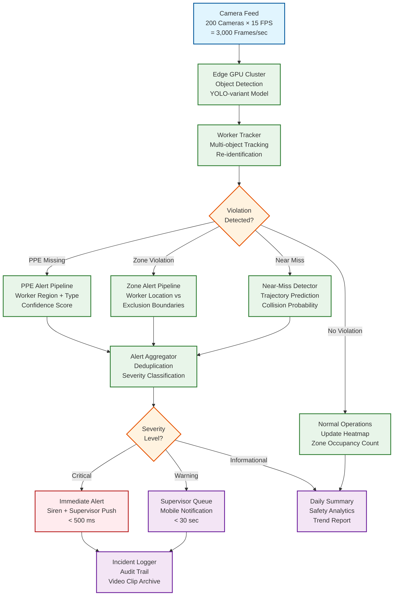
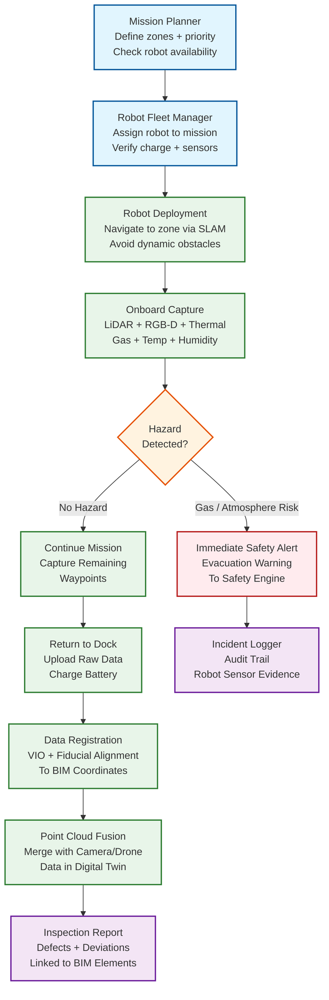
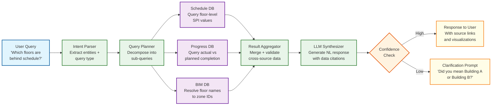
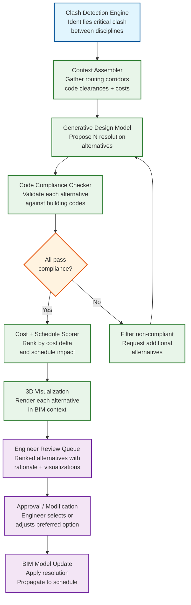

# 13.7 AI-Native Construction & Engineering Platform — High-Level Design

## System Architecture

```mermaid
flowchart TB
    subgraph Sources["Data Sources"]
        CAM[360° Site Cameras\nProgress Capture]
        SAF[Safety Cameras\nFixed + PTZ]
        DRN[Drones\nLiDAR + RGB]
        IOT[IoT Sensors\nEquipment + Environmental]
        BIM[BIM Authoring Tools\nIFC / Revit Models]
        MKT[Market Data\nMaterial Prices + Labor Indices]
        WX[Weather Services\nForecasts + Historical]
        ERP[ERP / Procurement\nOrders + Invoices]
    end

    subgraph Edge["Edge Computing Layer"]
        SFE[Safety CV Engine\nReal-time Inference]
        VBF[Video Buffer\nKeyframe Extraction]
        IMG[Image Collector\nCapture Scheduling]
        SNS[Sensor Aggregator\nIoT Protocol Translation]
    end

    subgraph Gateway["Ingestion & Gateway Layer"]
        IGW[Image Ingestion Gateway\nBatch Upload + Streaming]
        BGW[BIM Gateway\nIFC Parser + Validator]
        DGW[Data Integration Gateway\nERP + Market + Weather]
        AGW[Alert Gateway\nSafety Event Router]
    end

    subgraph Stream["Stream Processing Layer"]
        IPP[Image Processing Pipeline\nPhotogrammetry + Registration]
        PCP[Point Cloud Processor\nFusion + Decimation]
        EVP[Event Processor\nSafety Alerts + IoT Events]
        CHP[Change Processor\nBIM Diff + Impact Analysis]
    end

    subgraph Core["Core Intelligence Services"]
        BIE[BIM Intelligence Engine\nClash Detection + Constructability]
        CEE[Cost Estimation Engine\nProbabilistic Models]
        PTE[Progress Tracking Engine\n4D BIM Comparison]
        SME[Safety Monitoring Engine\nIncident Prediction + Analytics]
        ROE[Resource Optimization Engine\nScheduling + Allocation]
        RPE[Risk Prediction Engine\nDelay Forecasting]
        GCR[Generative Clash Resolver\nAI Design Alternatives]
    end

    subgraph AI["AI & Rendering Services"]
        NLQ[NL Query Service\nLLM + RAG Pipeline]
        NRF[NeRF / 3DGS Renderer\nScene Reconstruction]
        RFM[Robot Fleet Manager\nMission Planning + SLAM]
    end

    subgraph Analytics["Analytics & Coordination Layer"]
        DTW[Digital Twin Service\nSite State Management]
        EVM[Earned Value Manager\nCPI / SPI Calculation]
        SCM[Subcontractor Manager\nPerformance Scoring]
        QIM[Quality Inspection Manager\nDefect Detection]
        DOC[Document Manager\nRFI + Submittals]
    end

    subgraph Data["Data Layer"]
        OBS[(Object Store\nImagery + Point Clouds)]
        BDB[(BIM Database\nModel Elements + Versions)]
        TSD[(Time-Series Store\nIoT + Progress Telemetry)]
        CDB[(Cost Database\nEstimates + Actuals)]
        SDB[(Schedule Database\nCPM + EVM Data)]
        AUD[(Audit Store\nSafety + Compliance Logs)]
        VDB[(Vector Store\nProject Embeddings)]
    end

    subgraph Consumer["Consumer Layer"]
        PMD[Project Manager Dashboard\nSchedule + Risk + Cost]
        SFD[Safety Dashboard\nAlerts + Analytics]
        FLD[Field App\nMobile Progress + Inspection]
        STK[Stakeholder Portal\nReports + Digital Twin Viewer]
        API[External API\nIntegration Partners]
        NLC[NL Chat Interface\nConversational Queries]
    end

    CAM --> IMG
    SAF --> SFE & VBF
    DRN --> IMG
    IOT --> SNS
    BIM --> BGW
    MKT & WX --> DGW
    ERP --> DGW

    SFE --> AGW
    VBF --> IGW
    IMG --> IGW
    SNS --> DGW

    IGW --> IPP
    BGW --> CHP
    DGW --> EVP
    AGW --> EVP

    IPP --> PCP
    PCP --> PTE & DTW
    CHP --> BIE & CEE
    EVP --> SME & RPE

    BIE --> BDB & PMD
    BIE --> GCR
    GCR --> BDB & PMD
    CEE --> CDB & PMD
    PTE --> DTW & EVM
    SME --> AUD & SFD
    ROE --> SDB & PMD
    RPE --> SDB & PMD

    DTW --> OBS & STK
    NRF --> OBS & STK
    RFM --> PCP & SME
    NLQ --> VDB & NLC
    NLQ --> BDB & SDB & CDB
    EVM --> SDB & PMD
    SCM --> SDB
    QIM --> FLD
    DOC --> PMD

    IPP --> OBS & NRF
    PCP --> OBS
    EVP --> TSD
    SME --> AUD
    ROE --> AUD

    FLD --> IGW
    NLC --> NLQ
    API --> DGW

    classDef source fill:#e1f5fe,stroke:#01579b,stroke-width:2px
    classDef edge fill:#fff8e1,stroke:#f57f17,stroke-width:2px
    classDef gateway fill:#fff3e0,stroke:#e65100,stroke-width:2px
    classDef service fill:#e8f5e9,stroke:#2e7d32,stroke-width:2px
    classDef ai fill:#e0f7fa,stroke:#00695c,stroke-width:2px
    classDef data fill:#f3e5f5,stroke:#6a1b9a,stroke-width:2px
    classDef consumer fill:#fce4ec,stroke:#880e4f,stroke-width:2px

    class CAM,SAF,DRN,IOT,BIM,MKT,WX,ERP source
    class SFE,VBF,IMG,SNS edge
    class IGW,BGW,DGW,AGW gateway
    class IPP,PCP,EVP,CHP,BIE,CEE,PTE,SME,ROE,RPE,GCR service
    class NLQ,NRF,RFM ai
    class OBS,BDB,TSD,CDB,SDB,AUD,VDB data
    class PMD,SFD,FLD,STK,API,DTW,EVM,SCM,QIM,DOC,NLC consumer
```

---

## Key Design Decisions

### Decision 1: Edge-Cloud Hybrid Architecture with Safety-First Processing

The platform enforces a strict processing hierarchy: safety-critical computer vision runs entirely on edge compute co-located at the construction site, while analytics-heavy workloads (progress tracking, cost estimation, risk prediction) run in the cloud. Safety camera feeds never leave the site as raw video—edge GPUs perform real-time object detection and tracking, and only structured alert events (worker ID region, violation type, confidence score, bounding box coordinates, 5-second clip) are transmitted to the cloud. This design is driven by three constraints: (1) latency—a 500 ms safety alert SLO cannot tolerate cloud round-trip times of 100–300 ms plus inference time; (2) bandwidth—200 cameras at 15 FPS generating ~3 Gbps of raw video cannot be economically backhauled to the cloud; (3) resilience—safety monitoring must continue during internet outages, which occur frequently on construction sites.

**Implication:** Each site requires a ruggedized edge compute cluster with 20–25 GPUs for safety inference, 10 TB of local storage for buffering, and a UPS with 4-hour battery backup. The edge cluster runs a lightweight container orchestrator with automatic model updates pulled during low-activity periods (overnight). The cloud receives structured events only, reducing bandwidth to ~10 Mbps per site while preserving the analytics value. When connectivity is lost, the edge buffers up to 24 hours of events and forwards them on reconnection, with safety alerts continuing to fire locally via site-level notification systems (sirens, supervisor mobile alerts via local Wi-Fi).

### Decision 2: Asynchronous Progress Tracking with Daily Batch Photogrammetry

Progress tracking operates on a daily batch cycle rather than real-time processing, despite the availability of continuous camera feeds. This counterintuitive decision is driven by the nature of construction progress: meaningful changes (a wall framed, conduit installed, concrete poured) occur over hours to days, not seconds. Processing every 30-second capture in real-time would consume 20x more GPU compute while providing negligible incremental insight—a steel beam does not become "more installed" between two 30-second frames. The system captures continuously for coverage but processes in daily batches: end-of-day images are selected (best quality per zone per floor), photogrammetry reconstructs the 3D scene, and BIM comparison identifies changes since the previous day.

**Implication:** The image ingestion gateway buffers raw 360-degree captures in edge storage during the day and initiates batch upload to cloud object storage starting at the end of the work shift. The photogrammetry pipeline processes the upload queue overnight using spot/preemptible GPU instances (60–70% cost reduction). Progress results are available by 6 AM for morning planning meetings. The exception is the "rapid assessment" mode triggered after significant events (concrete pour completion, structural inspection) where on-demand processing of a targeted zone's imagery runs within 1 hour.

### Decision 3: BIM-Centric Data Model with IFC as the Canonical Schema

All platform data is organized around BIM elements as the primary key. Progress observations, cost line items, schedule activities, safety zones, quality inspections, and risk factors are all linked to IFC element GUIDs (GlobalId). This BIM-centric data model enables cross-domain queries that are impossible in siloed systems: "Show me all structural columns on Floor 12 that are behind schedule, over budget, and have unresolved clash issues with the MEP design." The IFC schema (ISO 16739-1) serves as the canonical data model because it is the industry standard for open BIM data exchange, supports the full building lifecycle (design → construction → operations), and provides a rich type system (IfcWall, IfcBeam, IfcDuct, etc.) that enables domain-specific analytics.

**Implication:** The BIM gateway must parse IFC files (STEP physical file format) and populate a graph database where nodes represent IFC elements and edges represent spatial, containment, and dependency relationships. Model updates are processed as diffs: the parser identifies added, modified, and deleted elements by comparing GUID sets, and propagates changes to all dependent services (clash detection, cost estimation, schedule linking). The graph database supports spatial queries (all elements within 2 meters of a given point) and topological queries (all elements connected to a given system) that power progress tracking and clash detection.

### Decision 4: Probabilistic Cost Estimation with Continuous BIM-Linked Updates

The cost estimation engine replaces single-point estimates with probability distributions. For each BIM element, the system retrieves historical cost data for similar elements (matched by type, material, size, location, and project complexity) from the historical project database, fits a distribution (typically log-normal for construction costs), and adjusts using current market conditions (material price indices, labor availability indices). The project-level cost estimate is the convolution of 500,000+ element-level distributions, computed via Monte Carlo simulation. When a design change modifies BIM elements, only the affected elements' cost distributions are recomputed, and the project total is updated incrementally.

**Implication:** The cost database maintains element-level cost distributions, not just point estimates. The Monte Carlo engine uses importance sampling for efficiency: instead of uniform random sampling, it oversamples from the tails of high-variance elements (structural steel, specialty MEP equipment) that dominate the project cost uncertainty. The system produces cost reports with confidence intervals (P10, P50, P90) rather than single numbers, forcing project teams to reason about cost risk rather than treating the estimate as deterministic.

### Decision 5: Multi-Source Point Cloud Fusion for the Digital Twin

The site digital twin is not a single point cloud but a fused representation from multiple capture sources: 360-degree cameras (dense coverage, moderate accuracy), LiDAR scanners (high accuracy, sparse coverage), drone surveys (exterior + roof coverage, periodic), and even mobile phone captures from field workers. Each source has different coordinate systems, accuracy profiles, and capture frequencies. The fusion pipeline registers all sources to the BIM coordinate system using a hierarchical registration process: (1) coarse alignment using GPS/known reference points, (2) fine alignment using Iterative Closest Point (ICP) against the BIM model geometry, (3) multi-source fusion with per-point confidence weighting based on source accuracy.

**Implication:** The point cloud processing pipeline must handle heterogeneous data formats (E57, LAS, PLY, proprietary camera formats), perform coordinate transforms between local site coordinates, GPS coordinates, and BIM project coordinates, and manage the computational cost of ICP registration on point clouds with 100M+ points. The fusion engine maintains a "confidence mesh" that tracks which regions of the site have high-confidence data (recently scanned, multiple sources) versus low-confidence (old data, single source, high occlusion), guiding capture planning to prioritize under-surveyed areas.

### Decision 6: NeRF / 3D Gaussian Splatting for Photorealistic Scene Reconstruction

Point clouds capture geometry but lose surface detail, material appearance, and lighting conditions that are critical for remote stakeholder walkthroughs and quality assessment. The platform augments geometric point clouds with Neural Radiance Fields (NeRF) and 3D Gaussian Splatting (3DGS) to produce photorealistic renderable scene representations from multi-view imagery. NeRF encodes the scene as a continuous volumetric function mapping 3D coordinates + viewing direction to color and density, enabling novel-viewpoint synthesis at quality levels that make remote stakeholders feel "present on site." 3DGS represents the scene as a collection of 3D Gaussians with learned positions, covariances, colors, and opacities, offering 100-200x faster rendering than NeRF while maintaining comparable visual quality—critical for interactive walkthroughs on standard hardware.

**Implication:** NeRF training requires 100-500 images per zone and 30-60 minutes of GPU compute per scene, making it suitable for daily batch processing alongside photogrammetry. 3DGS training is faster (10-20 minutes) and produces a representation that renders at 100+ FPS on consumer GPUs, enabling real-time virtual walkthroughs in the stakeholder portal. Both methods require accurate camera pose estimation (provided by the photogrammetry pipeline's Structure-from-Motion stage), so they piggyback on existing processing rather than introducing a separate capture requirement. The platform generates NeRF/3DGS models for key zones on a configurable schedule (daily for active work areas, weekly for stable areas) and serves them through a progressive streaming protocol that loads detail on demand as the viewer navigates. The key limitation is that NeRF/3DGS models become stale as construction progresses, so the system tags each model with its capture date range and overlays temporal indicators in the viewer.

### Decision 7: LLM-Powered Conversational Interface for Project Queries

Project managers, engineers, and field supervisors need information from multiple domains (schedule, cost, safety, BIM, progress) that traditionally require navigating separate dashboards and running custom reports. The platform provides an LLM-powered natural language interface that accepts queries like "Which floors are behind schedule and over budget?" or "Show me all unresolved critical clashes on the MEP systems in Building B" and generates answers grounded in verified project data. The architecture follows a Retrieval-Augmented Generation (RAG) pattern: the user's query is parsed into a structured intent, relevant data is retrieved from the project database using generated queries (graph queries for BIM, time-series queries for progress, SQL for cost/schedule), and the LLM synthesizes a natural language response with embedded data citations.

**Implication:** The NL query service maintains a semantic index of the project's data schema, terminology, and entity relationships (floor names, trade names, subcontractor identifiers, BIM element types) so the LLM can correctly resolve ambiguous references ("the east wing" → zone IDs, "the electrician" → specific subcontractor). A query planner decomposes complex queries into sub-queries across multiple data services, executes them in parallel, and feeds the results to the LLM for synthesis. Every factual claim in the response includes a source citation linking to the underlying data record, enabling verification. The system refuses to answer questions outside its data scope (legal advice, contract interpretation) and explicitly surfaces uncertainty when data coverage is incomplete. A feedback loop captures user corrections ("That schedule date is wrong—it was updated yesterday") and triggers data consistency checks.

### Decision 8: Autonomous Robot Integration for Confined-Space Inspection

Fixed cameras and drones cannot access many critical construction areas: active elevator shafts, mechanical crawlspaces, pipe chases behind walls, underground utility tunnels, and areas with hazardous atmospheres. The platform integrates autonomous inspection robots (legged quadrupeds and tracked crawlers) as first-class data sources alongside cameras, LiDAR scanners, and drones. Robots execute pre-planned inspection missions defined by zone, capturing LiDAR point clouds, RGB-D imagery, thermal scans, and environmental readings (gas concentration, temperature, humidity). The robot fleet manager schedules missions based on inspection priority, battery state of charge, and charging station availability, treating robots as constrained resources in the same optimization framework used for crew scheduling.

**Implication:** Robot data is registered to BIM coordinates using visual-inertial odometry (VIO) combined with fiducial marker detection at survey control points placed throughout the site. The SLAM-based localization achieves ≤5 cm accuracy in GPS-denied environments by fusing IMU data with visual feature tracking against a pre-loaded BIM-derived 3D map. Robot-captured point clouds feed into the same multi-source fusion pipeline as camera and drone data (Decision 5), with source-specific confidence weights reflecting the robot's localization accuracy at each capture point. The fleet manager monitors robot health (battery, motor temperature, sensor calibration) and automatically schedules maintenance or replacement when degradation thresholds are exceeded. Safety-critical inspections (confined space gas monitoring) take priority over routine survey missions.

---

## Cross-Cutting Concerns

### Data Lineage and Audit Trail

Every automated decision—safety alert, progress status change, cost estimate update, risk score—must be traceable back to its source data for regulatory compliance and dispute resolution. The platform implements end-to-end data lineage: each safety alert links to the specific camera frame, model inference, and confidence score that triggered it; each element completion status links to the point cloud capture, BIM comparison result, and confidence threshold applied; each cost estimate links to the BIM quantities, unit rate sources, and Monte Carlo parameters used. This lineage graph is stored in an append-only audit store with cryptographic hashing for tamper evidence. During construction disputes (which are common and expensive), this lineage enables the platform to answer "Why did the system say this beam was complete on March 15?" with a complete chain of evidence from raw imagery to processed result.

### Multi-Tenancy and Project Isolation

The platform serves multiple construction companies, each managing multiple projects. Strict data isolation is essential: a general contractor's BIM models, cost data, and subcontractor performance scores are competitively sensitive and must never leak to other tenants. The platform implements project-level data isolation with separate encryption keys per project, namespace isolation in all data stores, and network-level segmentation for edge compute clusters. Cross-project analytics (benchmarking, ML model training on historical data) operate only on anonymized, aggregated datasets with differential privacy guarantees. The exception is the shared historical cost database, which contains anonymized cost records contributed by participating projects under a data-sharing agreement that strips project identity, location specificity below the metro level, and client identification.

### Model Lifecycle Management

The platform runs dozens of ML models across edge and cloud: safety detection models, progress classification models, clash relevance models, cost prediction models, delay forecasting models, material recognition models, and generative design models. Each model has its own training data, update frequency, accuracy requirements, and deployment constraints. The model lifecycle management system tracks model versions, performance metrics (accuracy, latency, false positive rates), training datasets, and deployment status across 500+ edge clusters and cloud services. Model updates to edge clusters are deployed using a canary rollout strategy: new model versions are first deployed to 5% of cameras on a single site, monitored for 24 hours against the incumbent model's performance, and promoted to full deployment only after passing accuracy and latency gates. Safety models require additional validation: any model update must demonstrate equal or better detection rates on a curated test set of 10,000+ annotated safety events before deployment.

---

## Data Flow: Daily Progress Tracking Cycle

```mermaid
flowchart LR
    A[360° Camera Capture\n50 cameras × 1,200 images\n= 60K images/site/day] --> B[Edge Image Buffer\nQuality Filtering\nBest-per-zone Selection]
    B --> C[Batch Upload\nEnd-of-shift Transfer\nto Object Storage]
    C --> D[Photogrammetry Pipeline\nSfM + MVS Reconstruction\nGPU-accelerated]
    D --> E[Point Cloud Registration\nICP Alignment to BIM\nCoordinate System]
    E --> F{Element Matching\nBIM Geometry vs\nPoint Cloud Comparison}
    F -->|Match Found| G[Status Update\nNot Started → In Progress\nor In Progress → Complete]
    F -->|No Match| H[Gap Analysis\nMissing Element\nOr Occlusion?]
    G --> I[EVM Calculation\nEarned Value Update\nCPI / SPI Refresh]
    H --> I
    I --> J[Progress Report\nPer-floor Dashboard\nDeviation Alerts]

    classDef input fill:#e1f5fe,stroke:#01579b,stroke-width:2px
    classDef process fill:#e8f5e9,stroke:#2e7d32,stroke-width:2px
    classDef decision fill:#fff3e0,stroke:#e65100,stroke-width:2px
    classDef output fill:#f3e5f5,stroke:#6a1b9a,stroke-width:2px

    class A input
    class B,C,D,E,G,H process
    class F decision
    class I,J output
```

---

## Data Flow: Real-Time Safety Monitoring

---

## Data Flow: Robot-Assisted Inspection Workflow

---

## Data Flow: LLM Query Processing Pipeline

---

## Data Flow: Generative Clash Resolution

---

## Component Responsibilities Summary

| Component | Primary Responsibility | Key Interface |
|---|---|---|
| **Safety CV Engine (Edge)** | Real-time object detection, PPE compliance checking, exclusion zone monitoring, near-miss trajectory prediction on site camera feeds | Processes 3,000 frames/sec per site; emits structured safety events to alert gateway |
| **Image Ingestion Gateway** | Receives 360-degree captures, drone imagery, and mobile uploads; validates metadata; routes to processing pipeline | Handles 60K images/site/day batch upload; supports streaming for urgent assessments |
| **BIM Gateway** | Parses IFC/Revit files, extracts element hierarchy, computes model diffs, validates schema compliance | Ingests models up to 2M elements; publishes change events to dependent services |
| **Image Processing Pipeline** | Structure-from-Motion photogrammetry, multi-view stereo reconstruction, image quality assessment | GPU-accelerated; processes 60K images per site into dense point clouds |
| **Point Cloud Processor** | Multi-source point cloud fusion, ICP registration to BIM coordinates, decimation, temporal differencing | Handles 50 GB point clouds; outputs BIM-registered point cloud with confidence weights |
| **BIM Intelligence Engine** | Automated clash detection, constructability analysis, code compliance checking, change impact propagation | Spatial indexing on 500K+ elements; ML-based clash relevance filtering |
| **Cost Estimation Engine** | Probabilistic cost modeling, BIM quantity extraction, Monte Carlo simulation, market-adjusted pricing | Element-level cost distributions; 10,000-scenario simulation in <5 minutes |
| **Progress Tracking Engine** | BIM-to-reality comparison, element completion detection, percentage calculation, deviation alerting | Compares daily point clouds against BIM; updates element-level status |
| **Safety Monitoring Engine** | Safety analytics, incident trend analysis, leading indicator computation, zone risk scoring | Aggregates edge alerts; computes site-wide safety metrics and predictions |
| **Resource Optimization Engine** | Crew scheduling, equipment allocation, material delivery optimization, spatial deconfliction | Constraint-based solver; optimizes across 50+ trades with fatigue and certification constraints |
| **Risk Prediction Engine** | Activity-level delay probability scoring, critical path impact analysis, weather integration, subcontractor risk modeling | ML models trained on 50K+ projects; daily risk score updates |
| **Digital Twin Service** | Maintains 4D site model, temporal versioning, deviation heat maps, virtual walkthrough generation | Fuses multi-source point clouds; daily snapshots with BIM overlay |
| **Earned Value Manager** | CPI/SPI calculation, EAC/ETC forecasting, variance analysis, performance trend reporting | Reads progress data + cost actuals; publishes EVM metrics to dashboards |
| **Subcontractor Manager** | Performance scoring across productivity/quality/safety/schedule dimensions, historical tracking, qualification scoring | Objective data from progress tracking + safety + schedule; scores updated daily |
| **Robot Fleet Manager** | Mission planning, robot assignment, SLAM map distribution, charging schedule optimization, health monitoring, data upload coordination for autonomous inspection robots | Manages 5-10 robots per site; schedules missions based on inspection priority and battery state; monitors localization accuracy |
| **NL Query Service** | Natural language query parsing, intent extraction, multi-source data retrieval, LLM-based response synthesis with data grounding and citation | Handles 5,000+ concurrent conversations; RAG architecture with semantic schema index; confidence-based response filtering |
| **Generative Clash Resolution Engine** | Proposes ranked design alternatives for detected BIM clashes using generative AI constrained by code clearances, routing corridors, trade sequencing, and cost targets | Generates ≥3 alternatives per critical clash within 2 minutes; all alternatives validated against code compliance rules |
| **NeRF / 3DGS Renderer** | Trains neural scene representations from multi-view imagery for photorealistic site walkthroughs; serves rendered viewpoints via progressive streaming protocol | NeRF training 30-60 min/zone; 3DGS training 10-20 min/zone; 3DGS rendering at 100+ FPS for interactive walkthroughs |

---

## Key Design Tradeoffs

### Edge Inference Accuracy vs. Latency

Safety CV models running on edge GPUs face a fundamental tradeoff: larger models (more parameters, deeper networks) achieve higher detection accuracy but require more inference time per frame. At 200 cameras x 15 FPS, the edge cluster must sustain 3,000 inferences per second. The platform resolves this with a two-tier model architecture: a lightweight detection model (~5 ms/frame) runs on every frame for critical hazards (fall detection, struck-by), while a more accurate but slower model (~30 ms/frame) runs on sampled keyframes (1 per second) for nuanced detections (PPE compliance by type, near-miss trajectory prediction). The lightweight model has higher false-positive rates but ensures no true critical hazard is missed, while the keyframe model provides the accuracy needed for analytics and compliance reporting.

### Point Cloud Fidelity vs. Processing Cost

Dense photogrammetric reconstruction from 60,000 images per site produces high-fidelity point clouds but requires ~20 GPU-hours per site daily. The platform implements adaptive processing density: active work areas (identified from the previous day's progress tracking) receive full-density reconstruction, while stable areas (completed structural work, unchanged zones) receive sparse reconstruction or skip processing entirely. This reduces daily GPU cost by 40-60% while maintaining full fidelity where it matters. The tradeoff is that if unexpected changes occur in "stable" zones (e.g., damage from equipment), they may not be detected until the next full-density processing cycle. A weekly full-site scan catches any missed changes.

### LLM Response Quality vs. Latency

The NL query service faces a tension between response thoroughness and speed. A comprehensive answer to "Why is Building B behind schedule?" might require querying the schedule database, progress tracking system, weather service, subcontractor performance scores, and material delivery logs—each adding latency. The system implements progressive response generation: it returns a quick summary within 5 seconds from the most relevant data source (schedule SPI), then asynchronously enriches the response with contributing factors from additional sources, streaming updates to the client. Users see an initial answer immediately and watch it deepen over the next 10-15 seconds, maintaining the conversational responsiveness expected of a chat interface while delivering the analytical depth expected of a project intelligence system.

### Robot Autonomy vs. Safety Margin

Autonomous inspection robots must balance mission completion (covering all target waypoints) against conservative safety behavior (aborting when conditions are uncertain). Overly aggressive autonomy risks robot entrapment in unstable areas (fresh excavation, wet concrete), while overly conservative behavior causes frequent mission failures and undermines trust. The platform implements graduated autonomy levels: in well-mapped stable areas, the robot operates fully autonomously; in newly changed areas (detected via digital twin differencing), it switches to a cautious mode with reduced speed and expanded obstacle clearance; in areas with atmospheric hazards, it follows a strict gas-monitoring protocol that aborts the mission if any reading exceeds 50% of the applicable exposure limit (not waiting for the full limit to be reached).

### Generative Resolution Breadth vs. Engineering Trust

The generative clash resolution engine could propose maximally creative solutions (rerouting entire systems, suggesting structural modifications), but engineers are more likely to accept and approve incremental modifications that closely resemble established design patterns. The platform constrains the generative model's search space to solutions within a configurable "modification radius"—by default, solutions must modify elements within 3 meters of the clash point and within the same discipline. Engineers can explicitly expand this radius for complex multi-discipline conflicts. This conservative default builds trust by producing familiar-looking solutions while preserving the option for more creative exploration when the standard search space yields no viable alternatives.

---

## Technology Selection Rationale

| Component | Technology Choice | Rationale |
|---|---|---|
| **BIM data store** | Graph database (property graph model) | BIM data is inherently relational—elements contain, connect to, void, and aggregate other elements. Graph traversal (e.g., "all elements connected to this pipe system") is O(k) in a graph DB vs. O(n) with SQL joins on a 500K-element model. Spatial indexing extensions (R-tree) support geometric queries for clash detection. |
| **Point cloud storage** | Object storage with octree indexing | Point clouds range from 50 MB to 50 GB per capture. Object storage provides cost-effective, durable storage at this scale. An octree spatial index layered on top enables efficient spatial queries ("all points within this bounding box") without loading the entire cloud into memory. |
| **Time-series telemetry** | Columnar time-series database | IoT sensors, safety event streams, and progress metrics are all time-series workloads with high write throughput (100K+ events/second) and time-windowed query patterns. Columnar storage with time-based partitioning and automatic downsampling provides both write performance and query efficiency. |
| **Safety event stream** | Distributed message queue with per-site partitioning | Safety events require strict ordering per camera and low-latency delivery to the alert aggregation layer. Per-site partitioning ensures that events from one site's cameras are processed in causal order while allowing parallel processing across sites. |
| **Edge orchestration** | Lightweight container runtime with declarative model deployment | Edge clusters need to run multiple CV model versions simultaneously (canary deployments), handle model updates atomically, and restart failed inference workers within seconds. A lightweight container orchestrator with health checks and rolling updates provides this without the overhead of a full cluster management system. |
| **Cost simulation** | Distributed compute framework with GPU acceleration | Monte Carlo simulation of 10,000 scenarios across 500K elements is embarrassingly parallel. A distributed compute framework partitions scenarios across worker nodes, with GPU acceleration for the matrix operations in correlated cost factor simulation. Spot/preemptible instances reduce compute cost by 60-70%. |
| **NL query engine** | RAG pipeline with vector similarity search + structured query generation | The NL interface must combine semantic understanding (what the user means) with precise data retrieval (exact project numbers). A vector store indexes project schema, terminology, and entity aliases for semantic matching, while a structured query generator produces exact database queries from parsed intents. This hybrid approach avoids pure LLM hallucination while handling the ambiguity of natural language. |
| **Robot localization** | Visual-inertial odometry + fiducial SLAM | GPS is unavailable indoors. VIO fuses camera and IMU data for smooth local tracking, while fiducial markers at survey control points provide absolute position corrections that bound drift accumulation. This combination achieves ≤5 cm accuracy without requiring expensive indoor positioning infrastructure (UWB beacons, etc.). |
| **Generative design** | Constrained generative model with code-compliance validator | Clash resolution requires solutions that satisfy physical constraints (bend radii, drainage slopes), code requirements (clearances, fire ratings), and cost targets. A generative model conditioned on BIM context and routing constraints proposes candidates, while a deterministic code-compliance validator acts as a hard filter. This separation ensures the generative model can be creative within boundaries enforced by the validator. |
| **Scene reconstruction** | NeRF for offline quality + 3DGS for real-time rendering | NeRF produces highest visual quality but is too slow for interactive use (seconds per frame). 3DGS renders at 100+ FPS but requires more storage. The platform trains both: NeRF for archival-quality renders and stakeholder presentations, 3DGS for interactive walkthroughs and field inspection review. Both share camera poses from the photogrammetry pipeline, avoiding duplicate capture. |

---

## Edge-to-Cloud Data Flow Orchestration

The platform manages three distinct data flow patterns between edge and cloud, each with different latency, bandwidth, and reliability requirements:

**Pattern 1: Real-Time Safety Events (Edge-Initiated, Low Latency)**

Safety alerts flow from edge to cloud as structured events (~1 KB each) over a persistent WebSocket connection. If the connection drops, the edge buffers events locally (up to 24 hours) and replays them on reconnection with original timestamps. The cloud processes these events for aggregation, analytics, and escalation, but the primary alert delivery (to site supervisors) happens entirely at the edge via local Wi-Fi push notifications and audible alarms. This pattern tolerates cloud unavailability without compromising safety.

**Pattern 2: Daily Batch Imagery (Edge-Buffered, High Volume)**

360-degree camera captures accumulate on edge storage throughout the work day (~900 GB/site/day). At end-of-shift, the edge initiates a batch upload to cloud object storage using a bandwidth-aware transfer protocol that throttles during active work hours (when safety feeds need the bandwidth) and maximizes throughput overnight. The transfer is resumable—if connectivity drops mid-transfer, it resumes from the last confirmed chunk. The cloud photogrammetry pipeline watches the upload queue and begins processing as soon as a complete zone's imagery is available, enabling incremental results while the full batch is still uploading.

**Pattern 3: Robot Mission Data (Robot-to-Edge-to-Cloud, Latency-Sensitive for Hazards)**

Robot inspection data follows a two-hop path: the robot uploads captures to the site's edge cluster via local Wi-Fi as it returns to its docking station. The edge immediately processes environmental readings for hazard detection (gas levels, temperature anomalies) and forwards any safety alerts via Pattern 1. The bulk capture data (LiDAR point clouds, RGB-D imagery) then follows Pattern 2 for batch upload to the cloud for BIM registration and digital twin fusion. This hybrid approach ensures that safety-critical environmental data reaches human operators within seconds, while the larger geometric data follows the most efficient bulk transfer path.
