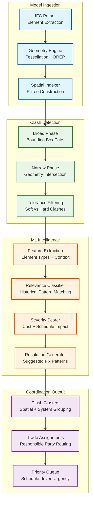
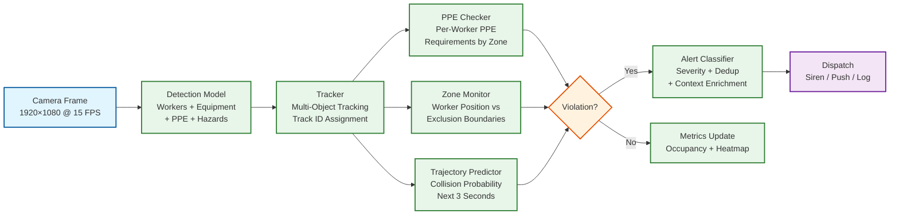
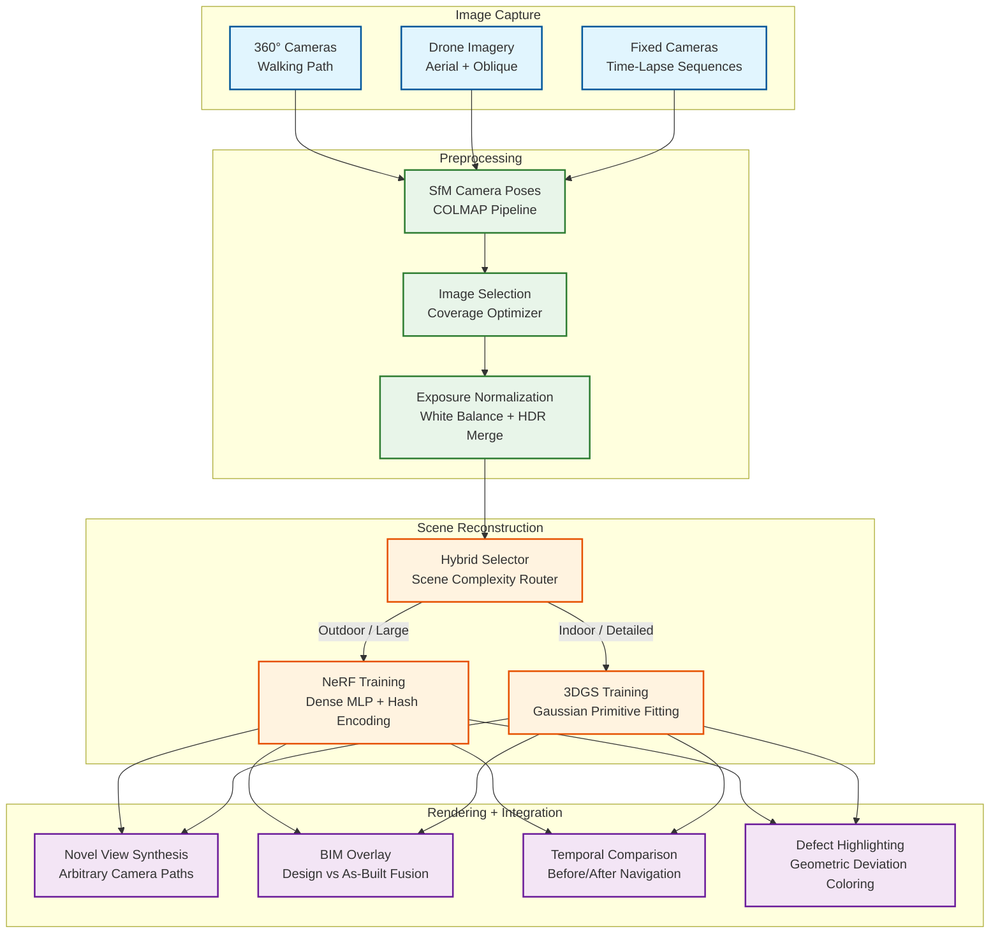
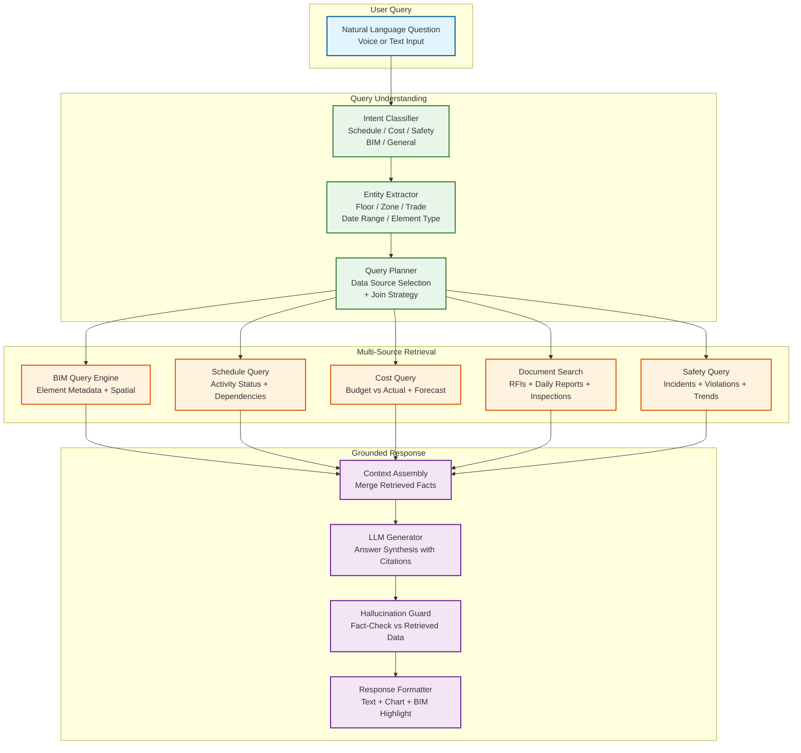

# 13.7 AI-Native Construction & Engineering Platform — Deep Dives & Bottlenecks

## Deep Dive 1: BIM Clash Detection at Scale — From Geometric Noise to Actionable Coordination

### The Problem

A full BIM model for a large commercial building contains 500,000–2,000,000 elements across structural, architectural, mechanical, electrical, plumbing, and fire protection disciplines. Naive pairwise clash detection (every element against every other) requires O(n²) geometry intersection tests—500K elements yield 125 billion pairs, which is computationally infeasible. Even with spatial filtering, a typical full-model clash report produces 20,000–80,000 raw clashes, of which 85–95% are irrelevant (acceptable tolerances, construction sequence will resolve them, or standard design patterns that are known to be buildable). The engineering challenge is not finding clashes—it is finding the 500–2,000 clashes that actually matter.

### Architecture



### Slowest part of the process: Spatial Index Construction for Large Models

Building an R-tree for 2M elements with complex 3D geometry requires tessellating each element's B-rep geometry into a triangulated mesh (for accurate bounding box computation), inserting into the spatial index with bulk-loading (STR algorithm for optimal tree structure), and maintaining the index incrementally as model updates arrive. The tessellation step is the Slowest part of the process: complex curved geometry (HVAC duct bends, pipe elbows, structural connections) can produce 10,000+ triangles per element, and 2M elements yield 20 billion triangles that must be processed before any clash detection can begin. The production system uses level-of-detail tessellation: simple elements (rectangular walls, straight pipes) use low-poly representations (10–50 triangles), while complex geometry gets progressively refined only during narrow-phase intersection testing. This reduces the initial tessellation from 20B to ~200M triangles, cutting index construction time from 45 minutes to 3 minutes.

### Slowest part of the process: ML Relevance Filtering Cold Start

The relevance classifier requires training data—clashes that were labeled as "relevant" or "irrelevant" by human coordinators. A new firm adopting the platform has no historical labels. The cold-start strategy uses transfer learning: a base model trained on 10,000+ projects across the platform provides a general relevance classifier that achieves 70% accuracy out of the box. As coordinators label clashes on their projects (by resolving, accepting, or dismissing them), the model fine-tunes using online learning, reaching 85% accuracy within 3 months and 92% within a year. The key insight is that clash relevance is highly firm-specific: some firms accept duct-beam clashes within 50 mm tolerance, while others require 100 mm clearance for maintenance access. The model must learn these firm-specific standards from coordinator behavior.

---

## Deep Dive 2: Progress Tracking — Bridging the Visual-Geometric Gap

### The Problem

Comparing daily site imagery against a BIM model seems straightforward in concept but is enormously challenging in practice. The BIM model represents the *designed* building in an idealized clean state. The construction site is a chaotic environment where: (1) elements are partially installed (a wall is framed but not drywalled), (2) temporary works (scaffolding, formwork, shoring) occlude permanent elements, (3) construction debris and materials on the floor obstruct camera views, (4) lighting varies dramatically between floors and time of day, (5) elements look different during construction than in the final state (exposed rebar before concrete pour, bare studs before drywall), and (6) the as-built position may differ from the design by centimeters to tens of centimeters. A progress tracking system that only recognizes "finished" elements misses the entire construction process; one that tries to detect every intermediate state faces a combinatorial explosion of possible configurations.

### Architecture

The progress tracking pipeline uses a three-stage approach:

**Stage 1: Geometric Reconstruction.** Structure-from-Motion (SfM) algorithms estimate camera positions from 360-degree image sequences, followed by Multi-View Stereo (MVS) to produce dense point clouds. This stage is entirely classical computer vision—no ML models required—and produces a 3D point cloud with ~1 cm point spacing from images captured at 2-meter intervals along walking paths.

**Stage 2: Registration and Segmentation.** The reconstructed point cloud is aligned to the BIM coordinate system using ICP (Iterative Closest Point) against known reference geometry (structural columns, floor slabs, elevator shafts). After registration, each point is associated with the nearest BIM element using the spatial index. Points that do not match any BIM element are classified as temporary works, debris, or out-of-tolerance installations.

**Stage 3: Status Inference.** For each BIM element, the system analyzes the associated point cloud segment to determine completion status. This stage uses both geometric features (surface coverage percentage, shape similarity to design geometry) and visual features (material appearance from RGB colors, texture patterns indicating specific construction stages). A multi-class classifier trained on labeled examples determines the element's status: not started, rough-in, in-progress, substantially complete, or deficient.

### Slowest part of the process: Photogrammetry at Scale

Processing 60,000 images per site per day through SfM+MVS is computationally expensive. SfM feature extraction and matching is O(n²) on image count—60,000 images yield 1.8 billion potential image pairs. The production system uses a hierarchical approach: images are grouped by floor and zone (using camera location metadata), SfM is run independently per zone (~200 images each), and zone-level point clouds are stitched using known reference points. This reduces the matching problem from O(n²) on 60,000 to O(n²) on 200 × 300 zones, an 200x speedup. The MVS densification step uses GPU-accelerated stereo matching, processing ~200 images in 2 minutes on a modern GPU, making the 300-zone pipeline feasible within the 4-hour SLO using 4 GPU workers per site.

### Slowest part of the process: Handling Construction Stages vs. Design State

A concrete column in the BIM model is a clean rectangular prism. During construction, it progresses through: (1) rebar cage (steel grid, no concrete), (2) formwork placed (plywood box around rebar), (3) concrete poured (wet surface, formwork still in place), (4) formwork stripped (rough concrete surface, form tie holes visible), (5) patched and finished (smooth surface). The system must recognize all five stages as partial completion of the same element. The production model is trained on a taxonomy of 150+ construction stage types across 20 element categories, with examples from 50,000+ projects. For each BIM element type, the model outputs a stage classification and maps it to a completion percentage (rebar cage = 30%, formwork = 50%, concrete poured = 70%, stripped = 85%, finished = 100%). This construction-stage-aware progress detection is the primary differentiator from naive geometric comparison.

---

## Deep Dive 3: Safety CV Pipeline — From Frame to Life-Saving Alert in 500ms

### The Problem

Construction sites are the most visually complex environments for computer vision: cluttered backgrounds with heavy machinery, scaffolding, temporary structures, and piles of material; workers in similar-looking safety gear (distinguishing a worker with a hard hat from one with a similar-colored hoodie); extreme lighting variations from direct sunlight to deep shadows within the same frame; dust, rain, and vibration affecting image quality; and cameras mounted at oblique angles on temporary structures that shift as construction progresses. The system must detect PPE compliance, zone violations, and near-miss events with ≥95% accuracy while maintaining <500 ms latency for critical alerts—and must do so on edge hardware that operates in 40°C heat with intermittent power.

### Architecture



### Latency Budget Breakdown

```
Total budget: 500 ms

Frame acquisition:              10 ms   (camera capture + decode)
Object detection (batch of 4):  80 ms   (edge GPU inference)
Multi-object tracking:          15 ms   (Kalman filter update + association)
PPE classification:             25 ms   (per-worker crop classification)
Zone boundary check:             5 ms   (point-in-polygon per worker)
Trajectory prediction:          20 ms   (linear + Kalman extrapolation)
Alert deduplication:            10 ms   (track ID + time window check)
Context enrichment:             15 ms   (zone name, nearest BIM element)
Alert dispatch (local):         20 ms   (siren trigger + supervisor push)
─────────────────────────────────────
Total:                         200 ms   (well within 500 ms budget)
Margin for degraded conditions: 300 ms  (dust, vibration, thermal throttling)
```

### Slowest part of the process: False Positive Management

A construction site with 200 cameras and 2,000 workers generating 1,000 raw PPE alerts per hour would overwhelm safety supervisors with alert fatigue, causing them to ignore all alerts—including genuine life-threatening violations. The production system uses a multi-layer deduplication and filtering strategy:

1. **Temporal deduplication:** Same track ID, same violation type, within a 5-minute window → single alert. Reduces 1,000 to ~200 unique alerts/hour.
2. **Confidence thresholding:** Alerts below 0.85 confidence are logged but not dispatched to supervisors. Reduces false positives by ~40%.
3. **Contextual filtering:** Workers in designated break areas may remove hard hats; PPE requirements vary by zone (ground floor vs. elevated work). Zone-aware rules eliminate contextually inappropriate alerts.
4. **Temporal persistence:** Require violation to persist for ≥3 consecutive frames (200 ms) before alerting, filtering transient misdetections from single-frame noise.

After all filtering stages, the system dispatches ~50 unique, high-confidence, contextually relevant alerts per hour per site—a manageable workload for 2–3 safety supervisors.

### Slowest part of the process: Edge Model Updates Without Downtime

Safety CV models must be updated periodically (new PPE types, site-specific calibration, model accuracy improvements) without interrupting the real-time inference pipeline. The edge cluster uses a blue-green deployment strategy: the new model is loaded onto a standby GPU while the primary GPU continues inference; once the standby model passes a validation suite (10 test images with known ground truth, accuracy ≥ threshold), traffic is switched atomically. Rollback occurs automatically if the new model's live accuracy drops below the previous model's baseline within the first hour. Model updates are scheduled during the overnight low-activity window (10 PM – 6 AM) when camera feeds show empty sites and alert volume is near zero.

---

## Deep Dive 4: Probabilistic Cost Estimation — From BIM Quantities to Confidence Intervals

### The Problem

Traditional cost estimation produces a single number: "This building will cost $50 million." This false precision hides enormous uncertainty—the actual cost could range from $42M to $65M depending on material price movements, labor productivity variations, design changes, and unforeseen conditions. More dangerously, single-point estimates create anchoring bias: once stakeholders see "$50M," they treat it as a commitment rather than an estimate, and the 30% of projects that exceed budget are treated as failures rather than statistical expectations.

### Architecture

The cost estimation engine operates at three levels:

**Level 1: Quantity Extraction.** The BIM gateway parses the IFC model and extracts quantities for every element: concrete volume (m³), steel weight (kg), duct length (m), fixture count (ea), etc. This is deterministic—given a specific model version, quantities are exact. The challenge is mapping BIM quantities to cost items: a single IfcWall may require drywall, framing, insulation, taping, painting, and baseboard—each a separate cost item with independent unit rates.

**Level 2: Unit Rate Distribution Fitting.** For each cost item, the system queries the historical database for similar items (same CSI MasterFormat code, similar size/specification, similar project type, same geographic region). Instead of returning a single unit rate, it fits a distribution—typically log-normal, as construction costs are bounded below (you cannot build for free) and have a long right tail (complex conditions can make costs much higher than typical). The distribution parameters are adjusted for current market conditions using material price indices (steel, concrete, lumber) and labor rate indices (by trade, by region).

**Level 3: Monte Carlo Simulation.** The project cost is the sum of 500K+ element costs, each drawn from its respective distribution. Because element costs are not independent (if steel prices rise, all steel elements are affected; if a project is in a tight labor market, all labor costs increase), the simulation uses a correlated sampling approach: cost drivers (material prices, labor rates, productivity factors) are sampled first from their joint distribution, and then element costs are computed conditional on those drivers. This captures the "everything goes wrong at once" tail risk that independent sampling misses.

### Slowest part of the process: Historical Database Coverage

The cost database must contain enough historical data to fit reliable distributions for each cost item. Common items (concrete foundations, standard drywall) have thousands of data points; rare items (specialized cleanroom HVAC, blast-resistant glazing) may have fewer than 20. For sparse items, the system uses hierarchical Bayesian estimation: the item's distribution is informed by the broader category distribution (e.g., "specialty glazing" distribution anchors the "blast-resistant glazing" estimate), with the item-specific data pulling the estimate toward observed values as more data accumulates. This prevents overfitting to a few data points while still leveraging item-specific information when available.

### Slowest part of the process: Change Order Cascading

When a design change modifies one element, the cost impact often cascades: enlarging a mechanical room increases concrete quantities, requires longer duct runs, adds additional lighting fixtures, may require a larger electrical panel, and affects the structural design if the room is on an upper floor. The cost estimation engine must trace these dependencies through the BIM model's relationship graph and recompute costs for all affected elements, not just the directly changed elements. The production system uses a "change impact radius" computed by traversing the BIM relationship graph (containment, connection, adjacency) up to 3 levels from the changed element, recomputing costs for all elements within the radius. This typically expands a single-element change to 50–200 affected elements—a manageable recomputation that completes within the 5-minute SLO.

---

## Deep Dive 5: Resource Optimization — The Spatial-Temporal Scheduling Problem

### The Problem

Construction scheduling is not just a precedence-constrained project scheduling problem (which is NP-hard itself). It adds spatial constraints that do not exist in manufacturing or software: two crews cannot work in the same 3×3 meter area simultaneously (safety regulation), a tower crane can serve only one lifting operation at a time (shared resource), material deliveries must be staged on specific floors with limited laydown area (spatial capacity), and certain trades produce noise, dust, or vibration that prevents adjacent trades from working (environmental interference). The combinatorial explosion of temporal precedence × spatial constraints × resource availability × weather windows makes exact solutions infeasible for real projects with 50,000 activities.

### Solution Approach

The production system uses a two-tier optimization:

**Tier 1: Strategic schedule (weekly).** A simplified MIP model with activity-level granularity (not task-level) optimizes the overall project sequence. Activities are aggregated by floor/zone/trade, reducing 50,000 tasks to ~2,000 activity groups. The MIP finds the optimal trade sequence per zone, crane allocation plan, and major material delivery windows. This strategic schedule is recomputed weekly as actual progress updates the model.

**Tier 2: Tactical assignments (daily).** Given the strategic schedule's weekly targets, a constraint propagation solver assigns specific crews to specific zones for each day. This solver handles the fine-grained spatial constraints (crew sizes, zone occupancy limits, equipment sharing, environmental interference) that are too detailed for the weekly MIP. The tactical solver runs each evening for the following day's assignments, with a re-solve triggered if significant disruptions occur (weather cancellation, equipment breakdown, crew no-show).

### Slowest part of the process: Equipment Sharing Across Zones

A tower crane shared among multiple floors creates a Slowest part of the process that dominates the critical path of many high-rise projects. The crane can perform ~15 lifts per hour, but each lift has setup time (rigging, signaling, load preparation) that varies by material type and crew experience. The optimization must sequence lifts to minimize crane idle time while respecting the material delivery schedule (just-in-time: materials arrive at the staging area within 30 minutes of their scheduled lift). The production system models the crane as a single-server queue with priority-based scheduling: structural steel lifts (critical path) get highest priority; facade panel lifts (schedule-driven) get medium priority; general material lifts get lowest priority. The solver pre-assigns lift windows to each zone and trade, publishing the schedule so crews can prepare materials in advance.

---

## Deep Dive 6: NeRF / 3D Gaussian Splatting for Photorealistic Scene Reconstruction

### The Problem

Traditional photogrammetry (SfM + MVS) produces accurate but visually sparse 3D reconstructions: point clouds with centimeter-level geometry but no continuous surface representation and no photorealistic rendering capability. A project manager reviewing progress wants to "walk through" yesterday's site as if they were there—seeing continuous walls, recognizing material finishes, spotting defects like misaligned conduit or water staining. Point clouds fail this test: they are collections of colored dots that convey geometry to an engineer but not visual context to a non-technical stakeholder. Furthermore, traditional photogrammetry requires capturing images along fixed walking paths, and any area not directly photographed is a blind spot in the reconstruction.

Neural Radiance Fields (NeRF) and 3D Gaussian Splatting (3DGS) solve this by learning a continuous volumetric representation of the scene from images, enabling photorealistic rendering from arbitrary novel viewpoints—including viewpoints never captured by any camera. This transforms the progress review experience from "look at a point cloud" to "virtually walk through the site from any angle."

### Architecture



### How It Supplements Traditional Photogrammetry

The system does not replace SfM+MVS; it layers neural rendering on top of the geometric pipeline:

1. **SfM runs first** to estimate camera poses—both NeRF and 3DGS require accurate camera positions as input, and SfM provides these robustly from construction imagery.
2. **MVS point cloud** remains the ground-truth geometry for progress tracking (element-level comparison against BIM). Neural rendering does not provide metrically reliable geometry; it provides visual fidelity.
3. **NeRF/3DGS training** uses the SfM camera poses and the original images to learn a continuous scene representation. Training on a single zone (~200 images) takes 5–15 minutes on a modern GPU depending on the method.
4. **Novel view rendering** enables stakeholders to navigate the scene interactively from viewpoints that were not captured—looking around corners, zooming into details, viewing from above.

### NeRF vs. 3D Gaussian Splatting: When to Use Each

| Criterion | NeRF (Hash-Grid MLP) | 3D Gaussian Splatting |
|---|---|---|
| **Training speed** | 15–30 min per zone | 5–10 min per zone |
| **Rendering speed** | 2–5 FPS (real-time requires baking) | 100+ FPS (native real-time) |
| **Geometric accuracy** | Better for smooth surfaces | Better for sharp edges and fine detail |
| **Memory footprint** | 50–200 MB per zone | 200–800 MB per zone (more Gaussians) |
| **Handling of reflections** | Moderate (view-dependent MLP) | Good (per-Gaussian spherical harmonics) |
| **Best for** | Outdoor facades, large-scale overview | Indoor rooms, MEP detail inspection |

The production system uses a **hybrid selector** that routes each zone to the appropriate method based on scene characteristics: indoor zones with fine MEP detail use 3DGS for real-time navigation; outdoor zones and large-scale aerial reconstructions use NeRF with baked rendering for web-based viewing.

### Slowest part of the process: Training from Inconsistent Construction Imagery

Unlike scenes captured for computer graphics (controlled lighting, static objects), construction site images suffer from: (1) moving workers and equipment that appear as transient objects in some images but not others, (2) dramatic lighting variation between morning and afternoon captures on the same floor, (3) dust and debris that change between captures, and (4) incremental construction progress that means the scene is literally different between the first and last image of a capture session.

The production system addresses these challenges through:

- **Transient object masking:** A semantic segmentation model identifies workers, equipment, and materials-in-transit, generating masks that exclude these pixels from the NeRF/3DGS training loss. The neural representation learns only the permanent structure.
- **Appearance embedding:** Per-image appearance codes capture lighting variation, allowing the model to factor out illumination changes and render with consistent lighting at inference time.
- **Temporal windowing:** Only images captured within a 2-hour window are used for a single reconstruction, minimizing the chance that significant construction progress occurred between captures.

---

## Deep Dive 7: LLM-Powered Project Intelligence

### The Problem

Construction project data is scattered across BIM models (3D geometry + element metadata), schedules (Gantt charts with 50,000 activities), cost databases (500K line items), RFI logs, daily reports, inspection records, safety incidents, change orders, and subcontractor correspondence. A project manager asking "Why is the 3rd floor MEP work behind schedule, and what is the cost impact?" must today manually cross-reference the schedule (which activities are delayed), the BIM model (which elements are on the 3rd floor MEP scope), daily reports (what crews were on-site), the cost database (what is the burn rate vs. budget), RFI logs (are there unanswered design questions blocking work), and inspection records (are there failed inspections requiring rework). This investigation takes hours; a natural language query should return a grounded, citation-backed answer in seconds.

### Architecture: RAG over Structured + Unstructured Project Data



### Grounding on Structured Project Data

The critical challenge for LLM-powered project intelligence is **hallucination prevention**. A project manager cannot tolerate fabricated cost numbers, invented schedule dates, or incorrect safety statistics. The system enforces grounding through a multi-layer strategy:

**Layer 1: Structured Query Translation.** For questions involving quantitative data (cost, schedule, quantities), the query planner generates structured queries (against the BIM database, schedule engine, cost database) rather than relying on the LLM to recall facts. The LLM's role is to translate the natural language question into the correct structured query, not to answer the factual question itself.

**Layer 2: Retrieval-Augmented Generation (RAG).** For questions involving unstructured data (RFI content, daily report narratives, inspection notes), the system retrieves relevant document chunks using semantic search over embeddings. The LLM generates its answer conditioned on the retrieved chunks, with explicit instructions to cite sources and refuse to speculate beyond the retrieved context.

**Layer 3: Fact-Checking Guard.** Before the response is returned to the user, a separate verification step cross-references every quantitative claim in the generated response against the structured query results. If the LLM states "3rd floor MEP is 45% complete," the guard verifies this against the progress tracking database. Any discrepancy triggers a regeneration with stricter grounding constraints or falls back to a templated response with raw data.

**Layer 4: Citation Enforcement.** Every factual statement in the response must include a citation to its source: `[Schedule: Activity MEP-3F-DUCT, planned finish 2026-03-15, actual forecast 2026-04-02]` or `[Cost DB: MEP budget $2.3M, committed $1.8M, forecast $2.6M]`. Responses without citations for factual claims are rejected by the output validator.

### Slowest part of the process: Cross-Domain Query Joins

The hardest queries span multiple data domains: "Which subcontractors on the critical path have both cost overruns and safety violations?" requires joining schedule data (critical path activities → responsible subcontractors), cost data (subcontractor budget vs. actual), and safety data (violations by subcontractor). The query planner must decompose this into three sub-queries, execute them against their respective databases, join the results on the subcontractor entity, and present a unified answer. The production system pre-materializes common join paths (subcontractor → activities → costs → safety records) in a denormalized analytics store, refreshed hourly, enabling sub-second cross-domain queries for the 20 most common question patterns. Novel cross-domain queries fall back to real-time federation with a 10-second SLO.

### Slowest part of the process: Context Window Management for Large Projects

A mega-project's BIM model has 2M elements, the schedule has 50K activities, and the cost database has 500K line items. Even with retrieval, the context assembled for a complex query can exceed the LLM's context window. The system uses hierarchical summarization: zone-level summaries (pre-computed daily) capture the key metrics for each zone, and the LLM first queries zone summaries to identify relevant zones before drilling into element-level detail for only the relevant subset. This reduces context from potentially millions of tokens to a focused window of 10K–30K tokens per query.

---

## Race Conditions and Concurrency Challenges

### Race Condition 1: Concurrent BIM Update During Progress Processing

**Scenario:** A design team uploads a new BIM model version at 3:00 PM while the progress tracking pipeline is processing the 2:00 PM image capture against the previous model version. The progress pipeline computes element completion percentages against model version N, but by the time results are persisted, the active model is version N+1 which may have added, removed, or repositioned elements.

**Consequences:** Progress data references stale element IDs (elements that were deleted or split in the new version); completion percentages computed against old geometry are invalid for relocated elements; the progress dashboard shows contradictory information (90% complete on an element that was redesigned to be larger in the new version).

**Mitigation:** All progress computations are versioned: each progress record stores the `bim_version_id` it was computed against. The progress pipeline acquires a read-lock on the BIM model version at the start of processing and completes against that locked version. When a new BIM version is published, the system automatically triggers a "progress reconciliation" job that maps progress data from version N to version N+1 using the model differencing engine (element ID mapping across versions). Reconciliation runs within 15 minutes of a model update.

### Race Condition 2: Safety Model Update During Active Inference

**Scenario:** A new safety CV model is being deployed to an edge node (blue-green deployment) while the active model is processing frames. During the switchover, the new model has different class IDs or detection thresholds, and the tracker inherits track IDs from the old model's detections.

**Consequences:** Track continuity breaks—the tracker loses existing tracks and creates new ones, generating spurious "worker entered zone" alerts (new track appears in a restricted zone) and missed "worker left zone" events (old track disappears). PPE compliance history for in-progress tracks is lost, potentially suppressing valid alerts during the model transition window.

**Mitigation:** The model switchover implements a "dual-inference" transition period: both old and new models run simultaneously for 30 seconds, with the tracker maintaining separate track sets for each. After the transition period, old-model tracks are matched to new-model tracks using spatial proximity and appearance features, and track histories are merged. If the match confidence is below threshold, the system conservatively re-initializes tracks and temporarily lowers the alert suppression window (from 5 minutes to 1 minute) to catch any violations that were hidden during the transition.

### Race Condition 3: Drone Collision Avoidance During Autonomous Survey

**Scenario:** Two autonomous survey drones are assigned to adjacent zones for simultaneous capture. Drone A's flight path algorithm generates a path that extends into Drone B's zone boundary due to wind compensation or obstacle avoidance maneuvers. Both drones compute their paths independently based on the zone assignment at planning time.

**Consequences:** Mid-air collision risk if both drones are operating at similar altitudes; near-miss events that trigger emergency landing protocols, losing partial survey data; regulatory violations if drones operate outside their approved flight corridors.

**Mitigation:** A centralized airspace coordinator maintains a real-time 4D reservation grid (3D space + time, discretized into 5m × 5m × 3m × 10s cells). Each drone must reserve cells along its planned path before takeoff, and the coordinator rejects reservations that conflict with existing reservations. In-flight path deviations (wind compensation, obstacle avoidance) are re-checked against the reservation grid in real-time; if a deviation would enter a reserved cell, the drone holds position until the cell is released. The reservation grid is hosted on the edge cluster with <50 ms response time to avoid blocking flight control decisions.

### Race Condition 4: Schedule Re-Optimization During Manual Override

**Scenario:** A project manager manually overrides the automated schedule (moving a concrete pour from Wednesday to Friday due to a supplier delay) while the optimization engine is computing a new schedule based on updated progress data. The optimizer's output overwrites the manual override, scheduling the pour back to Wednesday.

**Consequences:** The concrete supplier is not available on Wednesday (the whole reason for the manual override); the crew arrives at the wrong time; the pour fails and causes a cascade of downstream delays. More fundamentally, project managers lose trust in the system and stop using automated scheduling.

**Mitigation:** Manual overrides are stored as hard constraints with a `manual_override` flag and an expiration timestamp. The optimization engine loads all active manual overrides before starting computation and treats them as inviolable constraints (not soft preferences). If an optimization run produces a schedule that would conflict with a manual override, the override wins and the optimizer adjusts surrounding activities to accommodate it. Manual overrides expire after their scheduled date passes (preventing stale overrides from constraining future optimizations). A conflict log records every case where the optimizer wanted to change a manually overridden activity, enabling the PM to review whether the override is still warranted.

---

## Failure Mode Analysis

### Failure Mode 1: Edge Cluster Total Failure

**Trigger:** Power supply failure, environmental damage (flooding, extreme heat), or cascading hardware failure takes all edge compute nodes offline simultaneously.

**Detection:** Cloud management plane detects heartbeat loss from all nodes at a site within 60 seconds. GPS-synchronized timestamps on the last batch of safety events indicate the failure time.

**Impact:** Safety monitoring ceases entirely. Cameras continue recording to local NVR (network video recorder) storage but no CV inference or alerting occurs. Progress imagery capture continues (cameras are autonomous) but processing halts.

**Recovery Sequence:**
1. **Immediate (0–5 min):** Cloud alerts site safety officer via SMS and phone call. Safety officer escalates to manual safety patrols per the site emergency plan. Site "red status" flag appears on all project dashboards.
2. **Short-term (5–60 min):** If any individual nodes recover (power restoration, thermal recovery), the system prioritizes safety inference on recovered nodes, reducing camera coverage to critical zones only (active work areas, crane zones, excavations).
3. **Medium-term (1–24 hours):** Emergency edge hardware dispatch from regional depot (pre-staged replacement nodes with pre-loaded models). Temporary cellular-connected portable inference unit deployed if available.
4. **Post-recovery:** All NVR footage from the outage window is retroactively processed through the safety pipeline to identify any incidents that occurred during the monitoring gap. An incident report is generated documenting the outage duration and any safety events that were missed.

### Failure Mode 2: BIM Parsing Corruption

**Trigger:** A corrupted IFC file upload (partial transfer, encoding error, unsupported schema extension) causes the BIM parser to produce an incomplete or malformed element graph—missing elements, incorrect geometry, broken containment relationships.

**Detection:** Post-parse validation checks: element count within ±10% of previous version (sudden large change triggers review); spatial bounding box within expected site boundaries; relationship graph connectivity (no orphaned elements); checksum verification on the uploaded file.

**Impact:** If undetected, corrupted BIM data propagates to clash detection (false clashes or missed real clashes), progress tracking (elements not found for comparison), cost estimation (wrong quantities), and scheduling (missing activities). The blast radius is the entire project.

**Recovery Sequence:**
1. **Validation gate:** Every parsed model passes through an automated validation suite before becoming the "active" model version. The previous version remains active until the new version passes validation.
2. **Quarantine:** Failed models are quarantined with a detailed error report sent to the BIM manager. The system continues operating on the last valid model version.
3. **Incremental repair:** For partially valid models (95% of elements parse correctly, 5% fail), the system can merge the valid elements from the new version with the previous version's elements for the failed subset, flagging the merged elements for manual review.
4. **Root cause logging:** Parser failures are logged with the specific IFC entity ID and line number that caused the failure, enabling the BIM authoring team to fix the source file.

### Failure Mode 3: Photogrammetry Pipeline Stall

**Trigger:** SfM feature matching fails to converge for a zone due to: featureless surfaces (newly poured concrete floors with no texture), extreme motion blur (camera operator walked too fast), or insufficient image overlap (camera path missed a section).

**Detection:** SfM pipeline reports fewer than 50% of images successfully registered (normal is >95%). The zone is flagged as "reconstruction failed" with a diagnostic report indicating the failure reason.

**Impact:** No progress data for the affected zone for that capture day. If the zone contains critical-path work, the project manager lacks visibility into whether the work is on schedule.

**Recovery Sequence:**
1. **Automatic fallback:** The system attempts reconstruction with relaxed parameters (lower feature quality threshold, wider matching radius). This recovers ~30% of initially failed zones.
2. **Partial reconstruction:** If a subset of images (e.g., 120 of 200) register successfully, the system produces a partial point cloud covering the reconstructed area, with the failed area marked as "no data" in the progress dashboard.
3. **Re-capture request:** The system generates a re-capture request to the site team, specifying which zones need additional coverage and suggesting camera paths that provide better overlap for the problematic surfaces.
4. **Manual progress entry:** For critical-path zones where re-capture cannot wait until the next day, the field engineer can manually enter progress percentages via the mobile app, with a "manual entry" flag that distinguishes it from CV-derived data.

### Failure Mode 4: Cost Model Training Data Poisoning

**Trigger:** Historical cost data used for model training is corrupted—either through erroneous data entry (a $50,000 line item entered as $500,000), systematic bias in a data source (a supplier consistently underreporting costs to win bids), or adversarial manipulation by an insider seeking to influence cost estimates for competitive advantage.

**Detection:** Statistical outlier detection on training data: unit rates that deviate by >3σ from the category distribution are flagged for review. Temporal anomaly detection identifies sudden shifts in cost patterns from a single source. Model performance monitoring detects accuracy degradation: if the model's backtesting error increases by >10% after a training run, the run is flagged and the model reverts to the previous version.

**Impact:** Poisoned cost models produce biased estimates—either consistently underestimating (leading to budget shortfalls) or overestimating (leading to lost bids due to non-competitive pricing). The impact compounds because estimates influence decisions across multiple projects over months.

**Recovery Sequence:**
1. **Immediate:** If data poisoning is detected during training, the training run is aborted and the model reverts to the last known-good version. Affected data points are quarantined.
2. **Investigation:** A data provenance audit traces each flagged data point back to its source (which project, which user, which import batch). The investigation determines whether the corruption is accidental or adversarial.
3. **Data remediation:** Corrupted data points are corrected or removed. If a source is determined to be systematically biased, all data from that source is re-weighted or excluded from training.
4. **Model retraining:** After data remediation, the model is retrained from scratch (not incrementally updated) to ensure no residual bias from the poisoned data persists. A/B testing against the previous model validates that the retrained model's accuracy has recovered.

---

## Slowest part of the process Analysis

| # | Slowest part of the process | Component | Root Cause | Severity | Mitigation |
|---|---|---|---|---|---|
| 1 | R-tree construction for 2M elements | BIM Clash Detection | O(n log n) bulk-load + tessellation of complex geometry | High | Level-of-detail tessellation; incremental index updates |
| 2 | ML relevance classifier cold start | BIM Clash Detection | No project-specific training data at onboarding | Medium | Transfer learning from platform-wide base model; online fine-tuning |
| 3 | SfM O(n²) image matching | Progress Tracking | Quadratic pairwise feature matching on 60K images | High | Hierarchical zone-based processing; locality-aware matching |
| 4 | Construction stage recognition | Progress Tracking | 150+ intermediate states per element type | Medium | Stage taxonomy with hierarchical classification; multi-task learning |
| 5 | False positive alert fatigue | Safety CV | Raw alert volume overwhelms supervisors | High | Temporal dedup + confidence threshold + zone-aware filtering + persistence |
| 6 | Edge model deployment | Safety CV | Model update must not interrupt inference | Medium | Blue-green deployment with dual-inference transition |
| 7 | Historical cost database sparsity | Cost Estimation | Rare items have <20 data points | Medium | Hierarchical Bayesian estimation borrowing from category priors |
| 8 | Change order cascade computation | Cost Estimation | Single change propagates to 50–200 elements | Medium | BIM relationship graph traversal with bounded impact radius |
| 9 | Tower crane shared resource | Resource Optimization | Single-server Slowest part of the process on critical path | High | Priority-based lift scheduling with pre-assigned windows |
| 10 | NeRF/3DGS transient objects | Scene Reconstruction | Moving workers/equipment corrupt neural representation | Medium | Semantic masking + appearance embedding + temporal windowing |
| 11 | LLM hallucination on project data | Project Intelligence | LLM fabricates costs, dates, or statistics | Critical | Structured query translation + RAG + fact-checking guard + citation enforcement |
| 12 | Cross-domain query latency | Project Intelligence | Joining schedule + cost + safety data in real-time | Medium | Pre-materialized join paths for top-20 query patterns |
