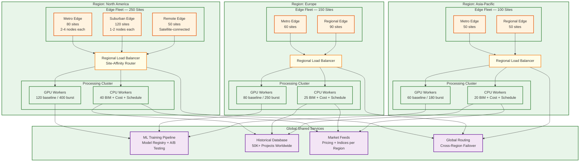

# 13.7 AI-Native Construction & Engineering Platform — Scalability & Reliability

## Multi-Site Scaling Strategy

### Challenge: 500+ Concurrent Sites with Heterogeneous Workloads

Construction sites vary enormously in scale: a residential renovation generates 1,000 images/day with a 50K-element BIM model; a hospital campus generates 200,000 images/day with a 2M-element model. The platform must scale across 500+ sites that range from 10x to 1x the baseline resource requirement, with workload patterns that are highly time-zone dependent (all sites in a region peak simultaneously during morning planning hours) and seasonal (construction activity drops 40% in winter in northern climates).

### Architecture: Multi-Region Deployment with Edge Fleets



Each site's data is partitioned by `site_id` across all storage layers, ensuring data locality and enabling site-level isolation for security and compliance. Processing workloads use site-affinity scheduling: a site's photogrammetry batch is assigned to the same GPU worker pool across days, maintaining cached intermediate results (camera calibration parameters, spatial index, reference point clouds) that reduce processing time by 30–40% compared to cold-start processing on a random worker.

Burst scaling handles the daily processing wave: when 200 sites in the same time zone upload their end-of-shift imagery simultaneously (typically 5–7 PM local time), the GPU worker pool scales from baseline (50 GPUs) to peak (200 GPUs) using preemptible instances. The scheduler prioritizes sites with critical-path activities (identified by the risk prediction engine) and sites approaching milestone deadlines, processing lower-priority sites during off-peak hours (overnight).

### Storage Tiering for Petabyte-Scale Imagery

```
Hot tier (SSD-backed object store):
  - Current day's captures (awaiting processing): ~45 TB
  - Last 7 days processed point clouds: ~50 TB
  - Active BIM models (all versions): ~5 TB
  - Safety alert clips (30 days): ~750 TB
  Total hot: ~850 TB

Warm tier (HDD-backed object store):
  - 30-day image archive: ~1.35 PB
  - 90-day point cloud archive: ~600 TB
  - Historical progress snapshots: ~200 TB
  Total warm: ~2.15 PB

Cold tier (archival storage):
  - Project lifetime imagery (regulatory retention): varies
  - Completed project archives: ~5 PB cumulative
  - Compliance audit trails: ~5 TB
  Total cold: ~5 PB+

Lifecycle policy:
  - Images: hot (7 days) → warm (30 days) → cold (project completion + 7 years)
  - Point clouds: hot (7 days) → warm (90 days) → cold (project completion + 3 years)
  - Safety clips: hot (30 days) → cold (project completion + 10 years for litigation)
  - BIM models: hot (active project) → cold (project completion + 15 years)
```

---

## Edge Compute Resilience

### Autonomous Operation During Connectivity Loss

Construction sites experience frequent connectivity disruptions: fiber cuts during excavation, cellular congestion in urban areas, weather-related outages, and simply poor coverage in remote locations. The edge compute layer must maintain full safety monitoring capability and buffer progress data during outages lasting up to 24 hours.

**Safety monitoring (zero-interruption):** The safety CV pipeline runs entirely on edge hardware with no cloud dependency. All model weights, zone configurations, and alert rules are cached locally. Safety alerts fire via local mechanisms: site-level siren systems connected via hardwired relay, supervisor mobile alerts via local Wi-Fi mesh network, and LED warning signs at zone boundaries controlled by the edge cluster. The edge stores up to 48 hours of safety events in local storage, forwarding to the cloud when connectivity resumes with causal ordering preserved by monotonic event IDs and GPS-synchronized timestamps.

**Progress data buffering:** 360-degree captures continue to local storage (10 TB per edge node) during outages. The edge runs a lightweight "quick-scan" progress assessment using pre-cached BIM geometry, providing approximate progress updates to the site team via the local field app. Full photogrammetry processing defers to cloud restore. Upload priority on reconnection: safety events first, then progress imagery by floor priority (critical path floors first).

**Configuration synchronization:** Edge nodes pull configuration updates (zone boundaries, PPE requirements, model updates) during a daily sync window. If the sync fails, the previous configuration remains active with a "stale configuration" flag visible to the site safety officer. Configuration changes never take effect without successful validation on the edge (test images produce expected results).

### Edge Hardware Fault Tolerance

```
Standard edge cluster per site:
  - 4 edge compute nodes (each with 6 inference GPUs)
  - Redundancy: N+1 (3 nodes handle full load; 1 standby)
  - Local storage: 10 TB NVMe per node (40 TB total)
  - UPS: 4-hour battery backup per node
  - Network: dual uplinks (primary fiber/cable + cellular failover)
  - Environmental: IP65-rated enclosures, -20°C to 50°C operating range

Failure modes and recovery:
  - Single GPU failure: workload redistributed to remaining GPUs on same node
  - Full node failure: standby node activated; camera feeds rebalanced in <60 seconds
  - Storage failure: RAID-10 on each node; degraded operation continues
  - Power failure: UPS provides 4 hours; graceful shutdown saves state to persistent storage
  - Total edge failure: safety monitoring degrades to camera recording only (NVR fallback);
    processing defers entirely to cloud on connectivity restore
```

---

## Processing Pipeline Scalability

### Photogrammetry Pipeline: GPU Compute Scaling

The photogrammetry pipeline is the largest compute consumer, requiring 10,000 GPU-hours per day across 500 sites. The pipeline is embarrassingly parallel at the zone level: each zone's 200 images are processed independently, enabling linear scaling with GPU count.

```
Scaling model:
  Base load: 500 sites × 300 zones/site × 2 min/zone = 300,000 zone-minutes/day
  = 5,000 GPU-hours/day at 1x throughput
  With SfM overhead (feature matching, bundle adjustment): 2x multiplier
  Total: 10,000 GPU-hours/day

  Baseline GPU pool: 50 GPUs (running 20h/day = 1,000 GPU-hours)
  Peak burst pool: 200 GPUs (preemptible/spot, 4-hour evening burst)
  Burst capacity: 200 × 4h = 800 GPU-hours per burst window
  Remaining: overnight processing on baseline pool

  Cost optimization:
    Baseline (reserved instances): ~60% of compute cost
    Burst (preemptible instances): ~30% of compute cost (70% discount)
    On-demand fallback: ~10% for SLO-critical catch-up
```

### BIM Processing: Memory-Bound Scaling

BIM clash detection is memory-bound rather than compute-bound: a 2M-element model with spatial index requires ~16 GB of RAM for the R-tree plus ~32 GB for tessellated geometry. The processing is I/O intensive during model parsing (reading multi-GB IFC files) and compute-intensive during geometry intersection. Each BIM processing worker is provisioned with 64 GB RAM and 16 CPU cores. Workers are statefully assigned to projects: the same worker handles all model updates for a given project, maintaining the spatial index in memory across incremental updates (avoiding the 3-minute index rebuild on every update).

```
Scaling model:
  500 projects × average 5 model updates/week = 2,500 updates/week
  Incremental update processing: ~30 seconds per update
  Full model re-clash: ~10 minutes per model, 500 times/month
  Total: 2,500 × 0.5 min + 500 × 10 min = 6,250 minutes/week ≈ 104 hours/week

  Baseline workers: 10 (easily handles steady state)
  Peak: month-end coordination deadlines may spike to 50 concurrent updates
  Auto-scale to 25 workers during coordination weeks
```

### Cost Estimation: Compute-Bound Monte Carlo

Monte Carlo simulation with 10,000 scenarios across 500K elements is CPU-intensive but highly parallelizable. Each scenario is independent: sample cost drivers from joint distribution, compute element costs, sum to project total. The 10,000 scenarios are distributed across 100 workers (100 scenarios each), completing in ~2 seconds per worker for a total wall-clock time of ~3 minutes including overhead.

```
Scaling model:
  Per estimate: 100 workers × 2 seconds = 200 worker-seconds
  Daily estimates across all projects: ~200 (design changes + scheduled refreshes)
  Daily compute: 200 × 200 seconds = 40,000 worker-seconds ≈ 11 worker-hours
  Minimal baseline of 5 workers handles all steady-state estimates
  Burst to 100 workers for individual estimate computation
```

---

## Reliability Engineering

### Failure Domain Isolation

The platform operates across three failure domains with independent reliability targets:

| Domain | Components | Availability Target | Failure Impact |
|---|---|---|---|
| **Safety-critical (edge)** | Safety CV, alert dispatch, zone monitoring | 99.99% | Life safety risk; unacceptable for any duration |
| **Operational (cloud)** | Progress tracking, scheduling, digital twin | 99.9% | Project management degraded; catch-up possible |
| **Analytical (cloud)** | Cost estimation, risk prediction, analytics | 99.5% | Decision support delayed; no immediate project impact |

Each domain has independent infrastructure: safety-critical components run on dedicated edge hardware with no shared dependencies on cloud services. Operational services run on a dedicated cloud cluster with auto-scaling and multi-zone deployment. Analytical services run on shared infrastructure with lower priority and graceful degradation.

### Data Durability and Recovery

```
Imagery (regulatory requirement):
  - Primary: object store with cross-region replication (RPO: 0)
  - Edge buffer: local NVMe with 48-hour retention (survives cloud outage)
  - Archive: cold storage with 7-year retention minimum
  - Recovery: edge re-upload from local buffer if cloud write fails

BIM models (intellectual property):
  - Primary: versioned storage with per-element change tracking
  - Backup: daily snapshots to separate region
  - Recovery: model version history enables rollback to any point

Safety audit trail (legal requirement):
  - Primary: append-only log with cryptographic chaining
  - Replication: synchronous write to two regions
  - Tamper detection: hash chain verified daily; alert on any inconsistency
  - Retention: project lifetime + 10 years (litigation statute of limitations)

Progress data:
  - Primary: time-series database with daily snapshots
  - Backup: weekly full backup + daily incrementals
  - Recovery: rebuild from imagery (reprocess) if database fails
```

### Graceful Degradation Hierarchy

When resources are constrained or components fail, the platform degrades in a predictable priority order:

```
Priority 1 (never degrade): Safety monitoring, safety alerts
Priority 2 (degrade last): Progress tracking, schedule updates
Priority 3 (degrade early): Cost re-estimation, risk score refresh
Priority 4 (degrade first): Analytics dashboards, report generation, digital twin rendering

Example degradation scenario — cloud processing overload:
  1. Suspend report generation and analytics queries
  2. Reduce risk score refresh from 15-min to hourly
  3. Delay cost re-estimation to overnight batch
  4. Continue progress tracking at full throughput (SLO-critical)
  5. Safety monitoring unaffected (edge-only)
```

---

## Capacity Planning and Growth

### Horizontal Scaling Triggers

| Metric | Scale-Up Trigger | Scale-Down Trigger | Scaling Unit |
|---|---|---|---|
| GPU queue depth (photogrammetry) | > 500 zones queued | < 100 zones queued | +/- 10 GPU instances |
| BIM worker memory utilization | > 80% across pool | < 40% across pool | +/- 2 BIM workers |
| Image ingestion queue lag | > 2 hours behind | < 30 minutes behind | +/- 5 ingestion workers |
| Safety event processing lag | > 5 seconds | < 1 second | +/- 3 event processors |
| API response latency p99 | > 2 seconds | < 500 ms | +/- 2 API servers |

### Per-Site Resource Provisioning

```
Small site (residential, < 50K sq ft):
  Edge: 1 compute node, 2 GPUs, 2 cameras
  Cloud: shared worker pool allocation

Medium site (commercial, 50K-500K sq ft):
  Edge: 2 compute nodes, 8 GPUs, 50 cameras
  Cloud: dedicated BIM worker, shared GPU pool

Large site (hospital/airport, > 500K sq ft):
  Edge: 4 compute nodes, 24 GPUs, 200 cameras
  Cloud: dedicated BIM worker, dedicated GPU allocation, priority queue

Mega-project (data center campus, infrastructure):
  Edge: 8 compute nodes, 48 GPUs, 500 cameras + drones
  Cloud: dedicated cluster, priority processing, 24/7 support
```

---

## Back-Pressure Mechanisms

### Image Ingestion Throttling

When 200+ sites upload end-of-shift imagery simultaneously (5–7 PM local time), the ingestion pipeline can receive 500,000+ images in a 2-hour window—exceeding the processing pipeline's real-time capacity. Without back-pressure, the ingestion queue grows unboundedly, exhausting memory and causing cascading failures across the platform.

```
Back-pressure strategy — Image Ingestion:

Layer 1: Edge-side rate control
  - Each edge node enforces a per-site upload rate limit: 500 images/min (configurable by site tier)
  - Excess images are queued locally on the edge node's NVMe storage
  - Priority: safety event clips > critical-path zone imagery > standard zone imagery

Layer 2: Regional ingestion gateway
  - Maintains a token bucket per region: 50,000 images/min aggregate capacity
  - When bucket is empty, edge nodes receive HTTP 429 with Retry-After header
  - Edge nodes exponentially back off, deferring non-critical uploads

Layer 3: Queue depth monitoring
  - If photogrammetry queue depth exceeds 10,000 zones (4-hour backlog), the system:
    (a) Stops accepting new non-critical uploads
    (b) Scales GPU workers to burst capacity
    (c) Alerts operations team if queue depth exceeds 20,000 zones

Layer 4: Graceful shedding
  - Under extreme load, low-priority processing is shed entirely:
    (a) NeRF/3DGS rendering deferred to overnight
    (b) Analytics refresh paused
    (c) Non-critical BIM re-clash deferred to next maintenance window
```

### GPU Queue Management

GPU workers are the scarcest and most expensive resource. The GPU queue manager implements priority-based scheduling with preemption:

```
GPU Queue Priority (descending):

P0 — Safety model emergency reload (after rollback detection)
     Preempts: everything
     Max queue time: 0 (immediate)

P1 — Critical-path zone photogrammetry (schedule-driven urgency)
     Preempts: P3 and below
     Max queue time: 30 minutes

P2 — Standard zone photogrammetry (daily processing SLO)
     Preempts: P3 only
     Max queue time: 4 hours

P3 — NeRF/3DGS scene reconstruction (stakeholder visualization)
     Preempts: nothing
     Max queue time: 24 hours (best-effort)

P4 — ML training jobs (model improvement)
     Preempts: nothing
     Max queue time: unbounded (runs during overnight idle)

Preemption mechanics:
  - Preempted jobs checkpoint their state to persistent storage
  - When the higher-priority job completes, preempted jobs resume from checkpoint
  - SfM jobs checkpoint after feature extraction (60% of compute)
  - NeRF/3DGS jobs checkpoint every 1,000 training iterations
```

### BIM Processing Rate Limiting

BIM model updates from design teams can arrive in bursts (coordination deadline: all disciplines submit updated models on Friday afternoon). The BIM processing pipeline limits concurrent model parses to prevent memory exhaustion:

```
BIM rate limiting:

Concurrent parse limit: 10 models (each requires 32-64 GB RAM)
Queue overflow strategy:
  - Queue depth > 20: alert BIM team, suggest staggering uploads
  - Queue depth > 50: reject new uploads with "system busy" and ETA
  - Priority: manual upload > automated sync > scheduled refresh

Per-project cooldown: 15-minute minimum between consecutive model versions
  - Prevents "save-happy" BIM authors from triggering dozens of parses
  - Coalesces rapid edits into a single parse of the latest version
```

---

## Chaos Engineering Experiments

### Experiment 1: Edge Connectivity Loss

**Hypothesis:** Safety monitoring continues uninterrupted during a 24-hour cloud connectivity outage. Progress data buffers locally and synchronizes correctly on reconnection.

**Method:** Inject a firewall rule on the edge VPN interface that blocks all outbound traffic to the cloud management plane while allowing local network (camera VLAN) traffic to continue. Run for 24 hours during an active construction day.

**Validation Criteria:**
- Safety alerts fire locally via siren and Wi-Fi push within 500 ms SLO: PASS/FAIL
- Zero safety events are lost (compare edge buffer count vs. cloud receipt count post-reconnection): PASS/FAIL
- Progress imagery accumulates on edge NVMe without overflow (10 TB capacity for 24 hours): PASS/FAIL
- On reconnection, buffered data uploads in priority order (safety first) and cloud state converges within 2 hours: PASS/FAIL
- No duplicate events after reconnection (idempotency via monotonic event IDs): PASS/FAIL

### Experiment 2: GPU Node Failure During Inference

**Hypothesis:** Safety CV inference fails over to surviving GPU nodes within 60 seconds, maintaining camera coverage for all critical zones.

**Method:** Kill the GPU process on one of four edge compute nodes during peak activity hours (200+ workers on site). Monitor camera feed coverage, alert latency, and tracker continuity.

**Validation Criteria:**
- Cameras assigned to the failed node are reassigned to surviving nodes within 60 seconds: PASS/FAIL
- Frame rate may drop (from 15 FPS to 10 FPS per camera) but no camera goes unmonitored: PASS/FAIL
- Existing tracks are re-acquired by the new processing node within 5 seconds (tracker handoff): PASS/FAIL
- No false alerts generated during the failover window: PASS/FAIL

### Experiment 3: BIM Database Corruption

**Hypothesis:** The platform detects BIM database corruption and fails over to the last valid snapshot without serving corrupted data to any downstream consumer.

**Method:** Inject random byte corruption into 5% of BIM element records in the primary database. Monitor clash detection, progress tracking, and cost estimation for error detection.

**Validation Criteria:**
- Data integrity checks detect corruption within 5 minutes: PASS/FAIL
- No corrupted data is served to the progress tracking pipeline or cost estimator: PASS/FAIL
- System fails over to read-replica or snapshot within 10 minutes: PASS/FAIL
- Automated recovery (restore from snapshot + replay WAL) completes within 1 hour: PASS/FAIL

### Experiment 4: Drone Data Feed Interruption

**Hypothesis:** Partial loss of drone survey data does not prevent progress tracking for the affected area; the system detects incomplete coverage and requests re-survey.

**Method:** During an autonomous drone survey, kill the data upload connection after 60% of the flight path is completed. The remaining 40% of imagery is lost.

**Validation Criteria:**
- The photogrammetry pipeline processes available imagery and produces partial coverage: PASS/FAIL
- Coverage gap is detected and flagged in the progress dashboard with specific zones identified: PASS/FAIL
- An automated re-survey request is generated for the missed zones: PASS/FAIL
- Progress data for zones with adequate coverage is published normally (not blocked by partial failure): PASS/FAIL

### Experiment 5: Cost Database Stale Data

**Hypothesis:** If the market price feed stops updating (stale data), cost estimates are flagged as potentially inaccurate rather than silently using outdated prices.

**Method:** Stop the market feed ingestion service. Monitor cost estimation behavior over 48 hours as price indices become increasingly stale.

**Validation Criteria:**
- After 4 hours of stale data, cost estimates include a "stale pricing" warning: PASS/FAIL
- After 24 hours, estimates use the last known price with a confidence interval widened by 2x: PASS/FAIL
- After 48 hours, new cost estimates are blocked and users see "pricing data unavailable" with the last valid estimate timestamp: PASS/FAIL
- Alert fires to the operations team within 30 minutes of feed interruption: PASS/FAIL

---

## Disaster Recovery

### RTO / RPO Targets by Service Tier

| Service | RPO (Data Loss Tolerance) | RTO (Recovery Time) | Recovery Strategy |
|---|---|---|---|
| **Safety monitoring (edge)** | 0 (no data loss) | 60 seconds (local failover) | N+1 edge node redundancy; NVR fallback recording |
| **Safety audit trail** | 0 | 15 minutes | Synchronous replication to secondary region |
| **BIM model store** | 1 hour | 30 minutes | Cross-region async replication; hourly snapshots |
| **Progress tracking data** | 4 hours | 2 hours | Daily snapshots + WAL replay; rebuild from imagery if needed |
| **Cost estimation engine** | 24 hours | 4 hours | Daily backup; historical DB rebuild from source data |
| **Schedule optimizer** | 1 hour | 1 hour | Active-passive failover; state checkpoint every hour |
| **Market price feeds** | 0 (external source) | 30 minutes | Secondary feed provider failover |
| **Analytics / reporting** | 24 hours | 8 hours | Lowest priority; rebuild from primary data stores |

### Cross-Region Failover Procedure

```
Region failure scenario (e.g., NA region outage):

Phase 1: Detection (0-5 minutes)
  - Global routing health check fails for NA endpoints (3 consecutive failures)
  - Automated failover decision after 5-minute hold (avoid false positives from transient issues)

Phase 2: Edge isolation (immediate)
  - Edge nodes in NA continue autonomous operation (safety monitoring, data buffering)
  - Edge nodes switch VPN endpoint to EU region for management traffic
  - Increased upload latency (150 ms → 400 ms) but functional

Phase 3: Cloud failover (5-30 minutes)
  - EU region activates NA standby capacity (pre-provisioned warm instances)
  - BIM database read-replica in EU promoted to primary for NA projects
  - GPU worker pool in EU scales to accommodate NA workload (burst capacity)
  - API traffic for NA projects routes through EU region via global load balancer

Phase 4: Data reconciliation (post-recovery, 1-24 hours)
  - When NA region recovers, a reconciliation process merges any writes
    that occurred in both regions during the split-brain window
  - BIM model conflicts resolved by version timestamp (latest wins)
  - Progress data conflicts resolved by merging (union of updates)
  - Safety events are append-only (no conflict possible)

Phase 5: Failback (24-48 hours)
  - Traffic gradually shifted back to NA region (10% → 25% → 50% → 100%)
  - EU standby capacity scaled down after full failback
```

---

## Capacity Planning: 5-Year Growth Projections

### Growth Assumptions

```
Year 1 (current):  500 active sites,  10K daily users,   50 PB cumulative data
Year 2:            900 active sites,  20K daily users,  120 PB cumulative data
Year 3:          1,500 active sites,  40K daily users,  250 PB cumulative data
Year 4:          2,200 active sites,  70K daily users,  450 PB cumulative data
Year 5:          3,000 active sites, 100K daily users,  750 PB cumulative data

Growth drivers:
  - Geographic expansion (MEA, LATAM regions added Y2-Y3)
  - Infrastructure mega-project adoption (highways, railways, airports)
  - Retrofit/renovation market penetration (smaller sites, higher count)
  - NeRF/3DGS visualization driving owner/stakeholder adoption
```

### Compute Scaling Plan

| Resource | Year 1 | Year 2 | Year 3 | Year 4 | Year 5 |
|---|---|---|---|---|---|
| **GPU workers (baseline)** | 260 | 480 | 800 | 1,200 | 1,600 |
| **GPU workers (burst)** | 830 | 1,500 | 2,500 | 3,700 | 5,000 |
| **CPU workers (BIM + cost)** | 85 | 155 | 260 | 385 | 520 |
| **Edge clusters deployed** | 500 | 900 | 1,500 | 2,200 | 3,000 |
| **Edge GPUs deployed** | 5,000 | 9,500 | 16,000 | 24,000 | 33,000 |
| **Total storage (hot+warm)** | 3 PB | 7 PB | 15 PB | 28 PB | 48 PB |
| **Total storage (cold)** | 5 PB | 15 PB | 35 PB | 70 PB | 120 PB |
| **Network egress/day** | 50 TB | 100 TB | 200 TB | 350 TB | 500 TB |

### Cost Efficiency Targets

```
Year 1 baseline cost per site per month: $4,200
  Breakdown: cloud compute 45%, edge hardware amortization 30%, storage 15%, network 10%

Target cost trajectory:
  Year 2: $3,600/site/month (-15%) — GPU efficiency gains, storage tiering optimization
  Year 3: $3,100/site/month (-14%) — model distillation reducing edge GPU requirements
  Year 4: $2,700/site/month (-13%) — higher utilization from geographic diversity (follow-the-sun)
  Year 5: $2,400/site/month (-11%) — next-gen edge hardware, improved compression

Key levers:
  - Model distillation: reduce safety CV model size by 40% while maintaining accuracy → fewer GPUs per site
  - Adaptive capture frequency: skip captures in zones with no active work → 30% fewer images
  - Tiered processing: small residential sites use lightweight pipeline (no NeRF, simplified SfM)
  - Follow-the-sun GPU sharing: NA burst GPUs serve APAC overnight processing and vice versa
```

## AI Release Ladder

Every AI model or capability change in this system MUST follow this rollout sequence:

| Stage | Description | Gate Criteria |
|-------|-------------|---------------|
| 1. Offline Evaluation | Benchmark against historical ground truth | Meets baseline metrics |
| 2. Shadow Mode | Run in parallel with production, compare outputs | No regression on key metrics |
| 3. Canary (Blast-Radius Capped) | 1-5% traffic, human review of all outputs | Error rate < threshold |
| 4. Human-Reviewed Production | AI recommends, human approves all actions | Approval rate > 90% |
| 5. Limited Autonomous Production | AI acts within pre-approved boundaries | Continuous monitoring, no alerts |
| 6. Instant Rollback | One-click revert to previous model/rules | < 5 min rollback time |

**Note:** Model updates affecting core business recommendations (predictions, classifications, rankings) must reach Stage 4 (human-reviewed production) before any customer-impacting deployment. Stage 5 limited autonomy applies only to low-risk, well-bounded recommendation categories with established rollback procedures.
