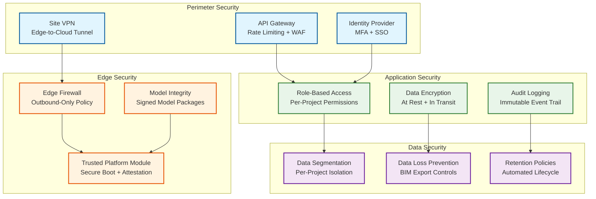

# 13.7 AI-Native Construction & Engineering Platform — Security & Compliance

## Threat Model

### Construction-Specific Attack Surfaces

Construction platforms face unique security challenges beyond typical enterprise software:

| Threat Vector | Attack Scenario | Impact |
|---|---|---|
| **BIM model theft** | Competitor or adversary extracts proprietary building designs, structural details, or security system layouts | Intellectual property loss; national security risk for government/defense projects |
| **Cost data exfiltration** | Subcontractor pricing, bid strategies, or internal cost estimates leaked to competitors | Competitive disadvantage; bid manipulation; contract disputes |
| **Safety system tampering** | Attacker disables safety alerts or modifies exclusion zones, creating unmonitored hazard areas | Worker injury or death; criminal liability; regulatory penalties |
| **Progress data manipulation** | Falsified progress reports to trigger milestone payments for incomplete work | Financial fraud; project delays when actual status is discovered |
| **Edge device compromise** | Physical access to site-deployed edge nodes enables malware installation or data extraction | Lateral movement to cloud systems; safety monitoring disruption; data theft |
| **Drone hijacking** | Unauthorized control of survey drones; interception of aerial imagery | Physical damage from drone crash; site surveillance for theft planning |
| **Supply chain attack** | Compromised CV model update deploys poisoned weights that degrade safety detection accuracy | Gradual increase in undetected safety violations; difficult to detect |

---

## Security Architecture

### Multi-Layer Defense



### Edge Device Security

Edge compute nodes are physically accessible on construction sites—a unique security challenge compared to data-center-deployed infrastructure. The security model assumes physical compromise is possible and implements defense-in-depth:

**Secure boot chain:** Each edge node uses a Trusted Platform Module (TPM) to verify the boot sequence from firmware through operating system to application containers. If any component fails attestation (indicating tampering), the node refuses to boot and alerts the cloud management plane.

**Encrypted storage:** All local data (safety clips, buffered imagery, cached BIM models) is encrypted with keys stored in the TPM. Physical disk removal yields only encrypted data. Keys are rotated weekly during the cloud sync window.

**Network isolation:** Edge nodes communicate only with the cloud management plane via an encrypted VPN tunnel. No inbound connections are accepted. The firewall policy is outbound-only with allowlisted destinations. Camera feeds are received on a physically separate network interface connected to the site's camera VLAN.

**Model integrity verification:** CV model updates are cryptographically signed by the training pipeline. The edge node verifies the signature against a trusted public key embedded in the TPM before loading any model. This prevents supply chain attacks where a compromised update mechanism could deploy poisoned model weights.

**Anti-tamper monitoring:** Chassis intrusion sensors, GPS location monitoring (alert if node moves from registered site location), and heartbeat monitoring (alert if node goes silent for >15 minutes during active hours) provide physical security telemetry.

### Drone Security

Survey drones are high-value mobile assets operating in sensitive airspace above active construction sites. They carry cameras, LiDAR, and GPS receivers that produce high-resolution imagery of buildings, infrastructure, and surrounding areas—making them attractive targets for hijacking, interception, or spoofing.

**Flight path encryption:** Planned flight paths (GPS waypoints, altitude profiles, camera trigger points) are encrypted at rest on the drone's flight controller and in transit between the ground control station and the drone. The encryption uses pre-shared symmetric keys provisioned during drone registration with the platform. This prevents an attacker who intercepts the command link from learning the survey pattern (which reveals site layout and security coverage).

**Anti-hijacking measures:** The drone's command link uses authenticated, encrypted communication with the ground control station. If the drone loses contact with the authenticated station for >30 seconds, it executes an autonomous return-to-home sequence (not a simple hover, which could leave it vulnerable to physical capture). If the drone detects conflicting command inputs (suggesting an attempted command injection), it enters a safe-mode landing at its current position and alerts the ground station. All command authentication uses per-session keys derived from the drone's TPM, preventing replay attacks from captured command packets.

**Geo-fencing enforcement:** Each drone has a hardware-enforced geo-fence boundary (maximum altitude, horizontal boundary polygon) loaded before each flight. The geo-fence is signed by the platform and verified by the drone's firmware—it cannot be modified via the command link during flight. If GPS indicates the drone has crossed the geo-fence boundary (whether due to wind, navigation error, or deliberate manipulation), the drone executes an immediate controlled descent within the boundary. Geo-fence polygons are defined per project, per flight plan, and include altitude restrictions near occupied buildings, helipads, and restricted airspace.

**Anti-GPS-spoofing:** Drones use multi-constellation GNSS (GPS + GLONASS + Galileo + BeiDou) with receiver autonomous integrity monitoring (RAIM). If the computed position from different constellations diverges by >5 meters (suggesting spoofing on one constellation), the drone flags the position as unreliable and switches to visual-inertial navigation for the return-to-home sequence. Barometric altitude cross-check detects altitude spoofing attempts.

### AI Model Security

The platform's AI models (safety CV, progress tracking, cost estimation, schedule optimization) are high-value intellectual property and critical operational infrastructure. Protecting them against adversarial attacks, theft, and poisoning is essential.

**Adversarial attack defense:** The safety CV models are the most security-critical. An adversary could craft physical adversarial patches (printed patterns affixed to clothing or equipment) that cause the model to misclassify PPE status—making a worker without a hard hat appear compliant to the CV system. The platform defends against this through: (1) adversarial training that augments the training set with known adversarial patterns, (2) ensemble inference that runs two architecturally different models and flags disagreements for human review, (3) temporal consistency checks that flag sudden PPE status changes not correlated with physical motion (a hard hat does not appear and disappear between consecutive frames).

**Model poisoning detection:** ML models retrained on new data are vulnerable to poisoning—corrupted training samples that degrade model accuracy in targeted scenarios. The platform implements: (1) training data provenance tracking (every training sample links to its source project, capture date, and labeling user), (2) holdout validation on curated benchmark datasets that are never included in training, (3) automated regression testing comparing the new model against the previous model on 1,000+ test scenarios, (4) staged rollout (new models deploy to 5% of edge nodes for 48 hours before wider deployment), and (5) continuous accuracy monitoring with automatic rollback if accuracy drops below baseline.

**Model watermarking:** All exported models (edge-deployed inference models, transferred models for offline use) contain steganographic watermarks that encode the model version, deployment target, and authorized licensee. If a model is extracted from an edge device and redistributed, the watermark enables forensic identification of the source. Watermarks are embedded in the model weights using a technique that survives quantization and fine-tuning.

### Supply Chain Security

The platform integrates with BIM authoring software, material suppliers, subcontractor systems, and IoT device manufacturers—each representing a supply chain attack surface.

**BIM software integration security:** IFC files imported from third-party BIM authoring tools are parsed in a sandboxed environment. The parser operates with no network access and limited file system access, preventing a maliciously crafted IFC file from exploiting parser vulnerabilities to achieve remote code execution. All imported IFC files are virus-scanned and validated against the IFC schema before processing.

**Third-party data feed validation:** Market price feeds, weather data, and material delivery tracking data from external providers are validated for schema conformance, value range plausibility, and temporal consistency before ingestion. A sudden 10x change in steel prices from a single feed triggers a cross-reference check against alternative sources before the data is used in cost estimation. Feed authentication uses mutual TLS with certificate pinning.

**IoT device supply chain:** Edge compute nodes, cameras, and drones are procured from vetted manufacturers with verified firmware supply chains. Firmware updates are distributed exclusively through the platform's signed update channel. The platform maintains a device inventory with firmware version tracking; devices running outdated or unrecognized firmware versions are quarantined from the network until verified.

---

## Access Control

### Role-Based Permission Matrix

| Role | BIM Models | Cost Data | Safety Data | Progress Data | Schedule | Admin |
|---|---|---|---|---|---|---|
| **Project Owner** | View + Export | View All | View + Configure | View All | View + Edit | Full |
| **General Contractor PM** | View + Edit | View (own scope) | View + Configure | View + Edit | View + Edit | Project-level |
| **Subcontractor Lead** | View (own discipline) | View (own trades) | View (own zones) | View (own scope) | View (own activities) | None |
| **Safety Officer** | View (structural) | None | Full Access | View | None | Safety config |
| **Site Engineer** | View + Edit | View (budget vs actual) | View | View + Edit | View + Edit | None |
| **Owner's Representative** | View + Export | View All | View (summary) | View All | View | Audit access |
| **Inspector** | View (relevant scope) | None | View (inspection areas) | View (inspection items) | None | None |
| **Field Worker (mobile)** | View (assigned area) | None | View (own alerts) | Update (own tasks) | None | None |

### BIM Intellectual Property Protection

BIM models are high-value intellectual property. The platform implements granular access controls:

**Per-element permissions:** Structural engineers see full structural details but only reference geometry for MEP systems. MEP subcontractors see their discipline's elements plus adjacent structural elements (for clash coordination) but not architectural finishes or cost data. This is enforced at the query layer—the BIM database returns only elements authorized for the requesting user's role and project assignment.

**Export controls:** BIM model exports (IFC, DWG, PDF) are watermarked with the requesting user's identity and a timestamp. Exports of full models require project owner approval. Partial exports (single discipline or floor) are allowed within role permissions but logged for audit. Defense/government projects use enhanced controls: no export without explicit owner authorization per instance, and exported files are encrypted with time-limited decryption keys.

**View-only rendering:** For stakeholders who need to visualize the model but should not receive the underlying geometry data, the platform provides a server-side rendering mode. The BIM geometry is rendered on the server, and only rasterized images (not 3D geometry) are transmitted to the client. This prevents geometry extraction from the client application.

---

## Compliance Framework

### Construction-Specific Regulations

| Regulation | Scope | Platform Compliance Measure |
|---|---|---|
| **OSHA 29 CFR 1926** | Construction safety standards (US) | Automated safety monitoring; incident documentation; exposure tracking; required training verification |
| **ISO 19650** | BIM information management standard | Model federation rules; information exchange protocols; security-minded approach per ISO 19650-5 |
| **GDPR / Local Privacy Laws** | Worker data protection | No facial recognition for productivity; anonymized safety analytics; data minimization for worker tracking |
| **Building Code Compliance** | Local building codes and standards | BIM code checking for accessible route compliance, fire egress, structural clearances |
| **Environmental Regulations** | Construction environmental impact | Noise monitoring, dust level tracking, stormwater compliance via IoT sensors |
| **Records Retention** | Construction document retention requirements | Automated lifecycle policies: project documents retained 7–15 years per jurisdiction |
| **Prevailing Wage / Labor Laws** | Labor compliance on public projects | Work hour tracking (aggregate, not individual); overtime alerts; certified payroll support |

### Worker Privacy Protection

Construction worker privacy is a critical ethical and legal concern. The platform enforces strict privacy boundaries:

**No facial recognition:** The safety CV system detects workers as bounding boxes with PPE attributes. Worker tracking uses multi-object tracking (MOT) with appearance-based re-identification that operates on clothing color, height, and body shape—not facial features. Track IDs are session-local and reset daily; there is no persistent worker identity linked to CV detections.

**Aggregate productivity only:** The platform tracks zone-level productivity (work installed per zone per day) rather than individual worker productivity. Subcontractor performance scoring uses crew-level metrics (crew of 5 installed 100 linear meters of duct today) not individual metrics. This satisfies operational needs while respecting worker dignity and labor law.

**Data minimization:** Safety video clips are retained for 30 days (for incident investigation) and then auto-deleted unless flagged for a specific incident report. Raw video feeds are never stored; only keyframes and alert clips are persisted. IoT sensor data is aggregated to 15-minute intervals after 7 days, destroying per-second granularity.

**Consent and transparency:** Workers are notified that safety monitoring cameras are active via clearly visible signage at site entry points. The system's capabilities (PPE detection, zone monitoring) and limitations (no facial recognition, no individual tracking) are disclosed in the project safety plan distributed to all workers.

### Worker Safety Data Ethics — Expanded Privacy Controls

Beyond basic privacy protections, the platform enforces ethical boundaries on how safety data can be used, preventing mission creep from safety monitoring into worker surveillance:

**Prohibited uses (system-enforced):**
- No individual worker productivity measurement derived from CV data (e.g., "Worker A spent 20 minutes idle")
- No attendance tracking using CV re-identification (the system does not know which worker is which)
- No behavioral scoring that could be used for hiring/firing decisions
- No aggregation of safety violation data at the individual level (only at crew/subcontractor level)
- No export of raw video or image crops that could identify individual workers to third parties

**Technical enforcement:**
- The CV pipeline's output schema physically cannot represent individual worker identity—the track ID is a session-local integer that resets daily and cannot be joined to any HR or payroll system.
- Safety violation alerts contain zone, violation type, timestamp, and an anonymized bounding box image (face region blurred at the edge before any data leaves the camera pipeline). The blur is irreversible—applied before storage, not as a display filter.
- Data access audit logs are reviewed monthly by the project's labor relations committee (in jurisdictions where labor representatives participate in safety monitoring governance).
- An independent ethics review board evaluates proposed new CV capabilities before deployment, assessing potential for misuse beyond the stated safety purpose.

**Worker opt-out and grievance:**
- Workers cannot opt out of zone safety monitoring (it is a safety requirement), but they can request a review of any safety alert attributed to their work area. The review process is handled by the safety officer, not the CV system.
- Grievance procedure: any worker who believes the system was used for surveillance (beyond its stated safety purpose) can file a complaint with the project safety committee. The audit trail enables investigation of any data access that may constitute misuse.

---

## ISO 27001 / SOC 2 Compliance Mapping

### ISO 27001 Control Mapping for Construction Platforms

| ISO 27001 Control | Implementation in Platform |
|---|---|
| **A.5 Information Security Policies** | Security policy embedded in platform configuration; per-project security profiles enforcing classification levels; automated policy compliance checking |
| **A.6 Organization of Information Security** | Role-based security responsibilities mapped to construction roles (BIM manager, safety officer, PM); security incident escalation chain integrated with project governance |
| **A.7 Human Resource Security** | User provisioning tied to project assignment lifecycle; automatic deprovisioning on project completion; mandatory security training verification before BIM access |
| **A.8 Asset Management** | Edge device inventory with GPS tracking; BIM model classification and labeling; automated data lifecycle management per retention policy |
| **A.9 Access Control** | Per-element BIM permissions; role-based matrix (see Access Control section); MFA enforcement; session timeout on field devices (15 min) |
| **A.10 Cryptography** | AES-256 at rest for all tiers; TLS 1.3 in transit; TPM-backed key storage on edge; model signing with managed KMS |
| **A.11 Physical Security** | Edge node anti-tamper sensors; GPS geo-fencing; chassis intrusion detection; IP65-rated enclosures |
| **A.12 Operations Security** | Immutable audit trail; automated vulnerability scanning on edge firmware; change management for model deployments |
| **A.13 Communications Security** | VPN tunnel for edge-to-cloud; network segmentation (camera VLAN, management VLAN, data VLAN); firewall allowlisting |
| **A.14 System Development** | Signed model packages; sandboxed IFC parsing; input validation on all external data feeds |
| **A.16 Incident Management** | Automated incident detection; playbook-driven response (see Incident Response Playbooks); post-incident review process |
| **A.17 Business Continuity** | Edge autonomous operation; cross-region failover; disaster recovery procedures with defined RTO/RPO |
| **A.18 Compliance** | Automated compliance checking against OSHA 1926, ISO 19650, GDPR; audit report generation on demand |

### SOC 2 Trust Services Criteria Mapping

| Criteria | Category | Platform Implementation |
|---|---|---|
| **CC6.1** | Logical Access | Per-project, per-role, per-element access control; MFA; SSO integration |
| **CC6.2** | System Boundary | Edge-to-cloud VPN; API gateway with WAF; network segmentation |
| **CC6.3** | Access Provisioning | Automated provisioning from project management system; just-in-time access for inspectors |
| **CC7.1** | System Monitoring | Real-time security event monitoring; anomaly detection on data access patterns |
| **CC7.2** | Incident Detection | Automated detection of unusual export volumes, anomalous access locations, bulk queries |
| **CC7.3** | Incident Response | Playbook-driven response; automated containment (session kill, account lock); audit trail |
| **CC8.1** | Change Management | Model deployment pipeline with validation gates; edge firmware update signing |
| **A1.1** | Availability | 99.99% edge safety monitoring; 99.9% cloud operational; defined degradation hierarchy |
| **A1.2** | Recovery | Cross-region failover; edge autonomous operation; defined RTO/RPO per service tier |
| **C1.1** | Confidentiality | Data classification (4 tiers); encryption at rest and in transit; BIM export controls |
| **P1.1** | Privacy | No facial recognition; anonymized safety data; aggregate-only productivity; worker opt-out process |

---

## Data Governance

### Data Classification

| Classification | Examples | Encryption | Access | Retention |
|---|---|---|---|---|
| **Confidential** | BIM models, cost estimates, bid data, subcontractor pricing | AES-256 at rest; TLS 1.3 in transit | Named individuals with need-to-know | Project + 15 years |
| **Restricted** | Safety incident details, worker tracking data, inspection reports | AES-256 at rest; TLS 1.3 in transit | Role-based per project | Project + 10 years |
| **Internal** | Progress reports, schedule updates, meeting minutes | AES-256 at rest; TLS 1.3 in transit | Project team members | Project + 7 years |
| **Public** | Project milestone announcements, environmental monitoring summaries | TLS 1.3 in transit | Stakeholder portal access | Project + 3 years |

### Audit Trail Requirements

All security-relevant events generate immutable audit records:

```
AuditRecord:
  record_id:           string          # unique, monotonically increasing
  timestamp:           datetime        # GPS-synchronized
  actor:               string          # user ID or system service ID
  action:              string          # e.g., "BIM_EXPORT", "SAFETY_ZONE_MODIFY"
  resource:            string          # affected resource ID
  project_id:          string
  site_id:             string
  details:             map[string, any] # action-specific metadata
  ip_address:          string
  device_fingerprint:  string
  result:              enum[SUCCESS, DENIED, ERROR]
  previous_hash:       string          # hash chain for tamper detection

Critical audited actions:
  - BIM model upload, download, or export
  - Cost estimate creation, modification, or sharing
  - Safety zone creation, modification, or deletion
  - Safety alert acknowledgment or dismissal
  - User permission changes
  - Edge device configuration updates
  - CV model deployments
  - Schedule baseline changes
  - Progress data manual overrides
```

### Incident Response

**Safety system compromise:** If the safety monitoring system is suspected of compromise (model poisoning, alert suppression), the platform initiates an immediate failover to the previous known-good model version on all affected edge nodes, notifies site safety officers to increase manual inspections, and generates a compliance incident report. All safety events during the suspected compromise window are flagged for manual review.

**Data breach response:** The platform implements automated data breach detection (unusual export volumes, access from anomalous locations, bulk data queries) with automated response: suspect session termination, temporary account lockdown, and incident ticket generation. For BIM model theft, the watermarking system enables forensic tracing of any leaked model back to the exporting user.

---

## Incident Response Playbooks

### Playbook 1: Safety System Compromise

**Trigger conditions:** (1) Safety CV model accuracy drops below 85% threshold on live validation, (2) Edge node attestation failure (TPM reports tampered boot chain), (3) Anomalous alert suppression pattern detected (expected alerts not firing in zones with known worker activity), (4) Supply chain alert from model distribution pipeline.

```
Severity: CRITICAL (P0) — Immediate life-safety risk
Response time: < 15 minutes to containment

Phase 1: Containment (0-15 min)
  1. Roll back all edge nodes to last known-good model version (automated)
  2. Notify site safety officers via push + SMS + phone call
  3. Activate manual safety patrols on all affected sites (safety officer responsibility)
  4. Isolate potentially compromised edge nodes from the network
  5. Enable "heightened alerting" mode (lower confidence thresholds, more false positives acceptable)

Phase 2: Assessment (15-60 min)
  1. Compare current model weights against signed reference (detect tampering)
  2. Analyze alert suppression patterns to identify missed violations
  3. Review edge node access logs for unauthorized physical or network access
  4. Determine scope: single site vs. multi-site, single model vs. pipeline compromise
  5. Review all safety events from the past 24 hours on affected sites for missed incidents

Phase 3: Eradication (1-4 hours)
  1. If model tampering: retrain from verified training data; re-validate on benchmark
  2. If edge compromise: re-image affected nodes from trusted golden image
  3. If pipeline compromise: audit model signing keys; rotate if compromised
  4. Patch identified vulnerability in deployment pipeline or edge security

Phase 4: Recovery (4-24 hours)
  1. Deploy verified clean model to all edge nodes via signed update
  2. Run extended validation (24-hour monitoring with human verification of all alerts)
  3. Retroactively process all video from the compromise window through clean model
  4. Generate incident report for regulatory filing (OSHA, local safety authority)

Phase 5: Post-Incident (1-2 weeks)
  1. Root cause analysis with timeline reconstruction
  2. Update threat model with newly identified attack vector
  3. Implement additional controls to prevent recurrence
  4. Conduct tabletop exercise for similar scenarios with safety officers
```

### Playbook 2: BIM Data Exfiltration

**Trigger conditions:** (1) Bulk BIM export exceeding project norms (>5 full model exports in 24 hours), (2) Export from anomalous IP address or device, (3) After-hours access to defense/government project BIM data, (4) Watermarked model detected outside authorized channels.

```
Severity: HIGH (P1) — Intellectual property and potential national security risk
Response time: < 30 minutes to containment

Phase 1: Containment (0-30 min)
  1. Terminate suspect user session immediately
  2. Temporarily lock the user's account (pending investigation)
  3. Revoke all active BIM export tokens for the affected project
  4. Enable enhanced export monitoring on the affected project (all exports require admin approval)

Phase 2: Assessment (30 min - 4 hours)
  1. Audit trail review: what data was accessed, exported, and to where
  2. Watermark analysis: identify all exported model versions and their recipients
  3. Network forensics: analyze data volumes transferred to external destinations
  4. Determine if exported data included classified elements (defense/government scope)
  5. Interview suspect user's manager (if applicable)

Phase 3: Notification (within 24 hours if confirmed breach)
  1. Notify project owner and general contractor security officer
  2. For defense projects: notify contracting officer and facility security officer
  3. For GDPR-covered data: assess if personal data was included; notify DPA within 72 hours if required
  4. Engage legal counsel for breach notification obligations

Phase 4: Remediation
  1. Rotate encryption keys for affected project data
  2. Review and tighten access permissions (principle of least privilege audit)
  3. If model is confirmed leaked: assess design modification options with architect
  4. Update BIM export policy (stricter approval workflow, reduced export formats)
```

### Playbook 3: Edge Device Physical Compromise

**Trigger conditions:** (1) Chassis intrusion sensor triggered, (2) GPS location change beyond site boundary, (3) Edge node heartbeat lost after chassis intrusion event, (4) Unusual outbound network traffic pattern from edge node.

```
Severity: HIGH (P1) — Potential lateral movement to cloud; data theft; safety monitoring disruption
Response time: < 30 minutes to containment

Phase 1: Containment (0-30 min)
  1. Revoke the compromised node's VPN certificate and cloud API credentials
  2. Block the node's MAC address and IP from the site network
  3. Redistribute camera feeds to surviving edge nodes
  4. Alert site security to physically secure the edge equipment enclosure

Phase 2: Assessment (30 min - 4 hours)
  1. Review all outbound traffic from the node in the past 72 hours
  2. Check for lateral movement: audit cloud API calls from the node's credentials
  3. Verify no unauthorized model extraction (model weights in edge storage are encrypted)
  4. Assess if any cached BIM data or safety footage was accessible

Phase 3: Recovery (4-24 hours)
  1. Replace compromised hardware with pre-staged replacement from regional depot
  2. Re-image replacement node from trusted golden image
  3. Load current model weights and configuration via secure provisioning
  4. Validate replacement node passes all attestation and validation checks

Phase 4: Hardening
  1. Review physical security of edge enclosures at all sites
  2. Consider additional physical controls (tamper-evident seals, surveillance of edge enclosures)
  3. Rotate all credentials that the compromised node had access to
  4. Update incident response plan with lessons learned
```

### Playbook 4: Cost Data Manipulation / Fraud

**Trigger conditions:** (1) Cost estimate for a project changes by >15% without a corresponding BIM change or market price movement, (2) Manual override of cost data by unauthorized user, (3) Anomalous pattern of small cost adjustments that cumulatively represent significant deviation, (4) Whistleblower report of bid manipulation.

```
Severity: HIGH (P1) — Financial fraud risk; legal liability
Response time: < 2 hours to containment

Phase 1: Containment (0-2 hours)
  1. Freeze cost estimates for the affected project (read-only mode)
  2. Lock accounts of users with recent cost data modifications (pending review)
  3. Snapshot all cost data and audit trails for forensic preservation
  4. Notify project financial controller

Phase 2: Assessment (2-24 hours)
  1. Full audit trail review of all cost data modifications in the past 90 days
  2. Compare current cost estimates against independent re-derivation from BIM quantities and market rates
  3. Identify specific data points that were manipulated and by whom
  4. Quantify financial impact of the manipulation

Phase 3: Escalation
  1. Engage internal audit / compliance team
  2. If fraud confirmed: engage legal counsel; consider law enforcement referral
  3. Notify affected stakeholders (project owner, bonding company, lender if applicable)
  4. Preserve all evidence with chain of custody documentation

Phase 4: Remediation
  1. Recompute cost estimates from verified inputs (clean BIM + validated market data)
  2. Implement additional controls: dual-approval for cost data changes above threshold
  3. Add anomaly detection rules based on the discovered manipulation pattern
  4. Restrict cost data modification permissions to named individuals with enhanced auditing
```
