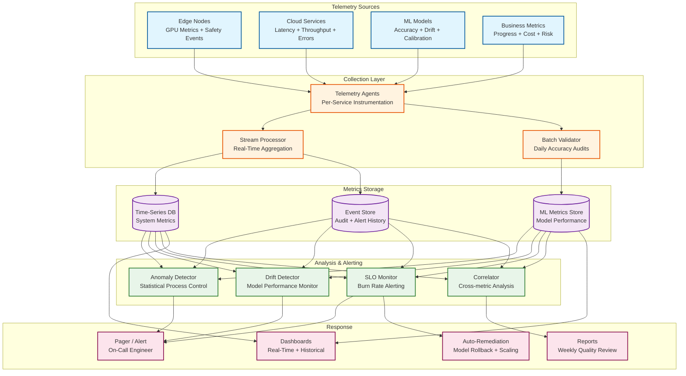

# 13.7 AI-Native Construction & Engineering Platform — Observability

## Observability Philosophy

Construction AI platforms have a unique observability challenge: the system's outputs (progress reports, safety alerts, cost estimates, risk scores) directly influence physical-world decisions (crew deployment, material orders, safety interventions) that cannot be easily rolled back. A false progress report showing 90% completion on a floor that is actually 60% complete can trigger premature follow-on trade mobilization, wasting hundreds of thousands of dollars in idle labor. Observability must therefore monitor not just system health but *output quality*—the accuracy and calibration of AI-generated insights compared to ground truth.

---

## Key Metrics Framework

### Tier 1: Safety Monitoring Metrics (Real-Time)

| Metric | Description | Target | Alert Threshold |
|---|---|---|---|
| `safety.alert_latency_p99` | Time from frame capture to alert dispatch | ≤ 500 ms | > 750 ms |
| `safety.detection_accuracy` | PPE detection accuracy vs. manual audit | ≥ 95% | < 90% |
| `safety.false_positive_rate` | Alerts dismissed as false positive within 5 min | ≤ 10% | > 20% |
| `safety.camera_coverage_pct` | Percentage of monitored zones with active feeds | ≥ 98% | < 90% |
| `safety.edge_gpu_utilization` | Edge GPU compute utilization | 40-80% | > 90% or < 20% |
| `safety.edge_node_health` | Edge nodes reporting healthy heartbeat | 100% (N+1) | Any node down |
| `safety.alert_response_time_p50` | Time from alert to supervisor acknowledgment | ≤ 5 min | > 15 min |
| `safety.model_drift_score` | Statistical drift in detection distribution vs. baseline | ≤ 0.05 KL divergence | > 0.1 |

### Tier 2: Progress Tracking Metrics (Daily)

| Metric | Description | Target | Alert Threshold |
|---|---|---|---|
| `progress.processing_latency_p95` | Time from capture upload to progress report | ≤ 4 h | > 6 h |
| `progress.element_detection_rate` | Elements correctly identified vs. ground truth audit | ≥ 90% | < 85% |
| `progress.point_cloud_registration_error` | RMS registration error against BIM coordinates | ≤ 2 cm | > 5 cm |
| `progress.capture_coverage_pct` | Percentage of planned zones captured today | ≥ 95% | < 80% |
| `progress.occlusion_rate` | Elements marked as occluded (unable to assess) | ≤ 15% | > 25% |
| `progress.temporal_consistency` | Elements with status regression vs. previous day | ≤ 2% | > 5% |
| `progress.earned_value_freshness` | Age of EVM calculations | ≤ 24 h | > 48 h |
| `progress.photogrammetry_success_rate` | Zone reconstructions succeeding without manual intervention | ≥ 98% | < 95% |

### Tier 3: BIM Intelligence Metrics (Per-Update)

| Metric | Description | Target | Alert Threshold |
|---|---|---|---|
| `bim.parse_success_rate` | IFC models parsed without errors | ≥ 99% | < 95% |
| `bim.clash_detection_latency_p99` | Incremental clash detection time | ≤ 30 s | > 60 s |
| `bim.relevance_filter_precision` | ML-classified relevant clashes confirmed by coordinator | ≥ 85% | < 75% |
| `bim.relevance_filter_recall` | Relevant clashes not missed by ML filter | ≥ 95% | < 90% |
| `bim.model_element_count` | Elements in active model (capacity monitoring) | ≤ 2M | > 1.5M (warning) |
| `bim.spatial_index_build_time` | R-tree construction time | ≤ 3 min | > 5 min |
| `bim.version_diff_accuracy` | Model diff correctly identifies changed elements | ≥ 99% | < 97% |

### Tier 4: Cost Estimation Metrics (Per-Estimate)

| Metric | Description | Target | Alert Threshold |
|---|---|---|---|
| `cost.estimate_generation_time_p95` | Time to produce full probabilistic estimate | ≤ 5 min | > 10 min |
| `cost.historical_coverage_pct` | Cost items with ≥20 historical data points | ≥ 80% | < 60% |
| `cost.confidence_interval_width` | P90/P10 ratio (narrower = more confident) | ≤ 1.5 at CD stage | > 2.0 |
| `cost.estimate_vs_actual_error` | Completed projects: estimate deviation from actual | ≤ ±10% at DD | > ±15% |
| `cost.market_data_freshness` | Age of material price and labor index feeds | ≤ 24 h | > 72 h |
| `cost.monte_carlo_convergence` | Coefficient of variation of P50 across runs | ≤ 0.5% | > 2% |

### Tier 5: Risk Prediction Metrics (Daily)

| Metric | Description | Target | Alert Threshold |
|---|---|---|---|
| `risk.model_auc` | Area under ROC curve for delay prediction | ≥ 0.80 | < 0.70 |
| `risk.calibration_error` | Mean calibration error (predicted prob vs. observed frequency) | ≤ 0.05 | > 0.10 |
| `risk.prediction_lead_time` | Average days between first alert and actual delay | ≥ 14 days | < 7 days |
| `risk.false_alarm_rate` | Activities flagged high-risk that completed on time | ≤ 20% | > 30% |
| `risk.feature_freshness` | Age of input features (weather, supply chain, subcontractor) | ≤ 24 h | > 72 h |
| `risk.critical_path_coverage` | Critical path activities with risk scores | 100% | < 95% |

### Tier 6: Robot Inspection Metrics (Per-Mission)

| Metric | Description | Target | Alert Threshold |
|---|---|---|---|
| `robot.inspection_coverage_pct` | Percentage of planned waypoints visited in mission | ≥ 95% | < 85% |
| `robot.battery_level` | Battery state of charge at mission completion | ≥ 20% | < 10% |
| `robot.navigation_failure_rate` | Waypoints skipped due to obstacle or localization failure | ≤ 3% | > 8% |
| `robot.confined_space_detection_accuracy` | Defect detection accuracy in confined spaces vs. human audit | ≥ 88% | < 80% |
| `robot.slam_localization_error` | SLAM position error against known reference points | ≤ 5 cm | > 15 cm |
| `robot.mission_completion_time` | Elapsed wall-clock time for standard inspection route | ≤ planned × 1.2 | > planned × 1.5 |
| `robot.data_upload_latency` | Time from mission end to full data availability in cloud | ≤ 30 min | > 60 min |
| `robot.obstacle_avoidance_interventions` | Manual operator takeovers per mission | ≤ 2 | > 5 |

### Tier 7: LLM Query Metrics (Per-Request)

| Metric | Description | Target | Alert Threshold |
|---|---|---|---|
| `llm.query_latency_p95` | End-to-end latency from query submission to response | ≤ 3 s | > 8 s |
| `llm.hallucination_rate` | Responses containing claims contradicted by source data (sampled audit) | ≤ 2% | > 5% |
| `llm.grounding_coverage` | Percentage of response claims with traceable source citation | ≥ 95% | < 85% |
| `llm.rag_retrieval_accuracy` | Retrieved documents judged relevant by human reviewer | ≥ 90% | < 80% |
| `llm.safety_filter_trigger_rate` | Queries triggering safety/compliance guardrails | Baseline ± 20% | > 2× baseline |
| `llm.user_satisfaction_score` | Thumbs-up / thumbs-down ratio on responses | ≥ 85% positive | < 70% positive |
| `llm.context_window_utilization` | Average context consumed relative to window limit | ≤ 80% | > 95% |
| `llm.fallback_rate` | Queries where LLM defers to human expert | ≤ 15% | > 25% |

### Tier 8: NeRF / 3D Gaussian Splatting Quality Metrics (Per-Reconstruction)

| Metric | Description | Target | Alert Threshold |
|---|---|---|---|
| `nerf.psnr_score` | Peak signal-to-noise ratio of synthesized views vs. held-out images | ≥ 28 dB | < 24 dB |
| `nerf.training_time` | Wall-clock time to train NeRF model for a zone | ≤ 45 min | > 90 min |
| `nerf.rendering_fps` | Frames per second for novel view synthesis at 1080p | ≥ 30 fps | < 15 fps |
| `nerf.geometric_accuracy` | Depth map deviation from LiDAR ground truth | ≤ 3 cm RMSE | > 8 cm |
| `gaussian.splat_point_count` | Number of Gaussian primitives in final reconstruction | ≤ 5M per zone | > 8M (memory warning) |
| `gaussian.training_convergence_time` | Time to reach 95% of final PSNR | ≤ 15 min | > 30 min |
| `nerf.sparse_view_degradation` | PSNR drop when using 50% fewer input views | ≤ 3 dB | > 6 dB |

### Tier 9: Drone Survey Metrics (Per-Flight)

| Metric | Description | Target | Alert Threshold |
|---|---|---|---|
| `drone.flight_coverage_pct` | Percentage of planned survey area captured | ≥ 98% | < 90% |
| `drone.battery_efficiency` | Survey area covered per battery charge cycle | ≥ baseline × 0.9 | < baseline × 0.7 |
| `drone.point_cloud_density` | Points per square meter in produced point cloud | ≥ 500 pts/m² | < 200 pts/m² |
| `drone.gsd_achieved` | Ground sample distance (spatial resolution) achieved | ≤ 2 cm/px | > 5 cm/px |
| `drone.image_overlap_pct` | Average stereo overlap between consecutive captures | ≥ 70% | < 55% |
| `drone.georeference_error` | Absolute position error against ground control points | ≤ 3 cm | > 10 cm |
| `drone.wind_abort_rate` | Flights aborted due to wind conditions exceeding thresholds | ≤ 5% | > 15% |
| `drone.no_fly_zone_compliance` | Flights with zero no-fly-zone incursions | 100% | Any violation |

---

## Observability Architecture



---

## ML Model Monitoring

### Safety CV Model Drift Detection

The safety CV model's accuracy is continuously monitored using a "shadow audit" pipeline:

**Real-time drift detection:** The distribution of detection classes, confidence scores, and bounding box sizes is tracked per camera per hour. Statistical process control (SPC) charts flag when distributions shift beyond control limits—indicating either a model problem (degraded accuracy) or an environmental change (new construction phase with different visual characteristics). A Kolmogorov-Smirnov test compares the current day's detection distribution against the 30-day baseline, with a threshold of 0.05 significance level.

**Weekly accuracy audit:** A random sample of 500 frames per site is sent to human annotators for ground truth labeling. The model's predictions on these frames are compared to human labels, producing per-class precision/recall metrics. This catches gradual accuracy drift that statistical distribution tests might miss (e.g., the model maintains the same detection rate but increasingly confuses hard hats with white helmets from a new subcontractor).

**Automatic remediation:** If accuracy drops below 90% for any safety-critical class (hard hat, harness, exclusion zone), the system automatically rolls back to the previous model version on affected edge nodes and generates an incident ticket for the ML engineering team. The rollback happens within 15 minutes of drift detection, minimizing the window of degraded safety monitoring.

### Progress Tracking Accuracy Validation

Progress tracking accuracy is validated through a weekly "ground truth walk":

1. A trained surveyor performs a manual assessment of 50 randomly selected elements per site, recording their actual completion status.
2. The surveyor's assessments are compared against the system's automated progress detection for the same elements on the same day.
3. Discrepancies are categorized: false positive (system says complete, actually incomplete), false negative (system says not started, actually in progress), and staging error (system detects wrong construction stage).
4. Category-level accuracy metrics are computed and trended over time.

If false negative rate exceeds 15% (system missing installed work), the photogrammetry pipeline parameters are reviewed—typically indicating registration drift or insufficient camera coverage in specific zones. If false positive rate exceeds 10% (system claiming progress that does not exist), the element matching model is retrained with the new ground truth labels.

### Cost Estimation Calibration

Cost estimate accuracy is validated at project milestones by comparing the estimate at each stage against the actual cost:

```
Calibration pipeline:
  1. At project completion, record actual cost per CSI division
  2. Compare against the estimate produced at each design stage:
     - Conceptual estimate vs. actual → expected ±25%
     - Schematic estimate vs. actual → expected ±15%
     - Design Development estimate vs. actual → expected ±10%
     - Construction Documents estimate vs. actual → expected ±5%
  3. Compute calibration metrics:
     - Bias: average (estimate - actual) / actual → should be near 0%
     - Sharpness: average width of 80% confidence interval
     - Coverage: % of actuals falling within 80% CI → should be ~80%
  4. If bias > 5% or coverage < 70%, retrain cost models with new project data
  5. Feed actual costs back into historical database for future estimates
```

---

## Dashboard Design

### Project Manager Dashboard (Primary)

```
┌─────────────────────────────────────────────────────────────────┐
│ Project: Metro Hospital Phase 2          Status: On Track  ▲   │
│ Updated: 2026-03-10 06:00               Day 247 of 540        │
├──────────────────────┬──────────────────────────────────────────┤
│  PROGRESS            │  COST                                   │
│  Planned: 45.8%      │  Budget:     $142.5M                    │
│  Actual:  43.2%      │  EAC (P50):  $148.2M                    │
│  SPI: 0.94           │  CPI: 0.96                              │
│  ▼ 2.6% behind       │  ▼ $5.7M over (P50)                    │
│                      │  P10: $139.8M  P90: $162.1M             │
├──────────────────────┼──────────────────────────────────────────┤
│  SAFETY (Today)      │  TOP RISKS                              │
│  Alerts: 47          │  1. MEP rough-in Floor 8 (P=72%)        │
│  Critical: 2         │  2. Curtain wall delivery (P=65%)       │
│  PPE compliance: 94% │  3. Fire protection Floor 5-7 (P=58%)   │
│  Near-misses: 3      │  4. Elevator install (P=45%)            │
│  Trend: Improving ▲  │                                         │
├──────────────────────┼──────────────────────────────────────────┤
│  SCHEDULE            │  SYSTEM HEALTH                          │
│  Critical path:      │  Safety CV: ● Healthy (99.99%)          │
│   Floor 8 structure  │  Progress:  ● Healthy (processed 6AM)   │
│   3 days behind      │  BIM:       ● Healthy (last clash 2h)   │
│  Float consumed: 62% │  Edge nodes: ● 4/4 online               │
│  Recovery options: 2 │  Data sync:  ● Current (lag < 5 min)    │
└──────────────────────┴──────────────────────────────────────────┘
```

### Safety Operations Dashboard

```
┌─────────────────────────────────────────────────────────────────┐
│  LIVE SAFETY MONITOR          Site: Metro Hospital Phase 2     │
├──────────────────────────────────────────────────────────────────┤
│  ACTIVE ALERTS (2 Critical)                                    │
│  [!!] Floor 12 East - Worker without harness near leading edge │
│     Camera: CAM-12E-04  |  Time: 14:23:07  |  Conf: 0.97     │
│  [!!] Basement B2 - Unauthorized entry to confined space       │
│     Camera: CAM-B2-02   |  Time: 14:22:45  |  Conf: 0.93     │
│  [!]  Floor 5 West - Hard hat removed in active zone           │
│     Camera: CAM-05W-07  |  Time: 14:21:30  |  Conf: 0.91     │
├──────────────────────────────────────────────────────────────────┤
│  ZONE OCCUPANCY (Real-time)                                    │
│  Floor 12: ████████░░ 42/50 workers  WARN: Near capacity      │
│  Floor 11: ██████░░░░ 31/50 workers                            │
│  Floor 10: ████░░░░░░ 22/50 workers                            │
│  Basement: ██░░░░░░░░ 8/30 workers                             │
├──────────────────────────────────────────────────────────────────┤
│  7-DAY TREND                                                   │
│  PPE compliance:  91% > 92% > 90% > 93% > 94% > 94% > 94%    │
│  Near-misses/day:  5  >  3  >  4  >  2  >  3  >  3  >  2     │
│  Avg response time: 4.2 min > 3.8 min > 3.5 min (improving)   │
│  Model accuracy:   96.2% (last weekly audit)                   │
└──────────────────────────────────────────────────────────────────┘
```

### Robot & Drone Operations Dashboard

```
┌─────────────────────────────────────────────────────────────────┐
│  AUTONOMOUS OPERATIONS        Site: Metro Hospital Phase 2     │
│  Updated: 2026-03-10 14:30                                     │
├──────────────────────┬──────────────────────────────────────────┤
│  INSPECTION ROBOTS   │  DRONE SURVEYS                          │
│  Active: 2/3         │  Today's flights: 3/4 complete          │
│  Bot-01: Floor B2    │  Flight #3: Floors 10-12 exterior       │
│    Battery: 64%      │    Coverage: 98.2%                      │
│    Coverage: 78%     │    Point density: 620 pts/m^2           │
│    Waypoints: 34/42  │    GSD: 1.4 cm/px                      │
│  Bot-02: Mech Rm 7A  │  Flight #4: Roof (scheduled 15:00)     │
│    Battery: 41%      │    Status: Awaiting wind clearance      │
│    Coverage: 92%     │    Wind: 28 km/h (limit: 32 km/h)      │
│  Bot-03: CHARGING    │                                         │
│    Battery: 12%->38% │  Today's data volume: 42.3 GB           │
│    Next mission: B3  │  Upload queue: 8.2 GB remaining         │
├──────────────────────┼──────────────────────────────────────────┤
│  NERF RECONSTRUCTIONS│  MISSION HEALTH (7-DAY)                 │
│  Queue: 4 zones      │  Robot nav failures: 2.1% (OK)         │
│  Processing: Zone 8A │  Robot battery alerts: 1 (Mon)          │
│    PSNR: 29.4 dB     │  Drone aborts (wind): 2/28 (7.1%)     │
│    Training: 62%     │  SLAM drift resets: 0                   │
│    ETA: 18 min       │  Coverage target met: 26/28 missions   │
│  Last complete: 7C   │  Confined space missions: 6 (all OK)   │
│    PSNR: 31.2 dB     │  Operator takeovers: 3 total            │
│    Render: 45 fps    │  Data upload SLO met: 100%              │
└──────────────────────┴──────────────────────────────────────────┘
```

---

## Alerting Strategy

### Alert Routing by Severity and Type

| Alert Category | Severity | Notification Channel | Response SLO | Escalation |
|---|---|---|---|---|
| Safety — life threat | Critical | Siren + supervisor push + safety officer | Immediate (<1 min) | Auto-escalate to site manager at 3 min |
| Safety — PPE violation | Warning | Supervisor mobile notification | < 5 min | Escalate to safety officer at 15 min |
| Edge node failure | Critical | On-call platform engineer | < 15 min | Escalate to engineering lead at 30 min |
| Progress SLO breach | Warning | Project manager notification | < 2 h | Escalate to platform ops at 4 h |
| CV model drift detected | Warning | ML engineering team channel | < 4 h | Auto-rollback if accuracy < 90% |
| BIM processing failure | Warning | BIM coordinator notification | < 1 h | Escalate to platform ops at 2 h |
| Cost data feed stale | Info | Cost estimator notification | < 24 h | Escalate at 72 h |
| Risk model AUC drop | Warning | Data science team channel | < 8 h | Manual retrain trigger |

### Alert Fatigue Prevention

Construction generates high event volumes. The alerting system prevents fatigue through:

1. **Deduplication:** Same metric, same resource, same severity → single alert with incrementing counter. Re-alert only on severity change or after 4-hour cool-down.
2. **Correlation:** Multiple metrics degrading simultaneously (e.g., progress processing slow + GPU utilization high + queue depth growing) → single correlated incident, not three independent alerts.
3. **Business hours awareness:** Non-critical alerts are batched and delivered at shift start (6 AM) rather than interrupting overnight. Critical safety and infrastructure alerts fire immediately regardless of time.
4. **Trend-based alerting:** Rather than alerting on every threshold crossing, use burn-rate alerting: alert when the error budget consumption rate predicts SLO violation within 4 hours at current trajectory.

---

## Runbooks

### Runbook 1: Safety CV Model Drift Detected

**Trigger:** `safety.model_drift_score > 0.1` OR `safety.detection_accuracy < 90%` on weekly audit.

```
Step 1: Triage (< 5 min)
  - Check if drift is localized (single camera / zone) or global (all cameras)
  - If single camera: check for physical obstruction, lens dirt, camera moved
  - If global: proceed to model investigation

Step 2: Assess impact (< 15 min)
  - Query false positive rate and false negative rate per safety class
  - Identify which classes are degraded (hard hat, harness, exclusion zone, vest)
  - If any safety-critical class (hard hat, harness, exclusion zone) is < 90%:
    -> AUTOMATIC: Roll back to previous model version on affected edge nodes
    -> Notify site safety officer of temporary degraded accuracy window

Step 3: Root cause (< 4 h)
  - Pull detection distribution histograms: current vs. baseline
  - Check for environmental changes: new PPE types, seasonal lighting shift,
    construction phase change (exterior to interior, or vice versa)
  - Compare against recent model updates: was a new model deployed < 7 days ago?
  - If new model: revert is already done; investigate training data gap
  - If environmental: collect new labeled samples from affected cameras

Step 4: Remediation
  - If training data gap: add 200+ labeled frames from affected conditions
  - Retrain model, validate on per-camera test sets (Tier 4 calibration)
  - Stage blue-green deployment on one edge node, validate for 24 h
  - Roll out to all edge nodes with 1-hour canary per node

Step 5: Post-incident
  - Update drift baseline with new detection distribution
  - Add root cause to known failure modes library
  - If environmental: add monitoring for that condition to prevent recurrence
```

### Runbook 2: Edge Node Failure

**Trigger:** `safety.edge_node_health` — any node missing heartbeat for > 60 s.

```
Step 1: Verify (< 2 min)
  - Confirm heartbeat loss is not a network partition (check gateway logs)
  - Check if other edge nodes on same network segment are healthy
  - If network partition: engage network remediation, not edge node runbook

Step 2: Assess safety impact (< 5 min)
  - Identify which cameras are served by the failed node
  - Identify which zones lose safety monitoring
  - If any zone has no redundant camera coverage:
    -> IMMEDIATE: Deploy manual safety observer to uncovered zone
    -> Notify site safety officer

Step 3: Failover (< 15 min)
  - If N+1 redundancy: redistribute camera feeds to surviving nodes
  - Verify surviving nodes can handle additional load (GPU util < 90%)
  - If no N+1 capacity: prioritize safety-critical zones, shed non-critical feeds
  - Confirm alert dispatch continues for all covered zones

Step 4: Hardware recovery
  - Attempt remote power cycle via out-of-band management
  - If unresponsive: dispatch field technician with spare edge node
  - Hot-swap failed node; restore from configuration backup
  - Re-register cameras and re-download current model version

Step 5: Post-incident
  - Root cause hardware failure (thermal? power? storage?)
  - If thermal: review enclosure ventilation and ambient temperature
  - Update spare parts inventory at site
```

### Runbook 3: Robot Navigation Failure

**Trigger:** `robot.navigation_failure_rate > 8%` OR `robot.obstacle_avoidance_interventions > 5` in a single mission.

```
Step 1: Triage (< 10 min)
  - Pull mission log: identify which waypoints were skipped and why
  - Categories: SLAM localization loss, unexpected obstacle, path blocked,
    wheel slip / terrain failure, sensor degradation
  - If SLAM localization loss: check for environmental changes
    (new walls, removed scaffolding, lighting changes in confined space)

Step 2: Assess data impact
  - Identify which inspection zones were missed
  - Check if missed zones have alternative data sources (camera coverage,
    manual inspection scheduled)
  - If critical zones missed with no alternative: schedule manual inspection

Step 3: Environmental investigation
  - Compare current site map against robot's SLAM map
  - Identify discrepancies: new obstacles, changed geometry, moved equipment
  - If map is stale: trigger map update from latest point cloud data
  - If terrain issue: flag zone as requiring path replanning

Step 4: Remediation
  - Update robot's occupancy grid with current site conditions
  - Replan affected waypoints with wider obstacle clearance margins
  - If recurring in same zone: add zone-specific navigation parameters
    (slower speed, increased sensor sensitivity, operator standby)
  - Re-run failed mission segment to recover missed inspection data

Step 5: Systemic review (if failure rate > 8% for 3+ consecutive missions)
  - Review robot hardware: wheel wear, LiDAR calibration, IMU drift
  - Consider site conditions: excessive dust on sensors, water ingress
  - Schedule preventive maintenance if hardware degradation detected
```

### Runbook 4: LLM Response Quality Degradation

**Trigger:** `llm.hallucination_rate > 5%` OR `llm.user_satisfaction_score < 70%` OR `llm.grounding_coverage < 85%`.

```
Step 1: Classify degradation type (< 30 min)
  - Pull sample of recent low-rated or flagged responses
  - Categorize issues:
    A. Factual hallucination (claims contradicted by project data)
    B. Stale data (correct at some point but outdated)
    C. Wrong project context (answers about Project A using Project B data)
    D. Vague / unhelpful (technically correct but not actionable)
    E. Safety-critical error (wrong information about structural loads,
       fire ratings, or compliance requirements)

  - If Category E: IMMEDIATE action
    -> Enable strict safety filter: all structural/safety queries
       require human expert review before delivery
    -> Notify engineering lead and safety officer

Step 2: Root cause by category
  - Category A: Check RAG retrieval — are correct documents being retrieved?
    - If retrieval is poor: re-index vector store, check embedding model
    - If retrieval is good but synthesis is wrong: prompt engineering issue
  - Category B: Check data freshness pipeline
    - Verify BIM sync, progress data, and schedule data are current
    - Check vector store reindexing schedule (should be daily)
  - Category C: Check project isolation in retrieval
    - Verify namespace/tenant filtering in vector search
    - Test cross-project leakage with controlled queries
  - Category D: Review prompt templates and response formatting

Step 3: Remediation
  - For retrieval issues: rebuild vector index, adjust chunk size / overlap
  - For synthesis issues: update system prompt with stricter grounding rules
  - For freshness: fix data pipeline, reduce reindexing interval
  - For isolation: add hard tenant filters at retrieval layer
  - Deploy fix to staging, validate with 50 known-good query/answer pairs

Step 4: Monitoring
  - Increase audit sampling rate from 5% to 20% for 7 days post-fix
  - Track hallucination rate daily until it stabilizes below 2%
  - If safety-critical errors occurred: maintain human review filter
    for 30 days before re-enabling autonomous responses

Step 5: Post-incident
  - Add failure cases to regression test suite
  - Update RAG evaluation benchmark with new edge cases
  - If root cause was data freshness: add data staleness alert
```

### Runbook 5: Progress Processing SLO Breach

**Trigger:** `progress.processing_latency_p95 > 6 h` — progress reports not available by shift start.

```
Step 1: Identify Slowest part of the process (< 15 min)
  - Check pipeline stage latencies:
    Upload (edge to cloud) | Photogrammetry | Registration | Detection | Report
  - Identify which stage is delayed and by how much

Step 2: By Slowest part of the process type
  - Upload delayed: check edge-cloud bandwidth, retry stalled uploads,
    prioritize current day's data over backfill
  - Photogrammetry slow: check GPU cluster utilization, scale up if available,
    reduce reconstruction resolution for non-critical zones
  - Registration failed: check for drift alarm, run absolute re-registration
    against latest drone survey data
  - Detection slow: check model serving health, restart if OOM or deadlocked

Step 3: Partial delivery
  - If full processing cannot complete by 6 AM:
    -> Deliver partial report covering completed zones
    -> Mark incomplete zones with "processing" status
    -> Provide ETA for full report
    -> Notify project manager of delay and affected zones

Step 4: Recovery
  - Process delayed zones as priority batch when Slowest part of the process clears
  - Issue updated report as supplement, not replacement (preserve audit trail)

Step 5: Prevention
  - If caused by data volume growth: adjust GPU allocation or batch window
  - If caused by infrastructure: add capacity monitoring alerts at 80% threshold
  - If caused by registration drift: increase drone survey frequency
```

---

## AI Observability Standards

This system's AI components MUST implement the observability patterns defined in:
- **[3.25 AI Observability & LLMOps](../3.25-ai-observability-llmops-platform/00-index.md)** — trace model, token accounting, prompt-completion linkage
- **[3.26 AI Model Evaluation & Benchmarking](../3.26-ai-model-evaluation-benchmarking-platform/00-index.md)** — eval taxonomy, regression testing, human review sampling

### Required AI-Specific Metrics
- Model prediction confidence distribution
- Human override rate (target: track, not minimize)
- AI recommendation acceptance rate by decision type
- Drift detection alerts (data drift + concept drift)
- Cost per AI-assisted decision
