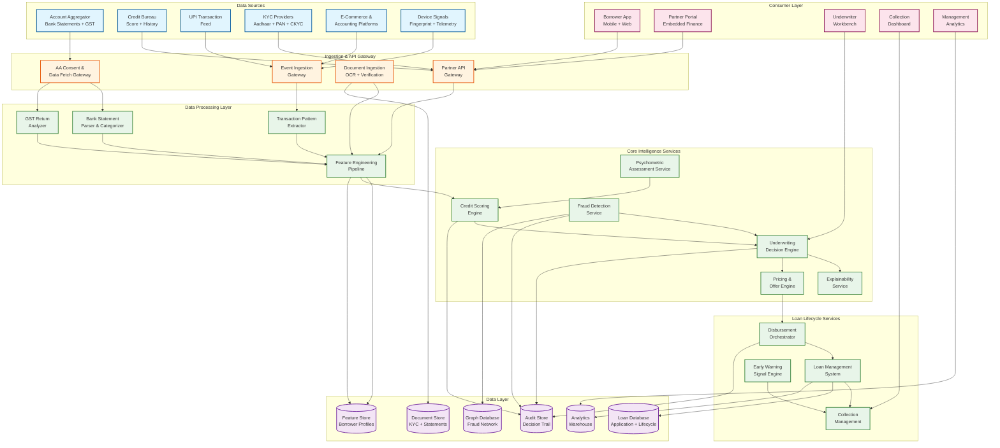
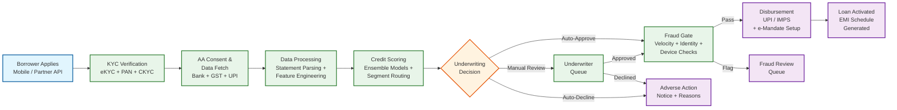
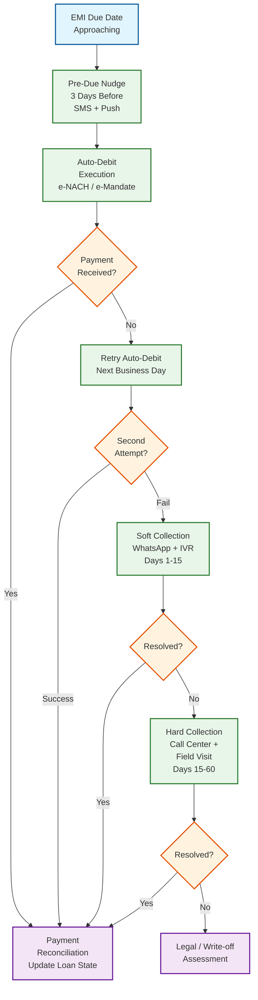
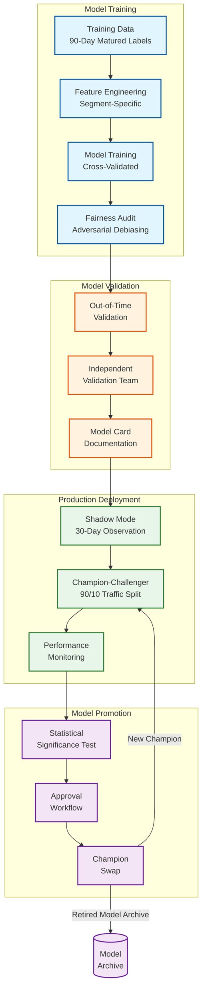
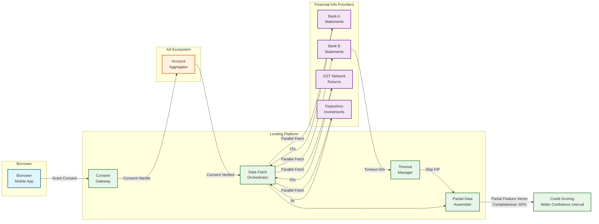

# 14.1 AI-Native MSME Credit Scoring & Lending Platform — High-Level Design

## System Architecture



---

## Key Design Decisions

### Decision 1: Consent-First Data Architecture with Graceful Degradation

The platform's data ingestion is built around India's Account Aggregator framework, where every data access requires explicit borrower consent with specified purpose, duration, and data type. Unlike platforms that pre-fetch and cache customer data, the AA architecture requires fresh consent and data retrieval for each lending interaction. The platform orchestrates parallel data fetches from multiple Financial Information Providers (FIPs)—fetching bank statements from Bank A, GST data from the GST Network, and investment data from a depository simultaneously—and makes credit decisions with whatever data arrives within the decision window.

**Implication:** The credit scoring engine must handle partial data gracefully. If a borrower has 3 bank accounts but only 2 FIPs respond within the timeout, the model must score on incomplete data. This requires "missingness-aware" ML models trained with intentional feature dropout—during training, random subsets of features are masked, and the model learns to produce calibrated predictions from partial feature vectors. The feature store tracks data completeness per borrower, and the model's confidence interval widens as features are missing, which the underwriting decision engine factors into its approve/decline logic (wider confidence → higher chance of manual review routing).

### Decision 2: Champion-Challenger Model Ensemble with Segment-Specific Routing

Rather than a single credit scoring model, the platform maintains a model ensemble organized by borrower segment: (1) a **bureau-plus model** for applicants with bureau history (logistic regression + gradient-boosted trees on 150+ features including bureau score, tradeline history, and alternative data), (2) a **thin-file model** for applicants with some financial footprint but no bureau history (gradient-boosted trees on 80+ alternative data features from bank statements, GST, and UPI), and (3) a **new-to-credit model** for applicants with minimal data (psychometric scores + device signals + basic KYC demographics + whatever transaction data is available). Each model is paired with a challenger that receives 10% of traffic in shadow mode, with automated promotion when the challenger's Gini coefficient exceeds the champion's by >2 points on 90-day vintage performance.

**Implication:** The model registry must maintain strict separation between segments to prevent data leakage (a model trained on bureau-rich data should not be evaluated on thin-file populations where it would perform poorly and distort metrics). The feature store must maintain segment-specific feature pipelines—the bureau-plus model uses bureau score as a top-3 feature, while the thin-file model does not have access to this feature and must rely entirely on cash flow metrics and behavioral signals. Promotion decisions require segment-specific sample sizes (minimum 5,000 scored applications with 90-day outcome observation per segment) to achieve statistical significance.

### Decision 3: Fail-Closed Fraud Detection with Pre-Disbursement Gate

The fraud detection service operates as a mandatory pre-disbursement gate: every approved loan must pass fraud scoring before disbursement is authorized. If the fraud service is unavailable, disbursement is blocked (fail-closed), not bypassed (fail-open). This is architecturally controversial—it means a fraud service outage halts all lending—but is necessary because the disbursement is irrevocable (UPI/IMPS transfers cannot be recalled), and a single undetected fraud burst during a service outage could exceed the platform's monthly fraud budget.

**Implication:** The fraud detection service requires 99.99% availability (≤52 minutes downtime/year). It uses a tiered architecture: a fast path (rule-based velocity checks + device fingerprint matching, <50 ms) handles 95% of applications, and a slow path (graph-based fraud ring detection + document forgery analysis, <2 seconds) handles applications flagged by the fast path. The fast-path rules are cached locally at the application processing nodes, enabling degraded-mode operation (rule-based fraud checks only) during a brief fraud service outage, with queued applications re-checked when the full service recovers.

### Decision 4: Event-Sourced Loan Lifecycle with Regulatory Audit Trail

Every loan state transition (application received, data fetched, scored, approved, disbursed, EMI due, paid, delinquent, etc.) is recorded as an immutable event in an append-only event store. The current loan state is a projection of these events, not a mutable row in a database. This event-sourced architecture serves two purposes: (1) regulatory audit compliance—every decision and state change has a complete, tamper-evident history that can be reconstructed at any point; and (2) analytics—vintage analysis, cohort behavior, and early warning models can replay event streams to analyze historical patterns.

**Implication:** The event store must handle 10M+ active loans with an average of 50 events per loan lifecycle (500M total events, growing at ~2M events/day). Events are partitioned by loan ID for per-loan ordering guarantees. The materialized views (current loan state, portfolio aggregations, delinquency buckets) are derived from the event stream via stream processing, with eventual consistency (≤5 seconds lag) acceptable for operational dashboards but not for state-changing operations (which always read from the event store's latest state).

### Decision 5: Embedded Finance API with Partner-Specific Policy Isolation

The embedded finance API allows partner platforms (e-commerce marketplaces, accounting SaaS, supply chain platforms) to offer credit at the point of sale. Each partner has an isolated policy configuration: credit policy (minimum revenue threshold, maximum loan amount, eligible sectors), pricing (risk-adjusted interest rates, partner-specific processing fees), revenue sharing (percentage split on interest income), and co-lending structure (bank/NBFC capital allocation ratios). Partner-specific policies are enforced at the API gateway level, ensuring that partner A's relaxed credit policy cannot be applied to partner B's applications.

**Implication:** The underwriting decision engine receives a `partner_id` context with every application and loads the corresponding policy configuration from a versioned policy store. Policy changes are versioned and audited (regulatory requirement: demonstrate that the policy in effect at the time of each loan's origination is documented). The co-lending structure requires real-time capital allocation: when partner A's allocated capital from Bank X is exhausted, the system must seamlessly route to Bank Y's allocation or pause lending for that partner—a distributed resource management problem that must handle race conditions when multiple concurrent applications compete for the same capital pool.

---

## Data Flow: Loan Application — From Application to Disbursement



---

## Data Flow: Collection Lifecycle



---

## Component Responsibilities Summary

| Component | Primary Responsibility | Key Interface |
|---|---|---|
| **AA Consent & Data Fetch Gateway** | Manage borrower consent flows via AA framework; orchestrate parallel data fetches from FIPs; handle timeout and partial data scenarios | Interacts with AA ecosystem (consent manager, FIPs); publishes raw financial data to processing pipeline |
| **Bank Statement Parser** | Extract transactions from bank statements (PDF, JSON, XML); categorize each transaction into 35 categories using NLP; compute cash flow summary metrics | Receives raw statements from AA gateway; produces categorized transaction ledger and cash flow features |
| **GST Return Analyzer** | Parse GST returns (GSTR-1, GSTR-3B); extract revenue trends, tax compliance signals, input credit patterns; cross-validate with bank statement deposits | Receives GST data from AA; produces revenue verification and compliance features |
| **Feature Engineering Pipeline** | Assemble 200+ features from all data sources into a unified feature vector; compute time-series features (trends, volatility, seasonality); handle missing data imputation | Reads from all data processors; writes to feature store; feeds credit scoring engine |
| **Credit Scoring Engine** | Route application to appropriate model (bureau-plus, thin-file, new-to-credit); execute champion-challenger ensemble; produce risk grade, PD, and confidence interval | Reads features from feature store; produces credit score + SHAP explanations |
| **Underwriting Decision Engine** | Apply hard policy rules, ML credit score, and pricing in sequence; route edge cases to manual queue; generate adverse action reasons | Receives score from CSE, fraud flag from FRD; produces approve/decline/review decision |
| **Fraud Detection Service** | Score application fraud risk in real-time; monitor post-disbursement for stacking and behavioral anomalies; detect fraud rings via graph analysis | Reads application data + device signals + bureau; produces fraud score and alerts |
| **Psychometric Assessment Service** | Administer gamified assessments; score responses for credit risk correlation; detect gaming and random-answer patterns | Receives assessment responses; produces psychometric credit score |
| **Explainability Service** | Generate SHAP-based feature attributions; produce counterfactual explanations; map model outputs to human-readable adverse action reason codes | Receives model output + feature vector; produces explanation for regulators and borrowers |
| **Disbursement Orchestrator** | Execute fund transfer via UPI/IMPS/NEFT; verify beneficiary account; register e-mandate; reconcile settlement | Receives approval from UDE; interacts with payment rails; updates LMS |
| **Collection Management** | Execute automated collection waterfall; optimize contact timing and channel; manage auto-debit retries; route to field collection | Reads delinquency state from LMS; dispatches multi-channel communications |
| **Early Warning Signal Engine** | Monitor borrower behavioral signals for distress prediction; trigger proactive restructuring offers; feed portfolio risk dashboards | Reads ongoing transaction data + repayment patterns; produces risk alerts |
| **Embedded Finance API** | Expose lending-as-a-service endpoints for partners; enforce partner-specific policies; manage co-lending capital allocation | Receives partner applications via API gateway; orchestrates full lending pipeline |

---

## Architecture Decision Records

### ADR-1: Why Event Sourcing Over CRUD for the Loan Lifecycle

**Context:** The loan lifecycle involves 15+ state transitions (applied → verified → scored → approved → disbursed → active → delinquent → restructured → closed), each requiring an immutable audit trail for regulatory compliance. The system must support historical state reconstruction ("what was this loan's state on March 15th?") and vintage analysis (replaying origination cohorts to measure model performance).

**Decision:** Event-sourced architecture where every state transition is an immutable event in an append-only store, with current state derived via event projection.

**Alternatives considered:**
- **CRUD with audit table:** Simpler implementation but requires maintaining two parallel stores (live state + audit copies). Audit table can diverge from live state due to bugs. Historical state reconstruction requires scanning the audit table and reassembling state—expensive and error-prone.
- **Soft-delete with version columns:** Tracks changes at row level but cannot reconstruct intermediate states or support event replay for analytics.

**Consequences:** Event replay enables powerful analytics (vintage analysis can replay origination events to reconstruct any cohort's journey). Trade-off: read path requires materializing current state from events, adding eventual consistency lag (≤5 seconds). Write path is simpler (append-only), but event schema evolution requires careful versioning (events are immutable—old events cannot be updated to match new schema).

### ADR-2: Why Segment-Specific Models Over a Single Universal Model

**Context:** The borrower population spans three distinct data availability segments: bureau-plus (40% of applicants with bureau history + alternative data), thin-file (45% with bank statements/GST/UPI but no bureau), and new-to-credit (15% with minimal data, relying on psychometric + device signals).

**Decision:** Maintain separate champion-challenger model pairs per segment, each trained on segment-specific features with segment-specific performance metrics.

**Alternatives considered:**
- **Single model with missing feature handling:** One model trained on all 200+ features with native missing-value handling. Simpler to maintain but underperforms because the optimal feature interactions differ fundamentally across segments (bureau score dominates in bureau-plus; cash flow volatility dominates in thin-file; psychometric consistency dominates in new-to-credit).
- **Stacked model:** First-stage segment-specific models feeding into a second-stage meta-model. More expressive but adds latency and creates a complex dependency chain where a bug in one segment model can cascade to all decisions.

**Consequences:** Three separate model pipelines require 3x training infrastructure, 3x monitoring dashboards, and 3x champion-challenger experiments. But each model achieves 3-5 Gini points higher performance than the universal model on its target segment, which translates to a measurable improvement in portfolio quality.

### ADR-3: Why SHAP Over LIME for Model Explainability

**Context:** Every credit decision (approve or decline) must produce human-interpretable reasons. Regulatory compliance requires adverse action notices with specific feature attributions. Two leading local explanation methods exist: SHAP (Shapley Additive exPlanations) and LIME (Local Interpretable Model-agnostic Explanations).

**Decision:** SHAP with TreeExplainer for production explanations.

**Rationale:**
- **Consistency:** SHAP provides globally consistent feature attributions (SHAP values sum to the difference between the prediction and the base rate). LIME approximations can produce inconsistent attributions where the sum of feature effects does not match the actual prediction difference.
- **Speed:** TreeExplainer computes exact SHAP values for gradient-boosted trees in O(TLD²) where T=trees, L=leaves, D=depth. For our 500-tree, depth-7 model, this is ~100ms per explanation—within the latency budget. LIME requires fitting a local linear model for each explanation, taking 500ms–2s.
- **Regulatory defensibility:** SHAP values have a game-theoretic foundation (Shapley values from cooperative game theory), providing a principled mathematical framework that regulators can audit.

**Consequences:** Locked to tree-based model families (TreeExplainer does not support neural networks). If future model architectures require neural approaches, must switch to KernelSHAP (slower) or develop custom explanation methods.

---

## Data Flow: Model Governance — Champion-Challenger Lifecycle



---

## Data Flow: AA Consent and Data Fetch Orchestration



---

## Cross-Cutting Concerns

### Idempotency Architecture

Every state-changing operation in the lending pipeline must be idempotent because network failures and retries are common (payment rail timeouts, AA fetch retries, collection message re-sends):

| Operation | Idempotency Key | Deduplication Window | Storage |
|---|---|---|---|
| Credit assessment | `partner_id + borrower_mobile + product_type` | 24 hours | Application database |
| Disbursement | `loan_id + attempt_number` | 7 days | Disbursement ledger |
| Auto-debit (NACH) | `loan_id + emi_number + attempt_number` | Billing cycle | Collection database |
| Bureau pull | `borrower_pan + purpose + date` | 24 hours | Bureau cache |
| AA data fetch | `consent_handle + fetch_type + date` | Per consent frequency | AA log |
| Collection SMS | `loan_id + dpd_bucket + message_template + date` | 24 hours | Communication log |

### Rate Limiting Strategy

The platform implements multi-level rate limiting to protect both internal services and external dependencies:

| Level | Scope | Limit | Enforcement |
|---|---|---|---|
| Partner API | Per partner | 100 applications/min (configurable) | Token bucket at API gateway |
| Bureau API | Global | 500 pulls/min (bureau-imposed) | Distributed rate limiter with priority queue |
| AA fetch | Per FIP | 100 fetches/min (FIP-specific) | Per-FIP circuit breaker + rate limiter |
| SMS gateway | Global | 50,000/min | Token bucket with burst allowance |
| WhatsApp Business | Global | 10,000/min | Token bucket with daily quota management |
| Fraud graph queries | Per shard | 1,000 queries/sec | Local rate limiter per graph shard |

### Multi-Tenancy for Embedded Finance Partners

Each embedded finance partner operates in a logical tenant with isolated configuration:

```
Partner Isolation Model:
  ├── Credit Policy Tenant
  │   ├── Eligibility rules (min revenue, max exposure, sector restrictions)
  │   ├── Score thresholds (auto-approve, manual review, auto-decline)
  │   └── Product configuration (term, credit line, invoice financing)
  ├── Pricing Tenant
  │   ├── Risk-based pricing grid (risk grade → APR)
  │   ├── Processing fee structure
  │   └── Revenue sharing split (platform vs. partner vs. bank)
  ├── Capital Allocation Tenant
  │   ├── Bank partner assignment (which bank funds this partner's loans)
  │   ├── Capital quota (soft limit with overflow to shared pool)
  │   └── Co-lending ratio (bank 80% / NBFC 20%)
  ├── UX Tenant
  │   ├── White-label branding (partner logo, colors)
  │   ├── Communication templates (SMS, email, WhatsApp)
  │   └── Customer support routing (partner L1 → platform L2)
  └── Compliance Tenant
      ├── KFS branding (regulated entity details)
      ├── Grievance redressal SLA
      └── Regulatory reporting attribution
```

### Circuit Breaker Patterns for External Dependencies

The platform depends on 50+ external services (AA FIPs, bureau, payment rails, KYC providers) with varying reliability. Each dependency has a circuit breaker with customized configuration:

```
Circuit breaker configuration:
  AA FIP connections (50+ FIPs):
    - Failure threshold: 5 consecutive failures or >30% failure rate in 60 seconds
    - Open duration: 60 seconds (FIPs recover quickly)
    - Half-open: allow 1 request through; if success, close; if failure, re-open
    - Fallback: proceed with partial data (widen confidence interval)

  Bureau API:
    - Failure threshold: 3 consecutive failures
    - Open duration: 120 seconds (bureau outages tend to be longer)
    - Fallback: route to thin-file model (score without bureau data)

  Payment rails (UPI, IMPS, NEFT):
    - Failure threshold: 3 consecutive failures per destination bank
    - Open duration: 300 seconds (bank-specific outages may persist)
    - Fallback: failover to next rail (UPI → IMPS → NEFT)
    - Bank-specific tracking: circuit per (rail × destination_bank) pair

  KYC verification:
    - Failure threshold: 5 consecutive failures
    - Open duration: 60 seconds
    - Fallback: queue for retry; do not block application (KYC can be verified async)

  SMS/WhatsApp gateway:
    - Failure threshold: 10% failure rate in 5 minutes
    - Open duration: 120 seconds
    - Fallback: failover to backup provider (active-passive)
```
